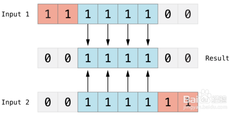
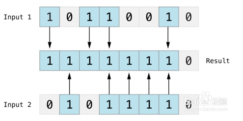
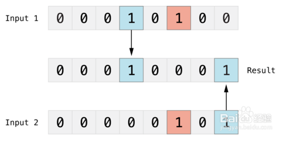
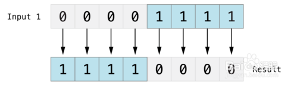
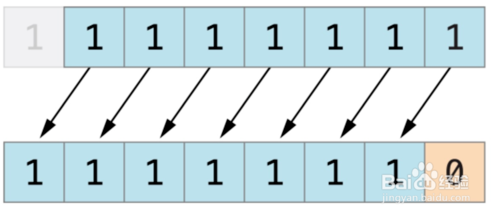
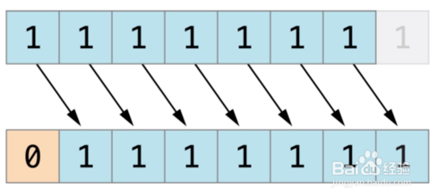

# 位运算符详解

引用：https://jingyan.baidu.com/article/1612d5008ff5b7e20f1eee4c.html

位运算符比一般的算数运算符速度要快，而且可以实现一些算数运算符不能实现的功能。如果要开发高效率程序，位运算符是必不可少的。位运算符用来对二进制位进行操作，包括：按位与（&）、按位或（|）、按位异或（^）、按位取反（~）、按位左移（<<）、按位右移（>>）。下面就给大家介绍位运算符的详细用法。

**指定A = 60（0011 1100）； B = 13（0000 1101）**

## 按位与（&）

对两个数进行操作，然后返回一个新的数，这个数的每个位都需要两个输入数的同一位都为1时才为1，如下图：

（A & B）结果为12，二进制位0000 1000

## 按位或（|）

比较两个数，然后返回一个新的数，这个数的每一位设置1的条件是两个输入数的同一位都不为0（即任意一个为1，或都为1），如下图：

（A|B）结果为61，二进制位0011 1101

按位异或（^）

比较两个数，然后返回一个数，这个数的每个位设为1的条件是两个输入的同一位不同，如果相同就设为0，如下图：

（A^B）结果为49，二进制位0011 0001

## 按位取反

对一个操作数的每一位后取反，如下图：

（~A）结果为-61，二进制位1100 0011

## 按位左移（<<）

将操作数的所有位向左移动指定的位数。

下图展示了11111111 << 1（11111111左移一位）的结果。蓝色数字表示被移动位，灰色表示被丢弃位，空位用橙色的0填充。

（A<<2）结果为240，二进制位1111 0000

## 按位右移（>>）

将操作数的所有位向右移动指定的位数。
下图展示了11111111 >> 1（11111111右移一位）的结果。蓝色数字表示被移动位，灰色表示被丢弃位，空位用橙色的0填充。
A>>2结果为15，二进制位0000 1111

