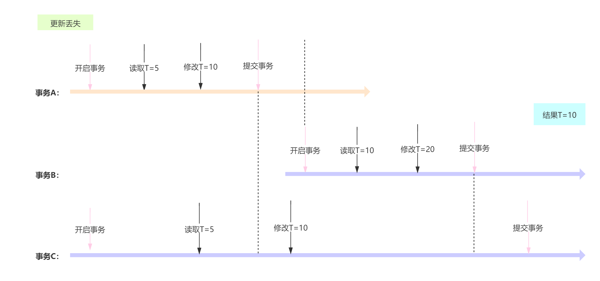
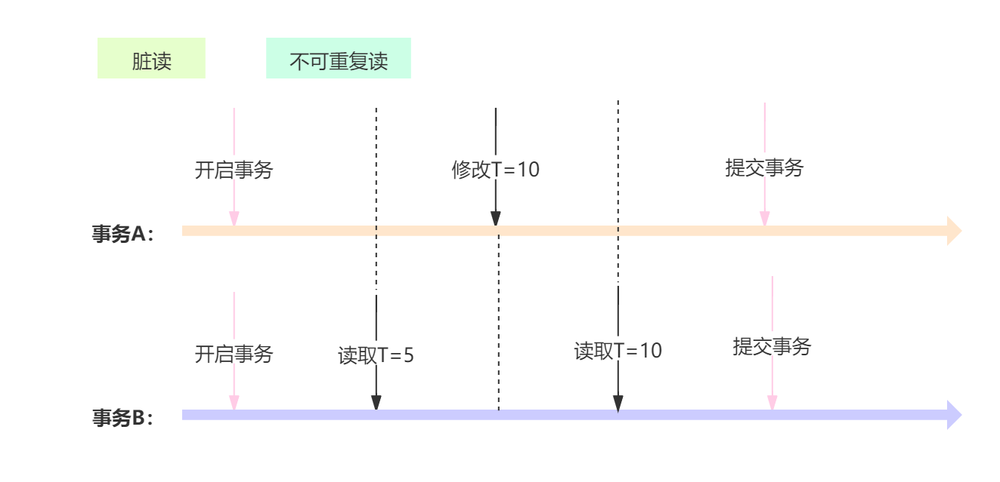
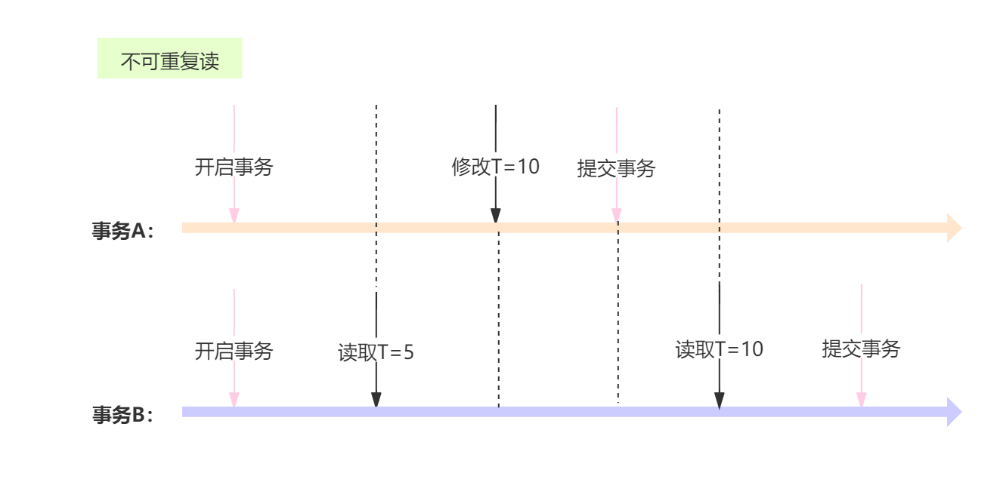
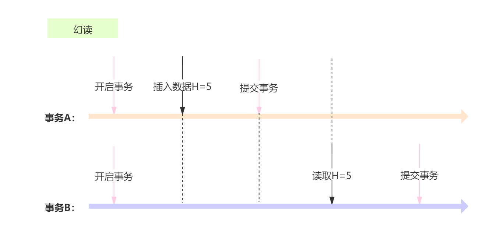

# MySQL事务

## 事务控制

MySQL通过`SET AUTOCOMMIT`、`START TRANSACTION`、`COMMIT`、`ROLLBACK`等语句支持本地事务。

语法如下：

```mysql
$ START TRANSACTION | BEGIN [WORK]
$ COMMIT   [WORK] [AND [NO] CHAIN] [[NO] RELEASE]
$ ROLLBACK [WORK] [AND [NO] CHAIN] [[NO] RELEASE]
$ SET AUTOCOMMIT = {0|1}
```

默认情况下，MySQL是自动提交（AUTOCOMMIT）的，如果需要通过明确的COMMIT和ROLLBACK来提交和回滚事务，那么需要通过明确的事务控制命令来开始事务。

- START TRANSACTION或BEGIN语句开始一项新的事务。
- COMMIT和ROLLBACK用来提交和回滚事务。
- CHAIN和RELEASE子句分别用来定义在事务提交或者回滚之后的操作：
  - CHAIN会立即启动一个新事务，并且和刚才的事务具有相同的隔离级别。
  - RELEASE会断开和客户端的连接。
- SET AUTOCOMMIT可以修改当前连接的提交方式，如果设置了SET AUTOCOMMIT=0，则设置之后的所有事务都需要通过明确的命令进行提交或者回滚。

> Node：
>
> - 如果只是对某些语句需要进行事务控制，则使用START TRANSACTION语句开始一个事务比较方便，这样事务结束之后可以自动回到自动提交的方式。
> - 如果希望所有的事务都不是自动提交的，那么通过修改AUTOCOMMIT来控制事务比较方便，这样不用在每个事务开始的时候再执行START TRANSACTION语句。

*START TRANSACTION示例：*

- 第一步：session 1通过start transaction开启事务，并插入id=10的数据。

  ```mysql
  mysql> start transaction;
  Query OK, 0 rows affected (0.00 sec)
  
  mysql> insert into user values (10,'Lisa','Tom');
  Query OK, 1 row affected (0.00 sec)
  ```

- 第二步：session 2查询id=10的数据，查询不到。

  ```mysql
  mysql> select * from user where id=10;
  Empty set (0.00 sec)
  ```

- 第三步：session 1提交事务，同时，session 2再次查询id=10的数据，可以查询到。

  session 1

  ```mysql
  mysql> commit;
  Query OK, 0 rows affected (0.11 sec)
  ```

  session 2

  ```mysql
  mysql> select * from user where id=10;
  +----+----------+----------+
  | id | username | nickname |
  +----+----------+----------+
  | 10 | Lisa     | Tom      |
  +----+----------+----------+
  1 row in set (0.00 sec)
  ```

- 第四步：session 1再次插入id=11的新数据，此时事务是按照自动提交的。

  session 1

  ```mysql
  mysql> insert into user values (11,'Lisa','Tom');
  Query OK, 1 row affected (0.00 sec)
  ```

  session 2直接查询可以查询到。

  session 2

  ```mysql
  mysql> select * from user where id=11;
  +----+----------+----------+
  | id | username | nickname |
  +----+----------+----------+
  | 11 | Lisa     | Tom      |
  +----+----------+----------+
  1 row in set (0.00 sec)
  ```

*START TRANSACTION and CHAIN示例：*

- 前面两步与“*START TRANSACTION示例*”一样，第三步开始不同。

- 第三步：session 1通过commit and chain提交事务，同时session 2可以查询到id-10的数据。

  session 1

  ```mysql
  mysql> commit and chain;
  Query OK, 0 rows affected (0.14 sec)
  ```

  session 2

  ```mysql
  mysql> select * from user where id=10;
  +----+----------+----------+
  | id | username | nickname |
  +----+----------+----------+
  | 10 | Lisa     | Tom      |
  +----+----------+----------+
  1 row in set (0.00 sec)
  ```

- 第四步：session 1再次插入id=11的新数据，因为在第三步的时候是通过commit and chain提交的事物，因此此时自动开启了一个新的事物，此事务是不在是自动提交的。因此，session 2直接查询不到。

  session 1

  ```mysql
  mysql> insert into user values (11,'Lisa','Tom');
  Query OK, 1 row affected (0.00 sec)
  ```

  session 2查询。

  session 2

  ```mysql
  mysql> select * from user where id=11;
  Empty set (0.00 sec)
  ```

- 第五步：session 1提交事务，session 2可以查询到。

  session 1

  ```mysql
  mysql> commit;
  Query OK, 0 rows affected (0.09 sec)
  ```

  session 2查询。

  session 2

  ```mysql
  mysql> select * from user where id=11;
  +----+----------+----------+
  | id | username | nickname |
  +----+----------+----------+
  | 11 | Lisa     | Tom      |
  +----+----------+----------+
  1 row in set (0.00 sec)
  ```

------

在锁表期间，用`START TRANSACTION`命令开始一个新的事务，会造成一个隐含的`UNLOCK TABLES`被执行。

*START TRANSACTION隐式执行UNLOCK TABLES：*

- 第一步：session 1对user表加写锁。

  session 1

  ```mysql
  mysql> lock table user write;
  Query OK, 0 rows affected (0.03 sec)
  ```

- 第二步：session 2对user表进行查询，因为user表已经被session 1锁定，所以阻塞等待。

  session 2

  ```mysql
  mysql> select * from user where id=10;
  等待
  ```

- 第三步：session 1插入id=10的数据，然后回滚。

  session 1

  ```mysql
  mysql> insert into user values (10,'Lisa','Tom');
  Query OK, 1 row affected (0.10 sec)
  
  mysql> rollback;
  Query OK, 0 rows affected (0.00 sec)
  ```

- 第四步：session 1通过start transaction开启一个新的事务。

  session 1

  ```mysql
  mysql> start transaction;
  Query OK, 0 rows affected (0.00 sec)
  ```

  session 1在表锁定期间通过start transaction开启一个新的事务，隐含的执行了UNLOCK TABLES，释放了表锁，session 2查询得出结果。

  session 2

  ```mysql
  mysql> select * from user where id=10;
  +----+----------+----------+
  | id | username | nickname |
  +----+----------+----------+
  | 10 | Lisa     | Tom      |
  +----+----------+----------+
  1 row in set (47.42 sec)
  ```

  

### SAVEPOINT

- 在事务中可以通过定义`SAVEPOINT`，指定回滚事务的一个部分，但是不能指定提交事务的一个部分。
- 对于复杂的应用，可以定义多个不同的`SAVEPOINT`，满足不同的条件时，回滚不同的`SAVEPOINT`。
- 如果定义了相同名字的`SAVEPOINT`，则后面定义的`SAVEPOINT`会覆盖之前的定义。
- 对于不在需要使用的`SAVEPOINT`，可以通过`RELEASE SAVEPOINT`命令删除`SAVEPOINT`，删除后的`SAVEPOINT`不能再执行`ROLLBACK TO SAVEPOINT`命令。

*指定回滚事务的一个部分：*


## 事务（Transaction）及其ACID属性

事务的ACID属性：

- **原子性（Atomicity）**：事务是一个原子操作单元，其对数据的修改，要么全部执行，要么全都不执行。
- **一致性（Consistent）**：在事务开始和完成时，数据都必须保持一致状态。这意味着所有相关的数据规则都必须应用于事务的修改，以保持数据的完整性；事务结束时，所有的内部数据结构（如B树索引或双向链表）也都必须是正确的。
- **隔离性（Isolation）**：数据库系统提供一定的隔离机制，保证事务在不受外部并发操作影响的“独立”环境执行。这意味着事务处理过程中的中间状态对外部是不可见的，反之亦然。
- **持久性（Durable）**：事务完成之后，它对于数据的修改是永久性，即使出现系统故障也能保持。

## 并发事务处理带来的问题

相对于串行处理来说，并发事务处理能大大增加数据库资源的利用率，提高数据库系统的事务吞吐量，从而可以支持更多的用户。但并发事务处理也会带来一些问题，主要包括一下几种情况：

- **更新丢失（Lost Update）**：当两个或多个事务选择同一行，然后基于最初选的的值更新该行时，由于每个事务都不知道其他事务的存在，就会发生丢失更新问题——最后的更新覆盖了由其他事务所做的更新。

  

- **脏读（Dirty Reads）**：一个事务正对一条记录做修改，在这个事务完成并提交前，这条记录的数据就处于不一致状态；这时，另一个事务也来读取同一条记录，如果不加控制，第二个事务读取了这些“脏”数据，并据此做进一步的处理，就会产生未提交的数据依赖关系。这种现象被形象的称为“脏读”。

  

- **不可重复读（Non-Repeatable Reads）**：一个事务在读取某些数据后的某个时间，再次读取以前读过的数据，却发现其读出的数据已经发生了改变，或某些记录已经被删除了。这种现象就叫做“不可重复读”。

  

- **幻读（Phantom Reads）**：一个事务按相同的查询条件重新读取以前检索过的数据，却发现其他事务插入了满足其查询条件的新数据，这种现象称为“幻读”。

  

> Note：“更新丢失”通常是应该完全避免的，但防止更新丢失，并不能单靠数据库事务控制器来解决，需要应用程序对要更新的数据加必要的锁来解决。因此，防止更新丢失应该是应用的责任。

## 事务隔离级别

“脏读”、“不可重复读”和“幻读”，都是数据库读一致性问题，必须由数据库提供一定的事务隔离机制来解决。数据库实现事务隔离的方式，基本上可分为以下两种：

- 在读取数据前，对其加锁，阻止其他事务对数据进行修改。
- 不用加任何锁，通过一定机制生成一个数据请求时间点的一致性数据快照，并用这个快照来提供一定级别（语句级或事务级）的一致性读取。从用户的角度来看，好像是数据库可以提供同一数据的多个版本，因此，这种技术叫做数据多版本并发控制（MultiVersion Concurrency Control，简称MVCC或MCC），也经常称为多版本数据库。

ISO/ANSI SQL92定义了是个事务隔离级别：

| 隔离级别                         | 读数据一致性                               | 脏读 | 不可重复读 | 幻读 |
| -------------------------------- | ------------------------------------------ | ---- | ---------- | ---- |
| **读未提交（Read uncommitted）** | 只能保证不读取物理上损坏的数据（最低级别） | √    | √          | √    |
| **读已提交（Read committed）**   | 语句级                                     | ×    | √          | √    |
| **可重复读（Repeatable read）**  | 事务级                                     | ×    | ×          | √    |
| **串行化（Serializable）**       | 事务级（最高级别）                         | ×    | ×          | ×    |

数据库的事务隔离越严格，并发副作用越小，但付出的代价也就越大，因为事务隔离实质上就是使事务在一定程度上“串行化”，这显然与“并发”是矛盾的。同时，不同的应用对读一致性和事务隔离程度的要求也是不同的，比如许多应用对“不可重复读”和“幻读”并不敏感，可能更关心数据并发访问的能力。

上述四个隔离级别每个的隔离程度不同，允许出现的副作用也不同，应用可以根据自己的业务逻辑要求，通过选择不同的隔离级别来平衡“隔离”与“并发”的矛盾。

> 各个数据库并不一定完全实现了上述4个隔离级别，
>
> 例如：
>
> - Oracle只提供了READ COMMITTED和SERIALIZABLE两个标准隔离级别。还提供了自己定义的READ ONLY隔离级别。
> - SQL Server除了支持上述ISO/ANSI SQL92定义的4个隔离级别外，还支持一个叫做“快照”的隔离级别。
> - MySQL支持全部4个隔离级别。

对于可重复读（Repeatable read），在上述表格中声明仍然会产生幻读现象，但目前MySQL数据库已经在一定程度上解决了幻读的问题，但并没有完全解决。怎么理解呢？回忆一下幻读的情形，幻读是指事务在对一条数据第一次读取时没有读取到，第二次读取数读取到了，产生了幻觉，即为幻读。**对于可重复读（Repeatable read），第一次如果没有读取到，那么以后无论多少次读取都不会读取到，既不会产生幻读现象，但前提是没有在事务中对这个条数据进行修改过**。参见隔离级别验证——可重复读——幻读验证。

## 查询隔离级别

select语法查询：

```mysql
select @@transaction_isolation;
```

variables变量查询：

```mysql
mysql> show global variables like '%isolation%';
+-----------------------+--------------+
| Variable_name         | Value        |
+-----------------------+--------------+
| transaction_isolation | SERIALIZABLE |
+-----------------------+--------------+
1 row in set, 1 warning (0.00 sec)
```

## 更改的隔离级别

**SET语法设置**

语法：

```mysql
SET [GLOBAL | SESSION] TRANSACTION ISOLATION LEVEL 
	[READ UNCOMMITTED | READ COMMITTED | REPEATABLE READ | SERIALIZABLE];
```

说明：

- 如果设置范围为`GLOBAL`，则将当前设置的隔离级别应用于*之后的所有session*。注意：已存在的session不受影响。
- 如果设置范围为`SESSION`，则将*当前的session之后的所有事务*应用为对应的隔离级别。
- 如果不设置范围，则将*当前的session之后的下一个事务*应用为对应的隔离级别。

设置：

- 读未提交

  ```mysql
  SET GLOBAL TRANSACTION ISOLATION LEVEL READ UNCOMMITTED;
  ```
- 读已提交

  ```mysql
  SET GLOBAL TRANSACTION ISOLATION LEVEL READ COMMITTED;
  ```
- 可重复读

  ```mysql
  SET GLOBAL TRANSACTION ISOLATION LEVEL REPEATABLE READ;
  ```
- 串行化

  ```mysql
  SET GLOBAL TRANSACTION ISOLATION LEVEL SERIALIZABLE;
  ```


**SET变量设置**

```mysql
set global transaction_isolation='read-uncommitted';
set global transaction_isolation='read-committed';
set global transaction_isolation='repeatable-read';
set global transaction_isolation='serializable';
```

## 隔离级别验证

### 读未提交（Read uncommitted）

首先将Mysql的隔离级别变更为READ-UNCOMMITTED。

**验证幻读**

- 第一步：确认隔离级别。

  session 1 and session 2

  ```mysql
  mysql> select @@transaction_isolation;
  +-------------------------+
  | @@transaction_isolation |
  +-------------------------+
  | READ-UNCOMMITTED        |
  +-------------------------+
  1 row in set (0.00 sec)
  ```

- 第二步：session 1和session 2开启事务，并查询一条不存在的数据。

  session 1 and session 2

  ```mysql
  mysql> set autocommit=0;
  Query OK, 0 rows affected (0.00 sec)
  
  mysql> select * from user where id=10;
  Empty set (0.00 sec)
  ```

- 第三步：session 1插入该数据，并提交。

  session 1

  ```mysql
  mysql> insert into user values (10,'k123456','Xavier');
  Query OK, 1 row affected (0.00 sec)
  
  mysql> commit;
  Query OK, 0 rows affected (0.09 sec)
  ```

- 第四步：session 2查询该数据，session 2却可以查询到——产生了幻读。

  session 2

  ```mysql
  mysql> select * from user where id=10;
  +----+----------+----------+
  | id | username | nickname |
  +----+----------+----------+
  | 10 | k123456  | Xavier   |
  +----+----------+----------+
  1 row in set (0.00 sec)
  ```

------

**验证脏读**

- 第一步：确认隔离级别。

  session 1 and session 2

  ```mysql
  mysql> select @@transaction_isolation;
  +-------------------------+
  | @@transaction_isolation |
  +-------------------------+
  | READ-UNCOMMITTED        |
  +-------------------------+
  1 row in set (0.00 sec)
  ```

- 第二步：session 1和session 2开启事务，并查询id等于10的数据。

  session 1 and session 2

  ```mysql
  mysql> set autocommit=0;
  Query OK, 0 rows affected (0.00 sec)
  
  mysql> select * from user where id=10;
  +----+----------+----------+
  | id | username | nickname |
  +----+----------+----------+
  | 10 | k123456  | Xavier   |
  +----+----------+----------+
  1 row in set (0.00 sec)
  ```

- 第三步：session 1更新id等于10的数据（将username由k123456更新为T123456）。

  session 1

  ```mysql
  mysql> update user set username='T123456' where id=10;
  Query OK, 1 row affected (0.00 sec)
  Rows matched: 1  Changed: 1  Warnings: 0
  ```

- 第四步：session 2查询该数据，session 1并没有commit，session 2却可以查询到session 1更新的结果——脏读。

  session 2

  ```mysql
  mysql> select * from user where id=10;
  +----+----------+----------+
  | id | username | nickname |
  +----+----------+----------+
  | 10 | T123456  | Xavier   |
  +----+----------+----------+
  1 row in set (0.00 sec)
  ```

------

**不可重复读**

- 第一步：确认隔离级别。

  session 1 and session 2

  ```mysql
  mysql> select @@transaction_isolation;
  +-------------------------+
  | @@transaction_isolation |
  +-------------------------+
  | READ-UNCOMMITTED        |
  +-------------------------+
  1 row in set (0.00 sec)
  ```

- 第二步：session 1和session 2开启事务，并查询id等于10的数据。

  session 1 and session 2

  ```mysql
  mysql> set autocommit=0;
  Query OK, 0 rows affected (0.00 sec)
  
  mysql> select * from user where id=10;
  +----+----------+----------+
  | id | username | nickname |
  +----+----------+----------+
  | 10 | k123456  | Xavier   |
  +----+----------+----------+
  1 row in set (0.00 sec)
  ```

- 第三步：session 1更新id等于10的数据（将username由k123456更新为T123456），并提交。

  session 1

  ```mysql
  mysql> update user set username='T123456' where id=10;
  Query OK, 1 row affected (0.00 sec)
  Rows matched: 1  Changed: 1  Warnings: 0
  
  mysql> commit;
  Query OK, 0 rows affected (0.09 sec)
  ```

- 第四步：session 2查询该数据，session 2却可以查询到session 1更新的结果——产生了不可重复读。

  session 2

  ```mysql
  mysql> select * from user where id=10;
  +----+----------+----------+
  | id | username | nickname |
  +----+----------+----------+
  | 10 | T123456  | Xavier   |
  +----+----------+----------+
  1 row in set (0.00 sec)
  ```

------

### 读已提交（Read committed）

首先将Mysql的隔离级别变更为READ-COMMITTED。

**验证脏读**

- 第一步：确认隔离级别。

  session 1 and session 2

  ```mysql
  mysql> select @@transaction_isolation;
  +-------------------------+
  | @@transaction_isolation |
  +-------------------------+
  | READ-COMMITTED          |
  +-------------------------+
  1 row in set (0.00 sec)
  ```
  
- 第二步：session 1和session 2开启事务，并查询id等于10的数据。

  session 1 and session 2

  ```mysql
  mysql> set autocommit=0;
  Query OK, 0 rows affected (0.00 sec)
  
  mysql> select * from user where id=10;
  +----+----------+----------+
  | id | username | nickname |
  +----+----------+----------+
  | 10 | T123456  | Xavier   |
  +----+----------+----------+
  1 row in set (0.00 sec)
  ```
  
- 第三步：session 1更新id等于10的数据（将username由T123456更新为K123456）。

  session 1

  ```mysql
  mysql> update user set username='K123456' where id=10;
  Query OK, 1 row affected (0.00 sec)
  Rows matched: 1  Changed: 1  Warnings: 0
  ```
  
- 第四步：session 2查询结果，username仍为T123456，并未发生脏读。

  session 2

  ```mysql
  mysql> select * from user where id=10;
  +----+----------+----------+
  | id | username | nickname |
  +----+----------+----------+
  | 10 | T123456  | Xavier   |
  +----+----------+----------+
  1 row in set (0.00 sec)
  ```

------

**验证不可重复读**

紧接着上面验证脏读的步骤

- 第五步：session 1查询结果，已经被更新了。提交。

  session 1

  ```mysql
  mysql> select * from user where id=10;
  +----+----------+----------+
  | id | username | nickname |
  +----+----------+----------+
  | 10 | K123456  | Xavier   |
  +----+----------+----------+
  1 row in set (0.00 sec)
  
  mysql> commit;
  Query OK, 0 rows affected (0.07 sec)
  ```
  
- 第六步：session 2查询结果，username已经被变更为了K123456，发生了不可重复读。

  session 2

  ```mysql
  mysql> select * from user where id=10;
  +----+----------+----------+
  | id | username | nickname |
  +----+----------+----------+
  | 10 | K123456  | Xavier   |
  +----+----------+----------+
  1 row in set (0.00 sec)
  ```

------

**验证幻读**

跟*读未提交（Read uncommitted）*的幻读验证流程一样。

------

### 可重复读（Repeatable read）

**验证脏读**

跟*读已提交（Read committed）*的脏读验证流程一样。

------

**验证不可重复读**

紧接着上面验证脏读的步骤

- 第五步：session 1查询结果，已经被更新了。提交。

  session 1

  ```mysql
  mysql> select * from user where id=10;
  +----+----------+----------+
  | id | username | nickname |
  +----+----------+----------+
  | 10 | K123456  | Xavier   |
  +----+----------+----------+
  1 row in set (0.00 sec)
  
  mysql> commit;
  Query OK, 0 rows affected (0.07 sec)
  ```

- 第六步：session 2查询结果，username仍为T123456，并未发生不可重复读，即是可重复读的。

  session 2

  ```mysql
  mysql> select * from user where id=10;
  +----+----------+----------+
  | id | username | nickname |
  +----+----------+----------+
  | 10 | T123456  | Xavier   |
  +----+----------+----------+
  1 row in set (0.00 sec)
  ```

------

**验证幻读**

- 第一步：确认隔离级别。

  session 1 and session 2

  ```mysql
  mysql> select @@transaction_isolation;
  +-------------------------+
  | @@transaction_isolation |
  +-------------------------+
  | REPEATABLE-READ         |
  +-------------------------+
  1 row in set (0.00 sec)
  ```
- 第二步：session 1和session 2开启事务，并查询id等于10的数据。

  session 1 and session 2

  ```mysql
  mysql> select * from user where id=10;
  Empty set (0.00 sec)
  ```
- 第三步：session 1插入id为10的数据，并提交，最后查询结果。

  session 1

  ```mysql
  mysql> insert into user values (10,'K123456','Xavier');
  Query OK, 1 row affected (0.00 sec)
  
  mysql> commit;
  Query OK, 0 rows affected (0.09 sec)
  
  mysql> select * from user where id=10;
  +----+----------+----------+
  | id | username | nickname |
  +----+----------+----------+
  | 10 | K123456  | Xavier   |
  +----+----------+----------+
  1 row in set (0.00 sec)
  ```
- 第四步：session 2查询此数据，仍然为空，没有出现幻读。

  session 2

  ```mysql
  mysql> select * from user where id=10;
  Empty set (0.00 sec)
  ```
- 第五步：session 2更新此数据（将username有K123456变更为T123456）—— 更新成功。

  session 2

  ```mysql
  mysql> update user set username='T123456' where id=10;
  Query OK, 1 row affected (0.00 sec)
  Rows matched: 1  Changed: 1  Warnings: 0
  ```
- 第六步：session 2再次查询，可以查询到，出现了幻读。

  session 2

  ```mysql
  mysql> select * from user where id=10;
  +----+----------+----------+
  | id | username | nickname |
  +----+----------+----------+
  | 10 | T123456  | Xavier   |
  +----+----------+----------+
  1 row in set (0.00 sec)
  ```
  
  

------

### 串行化（Serializable）

**验证脏读**

- 第一步：确认隔离级别。

  session 1 and session 2

  ```mysql
  mysql> select @@transaction_isolation;
  +-------------------------+
  | @@transaction_isolation |
  +-------------------------+
  | SERIALIZABLE            |
  +-------------------------+
  1 row in set (0.00 sec)
  ```

- 第二步：session 1和session 2开启事务，并查询id等于10的数据。

  session 1 and session 2
  
  ```mysql
  mysql> set autocommit=0;
  Query OK, 0 rows affected (0.00 sec)
  
  mysql> select * from user where id=10;
  +----+----------+----------+
  | id | username | nickname |
  +----+----------+----------+
  | 10 | T123456  | Xavier   |
  +----+----------+----------+
  1 row in set (0.00 sec)
  ```
  
- 第三步：session 1更新id等于10的数据（将username由T123456更新为K123456）。

  session 1

  ```mysql
  mysql> update user set username='K123456' where id=10;
  等待
  ```
  
- 第四步：session 2执行commit提交，session 1获取到了锁，更新成功。

  session 2

  ```mysql
  mysql> commit;
  Query OK, 0 rows affected (0.00 sec)
  ```
  
  session 1
  
  ```mysql
  mysql> update user set username='K123456' where id=10;
  Query OK, 1 row affected (37.94 sec)
  Rows matched: 1  Changed: 1  Warnings: 0
  ```

如上验证所示，session 1在更新的时候，直接阻塞等待串行化，因此，必然不会出现脏读的情况。

------

**验证不可重复读**

如上验证所示，session 1在更新的时候，直接阻塞等待串行化，因此，必然不会出现不可重复读的情况。

------

**验证幻读**

- 第一步：确认隔离级别。

  session 1 and session 2

  ```mysql
  mysql> select @@transaction_isolation;
  +-------------------------+
  | @@transaction_isolation |
  +-------------------------+
  | SERIALIZABLE            |
  +-------------------------+
  1 row in set (0.00 sec)
  ```

- 第二步：session 1和session 2开启事务，并查询id等于12的数据。

  session 1 and session 2
  
  ```mysql
  mysql> set autocommit=0;
  Query OK, 0 rows affected (0.00 sec)
  
  mysql> select * from user where id=12;
  Empty set (0.00 sec)
  ```
  
- 第三步：session 1插入id等于12的数据。

  session 1

  ```mysql
  mysql> insert into user values ('12','Q123456','Hill');
  等待
  ```
  
- 第四步：session 2执行commit提交，session 1获取到了锁，插入成功。

  session 2

  ```mysql
  mysql> commit;
  Query OK, 0 rows affected (0.00 sec)
  ```
  
  session 1
  
  ```mysql
  mysql> insert into user values ('12','Q123456','Hill');
  Query OK, 1 row affected (6.91 sec)
  ```

如上验证所示，session 1在插入的时候，直接阻塞等待串行化，因此，必然不会出现幻读的情况。


