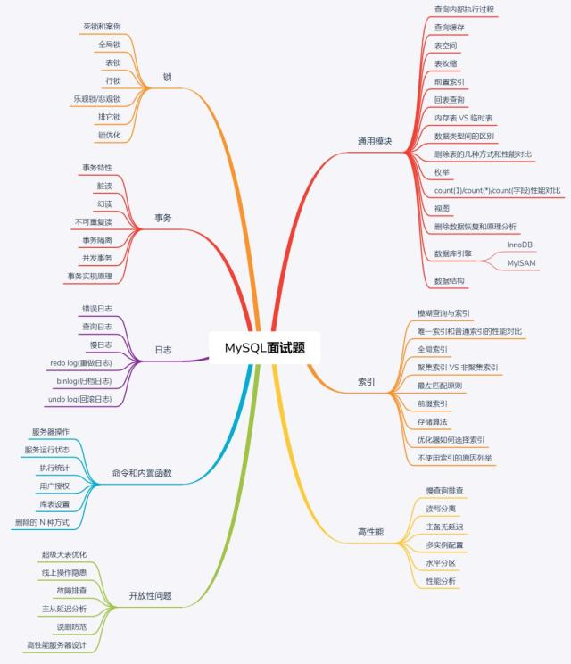

# Mysql典型面试问题

- **第一部分：通用模块。**此部分对MySQL整体概念、执行流程、数据库引擎、查询缓存、表空间、回表查询、数据类型间的区别、内存表、临时表、删除表的n中方式、枚举、视图、数据恢复等相关知识点对应的面试题进行解答。
- **第二部分：索引模块。**索引的好坏直接影响数据库的性能，所以索引的面试题也是面试中比问的问题，此部分为索引对应的面试题合集。
- **第三部分：事务模块。**事务决定了程序的稳定性，在MySQL中的地位也是数首屈一指，也是面试中必问的面试题，此部分为事务对应的面试题合集。
- **第四部分：锁。**锁包括：全局锁，表锁、行锁、死锁、乐观锁、悲观锁等，不同的数据库引擎支持的锁支持力度也是不同的，此部分的面试题，让你彻底搞定锁相关的面试题。
- **第五部分：日志。**日志看似不起眼，确实MySQL主备同步和容灾恢复以及问题排除的关键，当然也是面试中必问的问题，这部分会对不同的数据库引擎中的重点日志，进行详细的介绍。
- **第六部分：MySQL操作命令和内置函数。**MySQL的操作命令，对于程序员或者DBA来说也是必须具备的一项技能，比如，用户和权限的创建、数据库相关信息的查询等，都离不开对MySQL命令行的掌握。对内置函数的掌握程度，代表了你对MySQL的掌握程序，善用MySQL提供的内置函数，会让你有事半功倍的效果，内置函数也是笔试比考的面试题。
- **第七部分：性能优化和分布式。**性能优化和分布式是面试中决定你高度的关键指标，其中性能优化包括了慢查询的分析和处理，对分布式的掌握体现了你的技术深度。
- **第八部分：开放性问题。**很多大公司最后也会问一下没有标准答案的开放性问题，以考察面试者的技术能力边界和对待问题的分析思路，这部分助你更平稳的获得offer。

对应的知识图谱如下：

