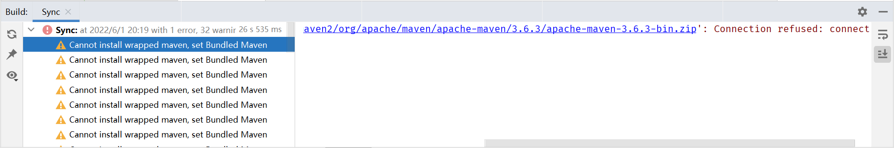
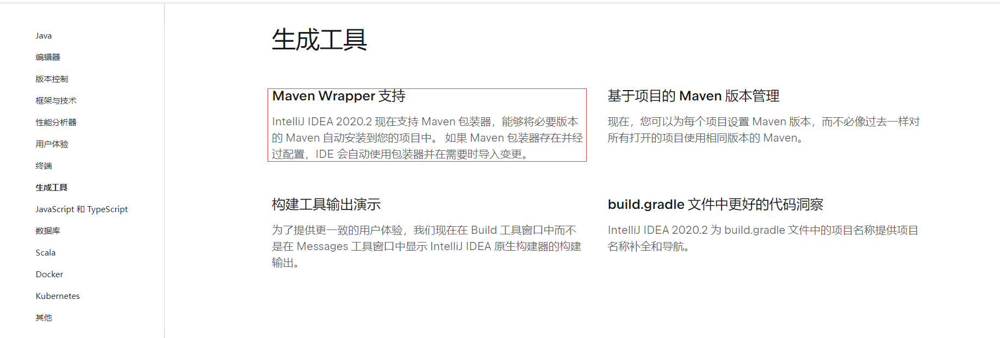

# IDEA Maven pom.xml卡顿

## 问题描述

在通过IDEA使用Maven的时候编辑pom.xml文件非常卡顿，每次进行一点小小的编辑，“半天”都反应不过来。仔细观察，在IDEA的右下角，Sync窗口在下载什么东西，但是最终下载失败。



看起来在下载Maven。查看Settings中的Maven选项卡，可以看到`Maven hone directory`（自定义本地Maven路径）已经指定了一个Maven文件的目录，其目录中存在Maven压缩包。

## 原因分析

### IntelliJ IDEA 2020.2新特性

进入到JetBrains官网，查看IntelliJ IDEA 2020.2[最新变化](https://www.jetbrains.com/zh-cn/idea/whatsnew/2020-2/#page__content-build-tools)，如下图所示：



IntelliJ IDEA 2020.2增加了对Maven Wrapper的支持，这就是导致idea maven卡顿的原因。

### IDEA中的Maven Wrapper

这个Maven Wrapper和Gradle Wrapper类似，简而言之就是自带了一个Maven/Gradle的包，省去了安装、版本不一致等问题。而IntelliJ IDEA 2020.2增加了对该功能的支持，即不需要手动配置Maven了，当项目下存在`.mvn/wrapper/maven-wrapper.properties`文件时，就会根据该文件的信息，直接下载对应版本的Maven包。意味着一个Maven项目，即使我们的本地环境没有安装Maven，那么Idea也会根据这个配置文件的信息替我们自动下载一个Maven包并安装，使项目可以正常编译并运行。

打开`maven-wrapper.properties`，内容如下：

```properties
distributionUrl=https://repo.maven.apache.org/maven2/org/apache/maven/apache-maven/3.6.3/apache-maven-3.6.3-bin.zip
wrapperUrl=https://repo.maven.apache.org/maven2/io/takari/maven-wrapper/0.5.6/maven-wrapper-0.5.6.jar
```

可以看到声明了两个URL的网络地址，IDEA会根据这个地址去下载对应版本的Maven包。当我们尝试通过`distributionUrl`的地址取下载Maven时一般会出现两种情况：

1. **repo.maven.apache.org** 拒绝了我们的连接请求（需要翻墙）。
2. 下载速度缓慢，只有几K到几十K的下载速度。

出现这两种情况，意味着如果在`%USERPROFILE%\.m2\wrapper\dists\apache-maven-3.6.3-bin\1iopthnavndlasol9gbrbg6bf2`目录下没有对应版本的Maven包的话，当我们在一个项目中，Reading pom.xml时，将会自动从`distributionUrl`下载对应Maven包，由于拒绝连接或者速度缓慢，进而下载失败。而这个等待下载的过程就会导致卡段。

### 下载路径

默认情况下，自动下载的Maven包会安装在`%USERPROFILE%\.m2\wrapper\dists\apache-maven-3.6.3-bin\1iopthnavndlasol9gbrbg6bf2`目录下，因此，我们可以提前下载好对应版本的Maven包，放置在该目录下，那么就可以避免Reading pom.xml时的下载了。

### .mvn文件夹

项目的`.mvn`文件夹下有一个`maven-wrapper.jar`和`maven-wrapper.properties`文件。如果项目中存在这个文件夹的话，那么手动在Settings中设置的maven路径是无效的，最后还是会自动更改为`%USERPROFILE%\.m2\wrapper\dists\apache-maven-3.6.3-bin\1iopthnavndlasol9gbrbg6bf2`目录或者IDEA的默认路径。所以删除`.mvn`文件夹或者删除`maven-wrapper.properties`文件也可以解决问题。

## 解决方案

1. 删除项目内的`.mvn`文件夹，或者删除`.mvn`文件夹内的`maven-wrapper.properties`文件。
2. 提前下载好对应版本的Maven包，将其放置在`%USERPROFILE%\.m2\wrapper\dists\apache-maven-3.6.3-bin\1iopthnavndlasol9gbrbg6bf2`目录下。
3. 一个可以翻墙的好网络。