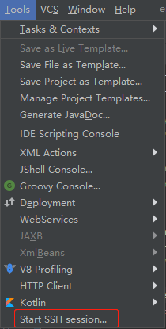

# IDEA SSH

## 1、SSH会话 

IDEA提供了类似xshell的SSH功能，位于菜单栏`Tools` → `Start SSH Session`。

点击 `Start SSH Session`就会弹出会话连接界面，如下：

输入Host，User name，Password等认证信息之后直接点击OK就可以打开SSH终端。

## 2、保存SSH会话

直接使用`Start SSH Session`有一个问题在于每一次需要开启会话的时候，都需要重新输入Host，User name，Password等认证信息。IDEA提供了可以持久化保存认证信息的方式：通过`Tools` → `Deployment` → `Configuration`进行配置。如下：

点击右上角的+号，选择SFTP。

输入一个当前连接的名字。比如“阿里云服务器1”。

输入主机，用户名，密码等信息，点击OK保存即可

现在再次点击`Tools` → `Start SSH Session`，就不在直接是会话连接界面了，而是可以选择已经存储的会话。点击`Edit credentials`会进入到会话连接界面，点击其他的就会直接连接到具体的会话。 如下：

## 3、上传本地文件

要想上传本地文件，首先需要配置远程服务器的接收目录，如下：

>  注意：
>
> 1. Deployment path必须配置，如果没有配置，将不能上传，上传按钮是灰色。
> 2. Local path默认是当前项目的根路径，只有在Local path才可以上传。

选中要上传的文件：右键 → Deployment  → Upload to xxx即可上传（如果没有配置Deployment path，Deployment是灰色不可选状态）。

或者选中要上传的文件：Tools → Deployment  → Upload to xxx即可上传（如果没有配置Deployment path，是没有Upload to xxx选项的）。

## 4、编辑远程服务器文件

Tools → Deployment可以浏览远程主机的文件目录，通过Browse Remote Host打开，如下：

点击Browse Remote Host，可以打开菜单Remote Host。注意其中呈浅褐色的目录，这表示为映射的Deployment path目录。如下：

编辑远程文件，如下图所示，找到需要编辑的文件，双击打开，编辑完成之后，点击右上角的按钮上传即可。

