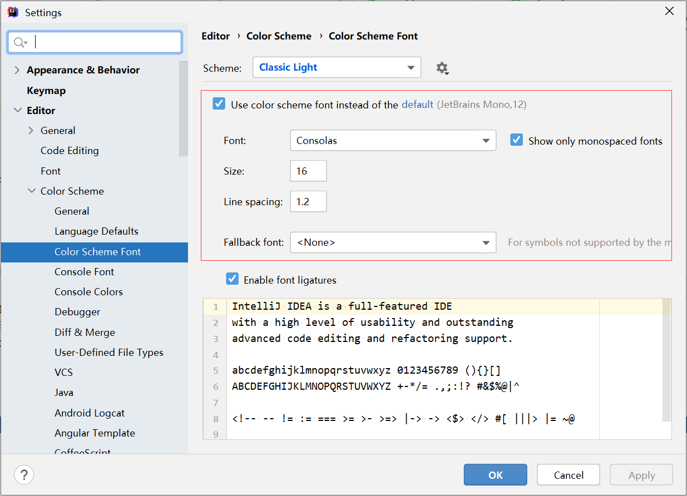
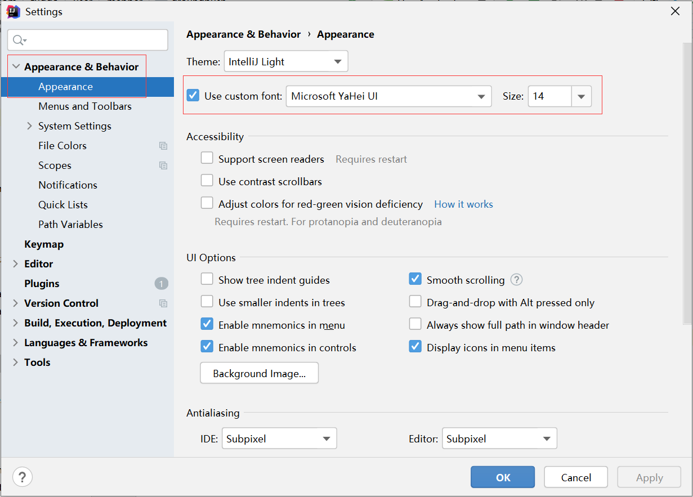

# IDEA字体大小调整

[TOC]

## Code

File → Settings → Editor → Color Scheme → Color Scheme Font: Use console font instead of th default

## 菜单栏和目录栏

File → Settings → Appearance &Behavior → Appearance: Use custom font

## Terminal

File → Settings → Editor → Color Scheme → Console Font: Use console font instead of th default

