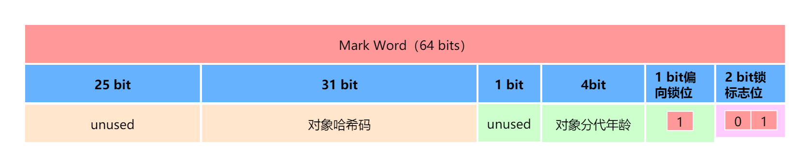
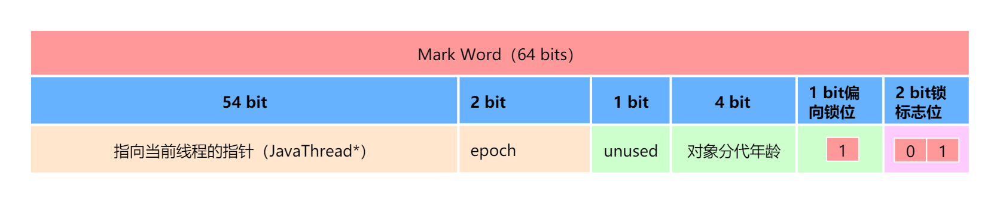
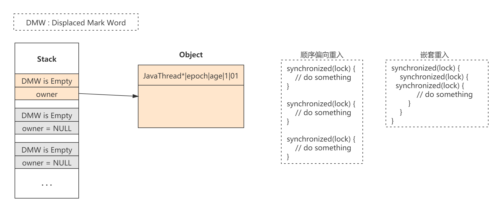
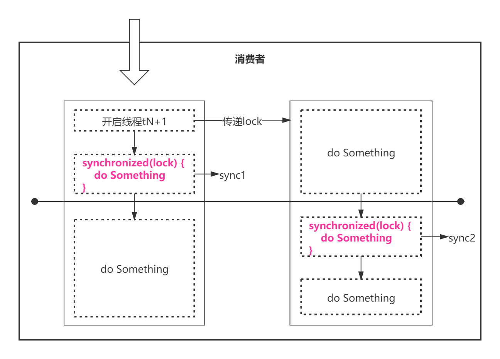
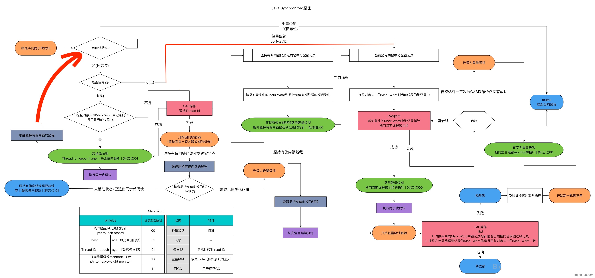

# 线程安全与锁优化


## 2、线程安全


2.1、Java语言中的线程安全


2.2、线程安全的实现方法

2.2.1、互斥同步


2.2.2、非阻塞同步

## 3、锁优化


### 3.1、自旋锁与自适应自旋锁


### 3.2、锁消除


### 3.3、锁粗化


### 3.4、轻量级锁

`synchronized`关键字Java中的多线程同步方案，它是基于互斥量的互斥同步操作。我们知道Java的线程是映射到操作系统的原生内核线程之上的，如果要阻塞或唤醒一条线程，则需要操作系统来帮忙完成，就不可避免地陷入到用户态和核心态的转换。进行这种状态的转换需要耗费很多处理器时间。尤其是同步代码块特别简单时候，其状态转换的时间甚至比用户代码本身的执行时间还长。因此`synchronized`是一个很重量级的操作，也称其为重量级锁。

轻量级锁是JDK 6时加入的新型锁机制，它名字中的“轻量级”是相对于使用操作系统互斥量来实现的传统锁而言的因此传统的锁机制就被称为“重量级”锁。不过，需要强调的是，轻量级锁并不是用来代替重量级锁的，它设计的初衷是在没有多线程竞争的前提下，减少传统重量级锁使用操作系统互斥量产生的性能消耗。

读到这里你可能会感觉很疑惑，“没有多线程竞争的前提下”这句话，既然说没有多线程竞争，那为什么还要加锁呢？如果要加锁，则必然是存在竞争的。没错，确实是这样，但一段同步代码并不是在任何时候都有多个线程在竞争执行，可能某一段时间只有一个线程在执行它，或者虽然有多个线程，它们在顺序执行同步代码块，没有产生交叉。

那么轻量级锁是如何减少传统重量级锁所产生的性消耗的呢？一个最简单的方案就是给同步代码块的同步对象加一个标记，标记已经有一个线程在执行了，执行完成之后，再将标记还原。如果在执行的过程中，有另一个线程也来执行了，则不停的轮询，等待标记重置，然后再去执行。没错，这就是CAS，基于CAS的原理，就可以完美地解决没有竞争情况下重量级锁的性能损耗，虽然会有一点CPU资源的消耗，但相比于用户态和核心态的转换，其产生的性能损耗是大大减少了。

但这里还有一个问题，如果同步代码块的所需的执行时间非常长，怎么办？，如果没有线程来竞争或者同步代码块的执行时间非常短暂，这没有任何问题。但既然加锁，必然是存在竞争的，也不可能保证同步代码块的执行时间一定非常短暂。所以当有线程来竞争的时候，不可能让其一直轮询，这只会白白消耗处理器自身的资源，而不会做任何有价值的工作，这就带来了性能上的浪费。因此这个的轮询等待的时间必须有一个限制，如果轮询的超过了限定的次数仍然没有等到标记重置，就直接使用传统的方式挂起线程。在这种情况下线程的切换也就算不上什么性能消耗了。

上面说明了轻量级锁的目的以及它是如何减少传统重量级锁使用操作系统互斥量产生的性能消耗的。下面将说明轻量级锁的运作原理。要理解轻量级锁，以及后面会讲到的偏向锁的原理和运作过程，必须要对HotSpot虚拟机对象的内存局部（尤其是对象头部分）有所了解。这里假定你已经有所了解。

**轻量级锁运作过程：**

在代码即将进入同步代码块的时候，如果此同步对象没有被锁定（锁标志位为“01”状态），虚拟机首先将在当前线程的栈帧中建立一个名为锁记录（Lock Record）的空间，用于存储锁对象目前Mark Word的拷贝（官方为这份拷贝加了一个Displaced前缀，即Displaced Mark Word），这时线程堆栈与对象头的状态如下图所示：


**轻量级锁加锁成功**

然后虚拟机将使用CAS操作尝试把对象的Mark Word更新为指向Lock Record的指针。如果这个更新动作成功了，即代表改线程拥有了这个对象的锁，并且对象Mark Word的锁标志位（Mark Word的最后两个比特）将转变为“00”，表示此对象处于轻量级锁定状态。这时线程堆栈与对象头的状态如下图所示：

*轻量级锁CAS操作之后对象与堆栈的状态：*


**轻量级锁加锁失败**

如果这个更新操作失败了，那代表着有两种情况下，第一种情况是刚刚有一个线程与其竞争，并且它刚刚在当前线程的前一刻CAS成功，获取到了锁；第二种情况是刚好有另一个线程已经持有了轻量级锁。但无论哪种情况，都代表当前线程获取锁失败，所以接下来就要进行轮询等待，以期望持有锁的线程尽快结束。但是在这里还要考虑一种特殊的情况，考虑如下场景，

```java
/**
 * -XX:-UseBiasedLocking 关闭偏向锁
 */
public static void main(String[] args) {
    Object obj = new Object();
    synchronized (obj) {
        // do something...
        synchronized (obj) {
            // do something...
        }
    }
}
```

我们知道CAS有三个值：旧值、预期值、新值，当旧值等于预期值的时候，就将旧值更新为新值，CAS更新失败，自然是旧值与预期值不相等。在轻量级锁的情况下，Mark Word的预期值都是`hash|age|01`，而CAS失败的情况下，旧值却是一个指向线程的指针，CAS自然是失败的。如果这个指针指向的就是当前线程呢，不可能轮询等待然后膨胀为重量级锁，不然这就陷入了自己等待自己悖论当中了。这种情况下本身也就代表当前线程已经获取到了锁，直接进入同步块继续执行就可以了。因此在CAS执行失败，还需要检查锁对象的Mark Word是否指向当前线程的栈帧，如果是，说明当前线程已经拥有了这个对象的锁，那直接进入同步块继续执行就可以了，否则就说明这个锁对象已经被其他线程抢占了。之后就是轮询等待，如果超过指定次数，膨胀为重量级锁挂起就可以了。

*轻量级锁流程：*


**释放轻量级锁**

释放轻量级锁的方式也是通过CAS来操作，当退出同步代码块的时候，如果对象的Mark Word仍然指向当前线程的锁记录，那就用CAS操作把对象当前的Mark Word和线程中复制的Displaced Mark Word替换回来，替换成功，则整个同步过程就结束了。OK，这是没问题的，但既然使用CAS能替换成功，那自然也会存在替换失败的情况，那什么情况下会替换失败呢？换个角度考虑，替换失败，自然锁对象的Mark Word没有指向当前线程的锁记录，那什么情况下轻量级锁的锁对象的Mark Word没有指向当前线程的锁记录呢？那就是当前线程的轻量级锁被膨胀为重量级锁的时候，此时锁对象的Mark Word是指向互斥量（重量级锁）的指针。 说明有其他线程尝试过获取该锁，并将其膨胀为重量级锁了，因此就要在释放锁的同时，唤醒被挂起的线程。

### 3.5、偏向锁

偏向锁是JDK 6中引入的一项优化措施，它也是针对在没有多线程竞争前提下的优化。那么它与轻量级锁有何不同呢？如果说轻量级锁是在无竞争的情况下使用CAS操作去消除同步使用的互斥量，那么偏向锁就是在无竞争的情况下把整个同步都消除掉，连CAS操作都不去做了。因此它的目的是消除数据在无竞争情况下的同步原语，相对于轻量级锁而言进一步提高程序的运行性能。

偏向锁是如何做到这一点的呢？

偏向锁的实现思路还是跟轻量级锁有一点相似之处。首先还是一样，当一个线程进入同步代码块的时候，为锁对象加一个标记，标记当前是偏向状态，一直运行到同步代码块退出。不同点在于对‘无竞争’的定义，轻量级锁的无竞争指的是多个线程无竞争，而偏向锁的无竞争指的是从始至终只有一个线程访问，也就说不管有没有竞争，只要被第二个线程持有锁，那么就会退出偏向升级为轻量级锁，一旦升级为轻量级锁之后，就永远不会退回到偏向状态了。

#### 3.5.1、偏向锁原理

新创建的一个对象的Mark Word结构默认情况下处于无锁的可偏向状态，什么是无锁的可偏向状态呢？我们知道一旦偏向加锁，锁对象的Mark Word的hash位就会替换为当前线程的指针（JavaThread*）以及对应Class的epoch，当在从未被偏向过的时候（新建对象），其锁对象Mark Word的前半部分（hash位）为NULL（即bit位全是0），再加上偏向标志位为1（偏向标志位为1表示允许偏向，0表示不允许偏向），锁标志位为01，即是无锁的可偏向状态。

*新创建对象的Mark Word结构：*



当锁对象第一次被线程获取时，首先需要判断偏向标志位是否为1，锁标志位是否为01，简而言之，就是Mark Word的最后3个bit是否为`101`，如果是，则表示当前是可偏向模式，只有在可偏向模式的下才能进行偏向加锁。紧接着，还需要判断指向当前线程的指针`JavaThread*`是否为NULL，`JavaThread*`本身是存储在Mark Word的hash位的，`JavaThread*`等于NULL，即意味着hash位为空。这种Mark Word的状态在偏向锁中称之为**匿名偏向(Anonymously biased)**。在匿名偏向状态下，意味着锁对象从未偏向过任何线程。然后使用CAS指令将指向当前线程的指针`JavaThread*`和`Epoch`绑定在Mark Word的hash位，即完成偏向加锁。此时Mark Word如下图所示：

*首次偏向锁对象Mark Word结构：*



当锁对象不是第一次被线程获取时，还是需要判断是否是可偏向模式，如果不是可偏向模式，就按照对应的轻量级锁或重量级锁的模式去执行。然后判断是否是匿名偏向（`JavaThread*`等于NULL），在这里一定按照非匿名偏向的模式执行的，可能会很迷惑，为什么是非匿名偏向的模式呢？因为这里建立的前提是‘锁对象不是第一次被线程获取’，此时锁对象可能处在在三种状态：

1. 被另一个偏向线程持有锁，并且仍在同步代码中。
2. 被另一个偏向线程持有锁，但不在同步代码中。
3. 被另一个偏向线程持有锁，但线程已经被关闭了。

这里需要说明的一点是，线程获取到偏向锁之后，就会将指针`JavaThread*`使用CAS绑定到当前锁对像的Mark Word中。但无论线程是否处于同步代码块中还是已经退出了线程（线程被关闭），`JavaThread*`都不会被重置或清空。所以，在偏向模式下，当锁对象不是第一次被线程获取时，`JavaThread*`一定是指向一个可能存活也可能死亡的线程。此时，对于程序而言，它是不知道锁对象是否是第一次被获取的，因而每次都需要判断是否是匿名偏向，而判断的方式就是假定它就是匿名偏向，使用CAS加锁，如果不是匿名偏向，CAS必定失败。

当确认不是匿名偏向的时候，就需要做进一步判断。实际上，在决定是否要将其升级为轻量级锁时，并不关心`JavaThread*`所指向的线程存活与否，只要确认是非匿名偏向，就将其升级为轻量级锁。不过这里还有一些特殊的情况，那就是`JavaThread*`指向的就是当前线程自己，在这种情况下，直接升级为轻量级锁是没有必要的，因此直接进入同步代码中即可，称这种行为为**锁重入**。不过，在锁重入的情况下，`JavaThread*`指向的线程真的是当前线程自己吗？不一定，想象一下，如果`JavaThread*`指针没变，但其指向内存空间被另一个线程占用，并在这个线程也会对同一个锁对象加锁，会怎么样？在判断`JavaThread*`指向的线程是否是自己的时候，会认为就是自己，但实际上却是另一个线程。关于这个问题请参考[3.6、代码测试 -> 复用内存空间文件问题]()。

因此，这里可以得出一个结论：在锁重入时，`JavaThread*`指向的线程一定是‘自己’，但‘自己’不一定是同一个线程。

但不管怎样，这里都判断的是`JavaThread*`指向的线程是否是‘自己’，如果不是‘自己’，就要将其升级为轻量级锁。在确认升级为轻量级锁之前，是不关心`JavaThread*`所指向的线程存活与否的，但在确认之后，就需要关心了。请思考一下，如果`JavaThread*`所指向的线程存活，并仍被偏向锁定（处在同步代码中），对于竞争锁的线程而言，是需要等待偏向线程执行完成之后竞争线程才有机会执行的，不可能让偏向线程直接释放锁，然后升级为轻量级锁，它们再去竞争，但是偏向锁的机制又不能保证同步性，那怎么办呢？HotSpot的实现是等待JVM运行到全局安全点，此时所有线程都被暂停，在这个时刻将对应的偏向锁升级为轻量级锁，恢复继续执行。此时，原偏向线程将变为持有轻量级锁，而竞争线程就可以去竞争了，如果竞争不到（如果自旋期间，同步代码没有退出，必然竞争不到），就按照轻量级锁的方式膨胀为重量级锁。如果`JavaThread*`所指向的线程没有存活或者没有被偏向锁定呢，那就很简单了，直接将锁对象变为无锁状态（Mark Word的最后3个bit为`001`），然后新线程直接按轻量级的方式加锁就可以了。在这里，无论是升级为轻量级锁还是变为无锁状态，都称为**偏向撤销**。

现在，让我们更进一步，思考下面四个问题：

1. HotSpot是如何判定偏向线程还存活？
2. HotSpot是如何判定偏向线程是否被偏向锁定的？
3. 当确认仍被偏向锁定之后，什么时候升级为轻量级锁?
4. 当确认仍被偏向锁定之后，如何升级为轻量级锁？

**第一个问题：**

​		遍历当前JVM的所有线程，如果能找到，则说明偏向的线程还存活。

**第二个问题：**

​		如何判定偏向线程是否已被偏向锁定的？其实更具体的说法应该是线程执行是否还在同步代码块之中。深入到字节码层面，我们应该知道，`synchronized`关键字会产生两个指令：`monitorenter`和`monitorexit`，因此再具体一些就是线程当前执行的指令是否还在`monitorenter`和`monitorexit`指令之间，如果在，自然就是被锁定的。所以要想知道被锁定与否，最简单的方式就是加一个标记，当执行`monitorenter`指令的时候设置此标记，当执行`monitorexit`指令的时候清空此标记，因此，只需要判断此标识是否存在，就知道是否被锁定了。HotSpot就是这样实现的，利用的是Lock Record，每当被偏向锁定时（执行`monitorenter`指令），像轻量级锁一样，会在当前线程栈中创建一个空的Lock Record，将owner指向当前的锁对象，当退出同步代码块的时候（执行`monitorexit`指令），断开owner与锁对象的连接（将owner置为`NULL`）。这里有一些细节需要注意的是，退出同步代码块时，仅仅是断开owner与锁对象的连接，而不会清理Lock Record，也不会重置锁对象的Mark Word。另外，每次锁重入的时候，也是会建立一个新的Lock Recod，并随着`monitorenter`和`monitorexit`指令执行owner与锁对象的连接与断开操作。

*三次偏向锁重入 - Lock Record状态：*



通过Lock Record还有一个额外的好处，当要升级轻量级锁的时候，直接将这个Lock Record拿来用即可，不需要再进行额外的Lock Record创建。

到此为止，标记（Lock Record）已经建好了，现在要做的就是找到这个标记。每当偏向锁撤销时（有竞争），会遍历当前偏向线程栈中的Lock Record，找到指向当前偏向锁对象的Lock Record（owner不等于NULL，并指向当前锁对象），如果找到了，表明锁仍被偏向锁定，执行升级轻量级锁操作；如果没有找到，表明没有被偏向锁定，则将锁变为无锁状态，并按轻量级锁的流程执行。

> 有的读者可能会认为*线程没有存活*以及*没有被偏向锁定*都是将锁变为无锁状态，并按轻量级锁的流程执行，为什么不直接判断被偏向锁定与否，还要判断线程有没有存活呢？
>
> —— 如果线程都没有了，哪来的线程栈给你遍历查找Lock Record。

> <div style="color:#ecc501;font-weight:bold;">Warning</div>
>
> 上面关于创建Lock Record的描述是：每当被偏向锁定时（执行`monitorenter`指令），会在当前线程栈中创建一个空的Lock Record；这句话不一定是正确的，虽然这样实现没有问题，但一个存在多个不同锁对象（都偏向），或者多次锁偏向重入的线程，在栈中将会产生多个Lock Record记录，存在一定的空间浪费。因此更好的做法是首先先查找是否有直接可用的空的Lock Record，如果有，则拿来用，如果没有，再创建。

**第三个问题：**

​		并不是说一旦有另一个线程获取锁了，原偏向线程马上暂停，然后开始升级。在HotSpot中，一旦有另一个线程获取锁，触发偏向锁撤销，偏向线程还是会继续运行，直到运行到全局安全点（safepoint）,才会真正停下来，执行偏向撤销。

**第四个问题：**

​		开始升级轻量级锁时，需要的Lock Record已经存在了，因此升级时需要做的就是将当前锁对象的Mark Word拷贝到Lock Record中，并使用CAS更新Lock Record引用，就完成轻量级锁的升级了。

#### 3.5.2、偏向锁释放

偏向锁释放指的是退出同步块的过程。偏向锁释放时仅仅会遍历当前偏向线程栈中的Lock Record，找到指向当前偏向锁对象的Lock Record，将其owner置为NULL，不会做任何的额外操作。

#### 3.5.3、偏向锁撤销

偏向锁撤销只有存在竞争时才会触发，简单的说就是同一把锁被第二个线程访问了。

偏向锁撤销是指当有线程竞争时，偏向线程如果还被偏向锁定，升级为轻量级锁，否则变为无锁状态（001）。

#### 3.5.4、批量重偏向

前面详细介绍了偏向锁的加锁，释放，撤销流程，并且深入了一定程度的原理。但是还有一点没有说到，那就是epoch。Epoch是用于批量重偏向优化的。

批量重偏向是一个预期优化，什么是预期优化呢？譬如第一天太阳从东方升起，第二天太阳从东方升起，第三天太阳从东方升起，一直到第十天太阳都是从东方升级，那么我们就可以预期第十一天，太阳也是从东方升起，这就是预期。而优化的是偏向锁的撤销，偏向锁可以提高带有同步但无竞争的程序性能，譬如当同一个线程反复进入同步代码的时候，偏向锁带的性能开销基本可以忽略。但当存在其他线程竞争时，偏向锁就需要等到安全点时撤销为无锁状态或升级为轻量级锁。相对而言，偏向锁的撤销会带来比较大的性能开销，在多线程竞争的情况下，偏向锁不仅不能提高性能，反而会导致性能下降。所以在竞争的情况下，将其升级为轻量级锁是应有之理。但问题在于偏向锁的机制即使没有竞争，只要有非偏向线程取获取锁，也会将其升级为轻量级锁，譬如线程A获取偏向锁G，之后退出结束，然后线程B来获取偏向锁G，此时将偏向锁G升级为轻量级锁，这本身没有问题，但线程A和B之间是不存在竞争的，仅仅是两个不同的线程而已。在这样的情况下，只有少量也没有问题，如果是有大量呢？针对这样的情况，HotSpot增加批量重偏向机制。

看到在这里可能又会有另一个疑惑，线程A和线程B的例子在逻辑上说不通啊！一般情况下我们都是创建一个对象实例作为锁，然后将这个对象实例作为类变量（class的static变量），在代码中对其进行同步加锁，如果线程A首先获得偏向退出，然后线程B在来获取锁并升级为轻量级锁然后执行，退出，再之后线程C、D、E、F...来获得锁（它们之间是不同的线程，但是没有产生竞争），也只是按轻量级锁的方式加锁，不存在所谓偏向锁的撤销问题啊，也只是在线程B的时候撤销了一次而已？

实际上批量重偏向是以类为单位的。考虑这样一种场景：



譬如一个消费者线程，如上图所示，每次消费的时候都是一个新的线程，线程tN首先创建了另一个线程tN+1执行其他的业务逻辑，它们都需要用到共同的锁lock，因此，有产生竞争的可能。不过，因为tN和tN+1线程的代码执行存在时间差的问题，比如tN+1在执行同步代码之前存在繁重的IO操作等，导致tN的同步代码在99%的情况下先于tN+1的同步代码执行。在这种情况下，就没必要每次都对锁lock进行撤销操作。

所以预期优化，预期的是一个Class的大量实例锁对象被偏向锁定和撤销，锁定和撤销的是不同的线程（必定是不同的线程），但它们之间没有产生竞争，所以这是撤销操作时费时且不必要的。所以，优化的是在预期满足的情况下，让后续的同一个Class实例锁对象不必撤销，让其重新偏向即可。

按照OpenJDK官方文档说明：批量重偏向**可以优化类对象被不同线程锁定和解锁但绝不并发锁定的情况。它使类的所有实例的偏向无效，而不会禁用偏向锁定**。

**批量重偏向实现**

按照OpenJDK官方文档的说法，批量重偏向使类的所有实例的偏向无效，言外之意就是当实例的偏向无效时，就可以进行再次偏向，即重偏向。那么该如何实现呢？

首先需要考虑一下四个问题：

1. 什么时候可以重偏向？如果类对象被不同线程锁定和解锁但绝不并发锁定的情况存在，但比较少，开启重偏向还有必要的吗？
2. 如何使类的所有实例的偏向无效？怎么才算无效？
3. 开启重偏向之后，是否之后类的所有实例都可以重偏向了？
4. 重偏向是如何偏向的？
5. 已偏向过的对象还可以再次偏向吗？

在解答这五个问题之前，先直接来看看HotSpot是如何实现的：

​		偏向锁撤销计数器：以Class为单位，每一个Class都维护了一个偏向锁撤销计数器，每当有一个该Class实例的锁对象发生偏向撤销操作时，其计数器就+1，当这个值达到重偏向阈值（默认20）时，JVM就认为这个这个Class的偏向锁有问题，需要进行批量重偏向优化，就会开启批量重偏向。

​		Epoch：每一个Class对象都有一个epoch字段，同时每个处于偏向锁状态的Mark Word也有一个用于记录epoch的bit位，其值等于该锁对象创建时其对应的Class对象中epoch字段的值。每次发生批量重偏向时，就将该Class对象中epoch的值+1，同时遍历JVM中所有线程的栈，找到该Class所有**正处于加锁状态的偏向锁，将其epoch位设为新值，而对于没有处于加锁状态的偏向锁，其epoch仍为旧值。**当epoch仍为旧值的锁对象下次再次被加锁时，发现其epoch与Class的epoch不相等，就认为其是可重偏向的，而这种状态称为**可重偏向(Rebiasable)**。只要判断epoch不相等，就直接进行重偏向，而不需要再做任何其他验证操作，之所以能这样做，是因为前面说明了‘找到该Class所有正处于加锁状态的偏向锁，将其epoch位设为新值’，所以可以得出结论：当epoch不相等的时候，原偏向线程一定没有处于加锁状态，直接进行重偏向是没有任何隐患的。重偏向是不会进行撤销操作的（如果要撤销，那就违背了批量重偏向的设计初衷），当重偏向时，直接通过CAS将Mark Word中的`JavaThread*`替换为当前线程的指针，以及将epoch更新为最新值就完成了重偏向的锁获取操作，此时epoch相等的状态称为**已偏向(Biased)**。

现在再来解答上面五个问题：

1. 答：如果类对象被不同线程锁定和解锁但绝不并发锁定的情况存在，但比较少，开启重偏向自然是没有必要的，因此需要有一个阈值进行限制，当撤销达到这个阈值时，就开启重偏向。
2. 答：通过锁对象的Epoch进行判断，只要Epoch不相等，就认为偏向无效。
3. 答：是否之后类的所有实例都可以重偏向，这个‘之后类的所有实例’有两种情况，一、该实例是在开启重偏向之前已经创建好了；二、该实例是在开启重偏向之后创建的；前面已经说过，新创建的锁对象其Epoch就是Class的Epoch，所以是不满足重偏向的条件的。总之，就是一句话，只要Epoch不相等，无论什么时候的锁对象实例，都可以偏向。
4. 答：直接通过CAS将Mark Word中的`JavaThread*`替换为当前线程的指针，以及将epoch更新为最新值就完成了重偏向的锁获取操作。
5. *可以，将在下面的‘再次批量重偏向’进行说明。*

#### 3.5.5、再次批量重偏向

首先要考虑的一个问题是‘再次批量重偏向’有必要吗？从目前来看是有必要的，再次回顾图1-1所列举的例子，如果在重偏向之后，又有新的线程在不并发的情况下使其解锁和锁定，那么再次重偏向也不无不可。重偏向的验证条件是Epoch不一致，在重偏向之后，不仅仅是使用CAS将JavaThread*更新为指定当前线程，还将Epoch更新为了最新值，因此，不可能直接就重偏向了，如果要再次重偏向，那么必须的使其Epoch再次变为不一致，如何做到呢？首次批量重偏向的时候是有一个撤销计数器的，当达到撤销阈值的时候，批量重偏向就开启了，所以'再次批量重偏向'也将重复这个过程。不过撤销计数器只有一个，首次批量重偏向的时候已经达到阈值了，怎么办？一个简单的办法就是统计撤销计时器是否达到撤销阈值的倍数，只要在每次达到撤销阈值的倍数时，就可以开启再次批量重偏向。实际在HotSpot中并不是这样实现的，HotSpot是通过重置撤销计时器的方式实现，当然不是说在每次撤销计时器达到阈值的之后就更新epoch，并同时重置撤销计时器，这个需要考虑另一个问题，例如在一次批量重偏向之后产生大批量的可偏向锁，这个‘大批量’大于撤销计数器阈值（默认20），现在，在再次达到撤销计数器阈值之后，‘大批量’的可偏向锁都还没有再次偏向完，epoch又更新了，所以在每次开启重偏向与撤销计数器重置之间是需要有一个时间间隔的（默认25秒），以尽可能等待可偏向锁偏向完。当然，你可能会觉得这并没有什么问题，即使‘大批量’的可偏向锁都还没有再次偏向完，epoch又更新了，只要epoch不一样，都是满足偏向锁对象的Mark Word中的epoch与Class的epoch不等的条件，就是可以偏向的。不过这里你可能忽略了一个问题，epoch在Mark Word规定只占2个bit位，也就是说它只能表示4种状态，即00/01/10/11，默认为00，也就是说只有3种状态可用，那是不是批量重偏向了3次之后就不可再次批量重偏向了呢。当然不是，epoch会在最大状态11的时候，当下次再次触发批量重偏向的时候，就变更为00这样的一个循环了。所以，回到撤销计数器重置时间的问题，如果没有时间间隔，就有可能产生epoch轮询了一轮再次回到未重偏向但本来可重偏向的锁对象的epoch状态，从而造成其不可偏向。

总结一下再次批量重偏向流程：

当一次批量重偏向开启之后，间隔25秒（默认值，可通过参数设置），没有触发批量撤销，那么偏向撤销计时器将会被重置，以统计下次开启批量重偏向的撤销计数，然后一直重复这个过程，如果在间隔25内达到了批量撤销的条件，就走批量撤销。当没有达到批量撤销的条件时，创建的新的Class的实例是匿名偏向的。

#### 3.5.6、批量撤销

如果说批量重偏向是针对类对象被不同线程锁定和解锁但绝不并发锁定的情况的优化，那么批量撤销就是针对激烈竞争情况下的优化了。譬如生产者/消费者队列，在激烈竞争的情况下就不太适合使用偏向锁。与其使用偏向锁定，还不如禁用偏向锁，直接使用轻量级锁定来的高效。因此，偏向锁有一个批量撤销阈值（默认40），当偏向锁撤销计数达到此阈值时候，就直接标记该Class当前已有实例以及之后所有新建的实例不可偏向，既使它们的偏向位为0，状态变为001。

#### 3.5.7、不同JDK版本偏向锁的差异

1. JVM启动4秒之后才启动偏向锁，在JDK 11以及JDK15测试，JVM启动就开启偏向锁。

#### 3.5.8、偏向锁与HashCode

当对象进入偏向状态的时候，Mark Word大部分的空间（54bit）都用于存储持有锁的线程指针了，这部分空间占用了原有存储对象哈希码的位置，那原来对象的哈希码怎么办呢？

在Java语言里面一个对象如果计算过哈希码，就应该一直保持该值不变（强烈推荐但不强制，因为用于可以重载`hashCode()`方法按自己的意愿返回哈希码），否则很多依赖对象哈希码的API都可能存在出错误的风险。而作为绝大多数对象哈希码来源的`Object::hashCode()`方法，返回的是对象的一致性哈希码（Identity Hash Code），这个值是能强制保持不变的，它通过在对象头中存储计算结果来保证第一次计算之后，再次调用该方法取到的哈希码永远不会再发生改变。因此，当一个对象已经计算过一致性哈希码后，它就再也无法进入偏向锁状态了；而当一个对象当前正处于偏向锁状态，又收到需要计算其一致性哈希码请求时，它的偏向状态会被立即撤销，并且锁会膨胀为重量级锁。在重量级锁的实现中，对象头指向了重量级锁的位置，代表重量级锁的ObjectMonitor类里有字段可以记录非加锁状态（标志位为‘01’）下的Mark Word，其中自然可以存储原来的哈希码。

获取hashCode需要占位导致无法进入偏向锁状态是最根本的原因，由根本的原因引出来的另一个次要原因是会在`hashCode()`方法中有代码明确将锁膨胀为重量级锁。如果你查看过HotSpot的`hashCode()`方法源码就会发现这一点，具体请查看对`hashCode()`方法的分析一节。

#### 3.5.9、默认值

JVM提供了一些用于控制偏向锁的参数，可以通过`-XX:+PrintFlagsFinal`选型打印：

| Option and Default Value                  | Decribetion                              |
| ----------------------------------------- | ---------------------------------------- |
| `-XX:+UseBiasedLocking`                   | 启用/禁用偏向锁。                        |
| `-XX:BiasedLockingBulkRebiasThreshold=20` | 开启批量重偏向的撤销数阈值，默认20。     |
| `-XX:BiasedLockingBulkRevokeThreshold=40` | 开启批量撤销的撤销数阈值，默认40。       |
| `-XX:BiasedLockingDecayTime=25000`        | 开启批量重偏向之间的间隔时间，默认25秒。 |
| `-XX:BiasedLockingStartupDelay=0`         | JVM启动开启偏向锁延迟，默认启动就开启。  |

上述偏向锁的相关参数是基于JDK 11打印输出的。但是在不同的JDK版本是不太同的，已知有如下差异：

1. 偏向锁自JDK 6起是默认开启的，即`-XX:+UseBiasedLocking`，而在JDK 15是默认关闭的。
2. 偏向锁自JDK 6起JVM启动开启偏向锁延迟为4秒，即`-XX:BiasedLockingStartupDelay=4000`，但在JDK 11默认是启动就开启。

### 参考资料

[Eliminating SynchronizationRelated Atomic Operations with Biased Locking and Bulk Rebiasing](https://www.oracle.com/technetwork/java/javase/tech/biasedlocking-oopsla2006-preso-150106.pdf)

[Eliminating Synchronization-Related Atomic Operations with Biased Locking and Bulk Rebiasing](https://www.oracle.com/technetwork/java/biasedlocking-oopsla2006-wp-149958.pdf)

[OpenJDK Wiki：Synchronization and Object Locking](https://wiki.openjdk.java.net/display/HotSpot/Synchronization)

[死磕Synchronized底层实现](https://github.com/farmerjohngit/myblog/issues/12)

[源码解析-偏向锁撤销流程解读](https://www.jianshu.com/p/7445361e187f)

### 参考源码

GitHub：https://github.com/openjdk/jdk

OpenJDK：http://hg.openjdk.java.net/jdk/jdk15/file

相关代码直达链接

[markWord.hpp](https://github.com/openjdk/jdk/blob/master/src/hotspot/share/oops/markWord.hpp#L333)

[biasedLocking.cpp](https://github.com/openjdk/jdk/blob/master/src/hotspot/share/runtime/biasedLocking.cpp)

[synchronizer.cpp](https://github.com/openjdk/jdk/blob/master/src/hotspot/share/runtime/synchronizer.cpp)

[oop.inline.hpp](https://github.com/openjdk/jdk/blob/master/src/hotspot/share/oops/oop.inline.hpp)

### 其他参考资料

HotSpot支持存储释放偏向锁，以及偏向锁的批量重偏向和撤销。这个特性可以通过JVM的参数进行切换，而且这是默认支持的。Unlock状态下MarkWord的一个比特位用于标识该对象偏向锁是否被使用或者是否被禁止。如果该bit位为0，则该对象未被锁定，并且禁止偏向；如果该bit位为1，则意味着该对象处于以下三种状态：

- **匿名偏向(Anonymously biased)**
  在此状态下thread_ptr为NULL(0)，意味着还没有线程偏向于这个锁对象。第一个试图获取该锁的线程将会面临这个情况，使用原子CAS指令可将该锁对象绑定于当前线程。这是允许偏向锁的类对象的初始状态。
- **可重偏向(Rebiasable)**
  在此状态下，偏向锁的epoch字段是无效的(与锁对象对应的klass的mark_prototype的epoch值不匹配)。下一个试图获取锁对象的线程将会面临这个情况，使用原子CAS指令可将该锁对象绑定于当前线程。在批量重偏向的操作中，未被持有的锁对象都被至于这个状态，以便允许被快速重偏向。
- **已偏向(Biased)**
  这种状态下，thread ptr非空，且epoch为有效值——意味着其他线程正在只有这个锁对象。

基于偏向锁对象需要使用hashcode字段作为偏向线程id标识的事实，被hash的对象不可被用作偏向锁。对于允许偏向的对象在进行hashcode计算时，首先要吊销(revoke)所有的偏向(不管是有效的还是无效的)，然后使用CAS将计算好的hashcode值放到MarkWord中，尽管这仅仅适用于“identity hashcode(使用Object类的hashcode()方法进行计算)”。普通Java类型hashcode的计算需要重载Object的hashcode()方法，但不必要去显示调用这个方法；因此，对于没有显示调用Object#hashcode()方法的类的对象，仍然适用于偏向锁的机制——可被用作锁对象使用。

HotSpot为所有加载的类型，在class元数据——InstanceKlass中保留了一个MarkWord原型——mark_prototype。这个值的bias位域决定了该类型的对象是否允许被偏向锁定。与此同时，当前的epoch位也被保留在prototype中。这意味着，对应class的新对象可以简单地直接拷贝这个原型值，而不必在后面进行修正。在批量重偏向(bulk rebias)的操作中，prototype的epoch位将会被更新；在批量吊销(bulk revoke)的操作中，prototype将会被置成不可偏向的状态——bias位被置0。

偏向锁的获取依靠原子CAS指令将线程指针插入MarkWord中。其先决条件是：1.该对象处于匿名偏向状态；2.该对象处于可重偏向状态(一个锁对象仅能被一个线程偏向一次)。只要锁对象被偏向，递归锁定和解锁仅仅需要读取对象头以及对应Klass的prototype去验证偏向是否被吊销。

HotSpot中偏向锁的撤销是JVM处于在全局安全点时被执行的。在撤销过程中，撤销者会遍历当前偏向线程的锁记录，藉此推断对象当前是否被锁定。如果发现锁对象被一个偏向线程持有，锁记录将被修改——如同轻量级锁被使用一样；如果锁对象未被持有，这是取决于触发撤销的原因，锁对象要么被禁止用作偏向锁，要么被禁止重新偏向于撤销线程。

即使偏向锁的特性被打开，出于性能（启动时间）的原因在JVM启动后的的头4秒钟这个feature是被禁止的。这也意味着在此期间，prototype MarkWord会将它们的bias位设置为0，以禁止实例化的对象被偏向。4秒钟之后，所有的prototype MarkWord的bias位会被重设为1，如此新的对象就可以被偏向锁定了。

获取偏向锁的步骤：

1. **验证对象的bias位**
   如果是0，则该对象不可偏向，应该使用轻量级锁算法。
2. **验证对象所属InstanceKlass的prototype的bias位**
   确认prototype的bias为是否被设置。如果没有设置，则该类所有对象全部不允许被偏向锁定；并且该类所有对象的bias位都需要被重置，使用轻量级锁替换。
3. **校验epoch位**
   校验对象的MarkWord的epoch位是否与该对象所属InstanceKlass的prototype的MarkWord的epoch匹配。如果不匹配，则表明偏向已过期，需要重新偏向。这种情况，偏向线程可以简单地使用原子CAS指令重新偏向于这个锁对象。
4. **校验owner线程**
   比较偏向线程ID与当前线程ID。如果匹配，则表明当前线程已经获得了偏向，可以安全返回。如果不匹配，对象锁被假定为匿名偏向状态，当前线程应该尝试使用CAS指令获得偏向。如果失败的话，就尝试撤销(很可能引入安全点)，然后回退到轻量级锁；如果成功，当前线程成功获得偏向，可直接返回。

### 3.6、代码测试

锁优化相关的测试主要是观察MarkWord的变化，为了更方便的观察输出结果，增加了一些工具方法以及相关的测试说明：

1. 对`ClassLayout.parseInstance(obj).toPrintable();`输出结果做了字符串截取以及逆转了bit位。

   ```java
   public static String printMarkWord(Object obj) {
       String table = ClassLayout.parseInstance(obj).toPrintable();
       String[] split = table.split("\\)");
       return changeoverBit(split[4].split("\\(")[1]) +
           changeoverBit(split[1].split("\\(")[1]);
   }
   
   public static String changeoverBit(String bitString) {
       String[] bitStringArray = bitString.split(" ");
       StringBuilder sb = new StringBuilder();
       for (var i = bitStringArray.length - 1; i >= 0; i--) {
           sb.append(bitStringArray[i]).append(" ");
       }
       return sb.toString();
   }
   ```

2. 测试代码有些输出的结果较多，为了方便书写，对中间相同的部分使用`......`代替。

3. 为了简化代码，增加了`sleep()`方法。

   ```java
   public static void sleep(long millis) {
       try {
        Thread.sleep(millis);
       } catch (InterruptedException e) {
           e.printStackTrace();
       }
   }
   ```
   

#### 匿名偏向

测试目标：

1. 只要开启了偏向锁，新建对象状态为匿名偏向。

测试代码：

```java
public static void main(String[] args) {
    User obj = new User();
    System.out.println(printMarkWord(obj));
}
```

测试结果：

```c
00000000 00000000 00000000 00000000 00000000 00000000 00000000 00000101
```

Hash位为NULL，偏向标志位为1，锁状态位为01，是匿名偏向状态。

#### 偏向

测试目标：

1. 首次加锁会被偏向加锁。

测试代码：

```java
public static void main(String[] args) {
    User obj = new User();
    System.out.println(printMarkWord(obj));
    synchronized (obj) {
        System.out.println(printMarkWord(obj));
    }
}
```

测试结果：

```c
00000000 00000000 00000000 00000000 00000000 00000000 00000000 00000101 
00000000 00000000 01111111 10111010 10001100 00000001 00110000 00000101
```

新建对象为匿名偏向状态，加锁之后Hash位不为NULL，偏向标志位仍为1，锁状态位仍为01，处于已偏向状态。

#### 偏向锁升级

测试目标：

1. 有锁竞争（无论偏向锁线程存活与否），偏向锁升级为轻量级锁。

测试代码：

```java
public static void main(String[] args) {
    User obj = new User();
    System.out.println(printMarkWord(obj));
    synchronized (obj) {
        System.out.println(printMarkWord(obj));
    }
    new Thread(() -> {
        synchronized (obj) {
            System.out.println(printMarkWord(obj));
        }
    }).start();
}
```

测试结果：

```c
00000000 00000000 00000000 00000000 00000000 00000000 00000000 00000101 
00000000 00000000 01111111 11110001 11110100 00000001 00110000 00000101 
00000000 00000000 01111111 11110001 11001100 00100011 00001001 00000000
```

新建对象为匿名偏向状态，加锁之后Hash位不为NULL，偏向标志位仍为1，锁状态位仍为01，处于已偏向状态。然后两一个线程来获取偏向锁，升级为轻量级锁。

#### 复用内存空间问题

测试目标：

1. 连续创建线程并持有同一把锁会导致线程空间复用。

测试代码：

```java
public static void main(String[] args) throws InterruptedException {
    User obj = new User();

    Runnable runnable = () -> {
        synchronized (obj) {
            System.out.println(printMarkWord(obj));
        }
    };

    Thread t1 = new Thread(runnable);
    t1.start();
    t1.join();

    Thread t2 = new Thread(runnable);
    t2.start();
}
```

测试结果：

代码经过多次运行，会输出两种不同的结果。

1. 两个线程都偏向加锁，并结果一样。

   ```java
   00000000 00000000 01111111 10010010 10001000 01000100 00110000 00000101 
   00000000 00000000 01111111 10010010 10001000 01000100 00110000 00000101
   ```

   线程空间已被复用。

2. 线程t2偏向加锁，线程t2轻量级加锁。

   ```java
   00000000 00000000 01111111 10000111 01101000 00111111 01010000 00000101 
   00000000 00000000 01111111 10000111 01000000 11011101 00011001 00000000
   ```

   线程空间未被复用。

#### 偏向锁与HashCode

测试目标：

1. 获取锁对象的hashCode之后，永远无法进入偏向状态。
2. 已进入偏向状态的锁，获取hashCode之后，将会膨胀为重量级锁。

测试代码：

- 测试1

  ```java
  public static void main(String[] args) {
      User obj = new User();
      System.out.println(printMarkWord(obj));
      System.out.println("对象hash码：" + Integer.toHexString(obj.hashCode()));
      System.out.println(printMarkWord(obj));
      synchronized (obj) {
          System.out.println(printMarkWord(obj));
      }
  }
  ```

- 测试2：

  ```java
  public static void main(String[] args) {
      User obj = new User();
      System.out.println(printMarkWord(obj));
      synchronized (obj) {
          System.out.println(printMarkWord(obj));
          System.out.println("对象hash码：" + Integer.toHexString(obj.hashCode()));
          System.out.println(printMarkWord(obj));
      }
  }
  ```

测试结果：

- 测试1结果

  ```c
  00000000 00000000 00000000 00000000 00000000 00000000 00000000 00000101 
  对象hash码：61230f6a
  00000000 00000000 00000000 01100001 00100011 00001111 01101010 00000001 
  00000000 00000000 01111111 10011011 10100000 00000111 01111001 11101000
  ```

  1. 在获取hashCode之前为匿名偏向状态。
  2. 获取hashCode之后，由于hashCode方法将其膨胀为重量级锁，退出释放锁，变为无锁状态（001），不可偏向。
  3. 无锁状态直接以轻量级锁加锁。

  证明：获取锁对象的hashCode之后，永远无法进入偏向状态。

- 测试2结果

  ```c
  00000000 00000000 00000000 00000000 00000000 00000000 00000000 00000101 
  00000000 00000000 01111111 00100100 00001100 00000001 00110000 00000101 
  对象hash码：61230f6a
  00000000 00000000 01111111 00100011 11001100 00000000 10000110 00000010
  ```

  1. 加锁之前输出结果为匿名偏向状态。
  2. 加锁之后输出结果为已偏向状态
  3. 获取hashCode码，再次输出结果，已膨胀为重量级锁。

  证明：已进入偏向状态的锁，获取hashCode之后，将会膨胀为重量级锁。

#### 批量重偏向1

测试目标：

1. 撤销计数器阈值20。
2. 重偏向之后，Mark Word中的epoch递进+1。

测试代码：

新建了两个线程t1和t2，t1先将所有锁偏向，t1执行完之后唤醒，t2触批量重偏向。共定义了30个锁对象。

```java
public static Thread t1, t2;

public static int rebiasLoopNumber = 30;

public static void main(String[] args) {
    biasedLockingBulkRebias();
}

@SuppressWarnings("all")
private static void biasedLockingBulkRebias() {
    List<Object> objs = new ArrayList<>(rebiasLoopNumber);
    t1 = new Thread(() -> {
        for (var i = 0; i < rebiasLoopNumber; i++) {
            //这里请不要用java.lang.Object类做实验
            User obj = new User();
            synchronized (obj) {
                System.out.println(i + " : " + printMarkWord(obj));
            }
            objs.add(obj);
        }
        LockSupport.unpark(t2);
    });

    t2 = new Thread(() -> {
        //休眠，等待t1唤醒
        LockSupport.park();
        System.out.println("t2 : ----------------------------------------------------------------------");
        for (var i = 0; i < objs.size(); i++) {
            Object obj = objs.get(i);
            synchronized (obj) {
                System.out.println(i + " : " + printMarkWord(obj));
            }
        }
    });
    //t2先执行，以避免t1在unpark t2的时候，t2都还没有创建，虽然这种概率极小。
    t2.start();
    t1.start();
}
```

测试结果：

```
0 : 00000000 00000000 01111111 11011011 01101100 01000001 10011000 00000101 
1 : 00000000 00000000 01111111 11011011 01101100 01000001 10011000 00000101 
......
28 : 00000000 00000000 01111111 11011011 01101100 01000001 10011000 00000101 
29 : 00000000 00000000 01111111 11011011 01101100 01000001 10011000 00000101 
t2 : ----------------------------------------------------------------------
0 : 00000000 00000000 01111111 11011011 00100011 01011100 11111000 11110000 
......
18 : 00000000 00000000 01111111 11011011 00100011 01011100 11111000 11110000 
19 : 00000000 00000000 01111111 11011011 01101100 01000001 01101001 00000101 
......
29 : 00000000 00000000 01111111 11011011 01101100 01000001 01101001 00000101
```

如上结果所示，在分割线之上，都是t1线程输出的结果，所有锁都被偏向了。分割线之下，前19个锁被升级为轻量级所，到第20个，达到撤销计数器阈值，开启重偏向，19-29都被重偏向了。观察重偏向锁Mark Word，其epoch位为01。

> 编写测试代码注意事项：
>
> 		用于测试的对象请自建对象，例如`User`，请不要使用`java.lang.Object`。因为即使是运行一个简单的main方法，也需要启动Java虚拟机，在虚拟机中会有以`java.lang.Object`对象执行的同步操作，因此，如果使用`java.lang.Object`，会在测试批量重偏向时发现没有达到阈值的时候就开始批量重偏向了，与预期不符。笔者在测试（JDK 11）的时候使用`java.lang.Object`，每次在第14个的时候就开启了批量重偏向。
> 	
> 		在编写测试代码的时候，建议一定要使用`LockSupport`的方式去暂停和唤醒。千万不要想着让线程t1开始执行之后睡眠几秒，等待其执行完，然后在执行t2，这会有线程空间复用的问题，如果你这样做，会发现有时候t1和t2输出的结果完成一样，并没有轻量级锁的升级以及重偏向。也不要想着在t1和t2之间另外创建一个线程占用空间，例如像下面这样：
>
> ```java
> @SuppressWarnings("all")
> private static void biasedLockingBulkRebias() throws InterruptedException {
>  List<User> objs = new ArrayList<>(rebiasLoopNumber);
>  Thread t1 = new Thread(() -> {
>      for (var i = 0; i < 30; i++) {
>          User obj = new User();
>          synchronized (obj) {
>              System.out.println(i + " : " + printMarkWord(obj));
>          }
>          objs.add(obj);
>      }
>  });
>  t1.start();
>  t1.join();
> 
>  //创建线程t0占位，防止复用线程内存空间
>  Thread t0 = new Thread(() -> sleep(500));
>  t0.start();
> 
>  Thread t2 = new Thread(() -> {
>      for (var i = 0; i < objs.size(); i++) {
>          User obj = objs.get(i);
>          synchronized (obj) {
>              System.out.println(i + " : " + printMarkWord(obj));
>          }
>      }
>  });
>  t2.start();
> }
> ```
>
> 这段代码笔者在公司的电脑测试没有出现问题，但在家里的电脑测试，偶尔就会出现t1和t2输出的结果一致的问题，这可能是因为虽然我们创建t0占位，但t0没有占用t1释放出的空间，而被后续的t2占用了。
>
> 另外，也不要想着‘先让t1和t2事先创建好’，例如像下面这样：
>
> ```java
> @SuppressWarnings("all")
> private static void biasedLockingBulkRebias() throws InterruptedException {
>  List<User> objs = new ArrayList<>(rebiasLoopNumber);
>  Thread t1 = new Thread(() -> {
>      for (var i = 0; i < rebiasLoopNumber; i++) {
>          User obj = new User();
>          synchronized (obj) {
>              System.out.println(i + " : " + printMarkWord(obj));
>          }
>          objs.add(obj);
>      }
>  });
>  Thread t2 = new Thread(() -> {
>      for (var i = 0; i < objs.size(); i++) {
>          User obj = objs.get(i);
>          synchronized (obj) {
>              System.out.println(i + " : " + printMarkWord(obj));
>          }
>      }
>  });
>  t1.start();
>  t1.join();
>  System.out.println("--------------------------------------------------------------------------");
>  t2.start();
>  t2.join();
> }
> ```
>
> 这样的想法是错误的，`new Thread()`仅仅是创建了Thread对象，而没有创建线程，只有当执行Thread的`start()`方法时，线程才会正真的创建。

#### 批量重偏向2

测试目标：

1. 升级轻量级锁算撤销（未被同步锁定，但偏向线程存活）。
2. 升级轻量级锁，但没有竞争到，导致膨胀为重量级锁算撤销（被同步锁定，偏向线程存活）。

测试代码：

新建了5个线程，t1、t2、t3、t4线程的作用都是一样，使锁首次偏向。不同的是t2线程会在同步代码中睡眠，使t5线程重偏向时仍然被同步锁定。  t3线程会在退出同步代码之后睡眠，使t5线程重偏向时线程仍然存活 。共定义了30个锁对象。

```java
public static Thread t1, t2, t3, t4, t5;

public static int rebiasLoopNumber = 30;

public static void main(String[] args) {
    biasedLockingBulkRebias();
}

@SuppressWarnings("all")
private static void biasedLockingBulkRebias()  {
    final int activeBiasedThread = 2;
    List<Object> objs = new ArrayList<>(rebiasLoopNumber);

    t1 = new Thread(() -> {
        System.out.println("t1 : -----------------------------------------------------------------------");
        for (var i = 0; i < 10; i++) {
            User obj = new User();
            synchronized (obj) {
                System.out.println(i+" : "+printMarkWord(obj));
            }
            objs.add(obj);
        }
        LockSupport.unpark(t2);
    });

    t2 = new Thread(() -> {
        LockSupport.park();
        System.out.println("t2 : -----------------------------------------------------------------------");
        User obj = new User();
        objs.add(obj);
        synchronized (obj) {
            System.out.println("10 : " + printMarkWord(obj));
            LockSupport.unpark(t3);
            sleep(1000);
        }
    });

    t3 = new Thread(() -> {
        LockSupport.park();
        System.out.println("t3 : -----------------------------------------------------------------------");
        User obj = new User();
        synchronized (obj) {
            System.out.println("11 : " + printMarkWord(obj));
        }
        objs.add(obj);
        LockSupport.unpark(t4);
        sleep(1000);
    });

    t4 = new Thread(() -> {
        LockSupport.park();
        System.out.println("t4 : -----------------------------------------------------------------------");
        for (var i = 12; i < rebiasLoopNumber; i++) {
            User obj = new User();
            synchronized (obj) {
                System.out.println(i + " : " + printMarkWord(obj));
            }
            objs.add(obj);
        }
        LockSupport.unpark(t5);
    });

    t5 = new Thread(() -> {
        LockSupport.park();
        System.out.println("t5 : -----------------------------------------------------------------------");
        for (var i = 0; i < rebiasLoopNumber; i++) {
            Object obj = objs.get(i);
            synchronized (obj) {
                System.out.println(i+" : "+printMarkWord(obj));
            }
            objs.add(obj);
        }
    });

    t5.start();
    t4.start();
    t3.start();
    t2.start();
    t1.start();
}
```

测试结果：

```
t1 : ----------------------------------------------------------------------
0 : 00000000 00000000 01111111 11001100 11010000 01000011 00111000 00000101 
...... 
9 : 00000000 00000000 01111111 11001100 11010000 01000011 00111000 00000101 
t2 : -----------------------------------------------------------------------
10 : 00000000 00000000 01111111 11001100 11010000 01000011 00011000 00000101 
t3 : -----------------------------------------------------------------------
11 : 00000000 00000000 01111111 11001100 11010000 01000011 00000000 00000101 
t4 : -----------------------------------------------------------------------
12 : 00000000 00000000 01111111 11001100 11010000 01000010 11101000 00000101 
......
29 : 00000000 00000000 01111111 11001100 11010000 01000010 11101000 00000101 
t5 : -----------------------------------------------------------------------
0 : 00000000 00000000 01111111 11001100 10011110 00100011 11001000 11110000 
...... 
9 : 00000000 00000000 01111111 11001100 10011110 00100011 11001000 11110000 
10 : 00000000 00000000 01111111 11001100 10001100 00000000 10001010 00000010 
11 : 00000000 00000000 01111111 11001100 10011110 00100011 11001000 11110000 
12 : 00000000 00000000 01111111 11001100 10011110 00100011 11001000 11110000 
......
18 : 00000000 00000000 01111111 11001100 10011110 00100011 11001000 11110000 
19 : 00000000 00000000 01111111 11001100 11010000 01000010 11010001 00001101 
20 : 00000000 00000000 01111111 11001100 11010000 01000010 11010001 00000101 
......
29 : 00000000 00000000 01111111 11001100 11010000 01000010 11010001 00000101
```

观察上面的输出结果，0-29正常按预期首次偏向，至t5线程输出结果，第11（index 10）条对应t2线程输出结果，被膨胀重量级锁，第12（index 11）条对应t3线程输出结果，被升级为轻量级锁。从19开始正常重偏向，证明：升级轻量级锁/重量级锁算撤销。

#### 批量重偏向3

测试目标：

1. 开启批量重偏向之后，如果仍然存在存活的偏向线程-对重偏向不影响。
2. 开启批量重偏向之后，如果仍然存在被偏向锁定线程-对重偏向不影响。

测试代码：

代码跟'批量重偏向2’测试代码一样，只是对t2、t3的位置不同。

```java
public static Thread t1, t2, t3, t4, t5;
public static int rebiasLoopNumber = 30;

public static void main(String[] args) {
    biasedLockingBulkRebias();
}

@SuppressWarnings("all")
private static void biasedLockingBulkRebias() {
    final int activeBiasedThread = 2;
    List<Object> objs = new ArrayList<>(rebiasLoopNumber);

    t1 = new Thread(() -> {
        System.out.println("t1 : -----------------------------------------------------------------------");
        for (var i = 0; i < 22; i++) {
            User obj = new User();
            synchronized (obj) {
                System.out.println(i + " : " + printMarkWord(obj));
            }
            objs.add(obj);
        }
        LockSupport.unpark(t2);
    });

    t2 = new Thread(() -> {
        LockSupport.park();
        System.out.println("t2 : -----------------------------------------------------------------------");
        User obj = new User();
        objs.add(obj);
        synchronized (obj) {
            System.out.println("22 : " + printMarkWord(obj));
            LockSupport.unpark(t3);
            sleep(1000);
        }
    });

    t3 = new Thread(() -> {
        LockSupport.park();
        System.out.println("t3 : -----------------------------------------------------------------------");
        User obj = new User();
        synchronized (obj) {
            System.out.println("23 : " + printMarkWord(obj));
        }
        objs.add(obj);
        LockSupport.unpark(t4);
        sleep(1000);
    });

    t4 = new Thread(() -> {
        LockSupport.park();
        System.out.println("t4 : -----------------------------------------------------------------------");
        for (var i = 24; i < rebiasLoopNumber; i++) {
            User obj = new User();
            synchronized (obj) {
                System.out.println(i + " : " + printMarkWord(obj));
            }
            objs.add(obj);
        }
        LockSupport.unpark(t5);
    });

    t5 = new Thread(() -> {
        LockSupport.park();
        System.out.println("t5 : -----------------------------------------------------------------------");
        for (var i = 0; i < rebiasLoopNumber; i++) {
            Object obj = objs.get(i);
            synchronized (obj) {
                System.out.println(i + " : " + printMarkWord(obj));
            }
            objs.add(obj);
        }
    });

    t5.start();
    t4.start();
    t3.start();
    t2.start();
    t1.start();
}
```

测试结果：

```c
t1 : -----------------------------------------------------------------------
0 : 00000000 00000000 01111111 01111010 01000100 01000101 00110000 00000101 
......
21 : 00000000 00000000 01111111 01111010 01000100 01000101 00110000 00000101 
t2 : -----------------------------------------------------------------------
22 : 00000000 00000000 01111111 01111010 01000100 01000101 00011000 00000101 
t3 : -----------------------------------------------------------------------
23 : 00000000 00000000 01111111 01111010 01000100 01000101 00000000 00000101 
t4 : -----------------------------------------------------------------------
24 : 00000000 00000000 01111111 01111010 01000100 01000100 11100000 00000101 
......
29 : 00000000 00000000 01111111 01111010 01000100 01000100 11100000 00000101 
t5 : -----------------------------------------------------------------------
0 : 00000000 00000000 01111111 01111010 00011101 11011111 11001000 11110000 
...... 
18 : 00000000 00000000 01111111 01111010 00011101 11011111 11001000 11110000 
19 : 00000000 00000000 01111111 01111010 01000100 01000100 11001001 00000101 
20 : 00000000 00000000 01111111 01111010 01000100 01000100 11001001 00000101 
21 : 00000000 00000000 01111111 01111010 01000100 01000100 11001001 00000101 
22 : 00000000 00000000 01111111 01111010 00001000 00000000 01101011 00000010 
23 : 00000000 00000000 01111111 01111010 01000100 01000100 11001001 00000101 
24 : 00000000 00000000 01111111 01111010 01000100 01000100 11001001 00000101 
......
29 : 00000000 00000000 01111111 01111010 01000100 01000100 11001001 00000101
```

观察上面的输出结果，19开始批量重偏向，index 22对应t2结果膨胀为重量级锁；index23对应t3结果仍然重偏向，之后24-29正常重偏向。证明：开启批量重偏向之后，如果仍然存在存活的偏向线程/仍然存在被偏向锁定线程-对重偏向不影响。

#### 再次批量重偏向

测试目标：

1. 重偏向不算撤销，即不会增加撤销计数。
2. 批量重偏向间隔期间新建对象的状态是匿名偏向。
3. Epoch达到最大状态之后轮循从头开始。
4. 批量重偏向间隔25秒。

测试代码：

新建了5个线程，t1线程执行首次偏向，t2线程触发首次批量重偏向，t3线程触发首次再偏向，并输出一个批量重偏向间隔期间新建对象的状态用于观察，t4线程占位，主要是用于让t5线程在t4线程epoch达到最大状态之后，在t5线程使epoch轮循为00状态。共定义了80个锁对象。

```java
public static Thread t1, t2, t3, t4, t5;
public static int repetitionRebiasLoopNumber = 80;

private static void repetitionBulkRebias(List<Object> objs, String threadName) {
    repetitionBulkRebias(objs, null, threadName);
}

private static void repetitionBulkRebias(List<Object> objs, Thread unpark, String threadName) {
    repetitionBulkRebias(objs, unpark, true, threadName);
}

@SuppressWarnings("all")
private static void repetitionBulkRebias(List<Object> objs, Thread unpark, boolean decayTime, String threadName) {
    LockSupport.park();
    System.out.println(threadName + " : -----------------------------------------------------------------------");
    if (decayTime) {
        sleep(25000);
    }
    for (var i = 0; i < objs.size(); i++) {
        Object obj = objs.get(i);
        synchronized (obj) {
            System.out.println(i + " : " + printMarkWord(obj));
        }
    }
    if (unpark != null) {
        LockSupport.unpark(unpark);
    }
}

@SuppressWarnings("all")
private static void biasedLockingRepetitionBulkRebias() {
    List<Object> objs = new ArrayList<>(repetitionRebiasLoopNumber);
    t1 = new Thread(() -> {
        for (var i = 0; i < repetitionRebiasLoopNumber; i++) {
            User obj = new User();
            synchronized (obj) {
                System.out.println(i + " : " + printMarkWord(obj));
            }
            objs.add(obj);
        }
        LockSupport.unpark(t2);
    });
    t2 = new Thread(() -> repetitionBulkRebias(objs, t3, false, "t2"));
    t3 = new Thread(() -> {
        repetitionBulkRebias(objs, t4, "t3");
        System.out.println("重偏向间隔期间新对象 : " + printMarkWord(new User()));
    });
    t4 = new Thread(() -> repetitionBulkRebias(objs, t5, "t4"));
    t5 = new Thread(() -> repetitionBulkRebias(objs, "t5"));
    t5.start();
    t4.start();
    t3.start();
    t2.start();
    t1.start();
}

public static void main(String[] args) {
    biasedLockingRepetitionBulkRebias();
}
```

测试结果：

```
0 : 00000000 00000000 01111111 00111100 10100000 00111111 00111000 00000101 
......
79 : 00000000 00000000 01111111 00111100 10100000 00111111 00111000 00000101 
t2 : -----------------------------------------------------------------------
0 : 00000000 00000000 01111111 00111100 01000111 10001111 01101000 01111000 
......
18 : 00000000 00000000 01111111 00111100 01000111 10001111 01101000 01111000 
19 : 00000000 00000000 01111111 00111100 10100000 00111111 00011001 00000101 
......
79 : 00000000 00000000 01111111 00111100 10100000 00111111 00011001 00000101 
t3 : -----------------------------------------------------------------------
0 : 00000000 00000000 01111111 00111100 01000111 10011111 01111000 00001000 
......
37 : 00000000 00000000 01111111 00111100 01000111 10011111 01111000 00001000 
38 : 00000000 00000000 01111111 00111100 10100000 00111110 11111010 00001101 
......
79 : 00000000 00000000 01111111 00111100 10100000 00111110 11111010 00000101 
t4 : -----------------------------------------------------------------------
重偏向间隔期间新对象 : 00000000 00000000 00000000 00000000 00000000 00000000 00000010 00000101 
0 : 00000000 00000000 01111111 00111100 01000111 10101111 10001000 00001000 
......
56 : 00000000 00000000 01111111 00111100 01000111 10101111 10001000 00001000 
57 : 00000000 00000000 01111111 00111100 10100000 00111110 11100011 00000101 
......
79 : 00000000 00000000 01111111 00111100 10100000 00111110 11100011 00000101 
t5 : -----------------------------------------------------------------------
0 : 00000000 00000000 01111111 00111100 01000111 10111111 10010111 10100000 
......
75 : 00000000 00000000 01111111 00111100 01000111 10111111 10010111 10100000 
76 : 00000000 00000000 01111111 00111100 10100000 00111110 11001000 00000101 
...... 
79 : 00000000 00000000 01111111 00111100 10100000 00111110 11001000 00000101 
```

观察上面输出结果：

- t1的所有锁对象都拿到了偏向锁，是已偏向状态；
- t2线程0-18被升级为轻量级锁，到第19满足批量重偏向阈值要求，之后19-79都批量重偏向了，其epoch位为01。
- t3线程0-18在t2线程的时候已经被升级为轻量级锁，所以仍是轻量级锁状态，19-37被升级为轻量级锁，总数量19个，到38满足20个再次批量重偏向阈值，38-79被再次批量重偏向，证明：重偏向不算撤销，即不会增加撤销计数。
- t3线程输出了‘重偏向间隔期间新对象’的状态，此时刚唤醒t4，还在批量重偏向间隔等待期间，观察其Mark Word状态，证明：批量重偏向间隔期间新建对象的状态是匿名偏向。
- t4占位，用于递增epoch，其57-79再次批量重偏向，其epoch已达到最大状态11。
- t5线程触发再次批量重偏向，其epoch由11变为00，证明：Epoch达到最大状态之后轮循从头开始。

将sleep(25000)调整为sleep(24000)，结果如下：

```
0 : 00000000 00000000 01111111 11001010 11001100 01000000 11001000 00000101 
......
79 : 00000000 00000000 01111111 11001010 11001100 01000000 11001000 00000101 
t2 : --------------------------------------------------------------------------
0 : 00000000 00000000 01111111 11001010 10100101 01011100 11101000 01111000 
......
18 : 00000000 00000000 01111111 11001010 10100101 01011100 11101000 01111000 
19 : 00000000 00000000 01111111 11001010 11001100 01000000 10101001 00000101 
......
79 : 00000000 00000000 01111111 11001010 11001100 01000000 10101001 00000101 
t3 : --------------------------------------------------------------------------
0 : 00000000 00000000 01111111 11001010 10100101 01101100 11111000 00001000 
......
79 : 00000000 00000000 01111111 11001010 10100101 01101100 11111000 00001000 
t4 : --------------------------------------------------------------------------
重偏向间隔期间新对象 : 00000000 00000000 00000000 00000000 00000000 00000000 00000000 00000001 
0 : 00000000 00000000 01111111 11001010 10100101 01111101 00001000 00001000 
......
79 : 00000000 00000000 01111111 11001010 10100101 01111101 00001000 00001000 
t5 : --------------------------------------------------------------------------
0 : 00000000 00000000 01111111 11001010 10110100 00011000 11010111 10100000 
......
79 : 00000000 00000000 01111111 11001010 10110100 00011000 11010111 10100000 
```

观察结果，证明：批量重偏向间隔25秒。

#### 批量撤销

测试目标：

1. 批量撤销阈值40。
2. 触发批量之后新建对象状态为未锁定状态（001）。

测试代码：

新建了3个线程，t1线程执行首次偏向，t2线程触发首次批量重偏向，t3线程触发批量撤销。共定义了40个锁对象。

```java
public static Thread t1, t2, t3;
public static int revokeLoopNumber = 40;

@SuppressWarnings("all")
private static void biasedLockingBulkRevoke() {
    List<Object> objs = new ArrayList<>(revokeLoopNumber);
    t1 = new Thread(() -> {
        for (var i = 0; i < revokeLoopNumber; i++) {
            User obj = new User();
            synchronized (obj) {
                System.out.println(i + " : " + printMarkWord(obj));
            }
            objs.add(obj);
        }
        LockSupport.unpark(t2);
    });
    t2 = new Thread(() -> {
        LockSupport.park();
        System.out.println("t2 : --------------------------------------------------------------------------");
        for (var i = 0; i < objs.size(); i++) {
            Object obj = objs.get(i);
            synchronized (obj) {
                System.out.println(i + " : " + printMarkWord(obj));
            }
        }
        LockSupport.unpark(t3);
    });
    t3 = new Thread(() -> {
        LockSupport.park();
        System.out.println("t3 : --------------------------------------------------------------------------");
        for (var i = 0; i < objs.size(); i++) {
            Object obj = objs.get(i);
            synchronized (obj) {
                System.out.println(i + " : " + printMarkWord(obj));
            }
            if (i == 37 || i == 38) {
                System.out.println("批量撤销新对象(" + i + ") : " + printMarkWord(new User()));
            }
        }
    });
    t3.start();
    t2.start();
    t1.start();
}

public static void main(String[] args) {
    biasedLockingBulkRevoke();
}
```

测试结果：

```
0 : 00000000 00000000 01111111 11001100 00000100 01000000 01010000 00000101 
......
39 : 00000000 00000000 01111111 11001100 00000100 01000000 01010000 00000101 
t2 : --------------------------------------------------------------------------
0 : 00000000 00000000 01111111 11001011 11011101 00000100 00101000 11110000 
...... 
18 : 00000000 00000000 01111111 11001011 11011101 00000100 00101000 11110000 
19 : 00000000 00000000 01111111 11001100 00000100 01000000 00111001 00001101 
......
39 : 00000000 00000000 01111111 11001100 00000100 01000000 00111001 00000101 
t3 : --------------------------------------------------------------------------
0 : 00000000 00000000 01111111 11001011 11011101 00010100 00111000 11110000 
......
37 : 00000000 00000000 01111111 11001011 11011101 00010100 00111000 11110000 
批量撤销新对象(37) : 00000000 00000000 00000000 00000000 00000000 00000000 00000001 00000101 
38 : 00000000 00000000 01111111 11001011 11011101 00010100 00111000 11110000 
批量撤销新对象(38) : 00000000 00000000 00000000 00000000 00000000 00000000 00000000 00000001 
39 : 00000000 00000000 01111111 11001011 11011101 00010100 00111000 11110000 
```

观察上面输出结果，t1和t2都跟之前是一样的，主要观察t3的结果：38满足20个再次批量重偏向阈值，观察38之前和之后的新对象状态，37的时候还没有超过批量撤销的阈值，其新对象仍然是匿名偏向的状态，38达到了阈值，触发了批量撤销，其新对象为无锁状态。可以证明：1.批量撤销阈值40；2.触发批量之后新建对象状态为未锁定状态（001）。


1. Java对象结构
2. HashCode
3. native方法


https://www.semanticscholar.org/paper/Lock-optimizations-on-the-HotSpot-VM-Pool/edf954412a9b1ce955bea148199f325759779540?p2df

https://juejin.im/post/6844903741796122631

https://github.com/farmerjohngit/myblog/issues/12

https://zhanghaoxin.blog.csdn.net/article/details/108627063

https://www.cnblogs.com/dennyzhangdd/p/6734638.html


https://www.zhihu.com/question/29976202

https://www.jianshu.com/p/7445361e187f


跑路云：https://paoluz.link/user/shop


- [彻底搞懂Java中的偏向锁,轻量级锁,重量级锁](https://www.itqiankun.com/article/bias-lightweight-synchronized-lock)
-  [多线程里面的原子性，可见性，有序性](https://www.itqiankun.com/article/1564906039)
-  [模拟并解决缓存穿透](https://www.itqiankun.com/article/1564908030)
-  [cpu，高速缓冲区，主内存导致可见性和重排序问题](https://www.itqiankun.com/article/1564909253)
-  [进程，线程，管程](https://www.itqiankun.com/article/1574165603)

-XX:-UseBiasedLocking
-XX:BiasedLockingStartupDelay=0
-XX:+UnlockExperimentalVMOptions
-XX:hashCode=5


native
为什么使用native：
Java不是完美的，Java的不足除了体现在运行速度上要比传统的C++慢许多之外，Java无法直接访问到操作系统底层（如系统硬件等)，为此Java使用native方法来扩展Java程序的功能

使用步骤：
1、在Java中声明native()方法，然后编译。
2、用javah产生一个.h文件。
3、写一个.cpp文件实现native导出方法，其中需要包含第二步产生的.h文件（注意其中又包含了JDK带的jni.h文件）。
4、将第三步的.cpp文件编译成动态链接库文件。
5、在Java中用System.loadLibrary()方法加载第四步产生的动态链接库文件，这个native()方法就可以在Java中被访问了。

示例代码如下：

public class HelloWorld {
    public native void displayHelloWorld();//所有native关键词修饰的都是对本地的声明
    static {
        System.loadLibrary("hello");//载入本地库
    }
    public static void main(String[] args) {
        new HelloWorld().displayHelloWorld();
    }
}

Java的native方法
第一篇：
今天花了两个小时把一份关于什么是Native Method的英文文章好好了读了一遍，以下是我依据原文的理解。
一. 什么是Native Method
   简单地讲，一个Native Method就是一个java调用非java代码的接口。一个Native Method是这样一个java的方法：该方法的实现由非java语言实现，比如C。这个特征并非java所特有，很多其它的编程语言都有这一机制，比如在C＋＋中，你可以用extern "C"告知C＋＋编译器去调用一个C的函数。
   "A native method is a Java method whose implementation is provided by non-java code."
   在定义一个native method时，并不提供实现体（有些像定义一个java interface），因为其实现体是由非java语言在外面实现的。，下面给了一个示例：    

```java
    public class IHaveNatives
    {
      native public void Native1( int x ) ;
      native static public long Native2() ;
      native synchronized private float Native3( Object o ) ;
      native void Native4( int[] ary ) throws Exception ;
    } 
```


​    这些方法的声明描述了一些非java代码在这些java代码里看起来像什么样子（view）.
​    标识符native可以与所有其它的java标识符连用，但是abstract除外。这是合理的，因为native暗示这些方法是有实现体的，只不过这些实现体是非java的，但是abstract却显然的指明这些方法无实现体。native与其它java标识符连用时，其意义同非Native Method并无差别，比如native static表明这个方法可以在不产生类的实例时直接调用，这非常方便，比如当你想用一个native method去调用一个C的类库时。上面的第三个方法用到了native synchronized，JVM在进入这个方法的实现体之前会执行同步锁机制（就像java的多线程。）
​    一个native method方法可以返回任何java类型，包括非基本类型，而且同样可以进行异常控制。这些方法的实现体可以制一个异常并且将其抛出，这一点与java的方法非常相似。当一个native method接收到一些非基本类型时如Object或一个整型数组时，这个方法可以访问这非些基本型的内部，但是这将使这个native方法依赖于你所访问的java类的实现。有一点要牢牢记住：我们可以在一个native method的本地实现中访问所有的java特性，但是这要依赖于你所访问的java特性的实现，而且这样做远远不如在java语言中使用那些特性方便和容易。
​    native method的存在并不会对其他类调用这些本地方法产生任何影响，实际上调用这些方法的其他类甚至不知道它所调用的是一个本地方法。JVM将控制调用本地方法的所有细节。需要注意当我们将一个本地方法声明为final的情况。用java实现的方法体在被编译时可能会因为内联而产生效率上的提升。但是一个native final方法是否也能获得这样的好处却是值得怀疑的，但是这只是一个代码优化方面的问题，对功能实现没有影响。
​    如果一个含有本地方法的类被继承，子类会继承这个本地方法并且可以用java语言重写这个方法（这个似乎看起来有些奇怪），同样的如果一个本地方法被fianl标识，它被继承后不能被重写。
   本地方法非常有用，因为它有效地扩充了jvm.事实上，我们所写的java代码已经用到了本地方法，在sun的java的并发（多线程）的机制实现中，许多与操作系统的接触点都用到了本地方法，这使得java程序能够超越java运行时的界限。有了本地方法，java程序可以做任何应用层次的任务。
二.为什么要使用Native Method
   java使用起来非常方便，然而有些层次的任务用java实现起来不容易，或者我们对程序的效率很在意时，问题就来了。
   与java环境外交互：
   有时java应用需要与java外面的环境交互。这是本地方法存在的主要原因，你可以想想java需要与一些底层系统如操作系统或某些硬件交换信息时的情况。本地方法正是这样一种交流机制：它为我们提供了一个非常简洁的接口，而且我们无需去了解java应用之外的繁琐的细节。
   与操作系统交互：
   JVM支持着java语言本身和运行时库，它是java程序赖以生存的平台，它由一个解释器（解释字节码）和一些连接到本地代码的库组成。然而不管怎 样，它毕竟不是一个完整的系统，它经常依赖于一些底层（underneath在下面的）系统的支持。这些底层系统常常是强大的操作系统。通过使用本地方法，我们得以用java实现了jre的与底层系统的交互，甚至JVM的一些部分就是用C写的，还有，如果我们要使用一些java语言本身没有提供封装的操作系统的特性时，我们也需要使用本地方法。
​    Sun's Java
​    Sun的解释器是用C实现的，这使得它能像一些普通的C一样与外部交互。jre大部分是用java实现的，它也通过一些本地方法与外界交互。例如：类java.lang.Thread 的 setPriority()方法是用java实现的，但是它实现调用的是该类里的本地方法setPriority0()。这个本地方法是用C实现的，并被植入JVM内部，在Windows 95的平台上，这个本地方法最终将调用Win32 SetPriority() API。这是一个本地方法的具体实现由JVM直接提供，更多的情况是本地方法由外部的动态链接库（external dynamic link library）提供，然后被JVM调用。
三.JVM怎样使Native Method跑起来：
​    我们知道，当一个类第一次被使用到时，这个类的字节码会被加载到内存，并且只会回载一次。在这个被加载的字节码的入口维持着一个该类所有方法描述符的list，这些方法描述符包含这样一些信息：方法代码存于何处，它有哪些参数，方法的描述符（public之类）等等。
​    如果一个方法描述符内有native，这个描述符块将有一个指向该方法的实现的指针。这些实现在一些DLL文件内，但是它们会被操作系统加载到java程序的地址空间。当一个带有本地方法的类被加载时，其相关的DLL并未被加载，因此指向方法实现的指针并不会被设置。当本地方法被调用之前，这些DLL才会被加载，这是通过调用java.system.loadLibrary()实现的。

   最后需要提示的是，使用本地方法是有开销的，它丧失了java的很多好处。如果别无选择，我们可以选择使用本地方法。


   https://xie.infoq.cn/article/4c7cd2c5d4d004b4bc1c381b7
64位JVM的Java对象头详解：   https://blog.csdn.net/baidu_28523317/article/details/104453927
 JVM（hotspot 64位）对象头内部组成、锁升级过程：  https://www.cnblogs.com/zealoter/articles/12799810.html
   https://wiki.openjdk.java.net/display/HotSpot/CompressedOops
Java object header ：   https://blog.csdn.net/liu_rockefeller/article/details/103289537
 synchronized锁升级和jol：  https://www.cnblogs.com/katsu2017/p/12610002.html
 JAVA源码解析(9) - hashcode 方法：  https://zhanghaoxin.blog.csdn.net/article/details/108627063
   https://github.com/openjdk/jdk/blob/master/src/hotspot/share/runtime/synchronizer.cpp
 native方法jvm源码查找：  https://jzuekk.com/page/jvm_sourcecode
 Java 15的新特性：  http://www.qiqee.net/single?id=193
 测试偏向锁对性能的影响：  https://blog.csdn.net/weixin_38106322/article/details/108135731
   https://github.com/openjdk/jdk/blob/master/src/hotspot/share/oops/markWord.hpp
 synchronized锁升级的过程 ：  https://www.cnblogs.com/ccsert/p/12381817.html


ObjectSynchronizer


## 附录

下面是一个所优化相关的流程图，此图98%基本都是正确的，可做参考。




