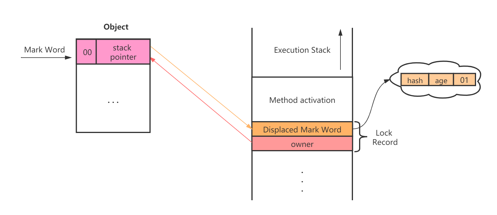
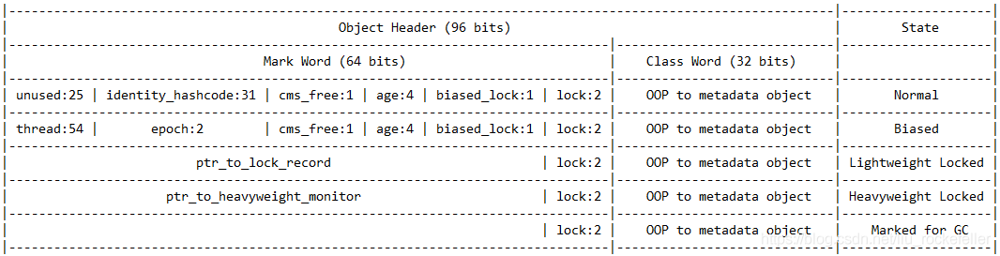

# 线程安全与锁优化


## 2、线程安全


2.1、Java语言中的线程安全


2.2、线程安全的实现方法

2.2.1、互斥同步


2.2.2、非阻塞同步

## 3、锁优化


### 3.1、自旋锁与自适应自旋锁


### 3.2、锁消除


### 3.3、锁粗化


### 3.4、轻量级锁

`synchronized`关键字Java中的多线程同步方案，它是基于互斥量的互斥同步操作。我们知道Java的线程是映射到操作系统的原生内核线程之上的，如果要阻塞或唤醒一条线程，则需要操作系统来帮忙完成，就不可避免地陷入到用户态和核心态的转换。进行这种状态的转换需要耗费很多处理器时间。尤其是同步代码块特别简单时候，其状态转换的时间甚至比用户代码本身的执行时间还长。因此`synchronized`是一个很重量级的操作，也称其为重量级锁。

轻量级锁是JDK 6时加入的新型锁机制，它名字中的“轻量级”是相对于使用操作系统互斥量来实现的传统锁而言的因此传统的锁机制就被称为“重量级”锁。不过，需要强调的是，轻量级锁并不是用来代替重量级锁的，它设计的初衷是在没有多线程竞争的前提下，减少传统重量级锁使用操作系统互斥量产生的性能消耗。

读到这里你可能会感觉很疑惑，“没有多线程竞争的前提下”这句话，既然说没有多线程竞争，那为什么还要加锁呢？如果要加锁，则必然是存在竞争的。没错，确实是这样，但一段同步代码并不是在任何时候都有多个线程在竞争执行，可能某一段时间只有一个线程在执行它，或者虽然有多个线程，它们在顺序执行同步代码块，没有产生交叉。

那么轻量级锁是如何减少传统重量级锁所产生的性消耗的呢？一个最简单的方案就是给同步代码块的同步对象加一个标记，标记已经有一个线程在执行了，执行完成之后，再将标记还原。如果在执行的过程中，有另一个线程也来执行了，则不停的轮询，等待标记重置，然后再去执行。没错，这就是CAS，基于CAS的原理，就可以完美地解决没有竞争情况下重量级锁的性能损耗，虽然会有一点CPU资源的消耗，但相比于用户态和核心态的转换，其产生的性能损耗是大大减少了。

但这里还有一个问题，如果同步代码块的所需的执行时间非常长，怎么办？，如果没有线程来竞争或者同步代码块的执行时间非常短暂，这没有任何问题。但既然加锁，必然是存在竞争的，也不可能保证同步代码块的执行时间一定非常短暂。所以当有线程来竞争的时候，不可能让其一直轮询，这只会白白消耗处理器自身的资源，而不会做任何有价值的工作，这就带来了性能上的浪费。因此这个的轮询等待的时间必须有一个限制，如果轮询的超过了限定的次数仍然没有等到标记重置，就直接使用传统的方式挂起线程。在这种情况下线程的切换也就算不上什么性能消耗了。

上面说明了轻量级锁的目的以及它是如何减少传统重量级锁使用操作系统互斥量产生的性能消耗的。下面将说明轻量级锁的运作原理。要理解轻量级锁，以及后面会讲到的偏向锁的原理和运作过程，必须要对HotSpot虚拟机对象的内存局部（尤其是对象头部分）有所了解。这里假定你已经有所了解。

**轻量级锁运作过程：**

在代码即将进入同步代码块的时候，如果此同步对象没有被锁定（锁标志位为“01”状态），虚拟机首先将在当前线程的栈帧中建立一个名为锁记录（Lock Record）的空间，用于存储锁对象目前Mark Word的拷贝（官方为这份拷贝加了一个Displaced前缀，即Displaced Mark Word），这时线程堆栈与对象头的状态如下图所示：


**轻量级锁加锁成功**

然后虚拟机将使用CAS操作尝试把对象的Mark Word更新为指向Lock Record的指针。如果这个更新动作成功了，即代表改线程拥有了这个对象的锁，并且对象Mark Word的锁标志位（Mark Word的最后两个比特）将转变为“00”，表示此对象处于轻量级锁定状态。这时线程堆栈与对象头的状态如下图所示：

*轻量级锁CAS操作之后对象与堆栈的状态：*



**轻量级锁加锁失败**

如果这个更新操作失败了，那代表着有两种情况下，第一种情况是刚刚有一个线程与其竞争，并且它刚刚在当前线程的前一刻CAS成功，获取到了锁；第二种情况是刚好有另一个线程已经持有了轻量级锁。但无论哪种情况，都代表当前线程获取锁失败，所以接下来就要进行轮询等待，以期望持有锁的线程尽快结束。但是在这里还要考虑一种特殊的情况，考虑如下场景，

```java
/**
 * -XX:-UseBiasedLocking 关闭偏向锁
 */
public static void main(String[] args) {
    Object obj = new Object();
    synchronized (obj) {
        // do something...
        synchronized (obj) {
            // do something...
        }
    }
}
```

我们知道CAS有三个值：旧值、预期值、新值，当旧值等于预期值的时候，就将旧值更新为新值，CAS更新失败，自然是旧值与预期值不相等。在轻量级锁的情况下，Mark Word的预期值都是`hash|age|01`，而CAS失败的情况下，旧值却是一个指向线程的指针，CAS自然是失败的。如果这个指针指向的就是当前线程呢，不可能轮询等待然后膨胀为重量级锁，不然这就陷入了自己等待自己悖论当中了。这种情况下本身也就代表当前线程已经获取到了锁，直接进入同步块继续执行就可以了。因此在CAS执行失败，还需要检查锁对象的Mark Word是否指向当前线程的栈帧，如果是，说明当前线程已经拥有了这个对象的锁，那直接进入同步块继续执行就可以了，否则就说明这个锁对象已经被其他线程抢占了。之后就是轮询等待，如果超过指定次数，膨胀为重量级锁挂起就可以了。

*轻量级锁流程：*


**释放轻量级锁**

释放轻量级锁的方式也是通过CAS来操作，当退出同步代码块的时候，如果对象的Mark Word仍然指向当前线程的锁记录，那就用CAS操作把对象当前的Mark Word和线程中复制的Displaced Mark Word替换回来，替换成功，则整个同步过程就结束了。OK，这是没问题的，但既然使用CAS能替换成功，那自然也会存在替换失败的情况，那什么情况下会替换失败呢？换个角度考虑，替换失败，自然锁对象的Mark Word没有指向当前线程的锁记录，那什么情况下轻量级锁的锁对象的Mark Word没有指向当前线程的锁记录呢？那就是当前线程的轻量级锁被膨胀为重量级锁的时候，此时锁对象的Mark Word是指向互斥量（重量级锁）的指针。 说明有其他线程尝试过获取该锁，并将其膨胀为重量级锁了，因此就要在释放锁的同时，唤醒被挂起的线程。

### 3.5、偏向锁

偏向锁也是JDK 6中引入的一项优化措施，它也是针对在没有多线程竞争前提下的优化。那么它与轻量级锁有何不同呢？如果说轻量级锁是在无竞争的情况下使用CAS操作去消除同步使用的互斥量，那么偏向锁就是在无竞争的情况下把整个同步都消除掉，连CAS操作都不去做了。因此它的目的是消除数据在无竞争情况下的同步原语，相对于轻量级锁而言进一步提高程序的运行性能。

偏向锁是如何做到这一点的呢？

偏向锁的实现思路还是跟轻量级锁有一点相似之处。首先还是一样的，当一个线程进入同步代码块的时候，为锁对象加一个标记，标记当前是偏向状态，一直运行到同步代码块退出，然后另一个线程又执行同一个锁对象的同步代码块，获取偏向状态，一直重复这个过程。如果在同步代码还没有退出的时候，有另一个线程来竞争了，那么就将原偏向线程的同步对象升级为轻量级锁，然后以轻量级锁的方式执行。注意，一旦升级为轻量级锁之后，就永远不会在有偏向状态了，也就是说，之后即使没有竞争，也都是以轻量级锁的方式执行。

**偏向锁的运行原理和运作方式**：

新创建的一个对象的Mark Word结构默认情况下处于无锁的可偏向状态，在状态下hashCode位是空的（只有在首次获取hashCode的时候才会存在），并且偏向标志位为1（偏向标志位为1表示允许偏向，0表示不允许偏向），锁标志位为01。如下图所示：

*新创建对象的Mark Word结构：*

```
|-----------|---------|------------|-------|---------------|---------|
| unused:25 | hashcode:2 | cms_free:1 | age:4 | biased_lock:1 | lock::2 |
|-----------|---------|------------|-------|---------------|---------|
```

当锁对象第一次被线程获取时，首先需要判断偏向标志位是否为1，锁标志位是否为01，简而言之，就是Mark Word的最后3个bit是否为`101`，如果是，则表示当前是偏向模式，只有在偏向模式的下才可以进行偏向加锁。紧接着，还需要判断指向当前线程的指针`JavaThread*`是否为NULL，`JavaThread*`本身是存储在Mark Word的hash位的，`JavaThread*`等于NULL，即意味着hash位为空。这种Mark Word的状态在偏向锁中称之为**匿名偏向(Anonymously biased)**。在匿名偏向状态下，意味着锁对象从未偏向过任何线程。然后使用CAS指令将指向当前线程的指针`JavaThread*`和`Epoch`绑定在Mark Word的hash位，即完成偏向加锁。此时Mark Word如下图所示：

*首次偏向锁对象Mark Word结构：*

```
|-----------|---------|------------|-------|---------------|---------|
| thread:25 | epoch:2 | cms_free:1 | age:4 | biased_lock:1 | lock::2 |
|-----------|---------|------------|-------|---------------|---------|
```

当锁对象不是第一次被线程获取时，还是需要判断是否是偏向模式，以及是否是匿名偏向（`JavaThread*`等于NULL）。如果不是偏向模式，就按照对应的轻量级锁或重量级锁的模式去执行。然后判断是否是匿名偏向，在这里一定按照非匿名偏向的模式执行的，可能会很迷惑，为什么是非匿名偏向的模式呢？因为这里建立的前提是‘锁对象不是第一次被线程获取’，此时锁对象可能处在在三种状态：

1. 被另一个偏向线程持有锁，并且仍在同步代码中。
2. 被另一个偏向线程持有锁，但不在同步代码中。
3. 被另一个偏向线程持有锁，但线程已经被关闭了。

这里需要说明的一点是，线程获取到偏向锁之后，就会将指针`JavaThread*`使用CAS绑定到当前锁对像的Mark Word中，但无论线程是否处于同步代码块中还是已经退出了线程（线程被关闭），`JavaThread*`都不会被重置或清空。所以，在偏向模式下，当锁对象不是第一次被线程获取时，`JavaThread*`一定是指向一个可能存活也可能死亡的线程。此时，对于程序而言，它是不知道锁对象是否是第一次被获取的，因而每次都需要判断是否是匿名偏向。

当确认不是匿名偏向（`JavaThread*`不等于NULL）的时候，就需要做进一步判断了。实际上，偏向锁并不关心`JavaThread*`所指向的线程存活与否，只要确认是非匿名偏向，就将其升级为轻量级锁。不过这里还有一些特殊的情况，那就是`JavaThread*`指向的就是当前线程自己，在这种情况下，直接升级为轻量级锁是没有必要的，因此直接进入同步代码中即可，称这种行为为**锁重入**。不过，在锁重入的情况下，`JavaThread*`指向的线程真的是当前线程自己吗？不一定，想象一下，如果`JavaThread*`指针没变，但其指向内存空间被另一个线程占用，并在这个线程也会对同一个锁对象加锁，会怎么样？在判断`JavaThread*`指向的线程是否是自己的时候，会认为就是自己，但实际上却是另一个线程的线程。参考一下如下代码：

```java

```

因此，这里可以得出一个结论：在锁重入时，`JavaThread*`指向的线程一定是‘自己’，但‘自己’不一定是同一个线程。

但不管怎样，这里都判断的是`JavaThread*`指向的线程是否是‘自己’，如果不是‘自己’，就要将其升级为轻量级锁。在确认升级为轻量级锁之前，是不关心`JavaThread*`所指向的线程存活与否的，但在确认之后，就需要关心了，想象一下，如果`JavaThread*`所指向的线程仍然存活，并处在同步代码中，对于竞争锁的线程而言，是需要等待偏向线程执行完成之后竞争线程才有机会执行的，不可能让偏向线程直接退出同步代码，然后升级为轻量级锁，它们再去竞争，但是偏向锁的机制又不能保证同步性，那怎么办？HotSpot的实现是先将偏向线程和竞争线程都暂停，待锁升级为轻量级锁之后，恢复继续执行。此时，原偏向线程将变为持有轻量级锁，而竞争线程就可以去竞争了，如果竞争不到（如果自旋期间，同步代码没有退出，必然竞争不到），就按照轻量级锁的方式膨胀为重量级锁。如果`JavaThread*`所指向的线程没有存活呢，那就很简单了，直接将锁对象变为无锁状态（Mark Word的最后3个bit为`001`），然后新线程直接按轻量级的方式加锁就可以了。

判断`JavaThread*`所指向的线程是否存活的方式就是遍历当前VM中的所有线程，如果能找到，则说明指向的线程还存活。

偏向锁升级为轻量级锁，首先在安全点暂停偏向线程，然后在当前线程栈中建立Lock Record，更新锁对象的Mark Word与Lock Record指向关系，即完成升级。


#### 撤销

偏向锁撤销只有存在竞争时才会触发，简单的说就是同一把锁被第二个线程访问了。

偏向锁撤销是指当有线程竞争时，偏向线程如果还存活，则升级为轻量级锁，如果已经死亡，则变为无锁状态（001）。

#### 批量重偏向

批量重偏向指同时将多个本该撤销的偏向锁重新偏向。

批量重偏向是一个预期优化，什么是预期优化呢？譬如第一天太阳从东方升起，第二天太阳从东方升起，第三天太阳从东方升起，一直到第十天太阳都是从东方升级，那么我们就可以预期第十一天，太阳也是从东方升起，这就是预期。而优化的是偏向锁的撤销，偏向锁可以提高带有同步但无竞争的程序性能，譬如当同一个线程反复进入同步代码的时候，偏向锁带的性能开销基本可以忽略。但当存在其他线程竞争时，偏向锁就需要等到安全点时撤销为无锁状态或升级为轻量级锁。相对而言，偏向锁的撤销会带来比较大的性能开销，在多线程竞争的情况下，偏向锁不仅不能提高性能，反而会导致性能下降。所以在竞争的情况下，将其升级为轻量级锁是应有之理。但问题在于偏向锁的机制即使没有竞争，只要有非偏向线程取获取锁，也会将其升级为轻量级锁，譬如线程A获取偏向锁G，之后退出结束，然后线程B来获取偏向锁G，此时将偏向锁G升级为轻量级锁，这本身没有问题，但线程A和B之间是不存在竞争的，仅仅是两个不同的线程而已。在这样的情况下，只有少量也没有问题，如果是有大量呢？针对这样的情况，HotSpot增加批量重偏向机制。

看到在这里可能又会有另一个疑惑，线程A和线程B的例子在逻辑上说不通啊！一般情况下我们都是创建一个对象实例作为锁，然后将这个对象实例作为类变量（class的static变量），在代码中对其进行同步加锁，如果线程A首先获得偏向退出，然后线程B在来获取锁并升级为轻量级锁然后执行，退出，再之后线程C、D、E、F...来获得锁（它们之间是不同的线程，但是没有产生竞争），也只是按轻量级锁的方式加锁，不存在所谓偏向锁的撤销问题啊，也只是在线程B的时候撤销了一次而已？

实际上批量重偏向是以类为单位的。考虑这样一种场景：


所以预期优化，预期的是一个Class的大量实例锁对象被偏向锁定和撤销，锁定和撤销的是不同的线程（必定是不同的线程），但它们之间没有产生竞争，所以这是撤销操作时费时且不必要的。所以，优化的是在预期满足的情况下，让后续的同一个Class实例锁对象不必撤销，让其重新偏向即可。

按照OpenJDK官方文档说明：批量重偏向**可以优化类对象被不同线程锁定和解锁但绝不并发锁定的情况。它使类的所有实例的偏向无效，而不会禁用偏向锁定**。

**批量重偏向实现**

按照OpenJDK官方文档的说法，批量重偏向使类的所有实例的偏向无效，言外之意就是当实例的偏向无效时，就可以进行再次偏向，即重偏向。那么该如何实现呢？

首先需要考虑一下四个问题：

1. 什么时候可以重偏向？如果类对象被不同线程锁定和解锁但绝不并发锁定的情况存在，但比较少，开启重偏向还有必要的吗？
2. 如何使类的所有实例的偏向无效？怎么才算无效？
3. 开启重偏向之后，是否之后类的所有实例都可以重偏向了？
4. 重偏向是如何偏向的？
5. 已偏向过的对象还可以再次偏向吗？

在解答这五个问题之前，先直接来看看HotSpot是如何实现的：

​		偏向锁撤销计数器：以Class为单位，每一个Class都维护了一个偏向锁撤销计数器，每当有一个该Class实例的锁对象发生偏向撤销操作时，其计数器就+1，当这个值达到重偏向阈值（默认20）时，JVM就认为这个这个Class的偏向锁有问题，需要进行批量重偏向优化，就会开启批量重偏向。

​		Epoch：每一个Class对象都有一个epoch字段，同时每个处于偏向锁状态的Mark Word也有一个用于记录epoch的bit位，其值等于该锁对象创建时其对应的Class对象中epoch字段的值。每次发生批量重偏向时，就将该Class对象中epoch的值+1，同时遍历JVM中所有线程的栈，找到该Class所有**正处于加锁状态的偏向锁，将其epoch位设为新值，而对于没有处于加锁状态的偏向锁，其epoch仍为旧值。**当epoch仍为旧值的锁对象下次再次被加锁时，发现其epoch与Class的epoch不相等，就认为其是可重偏向的。只要判断epoch不相等，就直接进行重偏向，而不需要再做任何其他验证操作，之所以能这样做，是因为前面说明了‘找到该Class所有正处于加锁状态的偏向锁，将其epoch位设为新值’，所以可以得出结论：当epoch不相等的时候，原偏向线程一定没有处于加锁状态，直接进行重偏向是没有任何隐患的。重偏向是不会进行撤销操作的（如果要撤销，那就违背了批量重偏向的设计初衷），当重偏向时，直接通过CAS将Mark Word中的`JavaThread*`替换为当前线程的指针，以及将epoch更新为最新值就完成了重偏向的锁获取操作。

现在在来解答上面五个问题：

1. 答：如果类对象被不同线程锁定和解锁但绝不并发锁定的情况存在，但比较少，开启重偏向自然是没有必要的，因此需要有一个阈值进行限制，当撤销达到这个阈值时，就开启重偏向。
2. 答：通过锁对象的Epoch进行判断，只要Epoch不相等，就认为偏向无效。
3. 答：是否之后类的所有实例都可以重偏向，这个‘之后类的所有实例’有两种情况，一、该实例是在开启重偏向之前已经创建好了；二、该实例是在开启重偏向之后创建的；前面已经说过，新创建的锁对象其Epoch就是Class的Epoch，所以是不满足重偏向的条件的。总之，就是一句话，只要Epoch不相等，无论什么时候的锁对象实例，都可以偏向。
4. 答：直接通过CAS将Mark Word中的`JavaThread*`替换为当前线程的指针，以及将epoch更新为最新值就完成了重偏向的锁获取操作。
5. *可以，将在下面的‘再次批量重偏向’进行说明。*

**再次批量重偏向**


其做法是：以class为单位，为每个class维护一个偏向锁撤销计数器，每一次该class的对象发生偏向撤销操作时，该计数器+1，当这个值达到重偏向阈值（默认20）时，JVM就认为该class的偏向锁有问题，因此会进行批量重偏向。每个class对象会有一个对应的`epoch`字段，每个处于偏向锁状态对象的`mark word中`也有该字段，其初始值为创建该对象时，class中的`epoch`的值。每次发生批量重偏向时，就将该值+1，同时遍历JVM中所有线程的栈，找到该class所有正处于加锁状态的偏向锁，将其`epoch`字段改为新值。下次获得锁时，发现当前对象的`epoch`值和class的`epoch`不相等，那就算当前已经偏向了其他线程，也不会执行撤销操作，而是直接通过CAS操作将其`mark word`的Thread Id 改成当前线程Id。

当达到重偏向阈值后，假设该class计数器继续增长，当其达到批量撤销的阈值后（默认40），JVM就认为该class的使用场景存在多线程竞争，会标记该class为不可偏向，之后，对于该class的锁，直接走轻量级锁的逻辑。


#### 批量撤销


```java
static Thread t0,t1, t2, t3,tt0,tt1;

    static int loopNumber = 30;


    /**
     * 测试偏向锁批量重偏向开始之后，如果之后有锁对象仍被偏向锁锁定，会对其他可重偏向的锁对象有什么影响？
     * 测试结果：没有任何影响
     */
    private static void biasedLockingBulkRebias2() throws InterruptedException {
        List<Object> objs = new ArrayList<>(loopNumber);

        t0 = new Thread(() -> {
            System.out.println("t1----------------------------------------------------------------------------");
            for (var i = 0; i < 22; i++) {
                //这里请不要用java.lang.Object类做实验
                User obj = new User();
                synchronized (obj) {
                    System.out.println(i + " : " + printMarkWord(obj));
                }
                objs.add(obj);
            }
            LockSupport.unpark(tt0);
        });

        tt0 = new Thread(() -> {
            LockSupport.park();
            System.out.println("tt0----------------------------------------------------------------------------");
            //这里请不要用java.lang.Object类做实验
            User obj = new User();
            objs.add(obj);
            synchronized (obj) {
                System.out.println(printMarkWord(obj));
                LockSupport.unpark(tt1);
                try {
                    Thread.sleep(500);
                } catch (InterruptedException e) {
                    e.printStackTrace();
                }
            }
        });

        tt1 = new Thread(() -> {
            LockSupport.park();
            System.out.println("tt1----------------------------------------------------------------------------");
            //这里请不要用java.lang.Object类做实验
            User obj = new User();
            objs.add(obj);
            synchronized (obj) {
                System.out.println(printMarkWord(obj));
                LockSupport.unpark(t1);
                try {
                    Thread.sleep(200);
                } catch (InterruptedException e) {
                    e.printStackTrace();
                }
            }
        });

        t1 = new Thread(() -> {
            LockSupport.park();
            System.out.println("t1----------------------------------------------------------------------------");
            for (var i = 0; i < loopNumber-24; i++) {
                //这里请不要用java.lang.Object类做实验
                User obj = new User();
                synchronized (obj) {
                    System.out.println(i + " : " + printMarkWord(obj));
                }
                objs.add(obj);
            }
            LockSupport.unpark(t2);
        });

        t2 = new Thread(() -> {
            //休眠，等待t1唤醒
            LockSupport.park();
            System.out.println("t2----------------------------------------------------------------------------");
            for (var i = 0; i < objs.size(); i++) {
                Object obj = objs.get(i);
                synchronized (obj) {
                    System.out.println(i + " : " + printMarkWord(obj));
                }
            }
        });
        //t2先执行，以避免t1在unpark t2的时候，t2都还没有创建，虽然这种概率极小。
        t2.start();
        t1.start();
        tt1.start();
        tt0.start();
        t0.start();
    }


    /**
     * 测试偏向锁升级轻量级锁（即偏向线程还存活的状态）是否算撤销
     * 测试结果：虽然偏向锁所指向的线程还存活，但已退出同步代码块，仍然可重偏向。
     */
    private static void biasedLockingBulkRebias1() throws InterruptedException {
        List<Object> objs = new ArrayList<>(loopNumber);

        List<Thread> ts = new ArrayList<>();
        for (var j = 0; j < 25; j++) {
            Thread tt = new Thread(() -> {
                //这里请不要用java.lang.Object类做实验
                User obj = new User();
                synchronized (obj) {
                    objs.add(obj);
                    System.out.println(printMarkWord(obj));
                    try {
                        Thread.sleep(5000);
                    } catch (InterruptedException e) {
                        e.printStackTrace();
                    }
                }
            });
            tt.start();
            ts.add(tt);
        }

//        Thread t0 = new Thread(() -> {
//            for (var j = 0; j < 25; j++) {
//                //这里请不要用java.lang.Object类做实验
//                User obj = new User();
//                synchronized (obj) {
//                    System.out.println(j + " : " + printMarkWord(obj));
//                }
//                objs.add(obj);
//            }
//            LockSupport.park();
//        });


        //t0.start();
        Thread.sleep(3000);
        System.out.println("----------------------------------------------------------------------------");
        t1 = new Thread(() -> {
            for (var i = 0; i < loopNumber-25; i++) {
                //这里请不要用java.lang.Object类做实验
                User obj = new User();
                synchronized (obj) {
                    System.out.println(i + " : " + printMarkWord(obj));
                }
                objs.add(obj);
            }
            LockSupport.unpark(t2);
        });


        t2 = new Thread(() -> {
            //休眠，等待t1唤醒
            LockSupport.park();
            System.out.println("t2----------------------------------------------------------------------------");
            for (var i = 0; i < objs.size(); i++) {
                Object obj = objs.get(i);
                synchronized (obj) {
                    System.out.println(i + " : " + printMarkWord(obj));
                }
            }
        });
        //t2先执行，以避免t1在unpark t2的时候，t2都还没有创建，虽然这种概率极小。
        t2.start();
        t1.start();
    }


    private static void biasedLockingBulkRebias() {
        List<Object> objs = new ArrayList<>(loopNumber);
        t1 = new Thread(() -> {
            for (var i = 0; i < loopNumber; i++) {
                //这里请不要用java.lang.Object类做实验
                User obj = new User();
                synchronized (obj) {
                    System.out.println(i + " : " + printMarkWord(obj));
                }
                objs.add(obj);
            }
            LockSupport.unpark(t2);
        });


        t2 = new Thread(() -> {
            //休眠，等待t1唤醒
            LockSupport.park();
            System.out.println("----------------------------------------------------------------------------");
            for (var i = 0; i < objs.size(); i++) {
                Object obj = objs.get(i);
                synchronized (obj) {
                    System.out.println(i + " : " + printMarkWord(obj));
                }
            }
        });
        //t2先执行，以避免t1在unpark t2的时候，t2都还没有创建，虽然这种概率极小。
        t2.start();
        t1.start();
    }


    private static void test0() throws InterruptedException {
        List<User> objs = new ArrayList<>(30);
        Thread t1 = new Thread(() -> {
            for (var i = 0; i < 30; i++) {
                User obj = new User();
                synchronized (obj) {
                    System.out.println(i + " : " + printMarkWord(obj));
                }
                objs.add(obj);
            }
        });


        Thread t2 = new Thread(() -> {
            for (var i = 0; i < objs.size(); i++) {
                User obj = objs.get(i);
                synchronized (obj) {
                    System.out.println(i + " : " + printMarkWord(obj));
                }
            }
        });
        t1.start();
        t1.join();
        System.out.println("--------------------------------------------------------------------------");
        t2.start();
        t2.join();
    }

    private static void test1() throws InterruptedException {
        List<User> objs = new ArrayList<>(30);
        //Thread t1,t2;
        Thread t1 = new Thread(() -> {
            for (var i = 0; i < 30; i++) {
                User obj = new User();
                synchronized (obj) {
                    System.out.print(i + " : " + printMarkWord(obj));
                    //System.out.println(i+ " : "+ ClassLayout.parseInstance(obj).toPrintable());
                }
                objs.add(obj);
            }
//            LockSupport.unpark(t2);
        });
        t1.start();
        t1.join();
//        Thread.sleep(2000);
        //创建线程t0占位，防止复用线程内存空间
        Thread t0 = new Thread(() -> {
            System.out.println("--------------------------------------------------------------------------");
            try {
                Thread.sleep(500);
            } catch (InterruptedException e) {
                e.printStackTrace();
            }
        });
        t0.start();
        //Thread.sleep(1000);
        Thread t2 = new Thread(() -> {
//            LockSupport.park();
            //System.out.println("--------------------------------------------------------------------------");
            for (var i = 0; i < objs.size(); i++) {
                User obj = objs.get(i);
                synchronized (obj) {
                    System.out.println(i + " : " + printMarkWord(obj));
                    //System.out.println(i + " : " + ClassLayout.parseInstance(obj).toPrintable());
                }
            }
        });
        t2.start();
        t2.join();
    }


    public static String printMarkWord(Object obj) {
        String table = ClassLayout.parseInstance(obj).toPrintable();
        String[] split = table.split("\\)");
        return changeoverBit(split[4].split("\\(")[1]) +
                changeoverBit(split[1].split("\\(")[1]);
    }

    public static String changeoverBit(String bitString) {
        String[] bitStringArray = bitString.split(" ");
        StringBuilder sb = new StringBuilder();
        for (var i = bitStringArray.length - 1; i >= 0; i--) {
            sb.append(bitStringArray[i]).append(" ");
        }
        return sb.toString();
    }

    private static void test4() throws InterruptedException {
        Vector<Dog> list = new Vector<>();

        int loopNumber = 39;
        t1 = new Thread(() -> {
            for (int i = 0; i < loopNumber; i++) {
                Dog d = new Dog();
                list.add(d);
                synchronized (d) {
                    System.out.println(i + "\t" + printMarkWord(d));
                }
            }
            LockSupport.unpark(t2);
        }, "t1");
        t1.start();

        t2 = new Thread(() -> {
            LockSupport.park();
            System.out.println("===============> ");
            for (int i = 0; i < loopNumber; i++) {
                Dog d = list.get(i);
                System.out.println(i + "\t" + printMarkWord(d));

                synchronized (d) {
                    System.out.println(i + "\t" + printMarkWord(d));
                }
                System.out.println(i + "\t" + printMarkWord(d));
            }
            LockSupport.unpark(t3);
        }, "t2");
        t2.start();

        t3 = new Thread(() -> {
            LockSupport.park();
            System.out.println("===============> ");
            for (int i = 0; i < loopNumber; i++) {
                Dog d = list.get(i);
                System.out.println(i + "\t" + printMarkWord(d));
                synchronized (d) {
                    System.out.println(i + "\t" + printMarkWord(d));
                }
                System.out.println(i + "\t" + printMarkWord(d));
            }
        }, "t3");
        t3.start();

        t3.join();
        System.out.println(ClassLayout.parseInstance(new Dog()).toPrintable());
    }


    static class Dog {

    }
```


批量重偏向和批量撤销理解:https://blog.csdn.net/qq_33553218/article/details/107699356

https://blog.csdn.net/zq1994520/article/details/83998117

https://www.semanticscholar.org/paper/Lock-optimizations-on-the-HotSpot-VM-Pool/edf954412a9b1ce955bea148199f325759779540?p2df

https://juejin.im/post/6844903741796122631


https://blog.csdn.net/sinat_41832255/article/details/89309944

https://www.jianshu.com/p/2a25e9954527

https://wiki.openjdk.java.net/display/HotSpot/Synchronization

https://www.zhihu.com/question/56582060/answer/155398235

https://www.cnblogs.com/xyang/p/11698549.html

https://www.itqiankun.com/article/bias-lightweight-synchronized-lock

https://www.itqiankun.com/article/bias-lock-epoch-effect

https://zhuanlan.zhihu.com/p/34662715?utm_source=wechat_session

http://hg.openjdk.java.net/jdk8u/jdk8u/hotspot/file/9ce27f0a4683/src/share/vm/runtime/biasedLocking.cpp#l146

https://github.com/farmerjohngit/myblog/issues/12

https://www.jianshu.com/p/4758852cbff4

https://zhanghaoxin.blog.csdn.net/article/details/108627063

https://www.cnblogs.com/katsu2017/p/12610002.html

https://www.cnblogs.com/dennyzhangdd/p/6734638.html

https://www.cnblogs.com/noures/archive/2012/04/20/2458793.html

https://www.zhihu.com/question/29976202

https://github.com/openjdk/jdk/blob/master/src/hotspot/share/runtime/synchronizer.cpp

https://www.jianshu.com/p/7445361e187f


https://wiki.openjdk.java.net/display/HotSpot/Synchronization

HotSpot支持存储释放偏向锁，以及偏向锁的批量重偏向和撤销。这个特性可以通过JVM的参数进行切换，而且这是默认支持的。Unlock状态下MarkWord的一个比特位用于标识该对象偏向锁是否被使用或者是否被禁止。如果该bit位为0，则该对象未被锁定，并且禁止偏向；如果该bit位为1，则意味着该对象处于以下三种状态：

- **匿名偏向(Anonymously biased)**
  在此状态下thread_ptr为NULL(0)，意味着还没有线程偏向于这个锁对象。第一个试图获取该锁的线程将会面临这个情况，使用原子CAS指令可将该锁对象绑定于当前线程。这是允许偏向锁的类对象的初始状态。
- **可重偏向(Rebiasable)**
  在此状态下，偏向锁的epoch字段是无效的(与锁对象对应的klass的mark_prototype的epoch值不匹配)。下一个试图获取锁对象的线程将会面临这个情况，使用原子CAS指令可将该锁对象绑定于当前线程。在批量重偏向的操作中，未被持有的锁对象都被至于这个状态，以便允许被快速重偏向。
- **已偏向(Biased)**
  这种状态下，thread ptr非空，且epoch为有效值——意味着其他线程正在只有这个锁对象。


 

此时，锁对象处于**已偏向(Biased)**状态，在这种状态下，JavaThread*非空，且epoch为有效值，意味着有线程获取到了当前偏向锁。

偏向锁同步块退出或者偏向线程被关闭，锁对象的偏向状态并不会被重置，仍然保持**已偏向(Biased)**状态。

如果在前一个偏向线程退出之后，又有另一个线程获取当前锁对象，将继续重复偏向锁的模式，而不是像有些博客资料所描述升级为轻量级锁。与锁对象第一次被线程获取时所不同的是，此时锁状态为**可重偏向(Rebiasable)**状态
在此状态下，偏向锁的epoch字段是无效的(与锁对象对应的klass的mark_prototype的epoch值不匹配)。下一个试图获取锁对象的线程将会面临这个情况，使用原子CAS指令可将该锁对象绑定于当前线程。在批量重偏向的操作中，未被持有的锁对象都被至于这个状态，以便允许被快速重偏向。




1. **先用标志位判断是否支持偏向锁。**锁对象的对象头MW区域后3个bit位的值是101。特别需要注意：如果是001，是无锁状态，代表偏向锁不可用，会走加轻量级锁流程。

2. 再用ThreadId值，决定加锁还是重入还是竞争

   ：

   1. **0值加锁**。如果ThreadId=0，代表无任何线程持有该对象的偏向锁，可以执行加锁操作，进入加锁流程；

   2. 非0值，

      1. **且为当前线程id，重入。**如果ThreadId!=0，就判断其值是否是当前线程的ID，分两种情况：如果是，直接锁重入，不再重复加锁。
      2. **不为当前线程id，加锁或竞争。**非0值，说明是其他线程（图中T2）已获得了同步锁。对象所属Class里也会维护一个epoch值，这里我们简称为cEpoch，比较两者：

   3. 1. 1. **epoch小于类的cEpoch值，加锁**。如果epoch<cEpoch,说明发生过批量重偏向，当前锁对象已被“释放”了。此时进行“重偏向”（里说的释放并非真正意义的释放，而是隐含着一层意思：当前线程已经执行完同步块，且在某次重偏向操作中，也检测到这一点，不再维护epoch的最新值，这样新的线程认为此时该偏向锁，可以加锁，直接CAS修改ThreadId即可）
         2. **epoch等于类的cEpoch值，竞争锁。**


官方论文：https://www.oracle.com/technetwork/java/biasedlocking-oopsla2006-wp-149958.pdf

https://zhuanlan.zhihu.com/p/26475023

-XX:-UseBiasedLocking
-XX:BiasedLockingStartupDelay=0
-XX:+UnlockExperimentalVMOptions
-XX:hashCode=5


intx BiasedLockingBulkRebiasThreshold         = 20                                        {product} {default}
     intx BiasedLockingBulkRevokeThreshold         = 40                                        {product} {default}
     intx BiasedLockingDecayTime                   = 25000                                     {product} {default}
     intx BiasedLockingStartupDelay                = 0                                         {product} {default}


 -XX:+PrintFlagsFinal

在没有实际竞争的情况下，还能够针对部分场景继续优化。如果不仅仅没有实际竞争，自始至终，使用锁的线程都只有一个，那么，维护轻量级锁都是浪费的。**偏向锁的目标是，减少无竞争且只有一个线程使用锁的情况下，使用轻量级锁产生的性能消耗**。轻量级锁每次申请、释放锁都至少需要一次CAS，但偏向锁只有初始化时需要一次CAS。

“偏向”的意思是，*偏向锁假定将来只有第一个申请锁的线程会使用锁*（不会有任何线程再来申请锁），因此，*只需要在Mark Word中CAS记录owner（本质上也是更新，但初始值为空），如果记录成功，则偏向锁获取成功*，记录锁状态为偏向锁，*以后当前线程等于owner就可以零成本的直接获得锁；否则，说明有其他线程竞争，膨胀为轻量级锁*。

偏向锁无法使用自旋锁优化，因为一旦有其他线程申请锁，就破坏了偏向锁的假定。


--------------------------------------------------------------------------------


注：本文翻译自【Evaluating and improving biased locking in the HotSpot virtual machine】，译者水平有限，如词不达意，请告之！

HotSpot支持存储释放偏向锁，以及偏向锁的批量重偏向和撤销。这个特性可以通过JVM的参数进行切换，而且这是默认支持的。Unlock状态下MarkWord的一个比特位用于标识该对象偏向锁是否被使用或者是否被禁止。如果该bit位为0，则该对象未被锁定，并且禁止偏向；如果该bit位为1，则意味着该对象处于以下三种状态：

- **匿名偏向(Anonymously biased)**
  在此状态下thread_ptr为NULL(0)，意味着还没有线程偏向于这个锁对象。第一个试图获取该锁的线程将会面临这个情况，使用原子CAS指令可将该锁对象绑定于当前线程。这是允许偏向锁的类对象的初始状态。
- **可重偏向(Rebiasable)**
  在此状态下，偏向锁的epoch字段是无效的(与锁对象对应的klass的mark_prototype的epoch值不匹配)。下一个试图获取锁对象的线程将会面临这个情况，使用原子CAS指令可将该锁对象绑定于当前线程。在批量重偏向的操作中，未被持有的锁对象都被至于这个状态，以便允许被快速重偏向。
- **已偏向(Biased)**
  这种状态下，thread ptr非空，且epoch为有效值——意味着其他线程正在只有这个锁对象。

基于偏向锁对象需要使用hashcode字段作为偏向线程id标识的事实，被hash的对象不可被用作偏向锁。对于允许偏向的对象在进行hashcode计算时，首先要吊销(revoke)所有的偏向(不管是有效的还是无效的)，然后使用CAS将计算好的hashcode值放到MarkWord中，尽管这仅仅适用于“identity hashcode(使用Object类的hashcode()方法进行计算)”。普通Java类型hashcode的计算需要重载Object的hashcode()方法，但不必要去显示调用这个方法；因此，对于没有显示调用Object#hashcode()方法的类的对象，仍然适用于偏向锁的机制——可被用作锁对象使用。

HotSpot为所有加载的类型，在class元数据——InstanceKlass中保留了一个MarkWord原型——mark_prototype。这个值的bias位域决定了该类型的对象是否允许被偏向锁定。与此同时，当前的epoch位也被保留在prototype中。这意味着，对应class的新对象可以简单地直接拷贝这个原型值，而不必在后面进行修正。在批量重偏向(bulk rebias)的操作中，prototype的epoch位将会被更新；在批量吊销(bulk revoke)的操作中，prototype将会被置成不可偏向的状态——bias位被置0。

偏向锁的获取依靠原子CAS指令将线程指针插入MarkWord中。其先决条件是：1.该对象处于匿名偏向状态；2.该对象处于可重偏向状态(一个锁对象仅能被一个线程偏向一次)。只要锁对象被偏向，递归锁定和解锁仅仅需要读取对象头以及对应Klass的prototype去验证偏向是否被吊销。

HotSpot中偏向锁的撤销是JVM处于在全局安全点时被执行的。在撤销过程中，撤销者会遍历当前偏向线程的锁记录，藉此推断对象当前是否被锁定。如果发现锁对象被一个偏向线程持有，锁记录将被修改——如同轻量级锁被使用一样；如果锁对象未被持有，这是取决于触发撤销的原因，锁对象要么被禁止用作偏向锁，要么被禁止重新偏向于撤销线程。

即使偏向锁的特性被打开，出于性能（启动时间）的原因在JVM启动后的的头4秒钟这个feature是被禁止的。这也意味着在此期间，prototype MarkWord会将它们的bias位设置为0，以禁止实例化的对象被偏向。4秒钟之后，所有的prototype MarkWord的bias位会被重设为1，如此新的对象就可以被偏向锁定了。

获取偏向锁的步骤：

1. **验证对象的bias位**
   如果是0，则该对象不可偏向，应该使用轻量级锁算法。
2. **验证对象所属InstanceKlass的prototype的bias位**
   确认prototype的bias为是否被设置。如果没有设置，则该类所有对象全部不允许被偏向锁定；并且该类所有对象的bias位都需要被重置，使用轻量级锁替换。
3. **校验epoch位**
   校验对象的MarkWord的epoch位是否与该对象所属InstanceKlass的prototype的MarkWord的epoch匹配。如果不匹配，则表明偏向已过期，需要重新偏向。这种情况，偏向线程可以简单地使用原子CAS指令重新偏向于这个锁对象。
4. **校验owner线程**
   比较偏向线程ID与当前线程ID。如果匹配，则表明当前线程已经获得了偏向，可以安全返回。如果不匹配，对象锁被假定为匿名偏向状态，当前线程应该尝试使用CAS指令获得偏向。如果失败的话，就尝试撤销(很可能引入安全点)，然后回退到轻量级锁；如果成功，当前线程成功获得偏向，可直接返回。


### 3.6、代码测试

1. 新对象

   证明新对象默认可偏向


3.6.1、无锁


3.6.1、偏向锁

证明偏向锁

证明一个偏向同步代码块退出之后，另一个线程尝试获取该锁，仍然是偏向锁

证明偏向锁升级之后就永远是轻量级锁

验证获取hashcode之后偏向锁不可用


3.6.1、轻量级锁


3.6.1、重量级锁


3.6.1、偏向锁升级为轻量级


https://xie.infoq.cn/article/4c7cd2c5d4d004b4bc1c381b7

https://github.com/openjdk/jdk/blob/master/src/hotspot/share/oops/markWord.hpp

https://github.com/openjdk/jdk/blob/master/src/hotspot/share/oops/oop.inline.hpp

https://github.com/openjdk/jdk/blob/master/src/hotspot/share/runtime/synchronizer.cpp

https://www.zhihu.com/question/29976202

https://www.cnblogs.com/noures/archive/2012/04/20/2458793.html

https://www.cnblogs.com/dennyzhangdd/p/6734638.html

https://www.cnblogs.com/katsu2017/p/12610002.html

https://zhanghaoxin.blog.csdn.net/article/details/108627063

https://paoluz.link/user/shop

https://www.jianshu.com/p/36eedeb3f912

https://www.jianshu.com/p/4758852cbff4

https://www.jianshu.com/p/7445361e187f

http://hg.openjdk.java.net/jdk8u/jdk8u/hotspot/file/9ce27f0a4683/src/share/vm/runtime/biasedLocking.cpp#l146

https://www.zhihu.com/question/57774162


native
为什么使用native：
Java不是完美的，Java的不足除了体现在运行速度上要比传统的C++慢许多之外，Java无法直接访问到操作系统底层（如系统硬件等)，为此Java使用native方法来扩展Java程序的功能

使用步骤：
1、在Java中声明native()方法，然后编译。
2、用javah产生一个.h文件。
3、写一个.cpp文件实现native导出方法，其中需要包含第二步产生的.h文件（注意其中又包含了JDK带的jni.h文件）。
4、将第三步的.cpp文件编译成动态链接库文件。
5、在Java中用System.loadLibrary()方法加载第四步产生的动态链接库文件，这个native()方法就可以在Java中被访问了。

示例代码如下：

public class HelloWorld {
    public native void displayHelloWorld();//所有native关键词修饰的都是对本地的声明
    static {
        System.loadLibrary("hello");//载入本地库
    }
    public static void main(String[] args) {
        new HelloWorld().displayHelloWorld();
    }
}


Java的native方法
第一篇：
今天花了两个小时把一份关于什么是Native Method的英文文章好好了读了一遍，以下是我依据原文的理解。
一. 什么是Native Method
   简单地讲，一个Native Method就是一个java调用非java代码的接口。一个Native Method是这样一个java的方法：该方法的实现由非java语言实现，比如C。这个特征并非java所特有，很多其它的编程语言都有这一机制，比如在C＋＋中，你可以用extern "C"告知C＋＋编译器去调用一个C的函数。
   "A native method is a Java method whose implementation is provided by non-java code."
   在定义一个native method时，并不提供实现体（有些像定义一个java interface），因为其实现体是由非java语言在外面实现的。，下面给了一个示例：    
    public class IHaveNatives
    {
      native public void Native1( int x ) ;
      native static public long Native2() ;
      native synchronized private float Native3( Object o ) ;
      native void Native4( int[] ary ) throws Exception ;
    } 
    这些方法的声明描述了一些非java代码在这些java代码里看起来像什么样子（view）.
    标识符native可以与所有其它的java标识符连用，但是abstract除外。这是合理的，因为native暗示这些方法是有实现体的，只不过这些实现体是非java的，但是abstract却显然的指明这些方法无实现体。native与其它java标识符连用时，其意义同非Native Method并无差别，比如native static表明这个方法可以在不产生类的实例时直接调用，这非常方便，比如当你想用一个native method去调用一个C的类库时。上面的第三个方法用到了native synchronized，JVM在进入这个方法的实现体之前会执行同步锁机制（就像java的多线程。）
    一个native method方法可以返回任何java类型，包括非基本类型，而且同样可以进行异常控制。这些方法的实现体可以制一个异常并且将其抛出，这一点与java的方法非常相似。当一个native method接收到一些非基本类型时如Object或一个整型数组时，这个方法可以访问这非些基本型的内部，但是这将使这个native方法依赖于你所访问的java类的实现。有一点要牢牢记住：我们可以在一个native method的本地实现中访问所有的java特性，但是这要依赖于你所访问的java特性的实现，而且这样做远远不如在java语言中使用那些特性方便和容易。
    native method的存在并不会对其他类调用这些本地方法产生任何影响，实际上调用这些方法的其他类甚至不知道它所调用的是一个本地方法。JVM将控制调用本地方法的所有细节。需要注意当我们将一个本地方法声明为final的情况。用java实现的方法体在被编译时可能会因为内联而产生效率上的提升。但是一个native final方法是否也能获得这样的好处却是值得怀疑的，但是这只是一个代码优化方面的问题，对功能实现没有影响。
    如果一个含有本地方法的类被继承，子类会继承这个本地方法并且可以用java语言重写这个方法（这个似乎看起来有些奇怪），同样的如果一个本地方法被fianl标识，它被继承后不能被重写。
   本地方法非常有用，因为它有效地扩充了jvm.事实上，我们所写的java代码已经用到了本地方法，在sun的java的并发（多线程）的机制实现中，许多与操作系统的接触点都用到了本地方法，这使得java程序能够超越java运行时的界限。有了本地方法，java程序可以做任何应用层次的任务。
二.为什么要使用Native Method
   java使用起来非常方便，然而有些层次的任务用java实现起来不容易，或者我们对程序的效率很在意时，问题就来了。
   与java环境外交互：
   有时java应用需要与java外面的环境交互。这是本地方法存在的主要原因，你可以想想java需要与一些底层系统如操作系统或某些硬件交换信息时的情况。本地方法正是这样一种交流机制：它为我们提供了一个非常简洁的接口，而且我们无需去了解java应用之外的繁琐的细节。
   与操作系统交互：
   JVM支持着java语言本身和运行时库，它是java程序赖以生存的平台，它由一个解释器（解释字节码）和一些连接到本地代码的库组成。然而不管怎 样，它毕竟不是一个完整的系统，它经常依赖于一些底层（underneath在下面的）系统的支持。这些底层系统常常是强大的操作系统。通过使用本地方法，我们得以用java实现了jre的与底层系统的交互，甚至JVM的一些部分就是用C写的，还有，如果我们要使用一些java语言本身没有提供封装的操作系统的特性时，我们也需要使用本地方法。
    Sun's Java
    Sun的解释器是用C实现的，这使得它能像一些普通的C一样与外部交互。jre大部分是用java实现的，它也通过一些本地方法与外界交互。例如：类java.lang.Thread 的 setPriority()方法是用java实现的，但是它实现调用的是该类里的本地方法setPriority0()。这个本地方法是用C实现的，并被植入JVM内部，在Windows 95的平台上，这个本地方法最终将调用Win32 SetPriority() API。这是一个本地方法的具体实现由JVM直接提供，更多的情况是本地方法由外部的动态链接库（external dynamic link library）提供，然后被JVM调用。
三.JVM怎样使Native Method跑起来：
    我们知道，当一个类第一次被使用到时，这个类的字节码会被加载到内存，并且只会回载一次。在这个被加载的字节码的入口维持着一个该类所有方法描述符的list，这些方法描述符包含这样一些信息：方法代码存于何处，它有哪些参数，方法的描述符（public之类）等等。
    如果一个方法描述符内有native，这个描述符块将有一个指向该方法的实现的指针。这些实现在一些DLL文件内，但是它们会被操作系统加载到java程序的地址空间。当一个带有本地方法的类被加载时，其相关的DLL并未被加载，因此指向方法实现的指针并不会被设置。当本地方法被调用之前，这些DLL才会被加载，这是通过调用java.system.loadLibrary()实现的。

   最后需要提示的是，使用本地方法是有开销的，它丧失了java的很多好处。如果别无选择，我们可以选择使用本地方法。

   对CAS的理解，CAS是一种无锁算法，CAS有3个操作数，内存值V，旧的预期值A，要修改的新值B。当且仅当预期值A和内存值V相同时，将内存值V修改为B，否则什么都不做。

   https://xie.infoq.cn/article/4c7cd2c5d4d004b4bc1c381b7
64位JVM的Java对象头详解：   https://blog.csdn.net/baidu_28523317/article/details/104453927
 JVM（hotspot 64位）对象头内部组成、锁升级过程：  https://www.cnblogs.com/zealoter/articles/12799810.html
   https://wiki.openjdk.java.net/display/HotSpot/CompressedOops
Java object header ：   https://blog.csdn.net/liu_rockefeller/article/details/103289537
 synchronized锁升级和jol：  https://www.cnblogs.com/katsu2017/p/12610002.html
 JAVA源码解析(9) - hashcode 方法：  https://zhanghaoxin.blog.csdn.net/article/details/108627063
   https://github.com/openjdk/jdk/blob/master/src/hotspot/share/runtime/synchronizer.cpp
 native方法jvm源码查找：  https://jzuekk.com/page/jvm_sourcecode
 Java 15的新特性：  http://www.qiqee.net/single?id=193
 测试偏向锁对性能的影响：  https://blog.csdn.net/weixin_38106322/article/details/108135731
   https://github.com/openjdk/jdk/blob/master/src/hotspot/share/oops/markWord.hpp
 synchronized锁升级的过程 ：  https://www.cnblogs.com/ccsert/p/12381817.html


ObjectSynchronizer


