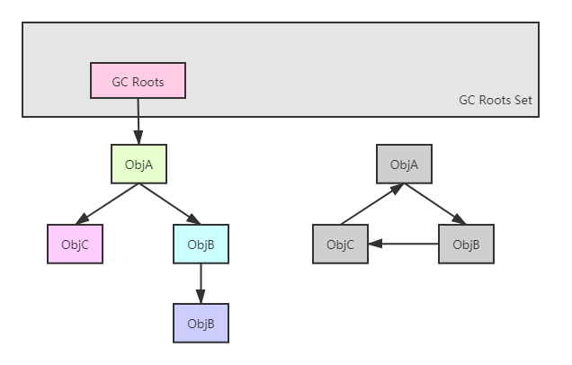
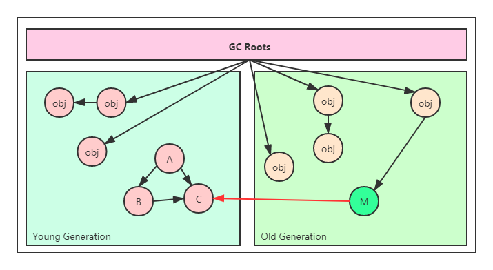
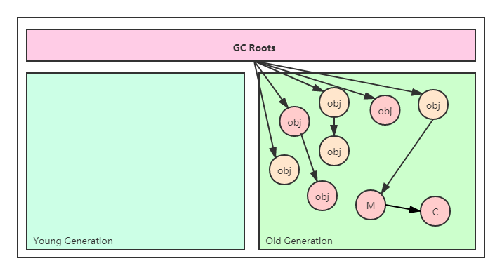

# 垃圾收集器与内存分配策略


## 3.2、对象已死？

### 3.2.1、引用计数法

<div style="color:green;font-weight:bold">引用计数法原理：</div>
<div style="color:green">在对象中添加一个引用计数器，每当有一个地方引用它时，计数器值就加一；当引用失效时，计数器值就减一；任何时刻计数器为零的对象就是不可能再被使用的。</div>
引用计数法实现简单、高效，在一些比较著名的领域都有应用，比如微软COM技术，Python语言等。但在主流的Java虚拟机里面都没有选用引用计数算法来管理内存，这主要是因这个看似简单的算法有很多例外情况需要考虑，必须配合大量额外的处理才能保证正确地工作，其中最典型的问题就是很难解决对象循环引用的问题。

如下图所示：对象A、B、C相互引用，除此之外，这三个对象再无其他引用，也就是说，这三个对象已经不可能再被访问了，但是又因为它们之间相互引用，引用计数器不为0，进而导致就不会被回收。


### 3.2.2、可达性分析算法

<div style="color:green;font-weight:bold">可达性分析算法原理：</div>
<div style="color:green">通过一系列称为“GC Roots”的根对象作为起始节点集，从这些节点开始，根据引用关系向下搜索，搜索过程所走的路径称为“引用链”（Reference Chain），如果某个对象到GC Roots间没有任何引用链相连，或者用图论的话来说就是从GC Roots到这个对象不可达时，则证明此对象是不可能再被使用的。</div>
如下图所示：对象A、B、C相互引用，但它们到GC Roots不可达，因此会被判定为可回收对象。



在Java技术体系中，固定可作为GC Roots的对象包括以下几种：

1. 在虚拟机栈（栈帧中的本地变量表）中引用的对象，比如各个线程被调用的方法堆栈中使用到的参数、局部变量、临时变量等。
2. 在方法区中类静态属性引用的对象，比如Java类的引用类型静态变量。
3. 在方法区中常量引用的对象，比如字符串常量池（String Table）里的引用。
4. 在本地方法栈JNI（即通常所说的Native方法）引用的对象。
5. Java虚拟机内部的引用，如基本数据类型对应的Class对象，一些常驻的异常对象（比如`NullPointException`、`OutOfMemoryError`）等，还有系统类加载器。
6. 所有被同步锁（`synchronized`关键字）持有的对象。
7. 反映Java虚拟机内部情况的`JMXBean`、`JVMTI`中注册的回调、本地代码缓存等。

除了上述固定的GC Roots集合之外，根据所选用的垃圾收集器以及当前回收的内存区域不同，还有其他对象“临时性”地加入，构成GC Roots集合。例如分代收集和局部回收。如果老年代的对象引用了新生代的对象，而此时只回收新生代区域的对象；或者G1收集器中的Region引用了其他Region中的对象，在此时，就需要将这些关联区域的引用对象也作为GC Roots加以扫描分析。

### 3.2.3、再谈引用

在JDK1.2版之前，Java里面的引用是很传统的定义：如果reference类型的数据中存储的数值代表的是另外一块内存的起始地址，就称该reference数据是代表某块内存、某个对象的引用。在这种定义下，一个对象在这种定义下只有“被引用”和“未被引用”两种状态，对于一些“食之无味，弃之可惜”的对象就显得无能为力。譬如希望能描述一类对象：当内存空间足够时，就保留在内存中，当垃圾收集之后内存还是紧张，就抛弃这些对象——缓存功能。

在JDK1.2版之后，Java对引用的概念进行了扩充，将引用分为*强引用（Strongly Reference）*、*软引用（Soft Reference）*、*弱引用（Weak Reference）*和*虚引用（Phantom Reference）*4种，这4种引用强度依次组件减弱。

- **强引用**是最传统的“引用”的定义，是指在程序代码之中普遍存在的引用赋值，即类似“`Object obj = new Object`”这种引用关系。无论任何情况下，只要强引用关系还存在，垃圾收集器就永远不会回收掉被引用的对象。
- **软引用**是用来描述一些还有用，但非必须的对象。只被软引用关联着的对象，在系统将要发生内存溢出异常前，会把这些对象列进回收范围之中进行第二次回收，如果这次回收还没有足够的内存，才会抛出内存溢出异常。在JDK1.2版之后提供了`SoftReference`类来实现软引用。
- **弱引用**也是用来描述那些非必须对象，但是它的强度比软引用更弱一些，被弱引用关联的对象只能生存到下一次垃圾收集发生为止。当垃圾收集器开始工作，无论当前内存是否足够，都会回收掉只被弱引用关联的对象。在JDK1.2版之后提供了`WeakReference`类来实现弱引用。
- **虚引用**也称为“*幽灵引用*”或者“*幻影引用*”，它是最弱的一种引用关系。一个对象是否有虚引用的存在，完全不会对其生存时间构成影响，也无法通过虚引用来取得一个对象的实例。为一个对象设置虚引用关联的唯一目的只是为了能在这个对象被收集器回收时收到一个系统通知。在JDK1.2版之后提供了`PhantomReference`类来实现虚引用。

### 3.2.3、生存还是死亡

即使在可达性分析算法中判定为不可达的对象，也不是“非死不可”的，这时候它们暂时还处于“缓刑”阶段，要真正宣告一个对象死亡，至少要经历两次标记过程：

如果对象在进行可达性分析后发现没有与GC Roots相连接的引用链，那么它将会被第一次标记，随后进行一次筛选，筛选的条件是此对象是否有必要执行finalize()方法。假如对象没有覆盖finalize()方法，或者finalize()方法已经被虚拟机调用过，那么吸泥机将这两种情况都视为“没有必要执行”。

如果这个对象被判定为确有必要执行finalize()方法，那么该对象将会被放置一个名为F-Queue的队列之中，并在稍后由一条由虚拟机自动建立的、低调度优先级的Finalizer线程去执行它们的finalize()方法。这里所说的“执行”是指虚拟机会触发这个方法开始运行，但并不承诺一定会等待它运行结束。这样做的原因是，如果某个对象的finalize()方法执行缓慢，或者更极端地发生了死循环，将很可能导致F-Queue队列中的其他对象永久处于等待，甚至导致整个内存回收子系统的崩溃。

finalize()方法是对象逃脱死亡命运的最后一次机会，稍后收集器将对F-Queue中的对象进行第二次小规模的标记，如果对象要在finalize()中成功拯救自己——只要重新与引用链上的任何一个对象建立关联即可。譬如把自己（this关键字）赋值给某个类变量或者对象的成员变量，那在第二次标记时它将被移出“即将回收”的集合；如果对象这时还没有逃脱，那基本上它就真的要被回收了。

### 3.2.4、回收方法区

对方法区的垃圾收集“性价比”比较低：在Java堆中，尤其是新生代中，对常规应用进行一次垃圾收集通常可以回收70%至99%的内存空间，相比之下，方法区回收囿于苛刻的判定条件，其区域垃圾收集的回收成果往往远低于此。

因“性价比”原因，部分垃圾收集器未实现或未能完整实现方法区类型的卸载。

方法区的垃圾收集主要回收两部分内容：

1. 废弃的常量。

   回收废弃的常量与回收Java堆中的对象非常类似。

2. 不在使用的类型。

   判断一个类型是否属于“不再被使用的类”，需要同时满足下面三个条件：

   - 该类的所有实例都已经被回收，也就是Java堆中不存在该类及其任何派生子类的实例。
- 加载该类的类加载器已经被回收，这个条件除非是经过精心设计的可替换类加载器的场景，如OSGI、JSP的冲加载等，否则通常很难达成。
   - 该类对应的java,lang.Class对象没有任何地方被引用，无法在任何地方通过反射访问改类的方法。

注意：Java虚拟机被允许对满足上述三个条件的无用类进行回收，这里说的仅仅是“被允许”，而并不是和对象一样，没有引用了就必然会被回收。

关于是否要对类型进行回收，HotSport虚拟机提供了`-Xnoclassgc`参数进行控制。

还提供了以下参数可以查看类加载和卸载信息：

```jvm
-verbose:class
-XX:+TraceClass-Loading
-XX:TraceClassUnLoading
```

`-verbose:class`和`-XX:+TraceClass-Loading`可以在Product版的虚拟机中使用。

`-XX:TraceClassUnLoading`参数需要FastDebug版的虚拟机支持。

> 在大量使用反射、动态代理、CGLIB等字节码框架，动态生成JSP以及OSGI这类频繁自定义类加载器的场景中，通常都需要Java虚拟机具备类型卸载的能力，以保证不会对方法区造成过大的内存压力。


## 3.3、垃圾收集算法


分代收集理论

集中算法思想

发展过程


### 3.3.1、分代收集理论


分代假说：

1. 弱分代假说：绝大多数对象都是朝生夕灭。
2. 强分代假说：熬过越多次垃圾收集过程的对象就越难以消亡。
3. 跨带引用假说：跨带引用相对于同代引用来说仅占极少数。

名词定义：

- 部分收集（Partial GC）:指目标不是完整收集整个Java堆的垃圾收集
  - 新生代收集（Minor GC/Young GC）：指目标只是新生代的垃圾收集。
  - 老年代收集（Major GC/Old GC）：指目标只是老年代的垃圾收集。目前只有CMS收集器会有单独收集老年代的行为。另外请注意“Major GC”这个说法现在有点混淆，在不同资料上常有不同所指，读者需按上下文区分到底指老年代的收集还是整堆收集。
  - 混合收集（Mixed GC）：指目标是收集整个新生代以及部分老年代的垃圾收集。目前只有G1收集器会有这种行为。
- 整堆收集（Full GC）：收集整个Java堆和方法区的垃圾收集。

### 标记-清除算法

算法分为“标记”和“清除”两个阶段：首先标记出所有需要回收的对象，也可以反过来，标记存活的对象，统一回收所有未被标记的对象。

缺点：

- 执行效率不稳定，如果Java堆中包含大量对象，而且其中大部分是需要被回收的，这时必须进行大量标记和清除的动作，导致标记和清除两个过程的执行效率都随对象数量的增长而降低。
- 内存空间的碎片化问题，标记、清除之后会产生大量不连续的内存碎片，空间碎片太多可能会导致较大对象无法找到足够的连续内存而不得不提前触发另一次垃圾收集动作。

### 标记-复制算法

将可用内存按容量划分为大小相等的两块，每次只使用其中的一块。当这一块的内存用完了，就将还存活着的对象复制到另外一块上面，然后在把已使用过的内存空间一次清理掉。

优点：

- 对于多数对象都是可回收的情况，算法需要复制的就是占少数的存活对象，而且每次都是针对整个半区进行内存回收，分配内存时也就不用考虑有空间碎片的复杂情况，只要移动堆顶指针，按顺序分配即可。这样实现简单，运行高效。

缺点：

- 如果内存中多数对象都是存活的，这种算法将会产生大量的内存间复制的开销。
- 可用内存缩小为原来的一半，空间浪费大。

> 现在商用Java虚拟机大多都优先采用了标记-复制算法去回收新生代，IBM公司曾有一项专门研究对新生代“朝生夕灭”的特点做了更量化的诠释——新生代中的对象有98%熬不过第一轮收集，因此并不需要按照1:1的比例来话费新生代的内存空间。

Appel式回收

在1989年，Andrew Appel针对具备“朝生夕灭”特点的对象，提出了一种更优化的半区复制分代策略，现在称为”Appel式回收“。

Appel式回收的具体做法是吧新生代划分为一块较大的Eden空间和两块较小的Survivor空间，每次分配内存只使用Eden和其中一块Survivor空间。发生垃圾收集时，将Eden和Survivor中仍然存活的对象一次性复制到另外一块Survivor空间上，然后直接清理掉Eden和已经用过的那块Survivor空间。当Survivor空间不足以容纳一次Minor GC之后存活的对象时，就需要依赖其他内存区域（实际上大多就是老年代）进行分配担保（Handle Promotion）。

HotSpot虚拟机默认Eden和Survivor的大小比例是8:1，也即每次新生代中可用内存空间为整个新生代容量的90%（Eden的80%加上一个Survivor的10%），只有一个Survivor空间，即10%的新生代是会被“浪费”的。

### 标记-整理算法

算法分为“标记”和“整理”两个阶段：首先标记出所有需要回收的对象，也可以反过来，标记存活的对象（所有未被标记的对象就是需要被回收的对象），然后让所有存活的对象都向内存空间的一端移动，最后直接清理掉边界以外的内存。

标记-清除算法与标记-整理算法的本质差异在于前者是一种非移动式的回收算法，而后者是移动式的。

## 3.4、HotSpot的算法细节实现

Java虚拟机实现垃圾收集相关的算法时，必须对算法的执行效率有严格的考量，才能保证虚拟机高效运行。

### 3.4.1、根节点枚举

### 3.4.2、安全点

### 3.4.3、安全区域

### 3.4.4、记忆集和卡表

记忆集是一种用于记录从*非收集区域*指向*收集区域*的指针集合的抽象数据结构，主要是用于解决对象跨代引用所带来的的问题。

记忆集的结构到底是怎样的呢？它是如何解决的跨带引用？

设想有如下堆内存结构，分别是新生代和老年代。如下图所示：


在触发Young GC的时候只会回收新生代，按照可达性分析算法，在新生代中，对象A、B、C是不可达的，即它们在GC时会被回收掉。但这会出现问题，因为在老年代中存在对象M对C的引用，即跨代引用。如果对象C直接被回收掉，红色箭头所代表的指针就成了悬空指针（dangling pointer），轻则造成程序错误，重则程序直接崩溃。因此，为了保证程序的正确性，需要将老年代中存在跨代引用的对象也加入到GC Roots中，进行可达性分析。



到此，就可以进行安全的回收了，GC之后（假设新生代存活对象全部晋升老年代）的内存结构如下图所示：



现在又产生了一个新的问题，那就是如果确定老年代中那些对象存在跨代引用呢？

**跨代引用解决方案**

当需要知道那些对象存在跨代引用时，一种最简单和直观的解决方式是扫描非收集区所有内存空间以确认哪些对象存在跨代引用，然后在将其加入到GC Roots中。但这样做是违反分代收集理论的，并且这样做也无疑会为内存回收带来很大的性能负担。为此考虑到另一种办法，那就是在对象引用变更分配时判断其是否存在跨代引用，如果存在，则将其记录下来，而用于记录这个信息的数据结构就是记忆集，在之后GC时，直接扫描这个记忆集，就可以知道所有存在跨代引用的对象了。当然这种方式会在对象引用分配时带来额外的开销，但与扫描整个非收集区域的开销相比还是低了很多。即使如此，将所有的跨代引用对象都记录下来也不太现实，可以想象，这种实现方案无论是空间占用还是维护成本都相当高昂。实际上，在垃圾收集的场景中，收集器只需要通过记忆集判断出某一块非收集区域是否存在指向了收集区域的指针即可，并不需要了解这些跨代指针的全部细节。因此，就可以选择更为粗犷的记录粒度来节省记忆集的存储和维护成本。

*记忆集记录精度：*

- **字长精度**：每个记录精确到一个机器字长，该字包含跨代指针。
- **对象精度**：每个记录精确到一个对象，该对象里有字段含有跨代指针。
- **卡精度**：每个记录精确到一块内存区域，该区域有对象含有跨代指针

**卡表**

其中“卡精度”所指的是使用一种称为“卡表”的方式去实现记忆集，这也是目前最常用的一种记忆集的实现方式。有些资料中甚至将记忆集和卡表混为一谈，但实际上需要注意的是，记忆集仅仅是一个抽象的定义，定义了行为，而卡表时它的一种具体实现。关于它们之间的关系可以通过Java语言中接口和接口实现类的关系进行类比理解。

卡表是一个**字节数组**，卡表中的每一个元素都对应着其标识内存区域中一块特定大小的内存块，这个内存块被称作“卡页”（Card Page）。一个卡页中通常包含多个对象，只要有一个对象的字段存在着跨代引用，就将对应卡表的数组元素的值标识为1，称这个元素变脏（dirty），没有则标识为0。在垃圾收集时，只需要扫描出卡表中变脏的元素，就可以知道哪些区域存在着跨代指针，将这些区域中的对象都加入到GC Roots中一并扫描即可。

**卡页**

一般来说，卡页的大小都是2的N次幂的字节数，在HotSpot中卡页的大小是512字节，如下代码所示：

```c
CARD_TABLE[this address >> 9] = 0;
```

2的9次幂，即512字节（地址右移9位，相当于用地址除以512）。

如果卡表标识的内存区域的起始地址是`0x0000`的话，那么`CARD_TABLE`的第0、1、2号元素分别对应的地址范围是`0x0000 ~ 0x01FF`、`0x0200 ~ 0x03FF`、`0x0400 ~ 0x05FF`的卡页内存块。

> 卡页地址二进制计算
>
> 假设起始地址为`0x0000`，对应二进制`0,0000,0000,0000`，每个卡页大小512bit，相当于地址右移9位，二进制变为`0,0010,0000,0000`，转换为16进制为`0x200`，减1bit，二进制位`0,0001,1111,1111`，16进制为`0x1FF`。之后依次类推

*卡表概念图：*


**卡表重置**

在垃圾收集扫描卡表时，会依次查看卡表中每一个元素，看其是否变脏，如果变脏了，则会将其clean，然后记录下当前元素所对应卡页的内存地址以用于后续将其加入到GC Roots。垃圾收集之后，如果其被跨代引用的对象还在收集区域，则重新把对应的卡表元素变脏。这个过程即记忆集的重置。

> 疑问：
>
> 考虑到有这样一种情况：首先为一个对象赋值，产生了一个跨代引用，其所在卡页对应的卡表变脏，在GC之前，这个跨代引用被断开，自然其所在卡页也就是干净的了，那么对应的卡表是否被变干净了呢？关于这个问题的答案，没有找到，可能翻看JVM源码会给出答案。不过根据目前所找到的资料来看，推测是没有变干净的。因为根据分代收集理论，第一产生跨代引用的对象相对于同代引用的对象是很少的；第二是如果要变干净，则必须在每次对象赋值是做一些额外的操作，比如检查当前卡页是否不存在跨代引用等等，相对于对少量变脏却没有任何跨代引用的卡页进行扫描而言，其性价比是不高的。

参考资料：http://cmsblogs.com/?p=15642

### 3.4.5、写屏障

写屏障是用于解决卡表元素如何维护的问题，例如它们何时变脏、谁来把它们变脏等。

卡表元素何时变脏的答案是很明确的——当有其他分代区域中的对象引用了本区域对象时，其对应的卡表元素就应该变脏，变脏的时间点原则上应该发生在引用类型字段赋值的那一刻。但问题是如何变脏，即如何在对象赋值的那一刻去更新维护卡表呢？假如是解释执行的字节码，那相对好处理，虚拟机负责每条字节码执行的执行，有充分的介入空间；但在编译执行的场景中呢？经过即时编译后的代码已经是纯粹的机器指令流了，这就必须找到一个在机器码层面的手段，把维护卡表的动作放到每一个赋值操作之中。

写屏障可以看做在虚拟机层面对“引用类型字段赋值”这个动作的AOP切面，在引用对象赋值时会产生一个环绕（Around）通知，供程序执行额外的动作，也就是赋值的前后都在写屏障的覆盖范围内。

- 在赋值前的部分的写屏障叫做写前屏障（Pre-Write Barrier）；

- 在赋值后的部分的写屏障叫做写后屏障（Post-Write Barrier）；

*伪代码逻辑：*

```c
void oop_field_store(oop *field, oop new_value) {
    //引用字段赋值操作
    *field = new_value;
    //写后屏障，在这里完成卡表状态更新
    post_write_barrier(field,new_value);
}
```

应用写后屏障，虚拟机就会为所有赋值操作生成相应的指令，在赋值操作之后，完成卡表状态的更新。

> 注意：
>
> 1. 这里提到的“写屏障”需要与后面在低延迟收集器中提到的“读屏障”和解决并发乱序执行问题中的“内存屏障”区分开来，避免混淆。
> 2. HotSpot虚拟机的许多收集器中都有使用到写屏障，但直到G1收集器出现之前，其他收集器都只用到了写后屏障。

**伪共享问题**

伪共享问题是由于对卡表的更新操作是可以并发的，并且每一个卡表元素只占1个字节导致的。

在JDK 7之前，卡表的写屏障是无条件的，也就是说不管更新的引用是否为跨代引用，都会出现一次写屏障。虽然这个造成的开销（overhead）相当小，但在大并发情况下，又会造成伪共享问题。

为了避免为共享问题，一个简单的解决方案是不采用无条件的写屏障，而是先检查卡表标记，只有当该卡表元素未被标记过时才将其标记为变脏，即卡表的更新逻辑变为以下代码所示：

```c
if (CARD_TABLE[this address >> 9] != 0) 
    CARD_TABLE[this address >> 9] = 0;
```

现在JDK 7之后，HotSpot虚拟机增加了一个新的参数`-XX:+UseCondCardMark`，用来决定是否开启卡表更新的条件判断。开启会增加一次额外的判断开销，但能够避免伪共享问题，两种各有性能损耗，是否打开要根据应用实际运行情况来进行测试权衡。

> 伪共享
>
> 设置处理器的缓存行大小为64字节，由于一个卡表元素占1个字节，64个卡表元素将共享同一个缓存行。这64个卡表元素对应的卡页总的内存为32KB（64*512字节），也就是说如果不同线程更新的对象正好处于这32KB的内存区域，就会导致更新卡表时正好写入同一个缓存行而影响性能。

### 3.4.6、并发的可达性分析

基于可达性分析算法的垃圾收集器可以避免对象循环引用的问题，但可达性分析算法在理论上要求全过程都基于一个能保障一致性的快照中才能够进行分析，这就意味着用户线程在分析期间必须全程暂停。

在根节点枚举这个步骤中，由于GC Roots相比起整个Java堆中的全部的对象毕竟还是少数，且在各种优化技巧的加持下，它带来的停顿已经是非常短暂且相对固定（不随堆容量而增长）的了。可从GC Roots再继续往下遍历对象图，这一步骤的停顿时间就必定会与Java堆容量直接成正比例关系了；堆越大，存储的对象越多，对象图结构越复杂，要标记更多对象而产生的停顿时间自然就更长。

三色标记算法

- 白色：表示对象尚未被垃圾收集器访问过。显然在可达性分析刚刚开始的阶段，所有的对象都是白色的，若在分析结束的阶段，仍然是白色的对象，即代表不可达。
- 黑色：表示对象已经被垃圾收集器访问过，且这个对象的所有引用都已经扫描过。黑色的对象代表已经扫描过，它是安全存活的，如果有其他对象引用指向了黑色对象，无须重新扫描一遍。黑色对象不可能直接（不经过灰色对象）指向某个白色
- 灰色：表示对象已经被垃圾收集器访问过，但这个对象上至少存在一个引用还没有被扫描过。
- 


## 经典垃圾收集器

收集器的目标，特性，原理，使用场景


### Serial收集器

**目标：**

Serial收集器是最基础、历史最悠久的收集器，曾经（在JDK1.3.1之前）是HotSpot虚拟机新生代收集器的唯一选择。

**特性：**

- Serial收集器是一个单线程工作的收集器。

- Serial收集器在进行垃圾收集时，必须暂停其他所有工作线程，直到它收集结束。

**原理：**

Serial收集器运行过程：


**优点：**

- Serial收集器相比于其他收集器而言更加简单和高效（与其他收集器的单线程相比）。

- 对于内存资源受限的环境，它是所有收集器里额外内存消耗（Memory Footprint）最小的。

- 对于单核处理器或处理器核心数较少的环境来说，Serial收集器由于没有线程交互的开销，专心做垃圾收集其可以获得最高的单线程收集效率。

**缺点：**

- Serial收集器在进行垃圾收集时，必须暂停其他所有工作线程（Stop The Word）。

**适用场景:**

用户桌面应用场景，部分微服务应用以及客户端模式等应用中，其分配给虚拟机管理的内存一般不会特别大，在这种情况下，Serial收集器是一个很好的选择。

### ParNew收集器

**目标：**

ParNew收集器实质上是Serial收集器的多线程并行版本。用于新生代的多线程收集器。ParNew收集器是JDK7之前的遗留系统中首选的新生代收集器，其中一个与功能、性能无关但是其实很重要的原因是：除了Serial收集器外，目前只有它能与CMS收集器配合工作。

**特性：**

- ParNew收集器是一个多线程工作的收集器。
- ParNew收集器在进行垃圾收集时，必须暂停其他所有工作线程，直到它收集结束。
- ParNew收集器默认开启的收集线程数与处理器核心数量相同。

**原理：**

ParNew收集器运行过程：


优点：

- 随着机器的处理器核心数越多，相应的垃圾收集性能以及资源利用率越好。

缺点：

- 多个线程进行垃圾收集，存在线程切换开销，所以在单核处理器的情况下，性能效果并不会比Serial收集器效果更好。

**适用场景:**

服务端模式


> 在处理器核心非常多的环境中，可以使用`-XX:ParallelGCThreads`参数来限制垃圾收集的线程数。

```
-XX:SurivivorRatio
-XX:PretenureSizeThreshold
-XX:HandlePromotionFailure
-XX:+/-UseParNewGC	启用/禁用ParNew收集器
```

### Parallel Scavenge收集器

**目标：**

Parallel Scavenge收集器是一款新生代收集器，基于标记-复制算法实现的收集器，并行多线程。关注吞吐量。

**特性：**

- Parallel Scavenge收集器是一个多线程工作的收集器。
- 关注吞吐量，以达到一个控制的吞吐量。

> 吞吐量
>
> 吞吐量就是处理器用于运行用户代码的时间与处理器总消耗时间的比值。
>
> ```
> 吞吐量 = 运行用户代码时间/运行用户代码时间+运行垃圾收集时间
> ```
>
> 例如：虚拟机完成某个任务，用户代码加上垃圾收集总共耗费100分钟，其中垃圾收集花掉1分钟，那吞吐量就是99%。

**适用场景:**

停顿时间越短就越适合需要与用户交互或需要保证服务响应质量的程序，良好的响应速度能提升用户体验。

高吞吐量以最高效率的利用处理器资源，尽快完成程序的运算任务，主要适合在后台运算而不需要太多交互的分析任务。

**Parallel Scavenge收集器相关参数**

```
-XX:MaxGCPauseMillis
-XX:GCTimeRatio
-XX:+UseAdaptiveSizePolicy
```

- `-XX:MaxGCPauseMillis`

  该参数用于控制垃圾收集最大停顿时间。其值是一个大于0的毫秒数，收集器将尽力保证内存回收花费的时间不超过用户设定的值。需要注意的是，这个数值并不是越小垃圾收集速度就越快，垃圾收集停顿时间缩短是以牺牲吞吐量和新生代空间为代价换取的：系统把新生代调得小一些，收集300MB新生代肯定比收集500MB快，但这也直接导致垃圾收集发生得更频繁，原来10秒收集一次，每次停顿100毫秒，现在变成5秒收集一次，每次停顿70毫秒。停顿时间的确在下降，但吞吐量也降下来了。

- `-XX:GCTimeRatio`

  该参数用于控制吞吐量的大小。其值是一个大于0小于100的整数，也就是垃圾收集时间占总时间的比率，相当于吞吐量的倒数。譬如把此参数设置为19，那允许的最大垃圾收集时间占总时间的5%（即1/1+19），默认为99，即允许最大1%（即1/1+99）的垃圾收集时间。

- `-XX:+UseAdaptiveSizePolicy`

  该参数是一个开关参数，用于控制是否开启垃圾收集的自适应的调节策略（GC Ergonomics）。所谓自适应调节策略是指当此参数被激活之后，就不需要人工指定新生代的大小（-Xmn）、Eden与Survivor区的比例（-XX:SurvivorRatio）、晋升老年代对象的大小（-XX:PretenureSizeThreshold）等细节参数，虚拟机会根据当前系统的运行情况收集性能监控信息，动态调整这些参数以提供最合适的停顿时间或者最大吞吐量。

### Serial Old收集器

**特性：**

- Serial Old收集器是Serial的老年代版本。
- Serial Old收集器是一个单线程工作的收集器。
- Serial Old收集器在进行垃圾收集时，必须暂停其他所有工作线程，直到它收集结束。
- Serial Old收集器作用于老年代。
- 使用标记-整理算法。

**原理：**

Serial Old收集器运行过程：


**适用场景:**

主要作用于客户端模式。

如果在服务端模式下，有两种用途：

- 一种是在JDK5以及之前的版本中与Parallel Scavenge收集器搭配使用
- 另一种就是作为CMS收集器发生失败时的后备预案，在并发收集发生Concurrent Mode Failure时使用。

相关参数

```
-XX:+/-UseParallelGC
```

### Parallel Old收集器

特性：

- Parallel Old收集器是Parallel Scavenge收集器的老年代版本。
- Parallel Old收集器是一个多线程工作的收集器。
- 基于标记-整理算法实现。
- 作用于老年代。

**原理：**

Parallel Old收集器运行过程：


**适用场景:**

Parallel Old收集器是在JDK6才开始提供的，主要用于与Parallel Scavenge收集器配合使用。

**相关参数**

```
-XX:+/-UseParallelOldGC	启用/禁用Parallel Old收集器
```

### CMS收集器

**目标**

CMS（Concurrent Mark Sweep）收集器是一种以获得最短回收停顿时间为目标的收集器。

> Parallel Scavenge收集器也可以控制停顿时间，但它主要关注的是吞吐量。

**特性**

- 基于标记-清除算法。
- 关注停顿时间。
- 默认启动回收线程数是(处理器核心数量+3)/4。

**原理**

CMS的垃圾收集过程分为四个步骤：

1. 初始标记（CMS initial mark ）
2. 并发标记（CMS concurrent mark）
3. 重新标记（CMS remark）
4. 并发清除（CMS concurrent sweep）


- 初始标记需要Stop The World，其仅仅只是标记一些GC Roots能直接关联到的对象，速度很快。
- 并发标记是从GC Roots的直接关联对象开始遍历整个对象图，这个过程耗时较长，但是不需要停顿用户线程，可以与垃圾收集线程一起并发运行。
- 重新标记需要Stop The World，其是为了修正并发标记期间，因用户程序继续运作而导致标记产生变动的那一部分对象的标记记录。这个阶段的停顿时间通常会比初始标记阶段稍长一些，但也远比并发标记阶段的时间短。
- 并发清除，清理删除掉标记阶段判断已经死亡的对象，由于不需要移动存活对象，所以这个阶段也是可以与用户线程同时并发的。

CMS收集器运行过程：


**浮动垃圾问题**

> 浮动垃圾
>
> 在CMS的并发标记和并发清理阶段，用户线程是还在继续运行的，程序在运行，自然就还会伴随有新的垃圾对象不断产生，但这一部分垃圾对象是出现在标记过程结束以后，CMS无法在当此收集中处理掉它们，只好留待下一次垃圾收集时再清理掉。这一部分垃圾就称为浮动垃圾。

基于CMS收集器会产生浮动垃圾的原因，在垃圾收集时，就必须为用户线程预留足够的内存空间。因此CMS收集器不会像其他收集器那样等待老年代几乎被填满了再进行垃圾收集。

> CMS收集器为用户线程在老年代预留内存空间百分比：
>
> JDK5-默认使用68%触发。
>
> JDK6-默认使用92%触发。

可以通过参数`-XX:CMSInitiatingOccupancyFraction`设置CMS触发垃圾收集的百分比，数值越高就可以降低内存回收的频率，获得更好的性能。

带来的问题：预留的内存无法满足程序分配新对象的需要。

解决方式：当预留的内存无法满足程序分配新对象的需要时，CMS收集器就会出现一次“并发失败（Concurrent Mode Failure）”，虚拟机将启动后备预案：冻结用户线程的执行，临时启用Serial Old收集器来重新进行老年代的垃圾收集。

带来的影响：停顿时间更长。

**空间碎片问题**

CMS收集器基于标记-清除算法，而此会产生大量空间碎片。

解决方式：当不得不触发Full GC时，开启内存碎片整理。

带来的影响：停顿时间变长。

有如下两个参数可以影响内存碎片的整理：

1. `-XX:+/-UseCMS-CompactAtFullCollection`：用于在CMS收集器不得不进行Full GC时开启内存碎片整理。（默认开启。JDK9已被废弃）
2. `-XX:+/-CMSFullGCsBefore-Compaction`：要求CMS不每次Full GC时都执行内存碎片整理，而是在执行若干次不整理空间的Full GC之后，下一次进入Full GC前先进行内存碎片整理。（默认0，表示每次进入Full GC时都进行碎片整理。JDK9已被废弃）

**优点**

并发收集、低停顿

**缺点**

1. CMS收集器对处理器资源非常敏感。
2. CMS收集器无法处理“浮动垃圾（Floating Garbage）”，有可能出现“Con-current Mode Failure”失败进而导致另一次完全“Stop The World”的Full GC的产生。
3. CMS收集器基于标记-清除算法，将会产生大量空间碎片。空间碎片过多时，将会给大对象分配带来很大麻烦，往往会出现老年代还有很多剩余空间，但就是无法找到足够大的连续空间来分配当前对象，而不得不提前触发一次Full GC。

**CMS收集器面临的问题**

1. 在并发标记阶段如何保证收集线程与用户线程互补干扰地运行？

   通过增量更新算法实现。


**相关参数**

```
-XX:CMSInitiatingOccupancyFraction	设置CMS收集器触发垃圾收集的老年代被使用空间的百分比
-XX:+/-UseCMS-CompactAtFullCollection	开启CMS收集器触发Full GC时内存空间碎片整理。
-XX:CMSFullGCsBefore-Compaction	设置CMS收集器几次不进行内存空间碎片整理的Full GC。
-XX:+/-UseConcMarkSweepGC	启用/禁用CMS收集器
```

### Garbage First收集器

G1收集器被Oracle官方称为“全功能的垃圾收集器”（Fully-Featured Garbage Collector）。

G1是一款主要面向服务端应用的垃圾收集器。

G1在JDK 9开始成为服务器端模式下的默认垃圾收集器。


> JDK 10，HotSpot虚拟机提出了“统一垃圾收集器接口”，将内存回收的“行为”与“实现”进行分离，CMS以及其他收集器都重构成基于这套接口的一种实现。


> 停顿时间模式
>
> 能够支持在一个指定长度为M毫秒的时间片段内，消耗在垃圾收集上的时间大概率不超过N毫秒。


G1收集器不再以新生代、老年代、整堆这样的模式划分堆空间进行垃圾回收，而是面向堆内存的任何部分来组成回收集（Collection Set，一般简称CSet）进行回收，衡量标准不再是它属于哪个分代，而是哪块内存中存放的垃圾数量最多，回收收益最大，这就是G1收集器的Minxed GC模式。

G1不在坚持固定大小以及固定数量的分代区域划分，而是把连续的Java堆划分为多个大小相等的独立区域（Region），每一个Region都可以根据需要，扮演新生代的Eden空间、Survivor空间，或者老年代空间。收集器能够对扮演不同角色的Region采用不同的策略去处理，这样无论是新创建的对象还是已经存活了一段时间，熬过多次收集的旧对象都能获取很好的收集效果。

Region中有一类特殊的Humongous区域，专门用来存储大对象：G1收集器认为只要大小超过了一个Region容量一半的对象即可判断为大对象。对于超过了整个Region容量的超级大对象，将会被存放在N个连续的Humongous Region之中。G1的大多数行为都把Humongous Region作为老年代的一部分来进行看待。

> Region的大小可以通过参数`-XX:G1HeapRegionSize`设置，取值范围1MB ~ 32MB，且应为2的N次幂。

G1收集器可以建立可预测的停顿时间模型：

G1将Region作为单次回收的最小单元，即每次收集到的内存空间都是Region大小的整数倍，这样可以有计划的避免在整个Java堆中进行全区域的垃圾收集。G1会跟踪各个Region里面的垃圾堆积的“价值”大小，即回收所获得的空间大小以及回收所需时间的经验值，然后在后台维护一个优先级列表，每次根据用户设定允许的收集停顿时间，优先处理回收价值收益最大的那些Region。

> 可以使用参数`-XX:MaxGCPauseMillis`设置最大停顿时间，默认200毫秒。


G1收集器Region模式面临的问题：

1. 将Java对分成多个独立的Region后，Region里面存在的跨Region引用对象如何解决？

   使用记忆集避免全堆作为GC Roots扫描，每个Region都维护有自己的记忆集，这些记忆集会记录下别的Region指向自己的指针，并标记这些指针分别在那些卡页的范围之内。

   G1记忆集存储机构的本质是一种哈希表，Key是别的Region的起始地址，Value是一个集合，集合里面存储的元素是卡表的索引号。

   因为Region的数量比传统的收集器的分代数量明显要多得多，因此G1收集器相比其他的传统垃圾收集器而言要占用更多的内存。根据经验，G1至少要耗费大约相当于Java堆容量的10%至20%的额外内存。

2. 在并发标记阶段如何保证收集线程与用户线程互补干扰地运行？

   通过原始快照（SATB）算法来实现。

   G1为每一个Region设计了两个名为TAMS（Top at Mark Stat）的指针，把Region中的一部分空间划分出来用于并发回收过程中新的对象分配，并发回收时新分配的对象地址都必须要在这两个指针位置以上。

   G1收集器默认在这个地址以上的对象是被隐式标记过的，即默认它们是存活的，不纳入回收范围。

   与CMS中的“Concurrent Mode Failure”失败会导致Full GC类似，如果内存回收的速度赶不上内存分配的速度，G1收集器也要被迫冻结用户线程执行，导致Full GC而产生长时间“Stop The World”。

3. 怎样建立起可靠的停顿预测模型？

   G1收集器的停顿预测模型是以衰减均值（Decaying Average）为理论基础来实现的，在垃圾收集过程中，G1收集器会记录每个Region的回收耗时、每个Region记忆集里的脏卡数量等各个可测量的步骤花费的成本，并分析得出平均值、标注偏差、置信度等统计信息。然后通过这些信息预测现在开始回收的话，由那些Region组成的回收集才可以在不超过期望停顿时间的约束下获得最好的效果。


G1收集器的收集过程分为四个步骤：

- 初始标记（Initial Marking）：仅仅只是标记一下GC Roots能直接关联到的对象，并且修改TAMS指针的值，让下一阶段用户线程并发运行时，能正确地在可用的Region中分配新对象。这个阶段需要停顿线程，但耗时很短，而且是借用进行Minor GC的时候同步完成的，所以G1收集器在这个阶段实际并没有的停顿。
- 并发标记（Concurrent Marking）：从GC Root开始对堆中对象进行可达性分析，递归扫描整个堆里的对象图，找出要回收的对象，这个阶段耗时较长，但可与用户程序并发执行。当对象图扫描完成以后，还要重新处理SATB记录下的在并发时有引用变动的对象。
- 最终标记（Final Marking）：对用户线程做另一个短暂的停顿，用于并发阶段结束后仍遗留下来的最后那少量的SATB记录。
- 筛选回收（Live Data Counting and Evacuation）：负责更新Region的统计数据，对各个Region的回收价值和成本进行排序，根据用户所期望的停顿时间来制定回收计划，可以自由选择任意多个Region构成回收集，然后把决定回收的那一部分Region的存活对象复制到空的Region中，在清理掉整个旧Region的全部空间。这里的操作涉及存回对象的移动，是必须暂停用户线程，由多条收集线程并行完成的。


**相关参数**

```
-XX:+UseG1GC	启用G1 GC。
-XX:G1HeapRegionSize	设置Region大小
-XX:MaxGCPauseMillis	设置最大停顿时间
```


## 6、低延迟垃圾收集器


### 6.1、Shenandoah收集器

OpenJDK wiki：https://wiki.openjdk.java.net/display/shenandoah/Main

JEP 189：http://openjdk.java.net/jeps/189

**简介**

Shenandoah是第一款不是由Oracle（包括以前的Sun）公司的虚拟机团队所领导开发的HotSpot垃圾收集器。因此受到了来自“官方”的排挤，直至OracleJDK 15，Oracle仍然明确拒绝支持Shenandoah收集器，并执意在打包OracleJDK时通过条件编译完全排除掉了Shenandoah的代码。换句话说，Shenandoah是一款只有OpenJDK才会包含的垃圾收集器。“免费开源版”比“收费商业版”功能更多，这是相对罕见的情况。

如果在OracleJDK上使用参数`-XX:+UseShenandoahGC`启用Shenandoah，会报错：

```
Option -XX:+UseShenandoahGC not supported
```

最初Shenandoah是由RedHat公司独立发展的新型收集器项目，在2014年RedHat把Shenandoah贡献给了OpenJDK，并推动它成为OpenJDK 12的正式特性之一，也就是后来的JEP 189。


**Shenandoah与G1的差异**

Shenandoah与G1它们两者有着相似的堆内存布局，在初始标记、并发标记等许多阶段的处理思路上都高度一致的，甚至还直接共享了一部分实现代码。

在堆内存管理方面，Shenandoah与G1有三处明细不同：

1. G1的回收阶段是可以多线程并行的，但却不能与用户线程并发。
2. Shenandoah（目前）默认不使用分代收集，换言之，不会有专门的新生代Region或者老年代Region的存在。
3. Shenandoah摒弃了在G1中耗费了大量内存和计算资源去维护的记忆集，改用名为”连接矩阵“（Connection Matrix）的全局数据结构来记录跨Region的引用关系。


**连接矩阵**

连接矩阵可以简单理解为一张二维表格，如果Region N有对象指向Region M，就在表格N行M列中打上一个标记


**实现概述**

Shenandoah是区域化收集器，它将堆作为区域的集合来维护。

常规的Shenandoah循环看起来是这样的：


> - 黄色区域代表的是被选入回收集的Region。
>
> - 绿色区域代表的是还存活的对象。
>
> - 蓝色区域代表的是用户线程可以用来分配对象的Region。

```
GC(3) Pause Init Mark 0.771ms
GC(3) Concurrent marking 76480M->77212M(102400M) 633.213ms
GC(3) Pause Final Mark 1.821ms
GC(3) Concurrent cleanup 77224M->66592M(102400M) 3.112ms
GC(3) Concurrent evacuation 66592M->75640M(102400M) 405.312ms
GC(3) Pause Init Update Refs 0.084ms
GC(3) Concurrent update references  75700M->76424M(102400M) 354.341ms
GC(3) Pause Final Update Refs 0.409ms
GC(3) Concurrent cleanup 76244M->56620M(102400M) 12.242ms
```

上面的阶段大致是这样的：

- ##### **初始标记（Init Mark）**：与G1一样，首先标记与GC Roots直接关联的对象，这个阶段仍是“Stop The World“的，但停顿时间与堆大小无关，只与GC Roots的数量相关。
- ##### **并发标记（Concurrent marking）**：与G1一样，遍历对象图，标记出全部可达的对象，这个阶段是与用户线程一起并发，时间的长短取决于堆中存活对象的数量以及对象图的结构复杂度。
- ##### **最终标记（Final Mark）**：与G1一样，处理剩余的SATB扫描，并在这个阶段统计出回收价值最高的Region，将这些Region构成一组回收集（Collection Set）。最终标记阶段也会有一小段短暂的停顿。
- ##### **并发清理（Concurrent cleanup）**：这个阶段用于清理那那些整个区域内连一个存活对象都没有找到的Region（这类Region被称为Immediate Garbage Region）.
- ##### **并发回收（Concurrent evacuation）**：并发回收阶段是Shenandoah与之前HotSpot中其他收集器的核心差异。在这个阶段，Shenandoah要把回收集里面的存活对象先复制一份到其他未被使用的Region之中。复制对象这件事情如果将用户线程冻结起来再做那是相当简单的，但如果两者必须要同时并发进行的话，那就变得复杂起来了。其困难点是在移动对象的同时，用户线程仍然可能不停地对被移动的对象进行读写访问，移动对象是一次性的行为，但移动之后整个内存中所有指向该对象的引用都还是旧对象的地址，这是很难一瞬间全部改变过来的。对于并发回收阶段遇到的这些困难，Shenandoah将会通过读屏障和被称为“Brooks Pointers”的转发指针来解决。并发回收阶段运行的时间长短取决于回收集的大小。
- ##### **初始引用更新（Init Update Refs）**：并发回收阶段复制对象结束后，还需要把堆中所有指向旧对象的引用修正到复制后的新地址，这个操作称为引用更新。引用更新的初始化阶段实际上并未做什么具体的处理，设立这个阶段只是为了建立一个线程集合点，确保所有并发回收阶段中进行的收集器线程都已完成分配给它们的对象移动任务而已。初始引用更新时间很短，会产生一个非常短暂的停顿。
- ##### **并发引用更新（Concurrent update references）**：真正开始进行引用更新操作，这个阶段是与用户线程一起并发的，时间长短取决于内存中涉及的引用数量的多少。并发引用更新与并发标记不同，它不再需要沿着对象图来搜索，只需要按照内存物理地址的顺序，线性的搜索出引用类型，把旧值改为新值即可。
- ##### **最终引用更新（Final Update Refs）**：解决了堆中的引用更新后，还需要修正存在于GC Roots中的引用。这个阶段是Shenandoah的最后一次停顿，停顿时间只与GC Roots的数量相关。
- ##### **并发清理（Concurrent cleanup）**：经过并发回收和引用更新之后，这个回收集中所有的Region已再无存活对象，这些Region都变成Immediate Garbage Region了，最后在调用一次并发清理过程来回收这些Region的内存空间，供以后新对象分配使用。


**Brooks Pointer**

在原有对象布局结构的最前面统一增加一个新的引用字段，在正常不处于并发移动的情况下，该引用指向对象自己。如果下图所示：


当对象拥有了一份新的副本时，只需要修改一处指针的值，即旧对象上转发指针的引用位置，使其指向新对象，便可将所有对该对象的访问转发到新的副本上。这样只要就对象的内存仍然存在，未被清理掉，虚拟机内存中所有通过旧引用地址访问的访问变仍然可用，都会被自动转发到新对象上继续工作。

如下图所示：


带来的问题：

1. ##### 每次对象访问带来额外开销

   每次对象访问会带来一次额外的转向开销，尽管这个开销已经被优化到只有一行汇编指令的程度，譬如一下所示：

   ```
   mov r13,QWORD PTR [r12+e14*8-0x8]
   ```

   虽然如此，但毕竟对象定位会被频繁使用到，这仍是一笔不可忽视的执行成本，只是它比起内存保护陷阱的方案已经好了很多。

2. ##### 多线程竞争

   在`Concurrent evacuation`阶段，是用户线程和回收线程并发进行。设想如下场景：

   1. 收集器线程复制了新的对象副本；
   2. 用户线程更新对象的某个字段；
   3. 收集器线程更新转发指针的引用指为新副本地址；

   想象一下，如果事件2是发生在事件1和事件3之间，将会出现的一个结果是收集器线程复制了新的对象副本，此时还没有更新转发指针的引用指为新副本地址，这时用户线程来更新对象的信息了，它更新到的将是旧对象的信息。所以，对于转发指针的访问操作必须采取同步措施，让收集器线程或者用户线程对转发指针的访问只有其中之一能够成功，另外一个必须等到，避免两者交互。

   实际上，Shenandoah收集器通过CAS（Compare And Swap）操作来保证并发时对象的访问正确性。

3. ##### 对象访问执行频率高，带来性能损耗


**性能测试**


**相关参数**

`-XX:+UseShenandoahGC`：启用shenandoah垃圾收集器

参考资料：https://shipilev.net/talks/javazone-Sep2018-shenandoah.pdf

