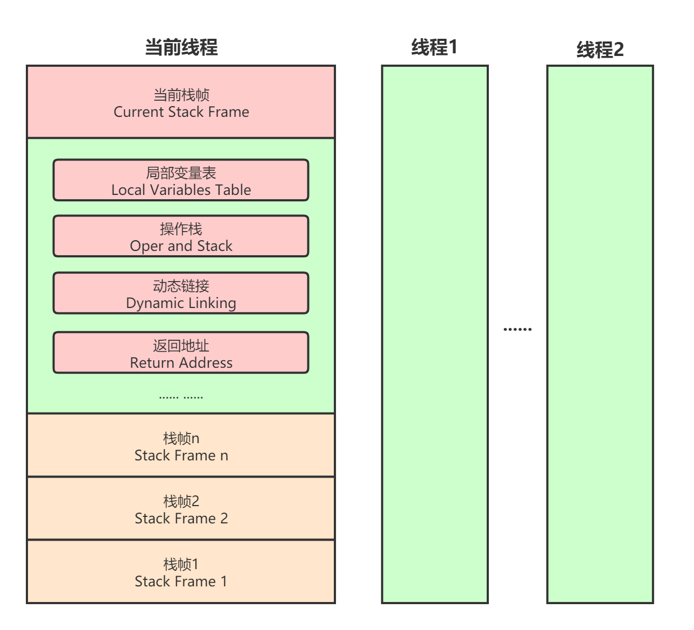

# 虚拟机字节码执行引擎


## 运行时栈帧结构





## 3、方法调用

### 解析

所有方法调用的目标方法在Class文件里面都是一个常量池中的符号引用，在类加载的**解析阶段**，会将其中的一部分符号引用转化为直接引用，这种解析能够成立的前提是：**方法在程序真正运行之前就有一个可确定的调用版本，并且这个方法的调用版本在运行期是不可改变的**。换句话说，调用目标在程序代码写好、编译器进行编译的那一刻就已经确定下来。这类方法的调用被称为**解析（Resolution）**。

符合“编译期可知，运行期不可变”特征的方法称为**非虚方法**，反之，编译期不可知或运行期可变的方法称为**虚方法**。

非虚方法包含以下5种类型：

1. 静态方法 → 直接与类型关联。
2. 私有方法 → 在外部不可被访问。
3. 实例构造器 → 调用实例构造器只能调用自己的构造器，即使要调用父类构造器，也需要`super`关键字明确指定。
4. 父类方法 → 
5. 被`final`修饰的方法 → 不可被覆盖重写。

调用不同类型的方法，需要不同的指令，在Java虚拟机中支持以下5条方法调用字节码指令：

- `invokestatic`：用于调用静态方法。
- `invokespecial`：用于调用实例构造器`<init>()`方法，私有方法和父类中的方法。
- `invokevirtual`：用于调用所有的虚方法。
- `invokeinterface`：用于调用接口方法，会在运行时再确定一个实现该接口的对象。
- `invokedynamic`：先在运行时动态解析出调用点限定符所引用的方法，然后再执行该方法。

因此只要能被`invokestatic`和`invokespecial`指令调用的方法，都可以在解析阶段确定唯一的调用版本。

其中有一点特殊的地方需要说明的是被`final`修饰的实例方法，虽然由于历史设计的原因，final方法是使用`invokevirtual`指令来调用，但是因为它也无法被覆盖，没有其他版本的可能，所以也无须对方法接收者进行多态选择，又或者说多态选择的结果肯定是唯一的。在《java语言规范》中明确定义了被final修饰的方法是一种非虚方法。

解析调用一定是个静态的过程，在编译期间就完全确定，在类加载的解析阶段就会把涉及的符号引用全部转变为明确的直接引用，不必延迟到运行期再去完成。


### 分派

分派也是方法的一种调用方式，囧同于解析，相对而言，它要复杂的多，它可能是静态的也可能是动态的，按照分派依据宗量数可分为但分派和多分派。这两类分派方式两两组合就构成了静态单分派、静态多分派、动态单分派、动态多分派4种分派组合情况。

#### 静态分派

为了解释静态分派和重载（Overload），准备了一段测试代码：

```java
public class StaticDispatch {

    static abstract class Human {
    }

    static class Man extends Human {
    }

    static class Woman extends Human {
    }

    public void sayHello(Human guy) {
        System.out.println("hello,guy");
    }

    public void sayHello(Man guy) {
        System.out.println("hello,gentleman");
    }

    public void sayHello(Woman guy) {
        System.out.println("hello,lady");
    }

    public static void main(String[] args) {
        Human man = new Man();
        Human woman = new Woman();
        StaticDispatch sd = new StaticDispatch();
        sd.sayHello(man);
        sd.sayHello(woman);
    }
}
```

输出结果：

```
hello,guy
hello,guy
```

从输出的结果可以产生一个疑问，为什么虚拟机会选择执行参数类型为Hnman的重载版本呢？，在解决这个问题之前先通过如下代码来定义两个关键概念：

```java
Human man = new Man();
```

我们把上面代码中的“Human”称为变量的“静态类型”（Static Type），或者叫“外观类型”（Apparent Type），后面的“Man”则被称为变量的“实际类型”（Actual Type）或者叫“运行时类型”（Runtion Type）。静态类型和实际类型在程序中都可能会发生变化，区别是静态类型的变化仅仅在使用时发生，变量本身的静态类型不会被改变，并且最终的静态类型是在编译器可知的；而实际类型的变化的结果在运行期才可以确定，编译器在编译程序的时候并不知道一个对象的实际类型是什么。例如下面的例子：

```java
//实际类型变化
Human hnman = (new Random()).nextBoolean()?new Man():new Woman();
//静态类型变化
sr.sayHello((Man)human);
sr.sayHello((Woman)human);
```

对象human的实际类型是可变的，编译期间它完全是个“薛定谔的人”，到底是Man还是Woman，必须等到程序运行到这行的时候才能确定。而human的静态类型是Human，也可以在使用时（如`sayHello()`方法中的强制转型）临时改变这个类型，但这个改变仍是在编译期是可知的，两次`sayHello()`方法的调用，在编译器完全可以明确转型的是Man还是Woman。

解释清楚了静态类型和实际类型，再次回到刚才的示例代码。`main()`里面的两次`sayHello()`方法调用，在方法接收者已经确定是对象“sd”的前提下，使用哪个重载版本，就完全取决于传入参数的数量和数据类型。代码中故意定义了两个静态类型相同，而实际类型不同的变量，但虚拟机在重载时时通过参数的静态类型而不是实际类型作为判断依据的。由于静态类型在编译器可知，所以在编译阶段，Javac编译器就根据参数的静态类型决定了会使用哪个重载版本。因此选择了`sarHello(Human)`作为调用目标，并把这个方法的符号引用写到`main()`方法里的两条`invokevirtual`指令的参数中。

所有依赖静态类型来决定方法执行版本的分派动作，都称为静态分派。静态分派的最典型应用表现就是方法重载。


#### 动态分派

动态分派与Java语言多态性——重写（Override）有着很密切的关联。为了说明什么是动态分派，准备了一段代码清单：

```java
public class DynamicDispatch {

    static abstract class Human {
        protected abstract void sayHello();
    }

    static class Man extends Human {
        @Override
        protected void sayHello() {
            System.out.println("man hello say");
        }
    }

    static class Woman extends Human {
        @Override
        protected void sayHello() {
            System.out.println("woman hello say");
        }
    }

    public static void main(String[] args) {
        Human man = new Man();
        Human woman = new Woman();
        man.sayHello();
        woman.sayHello();
        man = new Woman();
        man.sayHello();
    }
}
```

运行结果：

```
man hello say
woman hello say
woman hello say
```

运行结果完全符合预期，现在我们的问题是Java虚拟机是如何判断该调用哪个方法的？

显然这里选择调用方法的版本不可能再根据静态类型类决定，因为静态类型都是Human的变量man和woman调用sayHello()方法的结果不同，原因很明显，因为变量man和woman的实际类型不同。那么Java虚拟机是如何根据实际类型来分派方法的执行版本呢？我们使用javap输出字节码，尝试从中寻找答案：

```java
  public static void main(java.lang.String[]);
    descriptor: ([Ljava/lang/String;)V
    flags: (0x0009) ACC_PUBLIC, ACC_STATIC
    Code:
      stack=2, locals=3, args_size=1
         0: new           #2                  // class com/jusda/StaticDispatch$Man
         3: dup
         4: invokespecial #3                  // Method com/jusda/StaticDispatch$Man."<init>":()V
         7: astore_1
         8: new           #4                  // class com/jusda/StaticDispatch$Woman
        11: dup
        12: invokespecial #5                  // Method com/jusda/StaticDispatch$Woman."<init>":()V
        15: astore_2
        16: aload_1
        17: invokevirtual #6                  // Method com/jusda/StaticDispatch$Human.sayHello:()V
        20: aload_2
        21: invokevirtual #6                  // Method com/jusda/StaticDispatch$Human.sayHello:()V
        24: new           #4                  // class com/jusda/StaticDispatch$Woman
        27: dup
        28: invokespecial #5                  // Method com/jusda/StaticDispatch$Woman."<init>":()V
        31: astore_1
        32: aload_1
        33: invokevirtual #6                  // Method com/jusda/StaticDispatch$Human.sayHello:()V
        36: return
```

最关键的字节码指令位于第17行和21行，它们分别是调用`man.sayHello()`和`woman.sayHello()`指令，单从指令上来看，它们所使用的无论指令还是参数（符号引用）都完全一样，但这两句指令最终执行的目标方法却并不相同。那么看来解决问题的关键还必须从`invokespecial`指令入手，弄清楚它是如何确定调用方法版本、如何实现多态查询来着手分析才行。

《Java虚拟机规范》对`invokespecial`指令的运行时解析过程有如下定义：

`invokevirtual`指令的运行时解析过程：

1. 找到操作数栈顶的第一个元素所指向的对象的实际类型，记作C。
2. 如果在类型C中找到与常量中的描述符和简单名称都相符的方法，则进行访问权限校验，如果通过则返回这个方法的直接引用，查找过程结束；不通过则返回`java.lang.IllegalAccessError`异常。
3. 否则，按照继承关系从下往上依次对C的各个父类进行第二步的搜索和验证过程。
4. 如果始终没有找到合适的方法，则抛出`java.lang.AbstractMethodError`异常。


#### 单分派与多分派

方法的接收者与方法的参数统称为方法的宗量


