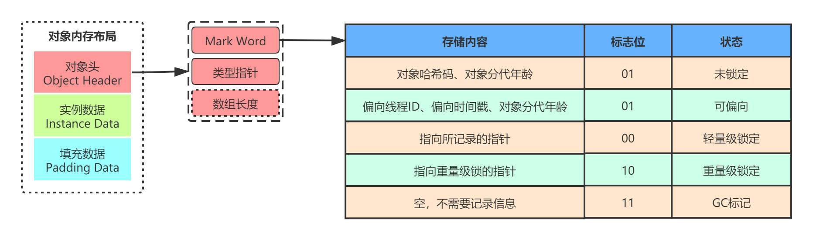
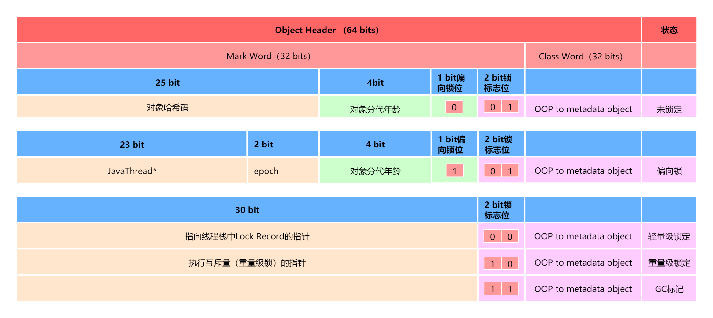
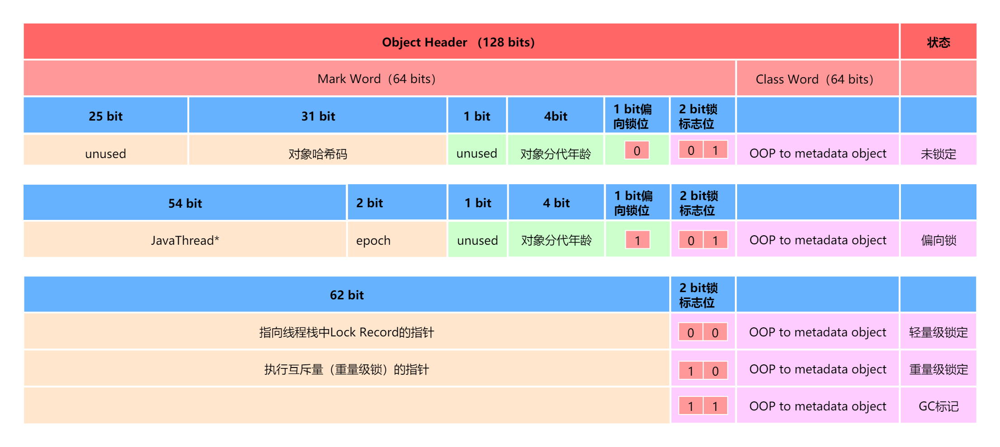
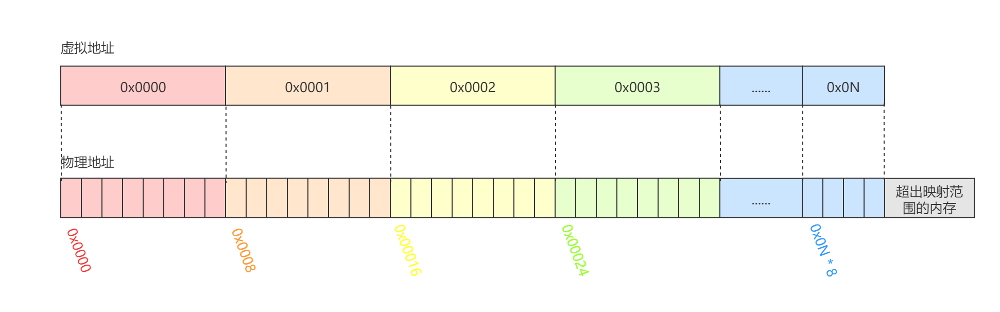
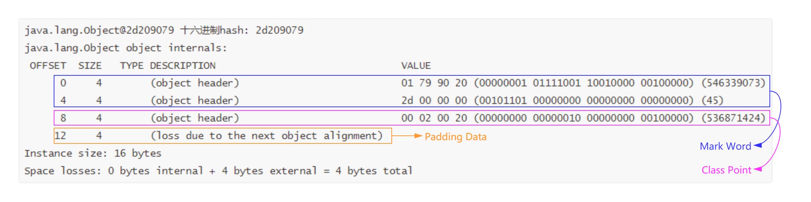
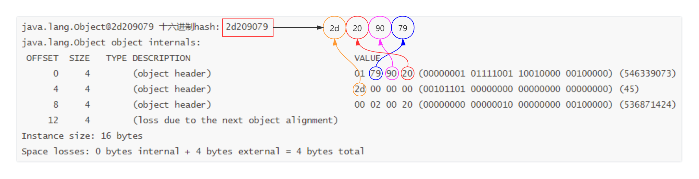
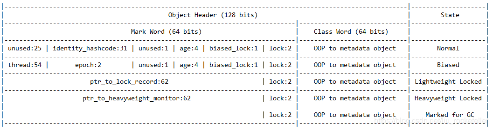

# 对象的内存布局

## 概述

在HotSpot虚拟机里，对象在堆内存中的存储布局可以划分为三个部分：**对象头（Header）**、**实例数据（Instance Data）**和**对齐填充（Padding）**。而对象头又分为两部分，分别是*Mark Word*和*类型指针*。如果对象是一个Java数组，那在对象头中还必须有一块用于记录*数组长度*的数据。因为虚拟机可以通过普通Java对象的元数据信息确定Java对象的大小。Mark Word是用于存储对象自身的运行时数据，如哈希码，GC分代年龄、锁状态标志、线程持有的锁、偏向线程ID、偏向时间戳等，这部分区域官方称之为Mark Word。类型指针，即对象指向它的类型元数据的指针，Java虚拟机通过这个指针来确定该对象是哪个类的实例。

对象的内存布局如下图所示：



## 对象头

对象头包含了两部分，Mark Word和类型指针。如果对象类型是数组，还包含数组的长度。

### Mark Word

Mark Word主要是用于记录对象自身的运行时数据，这些数据与对象自身定义的数据无关。

Mark Word存储的数据并不固定不变的，随着同步锁锁定状态的变化，Mark Word存储的内容也不同。

| 存储内容                             | 标志位 | 状态               |
| ------------------------------------ | ------ | ------------------ |
| 对象哈希码、对象分代年龄             | 01     | 未锁定             |
| 偏向线程ID、偏向时间戳、对象分代年龄 | 01     | 可偏向             |
| 指向所记录的指针                     | 00     | 轻量级锁定         |
| 指向重量级锁的指针                   | 10     | 膨胀（重量级锁定） |
| 空，不需要记录信息                   | 11     | GC标记             |


Mark Word有固定的长度大小，在32位和64位虚拟机中分别为32比特和64比特，自然其所存储的信息大小也不一样。

**32位虚拟机Mark Word结构：**

在Normal状态下，25个比特用于存储对象哈希码，4个比特用于存储对象分代年龄，2个比特用于存储锁标志位，1个比特固定为0。在其他状态下又有所不同。具体如下图所示：



**64位虚拟机Mark Word结构：**

在Normal状态下，25个比特未被使用，31个比特用于存储对象哈希码，4个比特用于存储对象分代年龄，2个比特用于存储锁标志位，1个比特固定为0。在其他状态下又有所不同。具体如下图所示：



> - Normal状态
>
>   Normal状态即未锁定状态。
>
> - 分代年龄
>
>   分代年龄占4个比特位，转换成十进制最大为15，即对象的最大年龄未15，与HotSpot虚拟机设置对应。
>
> - 偏向锁位
>
>   偏向锁位占1个比特位，即只有两种状态，0表示不可偏向，1表示可偏向。不可偏向时，进入同步代码块时将会直接进入轻量级锁。至于是否已被偏向是由Mark Word中存储的是`HashCode`还是`JavaThread*`决定的。如果是`HashCode`，表示未被偏向；如果是`JavaThread*`表示已被偏向。
>
> - 锁标志位
>
>   偏向锁位占2个比特位，即最多只有三种状态：01表示未锁定，00表示轻量级锁定，10表示重量级锁定，11是GC标记；注意，可偏向也用01表示，只不过与未锁定状态是用偏向锁位区分。
>

**HotSpot相关源码信息**

HotSpot虚拟机markWord.hpp中的C++代码的注释片段，描述了32位和64位虚拟机下Mark Word的存储结构。

注释如下：

```java
//  32 bits:
//  --------
//             hash:25 ------------>| age:4    biased_lock:1 lock:2 (normal object)
//             JavaThread*:23 epoch:2 age:4    biased_lock:1 lock:2 (biased object)
//
//  64 bits:
//  --------
//  unused:25 hash:31 -->| unused_gap:1   age:4    biased_lock:1 lock:2 (normal object)
//  JavaThread*:54 epoch:2 unused_gap:1   age:4    biased_lock:1 lock:2 (biased object)
```

源码地址：https://github.com/openjdk/jdk/blob/master/src/hotspot/share/oops/markWord.hpp

### 类型指针

类型指针是指向对象实现的Class的指针，Java 7之前指向的区域位于永久代（Permanent Generation）对应的Class对象的地址，Java 8之后，永久代废弃，引入了元数据区（Metaspace）的概念，因此Java 8之后指向的区域是元数据区对应的Class对象的地址。

Java虚拟机通过这个指针来确定该对象是哪个类的实例。

### 指针压缩

类型指针可被压缩，压缩之后的字节长度是4字节，未被压缩的类型指针长度是8字节。

指针压缩默认是开启的，可通过参数`-XX:-UseCompressedOops`关闭。

在32位的机器上，由于CPU GPRs（General-Purpose Registers，通用寄存器）的数据宽度为32位，32位指令集就是运行32位数据的指令，也就是说处理器一次可以运行32bit数据。

寻址空间

寻址空间一般指的是CPU对于[内存寻址](https://baike.baidu.com/item/内存寻址/1012006)的能力。通俗地说，就是能最多用到多少内存的一个问题。数据在[存储器](https://baike.baidu.com/item/存储器/1583185)(RAM)中存放是有规律的 ，CPU在运算的时候需要把数据提取出来就需要知道数据存放在哪里 ，这时候就需要挨家挨户的找，这就叫做寻址，但如果地址太多超出了CPU的能力范围，CPU就无法找到数据了。 CPU最大能查找多大范围的地址叫做寻址能力 。

每一个地址都有一个编号，32个比特可以表达2的32次幂种状态，也就是2的32次幂个地址，如果每个比特为都有一个地址，那么最大可以寻址范围是2的32次幂/8/1024/1024=512MB内存的空间，但是CPU的寻址能力以[字节](https://baike.baidu.com/item/字节/1096318)为单位，也就是说8个比特位才对应一个地址，因此最大可以寻址的范围是512MB*8=4GB的内存空间，刚好等于2的32次幂/1024/1024/1024。同样的道理，在64位机器上，最大可以寻址的范围是2的64次幂/1024/1024/1024=


在32位机器上，OOP以4字节（32bit）表示，只能引用4G的内存空间，如果需要更大的内存空间，就需要将其升级为64位，而在64位机器上，OOP以8字节（64bit）表示。也就是说，在64位机器上，OOP将会占用相对于在32位机器上OOP两倍大小的内存。由于OOP变大，从而带来了性能问题：

- 增加了GC开销
- 降低CPU缓存命中率

那有什么办法既可以保留32位指针的性能，又可以使用64位的内存呢？解决的办法就是压缩指针。

Java通过虚拟内存映射技术实现，简而言之，虚拟内存映射技术就是建立一个逻辑上的虚拟内存空间，这个虚拟内存空间有它自己的寻址地址，将这个虚拟内存空间的地址与真实的物理内存空间地址建立一个映射关系，在平时存储的是虚拟内存空间地址，使用的时候，就将这个地址转换为真实的物理内存空间地址。

与物理内存空间地址的寻址方式一样，CPU的寻址能力以字节（8比特）为单位，而Java是以8字节为单位，即每8个字节的真实物理内存空间对应一个虚拟内存空间的地址。而8个字节*8比特，刚好是64比特，对应一个在64位机器上的一个OOP。因此，所谓的压缩指针就是将64位的真实物理地址转换为32位的虚拟内存地址进行存储。

物理地址与虚拟地址的映射必然是一定规律的，不可能是无规律的维护一个映射表，如下图所示：



可以看到，虚拟地址与物理地址的映射对象关系为

```
 虚拟地址 —  物理地址
 0x0000  —  0x0000
 0x0001  —  0x0008
 0x0002  —  0x00016
 0x0003  —  0x00024
            ......
 0x0N  —  0x0N * 8
```

物理地址刚好是虚拟地址的8倍，因此在使用的时候，虚拟地址向左位移3位即转换为物理地址，反之物理地址向右位移3位转换为虚拟地址。

主要注意的是，32位的虚拟地址，最多能寻址4GB内存，每一个地址映射了8KB的真实物理地址，因此，在32位虚拟地址这里最多能寻址32GB的物理内存。如果超出了32GB，压缩指针将会失效。


CPU的寻址能力以[字节](https://baike.baidu.com/item/字节/1096318)为单位 ，如32位寻址的CPU可以寻址2的32次方大小的地址也就是4G，这也是为什么32位的CPU最大能搭配4G内存的原因 ，再多的话CPU就找不到了。


> OOP
>
> 这里的OOP可不是面向对象程序设计，而是ordinary object pointer，即普通对象指针。
>
> 字节
>
> 1字节（1KB） = 8比特（bit）


```
com.object.ObjectStructure1$User object internals:
 OFFSET  SIZE   TYPE DESCRIPTION                               VALUE
      0     4        (object header)                           01 ca 7a 8c (00000001 11001010 01111010 10001100) (-1938109951)
      4     4        (object header)                           3d 00 00 00 (00111101 00000000 00000000 00000000) (61)
      8     4        (object header)                           38 02 e6 cf (00111000 00000010 11100110 11001111) (-807009736)
     12     4        (object header)                           76 7f 00 00 (01110110 01111111 00000000 00000000) (32630)
Instance size: 16 bytes
Space losses: 0 bytes internal + 0 bytes external = 0 bytes total

com.object.ObjectStructure1$User object internals:
 OFFSET  SIZE   TYPE DESCRIPTION                               VALUE
      0     4        (object header)                           01 15 ec eb (00000001 00010101 11101100 11101011) (-336849663)
      4     4        (object header)                           05 00 00 00 (00000101 00000000 00000000 00000000) (5)
      8     4        (object header)                           49 cd 00 20 (01001001 11001101 00000000 00100000) (536923465)
     12     4        (loss due to the next object alignment)
Instance size: 16 bytes
Space losses: 0 bytes internal + 4 bytes external = 4 bytes total
```

Oracle JDK从6 update 23开始在64位系统上会默认开启压缩指针。

32位HotSpot VM是不支持UseCompressedOops参数的，只有64位HotSpot VM才支持。

对于大小在4G和32G之间的堆，应该使用压缩的oop。


OOP：ordinary object pointer，或OOPS。即普通对象指针，用来描述对象实例信息。

​       对于OOPS对象来说，主要职责在于表示对象的实例数据，没有必要持有任何虚函数；而在Java类的Klass对象中含有VTBL，那么，Klass就能够根据Java对象的实际类型进行C++的分发，这样一来，OOPS对象只需要通过响应的Klass便可以找到所有的虚函数。


### 对象头验证

这里只针对`Normal`状态的对象头进行验证，关于其他锁状态的对象头信息将在*并发*章节说明。

首先需要借助一个工具用于输出对象头信息。

引入依赖

```xml
<dependency>
    <groupId>org.openjdk.jol</groupId>
    <artifactId>jol-cli</artifactId>
    <version>0.14</version>
</dependency>
```

测试代码

```java
public static void main(String[] args){
    Object obj = new Object();
    System.out.println(obj + " 十六进制hash: "+Integer.toHexString(obj.hashCode()));
    System.out.println(ClassLayout.parseInstance(obj).toPrintable());
}
```

运行结果



如上所示：

- Object对象大小为16个字节。

- 对象头占12个字节，其中Mark Word占8个字节（8*8=64位），Klass Point占4个字节。

- 最后4个字节，用于对齐填充。

**指针压缩**

需要注意的是这里的类型指针（Klass Point）之所以只占4个字节，是因为指针被压缩了，在下一节会说明指针压缩。

**大小端存储**

注意，上述属于的二进制信息需要倒过来看，这是因为大小端存储导致。

- Big-Endian：高位字节存放于内存的低地址端，低位字节存放于内存的高地址端。
- Little-Endian：低位字节存放于内存的低地址端，高位字节存放于内存的高地址端。

Mark Word实际二进制数据为：

```
00000000 00000000 00000000 00101101 00100000 10010000 01111001 00000001
```

**哈希值存储验证**

输出的哈希值为`2d209079`，刚好Mark Word中也有对应的数值。



## 实例数据

实例数据即我们在程序代码里面所定义的各种类型的字段内容，无论是从父类继承下来的，还是在子类中定义的字段都必须记录起来。

实例数据的存储顺序会受到虚拟机分配策略参数（`-XX:FieldsAllocationStyle`参数）和字段在Java源码中定义顺序的影响。HotSpot虚拟机默认的分配顺序为`longs/doubles`、`ints`、`shorts/chars`、`bytes/booleans`、`oops(Ordinary Object Pointers OOPs)`，以上默认的分配策略中可以看到，相同宽度的字段总是被分配代一起存放，在满足这个前提条件的情况下，在父类中定义的变量会出现在子类之前。如果HotSpot虚拟机的`-XX:CompactFields`参数的值为true（默认就为true），那子类之中较窄的变量也允许插入父类变量的空隙之中，以节省一点点空间。

## 对其填充

对其填充并不是必然存在的，也没有特别的含义，它仅仅起着占位符的作用。由于HotSpot虚拟机的自动内存管理系统要求对象起始地址必须是8字节的整数倍。换句话说就是任何对象的大小都必须是8字节的整数倍。对象头部分已被精心设计成正好8字节的倍数（1倍或2倍），因此，如果对象实例数据部分没有对齐的话，就需要通过对齐填充来不全。

至于为什么HotSpot虚拟机的自动内存管理系统要求对象起始地址必须是8字节的整数倍，可以参考指针压缩一节，其就是原因之一。


- hash contains the identity hash value: largest value is 31 bits, see os::random().  Also, 64-bit vm's require a hash value no bigger than 32 bits because they will not properly generate a mask larger than that: see library_call.cpp

- the biased lock pattern is used to bias a lock toward a given thread. When this pattern is set in the low three bits, the lock is either biased toward a given thread or "anonymously" biased, indicating that it is possible for it to be biased. When the lock is biased toward a given thread, locking and unlocking can be performed by that thread without using atomic operations. When a lock's bias is revoked, it reverts back to the normal locking scheme described below.

  1

  Note that we are overloading the meaning of the "unlocked" state of the header. Because we steal a bit from the age we can guarantee that the bias pattern will never be seen for a truly unlocked object.

  1

  Note also that the biased state contains the age bits normally contained in the object header. Large increases in scavenge times were seen when these bits were absent and an arbitrary age assigned to all biased objects, because they tended to consume a significant fraction of the eden semispaces and were not promoted promptly, causing an increase in the amount of copying performed. The runtime system aligns all JavaThread* pointers to a very large value (currently 128 bytes (32bVM) or 256 bytes (64bVM)) to make room for the age bits & the epoch bits (used in support of biased locking).


## 参考资料

Have you ever wondered how java object looks like inside JVM ?
First, remember that in jvm any object in memory consists of the object header and object variables (links and primitives).
The header of each object (except for the array) consists of two machine words - **mark word** and **class word** . Arrays have an additional 32 bits to describe the length of the array.
Mark word stores identity hashcode, bits used by the garbage collector and bits used for locks.
In Class word, a pointer is stored to the class itself, that is, to the place where the information about this data type lies: methods, annotations, inheritance, and more.

Let’s now take a closer look at the title of the object, and in particular the mark word.

#### What about 32 bit JVM?


As can be seen from the table, the content of Mark word can vary greatly depending on the current state of the object.

- identity_hashcode - identity hashcode of the object which is assigned lazily. If System.identityHashCode(obj) is called, it is calculated and written into the object header. When object is locked the identity hashcode value is moved into the monitor object.
- age - number of garbage collections the object has survived. It is incremented every time an object is copied within the young generation. When the age field reaches the value of max-tenuring-threshold, the object is promoted to the old generation.
- biased_lock - contains 1 if the biased locking is enabled for the class. 0 if the biased locking is disabled for the class. To find out more on biased locking check out my previous post.
- lock - the lock state of the object. 00 - Lightweight Locked, 01 - Unlocked or Biased, 10 - Heavyweight Locked, 11 - Marked for Garbage Collection.
- thread - when an object is biased towards specific thread instead of identity hash code mark word contains thread id.
- epoch - which acts as a timestamp that indicates the validity of the bias.
- ptr_to_lock_record - When lock acquisitions are uncontended JVM uses atomic operations instead of OS mutexes. This technique is known as Lightweight Locking. In case of lightweight locking JVM sets a pointer to the lock record in the object’s header word via a CAS operation.
- ptr_to_heavyweight_monitor - If two different threads concurrently synchronize on the same object, the lightweight lock must be inflated to a Heavyweight Monitor for the management of waiting threads. In case of heavyweight locking JVM sets a pointer to the monitor in the object’s header word.

#### What about 64 bit JVM?



#### What about 64 bit JVM with pointer compression?


Let’s talk a bit about Ordinary Object Pointers (OOPs) and Compressed OOPs (Coops). OOPs are the handles/pointers the JVM uses as object references. When oops are only 32 bits long, they can reference only 4 GB of memory, which is why a 32-bit JVM is limited to a 4 GB heap size. (The same restriction applies at the operating system level, which is why any 32-bit process is limited to 4GB of address space.) When oops are 64 bits long, they can reference terabytes of memory.
What if there were 35-bit oops? Then the pointer could reference 32 GB of memory and still take up less space in the heap than 64-bit references. The problem is that there aren’t 35-bit registers in which to store such references. Instead, though, the JVM can assume that the last 3 bits of the reference are all 0. Now every reference can be stored in 32 bits in the heap. When the reference is stored into a 64-bit register, the JVM can shift it left by 3 bits (adding three zeros at the end). When the reference is saved from a register, the JVM can right-shift it by 3 bits, discarding the zeros at the end.
This allows JVM to use pointers that can reference 32 GB of memory while using only 32 bits in the heap. However it also means that the JVM cannot access any object at an address that isn’t divisible by 8, since any address from a compressed oop ends with three zeros. The first possible oop is 0x1, which when shifted becomes 0x8. The next oop is 0x2, which when shifted becomes 0x10 (16). Objects must therefore be located on an 8-byte boundary. As we know objects are already aligned on an 8-byte boundary in the JVM (in both the 32- and 64-bit versions); this is the optimal alignment for most processors. So nothing is lost by using compressed oops.
A program that uses a 31 GB heap and compressed oops will usually be faster than a program that uses a 33 GB heap. Although the 33 GB heap is larger, the extra space used by the pointers in that heap means that the larger heap will perform more frequent GC cycles and have worse performance.
Compressed oops are enabled using the `-XX:+UseCompressedOops` flag; in Java 7 and later versions, they are enabled by default whenever the maximum heap size is less than 32 GB.