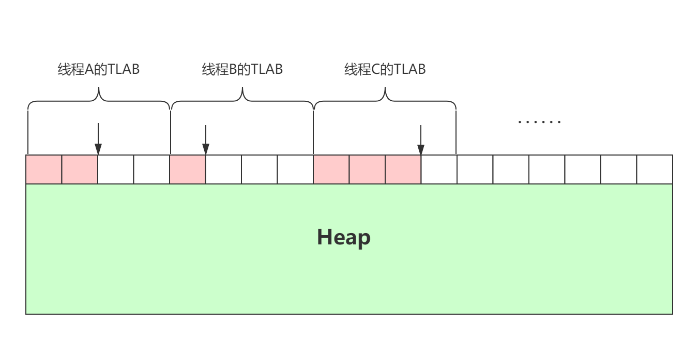
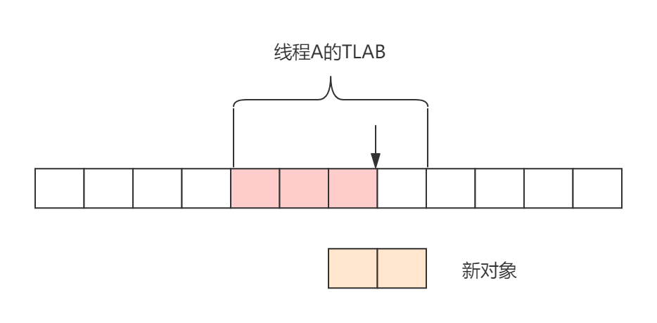

## 对象的创建

在Java中对象的创建有多种方式，例如：new关键字、复制（克隆）、反序列化等等。这里仅仅讨论new关键字进行对象的创建。

当通过new关键字创建一个对象时，例如如下代码：

```java
Object obj = new Object();
```

通过`javap -v`命令会生成一条字节码new指令。当Java虚拟机遇到一条字节码new指令时，首先将会去检查这个指令的参数是否能在常量池中定位到一个类的符号引用，并且检查这个符号引用代表的类是否已被加载、解析和初始化。如果没有，那必须先执行相应的类加载过程。

如果类已经被加载或者加载检查通过，虚拟机将为新生对象分配内存。对象所需的内存的大小在类加载完成后便可完全确定，为对象分配空间的任务实际上便等同于把一块确定大小的内存块从Java堆栈划分出来。

在堆中为对象分配内存有两种方式：

1. 指针碰撞

   Java堆内存绝对规整，所有已经被使用的内存放在一边，未被使用的放在另一边，中间使用一个指针作为分界点指示器，分配内存时，只需要将指针向未被使用区域移动一段与对象大小相等的内存空间即可。

2. 空闲列表

   Java堆内存不是规则，即已被使用的内存和未被使用的内存交错在一起，为此，虚拟机维护了一个列表，用于记录那些内存未被使用，分配内存时，只需要从列表中找出一块足够大小的内存用于分配，并更新列表记录即可。

虚拟机选用哪种分配方式是由堆内存是否规整所决定，而堆内存是否规整又由所采用的垃圾收集是否具有空间压缩整理的功能。因此，当使用Serial、ParNew等带有压缩整理过程的收集器时，系统采用的分配算法是指针碰撞；而当使用CMS这种基于清除算法的收集器时，就只能采用空闲列表来分配内存。

*指针碰撞*


### TLAB

采用指针碰撞的方式分配内存即简单又高效，但是还有另一个需要考虑的问题：对象创建在虚拟机中是非常频繁的行为，即使仅仅修改一个指针所指向的位置，在并发的情况下也不是线程安全的，可能出现正在给对象A分配内存，指针还没有来得及修改，对象B又同时使用了原来的指针来分配内存的情况。

解决这个问题的方式有两种：

1. 对分配内存空间的动作进行同步处理。

   虚拟机采用CAS配上失败重试的方式保证更新操作的原子性。

2. 把内存分配的动作按照线程划分在不同的空间之中进行。

   即每个线程在Java堆中预先分配一小块内存，称为本地线程分配缓冲（Thread Local Allocation Buffer）简称TLAB，那个线程要分配内存，就在哪个线程的本地缓冲中分配，从而避免了指针的争抢。
   
   *Thread Local Allocation Buffer：*
   
   

实际上Java虚拟机同时采用了CAS和TLAB，在将对象分配到TLAB中时，因为TLAB是线程独享，所以不存在并发问题，但TLAB并不是无限大，TLAB只是一块儿有限的，很小的内存空间，因此有两种情况不能分配在TLAB中，第一种是对象太大，TLAB不能容纳，第二种情况下TLAB的剩余空间不足以当前分配的对象，例如一个100KB的TLAB，已经使用了80KB，当需要分配一个30KB的对象时，肯定就无能为力了。因此需要直接分配在堆中，这时候就需要使用CAS保证指针位移的原子性。




因此虚拟机有两种处理方式：

- 第一，废弃当前TLAB，重新申请一个新的TLAB，这样就就浪费20KB的空间；

- 第二，直接将对象分配在堆上，保留当前TLAB，以等待后续有一个小于20KB的对象进行分配。

深入思考一下就会发现，这样做虽然逻辑上是合理的，但有一个严重的问题：如果TLAB只剩下1KB的内存空间，而后续所有创建的对象都大于1KB，那岂不是TLAB之后就成了一个没有效果的操作（不考虑GC的情况）。实际上虚拟机内部维护了一个叫`refill_waste`的值，当请求对象大于`refill_waste`时候，会选择直接在堆中分配，若小于`refill_waste`，会选择废弃当前TLAB，申请一个新的TLAB用来分配。可以通到参数`-XX:TLABRefillWasteFraction`来设置`refill_waste`的阈值，默认为64，表示使用TLAB的1/64的空间大小作为`refill_waste`。

Note：

- TLAB只是堆中的一块内存，而不是像CPU 3级缓存这样的独立内存，虽然它叫缓冲区，但只是将堆中一小块儿内存分配于线程让其独享而已，而内存本身仍然是堆内存的一部分，只是其他线程不能再这块儿内存上分配对象而已，但仍可以读取对象。因此，当对象分配到TLAB中时，实质上就已经分配到堆中了。
- TLAB的大小并不是固定的，虚拟机会根据线程的运行情况自适应调整TLAB的大小，以使系统运行达到最优。可以使用参数`-XX:+/-ResizeTLAB`启用/禁用自适应调整TLAB大小，并使用`-XX:TLABSize`手工指定TLAB的大小。

### TLAB相关参数

- `-XX:+/-UseTLAB`：启用/禁用TLAB。
- `-XX:TLABSize`：设置TLAB大小，单位byte，默认为0（因为默认情况下TLAB是自适应的）。
- `-XX:MinTLABSize`：设置TLAB的最小值，默认为2048byte，即TLAB最小为2K。
- `-XX:TLABStats`：
- `-XX:+/-ResizeTLAB`：启用/禁用自适应TLAB（TLAB的大小和refill-waste的阈值会随着虚拟机的运行而变化）。
- `-XX:TLABRefillWasteFraction`：设置TLAB的refill-waste阈值，refill-waste表示线程在TLAB达到多少时需要开辟新的TLAB。设置10，则refill-waste为TLAB大小的1/10，设置100，则refill-waste为TLAB大小的1/100。默认为64，即TLAB的可用空间只剩1/64时，申请新的TLAB用于分配。
- `-XX:TLABWasteTargetPercent`：设置TLAB空间所占用Eden空间的百分比，默认为1，即TLAB空间最多占用Eden空间的1%大小。
- `-XX:TLABAllocationWeight`：
- `-XX:TLABWasteIncrement`：表示动态的增加浪费空间的字节数，默认值是4。增加的方式：比如第一次是1%，那么下一次就是1%+4%。
- `-XX:+/-ZeroTLAB`：设置是否需要对象在TLAB分配时，内存空间初始化为零值。默认值为false，表示需要。
- `-Xlog:gc+tlab=trace`：JDK 9及之后打印TLAB日志的参数。
- `-XX:+PrintTLAB`：JDK 9之前打印TLAB日志的参数。

可以通过执行如下命令查看TLAB相关命令参数：

```shell
$ java  -XX:+PrintFlagsFinal --version | grep TLAB
   size_t MinTLABSize                              = 2048                                      {product} {default}
     bool ResizeTLAB                               = true                                   {pd product} {default}
    uintx TLABAllocationWeight                     = 35                                        {product} {default}
    uintx TLABRefillWasteFraction                  = 64                                        {product} {default}
   size_t TLABSize                                 = 0                                         {product} {default}
     bool TLABStats                                = true                                      {product} {default}
    uintx TLABWasteIncrement                       = 4                                         {product} {default}
    uintx TLABWasteTargetPercent                   = 1                                         {product} {default}
     bool UseTLAB                                  = true                                   {pd product} {default}
     bool ZeroTLAB                                 = false                                     {product} {default}
$ java -XX:+UnlockExperimentalVMOptions -XX:+PrintFlagsFinal --version | grep TLAB
     bool EpsilonElasticTLAB                       = true                                 {experimental} {default}
     bool EpsilonElasticTLABDecay                  = true                                 {experimental} {default}
   size_t EpsilonMaxTLABSize                       = 4194304                              {experimental} {default}
   size_t EpsilonTLABDecayTime                     = 1000                                 {experimental} {default}
   double EpsilonTLABElasticity                    = 1.100000                             {experimental} {default}
   size_t MinTLABSize                              = 2048                                      {product} {default}
     bool ResizeTLAB                               = true                                   {pd product} {default}
    uintx TLABAllocationWeight                     = 35                                        {product} {default}
    uintx TLABRefillWasteFraction                  = 64                                        {product} {default}
   size_t TLABSize                                 = 0                                         {product} {default}
     bool TLABStats                                = true                                      {product} {default}
    uintx TLABWasteIncrement                       = 4                                         {product} {default}
    uintx TLABWasteTargetPercent                   = 1                                         {product} {default}
     bool UseTLAB                                  = true                                   {pd product} {default}
     bool ZeroTLAB                                 = false                                     {product} {default}
```

### TLAB日志

JDK 9+版本的JDK使用日志参数：`-Xlog:gc+tlab=trace`，JDK 9-版本的JDK使用日志参数：`-XX:+PrintTLAB`。

```
[0.039s][trace][gc,tlab] ThreadLocalAllocBuffer::compute_size(2) returns 88147
[0.039s][trace][gc,tlab] TLAB: fill thread: 0x00007fe4e401a800 [id: 7002] desired_size: 688KB slow allocs: 0  refill waste: 11016B alloc: 0.99999      689KB refills: 1 waste  0.0% gc: 0B slow: 0B fast: 0B
[0.135s][trace][gc,tlab] ThreadLocalAllocBuffer::compute_size(24) returns 88169
[0.135s][trace][gc,tlab] TLAB: fill thread: 0x00007fe4e40fc800 [id: 7012] desired_size: 688KB slow allocs: 0  refill waste: 11016B alloc: 0.99999     1377KB refills: 1 waste  0.0% gc: 0B slow: 0B fast: 0B
[0.284s][trace][gc,tlab] ThreadLocalAllocBuffer::compute_size(3) returns 88148
[0.284s][trace][gc,tlab] TLAB: fill thread: 0x00007fe4e4111000 [id: 7016] desired_size: 688KB slow allocs: 0  refill waste: 11016B alloc: 0.99999     2066KB refills: 1 waste  0.0% gc: 0B slow: 0B fast: 0B
```


- HotSpot解释器的代码片段  https://blog.csdn.net/zhxdick/article/details/111331532

```c++
// 确保常量池中存放的是已解释的类
if (!constants->tag_at(index).is_unresolved_klass()) {
    // 断言确保是klassOop和instanceKlassOop
    oop entry = (klassOop) *constants->obj_at_addr(index);
    assert(entry->is_klass(), "Should be resolved klass" );
    klassOop k_entry = (klassOop) entry;
    assert(k_entry->klass_part()->oop_is_instance(), "Should be instanceKlass");
    instanceKlass* ik = (instanceKlass*) k_entry->klass_part();
    // 确保对象所属类型已经经过初始化阶段
    if (ik->is_initialized() && ik->can_be_fastpath_allocated()) {
        // 取对象长度
        size_t obj_size = ik->size_helper();
        oop result = NULL;
        // 记录是否需要将对象所有字段置零值
        bool need_zero = !ZeroTLAB;
        // 是否在TLAB中分配对象
        if (UserTABL) {
            reuslt = (oop) THREAD->tlab().allocate(obj_size);
        }
        if (result == NULL) {
            need_zero = true;
            // 直接在eden中分配对象
    retry:
            HeapWord* compare_to = * Universe::heap()->top_addr();
            HeapWord* new_top = compare_to + obj_size;
            /* cmpxchg是x86中的CAS指令，这里是一个c++方法，通过CAS方式分配空间，如果并发失败，转到retry中重试，直至成功分配为止 */
            if (new_top <= *Universe::heap()->end_addr()) {
                if (Atomic::cmpxchg_ptr(new_top, Universe::heap()->top_addr(), compare_to) != compare_to) {
                    goto retry;    
                }
                return = (oop) compare_to;
            }
        }
        if (result != NULL) {
            // 如果需要，则为对象初始化零值
            if (need_zero) {
                HeapWord* to_zero = (HeapWord*) result + sizeof(oopDesc) / oopSize;
                obj_size -= sizeof(oopDesc)/ oopSize;
                if (obj_size > 0) {
                    memset(to_zero, 0, obj_size * HeapWordSize);
                } 
            }
            // 根据是否启用偏向锁来设置对象头信息
            if (UseBiasedLocking) {
                reuslt->set_mark(ik->prototype_header());
            } else {
                reuslt->set_mark(markOopDesc::prototype());
            }
            result->set_klass_gap(0);
            result->set_klass(k_entry);
            // 将对象引用入栈，继续执行下一条指令
            SET_STACK_OBJECT(result, 0);
        }
    }
}
```


### 初始化零值

内存分配完成之后，虚拟机必须将分配到的内存空间都初始化为零值（不包括对象头），如果使用了TLAB，这项工作将会提前至TLAB分配时顺便进行。这步操作保证了对象的实例字段在Java代码中可以不赋初始值就直接使用，使程序能访问到这些字段的数据类型所对应的零值。

### 设置对象头

当零值初始化完成之后，接下来就要设置对象头的信息，例如对象的class指针，对象哈希码，GC分代年龄以及根据虚拟机当前运行状态所设置的是否启用偏向锁等信息。

> 对象哈希码实际上是在正在调用Object::hashCode()方法的时候才会计算并设值。

### 执行`<init>()`方法

当完成了对象内存的分配，零值的初始化，对象的设置之后，从虚拟机的角度来说，一个新的对象已经创建完成了。但从Java程序的角度而言，对象的创建才刚刚开始——有三点：

- 构造函数，即Class文件中的`<init>()`方法还没有执行；
- 所有的字段都还是默认零值；
- 对象需要的其他资源和状态信息也还没有按照预定的意图构造好。

> 通过`javap -v`编译代码`Object obj = new Object();`，new指令后面一般会紧接`invokespecial`指令，就是用于调用对象的`<init>()`方法。
>
> Java编译器会在遇到`new`关键字的地方同时生成`new`和`invokespecial`这两条字节码指令。

### 栈上分配

一个新的对象并不一定是分配代堆中，也有可能是分配在栈上。如果对象一定要分配在堆中，在垃圾回收器回收此对象的时候，需要耗费大量的资源。如果确定一个对象不会逃逸出线程之外，那让这个对象在栈上分配就是一个很好的方式，对象所占用的内存空间就可以随栈帧出栈而销毁，从而避免了分配在堆中垃圾回收时的资源消耗。因此在虚拟机开启栈上分配的情况下，对象的分配首先确认是否可以在栈上分配，然后才会轮到TLAB以及堆内存。

### 对象创建流程


> 


