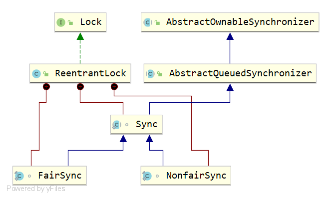

# AQS


考虑一下要如何实现一个锁，首先我们需要一个状态变量，用来作为锁；锁是互斥的，因此没有拿到锁的线程不可能一直去尝试获取锁，这是需要消耗CPU资源的，因此这些没有拿到锁的线程需要挂起，而我们需要一个可以支持线程挂起和唤醒的操作；这些没有拿到锁的线程肯定需要被存储起来，因此我们还需要一个可以存储挂起线程的容器。对一个线程来说，同一把锁是可以重复获取的，这样称为线程的可重入性，因此还需要一个变量来存在当前获取到锁的线程。

总的来说，实现一个锁，需要满足一下四点核心要素：

- 一个用于作为锁的状态变量state，
- 一个用于存储当前获取到锁的线程的变量。
- 用于存储挂起线程的容器。
- 支持线程挂起和唤醒的底层操作。


当有了四点核心要素之后，现在来考虑一下具体的实现。

假设线程有两个线程A和B：

1. A先来去拿锁，此时没有任何线程持有锁，因此A获取锁成功，然后执行业务代码；
2. 紧接着线程B来了，一样取拿锁，此时锁被线程A持有，获取锁自然失败。
3. 线程B获取锁失败，不可能不停轮询等待线程A结束，因此将线程B存入到容器中。
4. 挂起线程B。
5. 线程A执行完毕，释放锁，
6. 执行锁之后唤醒线程B。
7. 线程B再次尝试去拿锁，此时没有任何线程持有锁，因此B获取锁成功，然后执行业务代码；
8. 紧接着线程C来了，......

如下图所示：


是不是非常简单，其实这就是AQS的核心实现原理，当然AQS的实现不可能如此简单，其中肯定还涉及到一些细节，但核心流程就是这样的。

现在再来看一下每一个节点可能出现的问题，然后解决它。

1. 获取锁的时候肯定不会一个线程接一个线程的来，它们是并发争抢的，因此状态变量state的操作需要保证其原子性，并且要保证线程安全，这自然就需要用到CAS。

2. 线程B获取锁失败要存入到容器中，并挂起，这本身是没有问题，但需要注意的是线程A和线程B是两个独立的线程，它们之间是动态的，也就是说，从线程B获取锁失败，到存入容器，再到挂起，这个过程当中，线程A可能仍持有锁，也可能已经释放锁，但还没有执行唤醒后续线程的操作；也有可能已经执行了唤醒后续线程的操作；更有可能线程都已经退出被回收掉了。无论线程A处于那种状态，线程B是不知道的，那么这里就可能出现一个情况是，线程A唤醒了后续线程B，但线程B都还没有挂起，紧接着线程B挂起，那谁又来唤醒线程B呢？因此我们需要唤醒操作可以提前唤醒，即当前线程B进行挂起的时候，发现已经被唤醒过了，那就不要挂起了。`LockSupport.park`和`LockSupport.unpark`就可以满足这个要求。

   这里我们可以做一下小小的优化操作，从线程B获取锁失败，到存入容器，再到挂起这三个阶段执行之前都可以去尝试获取一下锁，例如，如果在存入容器之前尝试获取一下锁，并且此时刚好线程A释放了锁，那么线程B获取锁就可以成功，也就不用再存入容器并挂起了。

现在要来实现一些新的特性：

锁可重入性

就是当一个线程获取到锁之后，再次获取这把锁不需要被阻塞，可以直接获取到。实现方式很简单，就是在获取锁失败的时候，再次判断一下当前获取到锁的线程是不是自己，如果是自己，那直接获取就好了。

公平锁

我们希望线程的执行是公平的，即要遵循先来后到，即先来的先执行，后来的后执行，而不是后来的去插队。这就要对存储挂起线程的容器有所要求了。最好的数据结构就是队列，即只要有线程在排队，就老老实实去排队，不要去拿锁了。

非公平锁

故名思议，就是可以插队。当然，没有拿到锁，还是要老老实实进入到容器当中，并挂起。当持有锁的线程执行完成之后释放锁，唤醒所有挂起的线程，与新来的线程展开竞争。这样倒是满足不公平的要求了，但这是一个很重的操作，容器当中有多少挂起的线程是未知的，假设有一千个，那么就需要迭代一千次去唤醒，总不可能再开多线程去唤醒这一千个线程吧。即使可以在一瞬间把这一千个线程都在同一时刻唤醒，那么就会在短时间内就有以一千个线程竞争锁，这会消耗大量的资源，而且现在也不能做到一瞬间全部唤醒，还是需要迭代，一个接一个的唤醒。但在这种情况下再把它们全部唤醒就没有意义了，因为当第一个线程被唤醒之后，还没等第二个唤醒，第一个就已经拿到锁了，而此时再唤醒后面的线程就没有意义了，反而是做了无用的操作。因此，针对这种特性，仍然应用公平锁的队列机制，当一个线程释放锁时，唤醒队列中的第一个线程，而新来的线程就与它展开竞争，竞争失败才去排队，而这就是公平锁与非公平锁的差别。


已经明白了要如何实现一个锁，现在来分析一下ReentrantLock的源码实现。

类图如下：



ReentrantLock实现了Lock接口，Lock接口定义如下：

```java
public interface Lock {
    void lock();
    boolean tryLock();
    boolean tryLock(long time, TimeUnit unit) throws InterruptedException;
    void unlock();
    Condition newCondition();
}
```

常用的是lock()和unlock()方法。ReentrantLock实现了Lock接口的所有方法，但其实现本身没有任何逻辑，都是转调Sync内部类中的实现。Sync、FairSync和NonfairSync是ReentrantLock的内部类，Sync继承了AQS（AbstractQueuedSynchronizer）。

其中作为锁的状态变量state和存储挂起线程的队列定义带AbstractQueuedSynchronizer抽象类中。

```java
public abstract class AbstractQueuedSynchronizer extends AbstractOwnableSynchronizer
    implements java.io.Serializable {
    ......
    /** CLH Nodes : 存储挂起线程的队列的节点 */
    abstract static class Node {
        volatile Node prev;       // 上一个节点
        volatile Node next;       // 下一个结点
        Thread waiter;            // 当前节点的线程
        volatile int status;      // 节点的状态
		......
    }
    ......
    //等待队列的头
    private transient volatile Node head;
    //等待队列的尾部
    private transient volatile Node tail;
    //作为锁的状态变量state
    private volatile int state;
 	......
}
```

存储当前获取到锁的线程的变量定义在AbstractOwnableSynchronizer抽象类中。

```java
public abstract class AbstractOwnableSynchronizer
    implements java.io.Serializable {
	......
    private transient Thread exclusiveOwnerThread;
	......
}
```


