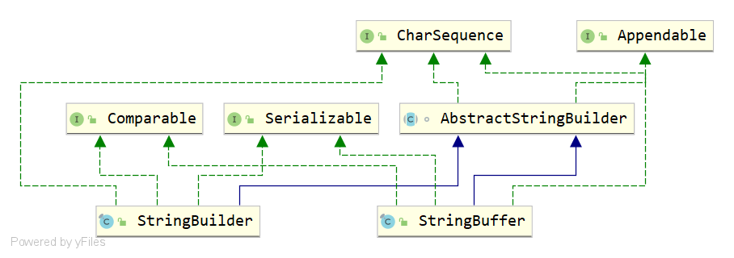

# StringBuffer和StringBuilder

`StringBuffer`和`StringBuilder`都是可变的字符串，它们的类结构图如下：



## 区别1：线程安全

`StringBuffer`是线程安全的，`StringBuilder`是线程不安全的。因为`StringBuffer`的所有`public`方法都被`synchronized`关键字所修饰。而`StringBuilder`没有。

*`StringBuffer`的代码片段：*

```java
@Override
@HotSpotIntrinsicCandidate
public synchronized StringBuffer append(String str) {
    toStringCache = null;
    super.append(str);
    return this;
}
```

## 区别2：缓存值

*`StringBuffer`的`toString()`方法代码片段：*

```java
//toString返回的最后一个值的缓存。 当StringBuffer被修改时清除。  
private transient String toStringCache;

@Override
@HotSpotIntrinsicCandidate
public synchronized String toString() {
    if (toStringCache == null) {
        return toStringCache =
            isLatin1() ? StringLatin1.newString(value, 0, count)
            : StringUTF16.newString(value, 0, count);
    }
    return new String(toStringCache);
}
```

*`StringBuilder`的`toString()`方法代码片段：*

```java
@Override
@HotSpotIntrinsicCandidate
public String toString() {
    // Create a copy, don't share the array 创建一个副本，不要共享数组
    return isLatin1() ? StringLatin1.newString(value, 0, count)
        : StringUTF16.newString(value, 0, count);
}
```

如上代码所示，`StringBuffer`每次`toString`都会直接使用最后一个值的缓存来构造一个字符串。而`StringBuilder`则每次都需要复制一次字节数组，再构造一个字符串。

所以缓存值也是对`StringBuffer`的一个优化，不过`StringBuffer`的`toString`方法仍然是同步的。

## 区别3：性能

既然`StringBuffer`是线程安全的，它所有的`public`方法都是同步的，而`StringBuilder`不是，所以毫无疑问，`StringBuilder`的性能要远大于`StringBuffer`。

## 总结

`StringBuffer`适用于在多线程操作同一个`StringBuffer`的场景。如果是单线程场合`StringBuilder`更合适。