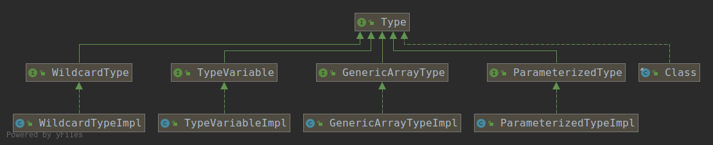

# java.lang.reflect.Type

在JDK中`java.lang.reflect.Type`接口代表一种类型，所有具体的类型都需要实现Type接口。

如下图所示：



JDK提供了五中类型，分别是：

- `GenericArrayType`：通用数组类型
- `ParameterizedType`：参数化类型
- `TypeVariable`：类型变量
- `WildcardType`：通配符类型
- `Class`：普通类型

如下代码所示，`TypeDemo`中的五个成员变量分别对应五种类型：

```java
public class TypeDemo<T> {
    //通用数组类型
    private T[] a;
    //参数化类型
    private List<T> b;
    //通配符类型
    private List<? extends T> c;
    //普通类型
    private List d;
    //类型变量
    private T e;
}
```

## 测试类型

成员变量a：

```java
public static void main(String[] args) throws Exception {
    Field field = TypeDemo.class.getDeclaredField("a");
    Type type = field.getGenericType();
    System.out.println(type.getClass());
    Type componentType = ((GenericArrayType) type).getGenericComponentType();
    System.out.println(componentType.getClass());
}
//输出结果
//class sun.reflect.generics.reflectiveObjects.GenericArrayTypeImpl
//class sun.reflect.generics.reflectiveObjects.TypeVariableImpl
```

成员变量b：

```java
public static void main(String[] args) throws Exception {
    Field field = TypeDemo.class.getDeclaredField("b");
    Type type = field.getGenericType();
    System.out.println(type.getClass());
    Type[] actualType = ((ParameterizedType) type).getActualTypeArguments();
    System.out.println(actualType[0].getClass());
}
//输出结果
//class sun.reflect.generics.reflectiveObjects.ParameterizedTypeImpl
//class sun.reflect.generics.reflectiveObjects.TypeVariableImpl
```

成员变量c：

```java
public static void main(String[] args) throws Exception {
    Field field = TypeDemo.class.getDeclaredField("c");
    Type type = field.getGenericType();
    System.out.println(type.getClass());
    Type[] actualType = ((ParameterizedType) type).getActualTypeArguments();
    System.out.println(actualType[0].getClass());
}
//输出结果
//class sun.reflect.generics.reflectiveObjects.ParameterizedTypeImpl
//class sun.reflect.generics.reflectiveObjects.WildcardTypeImpl
```

成员变量d：

```java
public static void main(String[] args) throws Exception {
    Field field = TypeDemo.class.getDeclaredField("d");
    Type type = field.getGenericType();
    System.out.println(type.getClass());
}
//输出结果
//class java.lang.Class
```

成员变量e：

```java
public static void main(String[] args) throws Exception {
    Field field = TypeDemo.class.getDeclaredField("e");
    Type type = field.getGenericType();
    System.out.println(type.getClass());
}
//输出结果
//class sun.reflect.generics.reflectiveObjects.TypeVariableImpl
```

根据上面的测试结果可以得出如下结论：

1. 泛型变量是类型变量（`TypeVariable`）
2. 泛型T数组是通用数组类型（`GenericArrayType`），其每一个元素是类型变量（`TypeVariable`）。
3. 包含尖括号（`<>`）的是参数化类型（`ParameterizedType`），上述变量b，`List<T>`的泛型T，仍然是类型变量（`TypeVariable`）。
4. 尖括号中的问号（`?`）是通配符类型（`WildcardType`）。
5. 不包含泛型尖括号以及泛型变量的是普通类型（Class）。

## 获取泛型

在程序开发中，常常需要获取泛型类型信息以实现程序的逻辑。如果你对JVM比较了解，那么就应该知道，在Java中所有的类型信息都以常量的形式存储在内存的常量池中，即它们在编译时就已经固定，泛型在编译时也会被擦除。所以是没有所谓的动态泛型，例如`List<String> list = new ArrayList<>()`是没有办法获取到泛型`<String>`中的`String`类型的，而且也没有必要，完全可以通过数据获取其类型。另外，我们也知道，`List<String>`完全可以将不同的类型数据放进去，只是编译阶段无法通过而已。

那么非要获取`List<String>`的泛型类型将会获取到什么呢？`List`的接口定义如下：

```java
public interface List<E> extends Collection<E> {
    ......
}
```

前面已经说过，Java中所有的类型信息都以常量的形式存储在内存的常量池中，那么这里存储在常量池中的泛型是E，而E是没有类型的。所以当获取其泛型类型的时候，类型名称为E，类型为`TypeVariable`，而不是具体的Class对象。示例如下：

```java
List<String> list = new ArrayList<>();
Type superclass = list.getClass().getGenericSuperclass();
System.out.println(superclass.getClass());
System.out.println(superclass.getTypeName());
System.out.println(((ParameterizedType)superclass).getActualTypeArguments()[0].getClass());
System.out.println(((ParameterizedType)superclass).getActualTypeArguments()[0].getTypeName());
//输出结果
//class sun.reflect.generics.reflectiveObjects.ParameterizedTypeImpl
//java.util.AbstractList<E>
//class sun.reflect.generics.reflectiveObjects.TypeVariableImpl
//E
```

所以，我们一般获取的是明确定义的类型，而不是`T`，`E`这样的标识符类型。示例如下：

```java
public class TypeDemo<T> {
    //参数化类型
    private List<String> list;

    public static void main(String[] args) throws Exception {
        Field field = TypeDemo.class.getDeclaredField("list");
        Type type = field.getGenericType();
        System.out.println(type.getClass());
        //强转为参数化类型
        Type[] actualType = ((ParameterizedType) type).getActualTypeArguments();
        System.out.println(actualType[0]);
    }
}
//输出结果
//class sun.reflect.generics.reflectiveObjects.ParameterizedTypeImpl
//class java.lang.String
```

如上述代码所属，泛型`<String>`在编译期间就已经明确，并存储到了常量池中。所以可以获取到类型为`java.lang.String`。


# ResolvableType


## get

- `getType()`：

  获取其Type类型

- `getComponentType()`：

- `getRawClass()`：

- `getSource()`：

  获取原始对象，即当前`ResolvableType`包装的什么对象就返回什么对象。

- `getInterfaces()`：

  获取接口类型数组，每一个接口类型会被包装为`ResolvableType`类型。

- `getSuperType()`：

  获取父类类型，父类类型会被包装为`ResolvableType`类型。

- `getGenerics()`：

  获取参数化类型数组，每一个参数化类型会被包装为`ResolvableType`类型。

- `getGeneric(int... indexes)`：

  获取指定索引参数化类型，参数化类型会被包装为`ResolvableType`类型。

- `getNested(int nestingLevel)`：

- `getNested(int nestingLevel, Map<Integer, Integer> typeIndexesPerLevel)`：

## is

- `isArray()`：

  当前被包装的对象是否是数组类型。

- `isAssignableFrom(Class<?> other)`：

  判断此`ResolvableType`所包装的对象所表示的类或接口是否是指定Class参数所表示的类或接口的超类或超接口，或相等。如果是，则返回true，否则，返回false。

- `isAssignableFrom(ResolvableType other)`：

  判断此`ResolvableType`所包装的对象所表示的类或接口是否是指定`ResolvableType`参数包装的对象所表示的类或接口的超类或超接口，或相等。如果是，则返回true，否则，返回false。

- `isInstance(Object obj)`：

  判断此`ResolvableType`所包装的对象所表示的类或接口是否是指定Object参数所表示的类或接口的超类或超接口，或相等。如果是，则返回true，否则，返回false。

上述三个类型判断的方法其实现都是一样的，都会被转换为`ResolvableType`与`ResolvableType`之间的类型判定，即`isAssignableFrom(ResolvableType other)`方法的实现。

*类型判断示例：*

```java
ResolvableType resolvableType = ResolvableType.forClass(List.class);
System.out.println(resolvableType.isAssignableFrom(ArrayList.class)); //true
System.out.println(resolvableType.isAssignableFrom(ResolvableType.forClass(Collection.class))); //false
System.out.println(resolvableType.isInstance(new ArrayList<>())); //true
```

## as

- `asCollection()`：

  将此`ResolvableType`所包装的对象所表示的类或接口转换为表示`Collection.class`的`ResolvableType`对象。

- `asMap()`：

  将此`ResolvableType`所包装的对象所表示的类或接口转换为表示`Map.class`的`ResolvableType`对象。

- `as(Class<?> type)`：

  将此`ResolvableType`所包装的对象所表示的类或接口转换为表示指定`Class`参数类型的的`ResolvableType`对象。

*类型转换示例：*

```java
ResolvableType resolvableType = ResolvableType.forClass(List.class);
System.out.println(resolvableType.as(Collection.class)); // java.util.Collection<?>
System.out.println(resolvableType.asCollection()); // java.util.Collection<?>
System.out.println(resolvableType.asMap()); // ?
```

## has

- `hasGenerics()`：

  判断是否存在参数化类型。

- `hasUnresolvableGenerics()`：

  判断是否存在不可解析的泛型。只有以下两种情况下才会返回`true`：

  1. 通配符类型和类型变量。

     ```java
     public class TypeDemo<T> {
         private List<?> list; //通配符类型
         private List<T> d; //类型变量
         public static void main(String[] args) throws Exception {
             Field field = TypeDemo.class.getDeclaredField("list");
             ResolvableType resolvableType = ResolvableType.forField(field);
             System.out.println(resolvableType.hasUnresolvableGenerics()); //true
         }
     }
     ```

  2. 以原始的方式实现泛型接口，具体而言就是实现具有泛型接口，但未声明泛型。

     ```java
     //泛型接口
     public interface Interface<T> {
     }
     //以原始的方式实现泛型接口
     public class Impl implements Interface {
     }
     //测试
     public static void main(String[] args) throws Exception {
         ResolvableType resolvableType = ResolvableType.forClass(Impl.class);
         System.out.println(resolvableType.hasUnresolvableGenerics()); //true
     }
     ```

## resolve

- `resolve()`：

  解析此`ResolvableType`所包装对象所表示的类或接口的`Class`类型，如果不能解析，返回null。

- `resolve(Class<?> fallback)`：

  解析此`ResolvableType`所包装对象所表示的Type为Class对象，如果这个Type不能转换为Class对象，则返回指定参数的Class对象（`fallback`），否则，返回转换后的Class对象。

- `resolveGeneric(int... indexes)`：

  解析此`ResolvableType`所包装对象所表示的类或接口的指定索引的参数化类型的`Class`类型，如果不能解析，返回null。

- `resolveGenerics()`：

  解析此`ResolvableType`所包装对象所表示的类或接口的所有的参数化类型的`Class`类型，如果不能解析，返回null。

- `resolveGenerics(Class<?> fallback)`：

  解析此`ResolvableType`所包装对象所表示的类或接口的所有的参数化类型所表示的Type为Class对象，如果这个Type不能转换为Class对象，则返回指定参数的Class对象（`fallback`），否则，返回转换后的Class对象。它们以一个数组形式表示。

*类型解析示例：*

```java
public class TypeDemo<T> {
    //参数化类型
    private List<String> a;
    //通配符类型
    private List<? extends T> b;
}
```

类型可被转换：

```java
ResolvableType resolvableType = ResolvableType.forField(TypeDemo.class.getDeclaredField("a"));
System.out.println(resolvableType.getGeneric(0).resolve()); //class java.lang.String
System.out.println(resolvableType.getGeneric(0).resolve(Collection.class)); //class java.lang.String
System.out.println(resolvableType.resolveGeneric(0)); //class java.lang.String
System.out.println(resolvableType.resolveGenerics()[0]); //class java.lang.String
System.out.println(resolvableType.resolveGenerics(Collection.class)[0]); //class java.lang.String
```

类型不可被转换：

```java
ResolvableType resolvableType = ResolvableType.forField(TypeDemo.class.getDeclaredField("b"));
System.out.println(resolvableType.getGeneric(0).resolve()); //null
System.out.println(resolvableType.getGeneric(0).resolve(Collection.class)); //interface java.util.Collection
System.out.println(resolvableType.resolveGeneric(0)); //null
System.out.println(resolvableType.resolveGenerics()[0]); //null
System.out.println(resolvableType.resolveGenerics(Collection.class)[0]); //interface java.util.Collection
```

> 注意：`resolvableType.getGeneric(0).resolve()`等价于`resolvableType.resolveGeneric(0)`。