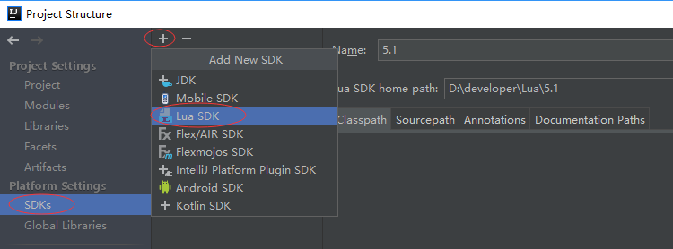
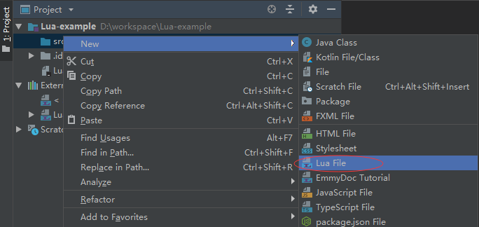
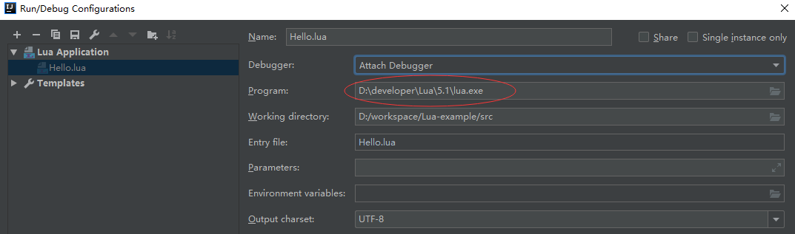
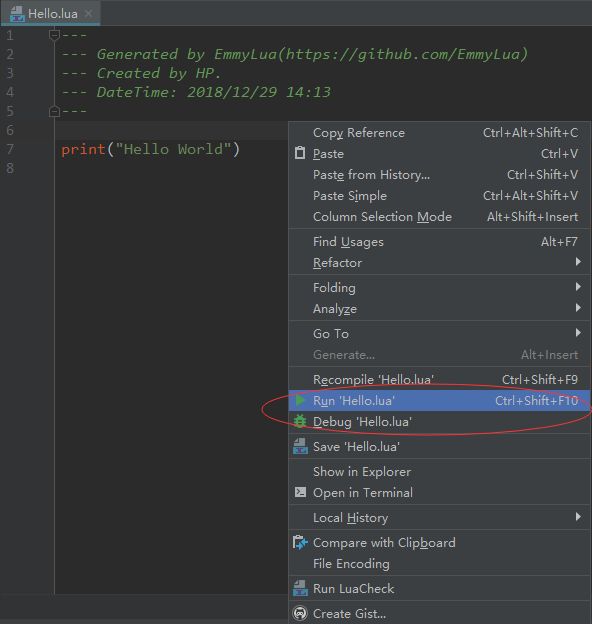
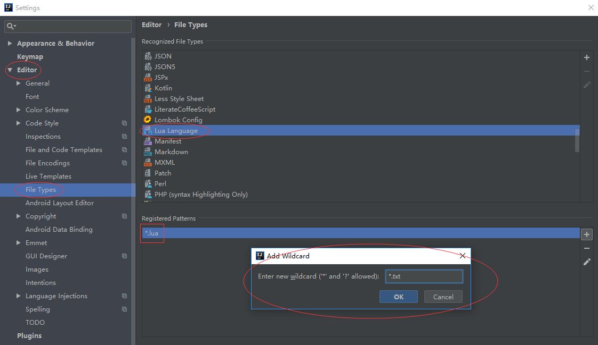

# Intellij Idea编辑调试Lua

## 安装EmmyLua插件

首先需要安装EmmyLua插件，通过`File—Settings—Plugins—Browse respositories`搜索EmmyLua即可安装。

EmmyLua官方网址：https://emmylua.github.io/index.html

EmmyLuaGitHub地址：https://github.com/EmmyLua/IntelliJ-EmmyLua

EmmyLua码云地址：https://gitee.com/tangzx/IntelliJ-Lua/releases

## Window 系统上安装 Lua

window下你可以使用一个叫"SciTE"的IDE环境来执行lua程序，下载地址为：

- 本站下载地址：[LuaForWindows_v5.1.4-46.exe](http://static.runoob.com/download/LuaForWindows_v5.1.4-46.exe)
- Github 下载地址：<https://github.com/rjpcomputing/luaforwindows/releases>
- Google Code下载地址 : <https://code.google.com/p/luaforwindows/downloads/list>

双击安装后即可在该环境下编写 Lua 程序并运行。

你也可以使用 Lua 官方推荐的方法使用 LuaDist：<http://luadist.org/>

安装完成只有可以选择在桌面上生成一个`Lua`和`SciTE`的快捷方式。

Win Lua教程 之 LuaForWindows的下载安装：https://jingyan.baidu.com/article/f7ff0bfcc2301e2e26bb13f0.html

## Intellij Idea配置Lua SDK

`File`—`Project Structrue`—`Platform Settings`—`SDKs`新增一个Lua SDK，

注意：目录需要选中到可以找到 lua.exe 那一层。

### 1.创建新的Lua工程

`File`–`New–Project`–`Lua`

### 2.创建Lua文件

src:鼠标右键—`New`—`Lua File`

### 3.设置默认的Lua解释器路径

`Run`—`Edit Configurations`

### 4.运行脚本

鼠标右键—`Run 'xxx.lua'`或`Debug 'xxx.lua'`

### 5.添加Lua脚本文件扩展名

Lua脚本文件的默认扩展名为.lua，我们可以添加其他类型的扩展名解释为Lua脚本。

`File`—`Settings`—`Editor`—`File Types`—`Lua Language`

## 安装Lua插件

Lua插件的安装方式跟前面EmmyLua插件的安装方式是一样的，都是在`Browse respositories`搜索安装即可。

Lua插件官方网址：https://bitbucket.org/sylvanaar2/lua-for-idea/wiki/Home

创建运行的方式跟EmmyLua插件一样，同样也需要设置其SDK。

Lua插件的功能没有EmmyLua插件强大，因为依赖的SDK是`LuaForWindows`，而Lua插件依赖的是自己内置的。

一个他人的博客文章：https://www.jianshu.com/p/751163916276

