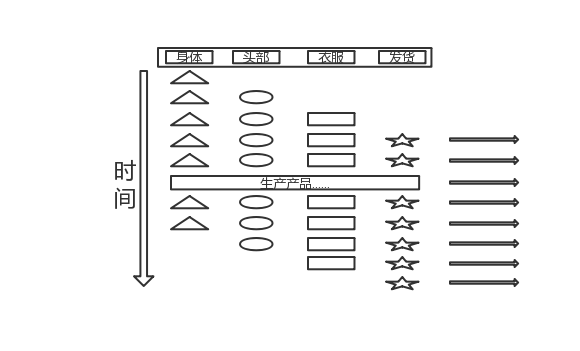

Assembly-Line（流水线）


并发算法虽然可以充分发挥多核CPU的性能，但不幸的是，并非所有的计算都可以改造成并发的形式。那么什么样的算法是无法使用并发进行计算的呢？简单来说，执行过程中有数据相关的性的运算都是无法完美并行化的。

假如现在有两个数，B和C。如果我们要计算`(B+C)*B/2`，那么这个运算过程就是无法并行的。原因是，如果B+C没有执行完成，则永远算不出`(B+C)*B`，这就是数据相关性。如果线程执行时，所需的数据存在这种依赖关系，那么，就没有办法将它们完美的并行化。

遇到这种情况时，有没有什么补救措施呢？答案是肯定的，那就是借鉴日常生产中的流水线思想。

比如，现在要生产一批小玩偶。小玩偶的制作分为四个步骤，第一要组装身体，第二要在身体上安装四肢和头部，第三给组装完成的玩偶穿上一件漂亮的衣服，第四，就可以包装出货了。为了加快制作玩具的进度，我们不可能叫四个人同时加工一个玩具，因为这四个步骤有着严重的依赖关系。如果没有身体，就没有地方安装四肢，如果没有组装完成，就不能穿衣服，如果没有穿衣服，就不能包装发货。因此四个人来做一个玩偶是毫无意义的。

如果现在要制作的不是1只玩偶，而是1万只玩偶，那情况就不同了。你可以找四个人，每个人做一个步骤，例如第一个人组装完身体，交付给第二个人之后又去组装另一个新玩偶的身体又交付，而第二个人安装头部和四肢，然后再交付给第三个人，以此类推，从第三步开始，只需要花一个步骤的时间就可以完成一个玩偶的组装与发货。这就是流水线的思想。



借用这种思想，我们来计算十万组数据的`(B+C)*B/2`结果，将其拆分为三步，分别是`B+C`、`N*B`、`N/2`（设每一步的计算结果为N）。

代码如下：

```java
/**
 * assembly line 流水线
 */
public class AssemblyLine {
    
    @AllArgsConstructor
    public static class Msg {
        public int i;
        public int j;
        public String str;
    }

    public static class Plus implements Runnable{
        static BlockingQueue<Msg> bq = new LinkedBlockingQueue<>();
        @Override
        public void run() {
            while (true) {
                try {
                    Msg msg = bq.take();
                    msg.j = msg.i + msg.j;
                    Multiply.bq.offer(msg);
                } catch (InterruptedException e) {
                    e.printStackTrace();
                }
            }
        }
    }

    public static class Multiply implements Runnable{
        static BlockingQueue<Msg> bq = new LinkedBlockingQueue<>();
        @Override
        public void run() {
            while (true) {
                try {
                    Msg msg = bq.take();
                    msg.j = msg.i * msg.j;
                    Divide.bq.offer(msg);
                } catch (InterruptedException e) {
                    e.printStackTrace();
                }
            }
        }
    }

    public static class Divide implements Runnable{
        static BlockingQueue<Msg> bq = new LinkedBlockingQueue<>();
        @Override
        public void run() {
            while (true) {
                try {
                    Msg msg = bq.take();
                    msg.j = msg.j >> 1;
                    System.out.println(msg.str+"="+msg.j);
                } catch (InterruptedException e) {
                    e.printStackTrace();
                }
            }
        }
    }
 
    public static void main(String[] args) {
        //启动流水线线程，等待接收任务
        new Thread(new Plus()).start();
        new Thread(new Multiply()).start();
        new Thread(new Divide()).start();
        for (int i = 1; i <= 1000; i++) {
            for (int j = 1; j <= 1000; j++) {
                //构造任务消息
                Msg msg = new Msg(i,j,String.format("(%d+%d)*%d/2",i,j,i));
                //提交任务
                Plus.bq.offer(msg);
            }
        }
    }
}
```

但是多线程是复杂的，在现实中，流水线确实可以加快产品的生产速度，但是在程序中，这种流水线的设计真的比单线程块吗？为了验证这个问题，重新写了一个串行计算的例子，如下：

```java
public static void serial(){
    List<Integer> results = new LinkedList<>();
    for (int i = 1; i <= 1000; i++) {
        for (int j = 1; j <= 1000; j++) {
            results.add((i+j)*i>>1);
        }
    }
}
```

分别将串行和流水线测试了5次，它们的耗时如下：

| type   | first time | second tine | third time | fouth time | fifth time |
| ------ | ---------- | ----------- | ---------- | ---------- | ---------- |
| 流水线 | 3572ms     | 3590ms      | 3457ms     | 3448ms     | 3650ms     |
| 串行   | 201ms      | 231ms       | 217ms      | 34ms       | 143ms      |

结果出乎我们的意料，流水线不仅没有串行快，而且还慢了大约18倍。但是事实真的如此吗？我们要知道，上述例子是一个CPU密集型的任务，并且也仅仅是做了一个加、乘、除的运算，它的资源消耗远远小于线程间的调度与消息传递。为此，我们又定义了一个`task()`函数，来模拟任务的执行，函数如下：

```java
public static void task(){
    try {
        Thread.sleep(1);
    } catch (InterruptedException e) {
        e.printStackTrace();
    }
}
```

改造计算代码：

流水线代码的算术计算任务替换为调用`task()`，模拟任务执行（代码就不贴了）。

串行代码修改如下：

```java
public static void serial(){
    for (int i = 1; i <= 100; i++) {
        for (int j = 1; j <= 100; j++) {
            task();//模拟第一步任务
            task();//模拟第二步任务
            task();//模拟第三步任务
        }
    }
}
```

> 注意：十万次测试时间太长，修改为一千次。

同样分别将串行和流水线测试了5次，它们的耗时如下：

| type   | first time | second tine | third time | fouth time | fifth time |
| ------ | ---------- | ----------- | ---------- | ---------- | ---------- |
| 流水线 | 18360ms    | 18843ms     | 18433ms    | 18567ms    | 18545ms    |
| 串行   | 56104ms    | 56020ms     | 56190ms    | 56215ms    | 56177ms    |

结果符合我们的预期，我们的每一个任务被分成三步，而串行的耗时也恰恰是流水线的的三倍左右。所以流水线是否能加快效率取决于具体的任务。


> 上面的两个例子测试结果仅做参考，不能作为依据，因为在不能的物理机上其表现的性能肯定是不一样的。