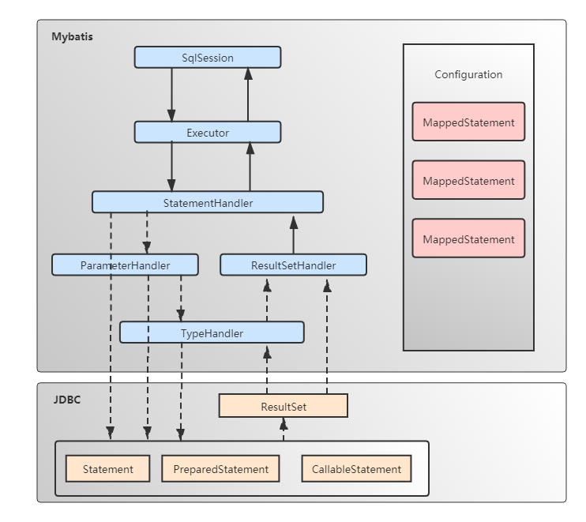
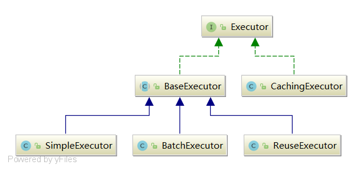
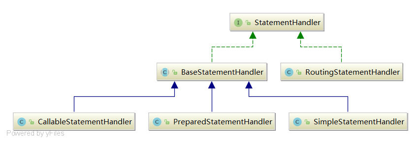
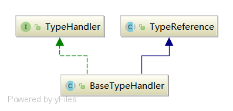
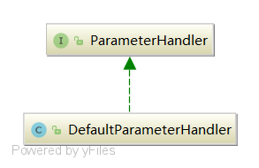
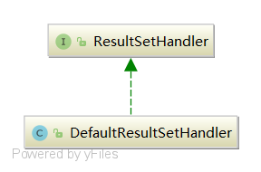

# 核心组件介绍





- Configuration：用于描述Mybatis的主配置信息，其他组件需要获取配置信息时，直接通过Configuration对象获取。除此之外，Mybatis在应用启动时，将Mapper配置信息、TypeAlias（类型别名）、TypeHandler等注册到Configuration组件中，其他组件需要这些信息时，也可以从Configuration对象中获取。
- MappedStatement：MappedStatement用于描述Mapper中的SQL配置信息，是对Mapper XML配置文件中<select|update|delete|insert>等标签或者@Select/@Update等注解配置信息的封装。
- SqlSeesion：SqlSession是Mybatis提供的面向用户的API，表示和数据库交互时的会话对象。用于完成数据库的增删改查功能。SqlSession是Executor组件的外观，目的是对外提供易于理解和使用的数据库操作接口。
- Executor：Executor是Mybatis的SQL执行器，Mybatis中对数据库所有的增删改查操作都是有Executor组件完成的。
- StatementHandler：StatementHandler封装了对JDBC Statement对象的操作，比如为Statement对象设置参数，调用Statement接口提供的方法与数据库交互，等等。
- ParameterHandler：当Mybatis框架使用的Statement类型为CallableStatement和PreparedStatement时，ParameterHandler用于为Statement对象参数占位符设置值。
- ResultSetHandler：ResultSetHandler封装了对JDBC中ResultSet对象的操作，当执行SQL类型为select语句时，ResultSetHandler用于将查询结果转换成Java对象。
- TypeHandler：TypeHandler是Mybatis中的类型处理器，用于处理Java类型与JDBC类型之间的映射。它的作用主要体现在能够根据Java类型调用CallableStatement或PreparedStatement对象对应的setXXX()方法为Statement对象设置值，而且能够根据Java类型调用ResultSet对象对应的getXXX()方法获取SQL执行结果。


SqlSession组件是用户层面的API。实际上SqlSession是Executor组件的外观，目的是为用户提供更友好的数据库操作接口，这是设计模式中外观模式的典型应用。真正执行SQL操作的是Executor组件，Executor可以理解为SQL执行器，它会使用StatementHandler组件对JDBC对象进行操作。当Statement类型为CallableStatament和PreparedStatement时，会通过ParameterHandler组件为参数占位符赋值。ParameterHandler组件中会根据Java类型找到对应的TypeHandler对象，TypeHandler中会通过Statement对象提供的setXXX()方法为Statement对象中的参数占位符设置值。Statement组件使用JDBC中的Statement对象与数据库完成交互后，当SQL语句类型为SELECT时，Mybatis通过ResultSetHandler组件从Statement对象中获取ResultSet对象，然后将ResultSet对象转换为Java对象。


## Configuration详解

### Mybatis主配置信息

Configuration类中定义一系列用来控制Mybatis运行时行为的属性（与Mybatis主配置文件配置对应）：

```java
protected boolean safeRowBoundsEnabled;
protected boolean safeResultHandlerEnabled = true;
protected boolean mapUnderscoreToCamelCase;
protected boolean aggressiveLazyLoading;
protected boolean multipleResultSetsEnabled = true;
protected boolean useGeneratedKeys;
protected boolean useColumnLabel = true;
protected boolean cacheEnabled = true;
protected boolean callSettersOnNulls;
protected boolean useActualParamName = true;
protected boolean returnInstanceForEmptyRow;
protected boolean shrinkWhitespacesInSql;

protected String logPrefix;
protected Class<? extends Log> logImpl;
protected Class<? extends VFS> vfsImpl;
protected LocalCacheScope localCacheScope = LocalCacheScope.SESSION;
protected JdbcType jdbcTypeForNull = JdbcType.OTHER;
protected Set<String> lazyLoadTriggerMethods = new HashSet<>(Arrays.asList("equals", "clone", "hashCode", "toString"));
protected Integer defaultStatementTimeout;
protected Integer defaultFetchSize;
protected ResultSetType defaultResultSetType;
protected ExecutorType defaultExecutorType = ExecutorType.SIMPLE;
protected AutoMappingBehavior autoMappingBehavior = AutoMappingBehavior.PARTIAL;
protected AutoMappingUnknownColumnBehavior autoMappingUnknownColumnBehavior = AutoMappingUnknownColumnBehavior.NONE;

protected Properties variables = new Properties();
protected ReflectorFactory reflectorFactory = new DefaultReflectorFactory();
protected ObjectFactory objectFactory = new DefaultObjectFactory();
protected ObjectWrapperFactory objectWrapperFactory = new DefaultObjectWrapperFactory();

protected boolean lazyLoadingEnabled = false;
protected ProxyFactory proxyFactory = new JavassistProxyFactory(); // #224 Using internal Javassist instead of OGNL

protected String databaseId;
/**
   * Configuration factory class.
   * Used to create Configuration for loading deserialized unread properties.
   *
   * @see <a href='https://code.google.com/p/mybatis/issues/detail?id=300'>Issue 300 (google code)</a>
   */
protected Class<?> configurationFactory;
```

主配置信息可以在Mybatis的主配置文件中通过`<setting>`标签指定。

```xml

```


*Mybatis所有属性作用及配置说明参考表*


| 属性                             | 作用 | 有效值 | 默认值 |
| -------------------------------- | ---- | ------ | ------ |
| safeRowBoundsEnabled             |      |        |        |
| safeResultHandlerEnabled         |      |        |        |
| mapUnderscoreToCamelCase         |      |        |        |
| aggressiveLazyLoading            |      |        |        |
| multipleResultSetsEnabled        |      |        |        |
| useGeneratedKeys                 |      |        |        |
| useColumnLabel                   |      |        |        |
| cacheEnabled                     |      |        |        |
| callSettersOnNulls               |      |        |        |
| useActualParamName               |      |        |        |
| returnInstanceForEmptyRow        |      |        |        |
| ?shrinkWhitespacesInSql          |      |        |        |
| logPrefix                        |      |        |        |
| logImpl                          |      |        |        |
| vfsImpl                          |      |        |        |
| localCacheScope                  |      |        |        |
| jdbcTypeForNull                  |      |        |        |
| lazyLoadTriggerMethods           |      |        |        |
| defaultStatementTimeout          |      |        |        |
| defaultFetchSize                 |      |        |        |
| ?defaultResultSetType            |      |        |        |
| defaultExecutorType              |      |        |        |
| autoMappingBehavior              |      |        |        |
| autoMappingUnknownColumnBehavior |      |        |        |
| ?variables                       |      |        |        |
| ?reflectorFactory                |      |        |        |
| ?objectFactory                   |      |        |        |
| ?objectWrapperFactory            |      |        |        |
| lazyLoadingEnabled               |      |        |        |
| proxyFactory                     |      |        |        |
| ?databaseId                      |      |        |        |
| configurationFactory             |      |        |        |


### 类型及Mapper配置信息

Configuration注册TypeHandler（类型处理器）、TypeAlias（类型别名）、Mapper接口及Mapper SQL配置信息。

Configuration通过如下属性保存：

```java
protected final MapperRegistry mapperRegistry = new MapperRegistry(this);
protected final InterceptorChain interceptorChain = new InterceptorChain();
protected final TypeHandlerRegistry typeHandlerRegistry = new TypeHandlerRegistry(this);
protected final TypeAliasRegistry typeAliasRegistry = new TypeAliasRegistry();
protected final LanguageDriverRegistry languageRegistry = new LanguageDriverRegistry();

protected final Map<String, MappedStatement> mappedStatements = new StrictMap<MappedStatement>("Mapped Statements collection")
    .conflictMessageProducer((savedValue, targetValue) ->
                             ". please check " + savedValue.getResource() + " and " + targetValue.getResource());
protected final Map<String, Cache> caches = new StrictMap<>("Caches collection");
protected final Map<String, ResultMap> resultMaps = new StrictMap<>("Result Maps collection");
protected final Map<String, ParameterMap> parameterMaps = new StrictMap<>("Parameter Maps collection");
protected final Map<String, KeyGenerator> keyGenerators = new StrictMap<>("Key Generators collection");

protected final Set<String> loadedResources = new HashSet<>();
protected final Map<String, XNode> sqlFragments = new StrictMap<>("XML fragments parsed from previous mappers");

protected final Collection<XMLStatementBuilder> incompleteStatements = new LinkedList<>();
protected final Collection<CacheRefResolver> incompleteCacheRefs = new LinkedList<>();
protected final Collection<ResultMapResolver> incompleteResultMaps = new LinkedList<>();
protected final Collection<MethodResolver> incompleteMethods = new LinkedList<>();

/*
   * A map holds cache-ref relationship. The key is the namespace that
   * references a cache bound to another namespace and the value is the
   * namespace which the actual cache is bound to.
   */
protected final Map<String, String> cacheRefMap = new HashMap<>();
```

上述属性含义如下：

- mapperRegistry：用于注册Mapper接口信息，建立Mapper接口的Class对象和MapperProxyFactory对象之间的关系，其中MapperProxyFactory对象用于创建Mapper动态代理对象。
- interceptorChain：用于注册Mybatis插件信息，Mybatis插件实际上就是一个拦截器。
- typeHandlerRegistry：用于注册所有TypeHandler，并建立JDBC类型、JDBC类型与TypeHandler之间的对于关系。
- typeAliasRegistry：用于注册所有的类型别名。
- languageRegistry：用于注册LanguageDriver，LanguageDriver用于解析SQL配置，将配置信息转换成SqlSource对象。
- mappedStatements：MappedStatements对象描述<insert|select|update|delete>等标签或者通过@Select、@Delete、@Update、@Insert等注解配置的SQL信息。Mybatis将所有的MappedStatement对象注册到该属性中，其中Key为Mapper的Id，Value为MappedStatement对象。
- caches：用于注册Mapper中配置的所有缓存信息，其中Key为Cache的Id，也就是Mapper的命名空间，Value为Cache对象。
- resultMaps：用于注册Mapper配置文件中通过`<resultMap>`标签配置的ResultMap信息，ResultMap用于建立Java实体属性与数据库字段之间的映射关系，其中Key为ResulrMap的Id，该Id是由Mapper命名空间和`<resultMap>`标签的id属性组成的，Value解析为`<resultMap>`标签后得到的ResultMap对象。
- parameterMaps：用于注册Mapper中通过`<parameterMap>`标签注册的参数映射信息。Key为ParameterMap的Id，由Mapper命令空间和`<parameterMap>`标签的id属性构成，Value为解析`<parameterMap>`标签后得到的ParameterMap对象。
- keyGenerators：用于注册KeyGenerator，KeyGenerator是Mybatis的主键生成器；Mybatis中提供了3中KeyGenerator，即Jdbc3KeyGenerator（数据库自增主键）、NoKeyGenerator（无自增主键）、SelectKeyGenerator（通过Select语句查询自增主键，例如oracle的sequence）。
- loadedResources：用于注册所有Mapper XML配置文件路径。
- sqlFragments：用于注册Mapper中通过`<sql>`标签配置的SQL片段，Key为SQL片段的Id，Valuue为Mybatis封装的表示XML节点的XNode对象。
- incompleteStatements：用于注册解析出现异常的XMLStatementBuilder对象。
- incompleteCacheRefs：用于注册解析出现异常的CacheRefResolver对象。
- incompleteResultMaps：用于注册解析出现异常的ResultMapResolver对象。
- incompleteMethods：用于解析出现异常的MethodResolver对象。

### Configuration作为工厂类

Configuration组件还作为Executor、StatementHandler、ResultSetHandler、ParameterHandler组件的工厂了，用于创建这些组件的实例。

工厂方法如下：

```java
public ParameterHandler newParameterHandler(MappedStatement mappedStatement, Object parameterObject, BoundSql boundSql) {
    ParameterHandler parameterHandler = mappedStatement.getLang().createParameterHandler(mappedStatement, parameterObject, boundSql);
    parameterHandler = (ParameterHandler) interceptorChain.pluginAll(parameterHandler);
    return parameterHandler;
}

public ResultSetHandler newResultSetHandler(Executor executor, MappedStatement mappedStatement, RowBounds rowBounds, ParameterHandler parameterHandler,
                                            ResultHandler resultHandler, BoundSql boundSql) {
    ResultSetHandler resultSetHandler = new DefaultResultSetHandler(executor, mappedStatement, parameterHandler, resultHandler, boundSql, rowBounds);
    resultSetHandler = (ResultSetHandler) interceptorChain.pluginAll(resultSetHandler);
    return resultSetHandler;
}

public StatementHandler newStatementHandler(Executor executor, MappedStatement mappedStatement, Object parameterObject, RowBounds rowBounds, ResultHandler resultHandler, BoundSql boundSql) {
    StatementHandler statementHandler = new RoutingStatementHandler(executor, mappedStatement, parameterObject, rowBounds, resultHandler, boundSql);
    statementHandler = (StatementHandler) interceptorChain.pluginAll(statementHandler);
    return statementHandler;
}

public Executor newExecutor(Transaction transaction) {
    return newExecutor(transaction, defaultExecutorType);
}

public Executor newExecutor(Transaction transaction, ExecutorType executorType) {
    executorType = executorType == null ? defaultExecutorType : executorType;
    executorType = executorType == null ? ExecutorType.SIMPLE : executorType;
    Executor executor;
    if (ExecutorType.BATCH == executorType) {
        executor = new BatchExecutor(this, transaction);
    } else if (ExecutorType.REUSE == executorType) {
        executor = new ReuseExecutor(this, transaction);
    } else {
        executor = new SimpleExecutor(this, transaction);
    }
    if (cacheEnabled) {
        executor = new CachingExecutor(executor);
    }
    executor = (Executor) interceptorChain.pluginAll(executor);
    return executor;
}
```

上述工厂方法会根据Mybatis不同的配置创建对象的实现类。

*Executor:*

- 当defaultExecutorType="BATCH"，实现类为BatchExecutor；
- 当defaultExecutorType="REUSE"，实现类为ReuseExecutor；
- 当defaultExecutorType="SIMPLE"，实现类为SimpleExecutor；


Mybatis采用工厂模式创建Executor、StatementHandler、ResultSetHandler、ParameterHandler的另一个目的是实现插件拦截逻辑。


## Executor详解

SqlSession是Mybatis提供的操作数据库的API，但是真正执行SQL的是Executor组件。

Executor接口中定义了对数据库的CRUD方法：

- query()和queryCursor()方法用于执行查询操作。
- update()方法用于执行查询、删除、修改操作。

Executor相关类图如下：



Mybatis提供了3中不同的Executor，分别是BatchExecutor、ReuseExecutor、SimpleExecutor。

这些Executor都继承至BaseExecutor，BaseExecutor中定义了方法的执行流程及通用的处理逻辑，具体的方法由子类来实现，是典型的模板方法模式的应用。

- SimpleExecutor：SimpleExecutor是基础的Executor，能够完成基本的CRUD操作。
- ReuseExecutor：ReuseExecutor对JDBC中的Statement对象做了缓存，当执行相同的SQL语句时，直接从缓存中取出Statement对象进行复用，避免了频繁创建和销毁Statement对象，从而提升系统性能，这时哼元思想的应用。
- BatchExecutor：BatchExecutor则会对调用同一个Mapper执行的update、insert和delete操作，调用Statement对象的批量操作功能。
- CachingExecutor：当Mybatis开启了二级缓存时，CachingExecutor会对SimpleExecutor、ReuseExecutor、BatchExecutor进行装饰，为查询操作增加二级缓存功能，这时装饰器模式的应用。

直接使用Executor组件与数据库交互示例：

```java
public static void testExecutor() throws IOException, SQLException {
    //获取配置文件输入流
    InputStream inputStream = Resources.getResourceAsStream("mybatis-config.xml");
    //通过SqlSessionFactoryBuilder的build()方法创建SqlSessionFactory实例
    SqlSessionFactory sqlSessionFactory = new SqlSessionFactoryBuilder().build(inputStream);
    //调用openSession()方法创建SqlSession实例
    SqlSession sqlSession = sqlSessionFactory.openSession();
    Configuration configuration = sqlSession.getConfiguration();
    //从Configuration对象中获取描述SQL配置的MappedStatement对象
    MappedStatement mappedStatement = configuration.getMappedStatement(
        "com.mybatis.mapper.UserMapper.listAllUser");
    //创建ReuseExecutor实例
    Executor executor = configuration.newExecutor(new JdbcTransaction(sqlSession.getConnection()), ExecutorType.REUSE);
    //调用query()方法执行查询操作
    List<User> users = executor.query(mappedStatement, null, RowBounds.DEFAULT, Executor.NO_RESULT_HANDLER);

    users.forEach(System.out::println);
}
```

Executor与数据库交互需要Mapper配置信息，Mybatis通过MappedStatement对象描述Mapper的配置信息，因此Executor需要一个MappedStatement对象作为参数。

Mybatis在应用启动时，会解析所有的Mapper配置信息，将Mapper配置解析成MappedStatement对象注册到Configuration组件中，所以，可以通过Configuration对象的getMappedStatement()方法获取对应的MappedStatement对象。有了MappedStatement对象之后，就可以根据SQL类型调用Executor对象的query()或者update()方法CRUD操作了。


## MappedStatement详解

Mybatis通过MappedStatement描述`<select|update|delete|insert>`等标签或者`@Select`/`@Update`等注解配置信息。

SQL Mapper配置

`<select>`标签：

- `id`：在命名空间中唯一标识符，可以被用来引用这条配置信息。
- `parameterType`：用于指定这条语句的参数类型的完全限定名或别名。这个属性是可选的，Mybatis能够根据Mapper接口方法中的参数类型推断出传入语句的类型。
- `parameterMap`：引用通过`<parameterMap>`标签定义的参数映射，该属性已经废弃。
- `resultType`：从这条语句中返回的期望类型的类的全限定名或别名。注意，如果返回的结果是集合类型，则resultType属性应该指定集合中可以包含的类型，而不是集合本身。
- `resultMap`：用于引用通过`<resultMap>`标签配置的实体属性与数据库字段之间建立的结果集的映射（注意：resultMap和resultType属性不能同时使用。）
- `flushCache`：用于控制是否刷新缓存。如果将其设置为true，则任何时候只要语句被调用，都会导致本地缓存和二级缓存被清空，默认值为false。
- `useCache`：是否使用二级缓存。如果将其设置为true，则会导致本条语句的结果被缓存在Mybatis的二级缓存中，对应`<select>`标签，该属性的默认值为true。
- `timeout`：驱动程序等待数据库返回请求结果的秒数，超时将会抛出异常。
- `fetchSize`：用于设置JDBC中的Statement对象的`fetchSize`属性，该属性用于指定SQL执行后返回的最大行数。
- `statementType`：参数可选值为`STATEMENT`、`PREPARED`或`CALLABLE`，这会让Mybatis分别使用`Statement`、`PreparedStatement`或`CallableStatement`与数据库交互，默认值为`PREPARED`。
- `resultSetType`：参数可选值为`FORWARD_ONLY`、`SCROLL_SENSITIVE`或`SCROLL_INSENSITIVE`，用于设置ResultSet对象的特征，具体可参考JDBC规范相关的内容。默认未设置，由JDBC驱动决定。
- `databaseId`：如果配置了databaseIdProvider，Mybatis会加载所有不带databaseId或匹配当前databaseId的语句。
- `resultOrdered`：这个设置仅针对嵌套结果select语句适用，如果为true，就是假定嵌套结果包含在一起或分组在一起，这样的话，当返回一个主结果行的时候，就不会发生对前面结果集引用的情况。这就使得在获得嵌套结果集的时候不至于导致内存不够用，默认值为false。
- `resultSets`：这个设置仅对多结果集的情况适用，它将列出语句执行后返回的结果集并将每个结果集给一个名称，名称使用逗号分隔。
- `lang`：该属性用于指定LanguageDriver实现，Mybatis中的LanguageDriver用于解析`<select|update|delete|insert>`标签中的SQL语句，生成SqlSource对象。

上面是属性中，除了resultMap、resultType、resultSetType、fetchSize、useCache、resultSets、resultOrdered是`<select>`标签特有的，其他属性是`<update|delete|insert>`标签共有的。

`<insert>`和`<update>`标签特有属性：

- `useGeneratedKeys`：该属性仅对`<update>`和`<insert>`标签有用，属性值为true时，Mybatis使用JDBC Satement对象的getGeneratedKeys()方法来取出由数据库内部生成的键值，例如MySQL自增主键。
- `keyProperty`：该属性仅对`<update>`和`<insert>`标签有用，用于将数据库自增主键或者`<insert>`标签中`<selectKey>`标签返回的值填充到实体的属性中，如果有多个属性，则使用逗号分隔。
- `keyColumn`：该属性仅对`<update>`和`<insert>`标签有用，通过生成的键值设置表中的列名，这个设置仅在某些数据库（PostgreSQL）中是必须的，当主键列不是表中的第一列时需要设置，如果有多个字段，则使用逗号分隔。

在MappedStatement对象中通过如下属性保存`<select|update|delete|insert>`标签的属性信息：

```java
public final class MappedStatement {
  private String id;
  private Integer fetchSize;
  private Integer timeout;
  private StatementType statementType;
  private ResultSetType resultSetType;
  private ParameterMap parameterMap;
  private List<ResultMap> resultMaps;
  private boolean flushCacheRequired;
  private boolean useCache;
  private boolean resultOrdered;
  private SqlCommandType sqlCommandType;
  private String[] keyProperties;
  private String[] keyColumns;
  private String databaseId;
  private LanguageDriver lang;
  private String[] resultSets;
  ......
}    
```

除此之外，还有一些其他属性：

```java
  private String resource;  
  private Configuration configuration;
  private SqlSource sqlSource;
  private Cache cache;
  private KeyGenerator keyGenerator;
  private boolean hasNestedResultMaps;
  private Log statementLog;
```

含义如下：

- `resource`：Mapper配置文件路径。
- `configuration`：Configuration对象的引用，方便获取Mybatis配置信息及TypeHandler、TypeAlias等信息。
- `sqlSource`：解析`<select|update|delete|insert>`，将SQL语句配置信息解析为SqlSource对象。
- `cache`：二级缓存实例，根据Mapper中的`<cache>`标签配置信息创建对应的Cache实现。
- `keyGenerator`：主键生成策略，默认为Jdbc3KeyGenerator，即数据库自增主键。当配置了`<selectKey>`时，使用SelectKeyGenerator生成主键。
- `hasNestedResultMaps`：`<select>`标签中通过resultMap属性指定的ResultMap是不是嵌套的ResultMap。
- `statementLog`：用于输出日志。

## StatementHandler详解

StatementHandler组件封装了对JDBC Statement的操作。

StatementHandler接口定义如下：

```java
public interface StatementHandler {
  Statement prepare(Connection connection, Integer transactionTimeout) throws SQLException;
  void parameterize(Statement statement) throws SQLException;
  void batch(Statement statement) throws SQLException;
  int update(Statement statement) throws SQLException;
  <E> List<E> query(Statement statement, ResultHandler resultHandler) throws SQLException;
  <E> Cursor<E> queryCursor(Statement statement) throws SQLException;
  BoundSql getBoundSql();
  ParameterHandler getParameterHandler();
}
```

各方法作用如下：

- `prepare`：该方法用于创建JDBC Statement对象，并完成Statement对象的属性设置。
- `parameterize`：该方法使用Mybatis中的ParameterHandler组件为PreparedStataement和CallableStatement参数占位符设置值。
- `batch`：将SQL命令添加到批量执行列表中。
- `update`：调用Statement对象的execute()方法执行更新语句，例如UPDATE、INSERT、DELETE语句。
- `query`：执行查询语句，并使用ResultSetHandler处理查询结果集。
- `queryCursor`：带游标的查询，返回Cursor对象，能够通过Iterator动态地从数据库中加载数据，适用于查询数据量较大的情况，避免将所有数据加载到内存中。
- `getBoundSql`：获取Mapper中配置的SQL信息，BoundSql封装了动态SQL解析后的SQL文本和参数映射信息。
- `getParameterHandler`：获取ParameterHandler实例。

StatementHandler相关实现类图：



- `BaseStatementHandler`：BaseStatementHandler是一个抽象类，封装了通用的处理逻辑及方法执行流程，具体方法的实现由子类完成，这里使用到了设计模式中的模板方法模式。
- `SimpleStatementHandler`：SimpleStatementHandler继承至BaseStatementHandler，封装了对JDBC Statement对象的操作。
- `PreparedStatementHandler`：PreparedStatementHandler封装了对JDBC PreparedStatement对象的操作。
- `CallableStatementHandler`：CallableStatementHandler封装了对JDBC CallableStatement对象的操作。
- `RoutingStatementHandler`：根据Mapper配置中的statementType属性（取值`STATEMENT`、`PREPARED`或`CALLABLE`）创建对应的StatementHandler实现。

## TypeHandler详解

TypeHandler用于处理Java类型与JDBC类型之间的转换，简而言之，就是设值和取值时的转换。

1. PreparedStatement对象为参数占位符设置值时，需要调用PreparedStatement接口中提供的一系列的seetXXX()方法，将Java类型转换为对应的JDBC类型并为参数占位符赋值。
2. 执行SQL语句获取ResultSet对象后，需要调用ResultSet对象的getXXX()方法获取字段值，此时会将JDBC类型转换为Java类型。

TypeHandler接口定义如下：

```java
public interface TypeHandler<T> {

  void setParameter(PreparedStatement ps, int i, T parameter, JdbcType jdbcType) throws SQLException;

  T getResult(ResultSet rs, String columnName) throws SQLException;

  T getResult(ResultSet rs, int columnIndex) throws SQLException;

  T getResult(CallableStatement cs, int columnIndex) throws SQLException;

}
```

- `setParameter`：用于PreparedStatement对象参数占位符设置值。
- `getResult`：三个重载方法，用于从ResultSet对象中获取列的值，或者获取存储过程调用结果。

Mybatis内置了很多TypeHandler，它们都继承了BaseTypeHandler，相关类图如下（因TypeHandler较多，省略了具体的TypeHandler）：



BaseTypeHandler实现了TypeHandler，它主要完成了两个工作：

1. 对调用setParameter()方法，参数为Null的情况做了通用的处理。

2. 对调用getResult()方法，从ResultSet对象或存储过程调用结果中获取列的值出现的异常出了处理。

> 如果需要自定义TypeHandler，只需要继承BaseTypeHandler即可。

*Mybatis提供的TypeHandler与Java类型和JDBC类型之间的对应关系*

| 类型处理器 | Java类型 | JDBC类型 |
| ---------- | -------- | -------- |
|            |          |          |
|            |          |          |
|            |          |          |
|            |          |          |
|            |          |          |
|            |          |          |
|            |          |          |
|            |          |          |
|            |          |          |
|            |          |          |
|            |          |          |
|            |          |          |
|            |          |          |
|            |          |          |
|            |          |          |
|            |          |          |
|            |          |          |
|            |          |          |
|            |          |          |
|            |          |          |
|            |          |          |
|            |          |          |
|            |          |          |
|            |          |          |
|            |          |          |
|            |          |          |
|            |          |          |
|            |          |          |
|            |          |          |
|            |          |          |
|            |          |          |
|            |          |          |
|            |          |          |
|            |          |          |
|            |          |          |
|            |          |          |

Mybatis通过TypeHandlerRegistry建立JDBC类型，Java类型与TypeHandler之间的映射关系。

TypeHandlerRegistry核心功能如下：

1. 通过Map对象保存JDBC类型，Java类型与TypeHandler之间的关系。
2. 通过构造方法调用register()方法注册所有TypeHandler。
3. 提供了一系列重载的hasTypeHandler()方法，该方法能够根据Java类型或JDBC类型判断对应的TypeHandler对象是否存在。
4. 提供了一系列重载的getTypeHandler()方法，该方法能够根据Java类型或JDBC类型获取对应的TypeHandler对象。

> 自定义TypeHandler时，可以通过TypeHandlerRegistry的register()方法进行注册。

## ParameterHandler详解

当使用PreparedStatement或CallableStatement对象时，如果SQL语句中有参数占位符，在执行SQL语句之前，就需要为参数占位符设置值。ParameterHandler的作用就是在PreparedStatement和CallableStatement操作对应的Statement执行数据库交互之前为参数占位符设置值。

ParameterHandler接口定义如下：

```java
public interface ParameterHandler {
  Object getParameterObject();
  void setParameters(PreparedStatement ps) throws SQLException;
}
```

- `getParameterObject`：用于获取执行Mapper时传入的参数对象。
- `setParameters`：用于为JDBC PreparedStatement或CallableStatement对象设置参数值。

ParameterHandler相关类图如下：



ParameterHandler接口只有一个默认实现类，即DefaultParameterHandler。

DefaultParameterHandler源码如下：

```java
public class DefaultParameterHandler implements ParameterHandler {

  private final TypeHandlerRegistry typeHandlerRegistry;

  private final MappedStatement mappedStatement;
  private final Object parameterObject;
  private final BoundSql boundSql;
  private final Configuration configuration;

  public DefaultParameterHandler(MappedStatement mappedStatement, Object parameterObject, BoundSql boundSql) {
    this.mappedStatement = mappedStatement;
    this.configuration = mappedStatement.getConfiguration();
    this.typeHandlerRegistry = mappedStatement.getConfiguration().getTypeHandlerRegistry();
    this.parameterObject = parameterObject;
    this.boundSql = boundSql;
  }

  @Override
  public Object getParameterObject() {
    return parameterObject;
  }

  @Override
  public void setParameters(PreparedStatement ps) {
    ErrorContext.instance().activity("setting parameters").object(mappedStatement.getParameterMap().getId());
    List<ParameterMapping> parameterMappings = boundSql.getParameterMappings();
    if (parameterMappings != null) {
      for (int i = 0; i < parameterMappings.size(); i++) {
        ParameterMapping parameterMapping = parameterMappings.get(i);
        if (parameterMapping.getMode() != ParameterMode.OUT) {
          Object value;
          String propertyName = parameterMapping.getProperty();
          if (boundSql.hasAdditionalParameter(propertyName)) { // issue #448 ask first for additional params
            value = boundSql.getAdditionalParameter(propertyName);
          } else if (parameterObject == null) {
            value = null;
          } else if (typeHandlerRegistry.hasTypeHandler(parameterObject.getClass())) {
            value = parameterObject;
          } else {
            MetaObject metaObject = configuration.newMetaObject(parameterObject);
            value = metaObject.getValue(propertyName);
          }
          TypeHandler typeHandler = parameterMapping.getTypeHandler();
          JdbcType jdbcType = parameterMapping.getJdbcType();
          if (value == null && jdbcType == null) {
            jdbcType = configuration.getJdbcTypeForNull();
          }
          try {
            typeHandler.setParameter(ps, i + 1, value, jdbcType);
          } catch (TypeException | SQLException e) {
            throw new TypeException("Could not set parameters for mapping: " + parameterMapping + ". Cause: " + e, e);
          }
        }
      }
    }
  }

}
```

其中最关键的是setParameters()方法，可以看到Mybatis通过ParameterMapping描述参数映射的信息。

setParameters方法逻辑如下：

1. 首先获取Mapper配置中的参数映射。
2. 然后对所有参数映射信息进行遍历。
3. 接着根据参数名称获取对应的参数值。
4. 获取对应TypeHandler。
5. 最后调用TypeHandler的setParameter()方法为Statement对象中的参数占位符设置值。

## ResultSetHandler详解

ResultSetHandler用于在StatementHandler对象执行完查询操作或存储过程后，对结果集或存储过程的执行结果进行处理。

ResultSetHandler接口定义如下：

```java
public interface ResultSetHandler {

  <E> List<E> handleResultSets(Statement stmt) throws SQLException;

  <E> Cursor<E> handleCursorResultSets(Statement stmt) throws SQLException;

  void handleOutputParameters(CallableStatement cs) throws SQLException;

}
```

- `handleResultSets`：获取Statement对象中的ResultSet对象，对Result对象进行处理，返回包含结果实体的List对象。
- `handleCursorResultSets`：将ResultSet对象包装成Cursor对象，对Cursor进行遍历时，能够动态地从数据库查询数据，避免一次性将所有数据加载到内存中。
- `handleOutputParameters`：处理存储过程调用结果。

ResultSetHandler相关类图如下：



ResultSetHandler接口只有一个默认实现类，即DefaultResultSetHandler。

DefaultResultSetHandler源码如下（源码较多，重点关注handleResultSets方法实现）：

```java
@Override
  public List<Object> handleResultSets(Statement stmt) throws SQLException {
    ErrorContext.instance().activity("handling results").object(mappedStatement.getId());

    final List<Object> multipleResults = new ArrayList<>();

    int resultSetCount = 0;
    ResultSetWrapper rsw = getFirstResultSet(stmt);

    List<ResultMap> resultMaps = mappedStatement.getResultMaps();
    int resultMapCount = resultMaps.size();
    validateResultMapsCount(rsw, resultMapCount);
    while (rsw != null && resultMapCount > resultSetCount) {
      ResultMap resultMap = resultMaps.get(resultSetCount);
      handleResultSet(rsw, resultMap, multipleResults, null);
      rsw = getNextResultSet(stmt);
      cleanUpAfterHandlingResultSet();
      resultSetCount++;
    }

    String[] resultSets = mappedStatement.getResultSets();
    if (resultSets != null) {
      while (rsw != null && resultSetCount < resultSets.length) {
        ResultMapping parentMapping = nextResultMaps.get(resultSets[resultSetCount]);
        if (parentMapping != null) {
          String nestedResultMapId = parentMapping.getNestedResultMapId();
          ResultMap resultMap = configuration.getResultMap(nestedResultMapId);
          handleResultSet(rsw, resultMap, null, parentMapping);
        }
        rsw = getNextResultSet(stmt);
        cleanUpAfterHandlingResultSet();
        resultSetCount++;
      }
    }

    return collapseSingleResultList(multipleResults);
  }
```

handleResultSets方法逻辑如下：

1. 从Statement对象中获取ResultSet对象，然后将ResultSet包装为ResultSetWrapper对象，通过ResultSetWrapper对象能够方便地获取表字段名称、字段对应的TypeHandler信息。
2. 获取解析Mapper接口及Mapper SQL配置生成的ResultMap对象，一条语句一般对应一个ResultMap。
3. 调用HandlerResultSet()方法对ResultSetWrapper对象进行处理，将生成的实体对象存放在multipleResults列表中。


