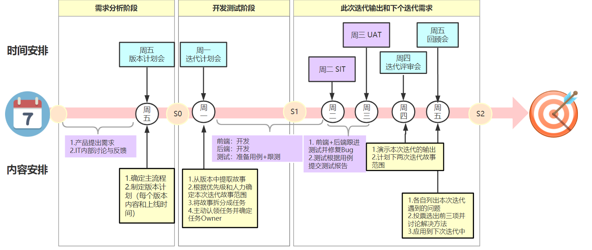
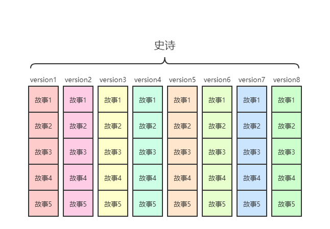

# 项目管理开发总结

每当一个新的项目或大的需求产生时，它就是一个史诗，对于这个史诗的开发要有节奏和规划，而不是一来就开发一个大而全的功能，这样常常是失败的。因为很有可以出现以下问题：

1. 需求理解错误：花费了人力物力，却开发了一个错误的东西。
2. 需求变化：需求时常是变化的，可能最初的需求是A，开发到一半时又变成了B，这时候出现了浪费。另外需求变化会导致最初以A需求进行设计的代码不能兼容B，最终越改越乱，导致代码难以维护，BUG频出，而不得不进行重构，进而影响项目的迭代计划。

为了解决上述问题，可以将一个史诗按版本划分，周期迭代。这样就可以很大程度上避免开发完成之后的需求理解错误的情况，以及需求变化的情形。那么它是如何做到的呢？

现在假设有一个史诗，将其拆分成一个一个的版本，如下图所示：

每个版本都是完整可用，这里的完整可用是指每个版本都包含了从头到尾的完整的必要流程，即包含了必不可少的核心流程。特别是第一个版本，开发的就是完整的核心流程。如此，在后续的迭代开发当中，可以反馈每一个版本的开发结果是否与预期一样，也可以及时反馈给客户，确认是否是客户想要的。

而每一个版本就可以再次将其拆分成一个一个的故事进行开发了。所以，当接到一个史诗之后的流程如下：

1. 史诗骨架规划
2. 版本划分
3. 迭代周期确定

## 周期迭代流程

敏捷开发，按周期迭代（迭代周期长度根据项目情况确定）。

假设每两星期为一个周期，流程如下：

1. 周一，迭代计划会，主要是确认当中周期需要迭代的内容
   1. 从版本中提取故事
   2. 根据优先级和人力确定本次迭代故事范围
   3. 将故事拆分成任务
   4. 任务分配或认领，并确定任务Owner。
2. 周二 - 周一：前后端开发及对接
   1. 后端发出预接口文档
   2. 后端开发、前端开发
   3. 前后对接
3. 周二 - 周三：owner跟进测试，并修复BUG。
4. 周四：发布SIT或UAT环境，
   1. 演示本次迭代输出（向领导，客户表功）
   2. 计划下两次迭代的故事，或下版本需求评审
5. 周五：
   1. 发布生产环境
   2. 列出本次迭代遇到的问题
   3. 投票选择前三项并讨论解决方法
   4. 问题应用到下次迭代中

## 会议4+1

### 每日早会

同步版本迭代进度，反馈遇到的问题。

### 版本迭代会

每个版本迭代开始的计划会议，主要完成以下几个目的：

1. 确定当前版本的迭代周期

### 迭代计划会

每次迭代周期开始的计划会议，主要完成以下几个目的：

1. 从版本中提取故事
2. 根据优先级和人力确定本次迭代故事范围
3. 将故事拆分成任务
4. 任务分配或认领，并确定任务Owner。
5. 其他

### 迭代评审会

每次迭代周期结束后的评会会议，，主要完成以下几个目的：

1. 列出本次迭代遇到的问题
2. 投票选择前三项并讨论解决方法
3. 问题应用到下次迭代中

### 回顾会