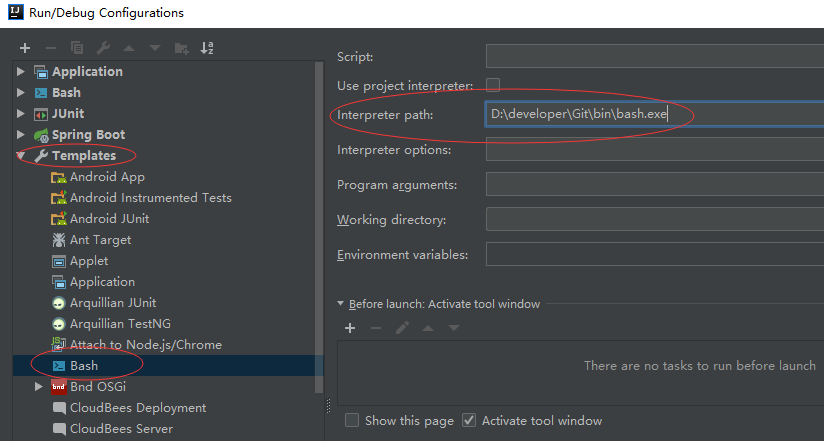
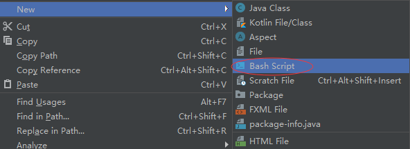
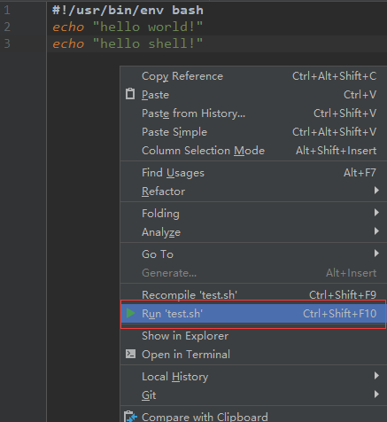
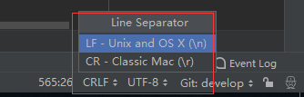

# Shell开发环境搭建

## 安装bashsupport插件

首先需要安装bashsupport插件，通过`File—Settings—Plugins—Browse respositories`搜索EmmyLua即可安装。

bashsupport官方网址：http://plugins.jetbrains.com/plugin/4230-bashsupport

bashsupport GitHup地址：https://github.com/BashSupport/BashSupport

## 安装git

git的安装方式这里不再描述，我们需要依赖git的bin/bash.exe文件去执行shell脚本。

## Intellij Idea配置Shell

在`Run`—`Edit Configurations`配置git的bash.exe可执行文件的路径，如下：



### 1.创建shell脚本

鼠标右键创建shell脚本即可



### 2.运行shell脚本

默认创建的shell脚本会包含如下内容：

```shell
#!/usr/bin/env bash
```

添加一些代码：

```shell
#!/usr/bin/env bash
echo "hello world!"
echo "hello shell!"
```

右键`Run 'xxx.sh'`即可运行:



控制台输出：

```shell
D:\developer\Git\bin\bash.exe D:\workspace\threes-server\threes\common\src\main\java\test.sh
hello world!
hello shell!
```

- `D:\developer\Git\bin\bash.exe`是git的bash.exe可执行文件的路径。
- `D:\workspace\threes-server\threes\common\src\main\java\test.sh`是shell脚本的路径。

### 3.配置shell脚本换行符

shell脚本编写好之后最终还是要放在Linux服务器上执行的，我们将前面创建编写的文件上传到Linux服务器执行行：

```shell
[root@localhost ~]# ./test.sh 
: 没有那个文件或目录
[root@localhost ~]# sh test.sh 
test.sh:行2: $'\r': 未找到命令
test.sh:行3: $'\r': 未找到命令
hello world!
hello shell!
```

首先先用`./`执行，提示`没有那个文件或目录`，再使用`sh`执行，虽然可以执行了，但是报错`$'\r': 未找到命令`，看到`\r`就应该知道是什么意思，这是换号符的问题，我们是在Windows环境开发的，默认使用的是Windows的换行符。

- Windows的换行符是：`\r\n`。

- Linux换行符是：`\n`

我们只需要将idea环境shell脚本的换行符设置为Linux的换行即可，如下（IDEA右下角）：



之后每次创建shell脚本时，bashsupport插件会自动帮助我们切换到`LF`换行符。

### 4.控制台中文乱码

有时候我们会在shell脚本中编写一下中文字符，但是在idea开发时，控制台输出的却是中文乱码，而上传到Linux服务器时输出的却是正常的。这是因为idea控台的默认编码并不是UTF-8，所以，只需要将其设置为UTF-8即可。

配置方式：

在IDEA的安装目录`xxx\JetBrains\IntelliJ IDEA 2018.2\bin`目录下找到`idea.exe.vmoptions`和`idea64.exe.vmoptions`文件，在最后一行添加`-Dfile.encoding=UTF-8`即可。

 