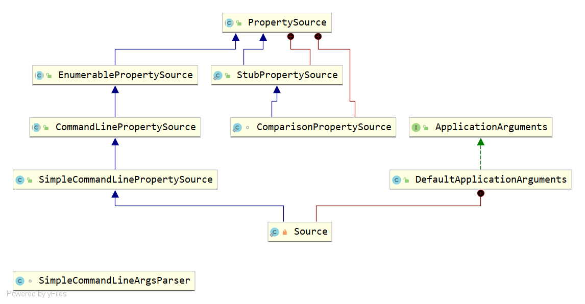
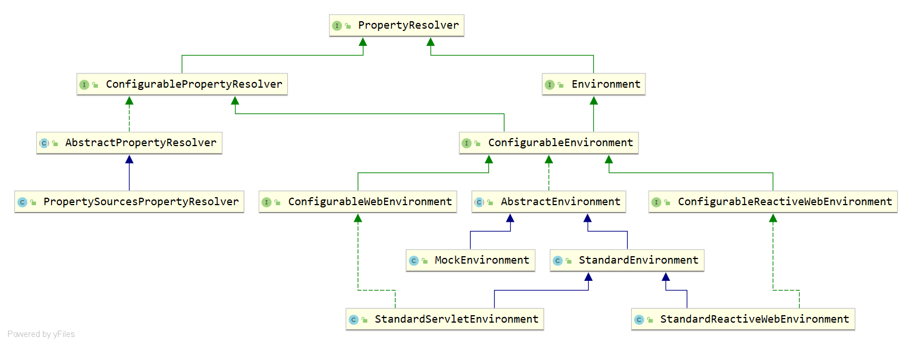

# nonOptionArgsSpring Boot源码分析

起步依赖starter

自动配置autoconfigure

外部化置

actuator

configuration-processor

dev-tool


## SpringApplicationRunListener

`SpringApplicationRunListener`是用于监听`SpringApplication#run()`方法运行的监听器，每当`run()`方法运行一个阶段时，就会执行对应的方法。

`SpringApplicationRunListener`源码如下：

```java
package org.springframework.boot;

import org.springframework.context.ApplicationContext;
import org.springframework.context.ConfigurableApplicationContext;
import org.springframework.core.env.ConfigurableEnvironment;
import org.springframework.core.io.support.SpringFactoriesLoader;

/**
 * @since 1.0.0
 */
public interface SpringApplicationRunListener {

	default void starting(ConfigurableBootstrapContext bootstrapContext) {
		starting();
	}

	/**
	 * @deprecated since 2.4.0 in favor of {@link #starting(ConfigurableBootstrapContext)}
	 */
	@Deprecated
	default void starting() {}

	default void environmentPrepared(ConfigurableBootstrapContext bootstrapContext,
			ConfigurableEnvironment environment) {
		environmentPrepared(environment);
	}

	/**
	 * @deprecated since 2.4.0 in favor of
	 */
	@Deprecated
	default void environmentPrepared(ConfigurableEnvironment environment) {}

	default void contextPrepared(ConfigurableApplicationContext context) {}

	default void contextLoaded(ConfigurableApplicationContext context) {}

	/**
	 * @since 2.0.0
	 */
	default void started(ConfigurableApplicationContext context) {}

	/**
	 * @since 2.0.0
	 */
	default void running(ConfigurableApplicationContext context) {}

	/**
	 * @since 2.0.0
	 */
	default void failed(ConfigurableApplicationContext context, Throwable exception) {}
}

```

`SpringApplicationRunListener`包含7个方法（其中有2个已经在2.4.0版本废弃），分别如下：

- `starting`：首次启动run方法时立即调用。可用于非常早期的初始化。
- `environmentPrepared`：准备好环境（Environment构建完成），但在创建ApplicationContext之前调用。
- `contextPrepared`：在创建和构建ApplicationContext之后，但在加载之前调用。
- `contextLoaded`：ApplicationContext已加载但在刷新之前调用。
- `started`：ApplicationContext已刷新，应用程序已启动，但尚未调用CommandLineRunners和ApplicationRunners。
- `running`：在运行方法彻底完成之前立即调用，刷新ApplicationContext并调用所有CommandLineRunners和ApplicationRunner。
- `failed`：在运行应用程序时失败时调用。

> `started`、`running`和`failed`是在Spring boot 2.0.0添加的。

接再来在看一下SpringApplication类中是如何获取`SpringApplicationRunListener`的，相关代码如下：

```java
private SpringApplicationRunListeners getRunListeners(String[] args) {
    Class<?>[] types = new Class<?>[] { SpringApplication.class, String[].class };
    return new SpringApplicationRunListeners(logger,
                                             getSpringFactoriesInstances(SpringApplicationRunListener.class, types, this, args),
                                             this.applicationStartup);
}
```

可以看到，也是通过getSpringFactoriesInstances方法获取，只是有一点特别的地方是，将所有获取的SpringApplicationRunListener包装为了一个SpringApplicationRunListeners对象


```java
class SpringApplicationRunListeners {

	private final Log log;

	private final List<SpringApplicationRunListener> listeners;

	private final ApplicationStartup applicationStartup;

	SpringApplicationRunListeners(Log log, Collection<? extends SpringApplicationRunListener> listeners,
			ApplicationStartup applicationStartup) {
		this.log = log;
		this.listeners = new ArrayList<>(listeners);
		this.applicationStartup = applicationStartup;
	}

	void starting(ConfigurableBootstrapContext bootstrapContext, Class<?> mainApplicationClass) {
		doWithListeners("spring.boot.application.starting", (listener) -> listener.starting(bootstrapContext),
				(step) -> {
					if (mainApplicationClass != null) {
						step.tag("mainApplicationClass", mainApplicationClass.getName());
					}
				});
	}

	void environmentPrepared(ConfigurableBootstrapContext bootstrapContext, ConfigurableEnvironment environment) {
		doWithListeners("spring.boot.application.environment-prepared",
				(listener) -> listener.environmentPrepared(bootstrapContext, environment));
	}

	void contextPrepared(ConfigurableApplicationContext context) {
		doWithListeners("spring.boot.application.context-prepared", (listener) -> listener.contextPrepared(context));
	}

	void contextLoaded(ConfigurableApplicationContext context) {
		doWithListeners("spring.boot.application.context-loaded", (listener) -> listener.contextLoaded(context));
	}

	void started(ConfigurableApplicationContext context) {
		doWithListeners("spring.boot.application.started", (listener) -> listener.started(context));
	}

	void running(ConfigurableApplicationContext context) {
		doWithListeners("spring.boot.application.running", (listener) -> listener.running(context));
	}

	void failed(ConfigurableApplicationContext context, Throwable exception) {
		doWithListeners("spring.boot.application.failed",
				(listener) -> callFailedListener(listener, context, exception), (step) -> {
					step.tag("exception", exception.getClass().toString());
					step.tag("message", exception.getMessage());
				});
	}

	private void callFailedListener(SpringApplicationRunListener listener, ConfigurableApplicationContext context,
			Throwable exception) {
		try {
			listener.failed(context, exception);
		}
		catch (Throwable ex) {
			if (exception == null) {
				ReflectionUtils.rethrowRuntimeException(ex);
			}
			if (this.log.isDebugEnabled()) {
				this.log.error("Error handling failed", ex);
			}
			else {
				String message = ex.getMessage();
				message = (message != null) ? message : "no error message";
				this.log.warn("Error handling failed (" + message + ")");
			}
		}
	}

	private void doWithListeners(String stepName, Consumer<SpringApplicationRunListener> listenerAction) {
		doWithListeners(stepName, listenerAction, null);
	}

	private void doWithListeners(String stepName, Consumer<SpringApplicationRunListener> listenerAction,
			Consumer<StartupStep> stepAction) {
		StartupStep step = this.applicationStartup.start(stepName);
		this.listeners.forEach(listenerAction);
		if (stepAction != null) {
			stepAction.accept(step);
		}
		step.end();
	}

}

```

通过构造将所有的SpringApplicationRunListener存储在了其成员变量listeners中，在SpringApplicationRunListeners中也一样有SpringApplicationRunListener中的七个方法，这七个方法都调用了doWithListeners方法。doWithListeners方法的实现非常简单，就是通过forEach迭代调用有的SpringApplicationRunListener。


在理解了SpringApplicationRunListener之后，就可以实现自定义的SpringApplicationRunListener，根据上面的特性，我们只需要实现自己的SpringApplicationRunListener，并将其配置classpath下的META-INF/spring.factories文件中。

自定义SpringApplicationRunListener：

```java
package com.fq.jinyu.controller;

import org.springframework.boot.ConfigurableBootstrapContext;
import org.springframework.boot.SpringApplicationRunListener;
import org.springframework.context.ConfigurableApplicationContext;
import org.springframework.core.env.ConfigurableEnvironment;

public class CustomSpringApplicationRunListener implements SpringApplicationRunListener {

    @Override
    public void starting(ConfigurableBootstrapContext bootstrapContext) {
        System.out.println("custom starting...");
    }

    @Override
    public void environmentPrepared(ConfigurableBootstrapContext bootstrapContext, ConfigurableEnvironment environment) {
        System.out.println("custom starting...");
    }

    @Override
    public void contextPrepared(ConfigurableApplicationContext context) {
        System.out.println("custom starting...");
    }

    @Override
    public void contextLoaded(ConfigurableApplicationContext context) {
        System.out.println("custom starting...");
    }

    @Override
    public void started(ConfigurableApplicationContext context) {
        System.out.println("custom starting...");
    }

    @Override
    public void running(ConfigurableApplicationContext context) {
        System.out.println("custom starting...");
    }

    @Override
    public void failed(ConfigurableApplicationContext context, Throwable exception) {
        System.out.println("custom starting...");
    }
}
```

配置在`META-INF/spring.factories`文件中：

```properties
# Run Listeners
org.springframework.boot.SpringApplicationRunListener=\
	org.springframework.boot.context.event.EventPublishingRunListener
	com.fq.jinyu.controller.CustomSpringApplicationRunListener
```

------

现在再来看一下Spring boot为SpringApplicationRunListener所提供的实现，通过查看源码，发现，在Spring boot当中，只有一个实现，即EventPublishingRunListener：

```java
package org.springframework.boot.context.event;
......
public class EventPublishingRunListener implements SpringApplicationRunListener, Ordered {

	private final SpringApplication application;

	private final String[] args;

	private final SimpleApplicationEventMulticaster initialMulticaster;

	public EventPublishingRunListener(SpringApplication application, String[] args) {
		this.application = application;
		this.args = args;
		this.initialMulticaster = new SimpleApplicationEventMulticaster();
		for (ApplicationListener<?> listener : application.getListeners()) {
			this.initialMulticaster.addApplicationListener(listener);
		}
	}

	@Override
	public int getOrder() {
		return 0;
	}

	@Override
	public void starting(ConfigurableBootstrapContext bootstrapContext) {
		this.initialMulticaster
				.multicastEvent(new ApplicationStartingEvent(bootstrapContext, this.application, this.args));
	}

	@Override
	public void environmentPrepared(ConfigurableBootstrapContext bootstrapContext,
			ConfigurableEnvironment environment) {
		this.initialMulticaster.multicastEvent(
				new ApplicationEnvironmentPreparedEvent(bootstrapContext, this.application, this.args, environment));
	}

	@Override
	public void contextPrepared(ConfigurableApplicationContext context) {
		this.initialMulticaster
				.multicastEvent(new ApplicationContextInitializedEvent(this.application, this.args, context));
	}

	@Override
	public void contextLoaded(ConfigurableApplicationContext context) {
		for (ApplicationListener<?> listener : this.application.getListeners()) {
			if (listener instanceof ApplicationContextAware) {
				((ApplicationContextAware) listener).setApplicationContext(context);
			}
			context.addApplicationListener(listener);
		}
		this.initialMulticaster.multicastEvent(new ApplicationPreparedEvent(this.application, this.args, context));
	}

	@Override
	public void started(ConfigurableApplicationContext context) {
		context.publishEvent(new ApplicationStartedEvent(this.application, this.args, context));
		AvailabilityChangeEvent.publish(context, LivenessState.CORRECT);
	}

	@Override
	public void running(ConfigurableApplicationContext context) {
		context.publishEvent(new ApplicationReadyEvent(this.application, this.args, context));
		AvailabilityChangeEvent.publish(context, ReadinessState.ACCEPTING_TRAFFIC);
	}

	@Override
	public void failed(ConfigurableApplicationContext context, Throwable exception) {
		ApplicationFailedEvent event = new ApplicationFailedEvent(this.application, this.args, context, exception);
		if (context != null && context.isActive()) {
			// Listeners have been registered to the application context so we should
			// use it at this point if we can
			context.publishEvent(event);
		}
		else {
			// An inactive context may not have a multicaster so we use our multicaster to
			// call all of the context's listeners instead
			if (context instanceof AbstractApplicationContext) {
				for (ApplicationListener<?> listener : ((AbstractApplicationContext) context)
						.getApplicationListeners()) {
					this.initialMulticaster.addApplicationListener(listener);
				}
			}
			this.initialMulticaster.setErrorHandler(new LoggingErrorHandler());
			this.initialMulticaster.multicastEvent(event);
		}
	}

	private static class LoggingErrorHandler implements ErrorHandler {

		private static final Log logger = LogFactory.getLog(EventPublishingRunListener.class);

		@Override
		public void handleError(Throwable throwable) {
			logger.warn("Error calling ApplicationEventListener", throwable);
		}
	}
}
```

他的启动注册配置在`org.springframework.boot:spring-boot`包中。

```properties
# Run Listeners
org.springframework.boot.SpringApplicationRunListener=\
	org.springframework.boot.context.event.EventPublishingRunListener
```

它的作用也很明显，就是在SpringApplication运行的不同阶段，发布相应的事件，而我们通过监听这个事件，就可以实现自己的扩展操作。实际上Spring-boot的大部分增强操作，包括一些基于Spring-boot构建的类库，都是通过监听这些事件完成的，后面讲到监听器时会说到这一点。

运行阶段与事件对应关系：

| 阶段                | 事件                                |
| ------------------- | ----------------------------------- |
| starting            | ApplicationStartingEvent            |
| environmentPrepared | ApplicationEnvironmentPreparedEvent |
| contextPrepared     | ApplicationContextInitializedEvent  |
| contextLoaded       | ApplicationPreparedEvent            |
| started             | ApplicationStartedEvent             |
| running             | ApplicationReadyEvent               |
| failed              | ApplicationFailedEvent              |

## ApplicationListener

前面已经讲了，SpringApplicationRunListener主要是通过Spring事件机制触发响应的事件，可以确定的是，SpringApplication通过定义监听这些事件的监听器，完成了很多工作，那么在SpringApplication是如何去获取这些监听器的呢？

还是一样的方式，在SpringApplication的构造器中通过getSpringFactoriesInstances方法获取，代码如下：

```java
public class SpringApplication {
    ......
    private List<ApplicationListener<?>> listeners;
	......
    public SpringApplication(ResourceLoader resourceLoader, Class<?>... primarySources) {
        ......
        setListeners((Collection) getSpringFactoriesInstances(ApplicationListener.class));
        ......
    }
	......
    public void setListeners(Collection<? extends ApplicationListener<?>> listeners) {
        this.listeners = new ArrayList<>(listeners);
    }
    ......
}
```

在SpringApplication中仅仅包含ApplicationListener的获取和设置，但仅仅获取是不够的，还需要将其注册到ApplicationContext当中以及Spring-boot的事件广播器当中。而这个工作就是EventPublishingRunListener类中完成，如下：

```java
package org.springframework.boot.context.event;
......
public class EventPublishingRunListener implements SpringApplicationRunListener, Ordered {

	private final SpringApplication application;

	private final String[] args;

	private final SimpleApplicationEventMulticaster initialMulticaster;

	public EventPublishingRunListener(SpringApplication application, String[] args) {
		this.application = application;
		this.args = args;
		this.initialMulticaster = new SimpleApplicationEventMulticaster();
		for (ApplicationListener<?> listener : application.getListeners()) {
			this.initialMulticaster.addApplicationListener(listener);
		}
	}

	......

	@Override
	public void contextLoaded(ConfigurableApplicationContext context) {
		for (ApplicationListener<?> listener : this.application.getListeners()) {
			if (listener instanceof ApplicationContextAware) {
				((ApplicationContextAware) listener).setApplicationContext(context);
			}
			context.addApplicationListener(listener);
		}
		this.initialMulticaster.multicastEvent(new ApplicationPreparedEvent(this.application, this.args, context));
	}

	......
}
```

在EventPublishingRunListener的构造器中，将监听器注册到了Spring-boot的事件广播器当中，在contextLoaded阶段，将监听器注册到ApplicationContext。

> 为什么要声明Spring-boot的事件广播器，并注册监听器？
>
> 通过Spring-boot启动ApplicationContext，在启动之间就需要通过SpringApplicationRunListener进行监听，而SpringApplicationRunListener又是通过发布ApplicationEvent事件触发响应的监听器，但在contextLoaded阶段之前，ApplicationContext是还没有被启动的，是不能通过ApplicationContext内部的事件广播器进行触发事件，因此在EventPublishingRunListener中声明了一个自己的。

Spring Boot内置监听器

通过查看spring-boot和spring-boot-autoconfigure包的`META-INF/spring.factories`文件，定义了如下监听器。

*spring-boot - META-INF/spring.factories：*

```properties
# Application Listeners
org.springframework.context.ApplicationListener=\
    org.springframework.boot.ClearCachesApplicationListener,\
    org.springframework.boot.builder.ParentContextCloserApplicationListener,\
    org.springframework.boot.context.FileEncodingApplicationListener,\
    org.springframework.boot.context.config.AnsiOutputApplicationListener,\
    org.springframework.boot.context.config.DelegatingApplicationListener,\
    org.springframework.boot.context.logging.LoggingApplicationListener,\
    org.springframework.boot.env.EnvironmentPostProcessorApplicationListener,\
    org.springframework.boot.liquibase.LiquibaseServiceLocatorApplicationListener
```

*spring-boot-autoconfigure - META-INF/spring.factories：*

```properties
# Application Listeners
org.springframework.context.ApplicationListener=\
	org.springframework.boot.autoconfigure.BackgroundPreinitializer
```

简单说明：

1. `ClearCachesApplicationListener`：应用上下文加载完成后对缓存做清除工作。

   **监听的是ContextRefreshedEvent事件**

2. `ParentContextCloserApplicationListener`：监听双亲应用上下文的关闭事件并往自己的子应用上下文中传播

   **监听的是ParentContextAvailableEvent事件**

3. `FileEncodingApplicationListener`：检测系统文件编码与应用环境编码是否一致，如果系统文件编码和应用环境的编码不同则终止应用启动。

   **监听的是ApplicationEnvironmentPreparedEvent事件**

4. `AnsiOutputApplicationListener`：根据 `spring.output.ansi.enabled` 参数配置 AnsiOutput。

   **监听的是ApplicationEnvironmentPreparedEvent事件**

5. `DelegatingApplicationListener`：监听到事件后转发给 `application.properties` 中配置的 `context.listener.classes` 的监听器。

   **监听的是ApplicationEvent事件**

6. `LoggingApplicationListener`：配置 `LoggingSystem`。使用 `logging.config` 环境变量指定的配置或者缺省配置。

   **监听的是ApplicationEvent事件**

7. `EnvironmentPostProcessorApplicationListener`：SmartApplicationListener用于触发在spring.factories文件中注册的EnvironmentPostProcessors。

   **监听的是ApplicationEvent事件**

8. `LiquibaseServiceLocatorApplicationListener`：使用一个可以和 SpringBoot 可执行jar包配合工作的版本替换 LiquibaseServiceLocator。

   **监听的是ApplicationStartingEvent事件**

9. `BackgroundPreinitializer`：在耗时任务的后台线程中触发早期初始化的ApplicationListener。

   将IGNORE_BACKGROUNDPREINITIALIZER_PROPERTY_NAME系统属性设置为true，以禁用此机制，并让这样的初始化发生在前台。

   ```java
   public static final String IGNORE_BACKGROUNDPREINITIALIZER_PROPERTY_NAME = "spring.backgroundpreinitializer.ignore";
   ```
   **监听的是SpringApplicationEvent事件**


## ApplicationContextInitializer

ApplicationContextInitializer是Spring ConfigurableApplicationContext在刷新之前的初始化回调接口。

通常在需要对应用程序上下文进行某些编程初始化的Web应用程序中使用。例如，根据上下文环境注册属性源或激活配置文件。请参阅 `ContextLoader` 和`FrameworkServlet` 支持，分别声明 `"contextInitializerClasses"` 的 context-param 和 init-param。

鼓励 `ApplicationContextInitializer` 处理器检测是否已实现Spring的 `Ordered` 接口，或者是否标注了 `@Order` 注解，并在调用之前相应地对实例进行排序。
Since:
3.1
See Also:
org.springframework.web.context.ContextLoader.customizeContext, org.springframework.web.context.ContextLoader.CONTEXT_INITIALIZER_CLASSES_PARAM, org.springframework.web.servlet.FrameworkServlet.setContextInitializerClasses, org.springframework.web.servlet.FrameworkServlet.applyInitializers


在Spring-boot中，ApplicationContextInitializer相关的初始化操作是定义在SpringApplication中，代码如下：

```java
public class SpringApplication {
    private List<ApplicationListener<?>> listeners;

    public SpringApplication(ResourceLoader resourceLoader, Class<?>... primarySources) {
        ......
        setInitializers((Collection) getSpringFactoriesInstances(ApplicationContextInitializer.class));
        ......
    }

    private void prepareContext(DefaultBootstrapContext bootstrapContext, ConfigurableApplicationContext context,ConfigurableEnvironment environment, SpringApplicationRunListeners listeners,
                ApplicationArguments applicationArguments, Banner printedBanner) {
        ......
        applyInitializers(context);
        ......
    }

    protected void applyInitializers(ConfigurableApplicationContext context) {
        for (ApplicationContextInitializer initializer : getInitializers()) {
            Class<?> requiredType = GenericTypeResolver.resolveTypeArgument(initializer.getClass(),
                                             ApplicationContextInitializer.class);
            Assert.isInstanceOf(requiredType, context, "Unable to call initializer.");
            initializer.initialize(context);
        }
    }

    public Set<ApplicationContextInitializer<?>> getInitializers() {
        return asUnmodifiableOrderedSet(this.initializers);
    }

    public void setListeners(Collection<? extends ApplicationListener<?>> listeners) {
        this.listeners = new ArrayList<>(listeners);
    }

    public void addListeners(ApplicationListener<?>... listeners) {
        this.listeners.addAll(Arrays.asList(listeners));
    }
}
```

同样的方式，内置了一些初始化器，通过getSpringFactoriesInstances方法获取。在准备应用上下文阶段（prepareContext）调用applyInitializers执行初始化，其操作方式就是迭代所有的初始化器，依次调用其initialize方法。

Spring-boot提供了三种方式用于注册自定义的ApplicationContextInitializer：

首先定义一个自定义的ApplicationContextInitializer。

```java
package com.fq.jinyu.controller;

import org.springframework.context.ApplicationContextInitializer;
import org.springframework.context.ConfigurableApplicationContext;

public class CustomApplicationContextInitializer implements ApplicationContextInitializer<ConfigurableApplicationContext> {

    @Override
    public void initialize(ConfigurableApplicationContext applicationContext) {
        System.out.println("custom application context initializer...");
    }
}
```

1. 调用addListeners方法添加

   在main方法中直接调用addInitializers方法添加即可，示例如下：

   ```java
   public static void main(String[] args) {
       SpringApplication springApplication = new SpringApplication(JinyuApplication.class);
       springApplication.addInitializers(new CustomApplicationContextInitializer());
       springApplication.run(args);
   }
   ```

2. application.properties配置文件配置

   Spring-boot内置的ApplicationContextInitializer - DelegatingApplicationContextInitializer提供了context.initializer.classes属性，让我们可以在配置文件上配置（多个initializer通过逗号分隔），示例如下：

   ```properties
   context.initializer.classes=\
     com.fq.jinyu.controller.CustomApplicationContextInitializer,\
     com.fq.jinyu.controller.CustomApplicationContextInitializer,\
     com.fq.jinyu.controller.CustomApplicationContextInitializer
   ```

3. 自动装配META-INF/spring.factories

   最后一种方式就是自动装配了，在类路径下创建META-INF/spring.factories文件，声明以下内容：

   ```properties
   org.springframework.context.ApplicationContextInitializer=\
       com.fq.jinyu.controller.CustomApplicationContextInitializer,\
   ```

**Spring-boot内置的ApplicationContextInitializer**

通过查看spring-boot和spring-boot-autoconfigure包的`META-INF/spring.factories`文件，定义了如下初始化器。

*spring-boot - META-INF/spring.factories：*

```properties
# Application Context Initializers
org.springframework.context.ApplicationContextInitializer=\
    org.springframework.boot.context.ConfigurationWarningsApplicationContextInitializer,\
    org.springframework.boot.context.ContextIdApplicationContextInitializer,\
    org.springframework.boot.context.config.DelegatingApplicationContextInitializer,\
    org.springframework.boot.rsocket.context.RSocketPortInfoApplicationContextInitializer,\
    org.springframework.boot.web.context.ServerPortInfoApplicationContextInitializer
```

*spring-boot-autoconfigure - META-INF/spring.factories：*

```properties
# Initializers
org.springframework.context.ApplicationContextInitializer=\
    org.springframework.boot.autoconfigure.SharedMetadataReaderFactoryContextInitializer,\
    org.springframework.boot.autoconfigure.logging.ConditionEvaluationReportLoggingListener
```

简单说明：


- `ConfigurationWarningsApplicationContextInitializer`：报告IOC容器的一些常见的错误配置
- `ContextIdApplicationContextInitializer`：设置Spring应用上下文的ID
- `DelegatingApplicationContextInitializer`：加载 `application.properties` 中 `context.initializer.classes` 配置的类
- `RSocketPortInfoApplicationContextInitializer`：
- `ServerPortInfoApplicationContextInitializer`：将内置servlet容器实际使用的监听端口写入到 `Environment` 环境属性中
- `SharedMetadataReaderFactoryContextInitializer`：创建一个 SpringBoot 和 `ConfigurationClassPostProcessor` 共用的 `CachingMetadataReaderFactory` 对象
- `ConditionEvaluationReportLoggingListener`：将 `ConditionEvaluationReport` 写入日志


## StopWatch

StopWatch类的注释是如下描述的：

简单的秒表，允许对许多任务进行计时，暴露每个指定任务的总运行时间和运行时间。

隐藏System.nanoTime()的使用，提高应用程序代码的可读性，减少计算错误的可能性。

注意，此对象不是设计为线程安全的，也不使用同步。

该类通常用于在概念验证工作期间和开发中验证性能，而不是作为生产应用程序的一部分。

从Spring Framework 5.2开始，运行时间以纳秒为单位进行跟踪和报告。

------

简单的说，他就是一个计时器工具，类似于下面的代码功能：

```java
public static void main(String[] args) {
    var startTimeNanos = System.nanoTime();
    // running ...
    System.out.println(System.nanoTime() - startTimeNanos); 
}
```

只是StopWatch将这个过程通过封装起来，隐藏类内部的计算转换等工作，只需要在运行前调用start()方法，运行结束后调用stop()方法，最终的各种计时信息都在StopWatch中，只需要获取即可。例如：

```java
public static void main(String[] args) {
    StopWatch stopWatch = new StopWatch();
    stopWatch.start();
    // running ...
    stopWatch.stop();
    System.out.println(stopWatch.getTotalTimeMillis());
}
```

StopWatch主要的核心方法是start()和stop()，它们的实现很简单，这里就不在列举，主要说明一下里面包含的成员变量。

```java
public class StopWatch {

	/**
	 * 当前StopWatch的标识符。
	 * 当有多个StopWatch时，需要在日志或控制台输出中区分它们时，很方便。
	 */
	private final String id;
	
    /** 是否保持任务信息，默认为true（即每个任务信息[TaskInfo]是否要往taskList中存） */
	private boolean keepTaskList = true;

    /** 每个任务的任务信息 */
	private final List<TaskInfo> taskList = new ArrayList<>(1);

	/** 当前任务的开始时间，在调用start()方法时会设置 */
	private long startTimeNanos;

	/** 当前任务的名称 */
	@Nullable
	private String currentTaskName;

    /** StopWatch的内部类，即当前任务信息，只包含两个信息：当前任务的名称和执行的总时间*/
	@Nullable
	private TaskInfo lastTaskInfo;

    /** 当前任务的数量，每调用一次stop()方法就会+1 */
	private int taskCount;

	/** 运行的总时间，会在调动stop()方法时加总 */
	private long totalTimeNanos;
}
```

另外还要说明一下的是，在StopWatch包含两个输出方法，分别是`prettyPrint()`和`toString()`，输出和运行时间和每个任务的运行时间的百分比。

```java
public class StopWatch {
	......
	public String prettyPrint() {
		......
	}
	......
	@Override
	public String toString() {
		......
	}
	......
}
```

示例

```java
public static void main(String[] args) {
    StopWatch stopWatch = new StopWatch("Identifier");
    stopWatch.start("task1");
    // running ...
    stopWatch.stop();
    System.out.println(stopWatch.prettyPrint());
    System.out.println(stopWatch.toString());

    System.out.println("#############################################");

    stopWatch.start("task2");
    // running ...
    stopWatch.stop();
    System.out.println(stopWatch.prettyPrint());
    System.out.println(stopWatch.toString());
}
```

输出结果

```
StopWatch 'Identifier': running time = 2300 ns
---------------------------------------------
ns         %     Task name
---------------------------------------------
000002300  100%  task1

StopWatch 'Identifier': running time = 2300 ns; [task1] took 2300 ns = 100%

##############################################

StopWatch 'Identifier': running time = 2700 ns
---------------------------------------------
ns         %     Task name
---------------------------------------------
000002300  085%  task1
000000400  015%  task2

StopWatch 'Identifier': running time = 2700 ns; [task1] took 2300 ns = 85%; [task2] took 400 ns = 15%
```


## ApplicationArguments

提供了对Spring应用程序的运行时的参数参访，简单的说，就是提供了对Spring-boot启动时通过命令行传递到main方法args参数的封装。

源码如下：

```java
public interface ApplicationArguments {
    String[] getSourceArgs();

    Set<String> getOptionNames();

    boolean containsOption(String name);

    List<String> getOptionValues(String name);

    List<String> getNonOptionArgs();
}
```

这个需要说明一下的是，参数的类型，有Source，Option，NonOption：

- Source：表示参数源，即参数原来是什么样子，现在就是什么样子，而对于Option和NonOption来说，都是解析过的参数。
- Option：表示以“--”开头的命令行参数，例如“--spring.profile.actives=dev”。
- NonOption：表示不以“”“--”开头的命令行参数，例如“flag”。

在Spring-boot中，只有一个对于ApplicationArguments的默认实现DefaultApplicationArguments，源码如下：

```java
/**
 * @since 1.4.1
 */
public class DefaultApplicationArguments implements ApplicationArguments {

	private final Source source;

	private final String[] args;

	public DefaultApplicationArguments(String... args) {
		Assert.notNull(args, "Args must not be null");
		this.source = new Source(args);
		this.args = args;
	}

	......

	private static class Source extends SimpleCommandLinePropertySource {

		Source(String[] args) {
			super(args);
		}

		@Override
		public List<String> getNonOptionArgs() {
			return super.getNonOptionArgs();
		}

		@Override
		public List<String> getOptionValues(String name) {
			return super.getOptionValues(name);
		}

	}
}
```

DefaultApplicationArguments实现了ApplicationArguments的所有抽象方法，但实际上，对于命令行参数的解析存储工作却并没有在DefaultApplicationArguments中完成，而是交由其内部类Source，ApplicationArguments只是起了一个代理访问的作用，它们之间的关系类图如下：



离开Source进入到SimpleCommandLinePropertySource，CommandLinePropertySource，EnumerablePropertySource就会发现这些类不在是属于Spring-boot的了，而是在Spring 3.1版本就已经提供。

参数的解析工作是在SimpleCommandLinePropertySource类的构造方法中访问，具体的工作却是交由SimpleCommandLineArgsParser类完成，源码如下：

```java
/**
 * @since 3.1
 */
public class SimpleCommandLinePropertySource extends CommandLinePropertySource<CommandLineArgs> {

	public SimpleCommandLinePropertySource(String... args) {
		super(new SimpleCommandLineArgsParser().parse(args));
	}

	public SimpleCommandLinePropertySource(String name, String[] args) {
		super(name, new SimpleCommandLineArgsParser().parse(args));
	}
	......
}
```

在SimpleCommandLineArgsParser中，只有一个方法，即parse()，解析工作就是由它完。再具体看它的实现之前需要说明一下，命令行的参数解析完成之后都被包装成了一个CommandLineArgs对象：

```java
class CommandLineArgs {
    private final Map<String, List<String>> optionArgs = new HashMap();
    private final List<String> nonOptionArgs = new ArrayList();
    ......
}
```

CommandLineArgs中包含两个成员变量：

- optionArgs：存储以“--”开头的命令行参数。
- nonOptionArgs：存储不以“”“--”开头的命令行参数。

来看看SimpleCommandLineArgsParser的实现：

```java
/**
 * @since 3.1
 */
class SimpleCommandLineArgsParser {

	public CommandLineArgs parse(String... args) {
        //创建一个CommandLineArgs
		CommandLineArgs commandLineArgs = new CommandLineArgs();
        //迭代所有命令行参数
		for (String arg : args) {
            //如果命令行参数以"--"开头
			if (arg.startsWith("--")) {
                //通过substring函数去掉前面的"--"两个字符
				String optionText = arg.substring(2);
				String optionName;
				String optionValue = null;
                //通过indexOf函数查找'='字符
				int indexOfEqualsSign = optionText.indexOf('=');
                //找到了 — 是一个键值对参数，截取分别设置为键和值
				if (indexOfEqualsSign > -1) {
					optionName = optionText.substring(0, indexOfEqualsSign);
					optionValue = optionText.substring(indexOfEqualsSign + 1);
				}
				else {
                    //没有找到，设置为键，值自然就为null了
					optionName = optionText;
				}
				if (optionName.isEmpty()) {
					throw new IllegalArgumentException("Invalid argument syntax: " + arg);
				}
                //添加到optionArgs中
				commandLineArgs.addOptionArg(optionName, optionValue);
			}
            //反之，命令行参数不是以"--"开头
			else {
                //直接添加到nonOptionArgs中
				commandLineArgs.addNonOptionArg(arg);
			}
		}
		return commandLineArgs;
	}
}
```


## Environment

Environment表示当前应用运行环境的接口，主要包括两个方面：**profile** 和 **properties**

**properties**就是相关环境的配置属性，例如属性文件，JVM系统属性，系统环境变量，JNDI，ServletContext 参数，临时属性对象，Map等。

**profile** 可以理解为表示对**properties**的分组，例如，在我们的应用程序中不同的环境的配置属性是不同的，通过**profile** 就可以将不同的环境分为不同的组进行应用。

下面是Environment接口的注释描述：

> 表示当前应用程序正在其中运行的环境的接口。它为应用环境制定了两个关键的方面：**profile** 和 **properties**。与属性访问有关的方法通过 `PropertyResolver` 这个父接口公开。
>
> profile机制保证了仅在给定 profile 处于激活状态时，才向容器注册的Bean定义的命名逻辑组。无论是用XML定义还是通过注解定义，都可以将Bean分配给指定的 profile。有关语法的详细信息，请参见`spring-beans 3.1规范文档` 或 `@Profile` 注解。Environment 的作用是决定当前哪些配置文件（如果有）处于活动状态，以及默认情况下哪些配置文件（如果有）应处于活动状态。
>
> `Properties` 在几乎所有应用程序中都起着重要作用，并且可能来源自多种途径：属性文件，JVM系统属性，系统环境变量，JNDI，ServletContext 参数，临时属性对象，Map等。`Environment` 与 `Properties` 的关系是为用户提供方便的服务接口，以配置属性源，并从中解析属性值。
>
> 在 `ApplicationContext` 中管理的Bean可以注册为 `EnvironmentAware` 或使用 `@Inject` 标注在 Environment 上，以便直接查询profile的状态或解析 `Properties`。
>
> 但是，在大多数情况下，应用程序级Bean不必直接与 Environment 交互，而是通过将${...}属性值替换为属性占位符配置器进行属性注入（例如 `PropertySourcesPlaceholderConfigurer`），该属性本身是 `EnvironmentAware`，当配置了 `<context:property-placeholder/>` 时，默认情况下会使用Spring 3.1的规范注册。
>
> 必须通过从所有 `AbstractApplicationContext` 子类的 `getEnvironment()` 方法返回的 `ConfigurableEnvironment` 接口完成环境对象的配置。请参阅 `ConfigurableEnvironment` 的Javadoc以获取使用示例，这些示例演示在应用程序上下文 `refresh()` 方法被调用之前对属性源进行的操作。


Environment有一个类的实现和继承体系，整理的类图如下：



Environment接口代表了不同环境的抽象，主要是对**profile**管控，不参与其属性的管理，属性的管理主要是由 `PropertyResolver` 这个父接口进行管理。

Environment接口源码如下：

```java
public interface Environment extends PropertyResolver {
	String[] getActiveProfiles();
	String[] getDefaultProfiles();
	@Deprecated
	boolean acceptsProfiles(String... profiles);
	boolean acceptsProfiles(Profiles profiles);
}
```

Environment接口中定义了4个抽象方法，分别是：

- `getActiveProfiles`：返回当前环境的Profile集合，Profile可以通过系统属性`spring.profiles.active`进行设置，或者通过调用`ConfigurableEnvironment#setActiveProfiles(String...)`进行设置。如果没有显示的指定，则将使用默认的Profile。
- `getDefaultProfiles`：当没有显示设置Profile时，返回默认的Profile。
- `acceptsProfiles`：判断给定的一个或多个Profile是否是激活的，
- `acceptsProfiles`：

返回给定概要文件中的一个或多个是活动的，或者在没有显式活动概要文件的情况下，给定概要文件中的一个或多个是否包含在默认概要文件集合中。如果配置文件以'!'逻辑颠倒了，也就是说，如果给定的概要文件不激活，该方法将返回true。例如,env。如果配置文件'p1'是激活的或'p2'不是激活的，则acceptsProfiles("p1"， "!p2")将返回true。


返回活动概要文件是否与给定概要文件谓词匹配。

接下来看看`ConfigurableEnvironment` 接口，该接口主要是用于Environment进行配置，换一种说法就是对**profile**进行设置，看一下它的源码：

```java
public interface ConfigurableEnvironment extends Environment, ConfigurablePropertyResolver {
	void setActiveProfiles(String... profiles);
	void addActiveProfile(String profile);
	void setDefaultProfiles(String... profiles);
	MutablePropertySources getPropertySources();
	Map<String, Object> getSystemProperties();
	Map<String, Object> getSystemEnvironment();
	void merge(ConfigurableEnvironment parent);
}
```

其中`setActiveProfiles(String...)`、`addActiveProfile(String)`和`setDefaultProfiles(String...)`都是对**profile**进行设置的方法。`getPropertySources()`方法是用户获取配置的属性源，所有配置在Environment中的属性（**properties**）都存储在`MutablePropertySources`对象当中。`getSystemProperties()`和`getSystemEnvironment()`分别是用于获取系统属性和环境变量。至于`merge(ConfigurableEnvironment)`就是用于合并不同的`Environment`。


接下来在看下`Environment`最核心的实现`AbstractEnvironment`，在`AbstractEnvironment`中实现了从`PropertyResolver`、`Environment`和`ConfigurableEnvironment` 接口中的所有方法。先看一下它的源码：

```java
public abstract class AbstractEnvironment implements ConfigurableEnvironment {

	public static final String IGNORE_GETENV_PROPERTY_NAME = "spring.getenv.ignore";
	public static final String ACTIVE_PROFILES_PROPERTY_NAME = "spring.profiles.active";
	public static final String DEFAULT_PROFILES_PROPERTY_NAME = "spring.profiles.default";
	protected static final String RESERVED_DEFAULT_PROFILE_NAME = "default";

	protected final Log logger = LogFactory.getLog(getClass());

	private final Set<String> activeProfiles = new LinkedHashSet<>();

	private final Set<String> defaultProfiles = new LinkedHashSet<>(getReservedDefaultProfiles());

	private final MutablePropertySources propertySources = new MutablePropertySources();

	private final ConfigurablePropertyResolver propertyResolver =
			new PropertySourcesPropertyResolver(this.propertySources);

	public AbstractEnvironment() {
		customizePropertySources(this.propertySources);
	}

	protected void customizePropertySources(MutablePropertySources propertySources) {
	}


	protected Set<String> getReservedDefaultProfiles() {
		return Collections.singleton(RESERVED_DEFAULT_PROFILE_NAME);
	}


	//---------------------------------------------------------------------
	// Implementation of ConfigurableEnvironment interface
	//---------------------------------------------------------------------

	@Override
	public String[] getActiveProfiles() {
		return StringUtils.toStringArray(doGetActiveProfiles());
	}

	protected Set<String> doGetActiveProfiles() {
		synchronized (this.activeProfiles) {
			if (this.activeProfiles.isEmpty()) {
				String profiles = getProperty(ACTIVE_PROFILES_PROPERTY_NAME);
				if (StringUtils.hasText(profiles)) {
					setActiveProfiles(StringUtils.commaDelimitedListToStringArray(
							StringUtils.trimAllWhitespace(profiles)));
				}
			}
			return this.activeProfiles;
		}
	}

	@Override
	public void setActiveProfiles(String... profiles) {
		Assert.notNull(profiles, "Profile array must not be null");
		if (logger.isDebugEnabled()) {
			logger.debug("Activating profiles " + Arrays.asList(profiles));
		}
		synchronized (this.activeProfiles) {
			this.activeProfiles.clear();
			for (String profile : profiles) {
				validateProfile(profile);
				this.activeProfiles.add(profile);
			}
		}
	}

	@Override
	public void addActiveProfile(String profile) {
		if (logger.isDebugEnabled()) {
			logger.debug("Activating profile '" + profile + "'");
		}
		validateProfile(profile);
		doGetActiveProfiles();
		synchronized (this.activeProfiles) {
			this.activeProfiles.add(profile);
		}
	}


	@Override
	public String[] getDefaultProfiles() {
		return StringUtils.toStringArray(doGetDefaultProfiles());
	}

	protected Set<String> doGetDefaultProfiles() {
		synchronized (this.defaultProfiles) {
			if (this.defaultProfiles.equals(getReservedDefaultProfiles())) {
				String profiles = getProperty(DEFAULT_PROFILES_PROPERTY_NAME);
				if (StringUtils.hasText(profiles)) {
					setDefaultProfiles(StringUtils.commaDelimitedListToStringArray(
							StringUtils.trimAllWhitespace(profiles)));
				}
			}
			return this.defaultProfiles;
		}
	}

	@Override
	public void setDefaultProfiles(String... profiles) {
		Assert.notNull(profiles, "Profile array must not be null");
		synchronized (this.defaultProfiles) {
			this.defaultProfiles.clear();
			for (String profile : profiles) {
				validateProfile(profile);
				this.defaultProfiles.add(profile);
			}
		}
	}

	......

	@Override
	public MutablePropertySources getPropertySources() {
		return this.propertySources;
	}

	@Override
	@SuppressWarnings({"rawtypes", "unchecked"})
	public Map<String, Object> getSystemProperties() {
		......
	}

	@Override
	@SuppressWarnings({"rawtypes", "unchecked"})
	public Map<String, Object> getSystemEnvironment() {
		......
	}

	protected boolean suppressGetenvAccess() {
		return SpringProperties.getFlag(IGNORE_GETENV_PROPERTY_NAME);
	}

	......


	//---------------------------------------------------------------------
	// Implementation of ConfigurablePropertyResolver interface
	//---------------------------------------------------------------------

	@Override
	public ConfigurableConversionService getConversionService() {
		return this.propertyResolver.getConversionService();
	}

	@Override
	public void setConversionService(ConfigurableConversionService conversionService) {
		this.propertyResolver.setConversionService(conversionService);
	}

	@Override
	public void setPlaceholderPrefix(String placeholderPrefix) {
		this.propertyResolver.setPlaceholderPrefix(placeholderPrefix);
	}

	@Override
	public void setPlaceholderSuffix(String placeholderSuffix) {
		this.propertyResolver.setPlaceholderSuffix(placeholderSuffix);
	}

	......


	//---------------------------------------------------------------------
	// Implementation of PropertyResolver interface
	//---------------------------------------------------------------------

	......

}

```

`AbstractEnvironment`中包含4个常量：

- `spring.getenv.ignore`：是否忽略系统环境变量。
- `spring.profiles.active`：激活的profiles。
- `spring.profiles.default`：默认的profiles。
- `default`：默认的profile。

`AbstractEnvironment`中包含4个成员变量：

- `activeProfiles`：激活的profile就存储在这个集合当中。
- `defaultProfiles`：当没有激活的profile时，就会应用默认的profile。而默认的profile就存储在这个集合当中。
- `propertySources`：属性源可能来源不同，当时最终都会被解析，并存储在当前属性所代表MutablePropertySources中。
- `propertyResolver`：属性的解析操作就是通过PropertySourcesPropertyResolver去实现，例如在application.properties文件中配置的属性可以有${...}占位符，这些写占位符的解析操作就是通过PropertySourcesPropertyResolver实现的。

上面已经说过了，属性源可能来源不同，当时最终都会被解析，并存储在MutablePropertySources中。口说无凭，来找一个获取属性的方法，看看它的实现。

找到在`AbstractEnvironment`中实现的getProperty(String)方法：

```java
public String getProperty(String key) {
    return this.propertyResolver.getProperty(key);
}
```

可以看到，它的属性获取是通过propertyResolver属性，即PropertySourcesPropertyResolver去获取的。

继续进入到PropertySourcesPropertyResolver中：

```java
public class PropertySourcesPropertyResolver extends AbstractPropertyResolver {
    private final PropertySources propertySources;

    public PropertySourcesPropertyResolver(@Nullable PropertySources propertySources) {
        this.propertySources = propertySources;
    }

    @Override
    @Nullable
    public String getProperty(String key) {
        return getProperty(key, String.class, true);
    }

    ......

    @Nullable
    protected <T> T getProperty(String key, Class<T> targetValueType, boolean resolveNestedPlaceholders) {
        //属性源不为null
        if (this.propertySources != null) {
            //迭代所有属性源
            for (PropertySource<?> propertySource : this.propertySources) {
                if (logger.isTraceEnabled()) {
                    logger.trace("Searching for key '" + key + "' in PropertySource '" +
                                 propertySource.getName() + "'");
                }
                //从属性源中获取对应key的值
                Object value = propertySource.getProperty(key);
                if (value != null) {
                    //占位符解析
                    if (resolveNestedPlaceholders && value instanceof String) {
                        value = resolveNestedPlaceholders((String) value);
                    }
                    //打印一下日志
                    logKeyFound(key, propertySource, value);
                    //值类型转换（转换为对应的class类型）
                    return convertValueIfNecessary(value, targetValueType);
                }
            }
        }
        if (logger.isTraceEnabled()) {
            logger.trace("Could not find key '" + key + "' in any property source");
        }
        return null;
    }
}
```

可以看到，PropertySourcesPropertyResolver的属性获取是从它的成员变量PropertySources中获取，那PropertySources又是从哪儿 来的呢？注意到PropertySourcesPropertyResolver的构造函数，是通过其传入的。现在，让我们再次回到`AbstractEnvironment`中，看一下`propertyResolver`属性：

```java
public abstract class AbstractEnvironment implements ConfigurableEnvironment {
	......
	private final MutablePropertySources propertySources = new MutablePropertySources();
	private final ConfigurablePropertyResolver propertyResolver =
			new PropertySourcesPropertyResolver(this.propertySources);
	......
}
```

想必你一定注意到了`propertyResolver`属性所对应的PropertySourcesPropertyResolver类型的构造传入了成员变量propertySources，即MutablePropertySources。

那么属性源又是如何设置到MutablePropertySources中的呢？查看`PropertyResolver`的源码：

```java
public interface PropertyResolver {
	boolean containsProperty(String key);
	@Nullable
	String getProperty(String key);
	String getProperty(String key, String defaultValue);
	@Nullable
	<T> T getProperty(String key, Class<T> targetType);
	<T> T getProperty(String key, Class<T> targetType, T defaultValue);
	String getRequiredProperty(String key) throws IllegalStateException;
	<T> T getRequiredProperty(String key, Class<T> targetType) throws IllegalStateException;
	String resolvePlaceholders(String text);
	String resolveRequiredPlaceholders(String text) throws IllegalArgumentException;
}
```

会发现，在`PropertyResolver`中只包含了判断，获取，解析的方法，而没有设置的方法。实际上属性源的设置功能是由MutablePropertySources本身所提供的，`Environment`并没有对它再进行进一层次的封装，而是在需要设置属性的时候，通过propertySources，即MutablePropertySources本身去进行设置，为此在`ConfigurableEnvironment` 接口提供了提供了获取MutablePropertySources的方法：

```java
public interface ConfigurableEnvironment extends Environment, ConfigurablePropertyResolver {
	......
	MutablePropertySources getPropertySources();
	......
}

public abstract class AbstractEnvironment implements ConfigurableEnvironment {
	......
    private final MutablePropertySources propertySources = new MutablePropertySources();
    ......
	@Override
	public MutablePropertySources getPropertySources() {
		return this.propertySources;
	}
	......
}
```

`AbstractEnvironment`还提供了一个自定义属性源的方法customizePropertySources，通过继承该方法，也可以进行设置，但它本质上跟获取MutablePropertySources进行设置是一样的：

```java
public abstract class AbstractEnvironment implements ConfigurableEnvironment {
	......
    private final MutablePropertySources propertySources = new MutablePropertySources();
    ......
	public AbstractEnvironment() {
		customizePropertySources(this.propertySources);
	}

	protected void customizePropertySources(MutablePropertySources propertySources) {
	}
	......
}
```

接下来在看看StandardEnvironment、StandardServletEnvironment和StandardReactiveWebEnvironment，实现非常简单，还是列一下他们的源码。

StandardEnvironment

```java
public class StandardEnvironment extends AbstractEnvironment {

	/** System environment property source name: {@value}. */
	public static final String SYSTEM_ENVIRONMENT_PROPERTY_SOURCE_NAME = "systemEnvironment";

	/** JVM system properties property source name: {@value}. */
	public static final String SYSTEM_PROPERTIES_PROPERTY_SOURCE_NAME = "systemProperties";

	@Override
	protected void customizePropertySources(MutablePropertySources propertySources) {
		propertySources.addLast(
				new PropertiesPropertySource(SYSTEM_PROPERTIES_PROPERTY_SOURCE_NAME, getSystemProperties()));
		propertySources.addLast(
				new SystemEnvironmentPropertySource(SYSTEM_ENVIRONMENT_PROPERTY_SOURCE_NAME, getSystemEnvironment()));
	}
}
```

`StandardEnvironment`就是继承了`AbstractEnvironment`，并重写了`customizePropertySources`方法，在`customizePropertySources`方中通过`getSystemProperties()`和`getSystemEnvironment()`分别获取系统属性和环境变量的属性源并设置到`MutablePropertySources`当中。

`getSystemProperties()`和`getSystemEnvironment()`方法前面也说过，是定义在`ConfigurableEnvironment`中的：

```java
public interface ConfigurableEnvironment extends Environment, ConfigurablePropertyResolver {
	......
	Map<String, Object> getSystemProperties();
	Map<String, Object> getSystemEnvironment();
	......
}
```

`getSystemProperties()`和`getSystemEnvironment()`方法由`AbstractEnvironment`实现：

```java
public abstract class AbstractEnvironment implements ConfigurableEnvironment {
   @Override
	@SuppressWarnings({"rawtypes", "unchecked"})
	public Map<String, Object> getSystemProperties() {
		try {
			return (Map) System.getProperties();
		}
		catch (AccessControlException ex) {
			......
		}
	}

	@Override
	@SuppressWarnings({"rawtypes", "unchecked"})
	public Map<String, Object> getSystemEnvironment() {
		......
		try {
			return (Map) System.getenv();
		}
		catch (AccessControlException ex) {
			......
		}
	} 
}
```

其实就是通过System.getProperties()和System.getenv()分别获取系统属性和环境变量，没有什么复杂的内容。

StandardServletEnvironment

```java
public interface ConfigurableWebEnvironment extends ConfigurableEnvironment {
	void initPropertySources(@Nullable ServletContext servletContext, @Nullable ServletConfig servletConfig);

}

public class StandardServletEnvironment extends StandardEnvironment implements ConfigurableWebEnvironment {

	/** Servlet context init parameters property source name: {@value}. */
	public static final String SERVLET_CONTEXT_PROPERTY_SOURCE_NAME = "servletContextInitParams";

	/** Servlet config init parameters property source name: {@value}. */
	public static final String SERVLET_CONFIG_PROPERTY_SOURCE_NAME = "servletConfigInitParams";

	/** JNDI property source name: {@value}. */
	public static final String JNDI_PROPERTY_SOURCE_NAME = "jndiProperties";

	@Override
	protected void customizePropertySources(MutablePropertySources propertySources) {
		propertySources.addLast(new StubPropertySource(SERVLET_CONFIG_PROPERTY_SOURCE_NAME));
		propertySources.addLast(new StubPropertySource(SERVLET_CONTEXT_PROPERTY_SOURCE_NAME));
		if (JndiLocatorDelegate.isDefaultJndiEnvironmentAvailable()) {
			propertySources.addLast(new JndiPropertySource(JNDI_PROPERTY_SOURCE_NAME));
		}
		super.customizePropertySources(propertySources);
	}

	@Override
	public void initPropertySources(@Nullable ServletContext servletContext, @Nullable ServletConfig servletConfig) {
		WebApplicationContextUtils.initServletPropertySources(getPropertySources(), servletContext, servletConfig);
	}
}
```

StandardServletEnvironment跟StandardEnvironment差不多，只是StandardServletEnvironment是对servlet配置和servlet上下文属性的注册，这个具体的实现由WebApplicationContextUtils工具类去操作的而已。

StandardReactiveWebEnvironment

至于StandardReactiveWebEnvironment，是一个空的实现。

```java
public interface ConfigurableReactiveWebEnvironment extends ConfigurableEnvironment {
}

public class StandardReactiveWebEnvironment extends StandardEnvironment implements ConfigurableReactiveWebEnvironment {
}
```

MutablePropertySources

前面在讲到`Environment`的时候，说了`MutablePropertySources`真正存储属性源的对象，事实也确实如此，源码如下：

```java
public class MutablePropertySources implements PropertySources {

	private final List<PropertySource<?>> propertySourceList = new CopyOnWriteArrayList<>();
	......
}
```

MutablePropertySources中只包含了一个成员变量`propertySourceList`，而它的泛型类型是PropertySource，就可以知道，所有的属性源都是被包装成了PropertySource对象，存储在propertySourceList中。

PropertySource源码如下：

```java
public abstract class PropertySource<T> {
	......
	protected final String name;
	protected final T source;
    ......
}
```

仅仅包含两个成员变量，name和source，分别对应名称和值。如果你足够细心的话，会发现PropertySource仅仅只是一个抽象类，实际上，PropertySource有很多的子类，PropertySource的注释对其描述如下：

> 表示name/value属性对源的抽象基类。底层源对象可以是封装属性的任何类型T。例子包括java.util.Properties对象,java.util.Map对象、ServletContext和ServletConfig对象(用于访问init参数)。探索PropertySource类型层次结构以查看提供的实现。
>
> PropertySource对象通常不是单独使用，而是通过聚合属性源的PropertySources对象使用，并与PropertyResolver实现结合使用，该实现可以跨一组PropertySource执行基于优先级的搜索。
>
> PropertySource标识不是基于封装属性的内容确定的，而是仅基于PropertySource的名称确定的。这对于在集合上下文中操作PropertySource对象非常有用。有关详细信息，请参阅MutablePropertySources以及named(String)和toString()方法中的操作。
>
> 注意，在使用@Configuration类时，@PropertySource注释提供了一种方便的声明性方法，可以将属性源添加到外围环境中。

对于PropertySource的理解，不能将name和source理解为一个属性的键和值，而应该理解为一个PropertySource就代表一个属性源，即name是对该属性源所定义的名称，而source是该属性源中所包含的属性，PropertySource对source的类型定义是一个泛型T，因此，它可以代表任意类型，例如Map或者Properties等。

还是以SimpleCommandLinePropertySource为例，在讲解ApplicationArguments的时候对其有一些简单的介绍，现在换另一个角度去看它，在SimpleCommandLinePropertySource中，泛型T定义为了CommandLineArgs类型，CommandLineArgs当中存储的是多个命令行参数，而不是一个；在SimpleCommandLinePropertySource的父类CommandLinePropertySource中，是通过构造函数，将name声明为了CommandLinePropertySource的常量COMMAND_LINE_PROPERTY_SOURCE_NAME，即`commandLineArgs`，代表的是这个属性源的名称，而其源source就是CommandLineArgs。

现在，应该可以理解PropertySource是对属性源的抽象，实现PropertySource，就可以扩展自己的属性源。


```java
private ConfigurableEnvironment prepareEnvironment(SpringApplicationRunListeners listeners,DefaultBootstrapContext bootstrapContext, ApplicationArguments applicationArguments) {
    // 创建运行时环境
    ConfigurableEnvironment environment = getOrCreateEnvironment();
    //配置运行时环境
    configureEnvironment(environment, applicationArguments.getSourceArgs());
    ConfigurationPropertySources.attach(environment);
    //【回调】SpringApplicationRunListener的environmentPrepared方法（Environment构建完成，但在创建ApplicationContext之前）
    listeners.environmentPrepared(bootstrapContext, environment);
    DefaultPropertiesPropertySource.moveToEnd(environment);
    configureAdditionalProfiles(environment);
    //环境与应用绑定
    bindToSpringApplication(environment);
    if (!this.isCustomEnvironment) {
        environment = new EnvironmentConverter(getClassLoader()).convertEnvironmentIfNecessary(environment,
                                                                                               deduceEnvironmentClass());
    }
    ConfigurationPropertySources.attach(environment);
    return environment;
}
```


# Spring Boot源码分析


1. 创建并启动时间监视器
3. 创建启动上下文
3. 配置与awt相关的信息
4. 获取SpringApplicationRunListeners
5. 回调SpringApplicationRunListeners的starting方法
6. 获取命令行参数
7. 准备运行时环境
8. 配置系统参数
9. 打印banner
10. 创建应用上下文
11. 设置应用程序启动检测器
12. 准备应用上下文
13. 刷新应用上下文
14. （后）刷新应用上下文
15. 停止时间监视器
16. 回调SpringApplicationRunListeners的started方法
17. 回调ApplicationRunner和CommandLineRunner
18. 回调SpringApplicationRunListeners的running方法


在阅读当前章节之前，假定读者已经理解了Spring的`Environment`和`ApplicationContext`。如果没有理解，请先阅读相关的文章。

```java
public ConfigurableApplicationContext run(String... args) {
    //创建StopWatch对象
    StopWatch stopWatch = new StopWatch();
    stopWatch.start();
    DefaultBootstrapContext bootstrapContext = createBootstrapContext();
    ConfigurableApplicationContext context = null;
    //配置与awt相关的信息
    configureHeadlessProperty();
    //获取SpringApplicationRunListeners，并调用starting方法
    SpringApplicationRunListeners listeners = getRunListeners(args);
    //首次启动run方法时立即调用，可用于非常早期的初始化（准备运行时环境之前）
    listeners.starting(bootstrapContext, this.mainApplicationClass);
    try {
        //将main方法的args参数封装到一个对象中
        ApplicationArguments applicationArguments = new DefaultApplicationArguments(args参数封装到);
        //准备运行时环境
        ConfigurableEnvironment environment = prepareEnvironment(listeners, bootstrapContext, applicationArguments);
        //如果有配置 spring.beaninfo.ignore，则将该配置设置进系统参数
        configureIgnoreBeanInfo(environment);
        //打印SpringBoot的banner
        Banner printedBanner = printBanner(environment);
        //创建ApplicationContext
        context = createApplicationContext();
        context.setApplicationStartup(this.applicationStartup);
        //初始化IOC容器
        prepareContext(bootstrapContext, context, environment, listeners, applicationArguments, printedBanner);
        //刷新（启动）IOC容器
        refreshContext(context);
        //刷新（启动）IOC容器后置回调
        afterRefresh(context, applicationArguments);
        //停止StopWatch
        stopWatch.stop();
        if (this.logStartupInfo) {
            new StartupInfoLogger(this.mainApplicationClass).logStarted(getApplicationLog(), stopWatch);
        }
        //回调SpringApplicationRunListeners的started方法
        listeners.started(context);
        //回调ApplicationRunner和CommandLineRunner
        callRunners(context, applicationArguments);
    }
    catch (Throwable ex) {
        handleRunFailure(context, ex, listeners);
        throw new IllegalStateException(ex);
    }

    try {
        //回调SpringApplicationRunListeners的running方法
        listeners.running(context);
    }
    catch (Throwable ex) {
        handleRunFailure(context, ex, null);
        throw new IllegalStateException(ex);
    }
    return context;
}
```


### 准备运行时环境


```java
private ConfigurableEnvironment prepareEnvironment(SpringApplicationRunListeners listeners,
			DefaultBootstrapContext bootstrapContext, ApplicationArguments applicationArguments) {
    // 创建运行时环境
    ConfigurableEnvironment environment = getOrCreateEnvironment();
    // 配置运行时环境
    configureEnvironment(environment, applicationArguments.getSourceArgs());
    // 
    ConfigurationPropertySources.attach(environment);
    // 【回调】SpringApplicationRunListener的environmentPrepared方法（Environment构建完成，但在创建ApplicationContext之前）
    listeners.environmentPrepared(bootstrapContext, environment);
    // 
    DefaultPropertiesPropertySource.moveToEnd(environment);
    // 
    configureAdditionalProfiles(environment);
    // 环境与应用绑定
    bindToSpringApplication(environment);
    if (!this.isCustomEnvironment) {
        environment = new EnvironmentConverter(getClassLoader()).convertEnvironmentIfNecessary(environment,
                                                                                               deduceEnvironmentClass());
    }
    ConfigurationPropertySources.attach(environment);
    return environment;
}
```


### 类型推断


