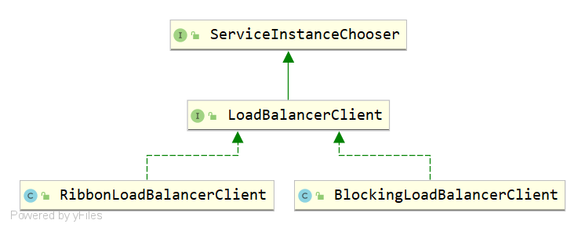
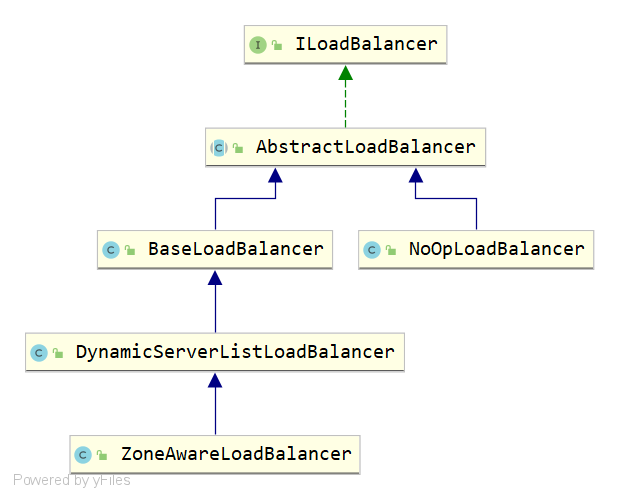
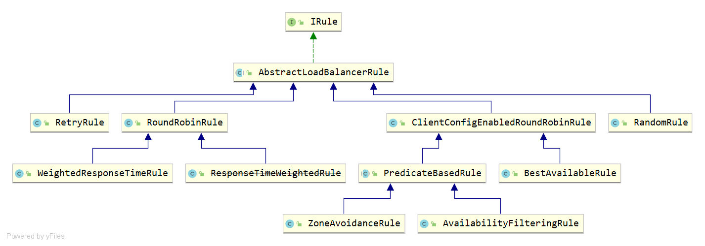

# Spring-Cloud-Netflix-Ribbon


- `LoadBalancerAutoConfiguration`

  **全类名**：`org.springframework.cloud.client.loadbalancer.LoadBalancerAutoConfiguration`

  **JAR包**：`spring-cloud-commons`

  **bean**：

  - `LoadBalancerRequestFactory`

  - `LoadBalancerInterceptor`

  - 为`RestTemplate`设置负载均衡拦截器

- `RibbonAutoConfiguration`

  **全类名**：`org.springframework.cloud.netflix.ribbon.RibbonAutoConfiguration`

  **JAR包**：`spring-cloud-netflix-ribbon`

  **bean**：

  - `LoadBalancerClient`
  - SpringClientFactory

- `RibbonClientConfiguration`

  **全类名**：`org.springframework.cloud.netflix.ribbon.RibbonClientConfiguration`

  **JAR包**：`spring-cloud-netflix-ribbon`

  **bean**：

  - `ILoadBalancer`

  - `IRule`

  - `IPing`

  

## ServiceInstanceChooser

`org.springframework.cloud.client.loadbalancer.ServiceInstanceChooser`接口源码如下，它只有一个抽象方法`choose()`它是通过传递指定的服务ID，获取对应的服务实例。

```java
package org.springframework.cloud.client.loadbalancer;

import org.springframework.cloud.client.ServiceInstance;

/**
 * 由使用负载均衡器选择要发送请求的服务器的类实现。
 * @author Ryan Baxter
 */
public interface ServiceInstanceChooser {
    /**
     * 为指定的服务从LoadBalancer选择ServiceInstance。
     * @param serviceId 查找负载均衡器的服务ID。
     * @return 匹配serviceId的ServiceInstance。
     */
    ServiceInstance choose(String serviceId);
}
```

## LoadBalancerClient

`LoadBalancerClient`是一个负载均衡客户端。其中有两个`execute()`方法，均用来执行请求。`reconstructURI()`用于重构URL。





```java
package org.springframework.cloud.client.loadbalancer;

import org.springframework.cloud.client.ServiceInstance;

import java.io.IOException;
import java.net.URI;

/**
 * 表示客户端负载均衡器。
 * @author Spencer Gibb
 */
public interface LoadBalancerClient extends ServiceInstanceChooser {

   /**
    * 使用LoadBalancer中的ServiceInstance对指定的服务执行请求。
    * @param serviceId 查找负载均衡器的服务ID。
    * @param request 允许实现执行前置和后置操作，例如递增的度量。
    * @return 选择的ServiceInstance上的LoadBalancerRequest回调的结果。
    */
   <T> T execute(String serviceId, LoadBalancerRequest<T> request) throws IOException;

   /**
    * 使用LoadBalancer中的ServiceInstance对指定的服务执行请求。
    * @param serviceId 查找负载均衡器的服务ID。
    * @param serviceInstance 执行请求的服务。
    * @param request 允许实现执行前置和后置操作，例如递增的度量。
    * @return 选择的ServiceInstance上的LoadBalancerRequest回调的结果。
    */
   <T> T execute(String serviceId, ServiceInstance serviceInstance, LoadBalancerRequest<T> request) throws IOException;

   /**
    * 为系统使用的主机和端口创建适当的URI。
    * 有些系统使用逻辑服务名作为主机的URI，比如http://myservice/path/to/service。
    * 这将用ServiceInstance的host:port替换服务名。
    * @param instance
    * @param original 将主机作为逻辑服务名的URI。
    * @return 一个重建的URI。
    */
   URI reconstructURI(ServiceInstance instance, URI original);
}
```

### RibbonLoadBalancerClient

`org.springframework.cloud.netflix.ribbon.RibbonLoadBalancerClient`是一个非常重要的类，最终的负载均衡的请求处理由它来执行。

```java
package org.springframework.cloud.netflix.ribbon;

import java.io.IOException;
import java.net.URI;
import java.util.Collections;
import java.util.Map;

import com.netflix.client.config.IClientConfig;
import com.netflix.loadbalancer.ILoadBalancer;
import com.netflix.loadbalancer.Server;

import org.springframework.cloud.client.DefaultServiceInstance;
import org.springframework.cloud.client.ServiceInstance;
import org.springframework.cloud.client.loadbalancer.LoadBalancerClient;
import org.springframework.cloud.client.loadbalancer.LoadBalancerRequest;
import org.springframework.util.Assert;
import org.springframework.util.ReflectionUtils;

import static org.springframework.cloud.netflix.ribbon.RibbonUtils.updateToSecureConnectionIfNeeded;

/**
 * @author Spencer Gibb
 * @author Dave Syer
 * @author Ryan Baxter
 * @author Tim Ysewyn
 */
public class RibbonLoadBalancerClient implements LoadBalancerClient {

   private SpringClientFactory clientFactory;

   public RibbonLoadBalancerClient(SpringClientFactory clientFactory) {
      this.clientFactory = clientFactory;
   }

   @Override
   public URI reconstructURI(ServiceInstance instance, URI original) {
      Assert.notNull(instance, "instance can not be null");
      String serviceId = instance.getServiceId();
      RibbonLoadBalancerContext context = this.clientFactory
            .getLoadBalancerContext(serviceId);

      URI uri;
      Server server;
      if (instance instanceof RibbonServer) {
         RibbonServer ribbonServer = (RibbonServer) instance;
         server = ribbonServer.getServer();
         uri = updateToSecureConnectionIfNeeded(original, ribbonServer);
      } else {
         server = new Server(instance.getScheme(), instance.getHost(), instance.getPort());
         IClientConfig clientConfig = clientFactory.getClientConfig(serviceId);
         ServerIntrospector serverIntrospector = serverIntrospector(serviceId);
         uri = updateToSecureConnectionIfNeeded(original, clientConfig,
               serverIntrospector, server);
      }
      return context.reconstructURIWithServer(server, uri);
   }

   @Override
   public ServiceInstance choose(String serviceId) {
       return choose(serviceId, null);
   }

   /**
    * New: Select a server using a 'key'.
    */
   public ServiceInstance choose(String serviceId, Object hint) {
      Server server = getServer(getLoadBalancer(serviceId), hint);
      if (server == null) {
         return null;
      }
      return new RibbonServer(serviceId, server, isSecure(server, serviceId),
            serverIntrospector(serviceId).getMetadata(server));
   }

   @Override
   public <T> T execute(String serviceId, LoadBalancerRequest<T> request) throws IOException {
       return execute(serviceId, request, null);
   }

   /**
    * New: Execute a request by selecting server using a 'key'.
    * The hint will have to be the last parameter to not mess with the `execute(serviceId, ServiceInstance, request)`
    * method. This somewhat breaks the fluent coding style when using a lambda to define the LoadBalancerRequest.
    */
   public <T> T execute(String serviceId, LoadBalancerRequest<T> request, Object hint) throws IOException {
      ILoadBalancer loadBalancer = getLoadBalancer(serviceId);
      Server server = getServer(loadBalancer, hint);
      if (server == null) {
         throw new IllegalStateException("No instances available for " + serviceId);
      }
      RibbonServer ribbonServer = new RibbonServer(serviceId, server, isSecure(server,
            serviceId), serverIntrospector(serviceId).getMetadata(server));

      return execute(serviceId, ribbonServer, request);
   }

   @Override
   public <T> T execute(String serviceId, ServiceInstance serviceInstance, LoadBalancerRequest<T> request) throws IOException {
      Server server = null;
      if(serviceInstance instanceof RibbonServer) {
         server = ((RibbonServer)serviceInstance).getServer();
      }
      if (server == null) {
         throw new IllegalStateException("No instances available for " + serviceId);
      }

      RibbonLoadBalancerContext context = this.clientFactory
            .getLoadBalancerContext(serviceId);
      RibbonStatsRecorder statsRecorder = new RibbonStatsRecorder(context, server);

      try {
         T returnVal = request.apply(serviceInstance);
         statsRecorder.recordStats(returnVal);
         return returnVal;
      }
      // catch IOException and rethrow so RestTemplate behaves correctly
      catch (IOException ex) {
         statsRecorder.recordStats(ex);
         throw ex;
      }
      catch (Exception ex) {
         statsRecorder.recordStats(ex);
         ReflectionUtils.rethrowRuntimeException(ex);
      }
      return null;
   }

   private ServerIntrospector serverIntrospector(String serviceId) {
      ServerIntrospector serverIntrospector = this.clientFactory.getInstance(serviceId,
            ServerIntrospector.class);
      if (serverIntrospector == null) {
         serverIntrospector = new DefaultServerIntrospector();
      }
      return serverIntrospector;
   }

   private boolean isSecure(Server server, String serviceId) {
      IClientConfig config = this.clientFactory.getClientConfig(serviceId);
      ServerIntrospector serverIntrospector = serverIntrospector(serviceId);
      return RibbonUtils.isSecure(config, serverIntrospector, server);
   }

   /**
    * Note: This method could be removed?
    */
   protected Server getServer(String serviceId) {
      return getServer(getLoadBalancer(serviceId), null);
   }

   protected Server getServer(ILoadBalancer loadBalancer) {
       return getServer(loadBalancer, null);
   }

   protected Server getServer(ILoadBalancer loadBalancer, Object hint) {
      if (loadBalancer == null) {
         return null;
      }
      // Use 'default' on a null hint, or just pass it on?
      return loadBalancer.chooseServer(hint != null ? hint : "default");
   }

   protected ILoadBalancer getLoadBalancer(String serviceId) {
      return this.clientFactory.getLoadBalancer(serviceId);
   }

   public static class RibbonServer implements ServiceInstance {
      private final String serviceId;
      private final Server server;
      private final boolean secure;
      private Map<String, String> metadata;

      public RibbonServer(String serviceId, Server server) {
         this(serviceId, server, false, Collections.emptyMap());
      }

      public RibbonServer(String serviceId, Server server, boolean secure,
            Map<String, String> metadata) {
         this.serviceId = serviceId;
         this.server = server;
         this.secure = secure;
         this.metadata = metadata;
      }

      @Override
      public String getServiceId() {
         return this.serviceId;
      }

      @Override
      public String getHost() {
         return this.server.getHost();
      }

      @Override
      public int getPort() {
         return this.server.getPort();
      }

      @Override
      public boolean isSecure() {
         return this.secure;
      }

      @Override
      public URI getUri() {
         return DefaultServiceInstance.getUri(this);
      }

      @Override
      public Map<String, String> getMetadata() {
         return this.metadata;
      }

      public Server getServer() {
         return this.server;
      }

      @Override
      public String getScheme() {
         return this.server.getScheme();
      }

      @Override
      public String toString() {
         final StringBuilder sb = new StringBuilder("RibbonServer{");
         sb.append("serviceId='").append(serviceId).append('\'');
         sb.append(", server=").append(server);
         sb.append(", secure=").append(secure);
         sb.append(", metadata=").append(metadata);
         sb.append('}');
         return sb.toString();
      }
   }

}
```

### RibbonServer

## RibbonLoadBalancerContext

RibbonStatsRecorder

## IClientConfig

## ILoadBalancer





- `addServers()`：向负载均衡器中维护的实例列表增加服务实例。

- `chooseServer()`：通过某种策略，从负载均衡器中挑选出一个具体的服务实例。

- `markServerDown()`：用来通知和标识负载均衡器中某个具体实例已经停止服务，不然负载均衡在下一次获取服务实例清单前都会认为服务实例均是正常服务的。

- `getReachableServers()`：获取当前正常服务的实例列表。

- `getAllServers()`：获取所有已知的服务实例列表，包括正常服务和停止服务的实例。

```java
package com.netflix.loadbalancer;

import java.util.List;

/**
 * Interface that defines the operations for a software loadbalancer. 定义软件负载均衡器操作的接口。A typical
 * loadbalancer minimally need a set of servers to loadbalance for, 典型的loadbalancer至少需要一组服务器来进行loadbalance，a method to
 * mark a particular server to be out of rotation and a call that will choose a
 * server from the existing list of server.将特定服务器标记为非旋转的方法，以及从现有服务器列表中选择服务器的调用。
 * 
 * @author stonse
 * 
 */
public interface ILoadBalancer {

   /**
    * 服务器的初始列表。
    * This API also serves to add additional ones at a later time
    * The same logical server (host:port) could essentially be added multiple times
    * 这个API还可以在以后添加额外的逻辑服务器(host:port)，
    * 实际上可以多次添加相同的逻辑服务器(host:port)
    * (helpful in cases where you want to give more "weightage" perhaps ..)
    * 如果你想给孩子更多的“体重”，这可能会很有帮助。
    * 
    * @param newServers 添加新服务器
    */
   public void addServers(List<Server> newServers);
   
   /**
    * 从负载均衡器中选择服务器。
    * 
    * @param key 负载均衡器可能用于确定返回哪个服务器的对象。如果负载均衡器不使用此参数，则为空。 An object that the load balancer may use to determine which server to return. null if 
    *         the load balancer does not use this parameter.
    * @return 服务器选择
    */
   public Server chooseServer(Object key);
   
   /**
    * To be called by the clients of the load balancer to notify that a Server is down
    * else, the LB will think its still Alive until the next Ping cycle - potentially
    * (assuming that the LB Impl does a ping)
    * 负载均衡器的客户端要调用它来通知服务器宕机否则，LB将认为它仍然存活到下一个Ping周期——可能(假设LB Impl执行Ping)
    * @param server 服务器标记为down
    */
   public void markServerDown(Server server);
   
   /**
    * @deprecated 2016-01-20 This method is deprecated in favor of the
    * cleaner {@link #getReachableServers} (equivalent to availableOnly=true)
    * and {@link #getAllServers} API (equivalent to availableOnly=false).
    * 这个方法不赞成使用clean {@link # geableservers}(等价于availableOnly=true)和{@link #getAllServers} API(等价于availableOnly=false)。
    * 获取当前服务器列表。
    *
    * @param availableOnly 如果为真，应该只返回活动的和可用的服务器
    */
   @Deprecated
   public List<Server> getServerList(boolean availableOnly);

   /**
    * @return 只有启动和可访问的服务器。
     */
    public List<Server> getReachableServers();

    /**
     * @return 所有已知的服务器，可访问的和不可访问的。
     */
   public List<Server> getAllServers();
}
```


`com.netflix.client.config.IClientConfig`：用于配置负载均衡客户端

`com.netflix.loadbalancer.IRule`：用于配置负载均衡的策略

`com.netflix.loadbalancer.IPing`：用于向Server发生”ping“，来判断该Server是否有响应，从而判断该Server是否可用。

`com.netflix.loadbalancer.ServerList`：定义获取所有Server的注册列表信息的接口

`com.netflix.loadbalancer.ServerListFilter`：定义了可根据配置去过滤或者特效动态地获取符合条件的Server列表的方法


## IRule

负载均衡常见策略：

1. 随机（Random）
2. 轮询（RoundRobin）
3. 一致性哈希（ConsistentHash）
4. 哈希（Hash）
5. 加权（Weighted）


```java
public interface IRule{
    public Server choose(Object key);
    public void setLoadBalancer(ILoadBalancer lb);
    public ILoadBalancer getLoadBalancer();    
}
```




----------------------------


12 

- RandomRule：随机策略
- RoundRobinRule：轮询策略（默认）
- WeightedResponseTimeRule：加权策略
- BestAvailableRule：请求数最少策略


