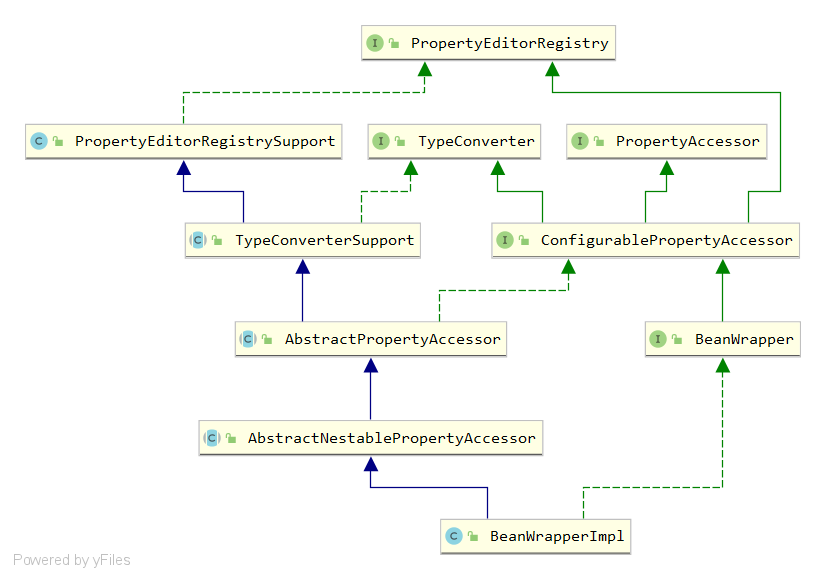

# BeanWrapper


源码Javadoc对其描述如下：

```
The central interface of Spring's low-level JavaBeans infrastructure.
Typically not used directly but rather implicitly via a org.springframework.beans.factory.BeanFactory or a org.springframework.validation.DataBinder.
Provides operations to analyze and manipulate standard JavaBeans: the ability to get and set property values (individually or in bulk), get property descriptors, and query the readability/writability of properties.
This interface supports nested properties enabling the setting of properties on subproperties to an unlimited depth.
A BeanWrapper's default for the "extractOldValueForEditor" setting is "false", to avoid side effects caused by getter method invocations. Turn this to "true" to expose present property values to custom editors.
```

Spring的低级javabean基础结构的中心接口。通常不直接使用，而是通过`org.springframework.beans.factory.BeanFactory`或`org.springframework.validation.DataBinder`含蓄地使用。

提供分析和操作标准javabean的操作:获取和设置属性值(单独或批量)、获取属性描述符和查询属性的可读性/可写性的能力。

此接口支持嵌套属性，允许将子属性上的属性设置为无限深度。

BeanWrapper的“`extractOldValueForEditor`”设置的默认值是“`false`”，以避免getter方法调用造成的副作用。将其转换为“`true`”以向自定义编辑器公开当前属性值。

BeanWrapper相关的类结构图如下所示：



其主要包含三个主要部分，分别是属性编辑器，类型转换器，属性访问器。


PropertyAccessor

ConfigurablePropertyAccessor

AbstractPropertyAccessor

`AbstractNestablePropertyAccessor`是抽象的嵌套属性访问器管理类，它封装了对每一个嵌套属性的属性访问器的管理。


**属性访问器**

属性访问器是对实例属性的访问，那么它的前提条件必须是有一个实例，然后才可以对其属性进行访问。

例如有一个User对象，User对象中有一个name属性；属性访问器中必须包含User对象的实例，才可以对name属性访问操作。

```java
//构建User实例
User user = new User();
//构建属性访问器，并设置访问对象实例
BeanWrapper beanWrapper = new BeanWrapperImpl(user);
//访问User的name属性
Object name = beanWrapper.getPropertyValue("name");
```


## 嵌套属性

嵌套属性就是属性的属性，这里属性的属性可以是无限层级，当然，如此描述可能不太好理解，举个例子说明。

我们定义了三个类，如下：

*用户*

```java
public class User {
    private Role role;
}
```

*角色*

```java
public class Role {
    private Permission permission;
}
```

*权限*

```java
public class Permission {
	//权限名称
    private String name;
}
```

`role`是`User`的属性，`permission`是`Role`的属性，`name`是`Permission`的属性，当通过`User`去访问`Permission`的`name`属性时，属性表达式为`role.permission.name`，而这就是嵌套属性。

Spring PropertyAccessor还支持对`Collection`、`Array`、`Map`的访问。

*更改`Role`如下：*

```java
import java.util.List;
import java.util.Map;

public class Role {

    private Permission permission;
   
    private List<String> infos;
    
    private String[] scopes;
    
    private Map<String,String> attributes;
}
```

支持的表达式：

| 表达式              | 示例                              | 说明               |
| ------------------- | --------------------------------- | ------------------ |
| `property`          | `role`                            | 直接成员属性访问   |
| `property.property` | `role.permission.name`            | 嵌套成员属性访问   |
| `property[index]`   | `role.infos[0]`或`role.scopes[0]` | 集合或数组索引访问 |
| `property[key]`     | `role.attributes[name]`           | 映射key访问        |


```java
public static void main(String[] args) {
    Permission permission = new Permission();
    permission.setName("超级管理员");
    Role role = new Role();
    role.setPermission(permission);
    User user = new User();
    user.setRole(role);

    BeanWrapper beanWrapper = new BeanWrapperImpl(user);
    Object name = beanWrapper.getPropertyValue("role.permission.name");
    System.out.println(name);
}
```


```java
@Override
@Nullable
public Object getPropertyValue(String propertyName) throws BeansException {
    AbstractNestablePropertyAccessor nestedPa = getPropertyAccessorForPropertyPath(propertyName);
    PropertyTokenHolder tokens = getPropertyNameTokens(getFinalPath(nestedPa, propertyName));
    return nestedPa.getPropertyValue(tokens);
}
```

1. 调用`getPropertyAccessorForPropertyPath`通过递归获取最后一个嵌套属性的访问器。
2. ？？？？
3. 调用PropertyTokenHolder的getPropertyValue获取属性的值。

**获取嵌套属性访问器**

递归导航以返回嵌套属性路径的属性访问器。

- 属性路径，它可以嵌套
- 目标bean的属性访问器

```java
/**
 * Recursively navigate to return a property accessor for the nested property path.
 * @param propertyPath 属性路径，它可以嵌套。
 * @return 目标Bean的属性访问器
 */
@SuppressWarnings("unchecked")  // avoid nested generic
protected AbstractNestablePropertyAccessor getPropertyAccessorForPropertyPath(String propertyPath) {
    int pos = PropertyAccessorUtils.getFirstNestedPropertySeparatorIndex(propertyPath);
    // 递归处理嵌套属性。
    if (pos > -1) {
        String nestedProperty = propertyPath.substring(0, pos);
        String nestedPath = propertyPath.substring(pos + 1);
        AbstractNestablePropertyAccessor nestedPa = getNestedPropertyAccessor(nestedProperty);
        return nestedPa.getPropertyAccessorForPropertyPath(nestedPath);
    }
    else {
        return this;
    }
}
```

1. 首先通过`PropertyAccessorUtils`工具类的`getFirstNestedPropertySeparatorIndex`方法获取嵌套属性的第一个属性分隔符的索引。

2. 如果pos小于等于-1，表明当前访问的属性不是嵌套属性，那么就直接返回this，而this实际上就是当前访问属性的属性访问器。

3. 如果pos大于-1，即存在属性分隔符，表明当前访问的属性是嵌套属性。通过`substring`分割嵌套属性（nestedProperty）和嵌套路径（nestedPath），再通过`getNestedPropertyAccessor`获取嵌套属性的属性访问器，最后再递归调用当前`getPropertyAccessorForPropertyPath`方法获取嵌套属性访问器。

第三步到底是什么原理呢？在说明之前，需要知道的一点是，**属性访问器并不能直接对嵌套属性进行访问**，而是通过获取到嵌套属性中最后一个**属性实例**的属性访问器从而对嵌套属性最后一个**属性**进行访问操作。举一个例子加以说明。

有嵌套属性`role.permission.name`，流程如下：

1. 第一次访问`getPropertyAccessorForPropertyPath`，首先会获取到当前嵌套属性的第一个属性分割符索引，pos等于4
2. `pos > -1`，进入到`if`语句块，分割之后嵌套属性和嵌套路径分别为`role`和`permission.name`
3. 通过`getNestedPropertyAccessor`获取`role`的属性访问器。
4. 再通过`role`的属性访问器递归访问嵌套路径`permission.name`。
5. 再次找到属性分割符，pos等于10，分割之后嵌套属性和嵌套路径分别为`permission`和`name`。
6. 再通过`permission`的属性访问器递归访问嵌套路径`name`。
7. 没有找到属性分割符，一层一层的返回`permission`的属性访问器。

最后，有了permission的属性访问器，自然就可以对permission的name属性进行访问了。

> `permission`是最后一个**属性实例**，而name是最后一个属性，注意它们的差别。


**获取属性分割符索引**

`PropertyAccessorUtils`工具类的`getFirstNestedPropertySeparatorIndex`方法是用于获取嵌套属性的第一个属性分隔符的索引。源码如下：


**getNestedPropertyAccessor**

getNestedPropertyAccessor是用于获取嵌套属性的属性访问器。源码如下：

```java
/**
 * 检索给定嵌套属性的属性访问器。
 * 如果在缓存中没有找到，则创建一个新的。
 * <p>Note: Caching nested PropertyAccessors is necessary now,
 * to keep registered custom editors for nested properties.
	 缓存嵌套的PropertyAccessors现在是必要的，以便为嵌套的属性保留注册的自定义编辑器。
 * @param nestedProperty 创建PropertyAccessor的属性。
 * @return 缓存或者新创建的PropertyAccessor实例。
 */
private AbstractNestablePropertyAccessor getNestedPropertyAccessor(String nestedProperty) {
    if (this.nestedPropertyAccessors == null) {
        this.nestedPropertyAccessors = new HashMap<>();
    }
    // Get value of bean property.
    PropertyTokenHolder tokens = getPropertyNameTokens(nestedProperty);
    String canonicalName = tokens.canonicalName;
    Object value = getPropertyValue(tokens);
    if (value == null || (value instanceof Optional && !((Optional) value).isPresent())) {
        if (isAutoGrowNestedPaths()) {
            value = setDefaultValue(tokens);
        }
        else {
            throw new NullValueInNestedPathException(getRootClass(), this.nestedPath + canonicalName);
        }
    }

    // Lookup cached sub-PropertyAccessor, create new one if not found.
    AbstractNestablePropertyAccessor nestedPa = this.nestedPropertyAccessors.get(canonicalName);
    if (nestedPa == null || nestedPa.getWrappedInstance() != ObjectUtils.unwrapOptional(value)) {
        if (logger.isTraceEnabled()) {
            logger.trace("Creating new nested " + getClass().getSimpleName() + " for property '" + canonicalName + "'");
        }
        nestedPa = newNestedPropertyAccessor(value, this.nestedPath + canonicalName + NESTED_PROPERTY_SEPARATOR);
        // Inherit all type-specific PropertyEditors.
        copyDefaultEditorsTo(nestedPa);
        copyCustomEditorsTo(nestedPa, canonicalName);
        this.nestedPropertyAccessors.put(canonicalName, nestedPa);
    }
    else {
        if (logger.isTraceEnabled()) {
            logger.trace("Using cached nested property accessor for property '" + canonicalName + "'");
        }
    }
    return nestedPa;
}
```

1. 首先判断当前属性访问器的嵌套属性的属性访问器缓存是否为null，如果为null就创建一个。
2. 获取嵌套属性的Holder类，
3. 获取嵌套属性的值
4. 如果值为空，将根据是否自动增长嵌套路径来设置默认值，如果不允许自动增长，将抛出NullValueInNestedPathException异常。
5. 通过canonicalName从属性访问器缓存中获取对应的属性访问器
6. 判断缓存中是否存在属性访问器，并且缓存中的属性访问器的包装实例与当前嵌套属性的值相等。
7. 如果缓存中存在属性访问器并相等，则直接返回缓存中属性访问器。
8. 如果缓存中不存在属性访问器或者不相等，则通过newNestedPropertyAccessor创建一个新的属性访问器，并拷贝默认和自定义的属性编辑器，最后再添加到缓存中，并返回。


getPropertyNameTokens

用于将给的的属性名解析为相应的属性名标记。

```java
/**将给定的属性名解析为相应的属性名标记。
 * Parse the given property name into the corresponding property name tokens.
 * @param propertyName 要解析的属性名
 * @return representation of the parsed property tokens 表示已解析的属性标记
 */
private PropertyTokenHolder getPropertyNameTokens(String propertyName) {
    String actualName = null;
    List<String> keys = new ArrayList<>(2);
    int searchIndex = 0;
    while (searchIndex != -1) {
        int keyStart = propertyName.indexOf(PROPERTY_KEY_PREFIX, searchIndex);
        searchIndex = -1;
        if (keyStart != -1) {
            int keyEnd = propertyName.indexOf(PROPERTY_KEY_SUFFIX, keyStart + PROPERTY_KEY_PREFIX.length());
            if (keyEnd != -1) {
                if (actualName == null) {
                    actualName = propertyName.substring(0, keyStart);
                }
                String key = propertyName.substring(keyStart + PROPERTY_KEY_PREFIX.length(), keyEnd);
                if (key.length() > 1 && (key.startsWith("'") && key.endsWith("'")) ||
                    (key.startsWith("\"") && key.endsWith("\""))) {
                    key = key.substring(1, key.length() - 1);
                }
                keys.add(key);
                searchIndex = keyEnd + PROPERTY_KEY_SUFFIX.length();
            }
        }
    }
    PropertyTokenHolder tokens = new PropertyTokenHolder(actualName != null ? actualName : propertyName);
    if (!keys.isEmpty()) {
        tokens.canonicalName += PROPERTY_KEY_PREFIX +
            StringUtils.collectionToDelimitedString(keys, PROPERTY_KEY_SUFFIX + PROPERTY_KEY_PREFIX) +
            PROPERTY_KEY_SUFFIX;
        tokens.keys = StringUtils.toStringArray(keys);
    }
    return tokens;
}
```

1. 首先声明了两个局部变量，分别是actualName，表示实际的值；keys，用于存储集合或者数组的索引，或Map的key。

2. 接着是一个while循环，这个循环体用于解析keys。
   1. 检索`[`位置。
   2. 直接置searchIndex为-1，当后续检索key的条件不满足时，直接退出循环。
   3. 检索到了`[`，接着在检索`]`的位置。
   4. 判断是否检索到了`]`。
   5. 将xx设置为actualName的值。
   6. 根据`[`和`]`截取key。
   7. 如果key包含了单引号或双引号，则去掉单引号或双引号。
   8. 将key添加到keys集合当中。
   9. 重置searchIndex，从当前检索到的key之后进行下一次检索。
3. 构造一个PropertyTokenHolder。
4. 如果keys不为空，则组装canonicalName值。
5. 返回PropertyTokenHolder。


## getPropertyValue

这个getPropertyValue不是PropertyAccessor接口的getPropertyValue，它是AbstractNestablePropertyAccessor受保护的方法，这个方法才是正常获取属性值得方法，而AbstractNestablePropertyAccessor对PropertyAccessor实现的getPropertyValue主要管理了嵌套属性的属性处理器的获取，最后取值是交由这个受保护的getPropertyValue方法处理。

```java
@SuppressWarnings("unchecked")
@Nullable
protected Object getPropertyValue(PropertyTokenHolder tokens) throws BeansException {
    String propertyName = tokens.canonicalName;
    String actualName = tokens.actualName;
    PropertyHandler ph = getLocalPropertyHandler(actualName);
    //属性处理器不存在，或者属性不可读
    if (ph == null || !ph.isReadable()) {
        throw new NotReadablePropertyException(getRootClass(), this.nestedPath + propertyName);
    }
    try {
        //获取属性值
        Object value = ph.getValue();
        //处理属性为集合、数组、Map等情况
        if (tokens.keys != null) {
            if (value == null) {
                if (isAutoGrowNestedPaths()) {
                    value = setDefaultValue(new PropertyTokenHolder(tokens.actualName));
                }
                else {
                    throw new NullValueInNestedPathException(getRootClass(), this.nestedPath + propertyName,
                                                             "Cannot access indexed value of property referenced in indexed " +
                                                             "property path '" + propertyName + "': returned null");
                }
            }
            StringBuilder indexedPropertyName = new StringBuilder(tokens.actualName);
            // apply indexes and map keys
            for (int i = 0; i < tokens.keys.length; i++) {
                String key = tokens.keys[i];
                if (value == null) {
                    throw new NullValueInNestedPathException(getRootClass(), this.nestedPath + propertyName,
                                                             "Cannot access indexed value of property referenced in indexed " +
                                                             "property path '" + propertyName + "': returned null");
                }
                else if (value.getClass().isArray()) {
                    int index = Integer.parseInt(key);
                    value = growArrayIfNecessary(value, index, indexedPropertyName.toString());
                    value = Array.get(value, index);
                }
                else if (value instanceof List) {
                    int index = Integer.parseInt(key);
                    List<Object> list = (List<Object>) value;
                    growCollectionIfNecessary(list, index, indexedPropertyName.toString(), ph, i + 1);
                    value = list.get(index);
                }
                else if (value instanceof Set) {
                    // Apply index to Iterator in case of a Set.
                    Set<Object> set = (Set<Object>) value;
                    int index = Integer.parseInt(key);
                    if (index < 0 || index >= set.size()) {
                        throw new InvalidPropertyException(getRootClass(), this.nestedPath + propertyName,
                                                           "Cannot get element with index " + index + " from Set of size " +
                                                           set.size() + ", accessed using property path '" + propertyName + "'");
                    }
                    Iterator<Object> it = set.iterator();
                    for (int j = 0; it.hasNext(); j++) {
                        Object elem = it.next();
                        if (j == index) {
                            value = elem;
                            break;
                        }
                    }
                }
                else if (value instanceof Map) {
                    Map<Object, Object> map = (Map<Object, Object>) value;
                    Class<?> mapKeyType = ph.getResolvableType().getNested(i + 1).asMap().resolveGeneric(0);
                    // IMPORTANT: Do not pass full property name in here - property editors
                    // must not kick in for map keys but rather only for map values.
                    TypeDescriptor typeDescriptor = TypeDescriptor.valueOf(mapKeyType);
                    Object convertedMapKey = convertIfNecessary(null, null, key, mapKeyType, typeDescriptor);
                    value = map.get(convertedMapKey);
                }
                else {
                    throw new InvalidPropertyException(getRootClass(), this.nestedPath + propertyName,
                                                       "Property referenced in indexed property path '" + propertyName +
                                                       "' is neither an array nor a List nor a Set nor a Map; returned value was [" + value + "]");
                }
                indexedPropertyName.append(PROPERTY_KEY_PREFIX).append(key).append(PROPERTY_KEY_SUFFIX);
            }
        }
        return value;
    }
    catch (IndexOutOfBoundsException ex) {
        throw new InvalidPropertyException(getRootClass(), this.nestedPath + propertyName,
                                           "Index of out of bounds in property path '" + propertyName + "'", ex);
    }
    catch (NumberFormatException | TypeMismatchException ex) {
        throw new InvalidPropertyException(getRootClass(), this.nestedPath + propertyName,
                                           "Invalid index in property path '" + propertyName + "'", ex);
    }
    catch (InvocationTargetException ex) {
        throw new InvalidPropertyException(getRootClass(), this.nestedPath + propertyName,
                                           "Getter for property '" + actualName + "' threw exception", ex);
    }
    catch (Exception ex) {
        throw new InvalidPropertyException(getRootClass(), this.nestedPath + propertyName,
                                           "Illegal attempt to get property '" + actualName + "' threw exception", ex);
    }
}
```


1. 首先获取当前属性的属性处理器
2. 验证当前属性的处理器不为空，并且可读
3. 调用属性处理器的getValue方法获取属性的值
4. keys不等于null，表明当前属性是数组、集合、Map等。
5. 如果keys为null，直接返回当前属性的值。
6. 迭代keys，按属性值得类型分别处理，获取对应索引或key的值。


## setDefaultValue


从方法名来看，是设置默认值，其实有些奇怪，因为我们并没有设置默认值，查看对这个方法的调用，它们都是下面的格式：

```java
if (isAutoGrowNestedPaths()) {
    //......
    value = setDefaultValue(tokens);
    //......
}
```

可以看到，是在允许自动增长嵌套路径时，才会调用这个方法，而这里的设置默认值是指设置数据对象类型的默认值，例如：


相关源码如下：

```java
private Object setDefaultValue(PropertyTokenHolder tokens) {
    PropertyValue pv = createDefaultPropertyValue(tokens);
    setPropertyValue(tokens, pv);
    Object defaultValue = getPropertyValue(tokens);
    Assert.state(defaultValue != null, "Default value must not be null");
    return defaultValue;
}

private PropertyValue createDefaultPropertyValue(PropertyTokenHolder tokens) {
    TypeDescriptor desc = getPropertyTypeDescriptor(tokens.canonicalName);
    if (desc == null) {
        throw new NullValueInNestedPathException(getRootClass(), this.nestedPath + tokens.canonicalName,
                                                 "Could not determine property type for auto-growing a default value");
    }
    Object defaultValue = newValue(desc.getType(), desc, tokens.canonicalName);
    return new PropertyValue(tokens.canonicalName, defaultValue);
}

private Object newValue(Class<?> type, @Nullable TypeDescriptor desc, String name) {
    try {
        if (type.isArray()) {
            Class<?> componentType = type.getComponentType();
            // TODO - only handles 2-dimensional arrays
            if (componentType.isArray()) {
                Object array = Array.newInstance(componentType, 1);
                Array.set(array, 0, Array.newInstance(componentType.getComponentType(), 0));
                return array;
            }
            else {
                return Array.newInstance(componentType, 0);
            }
        }
        else if (Collection.class.isAssignableFrom(type)) {
            TypeDescriptor elementDesc = (desc != null ? desc.getElementTypeDescriptor() : null);
            return CollectionFactory.createCollection(type, (elementDesc != null ? elementDesc.getType() : null), 16);
        }
        else if (Map.class.isAssignableFrom(type)) {
            TypeDescriptor keyDesc = (desc != null ? desc.getMapKeyTypeDescriptor() : null);
            return CollectionFactory.createMap(type, (keyDesc != null ? keyDesc.getType() : null), 16);
        }
        else {
            Constructor<?> ctor = type.getDeclaredConstructor();
            if (Modifier.isPrivate(ctor.getModifiers())) {
                throw new IllegalAccessException("Auto-growing not allowed with private constructor: " + ctor);
            }
            return BeanUtils.instantiateClass(ctor);
        }
    }
    catch (Throwable ex) {
        throw new NullValueInNestedPathException(getRootClass(), this.nestedPath + name,
                                                 "Could not instantiate property type [" + type.getName() + "] to auto-grow nested property path", ex);
    }
}
```


1. 首先在setDefaultValue方法中调用createDefaultPropertyValue方法创建默认属性值，
2. createDefaultPropertyValue方法中调用getPropertyTypeDescriptor获取当前属性的类型描述对象。
3. 


