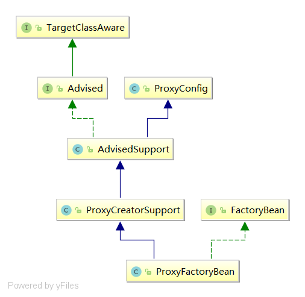

# Spring AOP


Spring提供5中增强方式，如下：

1. 前置增强：org.springframework.aop.BeforeAdvice
2. 后置增强：org.springframework.aop.AfterReturningAdvice
3. 环绕增强：org.aopalliance.intercept.MethodInterceptor
4. 异常抛出增强：org.springframework.aop.ThrowsAdvice
5. 引介增强：org.springframework.aop.IntroductionInterceptor

## Using ProxyFactory

前置增强案例

分别创建一个前置增强，代理目标对象，并通过main方法使用`ProxyFactory`创建代理对象测试。

**CustomBeforeAdvice.java**

```java
public class CustomBeforeAdvice implements MethodBeforeAdvice {

    @Override
    public void before(Method method, Object[] args, Object target) throws Throwable {
        System.out.printf("Before advice => 
                          proxy target class name : %s\n",target.getClass().getName());
        System.out.printf("Before advice => 
                          proxy target method name : %s\n",method.getName());
    }
}
```

**UserService.java**

```java
public class UserService {
    public Map<String,String> getUserInfo(){
        Map<String,String> map = new HashMap<>();
        map.put("name","王玲");
        map.put("age","22");
        map.put("sex","女");
        return map;
    }
}
```

test

```java
public static void main(String[] args) {
    //创建代理工厂
    ProxyFactory factory = new ProxyFactory();
    //设置代理目标
    factory.setTarget(new UserService());
    //为代理目标添加增强
    factory.addAdvice(new CustomBeforeAdvice());
    //生成代理实例
    UserService userService = (UserService) factory.getProxy();
    System.out.printf("UserService by class : %s\n",userService.getClass());
    //执行代理目标的方法
    Map<String, String> userInfo = userService.getUserInfo();
    System.out.printf("user info : %s\n",userInfo);
}
```

输出结果：

```wiki
UserService by class : class study.source.code.aop.UserService$$EnhancerBySpringCGLIB$$325b5e16
Before advice => proxy target class name : study.source.code.aop.UserService
Before advice => proxy target method name : getUserInfo
user info : {sex=女, name=王玲, age=22}
```

## Using ProxyFactoryBean

除了使用`ProxyFactory`之外，Spring还提供了`ProxyFactoryBean`，ProxyFactoryBean是一个FactoryBean。

**XML Configuration**

```xml
<!--前置增强-->
<bean id="advice" class="study.source.code.aop.CustomBeforeAdvice"/>
<!--代理目标类-->
<bean id="target" class="study.source.code.aop.UserService"/>
<!--ProxyFactoryBean-->
<bean id="userService" class="org.springframework.aop.framework.ProxyFactoryBean">
    <!--为代理目标设置增强-->
    <property name="interceptorNames" value="advice"/>
    <!--设置代理目标-->
    <property name="target" ref="target"/>
</bean>
```

**test**

```java
public static void main(String[] args) {
    DefaultListableBeanFactory beanFactory = new DefaultListableBeanFactory();
    XmlBeanDefinitionReader definitionReader = new XmlBeanDefinitionReader(beanFactory);
    definitionReader.loadBeanDefinitions("classpath:applicationContext.xml");

    UserService userService = (UserService) beanFactory.getBean("userService");
    System.out.printf("UserService by class : %s\n",userService.getClass());
    //执行代理目标的方法
    Map<String, String> userInfo = userService.getUserInfo();
    System.out.printf("user info : %s\n",userInfo);
}
```

输出结果：

```wiki
UserService by class : class study.source.code.aop.UserService$$EnhancerBySpringCGLIB$$a107b37f
Before advice => proxy target class name : study.source.code.aop.UserService
Before advice => proxy target method name : getUserInfo
user info : {sex=女, name=王玲, age=22}
```

## Difference between ProxyFactory and ProxyFactoryBean

前面使用了`ProxyFactory `和`ProxyFactoryBean`进行代理对象的创建并测试，测试结果完全一样，那么它们之间有什么区别呢？下面分别是class类注释说明：

ProxyFactory 

>English:
>
>Factory for AOP proxies for programmatic use, rather than via declarative setup in a bean factory. This class provides a simple way of obtaining and configuring AOP proxy instances in custom user code.
>
>Chinese：
>
>AOP代理的工程，用于编程使用，而不是通过bean工程的声明性设置。这个类提供了一种在定制用户代码中获取和配置AOP代理实例的简单方法。

ProxyFactoryBean

> English:
>
> FactoryBean implementation that builds an AOP proxy based on beans in Spring BeanFactory.
>
> Chinese：
>
> FactoryBean实现，它在Spring BeanFactory中基于bean构建AOP代理。

归纳为：

ProxyFactory：编程式的使用Spring AOP的功能。

ProxyFactoryBean：在IOC容器中完成声明式的配置。

## Assembly Advisor, Advice and Pointcut

上面的两个案例虽然实现了对目标类的代理，但是他们会代理目标类中的所有方法，例如toString()方法等。而我们常常只需要代理目标类中部分或特定的目标方法。

**CustomAdvisor.java**

```java
public class CustomAdvisor extends StaticMethodMatcherPointcutAdvisor {

    @Override
    public boolean matches(Method method, Class<?> targetClass) {
        return method.getName().equals("getUserInfo");
    }
}
```

**XML Configuration**

```xml
<!--前置增强-->
<bean id="advice" class="study.source.code.aop.CustomBeforeAdvice"/>
<!--切面-->
<bean id="advisor" class="study.source.code.aop.CustomAdvisor">
    <!--向切面添加增强-->
    <property name="advice" ref="advice"/>
</bean>
<!--代理目标类-->
<bean id="target" class="study.source.code.aop.UserService"/>
<!--ProxyFactoryBean-->
<bean id="userService" class="org.springframework.aop.framework.ProxyFactoryBean">
    <!--为代理目标设置切面-->
    <property name="interceptorNames" value="advisor"/>
    <!--设置代理目标-->
    <property name="target" ref="target"/>
</bean>
```

## Spring AOP源码分析

### ProxyFactoryBean

在具体分析`ProxyFactoryBean`是怎样创建AOP代理之前，有必要先了解一下其包含的核心属性：

- `target`：代理的目标对象。
- `ProxyInterfaces`：代理所要实现的接口，可以是多个接口。该属性还有一个别名属性`interfaces`。
- `interceptorNames`：需要织入目标对象的Bean列表，采用Bean的名称指定。这些Bean必须是实现了``或``的Bean，配置中的顺序对应调用的顺序。
- `singleton`：返回的代理是否是单实例，默认为单实例。
- `proxyTargetClass`：是否对类进行代理（）。当设置为true时，使用CGLIB动态代理。
- `optimize`：是否强制使用CGLIB代理，为true时是。对于Singleton的代理，推荐使用CGLIB；对于其他作用域类型的代理（例如Prototype），推荐使用JDK动态代理。原因是虽然CGLIB创建代理时速较慢，但是其创建出的代理对象运行效率较高，而JDK的动态代理正好相反。

了解了核心属性，再来看一下`ProxyFactoryBean`类结构体系：

```java
public class ProxyFactoryBean extends ProxyCreatorSupport
		implements FactoryBean<Object>, BeanClassLoaderAware, BeanFactoryAware{
}
```

类结构图：



ProxyConfig

AdviseSupport

ProxyCreatorSupport


ProxyFactoryBean是一个FactoryBean，继承了ProxyFactoryBean<T>接口。根据Spring FactoryBean的原理，自然也可以知道其核心入口是`getObject`方法。

#### getObject

getObject方法首先对通知器链进行初始化，通知器链封装了一系列的拦截器，这些拦截器都要从配置中读取，然后为代理对象的生成做好准备。在生成代理对象时，因为Spring中有singleton类型和prototype类型这两种不同的Bean，所以要对代理对象的生成做一个区分。

```java
public Object getObject() throws BeansException {
    //初始化通知器链
    initializeAdvisorChain();
    //对singleton和prototype的类型进行区分，生成对应的proxy
    if (isSingleton()) {
        return getSingletonInstance();
    }
    else {
        if (this.targetName == null) {
            logger.info("Using non-singleton proxies with singleton targets is often undesirable. " +
                        "Enable prototype proxies by setting the 'targetName' property.");
        }
        return newPrototypeInstance();
    }
}
```


#### initializeAdvisorChain

为Proxy代理对象配置Advisor链是在initializeAdvisorChain方法中完成的。初始化过程中有一个标志位`advisorChainInitialized`，它是用来来表示通知器链是否已经初始化，如果已经初始化，那么这里就不会在初始化，而是直接返回。


```java
private synchronized void initializeAdvisorChain() throws AopConfigException, BeansException {
    if (this.advisorChainInitialized) {
        return;
    }

    if (!ObjectUtils.isEmpty(this.interceptorNames)) {
        if (this.beanFactory == null) {
            throw new IllegalStateException("No BeanFactory available anymore (probably due to serialization) " +
                                            "- cannot resolve interceptor names " + Arrays.asList(this.interceptorNames));
        }

        // Globals can't be last unless we specified a targetSource using the property...
        if (this.interceptorNames[this.interceptorNames.length - 1].endsWith(GLOBAL_SUFFIX) &&
            this.targetName == null && this.targetSource == EMPTY_TARGET_SOURCE) {
            throw new AopConfigException("Target required after globals");
        }

        // Materialize interceptor chain from bean names.
        for (String name : this.interceptorNames) {
            if (logger.isTraceEnabled()) {
                logger.trace("Configuring advisor or advice '" + name + "'");
            }

            if (name.endsWith(GLOBAL_SUFFIX)) {
                if (!(this.beanFactory instanceof ListableBeanFactory)) {
                    throw new AopConfigException(
                        "Can only use global advisors or interceptors with a ListableBeanFactory");
                }
                addGlobalAdvisor((ListableBeanFactory) this.beanFactory,
                                 name.substring(0, name.length() - GLOBAL_SUFFIX.length()));
            }

            else {
                // If we get here, we need to add a named interceptor.
                // We must check if it's a singleton or prototype.
                Object advice;
                if (this.singleton || this.beanFactory.isSingleton(name)) {
                    // Add the real Advisor/Advice to the chain.
                    advice = this.beanFactory.getBean(name);
                }
                else {
                    // It's a prototype Advice or Advisor: replace with a prototype.
                    // Avoid unnecessary creation of prototype bean just for advisor chain initialization.
                    advice = new PrototypePlaceholderAdvisor(name);
                }
                addAdvisorOnChainCreation(advice, name);
            }
        }
    }

    this.advisorChainInitialized = true;
}
```


#### getSingletonInstance


```java
private synchronized Object getSingletonInstance() {
    if (this.singletonInstance == null) {
        this.targetSource = freshTargetSource();
        if (this.autodetectInterfaces && getProxiedInterfaces().length == 0 && !isProxyTargetClass()) {
            // Rely on AOP infrastructure to tell us what interfaces to proxy.
            Class<?> targetClass = getTargetClass();
            if (targetClass == null) {
                throw new FactoryBeanNotInitializedException("Cannot determine target class for proxy");
            }
            setInterfaces(ClassUtils.getAllInterfacesForClass(targetClass, this.proxyClassLoader));
        }
        // Initialize the shared singleton instance.
        super.setFrozen(this.freezeProxy);
        this.singletonInstance = getProxy(createAopProxy());
    }
    return this.singletonInstance;
}
```


### AopProxyFactory


#### createAopProxy

虽然它名为createAopProxy，但实际上真正动态代理对象的创建并不是由createAopProxy方法来完成。这时一个比较高层次的AopProxy代理对象的生成过程。所谓高层次，是指`DefaultAopProxyFactory`创建`AopProxy`的过程中，对不同的AopProxy代理对象的生成所涉及的生成策略和场景做了相应的设计，但是对于具体的AopProxy代理对象的生成，最终并没有由`DefaultAopProxyFactory`来完成，是交由`AopProxy`接口的子类`JdkDynamicAopProxy`和`ObjenesisCglibAopProxy`来完成的。

```java
public AopProxy createAopProxy(AdvisedSupport config) throws AopConfigException {
    if (config.isOptimize() || config.isProxyTargetClass() || hasNoUserSuppliedProxyInterfaces(config)) {
        Class<?> targetClass = config.getTargetClass();
        if (targetClass == null) {
            throw new AopConfigException("TargetSource cannot determine target class: " +
                                         "Either an interface or a target is required for proxy creation.");
        }
        //如果代理目标类是接口类，则使用JDK来生成Proxy
        if (targetClass.isInterface() || Proxy.isProxyClass(targetClass)) {
            return new JdkDynamicAopProxy(config);
        }
        //如果不是接口类，则使用CGLIB来生成Proxy
        return new ObjenesisCglibAopProxy(config);
    }
    else {
        return new JdkDynamicAopProxy(config);
    }
}


private boolean hasNoUserSuppliedProxyInterfaces(AdvisedSupport config) {
    Class<?>[] ifcs = config.getProxiedInterfaces();
    return (ifcs.length == 0 || (ifcs.length == 1 && SpringProxy.class.isAssignableFrom(ifcs[0])));
}
```

1. 首先三个条件判断，只要有其中一个满足，就会再次验证是进行JDK动态代理，还是进行CGLIB代理。

   三个条件分别如下：

   Ⅰ. 是否强制使用CGLIB代理

   Ⅱ. 是否强制使用类代理（CGLIB）

   Ⅲ. 代理目标对象的接口没有，或者有且只有一个，并且这是一个`SpringProxy.class`（即代理目标对象是Spring通过AOP生成的代理对象）

2. 如果上述三个条件都不满足，就直接使用JDK动态代理（简单的说，其实就是不强制使用CGLIB代理，不强制使用类代理，并且有一个或一个以上的接口，如果只有一个，并且这一个不是`SpringProxy`接口）。

3. 获取代理目标类的class对象，并验证不为空。

4. 如果代理目标类是接口，或者是JDK动态代理生成的类，则直接使用JDK动态代理。

5. 如果代理目标类不是接口，并且不是JDK动态代理生成的类，则使用CGLIB动态代理。

最终返回的`ObjenesisCglibAopProxy`或`JdkDynamicAopProxy`的实例，即`AopProxy`对象。

`AopProxy`接口中提供了两个获取代理对象的接口，如下：

```java
public interface AopProxy {
	Object getProxy();
	Object getProxy(@Nullable ClassLoader classLoader);
}
```

自然，其具体代理对象的创建工作是由`ObjenesisCglibAopProxy`和`JdkDynamicAopProxy`完成的。

#### JdkDynamicAopProxy

现在我们进入到`JdkDynamicAopProxy`的`getProxy`方法中，如下：

```java
@Override
public Object getProxy() {
    return getProxy(ClassUtils.getDefaultClassLoader());
}

@Override
public Object getProxy(@Nullable ClassLoader classLoader) {
    if (logger.isTraceEnabled()) {
        logger.trace("Creating JDK dynamic proxy: " + this.advised.getTargetSource());
    }
    Class<?>[] proxiedInterfaces = AopProxyUtils.completeProxiedInterfaces(this.advised, true);
    findDefinedEqualsAndHashCodeMethods(proxiedInterfaces);
    return Proxy.newProxyInstance(classLoader, proxiedInterfaces, this);
}
```

`getProxy`方法的实现很简单，主要分为三步：

1. 获取代理目标对象的所有接口。

2. 查找接口所有中是否有Equals和HashCode方法，并标记`JdkDynamicAopProxy`的成员变量`equalsDefined`和`hashCodeDefined`。

3. 调用JDK`Proxy`类的`newProxyInstance`静态方法创建代理实例。

   > 注意：`newProxyInstance`静态方法的第三个参数为this，关于这一点，将会在后面代理拦截器部分讲到。

##### findDefinedEqualsAndHashCodeMethods

从名字可以看出，查找定义的Equals和HashCode方法。

```java
private void findDefinedEqualsAndHashCodeMethods(Class<?>[] proxiedInterfaces) {
    for (Class<?> proxiedInterface : proxiedInterfaces) {
        Method[] methods = proxiedInterface.getDeclaredMethods();
        for (Method method : methods) {
            if (AopUtils.isEqualsMethod(method)) {
                this.equalsDefined = true;
            }
            if (AopUtils.isHashCodeMethod(method)) {
                this.hashCodeDefined = true;
            }
            if (this.equalsDefined && this.hashCodeDefined) {
                return;
            }
        }
    }
}
```

实现很简单，迭代入参接口集的所有接口的所有方法，依次判断是否是Equals方法或HashCode方法，如果是，则将`JdkDynamicAopProxy`的成员变量`equalsDefined`和`hashCodeDefined`分别标记为true。如果都找到了，则结束查找。


