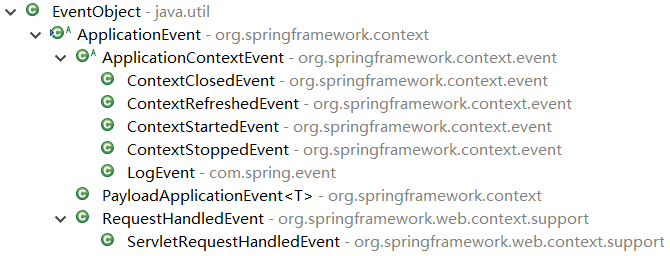
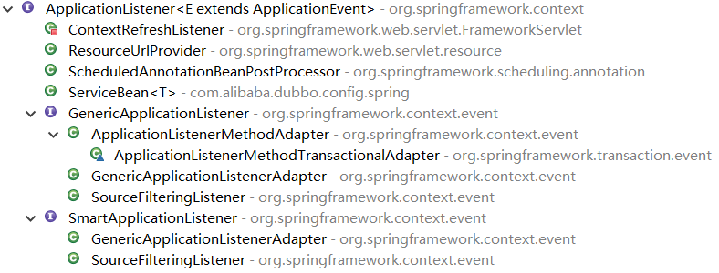

# Spring事件

spring的事件机制遵循[java事件](../../java/Java事件.md)机制，其原理和java事件机制的应用方式一样，只是spring对java事件机制进行了更为完善的进一步封装。
## spring事件基础

如下两张图片所示，核心是一个抽象类和一个接口，分别是`org.spring.framework.context.ApplicationEvent`抽象类和`org.spring.framework.context.ApplicationListener<E extends ApplicationEvent>`接口，其中`org.spring.framework.context.ApplicationEvent`抽象类继承了`java.util.EventObject`类，`org.spring.framework.context.ApplicationListener<E extends ApplicationEvent>`接口继承了`java.util.EventListener`接口。



## spring事件接口基础实现
在实际使用中定义自己的事件以及监听器，将按照spring的规则分别继承`org.spring.framework.context.ApplicationEvent`抽象类以及实现`org.spring.framework.context.ApplicationListener<E extends ApplicationEvent>`接口。

首先定义日志事件LogEvent，继承了ApplicationContextEvent抽象类：
```java
import org.springframework.context.ApplicationContext;
import org.springframework.context.event.ApplicationContextEvent;
public class LogEvent extends ApplicationContextEvent {  
     private static final long serialVersionUID = -5962263719755002723L;
     public LogEvent(ApplicationContext source) {
           super(source);
     }
}
```

定义日志监听器，实现了`ApplicationListener`接口，其中`onApplicationEvent`的入参对象表示当前监听器监听是那个事件，如果入参是`ApplicationEvent`，则表示监听所有事件，因为所有事件都继承了`ApplicationContextEvent`抽象类：
```java
import org.springframework.context.ApplicationListener;
import org.springframework.context.event.EventListener;
import org.springframework.stereotype.Component;
@Component
public class LogListener implements ApplicationListener<LogEvent> {
     @Override
     public void onApplicationEvent(LogEvent event) {
           System.out.println("log:于"+System.currentTimeMillis()+"登录。");
     } 
}
```

测试
```java
import org.junit.runner.RunWith;
import org.springframework.beans.factory.annotation.Autowired;
import org.springframework.context.ApplicationContext;
import org.springframework.test.context.ContextConfiguration;
import org.springframework.test.context.junit4.SpringJUnit4ClassRunner;
@RunWith(SpringJUnit4ClassRunner.class)
@ContextConfiguration(locations={"classpath:applicationContext.xml"})
public class Test {
     @Autowired
     private ApplicationContext context;
     @org.junit.Test
     public void execute(){
           LogEvent event = new LogEvent(context);
           context.publishEvent(event);
     }
}
```

## ApplicationEventPublisher接口方法

ApplicationEventPublisher接口源码：

```java
public interface ApplicationEventPublisher {
  void publishEvent(ApplicationEvent event);
  void publishEvent(Object event);
}
```

可以看到有两个重载的方法，它们的参数分别为`ApplicationEvent`和`Object`，第一个很好理解，就是触发继承了`ApplicationEvent`抽象类型的的事件，而第二个是一个`Object`对象，查看其注释说明

```java
/**
 * 通过所有与此应用程式注册的<strong>匹配</strong>侦听器。
 * <p>如果指定的 {@code event} 不是 {@link ApplicationEvent}，
 * 它将被包装在 {@link PayloadApplicationEvent}。
 * @param event 发布的事件
 * @since 4.2
 * @see PayloadApplicationEvent
 */
void publishEvent(Object event);
```

当事件没有继承ApplicationEvent时，将会被包装为PayloadApplicationEvent事件。
另外@since 4.2，说明是Spring 4.2新增的方法。

## spring事件核心原理
跟踪ApplicationContext的publishEvent()方法，其是org.spring.framework.context.applicationEventPublisher接口定义的方法，具体的实现在org.spring.framework.context.support.AbstractApplicationContext抽象类中，AbstractApplicationContext抽象类间接实现了ApplicationContext接口，而ApplicationContext接口继承了org.spring.framework.context.applicationEventPublisher接口。所以applicationEventPublisher接口担任事件触发发布的行为。

```java
protected void publishEvent(Object event, ResolvableType eventType) {
    Assert.notNull(event, "Event must not be null");
    if (logger.isTraceEnabled()) {
        logger.trace("Publishing event in " + getDisplayName() + ": " + event);
    }
    // Decorate event as an ApplicationEvent if necessary
    ApplicationEvent applicationEvent;
    if (event instanceof ApplicationEvent) {
        applicationEvent = (ApplicationEvent) event;
    }
    else {
        applicationEvent = new PayloadApplicationEvent<Object>(this, event);
        if (eventType == null) {
            eventType = ((PayloadApplicationEvent)applicationEvent).getResolvableType();
        }
    }
    // Multicast right now if possible - or lazily once the multicaster is initialized
    if (this.earlyApplicationEvents != null) {
        this.earlyApplicationEvents.add(applicationEvent);
    }
    else {
        getApplicationEventMulticaster().multicastEvent(applicationEvent, eventType);
    }
    // Publish event via parent context as well...
    if (this.parent != null) {
        if (this.parent instanceof AbstractApplicationContext) {
            ((AbstractApplicationContext) this.parent).publishEvent(event, eventType);
        }
        else {
            this.parent.publishEvent(event);
        }
    }
}
```

跟踪代码`getApplicationEventMulticaster().multicastEvent(applicationEvent, eventType)`,其由`org.springframework.context.event.ApplicationEventMulticaster`接口定义，具体的实现由类`org.springframework.context.event.SimpleApplicationEventMulticaster`实现。也就是说具体的监听器注册以及监听器的调用由接口`org.springframework.context.event.SimpleApplicationEventMulticaster`控制。

```java
 @Override
 public void multicastEvent(final ApplicationEvent event, ResolvableType eventType) {
       ResolvableType type = (eventType != null ? eventType : resolveDefaultEventType(event));
       for (final ApplicationListener<?> listener : getApplicationListeners(event, type)) {
            Executor executor = getTaskExecutor();
            if (executor != null) {
                  executor.execute(new Runnable() {
                       @Override
                       public void run() {
                             invokeListener(listener, event);
                       }
                  });
            }
            else {
                  invokeListener(listener, event);
            }
       }
 }
```

`getApplicationListeners()`方法获取所以监听器，并且迭代循环，在循环中获取了一个Executor线程池，如果Executor不等于null，则进行异步执行监听器的调用，否则同步进行监听器的调用，也就说，异步还是同步，是可以控制的。

## 注解实现监听器
spring提供了注解`@EventListener`进行监听器的配置。

注解`@EventListener`有三个属性：

1. `classes`：值是一个class数组。表示监听的事件
2. `condition`：值是一个字符串，可以使用SpEl表达式。
3. `value`：值是一个class数组。

使用`@EventListener`注解的类需要将其实例对象添加到spring容器当前，并且不需要继承`ApplicationListener`接口。
e.g：

```java
import org.springframework.context.ApplicationEvent;
import org.springframework.context.event.ContextClosedEvent;
import org.springframework.context.event.ContextRefreshedEvent;
import org.springframework.context.event.ContextStartedEvent;
import org.springframework.context.event.ContextStoppedEvent;
import org.springframework.context.event.EventListener;
import org.springframework.stereotype.Component;
@Component
public class ApplicationEventListener {
     @EventListener(classes = { ApplicationEvent.class })
     public void onApplicationEvent(ApplicationEvent event) {
           if (event instanceof ContextClosedEvent) {
                System.out.println(event.getClass().getSimpleName() + " 事件已发生！");
           } else if (event instanceof ContextRefreshedEvent) {
                System.out.println(event.getClass().getSimpleName() + " 事件已发生！");
           } else if (event instanceof ContextStartedEvent) {
                System.out.println(event.getClass().getSimpleName() + " 事件已发生！");
           } else if (event instanceof ContextStoppedEvent) {
                System.out.println(event.getClass().getSimpleName() + " 事件已发生！");
           } else {
                System.out.println("有其它事件发生:" + event.getClass().getName());
           }
     }
}
```

## 有序监听器与无序监听器
实现`ApplicationListener`的就是无序监听器。
实现`SmartApplicationListener`的就是有序监听器。

```java
@Component  
public class SunliuListener implements SmartApplicationListener {  
    @Override  
    public boolean supportsEventType(final Class<? extends ApplicationEvent> eventType) {  
        return eventType == ContentEvent.class;  
    }  
    @Override  
    public boolean supportsSourceType(final Class<?> sourceType) {  
        return sourceType == String.class;  
    }  
    @Override  
    public void onApplicationEvent(final ApplicationEvent event) {  
        System.out.println("孙六在王五之后收到新的内容：" + event.getSource());  
    }  
    @Override  
    public int getOrder() {  
        return 2;  
    }  
}  

```

- `supportsEventType()`：用于指定支持的事件类型，只有支持的才调用onApplicationEvent；
- `supportsSourceType()`：支持的目标类型，只有支持的才调用onApplicationEvent；
- `getOrder()`：即顺序，越小优先级越高

## 在实际开发中获取ApplicationConext触发事件
已经知道触发事件的方法定义在接口`org.spring.framework.context.applicationEventPublisher`，而具体的实现是在`org.spring.framework.context.support.AbstractApplicationContext`抽象类上，所以在实际的项目开发中，需要获取`AbstractApplicationContext`抽象类级别以下的类的实例。
目前有两种方法：
1、使用`@Autowired`注解注入`ApplicationContext`实例。

```java
@Autowired
private ApplicationContext context;
```

2、要触发事件的类实现`org.springframework.context.ApplicationEventPublisherAware`接口，将其类实例添加至spring容器在注册此Bean时会调用`void setApplicationEventPublisher(ApplicationEventPublisher applicationEventPublisher)`方法，将`ApplicationEventPublisher`接口实例传递进来。

```java
public interface ApplicationEventPublisherAware extends Aware {
     void setApplicationEventPublisher(ApplicationEventPublisher applicationEventPublisher);
}
```

e.g：
```java
@Service
public class LoginService implements ApplicationEventPublisherAware{
     @Autowired
     private ApplicationContext context;
     @Override
     public void setApplicationEventPublisher(ApplicationEventPublisher applicationEventPublisher) {
           System.out.println(applicationEventPublisher);
           System.out.println(context);
     }
}
```

## 异步/同步执行监听器
1、全局异步
即只要是触发事件都是以异步执行。

```xml
<task:executor id="executor" pool-size="10"/> 
<!-- 名字必须是applicationEventMulticaster和messageSource是一样的，默认找这个名字的对象 --> 
<!-- 名字必须是applicationEventMulticaster，因为AbstractApplicationContext默认找个 --> 
<!-- 如果找不到就new一个，但不是异步调用而是同步调用 --> 
<bean id="applicationEventMulticaster" class="org.springframework.context.event.SimpleApplicationEventMulticaster">
	<!-- 注入任务执行器，就实现了异步调用（缺点：全局，即要么全部异步，要么全部同步，删除这个属性即是同步） -->
	<property name="taskExecutor" ref="executor"></property>
</bean>
```

通过注入taskExecutor来完成异步调用。这种方式的缺点很明显：要么大家都是异步，要么大家都不是。所以不推荐使用这种方式。

注意，在创建`SimpleApplicationEventMulticaster`的实例时，其bean的id名称必须为`applicationEventMulticaster`，因为在`org.springframework.context.support.AbstractApplicationContext`抽象类中，初始化时调用了`initApplicationEventMulticaster()`方法，其中为`applicationEventMulticaster`赋值时获取的bean的量是"`APPLICATION_EVENT_MULTICASTER_BEAN_NAME`"。
```java
public static final String APPLICATION_EVENT_MULTICASTER_BEAN_NAME = "applicationEventMulticaster";
```

```java
protected void initApplicationEventMulticaster() {
    ConfigurableListableBeanFactory beanFactory = getBeanFactory();
    if (beanFactory.containsLocalBean(APPLICATION_EVENT_MULTICASTER_BEAN_NAME)) {
        this.applicationEventMulticaster = beanFactory.getBean(APPLICATION_EVENT_MULTICASTER_BEAN_NAME, ApplicationEventMulticaster.class);
        if (logger.isDebugEnabled()) {
            logger.debug("Using ApplicationEventMulticaster [" + this.applicationEventMulticaster + "]");
        }
    }else {
        this.applicationEventMulticaster = new SimpleApplicationEventMulticaster(beanFactory);
        beanFactory.registerSingleton(APPLICATION_EVENT_MULTICASTER_BEAN_NAME, this.applicationEventMulticaster);
        if (logger.isDebugEnabled()) {
            logger.debug("Unable to locate ApplicationEventMulticaster with name '" + APPLICATION_EVENT_MULTICASTER_BEAN_NAME + "': using default [" + this.applicationEventMulticaster + "]");
        }
    }
}
```

2、更灵活的异步支持
spring3提供了`@Aync`注解来完成异步调用。此时我们可以使用这个新特性来完成异步调用。不仅支持异步调用，还支持简单的任务调度，比如我的项目就去掉Quartz依赖，直接使用spring3这个新特性。

2.1、开启异步调用支持

Java代码  

```xml
<!-- 开启@AspectJ AOP代理 -->  
<aop:aspectj-autoproxy proxy-target-class="true"/>  
<!-- 任务调度器 -->  
<task:scheduler id="scheduler" pool-size="10"/>  
<!-- 任务执行器 -->  
<task:executor id="executor" pool-size="10"/>  
<!--开启注解调度支持 @Async @Scheduled-->  
<task:annotation-driven executor="executor" scheduler="scheduler" proxy-target-class="true"/>   
```

2.2、配置监听器让其支持异步调用
e.g：

```java
@Component  
public class EmailRegisterListener implements ApplicationListener<RegisterEvent> {  
    @Async  
    @Override  
    public void onApplicationEvent(final RegisterEvent event) {  
        System.out.println("注册成功，发送确认邮件给：" + ((User)event.getSource()).getUsername());  
    }  
}  

```

使用`@Async`注解即可，非常简单。 这样不仅可以支持通过调用，也支持异步调用，非常的灵活，实际应用推荐大家使用这种方式。

## spring提供的事件
spring提供了如下7个事件：

1. org.springframework.context.event.ContextClosedEvent
2. org.springframework.context.event.ContextRefreshedEvent
3. org.springframework.context.event.ContextStartedEvent
4. org.springframework.context.event.ContextStoppedEvent
5. org.springframework.context.PayloadApplicationEvent<T>
6. org.springframework.web.context.support.RequestHandledEvent
7. org.springframework.web.context.support.ServletRequestHandledEvent

| Event                      | 描述                                                         |
| -------------------------- | ------------------------------------------------------------ |
| ContextRefreshedEvent      | 当applicationContext初始化或者刷新时会触发该事件。           |
| ContextStartedEvent        | ApplicationContext启动后触发的事件；（目前版本没有任何作用） |
| ContextStoppedEvent        | ApplicationContext停止后触发的事件；（目前版本没有任何作用） |
| ContextClosedEvent         | ApplicationContext关闭后触发的事件；（如web容器关闭时自动会触发spring容器的关闭，如果是普通java应用，需要调用ctx.registerShutdownHook();注册虚拟机关闭时的钩子才行） |
| PayloadApplicationEvent    | 携带任意负载的ApplicationEvent。主要用于框架内部使用。       |
| RequestHandledEvent        | 请求经过DispatcherServlet时被触发，在request完成之后         |
| ServletRequestHandledEvent | RequestHandledEvent的servlet特定子类，添加了servlet特定的上下文信息。 |

注：`org.springframework.context.support.AbstractApplicationContext`抽象类实现了`LifeCycle`的`start`和`stop`回调并发布`ContextStartedEvent`和`ContextStoppedEvent`事件；但是无任何实现调用它，所以目前无任何作用。