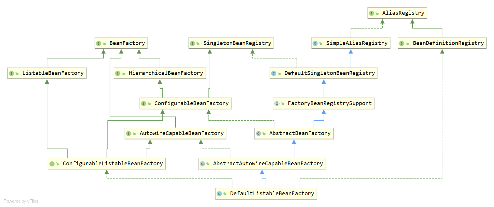
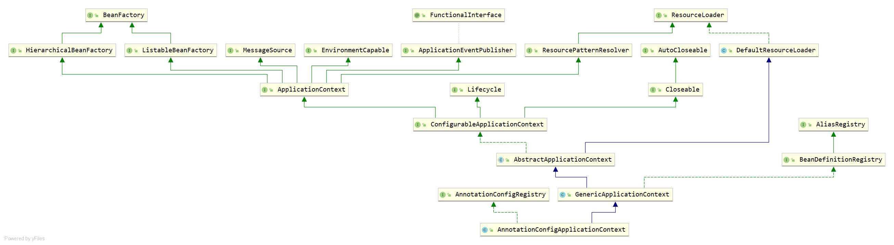

#   Spring 源码解析


Spring包含了很多内容，但最核心的内容是BeanFactory和ApplicationConetxt，而其他的所有内容都是构建这两个基础之上，只有当搞明白了BeanFactory和ApplicationConetxt之后，对于其他的内容就很容易理解了。

下面的源码将基于BeanFactory和ApplicationConetxt的常用实现进行分析，分别对应DefaultListableBeanFactory和AnnotationConfigApplicationContext。

## BeanFactory


DefaultListableBeanFactory的UML类图如下：




主要分为四大块

- `BeanFactory`：Bean工厂
- `SingletonBeanRegistry`：单例Bean注册。通常情况下，Bean的注册都是先由BeanDefinition进行读取（Groovy，Annotation，xml等方式），然后在由getBean()加载Bean。而SingletonBeanRegistry接口提供了通过API注册Bean的的方式。
- `AliasRegistry`：每个Bean都是有别名的。
- `BeanDefinitionRegistry`：Bean定义的注册。通常情况下，Bean的注册都是先由BeanDefinition进行读取，即Groovy，Annotation，xml等方式。

在BeanFactory之下，另外提供了其他功能：

- `ListableBeanFactory`：用于迭代遍历所有的Bean定义的操作。

- `HierarchicalBeanFactory`：BeanFactory之间是有父子级关系的。

- `ConfigurableBeanFactory`：对BeanFactory进行配置。

- `AutowireCapableBeanFactory`：Bean的注入，初始化等操作由该接口提供对应的行为。

- `ConfigurableListableBeanFactory`：


AbstractBeanFactory，AbstractAutowireCapableBeanFactory，DefaultListableBeanFactory基本上实现了所有的接口

- AbstractBeanFactory：实现BeanFactory，HierarchicalBeanFactory以及ConfigurableBeanFactory接口
- AbstractAutowireCapableBeanFactory：所有Bean的创建，获取，初始化，填充，回调等操作都由其完成。
- DefaultListableBeanFactory：

### BeanFactory

```java
public interface BeanFactory {
	String FACTORY_BEAN_PREFIX = "&";

	Object getBean(String name) throws BeansException;
	<T> T getBean(String name, Class<T> requiredType) throws BeansException;
	Object getBean(String name, Object... args) throws BeansException;
	<T> T getBean(Class<T> requiredType) throws BeansException;
	<T> T getBean(Class<T> requiredType, Object... args) throws BeansException;

	<T> ObjectProvider<T> getBeanProvider(Class<T> requiredType);
	<T> ObjectProvider<T> getBeanProvider(ResolvableType requiredType);

	boolean containsBean(String name);

	boolean isSingleton(String name) throws NoSuchBeanDefinitionException;
	boolean isPrototype(String name) throws NoSuchBeanDefinitionException;

	boolean isTypeMatch(String name, ResolvableType typeToMatch) throws NoSuchBeanDefinitionException;
	boolean isTypeMatch(String name, Class<?> typeToMatch) throws NoSuchBeanDefinitionException;

	@Nullable
	Class<?> getType(String name) throws NoSuchBeanDefinitionException;

	String[] getAliases(String name);
}

```


#### ListableBeanFactory

```java
public interface ListableBeanFactory extends BeanFactory {
	boolean containsBeanDefinition(String beanName);
	int getBeanDefinitionCount();
	String[] getBeanDefinitionNames();

	String[] getBeanNamesForType(ResolvableType type);
	String[] getBeanNamesForType(@Nullable Class<?> type);
	String[] getBeanNamesForType(@Nullable Class<?> type, boolean includeNonSingletons, boolean allowEagerInit);

	<T> Map<String, T> getBeansOfType(@Nullable Class<T> type) throws BeansException;
	<T> Map<String, T> getBeansOfType(@Nullable Class<T> type, boolean includeNonSingletons, boolean allowEagerInit)
			throws BeansException;

	String[] getBeanNamesForAnnotation(Class<? extends Annotation> annotationType);
    
	Map<String, Object> getBeansWithAnnotation(Class<? extends Annotation> annotationType) throws BeansException;
    
	@Nullable
	<A extends Annotation> A findAnnotationOnBean(String beanName, Class<A> annotationType) throws NoSuchBeanDefinitionException;

}

```

ListableBeanFactory接口定义了11个抽象方法：

- containsBeanDefinition：判断是否包含指定名称的BeanDefinition。
- getBeanDefinitionCount：获取BeanDefinition的数量。
- getBeanDefinitionNames：获取所有BeanDefinition的名称。
- getBeanNamesForType - (3)：
- getBeansOfType - (2)：
- getBeanNamesForAnnotation：
- getBeansWithAnnotation：
- findAnnotationOnBean：

> ListableBeanFactory的containsBeanDefinition，getBeanDefinitionCount和getBeanDefinitionNames与BeanDefinitionRegistry中的containsBeanDefinition，getBeanDefinitionCount和getBeanDefinitionNames是一样的，它们的实现也是同一个。


#### HierarchicalBeanFactory

HierarchicalBeanFactory接口定义了BeanFactory具有层次结构。

> 可以通过ConfigurableBeanFactory接口中的setParentBeanFactory方法设置父级BeanFactory。

HierarchicalBeanFactory源码如下：

```java
public interface HierarchicalBeanFactory extends BeanFactory {

	@Nullable
	BeanFactory getParentBeanFactory();

	boolean containsLocalBean(String name);
}
```

HierarchicalBeanFactory接口定义了2个抽象方法：

- getParentBeanFactory：获取父级BeanFactory。
- containsLocalBean：判断在当前BeanFactory中是否包含给定名称的bean。注意是当前，判断时将会忽略父级BeanFactory中的Bean（与BeanFactory接口中的containsBean方法差异）。

#### ConfigurableBeanFactory

parentBeanFactory

beanClassLoader

tempClassLoader

cacheBeanMetadata

BeanExpressionResolver

ConversionService


PropertyEditorRegistrar

TypeConverter

BeanPostProcessor

```java
public interface ConfigurableBeanFactory extends HierarchicalBeanFactory, SingletonBeanRegistry {

	String SCOPE_SINGLETON = "singleton";

	String SCOPE_PROTOTYPE = "prototype";

	void setParentBeanFactory(BeanFactory parentBeanFactory) throws IllegalStateException;

	void setBeanClassLoader(@Nullable ClassLoader beanClassLoader);
	@Nullable
	ClassLoader getBeanClassLoader();
	void setTempClassLoader(@Nullable ClassLoader tempClassLoader);
	@Nullable
	ClassLoader getTempClassLoader();
	void setCacheBeanMetadata(boolean cacheBeanMetadata);
	boolean isCacheBeanMetadata();
	void setBeanExpressionResolver(@Nullable BeanExpressionResolver resolver);
	@Nullable
	BeanExpressionResolver getBeanExpressionResolver();
	void setConversionService(@Nullable ConversionService conversionService);
	@Nullable
	ConversionService getConversionService();
//------------------------
	void addPropertyEditorRegistrar(PropertyEditorRegistrar registrar);

	void registerCustomEditor(Class<?> requiredType, Class<? extends PropertyEditor> propertyEditorClass);

	void copyRegisteredEditorsTo(PropertyEditorRegistry registry);

	void setTypeConverter(TypeConverter typeConverter);

	TypeConverter getTypeConverter();

	void addEmbeddedValueResolver(StringValueResolver valueResolver);

	boolean hasEmbeddedValueResolver();

	@Nullable
	String resolveEmbeddedValue(String value); 
    //--------------------

	void addBeanPostProcessor(BeanPostProcessor beanPostProcessor);

	int getBeanPostProcessorCount();

	void registerScope(String scopeName, Scope scope);

	String[] getRegisteredScopeNames();

	@Nullable
	Scope getRegisteredScope(String scopeName);

	AccessControlContext getAccessControlContext();

	void copyConfigurationFrom(ConfigurableBeanFactory otherFactory);

	void registerAlias(String beanName, String alias) throws BeanDefinitionStoreException;

	void resolveAliases(StringValueResolver valueResolver);

	BeanDefinition getMergedBeanDefinition(String beanName) throws NoSuchBeanDefinitionException;

	boolean isFactoryBean(String name) throws NoSuchBeanDefinitionException;

	void setCurrentlyInCreation(String beanName, boolean inCreation);

	boolean isCurrentlyInCreation(String beanName);

	void registerDependentBean(String beanName, String dependentBeanName);

	String[] getDependentBeans(String beanName);

	String[] getDependenciesForBean(String beanName);

	void destroyBean(String beanName, Object beanInstance);

	void destroyScopedBean(String beanName);

	void destroySingletons();
}
```


#### AutowireCapableBeanFactory

```java
public interface AutowireCapableBeanFactory extends BeanFactory {

	int AUTOWIRE_NO = 0;
	int AUTOWIRE_BY_NAME = 1;
	int AUTOWIRE_BY_TYPE = 2;
	int AUTOWIRE_CONSTRUCTOR = 3;
	@Deprecated
	int AUTOWIRE_AUTODETECT = 4;
	String ORIGINAL_INSTANCE_SUFFIX = ".ORIGINAL";

	//-------------------------------------------------------------------------
	// Typical methods for creating and populating external bean instances
	//-------------------------------------------------------------------------

	<T> T createBean(Class<T> beanClass) throws BeansException;

	void autowireBean(Object existingBean) throws BeansException;

	Object configureBean(Object existingBean, String beanName) throws BeansException;


	//-------------------------------------------------------------------------
	// Specialized methods for fine-grained control over the bean lifecycle
	//-------------------------------------------------------------------------

	Object createBean(Class<?> beanClass, int autowireMode, boolean dependencyCheck) throws BeansException;

	Object autowire(Class<?> beanClass, int autowireMode, boolean dependencyCheck) throws BeansException;

	void autowireBeanProperties(Object existingBean, int autowireMode, boolean dependencyCheck)
			throws BeansException;

	void applyBeanPropertyValues(Object existingBean, String beanName) throws BeansException;

	Object initializeBean(Object existingBean, String beanName) throws BeansException;

	Object applyBeanPostProcessorsBeforeInitialization(Object existingBean, String beanName)
			throws BeansException;

	Object applyBeanPostProcessorsAfterInitialization(Object existingBean, String beanName)
			throws BeansException;

	void destroyBean(Object existingBean);


	//-------------------------------------------------------------------------
	// Delegate methods for resolving injection points
	//-------------------------------------------------------------------------

	<T> NamedBeanHolder<T> resolveNamedBean(Class<T> requiredType) throws BeansException;

	Object resolveBeanByName(String name, DependencyDescriptor descriptor) throws BeansException;

	@Nullable
	Object resolveDependency(DependencyDescriptor descriptor, @Nullable String requestingBeanName) throws BeansException;

	@Nullable
	Object resolveDependency(DependencyDescriptor descriptor, @Nullable String requestingBeanName,
			@Nullable Set<String> autowiredBeanNames, @Nullable TypeConverter typeConverter) throws BeansException;

}
```


#### ConfigurableListableBeanFactory

```java
public interface ConfigurableListableBeanFactory
		extends ListableBeanFactory, AutowireCapableBeanFactory, ConfigurableBeanFactory {

	void ignoreDependencyType(Class<?> type);
	void ignoreDependencyInterface(Class<?> ifc);
    
	void registerResolvableDependency(Class<?> dependencyType, @Nullable Object autowiredValue);

	boolean isAutowireCandidate(String beanName, DependencyDescriptor descriptor)
			throws NoSuchBeanDefinitionException;

	BeanDefinition getBeanDefinition(String beanName) throws NoSuchBeanDefinitionException;

	Iterator<String> getBeanNamesIterator();

	void clearMetadataCache();

	void freezeConfiguration();

	boolean isConfigurationFrozen();

	void preInstantiateSingletons() throws BeansException;
}
```

ConfigurableListableBeanFactory接口提供了10个抽象方法：

- ignoreDependencyType：
- ignoreDependencyInterface：
- registerResolvableDependency：
- isAutowireCandidate：
- getBeanDefinition：
- getBeanNamesIterator：
- clearMetadataCache：
- freezeConfiguration：
- isConfigurationFrozen：
- preInstantiateSingletons：


### SingletonBeanRegistry

```java
public interface SingletonBeanRegistry {
	void registerSingleton(String beanName, Object singletonObject);
	@Nullable
	Object getSingleton(String beanName);
	boolean containsSingleton(String beanName);
	String[] getSingletonNames();
	int getSingletonCount();
	Object getSingletonMutex();
}
```

SingletonBeanRegistry接口定义了6个抽象方法：

- `registerSingleton`：注册单例Bean。
- `getSingleton`：获取指定名称的单例Bean。
- `containsSingleton`：判断是否包含指定名称的单例Bean。
- `getSingletonNames`：获取所有单例Bean的名称。
- `getSingletonCount`：获取所有单例Bean的数量。
- `getSingletonMutex`：


#### DefaultSingletonBeanRegistry

SingletonBeanRegistry的主要实现位于DefaultSingletonBeanRegistry，DefaultSingletonBeanRegistry提供了单例Bean的注册和获取。

DefaultSingletonBeanRegistry成员变量：

1. `singletonObjects`：Cache of singleton objects: bean name to bean instance.

2. `singletonFactories`：Cache of singleton factories: bean name to ObjectFactory.

3. `earlySingletonObjects`：Cache of early singleton objects: bean name to bean instance.

4. `registeredSingletons`：Set of registered singletons, containing the bean names in registration order.

5. `singletonsCurrentlyInCreation`：singletonsCurrentlyInCreation

6. `inCreationCheckExclusions`：Names of beans currently excluded from in creation checks.

7. `suppressedExceptions`：List of suppressed Exceptions, available for associating related causes.

8. `singletonsCurrentlyInDestruction`：Flag that indicates whether we're currently within destroySingletons.

9. `disposableBeans`：Disposable bean instances: bean name to disposable instance.

10. `containedBeanMap`：Map between containing bean names: bean name to Set of bean names that the bean contains.

11. `dependentBeanMap`：Map between dependent bean names: bean name to Set of dependent bean names.

12. `dependenciesForBeanMap`：Map between depending bean names: bean name to Set of bean names for the bean's dependencies.

    


### AbstractBeanFactory

在BeanFactory体系中，6个接口有3个被AbstractBeanFactory直接实现，分别是BeanFactory，HierarchicalBeanFactory以及ConfigurableBeanFactory。在AbstractBeanFactory源码中有注释如下：

- Implementation of BeanFactory interface
- Implementation of HierarchicalBeanFactory interface
- Implementation of ConfigurableBeanFactory interface
- Implementation methods
- Abstract methods to be implemented by subclasses

AbstractBeanFactory成员变量：

1. `parentBeanFactory`：Parent bean factory, for bean inheritance support.
2. `beanClassLoader`：ClassLoader to resolve bean class names with, if necessary.
3. `tempClassLoader`：ClassLoader to temporarily resolve bean class names with, if necessary.
4. `cacheBeanMetadata`：Whether to cache bean metadata or rather reobtain it for every access.
5. `beanExpressionResolver`：Resolution strategy for expressions in bean definition values.
6. `conversionService`：Spring ConversionService to use instead of PropertyEditors.
7. `propertyEditorRegistrars`：Custom PropertyEditorRegistrars to apply to the beans of this factory.
8. `customEditors`：Custom PropertyEditors to apply to the beans of this factory.
9. `typeConverter`：A custom TypeConverter to use, overriding the default PropertyEditor mechanism.
10. `embeddedValueResolvers`：String resolvers to apply e.g. to annotation attribute values.
11. `beanPostProcessors`：BeanPostProcessors to apply in createBean.
12. `hasInstantiationAwareBeanPostProcessors`：Indicates whether any InstantiationAwareBeanPostProcessors have been registered.
13. `hasDestructionAwareBeanPostProcessors`：Indicates whether any DestructionAwareBeanPostProcessors have been registered.
14. `scopes`：Map from scope identifier String to corresponding Scope.
15. `securityContextProvider`：Security context used when running with a SecurityManager. 
16. `mergedBeanDefinitions`：Map from bean name to merged RootBeanDefinition.
17. `alreadyCreated`：Names of beans that have already been created at least once.
18. `prototypesCurrentlyInCreation`：Names of beans that are currently in creation.


### AbstractAutowireCapableBeanFactory

创建，自动装配（autowire），应用，初始化，销毁，解析，工厂Bean

1. Typical methods for creating and populating external bean instances用于创建和填充外部bean实例的典型方法  
2. Specialized methods for fine-grained control over the bean lifecycle用于对bean生命周期进行细粒度控制的专用方法  
3. Delegate methods for resolving injection points委托解决注入点的方法  
4. Implementation of relevant AbstractBeanFactory template methods
5. Implementation methods


AbstractAutowireCapableBeanFactory成员变量：

1. `instantiationStrategy`：Strategy for creating bean instances.

2. `parameterNameDiscoverer`：Resolver strategy for method parameter names.

3. `allowCircularReferences`：Whether to automatically try to resolve circular references between beans.

4. `allowRawInjectionDespiteWrapping`：Whether to resort to injecting a raw bean instance in case of circular reference,  even if the injected bean eventually got wrapped.

5. `ignoredDependencyTypes`：Dependency types to ignore on dependency check and autowire, as Set of

    Class objects: for example, String. Default is none.

6. `ignoredDependencyInterfaces`：Dependency interfaces to ignore on dependency check and autowire, as Set of Class objects. By default, only the BeanFactory interface is ignored.

7. `currentlyCreatedBean`：The name of the currently created bean, for implicit dependency registration on getBean etc invocations triggered from a user-specified Supplier callback.

8. `factoryBeanInstanceCache`：Cache of unfinished FactoryBean instances: FactoryBean name to BeanWrapper.

9. `factoryMethodCandidateCache`：Cache of candidate factory methods per factory class.

10. `filteredPropertyDescriptorsCache`：Cache of filtered PropertyDescriptors: bean Class to PropertyDescriptor array.


### DefaultListableBeanFactory

DefaultListableBeanFactory包含如下实现：

- Implementation of remaining BeanFactory methods
- Implementation of ListableBeanFactory interface
- Implementation of ConfigurableListableBeanFactory interface
- Implementation of BeanDefinitionRegistry interface
- Dependency resolution functionality
- Serialization support

DefaultListableBeanFactory包含的成员变量

- `serializationId`：Optional id for this factory, for serialization purposes.
- `allowBeanDefinitionOverriding`：Whether to allow re-registration of a different definition with the same name.默认true
- `allowEagerClassLoading`：Whether to allow eager class loading even for lazy-init beans.默认true
- `dependencyComparator`：Optional OrderComparator for dependency Lists and arrays.
- `autowireCandidateResolver`：Resolver to use for checking if a bean definition is an autowire candidate.
- `resolvableDependencies`：Map from dependency type to corresponding autowired value.
- `beanDefinitionMap`：Map of bean definition objects, keyed by bean name.
- `allBeanNamesByType`：Map of singleton and non-singleton bean names, keyed by dependency type.
- `singletonBeanNamesByType`：Map of singleton-only bean names, keyed by dependency type.
- `beanDefinitionNames`：List of bean definition names, in registration order.
- `manualSingletonNames`：List of names of manually registered singletons, in registration order.
- `frozenBeanDefinitionNames`：Cached array of bean definition names in case of frozen configuration.
- `configurationFrozen`：Whether bean definition metadata may be cached for all beans. 默认false


### AliasRegistry

```java
public interface AliasRegistry {
	void registerAlias(String name, String alias);
	void removeAlias(String alias);
	boolean isAlias(String name);
	String[] getAliases(String name);
}
```

AliasRegistry接口定义了4个抽象方法：

- `registerAlias`：
- `removeAlias`：
- `isAlias`：
- `getAliases`：

​	

#### SimpleAliasRegistry


### BeanDefinitionRegistry

通常情况下，Spring是通过读取Bean定义，然后在通过Bean定义，即BeanDefinition进行Bean的加载。

Bean定义的读取一般可以通过XML，Annotation，Groovy等配置。

BeanFactory内部并不负责BeanDefinition的读取，因为BeanDefinition来源各不相同，只由BeanDefinitionRegistry接口定义，负责BeanDefinition的注册，获取，删除等操作。

```java
public interface BeanDefinitionRegistry extends AliasRegistry {
	void registerBeanDefinition(String beanName, BeanDefinition beanDefinition) throws BeanDefinitionStoreException;
	void removeBeanDefinition(String beanName) throws NoSuchBeanDefinitionException;
	BeanDefinition getBeanDefinition(String beanName) throws NoSuchBeanDefinitionException;
	boolean containsBeanDefinition(String beanName);
	String[] getBeanDefinitionNames();
	int getBeanDefinitionCount();
	boolean isBeanNameInUse(String beanName);
}
```

`BeanDefinitionRegistry`接口定义了7个抽象方法：

- `registerBeanDefinition`：注册BeanDefinition。
- `removeBeanDefinition`：删除BeanDefinition。
- `getBeanDefinition`：获取BeanDefinition。
- `containsBeanDefinition`：判断是否包含指定名称的BeanDefinition。
- `getBeanDefinitionNames`：获取所有BeanDefinition的名称。
- `getBeanDefinitionCount`：获取BeanDefinition的数量。
- `isBeanNameInUse`：


### FactoryBeanRegistrySupport

FactoryBeanRegistrySupport提供了对FactoryBean注册的支持，通过FactoryBean创建好的Bean实例也存放在FactoryBeanRegistrySupport中，FactoryBeanRegistrySupport只有一个成员变量factoryBeanObjectCache，是一个Map集合，Bean实例就存放在其中。


## ApplicationConetxt


AnnotationConfigApplicationContext的UML类图如下：




主要分为五大块：

- `BeanFactory`：

- `MessageSource`：

- `EnvironmentCapable`：

- `ApplicationEventPublisher`：

- `ResourceLoader`：

- `ApplicationContext`：

- `Lifecycle`：

- `AliasRegistry`：

- `BeanDefinitionRegistry`：

  

基于AnnotationConfigApplicationContext的类图，有具体实现的类只有4个，大部分都是接口。其中DefaultResourceLoader还是与资源加载相关的， 也就是说ApplicationContext体系的主要实现都在AbstractApplicationContext，GenericApplicationContext和AnnotationConfigApplicationContext中，如果排除AnnotationConfigApplicationContext这个具有明显指向性的类，那么就只有AbstractApplicationContext和GenericApplicationContext去完成ApplicationContext的核心功能了。


### AbstractApplicationContext

在AbstractApplicationContext中实现了除AliasRegistry和BeanDefinitionRegistry之外的所有接口，


1. Implementation of ApplicationContext interface
2. Implementation of ConfigurableApplicationContext interface
3. Implementation of BeanFactory interface
4. Implementation of ListableBeanFactory interface
5. Implementation of HierarchicalBeanFactory interface
6. Implementation of MessageSource interface
7. Implementation of ResourcePatternResolver interface
8. Implementation of Lifecycle interface
9. Abstract methods that must be implemented by subclasses


### GenericApplicationContext

1. ResourceLoader / ResourcePatternResolver override if necessary
2. Implementations of AbstractApplicationContext's template methods
3. Implementation of BeanDefinitionRegistry
4. Convenient methods for registering individual beans


## BeanFactory与FactoryBean


## BeanFactory与ApplicationContext


```java
@Override
public void refresh() throws BeansException, IllegalStateException {
    synchronized (this.startupShutdownMonitor) {
        // Prepare this context for refreshing.
        prepareRefresh();
		//初始化BeanFactory
        // Tell the subclass to refresh the internal bean factory.
        ConfigurableListableBeanFactory beanFactory = obtainFreshBeanFactory();
        // Prepare the bean factory for use in this context.
        prepareBeanFactory(beanFactory);
        try {
            // Allows post-processing of the bean factory in context subclasses.
            postProcessBeanFactory(beanFactory);
			//调用Bean工厂后处理器
            // Invoke factory processors registered as beans in the context.
            invokeBeanFactoryPostProcessors(beanFactory);
			//注册Bean后处理器
            // Register bean processors that intercept bean creation.
            registerBeanPostProcessors(beanFactory);
			//初始化消息源
            // Initialize message source for this context.
            initMessageSource();
			//初始化应用上下文事件广播器
            // Initialize event multicaster for this context.
            initApplicationEventMulticaster();
			//初始化其他特殊Bean，由具体子类实现
            // Initialize other special beans in specific context subclasses.
            onRefresh();
			//检查监听器Bean，并注册它们
            // Check for listener beans and register them.
            registerListeners();
			//实例化所有剩余的单实例Bean（懒加载除外）
            // Instantiate all remaining (non-lazy-init) singletons.
            finishBeanFactoryInitialization(beanFactory);
			//最后一步：发布相应的事件
            // Last step: publish corresponding event.
            finishRefresh();
        } catch (BeansException ex) {
            if (logger.isWarnEnabled()) {
                logger.warn("Exception encountered during context initialization - " +
                            "cancelling refresh attempt: " + ex);
            }
            // Destroy already created singletons to avoid dangling resources.
            destroyBeans();
            // Reset 'active' flag.
            cancelRefresh(ex);
            // Propagate exception to caller.
            throw ex;
        } finally {
            // Reset common introspection caches in Spring's core, since we
            // might not ever need metadata for singleton beans anymore...
            resetCommonCaches();
        }
    }
}
```


## Spring IOC启动

### 为Refresh准备上下文


```java
protected void prepareRefresh() {
    // Switch to active.
    this.startupDate = System.currentTimeMillis();
    this.closed.set(false);
    this.active.set(true);

    if (logger.isDebugEnabled()) {
        if (logger.isTraceEnabled()) {
            logger.trace("Refreshing " + this);
        }
        else {
            logger.debug("Refreshing " + getDisplayName());
        }
    }

    // Initialize any placeholder property sources in the context environment.
    initPropertySources();

    // Validate that all properties marked as required are resolvable:
    // see ConfigurablePropertyResolver#setRequiredProperties
    getEnvironment().validateRequiredProperties();

    // Store pre-refresh ApplicationListeners...
    if (this.earlyApplicationListeners == null) {
        this.earlyApplicationListeners = new LinkedHashSet<>(this.applicationListeners);
    }
    else {
        // Reset local application listeners to pre-refresh state.
        this.applicationListeners.clear();
        this.applicationListeners.addAll(this.earlyApplicationListeners);
    }

    // Allow for the collection of early ApplicationEvents,
    // to be published once the multicaster is available...
    this.earlyApplicationEvents = new LinkedHashSet<>();
}
```

### 创建BeanFactory

### 准备BeanFactory


```java
protected void prepareBeanFactory(ConfigurableListableBeanFactory beanFactory) {
    // Tell the internal bean factory to use the context's class loader etc.
    beanFactory.setBeanClassLoader(getClassLoader());
    if (!shouldIgnoreSpel) {
        beanFactory.setBeanExpressionResolver(new StandardBeanExpressionResolver(beanFactory.getBeanClassLoader()));
    }
    beanFactory.addPropertyEditorRegistrar(new ResourceEditorRegistrar(this, getEnvironment()));

    // Configure the bean factory with context callbacks.
    beanFactory.addBeanPostProcessor(new ApplicationContextAwareProcessor(this));
    beanFactory.ignoreDependencyInterface(EnvironmentAware.class);
    beanFactory.ignoreDependencyInterface(EmbeddedValueResolverAware.class);
    beanFactory.ignoreDependencyInterface(ResourceLoaderAware.class);
    beanFactory.ignoreDependencyInterface(ApplicationEventPublisherAware.class);
    beanFactory.ignoreDependencyInterface(MessageSourceAware.class);
    beanFactory.ignoreDependencyInterface(ApplicationContextAware.class);
    beanFactory.ignoreDependencyInterface(ApplicationStartupAware.class);

    // BeanFactory interface not registered as resolvable type in a plain factory.
    // MessageSource registered (and found for autowiring) as a bean.
    beanFactory.registerResolvableDependency(BeanFactory.class, beanFactory);
    beanFactory.registerResolvableDependency(ResourceLoader.class, this);
    beanFactory.registerResolvableDependency(ApplicationEventPublisher.class, this);
    beanFactory.registerResolvableDependency(ApplicationContext.class, this);

    // Register early post-processor for detecting inner beans as ApplicationListeners.
    beanFactory.addBeanPostProcessor(new ApplicationListenerDetector(this));

    // Detect a LoadTimeWeaver and prepare for weaving, if found.
    if (!NativeDetector.inNativeImage() && beanFactory.containsBean(LOAD_TIME_WEAVER_BEAN_NAME)) {
        beanFactory.addBeanPostProcessor(new LoadTimeWeaverAwareProcessor(beanFactory));
        // Set a temporary ClassLoader for type matching.
        beanFactory.setTempClassLoader(new ContextTypeMatchClassLoader(beanFactory.getBeanClassLoader()));
    }

    // Register default environment beans.
    if (!beanFactory.containsLocalBean(ENVIRONMENT_BEAN_NAME)) {
        beanFactory.registerSingleton(ENVIRONMENT_BEAN_NAME, getEnvironment());
    }
    if (!beanFactory.containsLocalBean(SYSTEM_PROPERTIES_BEAN_NAME)) {
        beanFactory.registerSingleton(SYSTEM_PROPERTIES_BEAN_NAME, getEnvironment().getSystemProperties());
    }
    if (!beanFactory.containsLocalBean(SYSTEM_ENVIRONMENT_BEAN_NAME)) {
        beanFactory.registerSingleton(SYSTEM_ENVIRONMENT_BEAN_NAME, getEnvironment().getSystemEnvironment());
    }
    if (!beanFactory.containsLocalBean(APPLICATION_STARTUP_BEAN_NAME)) {
        beanFactory.registerSingleton(APPLICATION_STARTUP_BEAN_NAME, getApplicationStartup());
    }
}
```


1. 注册默认的环境Bean
   1. 注册Environment。
   2. 注册系统属性Bean。
   3. 注册系统环境变量Bean。
   4. 注册应用程序启动指标Bean。


## Environment


## BeanFactoryPostProcessor


## BeanPostProcessor

### 注册BeanPostProcessor


```java
/**
	 * Instantiate and register all BeanPostProcessor beans,
	 实例化并注册所有BeanPostProcessor bean，
	 * respecting explicit order if given.
	 如果给出显式顺序，则要尊重它。
	 * <p>Must be called before any instantiation of application beans.
	 必须在应用程序bean的任何实例化之前调用。
	 */
protected void registerBeanPostProcessors(ConfigurableListableBeanFactory beanFactory) {
    PostProcessorRegistrationDelegate.registerBeanPostProcessors(beanFactory, this);
}
```


```java
public static void registerBeanPostProcessors(
    ConfigurableListableBeanFactory beanFactory, AbstractApplicationContext applicationContext) {

    String[] postProcessorNames = beanFactory.getBeanNamesForType(BeanPostProcessor.class, true, false);

    // Register BeanPostProcessorChecker that logs an info message when
    // a bean is created during BeanPostProcessor instantiation, i.e. when
    // a bean is not eligible for getting processed by all BeanPostProcessors.
    //注册BeanPostProcessorChecker，当bean在BeanPostProcessor实例化过程中被创建时，
    //即当一个bean没有资格被所有BeanPostProcessor处理时，它记录一条信息消息。
    int beanProcessorTargetCount = beanFactory.getBeanPostProcessorCount() + 1 + postProcessorNames.length;
    beanFactory.addBeanPostProcessor(new BeanPostProcessorChecker(beanFactory, beanProcessorTargetCount));

    // Separate between BeanPostProcessors that implement PriorityOrdered,
    //在实现优先排序、有序的beanpostprocessor和其他处理器之间进行分离。
    // Ordered, and the rest.
    //使用PriorityOrdered保证顺序
    List<BeanPostProcessor> priorityOrderedPostProcessors = new ArrayList<>();
    //MergedBeanDefinitionPostProcessor
    List<BeanPostProcessor> internalPostProcessors = new ArrayList<>();
    //使用Ordered保证顺序
    List<String> orderedPostProcessorNames = new ArrayList<>();
    //无序BeanPostProcessor
    List<String> nonOrderedPostProcessorNames = new ArrayList<>();
    for (String ppName : postProcessorNames) {
        if (beanFactory.isTypeMatch(ppName, PriorityOrdered.class)) {
            BeanPostProcessor pp = beanFactory.getBean(ppName, BeanPostProcessor.class);
            priorityOrderedPostProcessors.add(pp);
            if (pp instanceof MergedBeanDefinitionPostProcessor) {
                internalPostProcessors.add(pp);
            }
        }
        else if (beanFactory.isTypeMatch(ppName, Ordered.class)) {
            orderedPostProcessorNames.add(ppName);
        }
        else {
            nonOrderedPostProcessorNames.add(ppName);
        }
    }

    // First, register the BeanPostProcessors that implement PriorityOrdered.
    //第一步，注册所有实现PriorityOrdered的BeanPostProcessor。
    sortPostProcessors(priorityOrderedPostProcessors, beanFactory);
    registerBeanPostProcessors(beanFactory, priorityOrderedPostProcessors);

    // Next, register the BeanPostProcessors that implement Ordered.
    //第二步，注册所有实现Ordered的BeanPostProcessor。
    List<BeanPostProcessor> orderedPostProcessors = new ArrayList<>();
    for (String ppName : orderedPostProcessorNames) {
        BeanPostProcessor pp = beanFactory.getBean(ppName, BeanPostProcessor.class);
        orderedPostProcessors.add(pp);
        if (pp instanceof MergedBeanDefinitionPostProcessor) {
            internalPostProcessors.add(pp);
        }
    }
    sortPostProcessors(orderedPostProcessors, beanFactory);
    registerBeanPostProcessors(beanFactory, orderedPostProcessors);

    // Now, register all regular BeanPostProcessors.
    //第三步，注册所有无序的BeanPostProcessor。
    List<BeanPostProcessor> nonOrderedPostProcessors = new ArrayList<>();
    for (String ppName : nonOrderedPostProcessorNames) {
        BeanPostProcessor pp = beanFactory.getBean(ppName, BeanPostProcessor.class);
        nonOrderedPostProcessors.add(pp);
        if (pp instanceof MergedBeanDefinitionPostProcessor) {
            internalPostProcessors.add(pp);
        }
    }
    registerBeanPostProcessors(beanFactory, nonOrderedPostProcessors);

    // Finally, re-register all internal BeanPostProcessors.
    //第四部，注册所有MergedBeanDefinitionPostProcessor类型的BeanPostProcessor。
    sortPostProcessors(internalPostProcessors, beanFactory);
    registerBeanPostProcessors(beanFactory, internalPostProcessors);

    // Re-register post-processor for detecting inner beans as ApplicationListeners,
    // moving it to the end of the processor chain (for picking up proxies etc).
    //添加ApplicationListener探测器
    beanFactory.addBeanPostProcessor(new ApplicationListenerDetector(applicationContext));
}
```


## MessageSource


## ApplicationEvent


## ApplicationListener


  


# Bean的加载

AbstractBeanFactory

```java
/**
	 * Return an instance, which may be shared or independent, of the specified bean.
	 * @param name the name of the bean to retrieve
	 * @param requiredType the required type of the bean to retrieve
	 * @param args arguments to use when creating a bean instance using explicit arguments
	 * (only applied when creating a new instance as opposed to retrieving an existing one)
	 * @param typeCheckOnly whether the instance is obtained for a type check,
	 * not for actual use
	 * @return an instance of the bean
	 * @throws BeansException if the bean could not be created
	 */
@SuppressWarnings("unchecked")
protected <T> T doGetBean(final String name, @Nullable final Class<T> requiredType,
                          @Nullable final Object[] args, boolean typeCheckOnly) throws BeansException {
    //提取对应的BeanName
    final String beanName = transformedBeanName(name);
    Object bean;

    /**
     * 检查缓存中或者实例工厂中是否有对应的实例
     * 为什么会首先使用这段代码呢？
     * 因为在创建单例bean的时候会存在依赖注入的情况，而在创建依赖的时候为了避免循环依赖，
     * Spring创建bean的原则是不等bean创建完成就会创建bean的ObjectFactory提早曝光，
     * 也就是将ObjectFactory加入到缓存中，一旦下个bean创建的时候依赖上个bean则直接使用ObjectFactory。
     */
    //直接尝试从缓存获取或者或者singletonFactories中的ObjectFactory获取
    // Eagerly check singleton cache for manually registered singletons.
    Object sharedInstance = getSingleton(beanName);
    if (sharedInstance != null && args == null) {
        if (logger.isTraceEnabled()) {
            if (isSingletonCurrentlyInCreation(beanName)) {
                logger.trace("Returning eagerly cached instance of singleton bean '" + beanName +
                             "' that is not fully initialized yet - a consequence of a circular reference");
            }
            else {
                logger.trace("Returning cached instance of singleton bean '" + beanName + "'");
            }
        }
        //返回对应的实例，有时候存在诸如BeanFactory的情况并不是直接返回实例本身，
        //而是返回指定方法返回的实例。
        bean = getObjectForBeanInstance(sharedInstance, name, beanName, null);
    }

    else {
        //只有在单例情况才会尝试解决循环依赖，原型模式情况下，如果存在A中有B的属性，B中有A的属性，
        //那么当依赖注入的时候，就会产生当A还未创建完的时候因为对于B的创建再次返回创建A，造成循环
        //依赖，也就是下面的情况。
        // Fail if we're already creating this bean instance:
        // We're assumably within a circular reference.
        if (isPrototypeCurrentlyInCreation(beanName)) {
            throw new BeanCurrentlyInCreationException(beanName);
        }

        // Check if bean definition exists in this factory.
        BeanFactory parentBeanFactory = getParentBeanFactory();
        //如果beanDefinitionMap中，也就是在所有已经加载的类中不包括beanName，则尝试从
        //parentBeanFactory中检测
        if (parentBeanFactory != null && !containsBeanDefinition(beanName)) {
            // Not found -> check parent.
            String nameToLookup = originalBeanName(name);
            if (parentBeanFactory instanceof AbstractBeanFactory) {
                return ((AbstractBeanFactory) parentBeanFactory).doGetBean(
                    nameToLookup, requiredType, args, typeCheckOnly);
            }
            else if (args != null) {
                //递归到BeanFactory中寻找
                // Delegation to parent with explicit args.
                return (T) parentBeanFactory.getBean(nameToLookup, args);
            }
            else if (requiredType != null) {
                // No args -> delegate to standard getBean method.
                return parentBeanFactory.getBean(nameToLookup, requiredType);
            }
            else {
                return (T) parentBeanFactory.getBean(nameToLookup);
            }
        }
        //如果不是仅仅做类型检查，则是创建bean，这里要进行记录
        if (!typeCheckOnly) {
            markBeanAsCreated(beanName);
        }

        try {
            //将存储XML配置文件的转换为RootBeanDefinition，
            //如果指定beanName是子bean的话同时会合并父类的相关属性
            final RootBeanDefinition mbd = getMergedLocalBeanDefinition(beanName);
            checkMergedBeanDefinition(mbd, beanName, args);

            // Guarantee initialization of beans that the current bean depends on.
            String[] dependsOn = mbd.getDependsOn();
            //若存在依赖，则需要递归实例化依赖的bean
            if (dependsOn != null) {
                for (String dep : dependsOn) {
                    if (isDependent(beanName, dep)) {
                        throw new BeanCreationException(mbd.getResourceDescription(), beanName,
                                                        "Circular depends-on relationship between '" + beanName + "' and '" + dep + "'");
                    }
                    //缓存依赖调用
                    registerDependentBean(dep, beanName);
                    try {
                        getBean(dep);
                    }
                    catch (NoSuchBeanDefinitionException ex) {
                        throw new BeanCreationException(mbd.getResourceDescription(), beanName,
                                                        "'" + beanName + "' depends on missing bean '" + dep + "'", ex);
                    }
                }
            }
            //实例化依赖的bean后便可以实例化mbd本身了
            // Create bean instance.
            //singleton模式创建
            if (mbd.isSingleton()) {
                sharedInstance = getSingleton(beanName, () -> {
                    try {
                        return createBean(beanName, mbd, args);
                    }
                    catch (BeansException ex) {
                        // Explicitly remove instance from singleton cache: It might have been put there
                        // eagerly by the creation process, to allow for circular reference resolution.
                        // Also remove any beans that received a temporary reference to the bean.
                        destroySingleton(beanName);
                        throw ex;
                    }
                });
                bean = getObjectForBeanInstance(sharedInstance, name, beanName, mbd);
            }
            //prototype模式创建
            else if (mbd.isPrototype()) {
                // It's a prototype -> create a new instance.
                Object prototypeInstance = null;
                try {
                    beforePrototypeCreation(beanName);
                    prototypeInstance = createBean(beanName, mbd, args);
                }
                finally {
                    afterPrototypeCreation(beanName);
                }
                bean = getObjectForBeanInstance(prototypeInstance, name, beanName, mbd);
            }
            //指定的scope上实例化bean
            else {
                String scopeName = mbd.getScope();
                final Scope scope = this.scopes.get(scopeName);
                if (scope == null) {
                    throw new IllegalStateException("No Scope registered for scope name '" + scopeName + "'");
                }
                try {
                    Object scopedInstance = scope.get(beanName, () -> {
                        beforePrototypeCreation(beanName);
                        try {
                            return createBean(beanName, mbd, args);
                        }
                        finally {
                            afterPrototypeCreation(beanName);
                        }
                    });
                    bean = getObjectForBeanInstance(scopedInstance, name, beanName, mbd);
                }
                catch (IllegalStateException ex) {
                    throw new BeanCreationException(beanName,
                                                    "Scope '" + scopeName + "' is not active for the current thread; consider " +
                                                    "defining a scoped proxy for this bean if you intend to refer to it from a singleton",
                                                    ex);
                }
            }
        }
        catch (BeansException ex) {
            cleanupAfterBeanCreationFailure(beanName);
            throw ex;
        }
    }
    //检查需要的类型是否符合bean的实际类型
    // Check if required type matches the type of the actual bean instance.
    if (requiredType != null && !requiredType.isInstance(bean)) {
        try {
            T convertedBean = getTypeConverter().convertIfNecessary(bean, requiredType);
            if (convertedBean == null) {
                throw new BeanNotOfRequiredTypeException(name, requiredType, bean.getClass());
            }
            return convertedBean;
        }
        catch (TypeMismatchException ex) {
            if (logger.isTraceEnabled()) {
                logger.trace("Failed to convert bean '" + name + "' to required type '" +
                             ClassUtils.getQualifiedName(requiredType) + "'", ex);
            }
            throw new BeanNotOfRequiredTypeException(name, requiredType, bean.getClass());
        }
    }
    return (T) bean;
}
```


## 缓存中获取单例Bean


```java
@Override
@Nullable
public Object getSingleton(String beanName) {
    //参数true设置标识允许早期依赖
    return getSingleton(beanName, true);
}

/**
	 * Return the (raw) singleton object registered under the given name.
	 * <p>Checks already instantiated singletons and also allows for an early
	 * reference to a currently created singleton (resolving a circular reference).
	 * @param beanName the name of the bean to look for
	 * @param allowEarlyReference whether early references should be created or not
	 * @return the registered singleton object, or {@code null} if none found
	 */
@Nullable
protected Object getSingleton(String beanName, boolean allowEarlyReference) {
    //检查缓存中是否存在实例
    Object singletonObject = this.singletonObjects.get(beanName);
    if (singletonObject == null && isSingletonCurrentlyInCreation(beanName)) {
        //如果为空，则锁定全局变量并进行处理
        synchronized (this.singletonObjects) {
            //如果此Bean正在加载，则不处理
            singletonObject = this.earlySingletonObjects.get(beanName);
            if (singletonObject == null && allowEarlyReference) {
                //当某些方法需要提前初始化的时候会调用addSingletonFactory方法将对应的
                //ObjectFactory初始化策略存储在singletonFactories
                ObjectFactory<?> singletonFactory = this.singletonFactories.get(beanName);
                if (singletonFactory != null) {
                    //调用预先设定的getObject方法
                    singletonObject = singletonFactory.getObject();
                    //记录在缓存中，earlySingletonObjects和singletonFactories互斥
                    this.earlySingletonObjects.put(beanName, singletonObject);
                    this.singletonFactories.remove(beanName);
                }
            }
        }
    }
    return singletonObject;
}
```


- `singletonObjects`：用于保存BeanName和创建Bean实例之间的关系，bean name—> bean instance。
- `singletonFactories`：用于保存BeanName和创建Bean工厂之间的关系，bean name—> ObjectFactory。
- `earlySingletonObjects`：也是保存BeanName和创建Bean实例之间的关系，与singletonObjects的不同之处在于，当一个单例Bean被放到里面后，那么当Bean还在创建过程中，就可以通过getBean方法获取到了，其目的是用来检测循环引用。
- `registeredSingletons`：用来保存当前所有已注册的Bean。


## 从Bean的实例中获取对象

```java
/**
	 * Get the object for the given bean instance, either the bean
	 * instance itself or its created object in case of a FactoryBean.
	 * @param beanInstance the shared bean instance
	 * @param name name that may include factory dereference prefix
	 * @param beanName the canonical bean name
	 * @param mbd the merged bean definition
	 * @return the object to expose for the bean
	 */
protected Object getObjectForBeanInstance(
    Object beanInstance, String name, String beanName, @Nullable RootBeanDefinition mbd) {
	//如果指定的name是工厂相关（以&为前缀）且beanInstance又不是FactoryBean类型，则验证不通过
    // Don't let calling code try to dereference the factory if the bean isn't a factory.
    if (BeanFactoryUtils.isFactoryDereference(name)) {
        if (beanInstance instanceof NullBean) {
            return beanInstance;
        }
        if (!(beanInstance instanceof FactoryBean)) {
            throw new BeanIsNotAFactoryException(beanName, beanInstance.getClass());
        }
    }
	
    //现在我们有了Bean实例（beanInstance），这个实例可能会是正常的bean或者是FactoryBean。
    //使用是FactoryBean，我们使用它创建实例，但是如果用户想要直接获取工厂实例而不是工厂的getObject
    //方法对应的实例，那么传入的name应该添加前缀&。
    // Now we have the bean instance, which may be a normal bean or a FactoryBean.
    // If it's a FactoryBean, we use it to create a bean instance, unless the
    // caller actually wants a reference to the factory.
    if (!(beanInstance instanceof FactoryBean) || BeanFactoryUtils.isFactoryDereference(name)) {
        return beanInstance;
    }
	//加载FactoryBean
    Object object = null;
    if (mbd == null) {
        //尝试从缓存中加载Bean
        object = getCachedObjectForFactoryBean(beanName);
    }
    if (object == null) {
        //到这里已经明确知道beanInstance一定是FactoryBean类型
        // Return bean instance from factory.
        FactoryBean<?> factory = (FactoryBean<?>) beanInstance;
        //containsBeanDefinition检测beanDefinitionMap中，
        //也就是在所有已加载的类中检测是否定义beanName
        // Caches object obtained from FactoryBean if it is a singleton.
        if (mbd == null && containsBeanDefinition(beanName)) {
            //将存储XML配置文件的转换为RootBeanDefinition，
            //如果指定beanName是子bean的话同时会合并父类的相关属性
            mbd = getMergedLocalBeanDefinition(beanName);
        }
        //是否是用户定义的而不是应用程序本身定义的
        boolean synthetic = (mbd != null && mbd.isSynthetic());
        object = getObjectFromFactoryBean(factory, beanName, !synthetic);
    }
    return object;
}
```


FactoryBeanRegistrySupport

```java
/**
	 * Obtain an object to expose from the given FactoryBean.
	 * @param factory the FactoryBean instance
	 * @param beanName the name of the bean
	 * @param shouldPostProcess whether the bean is subject to post-processing
	 * @return the object obtained from the FactoryBean
	 * @throws BeanCreationException if FactoryBean object creation failed
	 * @see org.springframework.beans.factory.FactoryBean#getObject()
	 */
protected Object getObjectFromFactoryBean(FactoryBean<?> factory, String beanName, boolean shouldPostProcess) {
    if (factory.isSingleton() && containsSingleton(beanName)) {
        synchronized (getSingletonMutex()) {
            Object object = this.factoryBeanObjectCache.get(beanName);
            if (object == null) {
                object = doGetObjectFromFactoryBean(factory, beanName);
                // Only post-process and store if not put there already during getObject() call above
                // (e.g. because of circular reference processing triggered by custom getBean calls)
                Object alreadyThere = this.factoryBeanObjectCache.get(beanName);
                if (alreadyThere != null) {
                    object = alreadyThere;
                }
                else {
                    if (shouldPostProcess) {
                        if (isSingletonCurrentlyInCreation(beanName)) {
                            // Temporarily return non-post-processed object, not storing it yet..
                            return object;
                        }
                        beforeSingletonCreation(beanName);
                        try {
                            //调用ObjectFactory的后处理器
                            object = postProcessObjectFromFactoryBean(object, beanName);
                        }
                        catch (Throwable ex) {
                            throw new BeanCreationException(beanName,
                                                            "Post-processing of FactoryBean's singleton object failed", ex);
                        }
                        finally {
                            afterSingletonCreation(beanName);
                        }
                    }
                    if (containsSingleton(beanName)) {
                        this.factoryBeanObjectCache.put(beanName, object);
                    }
                }
            }
            return object;
        }
    }
    else {
        Object object = doGetObjectFromFactoryBean(factory, beanName);
        if (shouldPostProcess) {
            try {
                object = postProcessObjectFromFactoryBean(object, beanName);
            }
            catch (Throwable ex) {
                throw new BeanCreationException(beanName, "Post-processing of FactoryBean's object failed", ex);
            }
        }
        return object;
    }
}
```


FactoryBeanRegistrySupport

```java
/**
	 * Obtain an object to expose from the given FactoryBean.
	 * @param factory the FactoryBean instance
	 * @param beanName the name of the bean
	 * @return the object obtained from the FactoryBean
	 * @throws BeanCreationException if FactoryBean object creation failed
	 * @see org.springframework.beans.factory.FactoryBean#getObject()
	 */
private Object doGetObjectFromFactoryBean(final FactoryBean<?> factory, final String beanName)
    throws BeanCreationException {

    Object object;
    try {
        //需要权限验证
        if (System.getSecurityManager() != null) {
            AccessControlContext acc = getAccessControlContext();
            try {
                object = AccessController.doPrivileged((PrivilegedExceptionAction<Object>) factory::getObject, acc);
            }
            catch (PrivilegedActionException pae) {
                throw pae.getException();
            }
        }
        else {
            //直接调用getObject方法
            object = factory.getObject();
        }
    }
    catch (FactoryBeanNotInitializedException ex) {
        throw new BeanCurrentlyInCreationException(beanName, ex.toString());
    }
    catch (Throwable ex) {
        throw new BeanCreationException(beanName, "FactoryBean threw exception on object creation", ex);
    }

    // Do not accept a null value for a FactoryBean that's not fully
    // initialized yet: Many FactoryBeans just return null then.
    if (object == null) {
        if (isSingletonCurrentlyInCreation(beanName)) {
            throw new BeanCurrentlyInCreationException(
                beanName, "FactoryBean which is currently in creation returned null from getObject");
        }
        object = new NullBean();
    }
    return object;
}
```


## 获取单例

```java
/**
	 * Return the (raw) singleton object registered under the given name,
	 * creating and registering a new one if none registered yet.
	 * @param beanName the name of the bean
	 * @param singletonFactory the ObjectFactory to lazily create the singleton
	 * with, if necessary
	 * @return the registered singleton object
	 */
public Object getSingleton(String beanName, ObjectFactory<?> singletonFactory) {
    Assert.notNull(beanName, "Bean name must not be null");
    //全局变量，需要同步
    synchronized (this.singletonObjects) {
        //首先检查对应的Bean是否已经记载过，因为singleton模式其实就是复用以前创建的bean，
        //所以这一步是必须的
        Object singletonObject = this.singletonObjects.get(beanName);
        if (singletonObject == null) {
            if (this.singletonsCurrentlyInDestruction) {
                throw new BeanCreationNotAllowedException(beanName,
                                                          "Singleton bean creation not allowed while singletons of this factory are in destruction " +
                                                          "(Do not request a bean from a BeanFactory in a destroy method implementation!)");
            }
            if (logger.isDebugEnabled()) {
                logger.debug("Creating shared instance of singleton bean '" + beanName + "'");
            }
            beforeSingletonCreation(beanName);
            boolean newSingleton = false;
            boolean recordSuppressedExceptions = (this.suppressedExceptions == null);
            if (recordSuppressedExceptions) {
                this.suppressedExceptions = new LinkedHashSet<>();
            }
            try {
                //初始化bean
                singletonObject = singletonFactory.getObject();
                newSingleton = true;
            }
            catch (IllegalStateException ex) {
                // Has the singleton object implicitly appeared in the meantime ->
                // if yes, proceed with it since the exception indicates that state.
                singletonObject = this.singletonObjects.get(beanName);
                if (singletonObject == null) {
                    throw ex;
                }
            }
            catch (BeanCreationException ex) {
                if (recordSuppressedExceptions) {
                    for (Exception suppressedException : this.suppressedExceptions) {
                        ex.addRelatedCause(suppressedException);
                    }
                }
                throw ex;
            }
            finally {
                if (recordSuppressedExceptions) {
                    this.suppressedExceptions = null;
                }
                afterSingletonCreation(beanName);
            }
            if (newSingleton) {
                //加入缓存
                addSingleton(beanName, singletonObject);
            }
        }
        return singletonObject;
    }
}
```

## 准备创建Bean

```java
/**
	 * Central method of this class: creates a bean instance,
	 * populates the bean instance, applies post-processors, etc.
	 * @see #doCreateBean
	 */
@Override
protected Object createBean(String beanName, RootBeanDefinition mbd, @Nullable Object[] args)
    throws BeanCreationException {

    if (logger.isTraceEnabled()) {
        logger.trace("Creating instance of bean '" + beanName + "'");
    }
    RootBeanDefinition mbdToUse = mbd;

    //锁定Class，根据设置的class属性或者根据className来解析Class
    // Make sure bean class is actually resolved at this point, and
    // clone the bean definition in case of a dynamically resolved Class
    // which cannot be stored in the shared merged bean definition.
    Class<?> resolvedClass = resolveBeanClass(mbd, beanName);
    if (resolvedClass != null && !mbd.hasBeanClass() && mbd.getBeanClassName() != null) {
        mbdToUse = new RootBeanDefinition(mbd);
        mbdToUse.setBeanClass(resolvedClass);
    }

    // Prepare method overrides.
    try {
        //验证及准备覆盖的方法
        mbdToUse.prepareMethodOverrides();
    }
    catch (BeanDefinitionValidationException ex) {
        throw new BeanDefinitionStoreException(mbdToUse.getResourceDescription(),
                                               beanName, "Validation of method overrides failed", ex);
    }

    try {
        //给BeanPostProcessors一个机会来返回代理来代替真正的实例
        // Give BeanPostProcessors a chance to return a proxy instead of the target bean instance.
        Object bean = resolveBeforeInstantiation(beanName, mbdToUse);
        if (bean != null) {
            return bean;
        }
    }
    catch (Throwable ex) {
        throw new BeanCreationException(mbdToUse.getResourceDescription(), beanName,
                                        "BeanPostProcessor before instantiation of bean failed", ex);
    }

    try {
        Object beanInstance = doCreateBean(beanName, mbdToUse, args);
        if (logger.isTraceEnabled()) {
            logger.trace("Finished creating instance of bean '" + beanName + "'");
        }
        return beanInstance;
    }
    catch (BeanCreationException | ImplicitlyAppearedSingletonException ex) {
        // A previously detected exception with proper bean creation context already,
        // or illegal singleton state to be communicated up to DefaultSingletonBeanRegistry.
        throw ex;
    }
    catch (Throwable ex) {
        throw new BeanCreationException(
            mbdToUse.getResourceDescription(), beanName, "Unexpected exception during bean creation", ex);
    }
}
```


1. 根据设置的class属性或者根据className来解析Class。
2. 对override属性进行标记及验证。
3. 应用初始化前的后处理器，解析指定bean是否存在初始化前的短路操作。
4. 创建bean。


### 处理override属性


源码位置：

BeanDefinition系列中的`AbstractBeanDefinition`中。

源码：

```java
/**
	 * Validate and prepare the method overrides defined for this bean.
	 * Checks for existence of a method with the specified name.
	 * @throws BeanDefinitionValidationException in case of validation failure
	 */
public void prepareMethodOverrides() throws BeanDefinitionValidationException {
    // Check that lookup methods exists.
    if (hasMethodOverrides()) {
        Set<MethodOverride> overrides = getMethodOverrides().getOverrides();
        synchronized (overrides) {
            for (MethodOverride mo : overrides) {
                prepareMethodOverride(mo);
            }
        }
    }
}

/**
	 * Validate and prepare the given method override.
	 * Checks for existence of a method with the specified name,
	 * marking it as not overloaded if none found.
	 * @param mo the MethodOverride object to validate
	 * @throws BeanDefinitionValidationException in case of validation failure
	 */
protected void prepareMethodOverride(MethodOverride mo) throws BeanDefinitionValidationException {
    //获取对应类中对应方法名的个数
    int count = ClassUtils.getMethodCountForName(getBeanClass(), mo.getMethodName());
    if (count == 0) {
        throw new BeanDefinitionValidationException(
            "Invalid method override: no method with name '" + mo.getMethodName() +
            "' on class [" + getBeanClassName() + "]");
    }
    else if (count == 1) {
        //标记MethodOverride暂未被覆盖，避免参数类型检查的开销
        // Mark override as not overloaded, to avoid the overhead of arg type checking.
        mo.setOverloaded(false);
    }
}
```


### 实例化的前置处理


```java
/**
	 * Apply before-instantiation post-processors, resolving whether there is a
	 * before-instantiation shortcut for the specified bean.
	 * @param beanName the name of the bean
	 * @param mbd the bean definition for the bean
	 * @return the shortcut-determined bean instance, or {@code null} if none
	 */
@Nullable
protected Object resolveBeforeInstantiation(String beanName, RootBeanDefinition mbd) {
    Object bean = null;
    //如果尚未被解析
    if (!Boolean.FALSE.equals(mbd.beforeInstantiationResolved)) {
        // Make sure bean class is actually resolved at this point.
        if (!mbd.isSynthetic() && hasInstantiationAwareBeanPostProcessors()) {
            Class<?> targetType = determineTargetType(beanName, mbd);
            if (targetType != null) {
                bean = applyBeanPostProcessorsBeforeInstantiation(targetType, beanName);
                if (bean != null) {
                    bean = applyBeanPostProcessorsAfterInitialization(bean, beanName);
                }
            }
        }
        mbd.beforeInstantiationResolved = (bean != null);
    }
    return bean;
}
```

## 创建Bean


```java
/**
	 * Actually create the specified bean. Pre-creation processing has already happened
	 * at this point, e.g. checking {@code postProcessBeforeInstantiation} callbacks.
	 * <p>Differentiates between default bean instantiation, use of a
	 * factory method, and autowiring a constructor.
	 * @param beanName the name of the bean
	 * @param mbd the merged bean definition for the bean
	 * @param args explicit arguments to use for constructor or factory method invocation
	 * @return a new instance of the bean
	 * @throws BeanCreationException if the bean could not be created
	 * @see #instantiateBean
	 * @see #instantiateUsingFactoryMethod
	 * @see #autowireConstructor
	 */
protected Object doCreateBean(final String beanName, final RootBeanDefinition mbd, final @Nullable Object[] args)
    throws BeanCreationException {

    // Instantiate the bean.
    BeanWrapper instanceWrapper = null;
    if (mbd.isSingleton()) {
        instanceWrapper = this.factoryBeanInstanceCache.remove(beanName);
    }
    if (instanceWrapper == null) {
        //根据指定bean使用对应的策略创建新的实例，如：工厂方法、构造函数自动注入、简单初始化
        instanceWrapper = createBeanInstance(beanName, mbd, args);
    }
    final Object bean = instanceWrapper.getWrappedInstance();
    Class<?> beanType = instanceWrapper.getWrappedClass();
    if (beanType != NullBean.class) {
        mbd.resolvedTargetType = beanType;
    }

    // Allow post-processors to modify the merged bean definition.
    synchronized (mbd.postProcessingLock) {
        if (!mbd.postProcessed) {
            try {
                //应用MergedBeanDefinitionPostProcessors
                applyMergedBeanDefinitionPostProcessors(mbd, beanType, beanName);
            }
            catch (Throwable ex) {
                throw new BeanCreationException(mbd.getResourceDescription(), beanName,"Post-processing of merged bean definition failed", ex);
            }
            mbd.postProcessed = true;
        }
    }
	
    //是否需要提早曝光：单例&允许循环依赖&当前bean正在创建中，检测循环依赖
    // Eagerly cache singletons to be able to resolve circular references
    // even when triggered by lifecycle interfaces like BeanFactoryAware.
    boolean earlySingletonExposure = (mbd.isSingleton() && this.allowCircularReferences && isSingletonCurrentlyInCreation(beanName));
    if (earlySingletonExposure) {
        if (logger.isTraceEnabled()) {
            logger.trace("Eagerly caching bean '" + beanName +
                         "' to allow for resolving potential circular references");
        }
        //为避免后期循环依赖，可以在bean初始化完成前将创建实例的ObjectFactory加入工厂
        addSingletonFactory(beanName, () -> 
                            //对bean再一次依赖引用，主要应用	
                            //SmartInstantiationAwareBeanPostProcessor。
                            //其中我们熟知的AOP就是在这里将advice动态注入bean中，
                            //若没有，则直接返回bean，不做任何处理
                            getEarlyBeanReference(beanName, mbd, bean));
    }

    // Initialize the bean instance.
    Object exposedObject = bean;
    try {
        //对bean进行填充，将各个属性值注入，其中，可能存在依赖于其他bean的属性，
        //则会递归初始化bean
        populateBean(beanName, mbd, instanceWrapper);
        //调用初始化方法，比如init-method
        exposedObject = initializeBean(beanName, exposedObject, mbd);
    }
    catch (Throwable ex) {
        if (ex instanceof BeanCreationException && beanName.equals(((BeanCreationException) ex).getBeanName())) {
            throw (BeanCreationException) ex;
        }
        else {
            throw new BeanCreationException(
                mbd.getResourceDescription(), beanName, "Initialization of bean failed", ex);
        }
    }

    if (earlySingletonExposure) {
        Object earlySingletonReference = getSingleton(beanName, false);
        //earlySingletonReference只有在检测到有循环依赖的情况下才会不为空。
        if (earlySingletonReference != null) {
            //如果exposedObject没有在初始化方法中被改变，也就是没有被增强
            if (exposedObject == bean) {
                exposedObject = earlySingletonReference;
            }
            else if (!this.allowRawInjectionDespiteWrapping && hasDependentBean(beanName)) {
                String[] dependentBeans = getDependentBeans(beanName);
                Set<String> actualDependentBeans = new LinkedHashSet<>(dependentBeans.length);
                for (String dependentBean : dependentBeans) {
                    //检测依赖
                    if (!removeSingletonIfCreatedForTypeCheckOnly(dependentBean)) {
                        actualDependentBeans.add(dependentBean);
                    }
                }
                //因为bean创建后其所依赖的bean一定是已经创建的，actualDependentBeans
                //不为空则表示当前bean创建后其依赖的bean却没有完全创建完，也就是说存在循环依赖
                if (!actualDependentBeans.isEmpty()) {
                    throw new BeanCurrentlyInCreationException(beanName,
                                                               "Bean with name '" + beanName + "' has been injected into other beans [" +
                                                               StringUtils.collectionToCommaDelimitedString(actualDependentBeans) +
                                                               "] in its raw version as part of a circular reference, but has eventually been " +
                                                               "wrapped. This means that said other beans do not use the final version of the " +
                                                               "bean. This is often the result of over-eager type matching - consider using " +
                                                               "'getBeanNamesOfType' with the 'allowEagerInit' flag turned off, for example.");
                }
            }
        }
    }

    // Register bean as disposable.
    try {
        //根据scope注册bean
        registerDisposableBeanIfNecessary(beanName, bean, mbd);
    }
    catch (BeanDefinitionValidationException ex) {
        throw new BeanCreationException(
            mbd.getResourceDescription(), beanName, "Invalid destruction signature", ex);
    }

    return exposedObject;
}
```


1. 如果是单例则需要首先清除缓存。
2. 实例化bean，将BeanDefinition转换为BeanWrapper。
3. MergedBeanDefinitionPostProcessors的应用。
4. 依赖处理。
5. 属性填充。
6. 循环依赖检查。
7. 注册DisposableBean。
8. 完成创建并返回。


1. 


```java
@Override
public void refresh() throws BeansException, IllegalStateException {
    synchronized (this.startupShutdownMonitor) {
        StartupStep contextRefresh = this.applicationStartup.start("spring.context.refresh");

        // Prepare this context for refreshing.
        prepareRefresh();

        // Tell the subclass to refresh the internal bean factory.
        ConfigurableListableBeanFactory beanFactory = obtainFreshBeanFactory();

        // Prepare the bean factory for use in this context.
        prepareBeanFactory(beanFactory);

        try {
            // Allows post-processing of the bean factory in context subclasses.
            postProcessBeanFactory(beanFactory);

            StartupStep beanPostProcess = this.applicationStartup.start("spring.context.beans.post-process");
            // Invoke factory processors registered as beans in the context.
            invokeBeanFactoryPostProcessors(beanFactory);

            // Register bean processors that intercept bean creation.
            registerBeanPostProcessors(beanFactory);
            beanPostProcess.end();

            // Initialize message source for this context.
            initMessageSource();

            // Initialize event multicaster for this context.
            initApplicationEventMulticaster();

            // Initialize other special beans in specific context subclasses.
            onRefresh();

            // Check for listener beans and register them.
            registerListeners();

            // Instantiate all remaining (non-lazy-init) singletons.
            finishBeanFactoryInitialization(beanFactory);

            // Last step: publish corresponding event.
            finishRefresh();
        }

        catch (BeansException ex) {
            if (logger.isWarnEnabled()) {
                logger.warn("Exception encountered during context initialization - " +
                            "cancelling refresh attempt: " + ex);
            }

            // Destroy already created singletons to avoid dangling resources.
            destroyBeans();

            // Reset 'active' flag.
            cancelRefresh(ex);

            // Propagate exception to caller.
            throw ex;
        }

        finally {
            // Reset common introspection caches in Spring's core, since we
            // might not ever need metadata for singleton beans anymore...
            resetCommonCaches();
            contextRefresh.end();
        }
    }
}
```


## 循环依赖

### 1、什么是循环依赖

循环依赖是指多个对象相互引用产生的循环，例如有A、B、C三个对象，A引用B，B引用C，而C又引用A，此时A要完成初始化就需要B，B要完成初始化就需要C，而C要完成初始化又需要A，最终谁也初始化不了。

如下图所示：


### 2、解决循环依赖

解决A、B、C三个对象的循环依赖很简单，只需要打断其中一个节点，例如可以先将半成品的A（已经实例化，但没有填充和初始化）注入给C，使C先完成初始化，然后B就可以完成初始化，最后A也可以了。如此这个循环引用就解决了，这是应用了Java对象引用的原理。

对于Spring而言，它也是这么做的，Spring提供了三级缓存用于解决这个问题。这个三个缓存位于`org.springframework.beans.factory.support.DefaultSingletonBeanRegistry`类中，是三个Map集合，以Bean的名称作为Key。代码如下：

```java
public class DefaultSingletonBeanRegistry extends SimpleAliasRegistry implements SingletonBeanRegistry {
        ......
        /** Cache of singleton objects: bean name to bean instance. */
        private final Map<String, Object> singletonObjects = new ConcurrentHashMap<>(256);

        /** Cache of singleton factories: bean name to ObjectFactory. */
        private final Map<String, ObjectFactory<?>> singletonFactories = new HashMap<>(16);

        /** Cache of early singleton objects: bean name to bean instance. */
        private final Map<String, Object> earlySingletonObjects = new ConcurrentHashMap<>(16);
        ......
}
```

- `singletonObjects`：一级缓存，单例对象的缓存：bean名称到bean实例。  存放完整的Bean实例，即已经被实例化并被填充和初始化好的Bean。

- `earlySingletonObjects`：二级缓存，早期单例对象的缓存：bean名称到bean实例。存放的是半成品的Bean，即已经被实例化，但还没有被填充和初始化的Bean。如果目标Bean被AOP代理，则存放的是Bean的代理对象（目标Bean仍是半成品）。

- `singletonFactories`：三级缓存，单例工厂的缓存：bean名称到`ObjectFactory`。`ObjectFactory`是一个函数式接口，它封装了对半成品Bean的操作。在Spring源码中，通过`ObjectFactory`完成了对半成品Bean的AOP代理操作。

  

### 3、三层缓存应用流程

同样还是假设有A、B、C三个对象相互循环引用，Spring处理它们之间的循环引用关系的流程如下：

1. 首先调用getBean方法实例化A，然后将A放入三级缓存，此时A还没有填充初始化。
2. A开始填充依赖，此时发现依赖B，调用getBean方法开始加载B，首先尝试从一级缓存加载，然后是二级缓存，三级缓存中依次加载。
3. 没有获取到B实例，开始实例化B，然后将B放入三级缓存，此时B还没有填充初始化。
4. B开始填充依赖，此时发现依赖C，调用getBean方法开始加载C，首先尝试从一级缓存加载，然后是二级缓存，三级缓存中依次加载。
5. 没有获取到C实例，开始实例化C，然后将C放入三级缓存，此时C还没有填充初始化。
6. C开始填充依赖，此时发现依赖A，调用getBean方法开始加载A，首先尝试从一级缓存加载，然后是二级缓存，三级缓存中依次加载。
7. 三级缓存中存在A的半成品Bean，返回A实例，同时从三级缓存中移除A实例，移入二级缓存。
8. C获得了A实例，完成填充初始化，然后从三级缓存中移除C，将C移入一级缓存中，C加载完成。
9. 加载B时调用的getBean返回C实例，B完成填充初始化，然后从三级缓存中移除B，将B移入一级缓存中，B加载完成。
10. 加载A时调用的getBean返回B实例，A完成填充初始化，然后从二级缓存中移除A，将A移入一级缓存中，A加载完成。

### 4、将半成品Bean实例加入三级缓存

将半成品Bean实例加入三级缓存的代码位于`org.springframework.beans.factory.support.AbstractAutowireCapableBeanFactory`类的`doCreateBean`方法中，此方法是真正做Bean创建的方法。

如下代码所示，首先判断了当前Bean必须是单例，允许循环引用，并且当前单例Bean是在创建中，就调用`addSingletonFactory`方法将其加入到三级缓存中。可以看到，其这一步动作是在实例化Bean之后，填充并初始化Bean之前。

```java
protected Object doCreateBean(String beanName, RootBeanDefinition mbd, @Nullable Object[] args)
    throws BeanCreationException {

    // Instantiate the bean.
    //......
   
    // Eagerly cache singletons to be able to resolve circular references
    // even when triggered by lifecycle interfaces like BeanFactoryAware.
    boolean earlySingletonExposure = (mbd.isSingleton() && this.allowCircularReferences && isSingletonCurrentlyInCreation(beanName));
    if (earlySingletonExposure) {
        if (logger.isTraceEnabled()) {
            logger.trace("Eagerly caching bean '" + beanName +
                         "' to allow for resolving potential circular references");
        }
        addSingletonFactory(beanName, () -> getEarlyBeanReference(beanName, mbd, bean));
    }

    // Initialize the bean instance.
    populateBean(beanName, mbd, instanceWrapper);
    exposedObject = initializeBean(beanName, exposedObject, mbd);
    
    //......
}
```

`addSingletonFactory`方法的源码如下：

```java
protected void addSingletonFactory(String beanName, ObjectFactory<?> singletonFactory) {
    Assert.notNull(singletonFactory, "Singleton factory must not be null");
    synchronized (this.singletonObjects) {
        //判断是否存在一级缓存中
        if (!this.singletonObjects.containsKey(beanName)) {
            //加入到三级缓存中
            this.singletonFactories.put(beanName, singletonFac tory);
            //从二级缓存中移除
            this.earlySingletonObjects.remove(beanName);
            this.registeredSingletons.add(beanName);
        }
    }
}
```

将Bean通过Lambda表达包装为了一个`ObjectFactory`对象，并调用了` singletonFactories`的`put`方法将其加入三级缓存中。

> *这里的ObjectFactory将在“为什么需要二级缓存”小节说明。*

### 5、从三层缓存中获取Bean（`ObjectFactory`对象）

填充时，当发现依赖，开始通过getBean方法获取的时候，首先会从一级缓存中获取，如果获取不到，在从二级缓存中获取，如果二级缓存还是获取不到，则从三级缓存中获取，

从三级缓存中获取Bean的相关代码如下，该代码位于`org.springframework.beans.factory.support.AbstractAutowireCapableBeanFactory`类中。

```java
protected Object getSingleton(String beanName, boolean allowEarlyReference) {
    //从一级缓存中获取
    Object singletonObject = this.singletonObjects.get(beanName);
    if (singletonObject == null && isSingletonCurrentlyInCreation(beanName)) {
        //从二级缓存中获取
        singletonObject = this.earlySingletonObjects.get(beanName);
        if (singletonObject == null && allowEarlyReference) {
            //加锁
            synchronized (this.singletonObjects) {
                //从一级缓存中获取
                singletonObject = this.singletonObjects.get(beanName);
                if (singletonObject == null) {
                    //从二级缓存中获取
                    singletonObject = this.earlySingletonObjects.get(beanName);
                    if (singletonObject == null) {
                        //从三级缓存中获取
                        ObjectFactory<?> singletonFactory = this.singletonFactories.get(beanName);
                        if (singletonFactory != null) {
                            //调用getObject，相当于调用了getEarlyBeanReference方法
                            singletonObject = singletonFactory.getObject();
                            //添加到二级缓存中
                            this.earlySingletonObjects.put(beanName, singletonObject);
                            //从三级缓存中移除
                            this.singletonFactories.remove(beanName);
                        }
                    }
                }
            }
        }
    }
    return singletonObject;
}
```

执行流程如下：

1. 首先调用了`singletonObjects`（一级缓存）的`get`方法获取Bean。
2. 一级缓存没有获取到，调用了`earlySingletonObjects`（二级缓存）的`get`方法获取Bean。
3. 二级缓存还是没有获取到，使用`singletonObjects`加锁（解决并发问题），再次从一级缓存，二级缓存中获取Bean。
4. 还是没有获取到，调用`singletonFactories`（三级缓存）的get方法获取，返回一个`ObjectFactory`对象。
5. 调用`ObjectFactory`的`getObject`方法获取Bean的实例（可能是Bean实例本身，也可能是Bean的代理对象）。
6. 调用`earlySingletonObjects`的`put`方法将Bean实例添加到二级缓存中。
7. 调用`singletonFactories`的`remove`从三级缓存中删除对应Bean的`ObjectFactory`对象。

`getSingleton`方法有两个参数，分别是`beanName`和`allowEarlyReference`，要想从三级缓存中获取Bean，`allowEarlyReference`必须为`true`。通过idea的Find Usage工具查看，只有一个地方该参数设置为`true`，即

`org.springframework.beans.factory.support.DefaultSingletonBeanRegistry#getSingleton(String)`:

```java
@Override
@Nullable
public Object getSingleton(String beanName) {
    return getSingleton(beanName, true);
}
```

而`getSingleton(String beanName)`又被`doGetBean`调用，如下：

```java
protected <T> T doGetBean(String name, @Nullable Class<T> requiredType, 
    @Nullable Object[] args, boolean typeCheckOnly) throws BeansException {
    ......
    Object sharedInstance = getSingleton(beanName);
    ......
}
```

### 6、加入一级缓存

前面已经说明了Bean是如何加入三级缓存、二级缓存中的，却没有说明如何加入一级缓存。在Spring中，Bean要加入一级缓存是要在Bean创建完成之后在能加入，即Bean已经实例化，并且完成填充和初始化等操作完成之后。

相关操作位于位于`org.springframework.beans.factory.support.DefaultSingletonBeanRegistry`类的`getSingleton(String beanName, ObjectFactory<?> singletonFactory)`方法，此方法是在`doGetBean`中被调用。

*`doGetBean`调用`getSingleton(beanName, singletonFactory)`*

```java
protected <T> T doGetBean(String name, @Nullable Class<T> requiredType, 
    @Nullable Object[] args, boolean typeCheckOnly) throws BeansException {

    ......
        
    // Eagerly check singleton cache for manually registered singletons.
    Object sharedInstance = getSingleton(beanName);
    ......

	// Create bean instance.
	if (mbd.isSingleton()) {
        sharedInstance = getSingleton(beanName, () -> {
            try {
                return createBean(beanName, mbd, args);
            }
            catch (BeansException ex) {
                destroySingleton(beanName);
                throw ex;
            }
        });
	    beanInstance = getObjectForBeanInstance(sharedInstance, name, beanName, mbd);
	} else if (mbd.isPrototype()) {
        ......
    } else {
        ......
    }
    ......
    return adaptBeanInstance(name, beanInstance, requiredType);
}
```

它首先尝试了通过`getSingleton(String beanName)`方法直接从缓存中获取对应的Bean，没有获取到，则再次尝试通过`getSingleton(String beanName, ObjectFactory<?> singletonFactory)`方法获取Bean，而Bean的真正来源则是通过`ObjectFactory`这个函数式接口提供，如上代码所示，即`createBean(beanName, mbd, args);`方法。但这里要说的重点不是这个，而是如何添加到一级缓存。在这里，添加到一级缓存，就是在`getSingleton(String beanName, ObjectFactory<?> singletonFactory)`方法中完成的。如下代码所示：

```java
public Object getSingleton(String beanName, ObjectFactory<?> singletonFactory) {
    Assert.notNull(beanName, "Bean name must not be null");
    synchronized (this.singletonObjects) {
        //从一级缓存中获取Bean
        Object singletonObject = this.singletonObjects.get(beanName);
        //从一级缓存中没有获取到Bean，那么此Bean没有被创建，或者正在创建中
        if (singletonObject == null) {
            if (this.singletonsCurrentlyInDestruction) {
                throw new BeanCreationNotAllowedException(beanName,
                                                          "Singleton bean creation not allowed while singletons of this factory are in destruction " +
                                                          "(Do not request a bean from a BeanFactory in a destroy method implementation!)");
            }
            if (logger.isDebugEnabled()) {
                logger.debug("Creating shared instance of singleton bean '" + beanName + "'");
            }
            //创建Bean之前的回调
            beforeSingletonCreation(beanName);
            boolean newSingleton = false;
            boolean recordSuppressedExceptions = (this.suppressedExceptions == null);
            if (recordSuppressedExceptions) {
                this.suppressedExceptions = new LinkedHashSet<>();
            }
            try {
                //创建Bean
                singletonObject = singletonFactory.getObject();
                //标记当前Bean是新的单例
                newSingleton = true;
            }
            catch (IllegalStateException ex) {
                // Has the singleton object implicitly appeared in the meantime ->
                // if yes, proceed with it since the exception indicates that state.
                singletonObject = this.singletonObjects.get(beanName);
                if (singletonObject == null) {
                    throw ex;
                }
            }
            catch (BeanCreationException ex) {
                if (recordSuppressedExceptions) {
                    for (Exception suppressedException : this.suppressedExceptions) {
                        ex.addRelatedCause(suppressedException);
                    }
                }
                throw ex;
            }
            finally {
                if (recordSuppressedExceptions) {
                    this.suppressedExceptions = null;
                }
                //创建Bean之后的回调
                afterSingletonCreation(beanName);
            }
            //到此时Bean已经创建Bean完毕，是新的单例
            if (newSingleton) {
                //添加到一级缓存中
                addSingleton(beanName, singletonObject);
            }
        }
        return singletonObject;
    }
}
```

执行流程如下：

1. 从一级缓存中获取Bean。
2. 从一级缓存中没有获取到Bean，那么此Bean没有被创建，或者正在创建中。
3. 创建Bean之前的回调。
4. 调用`ObjectFactory`的`getObject`方法创建Bean。
5. 标记当前Bean是新的单例。
6. 创建Bean之后的回调。
7. 到此时Bean已经创建Bean完毕，是新的单例，将Bean添加到一级缓存中。

这个方法的主要目的就是从一级缓存中获取Bean，如果一级缓存中没有，则创建Bean，并且在创建的前后执行回调，最后将其添加到一级缓存中。将Bean添加到一级缓存时，Bean已经完成实例化、填充和初始等所有操作。

*addSingleton方法*

`addSingleton`方法位于`org.springframework.beans.factory.support.DefaultSingletonBeanRegistry`类中，其目的就是将Bean添加到一级缓存中，并从二三级缓存中将其删除。

```java
protected void addSingleton(String beanName, Object singletonObject) {
    synchronized (this.singletonObjects) {
        //添加到一级缓存中
        this.singletonObjects.put(beanName, singletonObject);
        //从三级缓存中移除
        this.singletonFactories.remove(beanName);
        //从二级缓存中移除
        this.earlySingletonObjects.remove(beanName);
        this.registeredSingletons.add(beanName);
    }
}
```

### 7、为什么构造引用不能进行循环依赖

当明白了解决循环引用的原理之后，自然也就明白了“为什么构造引用不能进行循环依赖”这类问题了！因为加入singletonFactories三级缓存的前提Bean已经被实例化，而要实例化必然需要执行构造器。所以构造引用不能产生的循环引用没有办法解决。

### 8、为什么需要二级缓存

前面说到，加入三级缓存的并不是bean对象本身，而是一个`ObjectFactory`对象，实际上是一个Lambda表达式：`() -> getEarlyBeanReference(beanName, mbd, bean)`。当从三级缓存中获取bean对象时，调用的是`ObjectFactory`的`getObject()`方法，实际上最终会调用`getEarlyBeanReference()`方法，`getEarlyBeanReference`这个方法的主要逻辑是—如果bean被AOP切面代理，则返回的是beanProxy对象，如果未被代理则返回的是原bean实例。调用`ObjectFactory.getObject()`拿到bean实例之后会将`ObjectFactory`从三级缓存中移除，并bean实例放到二级缓存`earlySingletonObjects`中。在需要注入依赖的时候，会从二级缓存中取出该半成品的bean进行注入。

到此时，会发现一个问题：二级缓存的存在好像显得有点多余，貌似可以去掉，只需要一级和三级缓存就可以解决循环依赖问题？

确实，只要两个缓存就可以解决循环依赖的问题。但Spring之所以在这里使用三层缓存是因为如果bean被AOP代理了，`getEarlyBeanReference()`方法会返回bean的代理对象，每次调用`getEarlyBeanReference()`方法返回的bean的代理对象都不同，即相当于如果当bean被AOP代理，每次调用`ObjectFactory.getObject()`方法拿到的bean就不同。在singleton模式下，这肯定是不行的。因此，在调用一次`ObjectFactory.getObject()`之后将获得的代理bean放到二级缓存中就可以避免这个问题。这就是二级缓存存在的原因。

> 相关资料：[Spring 为何需要三级缓存解决循环依赖，而不是二级缓存](https://www.jianshu.com/p/068b312a80aa)


