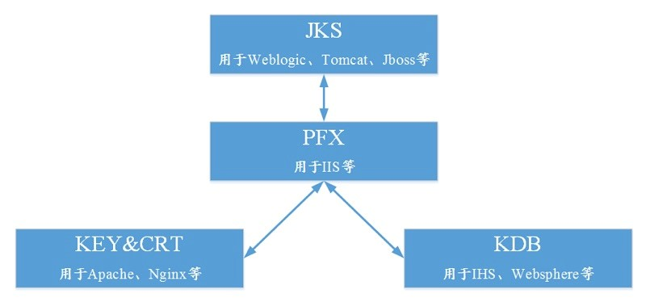
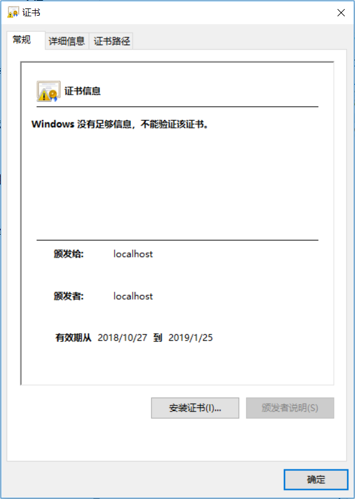

# keytool


keytool百度百科：https://baike.baidu.com/item/keytool/5885709?fr=aladdin#2

keytool是个秘钥和证书管理工具。它使用户能够管理自己的私钥仓库(keystore)对及相关的X.509证书链（用以验证与[私钥](https://baike.baidu.com/item/%E7%A7%81%E9%92%A5/8973452)对应的[公钥](https://baike.baidu.com/item/%E5%85%AC%E9%92%A5/6447788)），用于（通过数字签名）自我认证（用户向别的用户/服务认证自己）或数据完整性以及认证服务。

在JDK1.4以后的版本中都包含了这一工具，它的位置是`%JAVA_HOME%\bin\keytool.exe`。

## 证书简要说明

### 主流的数字证书格式

一般来说，主流的Web服务软件，通常都基于OpenSSL和Java两种基础密码库。

- Tomcat、Weblogic、JBoss等WEB服务软件，一般使用Java提供的密码库。通过Keytool工具，生成Java Keystore（JKS）格式的证书文件。
- Apache、Nginx等Web服务软件，一般使用OpenSSL工具提供的密码库，生成PEM、KEY、CRT等格式的证书文件。
- IBM等Web服务产品，如Websphere、IBM Http Server(IHS)等，一般使用IBM产品自带的iKeyman工具，生成KBD个格式的证书文件。
- 微软Windows Server中的Internet Information Services（IIS）服务，使用Windows自带的证书库生成PFX格式的证书文件。

### 判断证书文件是文本还是二进制格式

您可以使用一下方法简单区分带有后缀扩展名的证书文件：

- `*.der或`*.cer：这样的证书文件是二进制格式，只含有证书信息，不包含私钥。
- `*.cet`文件：这样的证书文件可以是二进制格式，也可以是文本格式，一般均为文本格式，功能与`*.cer`或`*.cet`正式文件相同。
- `*.pem`文件：这样的证书文件一本是文本格式，可以存放证书或私钥，或者两者都包含。`*.pem`文件如果只包含私钥，一般用`*.key`文件代替。
- `*.pfx`或`*.p12`文件：这样的证书文件是二进制格式，同时包含证书和私钥，且一般都有密码保护。

您也可以使用记事本直接打开证书文件。如果显示的是规则的数字字母，例如：

```
—–BEGIN CERTIFICATE—–
MIIE5zCCA8+gAwIBAgIQN+whYc2BgzAogau0dc3PtzANBgkqh......
—–END CERTIFICATE—–
```

那么，该证书文件是文本格式。

- 如果存在`——BEGIN CERTIFICATE——`，则说明这是一个证书文件。
- 如果存在`—–BEGIN RSA PRIVATE KEY—–`，则说明这是一个私钥文件。

### 证书格式之间的转换

（Java、.Net、PHP）语言需要的证书格式并不一致，比如说Java我们采用jks，.Net采用pfx和cer，PHP则采用pem和cer；

主要分成两类，其一为秘钥库文件格式，其二为证书文件格式；



Note: 阿里云云盾证书服务统一使用 PEM 格式的数字证书文件。

java转换使用`keytool -importkeystore`。

### 证书类型

| 格式   | 扩展名         | 描述                                                    | 特点                                                         |
| ------ | -------------- | ------------------------------------------------------- | ------------------------------------------------------------ |
| DER    | .cer/.crt/.rsa | 【ASN.1 DER】用于存放证书                               | 不含私钥，二进制                                             |
| PKCS7  | .p7b/.p7r      | 【PKCS #7】加密信息语法标准                             | 1、p7b以树状展示证书链，不含私钥<br/>2、p7r为CA对证书请求签名的回复，只能用于导入 |
| CMS    | .p7c/.p7m/.p7s | 【Cryptographic Message Syntax】                        | 1、p7c只保存证书<br />2、p7m：signature with enveloped data <br />3、p7s：时间戳签名文件 |
| PEM    | .pem           | 【Printable Encoded Message】                           | 1、该编码格式在RFC1421中定义，其实PEM是【Privacy-Enhanced Mail】的简写，但它也同样广泛运用于秘钥管理。<br />2、ASCII文件<br />3、一般基于base 64编码 |
| PKCS10 | .p10/.csr      | 【PKCS #10】公钥加密标准【Certificate Signing Request】 | 1、证书签名请求文件<br />2、ASCII文件<br />3、CA签名后以p7文件回复 |
| SPC    | .pvk/.spc      | 【Software Publishing Certificate】                     | 微软公司特有的双证书文件格式，经常用于代码签名，其中<br />1、pvk用于保存私钥<br />2、spc用于保存公钥 |


### 秘钥库类型

秘钥库概念：所有的公钥和私钥同证书都会被存储在秘钥库中，因为证书需要被签名，签名必须使用非对称加密算法+HASH算法，所以一般是MD5WithRSA或者SHA1WithRSA。

| 格式   | 扩展名    | 描述                                                         | 特点                                                         |
| ------ | --------- | ------------------------------------------------------------ | ------------------------------------------------------------ |
| JKS    | .jks/.ks  | 【Java Keystore】秘钥库的Java实现版本，provider为SUN         | 秘钥库和私钥用不同的密码进行保护                             |
| JCEKS  | .jce      | 【JCE Keystore】秘钥库的JCE实现版本，provider为SUM JCE       | 相对于JKS安全级别更高，保护Keystore私钥时采用TripleDes       |
| pkcs12 | .p12/.pfx | 【PKCS #12】个人信息交换语法标准                             | 1、包含私钥、公钥及证书<br />2、秘钥库和私钥用相同密码进行保护 |
| BKS    | .bks      | 【Bouncycastle Keystore】秘钥库的BC实现版本，provider为BC    | 基于JCE实现                                                  |
| UBER   | .ubr      | 【Bouncycastle UBER Keystore】秘钥库的BC更安全实现版本，provider为BC |                                                              |

### 证书格式转换工具介绍

目前两大开发平台Java和.Net都提供了相关的证书管理工具，比如Java是keytool，参考<http://java.sun.com/javase/6/docs/technotes/tools/windows/keytool.html>；.Net为makecert，参考<http://msdn.microsoft.com/library/chs/default.asp?url=/library/CHS/cptools/html/cpgrfcertificatecreationtoolmakecertexe.asp>；
但是两者遵循的标准并不是完全兼容，有很多都是基于自己的实现，所以很多的文件格式并不通用，在实际开发使用过程中我们可能需要进行格式转换，在转换过程中，常见格式的转换可以运用keytool或者是windows证书管理导入导出工具；另外一个很有用的工具就是OpenSSL，首页地址为<http://www.openssl.org/>，各种格式间的转换示例这里就不提供了，大家可以参考<http://www.waasai.com/blog/f/80/archives/2008/1412.html>、<http://blog.tom.com/eagles125/article/1579.html>；

这里要提一些注意事项和小工具：

1、Java平台keytool对X.509证书的支持并不一致，6.0版本之前生成的证书都是v1版本的，这在很多应用场合可能会导致一些潜在的问题，但是他还是能够管理v3版本的证书的，从6.0开始keytool支持v3版本的证书生成；
2、Eclipse插件SecureX推荐，这是一个国人贡献的证书生成、管理工具，效果还是不错的，而且可以下载源代码查看，对学习Security方面的编程很有帮助，可以从<http://securex.sourceforge.net/updatesite>更新，目前版本为2.0，不过好像现在作者也没有更新了；
3、KeyTool IUI工具推荐，这是一个老外编写的Keytool GUI工具，功能大致和SecureX类似，他可以以application或者Java Web Start启动查看，但作者并没有提供源代码下载，首页为<http://yellowcat1.free.fr/keytool_iui.html>；

## java操作keystore

```java
import javax.crypto.KeyGenerator;
import javax.crypto.SecretKey;
import java.io.FileInputStream;
import java.io.InputStream;
import java.security.KeyStore;
import java.security.cert.CertificateFactory;
import java.security.cert.X509Certificate;

public class KeystoreTest {

    public static void main(String[] args) throws Exception {
        KeyStore keyStore = KeyStore.getInstance("PKCS12");
        keyStore.load(null,null);

        KeyGenerator keyGenerator = KeyGenerator.getInstance("AES");
        keyGenerator.init(128);//128, 192 or 256

        SecretKey secretKey = keyGenerator.generateKey();
        //单独只是存储一个秘钥 如果是JKS和PKCS 会抛出错误 不支持单独秘钥
        keyStore.setKeyEntry("java",secretKey,"123456".toCharArray(),null);
        //存储受信任的证书
        InputStream in = new FileInputStream("C:\\Users\\xlp\\Desktop\\java.cer");
        CertificateFactory cf = CertificateFactory.getInstance("X.509");
        X509Certificate cert = (X509Certificate) cf.generateCertificate(in);

        keyStore.setCertificateEntry("cert",cert);

        // 以下代码是sun包中的类型，从JDK 1.7开始，Oracle未将以sun开头的类包加载到JVM启动加
        //载的类包中。所以，像 JPEGImageEncoder这样的类不能够默认使用。如果非要使用sun开头包
        //中的类，只能够直接将源码复制到自己的项目中或者将rt.jar 放到项目的类路径下
        //（不推荐此种做法）。
        //存储非对称加密的证书和私钥
//      CertAndKeyGen gen = new CertAndKeyGen("RSA","SHA1WithRSA");
//	    gen.generate(1024);
//      X509Certificate mycert=gen.getSelfCertificate(new X500Name("CN=ROOT"), (long)365*24*3600);
//      PrivateKey pk=gen.getPrivateKey();
//	    keyStore.setKeyEntry("myrsa", pk, "123456".toCharArray(),new Certificate[]{ mycert});
//	    keyStore.store(new FileOutputStream("c:/ttt.keystore"), "123456".toCharArray());
    }
}
```

## java security cacerts

jdk秘钥库文件位于`jre\lib\security\`目录，秘钥库名称为`cacerts`，默认密码`changeit`。

导入证书：

```bash
C:\Users\xlp\Desktop>keytool -importcert -trustcacerts -alias test -keystore "D:\developer\Java\jre-10\lib\security\cacerts" -file test.cer -storepass changeit
```

## keytool -help
keytool是一个Java数据证书的管理工具，keytool将密钥（key）和证书（certificates）存在一个称为keystore的文件中。在keystore里，包含两种数据：

- 密钥实体（key entity）—— 密钥（secret key）又或者是私钥和配对公钥（采用非对称加密）
- 可信任的证书实体（trusted certificate entries）—— 只包含公钥

```shell
[root@localhost]# keytool -help
密钥和证书管理工具

命令:

 -certreq            生成证书请求
 -changealias        更改条目的别名
 -delete             删除条目
 -exportcert         导出证书
 -genkeypair         生成密钥对
 -genseckey          生成密钥
 -gencert            根据证书请求生成证书
 -importcert         导入证书或证书链
 -importpass         导入口令
 -importkeystore     从其他密钥库导入一个或所有条目
 -keypasswd          更改条目的密钥口令
 -list               列出密钥库中的条目
 -printcert          打印证书内容
 -printcertreq       打印证书请求的内容
 -printcrl           打印 CRL 文件的内容
 -storepasswd        更改密钥库的存储口令

使用 "keytool -command_name -help" 获取 command_name 的用法
```


## -genkeypair（生成秘钥对）

生成一个包含密钥对以及证书的秘钥存储库。

命令`-genkey`等价于`-genkeypair`，它们之间完全是一样的。

```shell
[root@localhost]# keytool -genkeypair -help
keytool -genkeypair [OPTION]...

生成密钥对

选项:

 -alias <alias>                  要处理的条目的别名
 -keyalg <keyalg>                密钥算法名称
 -keysize <keysize>              密钥位大小
 -sigalg <sigalg>                签名算法名称
 -destalias <destalias>          目标别名
 -dname <dname>                  唯一判别名
 -startdate <startdate>          证书有效期开始日期/时间
 -ext <value>                    X.509 扩展
 -validity <valDays>             有效天数
 -keypass <arg>                  密钥口令
 -keystore <keystore>            密钥库名称
 -storepass <arg>                密钥库口令
 -storetype <storetype>          密钥库类型
 -providername <providername>    提供方名称
 -providerclass <providerclass>  提供方类名
 -providerarg <arg>              提供方参数
 -providerpath <pathlist>        提供方类路径
 -v                              详细输出
 -protected                      通过受保护的机制的口令
keytool -genkeypair -alias "config-server" -keyalg "RSA" -keysize 2048 -validity 360 -keypass 597646251 -storepass 597646251 -keystore "./config-server.keystore" -dname "CN=localhost, OU=xlp, O=xlp, L=china, ST=china, C=china"

```

### properties

-alias：指定了秘钥对的别名，因为一个存储库中可以存储多个密钥对，访问对应的密钥对需要对应的别名。

-keyalg：秘钥算法的名称，默认是DSA。

-keysize：秘钥位的大小，默认是1024.

-dname：指定证书拥有者信息 。

-validity：指定证书的有效天数。

-keystore：指定秘钥库的路径及命令，默认生成在用户目录下为`.keystore`。

-storepass：访问秘钥库需要的口令（密码）。

-keypass：访问秘钥的口令。

-storetype：指定秘钥库的类型，默认为`PKCS12`。

### default value

- `-alias`：`"mykey"`

- `-keyalg`：
  -  "`DSA`" (当使用`-genkeypair`)
  - "`DES`" (当使用`-genseckey`)
- `-keysize`：
  - 2048 (当使用`-genkeypair`，并且`-keyalg`是"`RSA`")
  - 1024 当使用`-genkeypair`，并且`-keyalg`是"`DSA`")
  - 56 (当使用`-genseckey`，并且`-keyalg`是"`DES`")
  - 168 (当使用`-genseckey`，并且`-keyalg`是"`DESede`")

- `-validity`：90
- `keystore`： <用户主目录中名为`.keystore`的文件>
- `-storetype` <"`keystore.type`"是在安全配置文件中的值, 由`java.security.KeyStore`中的静态`getDefaultType`方法返回>
- `-file`：
  - `stdin` (if reading)
  - `stdout` (if writing)
- `-protected`：`false`

### example

生成一个秘钥对：

```shell
[root@localhost ~]# keytool -genkeypair -alias test -keyalg RSA -sigalg sha256WithRSA -keysize 2048 -storetype PKCS12 -validity 360 -keystore test.p12 -storepass 123456 -keypass 123456
您的名字与姓氏是什么?
  [Unknown]:  localhost
您的组织单位名称是什么?
  [Unknown]:  localhost
您的组织名称是什么?
  [Unknown]:  localhost
您所在的城市或区域名称是什么?
  [Unknown]:  chengdu
您所在的省/市/自治区名称是什么?
  [Unknown]:  chengdu
该单位的双字母国家/地区代码是什么?
  [Unknown]:  zh
CN=localhost, OU=localhost, O=localhost, L=chengdu, ST=chengdu, C=zh是否正确?
  [否]:  y
```

我们指定了条目的别名为`test`，秘钥算法为`RSA`，秘钥位为`2048`，秘钥库类型为`PKCS12`，证书有效期为`360`天，秘钥库存储当前执行命令的目录，名称为`test.p12`（之所以名称后缀不为`keystore`，是因为秘钥库类型为`PKCS12`，对应的扩展名为`.p12/.pfx`），秘钥库和秘钥的密码都是`123456`。

执行，会提示我们输入名字、组织、部门、城市、区域、国家这几个信息，这些信息主要是用来**标识证书所有者**的。

如果命令不指定秘钥库和秘钥的密码，那么还会提示我们输入秘钥库和秘钥的密码。

证书所有者也可以通过命令指定，如下：

```shell
keytool -genkeypair -alias test -keyalg RSA -keysize 2048 -storetype PKCS12 -validity 360 -keystore test.p12 -storepass 123456 -keypass 123456 -dname "CN=localhost, OU=localhost, O=localhost, L=chengdu, ST=chengdu, C=zh"
```

注意：`-dname`的值必须需要用双引号引起来。

## -list（列出密钥库中的条目）

-list命令是用户查询秘钥库的信息的。

```shell
[root@localhost ~]# keytool -list -help
keytool -list [OPTION]...

列出密钥库中的条目

选项:

 -rfc                            以 RFC 样式输出
 -alias <alias>                  要处理的条目的别名
 -keystore <keystore>            密钥库名称
 -storepass <arg>                密钥库口令
 -storetype <storetype>          密钥库类型
 -providername <providername>    提供方名称
 -providerclass <providerclass>  提供方类名
 -providerarg <arg>              提供方参数
 -providerpath <pathlist>        提供方类路径
 -v                              详细输出
 -protected                      通过受保护的机制的口令
```

### properties

- -rfc：
- `-alias`：一个秘钥库中可以包含多个条目，而每个条目都有自己的别名，`-alias`选项是用于指定查看秘钥库指定条目的别名。如果不指定，则是查看所有。
- `-keystore`：指定秘钥库的名称，默认的秘钥库是在用户主目录下为`.keystore`的文件，如果不指定，则是查看默认的秘钥库。
- `-storepass`：查看秘钥库详细需要秘钥库密码。
- `-storetype`：秘钥库的类型
- `-v`：默认情况下`-list`只输出简要信息，加入`-v`参数，可以输出详细信息。

### example

查看秘钥库简略信息：

```shell
[root@localhost ~]# keytool -list -keystore test.p12 -storepass 123456 -storetype PKCS12 -alias test
test, 2018-10-27, PrivateKeyEntry, 
证书指纹 (SHA1): 8C:FD:86:19:96:C9:14:3C:49:81:E2:B5:03:5A:1C:D6:38:1B:66:B7
```
查看秘钥库详细信息：
```shell
[root@localhost ~]# keytool -list -keystore test.p12 -storepass 123456 -storetype PKCS12 -alias test  -v
别名: test
创建日期: 2018-10-27
条目类型: PrivateKeyEntry
证书链长度: 1
证书[1]:
所有者: CN=localhost, OU=localhost, O=localhost, L=chengdu, ST=chengdu, C=zh
发布者: CN=localhost, OU=localhost, O=localhost, L=chengdu, ST=chengdu, C=zh
序列号: 701fd299
有效期为 Sat Oct 27 06:11:13 CST 2018 至 Tue Oct 22 06:11:13 CST 2019
证书指纹:
	 MD5:  D8:81:70:FC:F4:AC:3D:02:AE:A1:06:6C:36:E4:3E:8D
	 SHA1: 8C:FD:86:19:96:C9:14:3C:49:81:E2:B5:03:5A:1C:D6:38:1B:66:B7
	 SHA256: 41:77:93:A4:F7:30:0E:07:D6:E2:85:8D:19:36:5E:EE:7E:CC:1A:61:A9:EE:B3:F3:D1:35:74:4B:90:39:52:60
签名算法名称: SHA256withRSA
主体公共密钥算法: 2048 位 RSA 密钥
版本: 3

扩展: 

#1: ObjectId: 2.5.29.14 Criticality=false
SubjectKeyIdentifier [
KeyIdentifier [
0000: EB 01 87 03 3D CD 44 42   9E BF 05 AA 28 D5 D8 50  ....=.DB....(..P
0010: D9 57 CC F7                                        .W..
]
]
```
以rfc格式输出：

```shell
[root@localhost ~]# keytool -list -keystore test.p12 -storepass 123456 -storetype PKCS12 -alias test -rfc
别名: test
创建日期: 2018-10-27
条目类型: PrivateKeyEntry
证书链长度: 1
证书[1]:
-----BEGIN CERTIFICATE-----
MIIDeTCCAmGgAwIBAgIEcB/SmTANBgkqhkiG9w0BAQsFADBtMQswCQYDVQQGEwJ6
aDEQMA4GA1UECBMHY2hlbmdkdTEQMA4GA1UEBxMHY2hlbmdkdTESMBAGA1UEChMJ
bG9jYWxob3N0MRIwEAYDVQQLEwlsb2NhbGhvc3QxEjAQBgNVBAMTCWxvY2FsaG9z
dDAeFw0xODEwMjYyMjExMTNaFw0xOTEwMjEyMjExMTNaMG0xCzAJBgNVBAYTAnpo
MRAwDgYDVQQIEwdjaGVuZ2R1MRAwDgYDVQQHEwdjaGVuZ2R1MRIwEAYDVQQKEwls
b2NhbGhvc3QxEjAQBgNVBAsTCWxvY2FsaG9zdDESMBAGA1UEAxMJbG9jYWxob3N0
MIIBIjANBgkqhkiG9w0BAQEFAAOCAQ8AMIIBCgKCAQEAjVNAkxbj0YilpKDZz8re
CnW+x//gdYvNKBFbwkiYMnD496MjeZFPZO55i0O/kNMN6BiCa7eMVMPsi7SUApIH
rKyXCaEn3HRENEoukZP0Z6IjuXXt7aHLn0dXdnVD+T2Lr2aop/i6TPs56kHksbff
5zqF2nznEPtuiSYk1RaB5qWgTKndUByZU/ZWFvspFZskFtqZtY8XIFKJqABJDkQy
e9G/hpdptrjeMog2nt6OXopb5fV6miNZPWgI830jRQPlU+aeIBBUVlVTFrGFGnUh
TlW1gPvzagINrN78sifbKH52maZ3f6A7Z48r80wMMkU7EwQBQUzFwxXxRjMxkZCY
3QIDAQABoyEwHzAdBgNVHQ4EFgQU6wGHAz3NREKevwWqKNXYUNlXzPcwDQYJKoZI
hvcNAQELBQADggEBACTryHrhdGjCYee3yhtgYjcMxDTEQVpKe6ljNCckASy7CiM+
E3/nRSkoAj/Ovq4t1dU5Wlx/pq8lb/+z68rBQMIfFeBAVkmk+YKcW+S8NiQSZ2qo
n+VFP8m1uo85hkVpqkw9Loh41SQtEik7YlaD3Xk6oxarF2TeeJKwwcubm+Wb08tk
cnfYVmsIjWneUkgiroijsqVx+Sz0jePhaLnfKYjeuAJzXXWQ9yQHT2TiIWtJeOFq
FpD+DvXbcjvilP0e63UoM5k7hmboEeKhV9jV46B3fMQqKO4gjWQPTcdPV5jsUt/w
DYHHj22f84Gn+uSn9ZKMPy2FMzoOUGlMoOdoNUg=
-----END CERTIFICATE-----
```

通过详情可以发现，所有者和发布者，表明这是一个自签名证书。

证书指纹就是证书根据摘要算法（Hash算法）计算出来的hash值，证书的签名就是对证书指纹的加密。

秘钥库类型默认是`PKCS12`，如果使用参数`-storetype`指定非`PKCS12`的类型，例如`JKS`，则会提示警告信息：jdk9以前，默认为JKS。自jdk9开始，默认为PKCS12。

```shell
Warning:
JKS 密钥库使用专用格式。建议使用 "keytool -importkeystore -srckeystore root.jks -destkeystore root.jks -deststoretype pkcs12" 迁移到行业标准格式 PKCS12。
```


## -certreq（生成证书请求）

自签名的证书可以使用，但是总不如认证机构颁发的证书权威。要想让CA为我们颁发证书，首先我们要向CA提交申请，提交申请的时候需要提交一份称为`certificate request`的数据。我们可以通过`keytool -certreq`命令针对keystore中相应的条目生成该数据。

```shell
[root@localhost ~]# keytool -certreq -help
keytool -certreq [OPTION]...

生成证书请求

选项:

 -alias <alias>                  要处理的条目的别名
 -sigalg <sigalg>                签名算法名称
 -file <filename>                输出文件名
 -keypass <arg>                  密钥口令
 -keystore <keystore>            密钥库名称
 -dname <dname>                  唯一判别名
 -storepass <arg>                密钥库口令
 -storetype <storetype>          密钥库类型
 -providername <providername>    提供方名称
 -providerclass <providerclass>  提供方类名
 -providerarg <arg>              提供方参数
 -providerpath <pathlist>        提供方类路径
 -v                              详细输出
 -protected                      通过受保护的机制的口令
```

### properties

- `-alias`：要处理的条目的别名，即针对秘钥库中哪个条目生成`certificate request`数据。
- `-sigalg`：签名算法的名称，例如：`sha256WithRSA`。
- `-file`：指定保存`certificate request`数据的文件。
- `-keypass`：指定条目秘钥密码。
- `-keystore`：生成`certificate request`数据的秘钥库名称。
- `-dname`：指定条目证书的所有者信息。
- `-storepass`：秘钥库密码。
- `-storetype`：秘钥库类型
- `-v`：输出详细信息。

### example

生成`certificate request`数据。

```shell
[root@localhost ~]# keytool -certreq -keystore test.p12 -storetype PKCS12  -storepass 123456 -alias test -keypass 123456 -sigalg sha256WithRSA -dname "CN=localhost, OU=localhost, O=localhost, L=chengdu, ST=chengdu, C=zh" -v
-----BEGIN NEW CERTIFICATE REQUEST-----
MIIC4jCCAcoCAQAwbTELMAkGA1UEBhMCemgxEDAOBgNVBAgTB2NoZW5nZHUxEDAO
BgNVBAcTB2NoZW5nZHUxEjAQBgNVBAoTCWxvY2FsaG9zdDESMBAGA1UECxMJbG9j
YWxob3N0MRIwEAYDVQQDEwlsb2NhbGhvc3QwggEiMA0GCSqGSIb3DQEBAQUAA4IB
DwAwggEKAoIBAQCNU0CTFuPRiKWkoNnPyt4Kdb7H/+B1i80oEVvCSJgycPj3oyN5
kU9k7nmLQ7+Q0w3oGIJrt4xUw+yLtJQCkgesrJcJoSfcdEQ0Si6Rk/RnoiO5de3t
ocufR1d2dUP5PYuvZqin+LpM+znqQeSxt9/nOoXafOcQ+26JJiTVFoHmpaBMqd1Q
HJlT9lYW+ykVmyQW2pm1jxcgUomoAEkORDJ70b+Gl2m2uN4yiDae3o5eilvl9Xqa
I1k9aAjzfSNFA+VT5p4gEFRWVVMWsYUadSFOVbWA+/NqAg2s3vyyJ9sofnaZpnd/
oDtnjyvzTAwyRTsTBAFBTMXDFfFGMzGRkJjdAgMBAAGgMDAuBgkqhkiG9w0BCQ4x
ITAfMB0GA1UdDgQWBBTrAYcDPc1EQp6/Baoo1dhQ2VfM9zANBgkqhkiG9w0BAQsF
AAOCAQEAM0gY85ybgbgBMKUESCgERCdgOE+G8z74ehxYbZPk0HQPeQzRoeppmaER
fJWO9uuy/rsxrBeAjYtvSPCecpuR+4DFqfFzKfKZcMcAYfsPGxBFTj03y/F/Vz90
aw1fkM4I559OAsbw76nkO8KVPcfv75EzIvhZauMBc4Ay2tJTM4JExlxWfvDGiLj0
iYnegyJhVWW/Ksd7OTOuHhGJzvZAvB645zEdBwX/ac5W5ZHO5k5jUpsEkgk8S0lK
4iQrKpCTxPgUqG5XCL8L1NQZHtBODYOYiMpbXytTEQ7oMkkXfsu4aiImNyf7tNEQ
FrBgNAM2HKoqLUxYVSYWK/fZUyEqEQ==
-----END NEW CERTIFICATE REQUEST-----
```

通过查看执行命令的目录，并没有发现生成对应的保存`certificate request`数据的文件，仅仅是在终端输出了base64编码的`certificate request`数据。

我们可以通过`-file`参数指定输出为文件:

```shell
[root@localhost ~]# keytool -certreq -keystore test.p12 -storetype PKCS12  -storepass 123456 -alias test -keypass 123456 -sigalg sha256WithRSA -dname "CN=localhost, OU=localhost, O=localhost, L=chengdu, ST=chengdu, C=zh" -file test.certreq
[root@localhost ~]# ll
总用量 12
-rw-r--r--. 1 root root 1101 10月 27 06:40 test.certreq
-rw-r--r--. 1 root root 2579 10月 27 06:11 test.p12
```

可以看到，目录下存在了一个名为`test.certreq`的文件。

除了可以通过`-file`参数之外，还可以使用重定向操作符`>`：

```shell
[root@localhost ~]# keytool -certreq -keystore test.p12 -alias test>test.certreq1
输入密钥库口令:  123456
[root@localhost ~]# ll
总用量 16
-rw-r--r--. 1 root root 1101 10月 27 06:40 test.certreq
-rw-r--r--. 1 root root 1101 10月 27 06:44 test.certreq1
-rw-r--r--. 1 root root 2579 10月 27 06:11 test.p12
```

> 这里省略了很多参数，这些参数并不是必须的，它会根据指定秘钥库和指定条目找到相应的信息。

之后将此文件提交给CA，即可让CA颁发证书了。


>为了简便起见，之后的所有example的命令的为必须填参数都不在写了。


## -gencert（根据证书请求生成证书）

生成了`test.certreq`文件之后可以将其提交给CA认证，颁发证书。但是现实中CA是要收费的，而且还不便宜。那么只有自己提交自己了。

`-gencert`命令可以签名证书。

```shell
[root@localhost]# keytool -gencert -help
keytool -gencert [OPTION]...

根据证书请求生成证书

选项:

 -rfc                            以 RFC 样式输出
 -infile <filename>              输入文件名
 -outfile <filename>             输出文件名
 -alias <alias>                  要处理的条目的别名
 -sigalg <sigalg>                签名算法名称
 -dname <dname>                  唯一判别名
 -startdate <startdate>          证书有效期开始日期/时间
 -ext <value>                    X.509 扩展
 -validity <valDays>             有效天数
 -keypass <arg>                  密钥口令
 -keystore <keystore>            密钥库名称
 -storepass <arg>                密钥库口令
 -storetype <storetype>          密钥库类型
 -providername <providername>    提供方名称
 -providerclass <providerclass>  提供方类名
 -providerarg <arg>              提供方参数
 -providerpath <pathlist>        提供方类路径
 -v                              详细输出
 -protected                      通过受保护的机制的口令

使用 "keytool -help" 获取所有可用命令
```

### properties

- `-rfc`：以 RFC 样式输出
- `-infile`：输入文件名，即`certificate request`数据文件。
- `-outfile`：输出文件名，即通过`certificate request`数据生成的cer证书文件。
- `-alias`：认证证书所在条目的别名，即通过此别名的证书对`certificate request`数据进行认证。
- `-sigalg`：生成证书的有效期签名算法，例如`sha256WithRSA`。
- `-dname`：认证证书的证书拥有者信息。
- `-startdate`：生成证书的有效期开始日期/时间
- `-ext`：X.509 扩展
- `-validity`：生成证书的有效期。
- `-keypass`：认证证书秘钥的口令。
- `-keystore`：认证证书所在存储库。
- `-storepass`：认证证书所在存储库的口令。
- `-storetype`：认证证书所在存储库的类型。
- `-v`：详细输出。

### example

首先再创建一个新的秘钥库`java.p12`，条目别名为`java`。

```shell
[root@localhost ~]# keytool -genkeypair -alias java -keystore java.p12 -storetype PKCS12 -keyalg RSA -sigalg sha256WithRSA -storepass 123456 -keypass 123456 -dname "CN=localhost, OU=java, O=java, L=quxian, ST=dazhou, C=zh"
```

条目`java`作为认证证书，`test`作为被认证证书。

认证需要`certificate request`数据，签名以及生成好了，这里就不在生成了。

认证test：

```shell
[root@localhost ~]# keytool -gencert -keystore java.p12 -storepass 123456 -storetype PKCS12 -keypass 123456 -sigalg sha256WithRSA -alias java -infile test.certreq -outfile test.cer
[root@localhost ~]# ll
总用量 24
-rw-r--r--. 1 root root 2555 10月 27 07:12 java.p12
-rw-r--r--. 1 root root  914 10月 27 07:12 test.cer
-rw-r--r--. 1 root root 1101 10月 27 06:40 test.certreq
-rw-r--r--. 1 root root 1101 10月 27 06:44 test.certreq1
-rw-r--r--. 1 root root 2579 10月 27 06:11 test.p12
```

最后生成了一个名叫`test.cer`的文件，这个文件就是由`'java'`颁发的证书，证书的后缀都是以`.cer`为后缀的。如此，签名就算完成了。

在windows环境下双击`test.cer`文件，就可以看到此证书的相关信息了。如下图所示：



## -printcert（打印证书内容）

`-list`指令可以查看秘钥库的信息，如果是一个单独的证书文件（`*.cer`），怎么查看内容呢？

`-printcert`可以打印证书内容。

```shell
C:\Users\HP\Desktop>keytool -printcert -help
keytool -printcert [OPTION]...

打印证书内容

选项:

 -rfc                        以 RFC 样式输出
 -file <filename>            输入文件名
 -sslserver <server[:port]>  SSL 服务器主机和端口
 -jarfile <filename>         已签名的 jar 文件
 -v                          详细输出

使用 "keytool -help" 获取所有可用命令
```

### properties

- `-rfc`：以 RFC 样式输出。
- `-file`：要进行打印内容的证书文件。
- `-sslserver`：SSL 服务器主机和端口。
- `-jarfile`： 已签名的 jar 文件。
- `-v`：详细输出。

### example：

```shell
[root@localhost ~]# keytool -printcert -file test.cer -rfc -v
-----BEGIN CERTIFICATE-----
MIIDjjCCAnagAwIBAgIEIn8jejANBgkqhkiG9w0BAQsFADBhMQswCQYDVQQGEwJ6
aDEPMA0GA1UECBMGZGF6aG91MQ8wDQYDVQQHEwZxdXhpYW4xDTALBgNVBAoTBGph
dmExDTALBgNVBAsTBGphdmExEjAQBgNVBAMTCWxvY2FsaG9zdDAeFw0xODEwMjYy
MzEyMThaFw0xOTAxMjQyMzEyMThaMG0xCzAJBgNVBAYTAnpoMRAwDgYDVQQIEwdj
aGVuZ2R1MRAwDgYDVQQHEwdjaGVuZ2R1MRIwEAYDVQQKEwlsb2NhbGhvc3QxEjAQ
BgNVBAsTCWxvY2FsaG9zdDESMBAGA1UEAxMJbG9jYWxob3N0MIIBIjANBgkqhkiG
9w0BAQEFAAOCAQ8AMIIBCgKCAQEAjVNAkxbj0YilpKDZz8reCnW+x//gdYvNKBFb
wkiYMnD496MjeZFPZO55i0O/kNMN6BiCa7eMVMPsi7SUApIHrKyXCaEn3HRENEou
kZP0Z6IjuXXt7aHLn0dXdnVD+T2Lr2aop/i6TPs56kHksbff5zqF2nznEPtuiSYk
1RaB5qWgTKndUByZU/ZWFvspFZskFtqZtY8XIFKJqABJDkQye9G/hpdptrjeMog2
nt6OXopb5fV6miNZPWgI830jRQPlU+aeIBBUVlVTFrGFGnUhTlW1gPvzagINrN78
sifbKH52maZ3f6A7Z48r80wMMkU7EwQBQUzFwxXxRjMxkZCY3QIDAQABo0IwQDAf
BgNVHSMEGDAWgBRC3eTvdzWVjgBa0L5IVZqcUv3GpDAdBgNVHQ4EFgQU6wGHAz3N
REKevwWqKNXYUNlXzPcwDQYJKoZIhvcNAQELBQADggEBABeIUcROTy8zC3sjSP8Z
2A300v21Ow8MNYM1UuOYszdJbzOMe69t+DiA+1D7tn0Cqo7SU7k6UzhuaJ/5Hocz
FUerxbkiH8UxKfbqL5/CrQUPHOU9XC8iS/D/rmigbBZ3bWlnRjL1oJj+FRQ4ATWK
py4e8rTKDPTTi/Us94WCIjjVFjam11nHnp0LZE1Dq/FuiDaWh59L4I4P/N8/X1kd
NOB7bvixgjmOUD/Z7zHnfJ23B23wSJ/Fx6WFhQ4Ca711Q/4DBTAZCLTGFElb6k72
Wi95BkGgxwjCxc3vD/0sDgvfCIKPir5Uqo+VVaq5yH8iZitHKZyYdvlQpoAK2043
lYA=
-----END CERTIFICATE-----


[root@localhost ~]# keytool -printcert -file test.cer -v
所有者: CN=localhost, OU=localhost, O=localhost, L=chengdu, ST=chengdu, C=zh
发布者: CN=localhost, OU=java, O=java, L=quxian, ST=dazhou, C=zh
序列号: 227f237a
有效期为 Sat Oct 27 07:12:18 CST 2018 至 Fri Jan 25 07:12:18 CST 2019
证书指纹:
	 MD5:  8C:03:68:3C:DE:0F:33:52:09:05:9F:CE:EA:72:6F:5B
	 SHA1: AA:DD:52:18:AF:FB:FD:B4:C0:A7:D4:7E:C3:49:72:C6:AC:DC:AB:A0
	 SHA256: 4C:2C:77:F6:C8:59:8B:BA:DC:01:EF:42:17:79:8B:DB:A9:70:9B:22:46:C3:9D:AE:63:0E:4D:9A:24:06:0B:B4
签名算法名称: SHA256withRSA
主体公共密钥算法: 2048 位 RSA 密钥
版本: 3

扩展: 

#1: ObjectId: 2.5.29.35 Criticality=false
AuthorityKeyIdentifier [
KeyIdentifier [
0000: 42 DD E4 EF 77 35 95 8E   00 5A D0 BE 48 55 9A 9C  B...w5...Z..HU..
0010: 52 FD C6 A4                                        R...
]
]

#2: ObjectId: 2.5.29.14 Criticality=false
SubjectKeyIdentifier [
KeyIdentifier [
0000: EB 01 87 03 3D CD 44 42   9E BF 05 AA 28 D5 D8 50  ....=.DB....(..P
0010: D9 57 CC F7                                        .W..
]
]
```


## -printcertreq（打印证书请求的内容）

既然可以答应证书文件的内容，那么也可以打印`certificate request`数据文件。

```shell
C:\Users\xlp>keytool -printcertreq -help
keytool -printcertreq [OPTION]...

打印证书请求的内容

选项:

 -file <file>  输入文件名
 -v            详细输出
```

### properties

- `-file`：要进行内容打印的`certificate request`数据文件。
- `-v`：详细输出。

### example

```shell
[root@localhost ~]# keytool -printcertreq -file test.certreq -v
PKCS #10 证书请求 (版本 1.0)
主体: CN=localhost, OU=localhost, O=localhost, L=chengdu, ST=chengdu, C=zh
格式: X.509
公共密钥: 2048 位 RSA 密钥
签名算法: SHA256withRSA

扩展请求:

#1: ObjectId: 2.5.29.14 Criticality=false
SubjectKeyIdentifier [
KeyIdentifier [
0000: EB 01 87 03 3D CD 44 42   9E BF 05 AA 28 D5 D8 50  ....=.DB....(..P
0010: D9 57 CC F7                                        .W..
]
]
```


## -printcrl（打印 CRL 文件的内容）

```shell
C:\Users\xlp>keytool -printcrl -help
keytool -printcrl [OPTION]...

打印 CRL 文件的内容

选项:

 -file <file>  输入文件名
 -v            详细输出
```

### properties

- `-file`：要进行内容打印的`certificate request`数据文件。
- `-v`：详细输出。

### example

- [x] 暂时未知CRL文件是什么？


## -importpass（导入口令）


```shell
[root@localhost ~]# keytool -importpass -help
keytool -importpass [OPTION]...

导入口令

选项:

 -alias <alias>                  要处理的条目的别名
 -keypass <arg>                  密钥口令
 -keyalg <keyalg>                密钥算法名称
 -keysize <keysize>              密钥位大小
 -keystore <keystore>            密钥库名称
 -storepass <arg>                密钥库口令
 -storetype <storetype>          密钥库类型
 -providername <providername>    提供方名称
 -providerclass <providerclass>  提供方类名
 -providerarg <arg>              提供方参数
 -providerpath <pathlist>        提供方类路径
 -v                              详细输出
 -protected                      通过受保护的机制的口令
```

### properties

- `-alias`：导入口令为一个新的条目，这个条目的别名。
- `-keypass`：秘钥口令。
- `-keyalg`：秘钥算法，PBE。
- `-keysize`：秘钥位大小。
- `-keystore`：导入口令的秘钥库。
- `-storepass`：导入口令的秘钥库的口令。
- `-storetype`：导入口令的秘钥库的类型。
- `-v`：

### example

```shell
[root@localhost ~]# keytool -importpass -keystore test.p12 -storetype PKCS12 -storepass 123456 -keypass 123456 -keyalg PBE -keysize 1024 -alias test1 -v
输入要存储的口令:  
再次输入口令: 
已生成PBE密钥
[正在存储test.p12]
[root@localhost ~]# keytool -list -keystore test.p12 -storepass 123456
密钥库类型: jks
密钥库提供方: SUN

您的密钥库包含 3 个条目

test, 2018-10-30, PrivateKeyEntry, 
证书指纹 (SHA1): AA:DD:52:18:AF:FB:FD:B4:C0:A7:D4:7E:C3:49:72:C6:AC:DC:AB:A0
test1, 2018-10-30, SecretKeyEntry, 
test2, 2018-10-30, SecretKeyEntry, 
[root@localhost ~]# keytool -list -keystore test.p12 -storepass 123456 -v
密钥库类型: jks
密钥库提供方: SUN

您的密钥库包含 3 个条目

别名: test
创建日期: 2018-10-30
条目类型: PrivateKeyEntry
证书链长度: 2
证书:
所有者: CN=localhost, OU=localhost, O=localhost, L=chengdu, ST=chengdu, C=zh
发布者: CN=localhost, OU=java, O=java, L=quxian, ST=dazhou, C=zh
序列号: 227f237a
有效期为 Sat Oct 27 07:12:18 CST 2018 至 Fri Jan 25 07:12:18 CST 2019
证书指纹:
	 MD5:  8C:03:68:3C:DE:0F:33:52:09:05:9F:CE:EA:72:6F:5B
	 SHA1: AA:DD:52:18:AF:FB:FD:B4:C0:A7:D4:7E:C3:49:72:C6:AC:DC:AB:A0
	 SHA256: 4C:2C:77:F6:C8:59:8B:BA:DC:01:EF:42:17:79:8B:DB:A9:70:9B:22:46:C3:9D:AE:63:0E:4D:9A:24:06:0B:B4
签名算法名称: SHA256withRSA
主体公共密钥算法: 2048 位 RSA 密钥
版本: 3

扩展: 
......


*******************************************
*******************************************


别名: test1
创建日期: 2018-10-30
条目类型: SecretKeyEntry


*******************************************
*******************************************
```

注意，导入的口令条目类型为`SecretKeyEntry`。

PBE解密算法：

> ​	PBE算法（Password Based Encryption，基于口令加密）是一种基于口令的加密算法，其特点是使用口令代替了密钥，而口令由用户自己掌管，采用随机数杂凑多重加密等方法保证数据的安全性。
>
> ​	PBE算法在加密过程中并不是直接使用口令来加密，而是加密的密钥由口令生成，这个功能由PBE算法中的KDF函数完成。KDF函数的实现过程为：将用户输入的口令首先通过“盐”（salt）的扰乱产生准密钥，再将准密钥经过散列函数多次迭代后生成最终加密密钥，密钥生成后，PBE算法再选用对称加密算法对数据进行加密，可以选择DES、3DES、RC5等对称加密算法

##  -importkeystore（从其他密钥库导入一个或所有条目）

不仅可以从其他密钥库导入一个或所有条目，还可以转换秘钥库类型（即不同类型的秘钥库之间相互导入）。

```shell
[root@localhost ~]# keytool -importkeystore -help
keytool -importkeystore [OPTION]...

从其他密钥库导入一个或所有条目

选项:

 -srckeystore <srckeystore>            源密钥库名称
 -destkeystore <destkeystore>          目标密钥库名称
 -srcstoretype <srcstoretype>          源密钥库类型
 -deststoretype <deststoretype>        目标密钥库类型
 -srcstorepass <arg>                   源密钥库口令
 -deststorepass <arg>                  目标密钥库口令
 -srcprotected                         受保护的源密钥库口令
 -srcprovidername <srcprovidername>    源密钥库提供方名称
 -destprovidername <destprovidername>  目标密钥库提供方名称
 -srcalias <srcalias>                  源别名
 -destalias <destalias>                目标别名
 -srckeypass <arg>                     源密钥口令
 -destkeypass <arg>                    目标密钥口令
 -noprompt                             不提示
 -providerclass <providerclass>        提供方类名
 -providerarg <arg>                    提供方参数
 -providerpath <pathlist>              提供方类路径
 -v                                    详细输出
```

keytool -importkeystore 

### properties

- `-srckeystore`：源密钥库名称。
- `-srcstoretype`：源密钥库类型。
- `-srcstorepass`：源密钥库口令。
- `-srcalias`：源别名。
- `-srckeypass`：源密钥口令。
- `-destkeystore`：目标密钥库名称
- `-deststoretype`：目标密钥库类型，这个类型可以跟源秘钥库的类型不一致。
- `-deststorepass`：目标密钥库口令
- `-destalias`：目标别名
- `-destkeypass`：目标密钥口令
- `-srcprotected`：
- `-srcprovidername`：
- `-destprovidername`:
- `-noprompt`：不提示
- `-v`：详细输出

### example

```shell
[root@localhost ~]# keytool -importkeystore -srckeystore test.jks -srcstoretype JKS -srcstorepass 123456 -srcalias test -srckeypass 123456 -destkeystore test.p12 -deststoretype PKCS12 -deststorepass 456789 -destalias test -destkeypass 456789 -noprompt -v
正在将密钥库 test.jks 导入到 test.p12...
[正在存储test.p12]
```

秘钥库可以是不同类型之间相互导入，秘钥库的类型只跟秘钥库相关，无论什么类型，其中存储的内容都是一样的。

## -importcert（导入证书或证书链）

要使用keytool管理证书就需要将证书导入秘钥库，使用`-importcert`可以导入。

```shell
[root@localhost ~]keytool -importcert -help
keytool -importcert [OPTION]...

导入证书或证书链

选项:

 -noprompt               不提示
 -trustcacerts           信任来自 cacerts 的证书
 -protected              通过受保护的机制的口令
 -alias <alias>          要处理的条目的别名
 -file <file>            输入文件名
 -keypass <arg>          密钥口令
 -keystore <keystore>    密钥库名称
 -cacerts                访问 cacerts 密钥库
 -storepass <arg>        密钥库口令
 -storetype <type>       密钥库类型
 -providername <name>    提供方名称
 -addprovider <name>     按名称 (例如 SunPKCS11) 添加安全提供方
   [-providerarg <arg>]    配置 -addprovider 的参数
 -providerclass <class>  按全限定类名添加安全提供方
   [-providerarg <arg>]    配置 -providerclass 的参数
 -providerpath <list>    提供方类路径
 -v                      详细输出
```

### properties

- `-noprompt`：不提示
- `-trustcacerts`：导入证书会提示信任是否信任此证书？添加此参数信任来自 cacerts 的证书。
- `-alias`：证书导入到秘钥库后存储的别名，如果不知道，默认为mykey。
- `-file`：指定被导入的证书文件
- `-keypass`：导入的秘钥库秘钥密码
- `-keystore`：导入的秘钥库
- `-cacerts`：访问 cacerts 密钥库
- `-storepass`：导入的秘钥库密码
- `-storetype`：导入的秘钥库类型
- `-v`：详细输出

### example

将test.cer导入：

```shell
[root@localhost ~]# keytool -importcert -trustcacerts -keystore test.p12 -storetype PKCS12 -storepass 123456 -keypass 123456 -alias test -file test.cer
keytool 错误: java.lang.Exception: 无法从回复中建立链

[root@localhost ~]# keytool -importcert -trustcacerts -keystore test.p12 -storetype PKCS12 -storepass 123456 -keypass 123456 -alias java -file java.cer -V
......
是否信任此证书? [否]:  Y
证书已添加到密钥库中
[正在存储test.p12]

[root@localhost ~]# keytool -importcert -trustcacerts -keystore test.p12 -storetype PKCS12 -storepass 123456 -keypass 123456 -alias test -file test.cer -V
......
是否信任此证书? [否]:  Y
证书回复已安装在密钥库中
[正在存储test.p12]

[root@localhost ~]# keytool -list -keystore test.p12 -v
输入密钥库口令:  
密钥库类型: PKCS12
密钥库提供方: SUN

您的密钥库包含 2 个条目

别名: test
创建日期: 2018-10-27
条目类型: PrivateKeyEntry
证书链长度: 2
证书[1]:
所有者: CN=localhost, OU=localhost, O=localhost, L=chengdu, ST=chengdu, C=zh
发布者: CN=localhost, OU=java, O=java, L=quxian, ST=dazhou, C=zh
......

证书[2]:
所有者: CN=localhost, OU=java, O=java, L=quxian, ST=dazhou, C=zh
发布者: CN=localhost, OU=java, O=java, L=quxian, ST=dazhou, C=zh
......

*******************************************
*******************************************


别名: java
创建日期: 2018-10-27
条目类型: trustedCertEntry

所有者: CN=localhost, OU=java, O=java, L=quxian, ST=dazhou, C=zh
发布者: CN=localhost, OU=java, O=java, L=quxian, ST=dazhou, C=zh
......
*******************************************
*******************************************
```

第一次设置报错` java.lang.Exception: 无法从回复中建立链`，这是因为我们导入的正式是被`其他证书`签名的证书的，这里我们导入的`test.cer`是被`java.cer`签名的，但是 `test.p12`中没有`java.cer`证书，所以报错`无法从回复中建立链`。只要先将`java.cer`导入，在导入`test.cer`就可以了。

这个错误的解决方案及错误原因引用：http://blog.chinaunix.net/xmlrpc.php?r=blog/article&uid=607545&id=2088125

注意：

> 最后我们执行了命令`keytool -list -keystore test.p12 -v`，可以发现条目test有两个证书，条目java的类型为`trustedCertEntry`，而条目test的类型为`PrivateKeyEntry`。

## -exportcert（导出证书）

证书既然可以导入，那么也可以导出。

```shell
[root@localhost ~]keytool -exportcert -help
keytool -exportcert [OPTION]...

导出证书

选项:

 -rfc                    以 RFC 样式输出
 -alias <alias>          要处理的条目的别名
 -file <file>            输出文件名
 -keystore <keystore>    密钥库名称
 -cacerts                访问 cacerts 密钥库
 -storepass <arg>        密钥库口令
 -storetype <type>       密钥库类型
 -providername <name>    提供方名称
 -addprovider <name>     按名称 (例如 SunPKCS11) 添加安全提供方
   [-providerarg <arg>]    配置 -addprovider 的参数
 -providerclass <class>  按全限定类名添加安全提供方
   [-providerarg <arg>]    配置 -providerclass 的参数
 -providerpath <list>    提供方类路径
 -v                      详细输出
 -protected              通过受保护的机制的口令
```

### properties

- `-rfc`：以 RFC 样式输出
- `-alias`：被导出的秘钥库条目别名。
- `-file`：导出证书文件的路径及名称。
- `-keystore`：被导出的秘钥库。
- `-cacerts`：访问 cacerts 密钥库
- `-storepass`：被导出的秘钥库密码。
- `-storetype`：被导出的秘钥库类型
- `-v`：详细输出

### example

导入`java.p12`秘钥库的条目别名为`java`的证书：

```shell
[root@localhost ~]# keytool -exportcert -keystore java.p12 -storepass 123456 -storetype PKCS12 -alias java -file java.cer -v 
存储在文件 <java.cer> 中的证书
[root@localhost ~]# ll
总用量 28
-rw-r--r--. 1 root root  869 10月 27 08:58 java.cer
-rw-r--r--. 1 root root 2555 10月 27 07:12 java.p12
-rw-r--r--. 1 root root  914 10月 27 07:12 test.cer
-rw-r--r--. 1 root root 1101 10月 27 06:40 test.certreq
-rw-r--r--. 1 root root 1101 10月 27 06:44 test.certreq1
-rw-r--r--. 1 root root 3595 10月 27 08:49 test.p12
```

可以看到，多了一个`java.cer`证书文件。


## -delete（删除条目）

一个秘钥库中可以包含多个条目。

```shell
C:\Users\xlp>keytool -delete -help
keytool -delete [OPTION]...

删除条目

选项:

 -alias <alias>          要处理的条目的别名
 -keystore <keystore>    密钥库名称
 -cacerts                访问 cacerts 密钥库
 -storepass <arg>        密钥库口令
 -storetype <type>       密钥库类型
 -providername <name>    提供方名称
 -addprovider <name>     按名称 (例如 SunPKCS11) 添加安全提供方
   [-providerarg <arg>]    配置 -addprovider 的参数
 -providerclass <class>  按全限定类名添加安全提供方
   [-providerarg <arg>]    配置 -providerclass 的参数
 -providerpath <list>    提供方类路径
 -v                      详细输出
 -protected              通过受保护的机制的口令
```

### properties

- `-alias`：被删除条目的别名。
- `-keystore`：被删除条目所在的秘钥库。
- `-cacerts`：访问 cacerts 密钥库
- `-storepass`：被删除条目所在的秘钥库的密码
- `-storetype`：被删除条目所在的秘钥库的类型
- `-v`：详细输出

### example

```shell
[root@localhost ~]# keytool -delete -keystore test.p12 -storepass 123456 -storetype PKCS12 -alias test1 -v
[正在存储test.p12]
```


##  -keypasswd（更改条目的密钥口令）  

```shell
C:\Users\xlp>keytool -keypasswd -help
keytool -keypasswd [OPTION]...

更改条目的密钥口令

选项:

 -alias <alias>          要处理的条目的别名
 -keypass <arg>          密钥口令
 -new <arg>              新口令
 -keystore <keystore>    密钥库名称
 -storepass <arg>        密钥库口令
 -storetype <type>       密钥库类型
 -providername <name>    提供方名称
 -addprovider <name>     按名称 (例如 SunPKCS11) 添加安全提供方
   [-providerarg <arg>]    配置 -addprovider 的参数
 -providerclass <class>  按全限定类名添加安全提供方
   [-providerarg <arg>]    配置 -providerclass 的参数
 -providerpath <list>    提供方类路径
 -v                      详细输出
```

### properties

- `-alias`：要进行秘钥口令修改的条目别名。
- `-keypass`：要进行秘钥口令修改的条目的原秘钥口令。
- `-new`：新的秘钥口令。
- `-keystore`：要进行秘钥口令修改的秘钥库。
- `-storepass`：要进行秘钥口令修改的秘钥库的口令。
- `-storetype`：要进行秘钥口令修改的秘钥库的类型。
- `-v`：详细输出

### example

```shell
[root@localhost ~]# keytool -keypasswd -keystore test.p12 -storepass 123456 -storetype PKCS12 -alias test -keypass 123456 -new 456789 -v
keytool 错误: java.lang.UnsupportedOperationException: 如果 -storetype 为 PKCS12, 则不支持 -keypasswd 命令
java.lang.UnsupportedOperationException: 如果 -storetype 为 PKCS12, 则不支持 -keypasswd 命令
	at sun.security.tools.keytool.Main.doCommands(Main.java:832)
	at sun.security.tools.keytool.Main.run(Main.java:366)
	at sun.security.tools.keytool.Main.main(Main.java:359)
	
[root@localhost ~]# keytool -keypasswd -keystore test.p12 -storepass 123456 -storetype jks -alias test -keypass 123456 -new 456789 -v
[正在存储test.p12]
```

注意：如果秘钥库的类型是秘钥库口令和秘钥口令一致的类型，则不支持`-keypasswd`命令，例如上面报出的错误。

## -storepasswd（更改密钥库的存储口令）

```shell
C:\Users\xlp>keytool -storepasswd -help
keytool -storepasswd [OPTION]...

更改密钥库的存储口令

选项:

 -new <arg>              新口令
 -keystore <keystore>    密钥库名称
 -cacerts                访问 cacerts 密钥库
 -storepass <arg>        密钥库口令
 -storetype <type>       密钥库类型
 -providername <name>    提供方名称
 -addprovider <name>     按名称 (例如 SunPKCS11) 添加安全提供方
   [-providerarg <arg>]    配置 -addprovider 的参数
 -providerclass <class>  按全限定类名添加安全提供方
   [-providerarg <arg>]    配置 -providerclass 的参数
 -providerpath <list>    提供方类路径
 -v                      详细输出
```

### properties

- `-new`：秘钥库的新口令。
- `-keystore`：要进行秘钥库口令修改的秘钥库。
- `-cacerts`：访问 cacerts 密钥库
- `-storepass`：要进行秘钥库口令修改的秘钥库的原秘口令。
- `-storetype`：要进行秘钥库口令修改的秘钥库的类型。
- `-v`：详细输出

### example

```shell
[root@localhost ~]# keytool -storepasswd -keystore test.p12 -storetype jks -alias test -storepass 123456 -new 456789
```


## -changealias（更改条目的别名）

```shell
C:\Users\xlp>keytool -changealias -help
keytool -changealias [OPTION]...

更改条目的别名

选项:

 -alias <alias>          要处理的条目的别名
 -destalias <alias>      目标别名
 -keypass <arg>          密钥口令
 -keystore <keystore>    密钥库名称
 -cacerts                访问 cacerts 密钥库
 -storepass <arg>        密钥库口令
 -storetype <type>       密钥库类型
 -providername <name>    提供方名称
 -addprovider <name>     按名称 (例如 SunPKCS11) 添加安全提供方
   [-providerarg <arg>]    配置 -addprovider 的参数
 -providerclass <class>  按全限定类名添加安全提供方
   [-providerarg <arg>]    配置 -providerclass 的参数
 -providerpath <list>    提供方类路径
 -v                      详细输出
 -protected              通过受保护的机制的口令
```

### properties

- `-alias`：要进行别名修改的原别名。
- `-destalias`：修改后的别名。
- `-keypass`：要进行别名修改的条目秘钥口令。
- `-keystore`：要进行别名修改的秘钥库。
- `-cacerts`：访问 cacerts 密钥库
- `-storepass`：要进行别名修改的秘钥库口令。
- `-storetype`：要进行别名修改的秘钥库的类型。
- `-v`：详细输出

### example

```shell
[root@localhost ~]# keytool -changealias -keystore test.p12 -storetype jks -storepass 456789 -keypass 456789 -alias test -destalias root -v
[正在存储test.p12]
```


## -genseckey（生成密钥）

```shell
[root@localhost]# keytool -genseckey -help
keytool -genseckey [OPTION]...

生成密钥

选项:

 -alias <alias>                  要处理的条目的别名
 -keypass <arg>                  密钥口令
 -keyalg <keyalg>                密钥算法名称
 -keysize <keysize>              密钥位大小
 -keystore <keystore>            密钥库名称
 -storepass <arg>                密钥库口令
 -storetype <storetype>          密钥库类型
 -providername <providername>    提供方名称
 -providerclass <providerclass>  提供方类名
 -providerarg <arg>              提供方参数
 -providerpath <pathlist>        提供方类路径
 -v                              详细输出
 -protected                      通过受保护的机制的口令
```

### properties

- `-alias`：要处理的条目的别名
- `-keypass`：密钥口令
- `-keyalg`：密钥算法名称
- `-keysize`：密钥位大小
- `-keystore`：密钥库名称—>后缀为`.jce`。
- `-storepass`：密钥库口令
- `-storetype`：密钥库类型—>`JCEKS`。
- `-v`：详细输出

### example

```shell
[root@localhost ~]# keytool -genseckey -keystore test.jce -storetype JCEKS -storepass 123456  -keypass 123456 -keysize 56 -keyalg DES -alias test1 -v
已生成 56 位DES密钥
[正在存储test.jce]
```

秘钥库类型为`JCEKS`，秘钥库后缀为`jce`。

测试时，指定了秘钥库类型为`PKCS12`，秘钥库名称后缀为`p12`，但是报错了，如下：

- 如果秘钥库名称后缀不是`jce`，报错：`keytool 错误: java.io.IOException: Invalid keystore format`。

- 如果秘钥库类型不是`JCEKS`，报错：`keytool 错误: java.security.KeyStoreException: Key protection  algorithm not found: java.security.NoSuchAlgorithmException: unrecognized algorithm name: DES`。

java默认的密钥库类型为`JKS`（java9之后为`PKCS12`）， 除这种类型外，还有`PKCS12`、`JCEKS`两种类型，要存储secret key要使用`JCEKS`类型，另外两种不支持。

