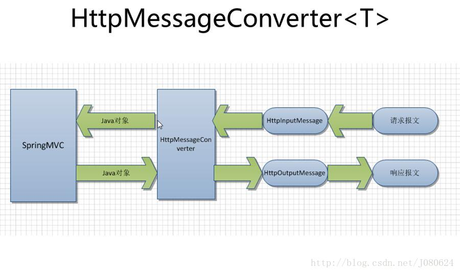
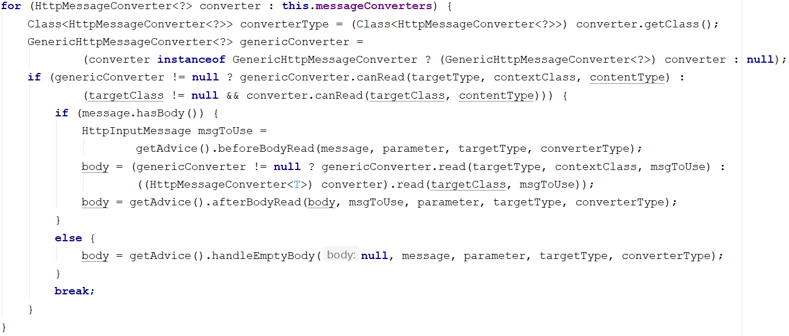

# HttpMessageConverter

​	`HttpMessageConverter<T>`是Spring的一个重要接口，它负责将请求信息转换为一个对象（类型为T），将对象（类型T）输出为响应信息。

​	DispatcherServlet默认以及安装了RequestMappingHandlerAdapter作为HandlerAdapter的组件实现类，HttpMessageConverter即由RequestMappingHandlerAdapter使用，将请求信息转换为对象，或将对象转换为响应信息。

## 一、`HttpMessageConverter<T>`接口

`HttpMessageConverter<T>`接口源码如下：

```java
public interface HttpMessageConverter<T> {
	boolean canRead(Class<?> clazz, @Nullable MediaType mediaType);
	boolean canWrite(Class<?> clazz, @Nullable MediaType mediaType);
	List<MediaType> getSupportedMediaTypes();
	T read(Class<? extends T> clazz, HttpInputMessage inputMessage)
			throws IOException, HttpMessageNotReadableException;
	void write(T t, @Nullable MediaType contentType, HttpOutputMessage outputMessage)
			throws IOException, HttpMessageNotWritableException;
}
```

它定义了如下几个方法：

1. `boolean canRead(Class<?> clazz, @Nullable MediaType mediaType);`

   指定转换器可以读取的对象类型，即转换器可将请求信息转换为clazz类型的对象；同时指定支持的MIME媒体类型（如text/html、application/json等）。

2. `boolean canWrite(Class<?> clazz, @Nullable MediaType mediaType);`

   指定转换器可以将clazz类型的对象写到响应流中，响应流支持的媒体类型在mediaType中定义。

3. `List<MediaType> getSupportedMediaTypes();`

   该转换器支持的媒体类型。

4. `T read(Class<? extends T> clazz, HttpInputMessage inputMessage);`

   将请求信息流转换为T类的对象。

5. `void write(T t, @Nullable MediaType contentType, HttpOutputMessage outputMessage);`

   将T类型的对象写到响应流中，同时指定响应的媒体类型为contentType。

## 二、Spring MVC消息转换器

### 2.1、提供的Http消息转换器

org.springframework.http.converter.json.GsonHttpMessageConverter

org.springframework.http.converter.ByteArrayHttpMessageConverter
org.springframework.http.converter.StringHttpMessageConverter
org.springframework.http.converter.StringHttpMessageConverter
org.springframework.http.converter.ResourceHttpMessageConverter
org.springframework.http.converter.ResourceRegionHttpMessageConverter
org.springframework.http.converter.xml.SourceHttpMessageConverter
org.springframework.http.converter.support.AllEncompassingFormHttpMessageConverter
org.springframework.http.converter.json.MappingJackson2HttpMessageConverter
org.springframework.http.converter.json.MappingJackson2HttpMessageConverter
org.springframework.http.converter.xml.Jaxb2RootElementHttpMessageConverter


### 2.2、默认注册的消息转换器


### 2.3、注册消息转换器


## 三、HttpMessageConverter应用

如何使用`HttpMessageConverter<T>`将请求信息转换并绑定到处理方法的入参中呢？Spring MVC提供了两种途径：

- 使用`@RequestBody`/`@ResponseBody`对处理方法进行标注。
- 使用`HttpEntity<T>`/`ResponseEntity<T>`作为处理方法的入参或返回值。

总结

- 当控制器处理方法使用`@RequestBody`/`@ResponseBody`或`HttpEntity<T>`/`ResponseEntity<T>`时，Spring MVC才使用注册的HttpMessageConverter对请求/响应消息进行处理。
- 当控制器处理方法使用`@RequestBody`/`@ResponseBody`或`HttpEntity<T>`/`ResponseEntity<T>`时，Spring MVC首先根据请求头或响应头的Accept属性选择匹配的HttpMessageConverter，然后根据参数类型或泛型类型得到匹配的HttpMessageConverter，如果找不到可用的HttpMessageConverter则报错。
- `@RequestBody`和`@ResponseBody`不需要成对出现。如果方法入参使用了`@RequestBody`，则Spring MVC选择匹配的HttpMessageConverter将请求消息转换并绑定到该入参中。如果处理方法标注了`@ResponseBody`，则Spring MVC选择匹配的HttpMessageConverter将方法返回值转换并输出响应消息。
- `HttpEntity<T>`/`ResponseEntity<T>`的功能和`@RequestBody`/`@ResponseBody`相似。

## 四、HttpMessageConverter原理





### 4.1、HttpMessageConverter匹配方式


### 4.2、HttpMessageConverter选择方式

​	通过上面的总结可以知道，Spring MVC对HttpMessageConverter选择首先根据**请求头或响应头的Accept属性**选择匹配的HttpMessageConverter，然后根据**参数类型或泛型类型**得到匹配的HttpMessageConverter。

​	既然如此，那么，根据这些匹配条件，如果有两个或两个以上都可以匹配的HttpMessageConverter，会选择哪一个呢？还是都选择？


在抽象类`org.springframework.web.servlet.mvc.method.annotation.AbstractMessageConverterMethodArgumentResolver`中


```java
/**
 * @since 3.1
 */
public abstract class AbstractMessageConverterMethodArgumentResolver implements HandlerMethodArgumentResolver {

	protected final Log logger = LogFactory.getLog(getClass());

	protected final List<HttpMessageConverter<?>> messageConverters;

	protected final List<MediaType> allSupportedMediaTypes;

	private final RequestResponseBodyAdviceChain advice;

    ......
    
	protected <T> Object readWithMessageConverters(
        HttpInputMessage inputMessage, MethodParameter parameter,Type targetType) throws IOException, HttpMediaTypeNotSupportedException, HttpMessageNotReadableException {
        ......
            
        for (HttpMessageConverter<?> converter : this.messageConverters) {
            ......
        }
        ......
	}
    ......
}
```




依次分析每行代码

1. 将HttpMessageConverter的class对象强转为`Class<HttpMessageConverter<?>>`。
2. 一个三目运算表达式，如果converter的类型是`GenericHttpMessageConverter`，则将converter强转为`GenericHttpMessageConverter`，否则，返回null。
3. 一个if判断，同样是三目运算符：判断第二步计算出的`GenericHttpMessageConverter`是否不等于null，如果不等于null，则使用`GenericHttpMessageConverter`的`canRead()`方法判断是否符合消息处理条件。如果等于null，则使用`HttpMessageConverter`的`canRead()`方法判断是否符合消息处理条件。如果不符合消息处理条件，则结束当前循环，重复进行前三个步骤。
4. 到了这里，就有一个`HttpMessageConverter`符合消息处理的条件，判断当前请求的消息体中是否有请求内容。
5. 如果当前请求的消息体中有请求内容：
   1. 将想要的请求信息封装为`HttpInputMessage`对象。
   2. 三目运算符，使用`GenericHttpMessageConverter`或者`HttpMessageConverter`的`read()`方法进行请求消息的转换处理。
   3. sd
6. 如果当前请求的消息体中没有有请求内容：
   1. sad
7. break退出循环，不在进行下一个消息转换器的判断。

到了第7步，就可以得出答案了：

> 如果有两个或两个以上都可以匹配的HttpMessageConverter，将会选择HTTP消息转换器列表中第一个匹配的HttpMessageConverter进行HTTP消息的转换处理。

### 4.3、HttpMessageConverter列表顺序

由于HttpMessageConverter的选择方式是选择列表中第一个配置的，所以，HTTP消息转换器列表中的HttpMessageConverter的顺序就非常重要了，那么Spring MVCS是如何控制HttpMessageConverter列表的顺序？

### 


## 五、自定义HttpMessageConverter

继承`org.springframework.http.converter.AbstractHttpMessageConverter`抽象类。

```java
import org.springframework.http.HttpInputMessage;
import org.springframework.http.HttpOutputMessage;
import org.springframework.http.converter.AbstractHttpMessageConverter;
import org.springframework.http.converter.HttpMessageNotReadableException;
import org.springframework.http.converter.HttpMessageNotWritableException;
import java.io.IOException;

public class MyHttpMessageConverter extends AbstractHttpMessageConverter<String> {

 	@Override
    protected boolean supports(Class<?> clazz) {
        return false;
    }

    @Override
    protected String readInternal(Class<? extends String> clazz, HttpInputMessage inputMessage) throws IOException, HttpMessageNotReadableException {
        return null;
    }

    @Override
    protected void writeInternal(String s, HttpOutputMessage outputMessage) throws IOException, HttpMessageNotWritableException {
    }
}
```

`org.springframework.http.converter.AbstractHttpMessageConverter`抽象类有三个抽象方法必须实现：

- `boolean supports(Class<?>)`

  指示此转换器是否支持给定的类。

- `T readInternal(Class<? extends T>, HttpInputMessage)`

  读取实际对象的抽象模板方法。从{@link #read}调用。

  要返回的对象的类型

  - 要从中读取的HTTP输入消息

- `void writeInternal(String, HttpOutputMessage)`

  编写实际主体的抽象模板方法。从{@link #write}调用。

  - 要写入输出消息的对象
  - 要写入的HTTP输出消息

完成自定义HttpMessageConverter后，**只需要将其注册为Bean即可自动添加到SpringMVC的请求链中**。

或者也可以通过手动添加：

```java

```


案例