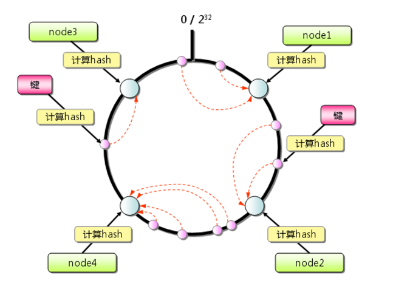
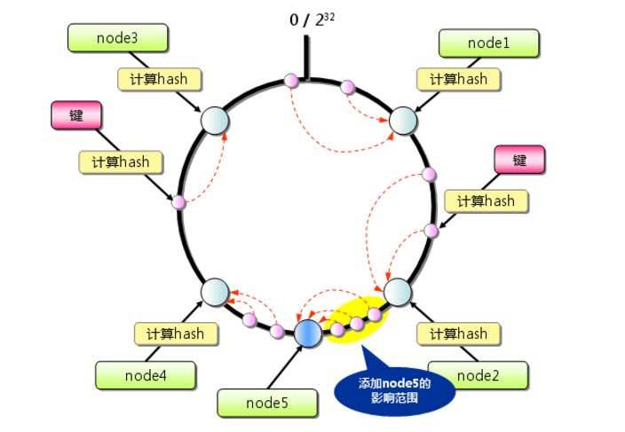

# 一致性哈希算法

## 一致性Hash算法背景

一致性哈希算法在1997年由麻省理工学院的Karger等人在解决分布式Cache中提出，设计的目标是为了解决因特网中的热点（Hot spot）问题，初衷和CARP十分类似。一致性哈希修正了CARP使用的简单哈希算法带来的问题，使得DHT可以在P2P环境中真正得到应用。

但现在一致性hash算法在分布式系统中也得到了了广泛的应用，研究过`memcached`缓存数据库的人都知道，`memcached`服务端本身不提供分布式cache的一致性，而是由客户端来提供，具体在计算一致性hash时采用如下步骤：

1. 首先求出`memcached`服务器（节点）的哈希值，并将其配置到`0`~`2^32`的环上。
2. 然后采用同样的方法求出存储数据的键的哈希值，并映射到相同的圆上。
3. 最后从数据映射到的位置开始顺时针查找，将数据保存到找到的第一个服务器上。如果超过`2^32`仍然找不到服务器，就会保存到第一台`memcached`服务器上。



从上图的状态中添加一台`memcached`服务器。余数分布式算法由于保存键的服务器会发生巨大变化而影响缓存的命中率。但一致性哈希中，只有在环上增加服务器的地点逆时针反向的第一台服务器上的键会受到影响，如下图所示：



## 一致性Hash性质

考虑到分布式系统的每个节点都有可能失效，并且新的节点很可能动态的增加进来，如何保证当系统的节点数目发生变化时仍然能够对外提供良好的服务，这是值得考虑的，尤其是在设计分布式缓存系统时。如果某台服务器失效，对于真个系统来说如果不采用合适的算法来保证一致性，那么缓存于系统中的所有数据都可能会失效（即由于系统节点数目变少，客户端在请求某一对象时需要重新计算其hash值）


https://www.cnblogs.com/cmt/p/14553189.html   （3月26日）


```java
import java.util.Objects;

/**
 * <p>一致性hash节点，包含节点名称和节点IP地址。</p>
 *
 * @author xlp
 */
public class Node {

    private String name;

    private String ip;

    public Node(String ip) {
        this(ip, ip);
    }

    public Node(String name, String ip) {
        Objects.requireNonNull(name, "The node name cannot be null.");
        Objects.requireNonNull(name, "The node ip cannot be null.");
        this.ip = ip;
        this.name = name;
    }

    public String getIp() {
        return ip;
    }

    public String getName() {
        return name;
    }

    @Override
    public String toString() {
        return "Node{" +
                "name='" + name + '\'' +
                ", ip='" + ip + '\'' +
                '}';
    }
}
```


```java
import java.util.*;

/**
 * <p>一致性hash</p>
 *
 * @author xlp
 */
public class ConsistencyHash {

    /**
     * 真实节点
     */
    private static final List<Node> ACTUAL_NODES = new LinkedList<>();

    /**
     * 真实节点名称
     */
    private static final Set<String> ACTUAL_NODE_NAMES = new HashSet<>();

    /**
     * 哈希环
     */
    private static final SortedMap<Integer, Node> HASH_RING = new TreeMap<>();

    /**
     * 默认的虚拟机节点数量
     */
    private static final int DEFAULT_VIRTUAL_NODE_NUM = 5;

    /**
     * 每个真实节点的虚拟机节点数量
     */
    private int virtualNodeNumber = DEFAULT_VIRTUAL_NODE_NUM;

    public ConsistencyHash() {

    }

    public ConsistencyHash(int virtualNodeNumber) {
        this.virtualNodeNumber = virtualNodeNumber;
    }

    /**
     * The register nodes.
     *
     * @param node The actual node.
     */
    public void registerNode(Node node) {
        if (ACTUAL_NODE_NAMES.contains(node.getName()))
            throw new ConsistencyHashNodeRepetitionException("The node name '" + node.getName() + "' already exists.");
        ACTUAL_NODES.add(node);
        ACTUAL_NODE_NAMES.add(node.getName());
        HASH_RING.put(hash(node.getName()), node);
        createVirtualNode(node);
    }

    /**
     * The register nodes.
     *
     * @param nodes The actual nodes.
     */
    public void registerNode(Collection<Node> nodes) {
        nodes.forEach(this::registerNode);
    }

    /**
     * 获取指定键临近hash环上的节点。
     *
     * @param key 键
     * @return 对应键临近hash环上的节点。
     */
    public Node getNode(String key) {
        int hash = hash(key);
        SortedMap<Integer, Node> subMap = HASH_RING.tailMap(hash);
        return subMap.isEmpty() ?
                HASH_RING.get(HASH_RING.firstKey()) :
                subMap.get(subMap.firstKey());
    }

    /**
     * Gets the actual nodes.
     *
     * @return The actual nodes.
     */
    public static List<Node> getActualNodes() {
        return new ArrayList<>(ACTUAL_NODES);
    }

    /**
     * Gets the actual number of nodes.
     *
     * @return The actual number of nodes.
     */
    public int getRealNodeNumber() {
        return ACTUAL_NODES.size();
    }

    /**
     * Creating a virtual nodes.
     *
     * @param node The actual node.
     */
    private void createVirtualNode(Node node) {
        for (int i = 0; i < virtualNodeNumber; i++) {
            Node n = new Node(node.getName() + "#" + i, node.getIp());
            HASH_RING.put(hash(n.getName()), n);
        }
    }

    /**
     * FNV1_32_HASH算法
     *
     * @param key 计算hash的字符串
     * @return hash值。
     */
    private static int hash(String key) {
        final int p = 16777619;
        int hash = (int) 2166136261L;
        for (int i = 0; i < key.length(); i++)
            hash = (hash ^ key.charAt(i)) * p;
        hash += hash << 13;
        hash ^= hash >> 7;
        hash += hash << 3;
        hash ^= hash >> 17;
        hash += hash << 5;
        // 如果算出来的值为负数则取其绝对值
        if (hash < 0)
            hash = Math.abs(hash);
        return hash;
    }
}
```

```java
/**
 * <p>一致性哈希节点重复异常：一致性哈希环中的节点名称不允许重复。</p>
 *
 * @author xlp
 */
public class ConsistencyHashNodeRepetitionException extends RuntimeException {

    public ConsistencyHashNodeRepetitionException(String message) {
        super(message);
    }
}
```

```java
public class ConsistencyHashTest {
    public static void main(String[] args) {
        ConsistencyHash hash = new ConsistencyHash();
        hash.registerNode(new Node("Node-A","192.168.56.1"));
        hash.registerNode(new Node("Node-B","202.168.56.2"));
        hash.registerNode(new Node("Node-C","122.168.56.3"));
        hash.registerNode(new Node("Node-D","132.155.56.4"));
        Node node = hash.getNode("user");
        System.out.println(node);
        System.out.println(node.getIp());
    }
}
```