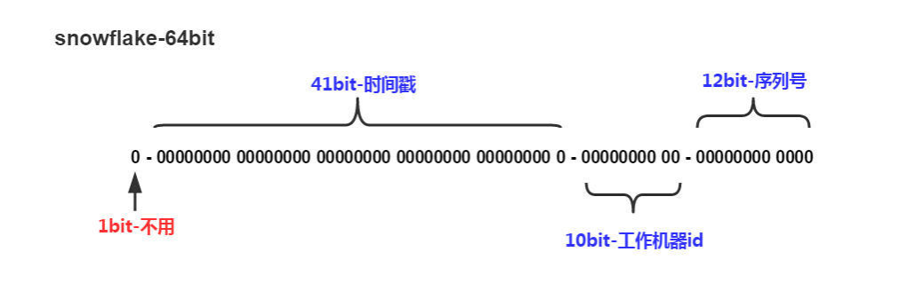

# 分布式ID方案总结

yuque.com/renyong-jmovm/kb/lgz2xv

ID是数据的唯一标识，传统的做法是利用UUID和数据库的自增ID，在互联网企业中，大部分公司使用的都是MySQL，并且因为需要事务支持，所以通常会使用Innodb存储引擎，UUID太长以及无序，所以并不适合在Innodb中来作为主键，自增ID比较合适，但是随着公司的业务发展，数据量将越来越大，需要对数据库进行分表，而分表后，每个表中的数据都会按自己的节奏进行自增，很有可能出现ID冲突。这时就需要一个单独的机制来负责生产唯一ID，生成出来的ID也可以叫做分布式ID，或全局ID。

下面来分析各个生成分布式ID的机制


## UUID

缺点：

1. 太长
2. 非自增

## 自增ID


分布式ID生成系统要求：

1. 高可用
2. 高并发


## 雪花算法

Snowflake是twitter开源的分布式ID生成算法，是一种算法，所以它和上面的三种生成分布式ID机制不太一样，它不依赖数据库。

核心思想：分布式ID固定是一个long型的数字，一个long型占8个字节，也就是64个bit，原始的snowflake算法中对于bit的分配如下图：



- 第一个bit位是标识部分，在java中由于long的最高位是符号位，正数是0，负数是1，一般生成的ID为正数，所以固定为0。
- 时间戳部分占41bit，这个是毫秒级的时间，一般实现上不会存储当前的时间戳，而是时间戳的差值（当前时间 - 固定的开始时间），这样可以使产生的ID从更小值开始；41位的时间戳可以使用69年，(1L << 41)/(1000 * 60 * 60 * 24 * 365) = 69年。
- 工作机器id占10bit，这里比较灵活，比如，可以使用前5位作为数据中心机房标识，后5位作为单机房机器标识，可以部署1024个结点。
- 序列号部分占12bit，支持同一毫秒内同一个结点可以生成4096个ID。

### java实现

```java
/**
 * <p>twitter的snowflake算法</p>
 *
 * @author xlp
 * @version 1.0.0
 */
public class Snowflake {

    //每一部分占用位数
    private static final int SEQUENCE_BIT = 12; //序列号
    private static final int MACHINE_BIT = 5; //机器标识
    private static final int DATA_CENTER_BIT = 5; //数据中心标识

    //每一部分最大值
    private static final long MAX_SEQUENCE_VALUE = ~(-1L << SEQUENCE_BIT);
    private static final long MAX_MACHINE_VALUE = ~(-1L << MACHINE_BIT);
    private static final long MAX_DATA_CENTER_VALUE = ~(-1L << DATA_CENTER_BIT);

    //每一部分左移位
    private static final int MACHINE_LEFT_OFFSET = SEQUENCE_BIT;
    private static final int DATA_CENTER_LEFT_OFFSET = MACHINE_LEFT_OFFSET + MACHINE_BIT;
    private static final int TIMESTAMP_LEFT_OFFSET = DATA_CENTER_LEFT_OFFSET + DATA_CENTER_BIT;

    /**
     * 起始时间
     */
    private final long startTimestamp;

    /**
     * 机器ID
     */
    private final long machineId;

    /**
     * 数据中心ID
     */
    private final long dataCenterId;

    /**
     * 序列号
     */
    private long sequenceNumber = 0L;

    /**
     * 上一次时间戳
     */
    private long lastTimestamp = -1L;

    public Snowflake(long startTimestamp, long machineId, long dataCenterId) {
        if (machineId > MAX_MACHINE_VALUE || machineId < 0) {
            throw new IllegalArgumentException("machineId can't be greater than MAX_MACHINE_VALUE or less then 0");
        }
        if (dataCenterId > MAX_DATA_CENTER_VALUE || dataCenterId < 0) {
            throw new IllegalArgumentException("dataCenterId can't be greater then MAX_DATA_CENTER_VALUE or less then 0");
        }
        this.startTimestamp = startTimestamp;
        this.machineId = machineId;
        this.dataCenterId = dataCenterId;
    }

    public synchronized long nextId() {
        long currentTimestamp = System.currentTimeMillis();
        //处理时间回溯的情况
        if (currentTimestamp < lastTimestamp) {
            throw new NiveousSnowflakeException("Clock moved backwards. Refusing to generate id");
        }
        if (currentTimestamp == lastTimestamp) {
            //同一毫秒内，序列号自增
            sequenceNumber = (sequenceNumber + 1) & MAX_SEQUENCE_VALUE;
            //序列号到达最大值（当前毫秒内的序列号已经用完），等待至下一毫秒
            if (sequenceNumber == 0L) {
                currentTimestamp = getNextTimestamp();
            }
        } else {
            //新的毫秒，将序列号重置为0
            sequenceNumber = 0L;
        }
        lastTimestamp = currentTimestamp;
        //组装每一部分数据
        return (currentTimestamp - startTimestamp) << TIMESTAMP_LEFT_OFFSET //时间戳部分
                | dataCenterId << DATA_CENTER_LEFT_OFFSET                   //数据中心部分
                | machineId << MACHINE_LEFT_OFFSET                          //机器标识部分
                | sequenceNumber;                                           //序列号部分
    }

    /**
     * 获取上一次时间戳之后时间戳，只有当当前时间大于上一次时间，就会返回。
     *
     * @return 时间搓
     */
    private long getNextTimestamp() {
        long mill;
        do {
            mill = System.currentTimeMillis();
        } while (mill <= lastTimestamp);
        return mill;
    }
}
```

### nextId()方法执行缓慢

注意`nextId()`方法中，同一毫秒内，序列号自增时，一定不能写`sequenceNumber++`，如果这样写的话将会发现`nextId()`执行特别缓慢，差不多一千多毫秒生成一千条左右的ID。

这里因为java中++操作的原因，如下例子：

```java
int i = 0;
System.out.println(i++); //输出 0
int i = 0;
System.out.println(++i); //输出 1
```

如果写成`sequenceNumber++`：

```java
sequenceNumber = (sequenceNumber++) & MAX_SEQUENCE_VALUE;
```

将会导致如下情形：

- 第一次sequenceNumber等于0， 执行`sequenceNumber++`返回0，`0 & MAX_SEQUENCE_VALUE`还是0，最后将0赋值给sequenceNumber。
- 第二次sequenceNumber还是等于0， 执行`sequenceNumber++`返回0，`0 & MAX_SEQUENCE_VALUE`还是0，最后将0赋值给sequenceNumber。
- 第三次......
- ......

看出来了吗，在同一毫秒内，sequenceNumber始终等于0，没有起作用。而且会导致后续代码始终执行。后续代码如下：

```java
if (sequenceNumber == 0L) {
    currentTimestamp = getNextTimestamp();
}
```

也就说在同一毫秒内获取的每一个ID，都会执行`getNextTimestamp()`方法，从而不得不等待至少1毫秒。这就是效率低下的根源。

可以更改为如下方式：

```java
sequenceNumber = (sequenceNumber + 1) & MAX_SEQUENCE_VALUE;
```

不推荐使用`++sequenceNumber`，因为`++sequenceNumber`会改变sequenceNumber本身的值。


**代码分析**

如上代码所示，其核心的逻辑是`nextId()`方法。执行流程如下：

1. 获取当前系统的时间戳。
2. 处理时间回溯的情况，即可能调整了系统是时间。
3. 并发情况下，多个请求会在同一毫秒请求到，这时将序列号将自增。如果不是同一毫秒，则将序列号重置为0。序列号存在就是用于处理同一毫秒请求到的情况，而每一毫秒的序列号都是从0开始。
4. 序列号最大长度12，如果序列号超过最大数，则使用while循环强行等待获取下一毫秒。
5. 将每一部分数据向左移动到相应的位，并使用按位异或运算组装ID。