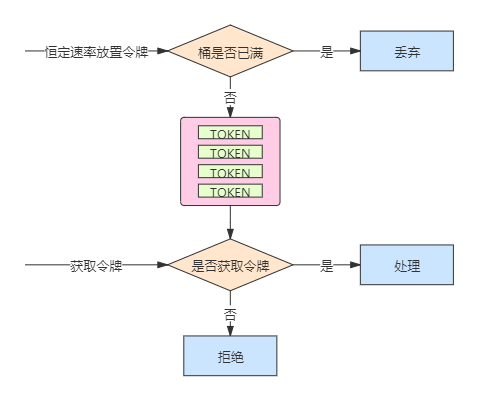
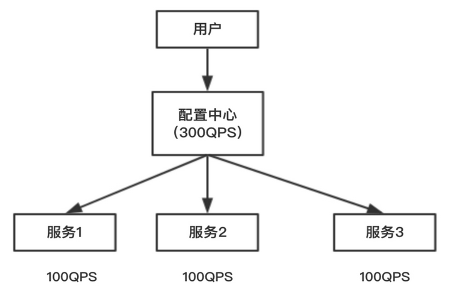
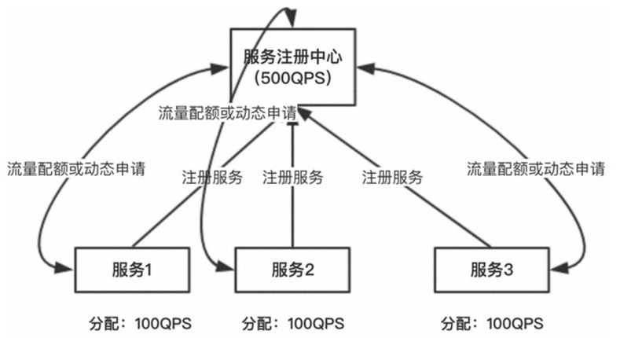

# 服务限流

## 服务限流的定义

限流通过对某一时间窗口内的请求数进行限制，保持系统的可用性和稳定性，防止因流量暴增而导致系统运行缓慢或宕机。限流的根本目的是为了保障服务的高可用。流量控制与限流的含义相似，只是表达方式不一样而已。

## 服务限流的算法

### 计数器

采用计数器是一种比较简单的限流算法，一般我们会限制一秒钟能够通过的请求数。比如限流QPS为100，算法的实现思路就是从第一个请求进来开始计时，在接下来的1秒内，每来一个请求，就把计数加1，如果累加的数字达到了100，后续的请求就会被全部拒绝。等到1秒结束后，把计数恢复成0，重新开始计数。如果在单位时间1秒内的前10毫秒处理了100个请求，那么后面的990毫秒会拒绝所有的请求，我们把这种现象称为“突刺现象”。

### 漏桶算法

漏桶算法的思路很简单，一个固定容量的漏桶按照常量固定速率流出水滴。如果桶是空的，就不需要流出水滴。我们可以按照任意速率流入水滴到漏桶中。如果流入的水滴超出了桶的容量，流入的水滴就会溢出（被丢弃），而漏桶容量是不变的。

漏桶算法的原理大致如下：


漏桶算法提供了一种机制，通过它可以让突发流量被整形，以便为网络提供稳定的流量。

### 令牌桶算法

令牌桶算法是比较常见的限流算法之一，可以使用它进行接口限流。

原理如下图所示：



令牌按固定的速率被放入令牌桶中，例如tokens/秒。桶中最多存放b个令牌（Token），当桶装满时，新添加的令牌被丢弃或被拒绝。当请求到达时，将从桶中删除1个令牌。令牌桶中的令牌不仅可以被移除，还可以往里添加，所以为了保证接口随时有数据通过，必须不停的往桶里加令牌。由此可见，往桶里加令牌的速度就决定了数据通过接口的速度。我们通过控制往令牌桶里加令牌的速度从而控制接口的流量。

### 漏桶算法和令牌桶算法的区别

漏桶算法和令牌桶算法的主要区别在于：

- 漏桶算法是按照常量固定速率流出请求的，流入的请求速率任意，当流入的请求数累积到漏桶容量时，新流入的请求被拒绝。
- 令牌桶算法是按照固定速率往桶中添加令牌的，请求是否被处理需要看桶中的令牌是否足够，当令牌数减为零时，拒绝新的请求。
- 令牌桶算法允许突发请求，只要有令牌就可以处理请求，允许一定程度的突发流量。
- 漏桶算法限制的是常量流出速率，从而使突发流入速率平滑。

## 限流的设计

静态限流相对比较简单，在服务启动之前，预先在配置中配置总QPS阈值，根据集群节点的个数计算每个节点需要分摊的QPS。节点服务启动时，将节点的QPS阈值加载到内存中，当请求量达到阈值时，拒绝请求。

静态限流简单原理如下图所示：



由上图可知，配置中心配置了服务集群总的QPS阈值为300，分摊到每个节点服务的QPS为100，服务启动的时候，将各自的QPS阈值加载到内存中，在约定的周期T内对请求数计数（可使用线程安全的Atomic原子操作类实现计数功能），当请求数达到阈值时，服务拒绝请求。

静态限流的缺点：

1. 服务节点数发生变化时，比如服务1宕机，需要实时手工调整配置中心预置的QPS阈值。
2. 服务节点无法根据业务量的变化动态调整。

因为静态配置QPS阈值的缺点，在工作中一般采用服务注册中心的方式动态配置QPS阈值，基本原理如下图所示：



1. 服务节点在服务注册中心完成注册。
2. 服务注册中心根据服务节点的数量，预先拿出一定比例的配额做初始化分配，剩余的配额放在资源池中。如上图所示，每个服务预先分配100QPS。
3. 当某个服务节点配额使用完后，就主动向服务注册中心申请配额。
4. 当总QPS配额被用完后，就返回0配额给申请配额的服务节点，之后服务节点对新接入的请求信息进行流控。

## 分级限流

资源可分为系统资源和应用资源两类，系统资源包括应用进程所在主机JVM的CPU使用率和内存利用率，应用资源包括JVM堆内存使用率、消息队列积压率等。系统CPU或者内存过载、应用内部的资源耗尽等都会触发限流。触发限流的因素称为流控因子。流控是分级的，不同的级别有不同的流控阈值，每个级别流控系统数都不相同，也就是被拒绝的消息比例不同。每个级别都有相应的流控阈值，该阈值支持在线动态调整。系统上线后一般会提供默认的流控阈值，不同的流控因子流控阈值不同。

## 单机限流

### 基于Guava的`RateLimiter`限流实现（JAVA）

基于Guava的`RateLimiter`实现限流。

通过AOP实现对接口限流的控制。首先创建一个注解，用于标注需要限流的接口。注解如下：

```java
@Documented
@Retention(RetentionPolicy.RUNTIME)
@Target(ElementType.METHOD)
public @interface XlpRateLimiter {

    /**
     * 限流速率，令牌桶放入令牌的速率。
     * @return 限流速率。
     */
    double rate();

    /**
     * 获取令牌的超时时间
     *
     * @return 超时时间，单位秒
     */
    long timeout() default -1;
}
```

当一个接口需要限流时，标注此注解即可，代码如下：

```java
@PostMapping
@XlpRateLimiter(rate = 200.0)
public Boolean doFunction() {
    // do something ...
}
```

限流AOP实现：拦截所有标注了`@XlpRateLimiter`注解的方法，对其进行限流。代码如下：

```java
@Aspect
@Component
@SuppressWarnings("UnstableApiUsage")
public class RateLimiterAspect {

    /**
     * Google的令牌桶限流速率器。
     */
    private static final RateLimiter RATE_LIMITER = RateLimiter.create(700);

    /**
     * 拦截所有标注了{@link XlpRateLimiter}注解的方法，对其进行限流。
     */
    @Around("@annotation(XlpRateLimiter)")
    public Object process(ProceedingJoinPoint joinPoint) throws Throwable {
        var signature = (MethodSignature)joinPoint.getSignature();
        var rateLimiter = AnnotationUtils.getAnnotation(signature.getMethod(),XlpRateLimiter.class);
        Preconditions.checkNotNull(rateLimiter);
        var rate = rateLimiter.rate();
        var timeout = rateLimiter.timeout();

        //设置限流速率
        RATE_LIMITER.setRate(rate);

        //尝试获取令牌
        if (RATE_LIMITER.tryAcquire(timeout, TimeUnit.MILLISECONDS)) {
            return joinPoint.proceed(joinPoint.getArgs());
        }
        //被限流，服务降级
        fallback();
        return null;
    }

    private void fallback() throws IOException {
        ServletRequestAttributes servletRequestAttributes = (ServletRequestAttributes)RequestContextHolder.getRequestAttributes();
        Preconditions.checkNotNull(servletRequestAttributes);
        HttpServletResponse response = servletRequestAttributes.getResponse();
        Preconditions.checkNotNull(response);
        response.setCharacterEncoding(StandardCharsets.UTF_8.name());
        response.setContentType(MediaType.TEXT_HTML_VALUE);
        try (PrintWriter writer = response.getWriter()){
            writer.print("哎呀，服务器开小差了，请重试一下吧(*￣︶￣)");
            writer.flush();
        }
    }
}
```

## 分布式限流

分布式限流最关键的是要将限流服务做成全局，可以采用`Redis`+`Lua`技术进行实现，通过这种技术可以实现高并发和高性能的限流。

> Lua是一种轻量小巧的脚本编程语言，用标准C语言编写并以源代码形式开放。其设计目的是为了嵌入到应用程序中，为应用程序提供灵活的扩展和订制功能。
>
> Lua是巴西里约热内卢天主教大学里的一个研究小组于1993年开发的。

Redis+Lua实现中的Lua脚本：

```lua
local key = KEYS[1] -- 限流KEY
local limit = tonumber(ARGV[1]) -- 限流大小
local current = tonumber(redis.call('get',key) or "0")
if current + 1 > limit then --如果超出限流大小
    return 0 -- 被限流了
else -- 请求数+1，并设置2秒过期
    redis.call("INCRBY",key,"1")
    redis.call("expire",key,"2")
    return 1 -- 没有被限流，可以正常访问
end
```

脚本说明：

1. 在Lua脚本中，有两个全局变量，是用来接收Redis应用端传递的键和其他参数，分别为`KEYS`和`ARGV`.
2. 在应用端传递`KEYS`时是一个数组列表，在Lua脚本中通过索引下表方式获取数组内的值。
3. 在应用端传递`ARGV`时参数比较灵活，可以是一个或多个独立的参数，但对应到Lua脚本中统一用`ARGV`这个数组接收，获取方式也是通过数组下标获取。
4. 以上操作是在一个Lua脚本中，又因为Redis执行请求是单线程的，因此Redis+Lua的处理方式也是线程安全的，是原子性的。

> 如果一个操作是不可分割的，是多线程安全的，我们就称为原子性操作。

### 基于Redis实现分布式限流（JAVA）

通过AOP实现对接口限流的控制。首先创建一个注解，用于标注需要限流的接口。注解如下：

```java
@Documented
@Retention(RetentionPolicy.RUNTIME)
@Target(ElementType.METHOD)
public @interface XlpRateLimiter {

    /**
     * 限流速率，令牌桶放入令牌的速率。
     * @return 限流速率。
     */
    double rate();
}
```

当一个接口需要限流时，标注此注解即可，代码如下：

```java
@PostMapping
@XlpRateLimiter(rate = 200.0)
public Boolean doFunction() {
    // do something ...
}
```

使用了Spring Data Redis，这一步需要创建相应的限流Lua脚本放置在Class Path下，并通过`DefaultRedisScript`加载，将其注册为Bean。代码如下：

```java
@Bean
public DefaultRedisScript<Long> rateLimiterScript(){
    DefaultRedisScript<Long> script = new DefaultRedisScript<>();
    script.setResultType(Long.class);
    script.setScriptSource(new ResourceScriptSource(new ClassPathResource("script/rateLimiter.lua")));
    return script;
}
```

限流AOP实现：拦截所有标注了`@XlpRateLimiter`注解的方法，对其进行限流。代码如下：

```java
@Aspect
@Component
public class DistributedRateLimiterAspect {

    @Autowired
    private StringRedisTemplate redisTemplate;

    @Autowired
    @Qualifier("rateLimiterScript")
    private RedisScript<Long> redisScript;

    /**
     * 拦截所有标注了{@link XlpRateLimiter}注解的方法，对其进行限流。
     */
    @Around("@annotation(XlpRateLimiter)")
    public Object process(ProceedingJoinPoint joinPoint) throws Throwable {
        var signature = (MethodSignature) joinPoint.getSignature();
        var rateLimiter = AnnotationUtils.getAnnotation(signature.getMethod(), XlpRateLimiter.class);
        Preconditions.checkNotNull(rateLimiter);
        var rate = rateLimiter.rate();
        if (tryAcquire(rate)) {
            return joinPoint.proceed(joinPoint.getArgs());
        }
        //被限流，服务降级
        fallback();
        return null;
    }

    /**
     * 尝试获取令牌。
     *
     * @param rate 速率
     * @return 获取成功返回true，反之false。
     */
    private boolean tryAcquire(double rate){
        String key = "r:l:" + System.currentTimeMillis()/1000;
        String argv = rate + "";
        Long execute = redisTemplate.execute(redisScript, List.of(key), argv);
        return execute != null && execute == 1;
    }

    private void fallback() throws IOException {
        ServletRequestAttributes servletRequestAttributes = (ServletRequestAttributes) RequestContextHolder.getRequestAttributes();
        Preconditions.checkNotNull(servletRequestAttributes);
        HttpServletResponse response = servletRequestAttributes.getResponse();
        Preconditions.checkNotNull(response);
        response.setCharacterEncoding(StandardCharsets.UTF_8.name());
        response.setContentType(MediaType.TEXT_HTML_VALUE);
        try (PrintWriter writer = response.getWriter()){
            writer.print("哎呀，服务器开小差了，请重试一下吧(*￣︶￣)");
            writer.flush();
        }
    }
}
```

从Redis中获取令牌时，是通过当前系统时间秒数为键去获取的，当时间来到下一秒时，就是一个新的限流周期。但这里需要注意的是，这里是通过`System.currentTimeMillis()`去获取的时间，如果该服务部署为集群，集群中的不同机器时间戳可能不同，进而导致限流与预期不符。例如节点A时间为100，节点B时间为101，下一秒时，节点A时间变为101，节点B时间变为102，此时节点A就与之前节点B所产生的时间101重叠，导致节点A没有做任何请求的处理就被限流了。因此，这时间最好是有统一的来源。
