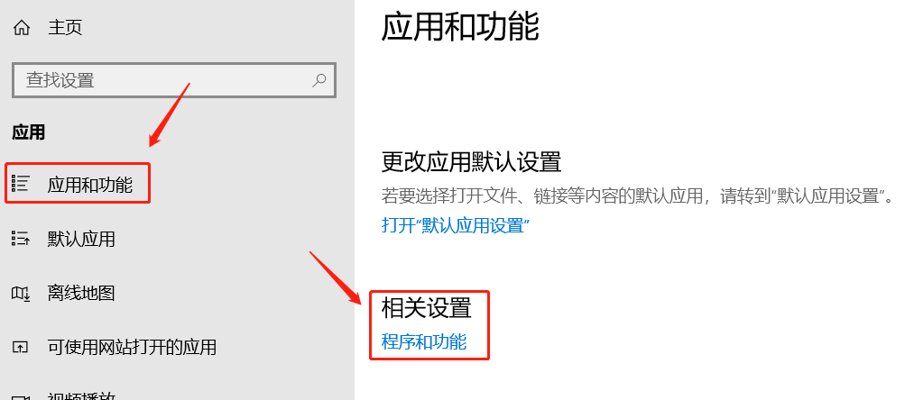
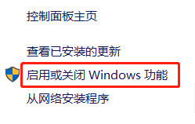
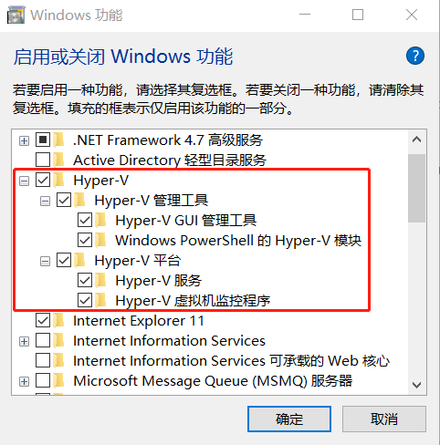
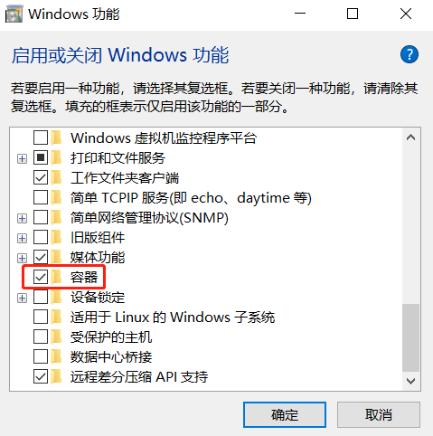
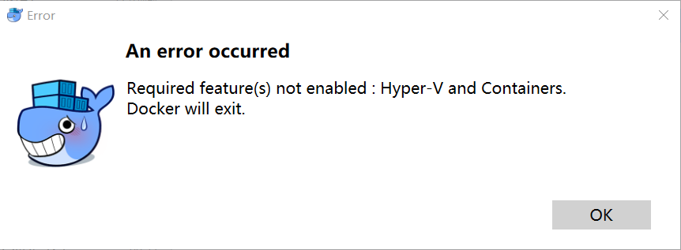
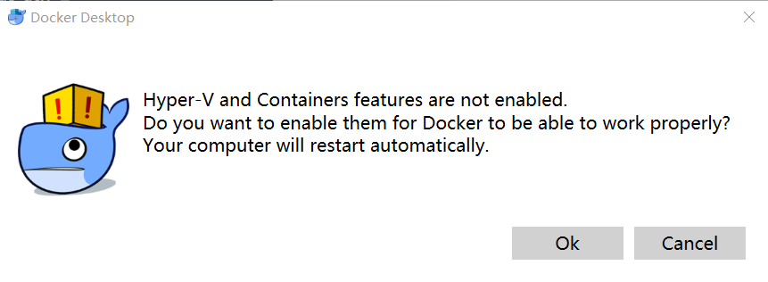
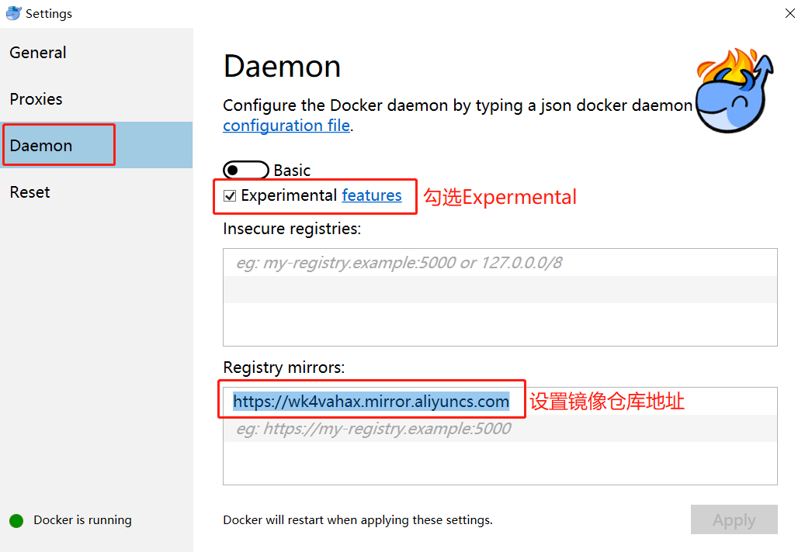
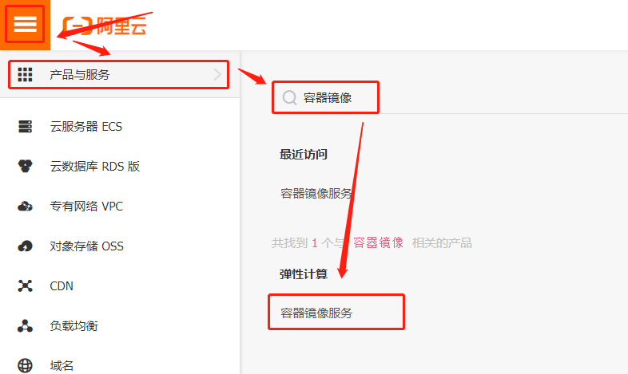
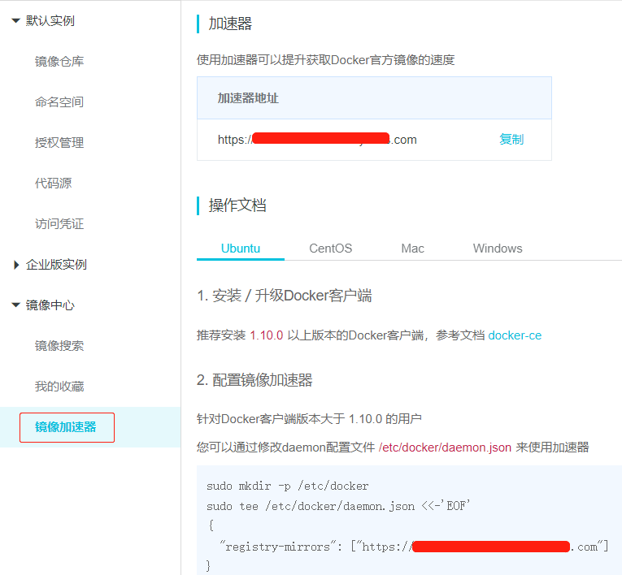

# Docker

docker官方文档地址：https://docs.docker.com/

docker官方镜像仓库：<https://hub.docker.com/>

其他资源

runoob docker教程：<https://www.runoob.com/docker/docker-tutorial.html>

docker中文：<http://www.docker.org.cn/index.html>

## Docker安装


### Windows Docker安装

Windows下进行docker安装有两种方式，分别是*Docker Toolbox*和*Docker for Windows*。

对于Windows 10以下的用户，推荐使用*Docker Toolbox*

Windows安装文件：<http://mirrors.aliyun.com/docker-toolbox/windows/docker-toolbox/>

对于Windows 10以上的用户，推荐使用*Docker for Windows*

Windows安装文件：[http://mirrors.aliyun.com/docker-toolbox/windows/docker-for-windows/](http://mirrors.aliyun.com/docker-toolbox/windows/docker-for-windows/?spm=5176.8351553.0.0.79331991fXl18F)

> 上述两个安装文件的地址由阿里云提供。

#### 一、安装Docker Toolbox

#### 二、安装Docker for Windows

在window10上安装Docker for Windows，需要开启Hyper-V和容器。

##### 1. 开启Hyper-V和容器

在Windows10上安装Docker for Windows需要开启***Hyper-V***和***容器***。

1. 右键Windows图标—>应用和功能(F)

   

2. 拉到最底部，点击*程序和功能*。

   

3. 点击*启用或关闭Windows功能*。

   

4. 找到*Hyper-V*和*容器*并勾选。

   

5. 最后点击*确定*，即完成Hyper-V和容器的开启。

##### 2. 安装Docker for Windows Installer.exe

直接一路下一步即可。

其实可以直接略过第一步（开启Hyper-V和容器），直接进行第二步的Docker for Windows Installer.exe的安装，可以正常安装成功，但是因为没有启用*Hyper-V*和*容器*，所以将会提示如下两个错误信息：





译文如下：

```
必须的特性没有启动：Hyper-V和Containers。
Docker将退出。
```

```
Hyper-V和Containers特性没有启动。
你想启动它们而让Docker能够正常工作吗?
你的电脑将自动重启。
```

大体的意思是，没有启动Hyper-V和containers功能，docker想帮助我启动。所以点击Ok，重启系统即可。

**点击Ok重启系统**

在重启系统之后启动docker，报如下错误：

```shell
Unable to start: 已停止该运行的命令，因为首选项变量“ErrorActionPreference”或通用参数设置为 Stop: “MobyLinuxVM”无法启动。

启动虚拟机“MobyLinuxVM”失败，因为一个 Hyper-V 组件未运行。

“MobyLinuxVM”无法启动。(虚拟机 ID 983B9BB2-9F39-4856-8F32-5D30F74F02FA)

虚拟机管理服务无法启动虚拟机“MobyLinuxVM”，因为一个 Hyper-V 组件尚未运行。(虚拟机 ID 983B9BB2-9F39-4856-8F32-5D30F74F02FA)。
......
......
```

docker没有启动成功，右下角的小鲸鱼是红色的。解决方式是右键右下角的小鲸鱼，点击*Switch to windows containers...*。

<div style="color:green">原因：Docker for windows有两种运行模式，一种运行Window相关容器，一种允许传统的Linux容器。同一时间只能选择一种模式运行。</div>

##### 3. Docker Desktop设置

在系统右下角托盘图标内右键菜单选择 *Settings*，打开配置窗口后左侧导航菜单选择 Docker Daemon。勾选Expermental并设置镜像仓库地址。然后点击Apply应用配置。



> **注意：**
>
> 必须勾选勾选Expermental。如果不勾选在拉取镜像时将会有如下错误信息：
>
> ```shell
> C:\Users\administrator>docker pull hello-world
> Using default tag: latest
> latest: Pulling from library/hello-world
> latest: Pulling from library/hello-world
> no matching manifest for unknown in the manifest list entries
> ```
>
> 需要设置一个有效的镜像仓库地址。因为“墙”的原因，docker官方镜像地址不能被访问，所以需要手动配置一个有效的镜像仓库地址，如果不设置，将会有如下错误信息：
>
> ```shell
> C:\Users\administratorg>docker pull hello-world
> Using default tag: latest
> error during connect: Post http://%2F%2F.%2Fpipe%2Fdocker_engine/v1.39/images/create?fromImage=hello-world&tag=latest: open //./pipe/docker_engine: The system cannot find the file specified. In the default daemon configuration on Windows, the docker client must be run elevated to connect. This error may also indicate that the docker daemon is not running.
> ```

#### 测试docker安装结果

打开cmd窗口，执行docker命令测试。

```bash
C:\Users\administrato>docker version
Client: Docker Engine - Community
 ......

Server: Docker Engine - Community
 Engine:
  ......

C:\Users\administrato>docker images
REPOSITORY          TAG                 IMAGE ID            CREATED             SIZE
hello-world         latest              fce289e99eb9        12 months ago       62kB

C:\Users\administrato>docker pull hello-world
Using default tag: latest
latest: Pulling from library/hello-world
Digest: sha256:d1668a9a1f5b42ed3f46b70b9cb7c88fd8bdc8a2d73509bb0041cf436018fbf5
Status: Image is up to date for hello-world:latest
```

安装成功。


<http://mirrors.aliyun.com/docker-toolbox/>


<http://mirrors.aliyun.com/docker-toolbox/windows/docker-toolbox/>


```shell
[root@localhost ~]# wget -qO- https://get.docker.com/ | sh
# Executing docker install script, commit: 2f4ae48
+ sh -c 'yum install -y -q yum-utils'
+ sh -c 'yum-config-manager --add-repo https://download.docker.com/linux/centos/docker-ce.repo'
已加载插件：fastestmirror
adding repo from: https://download.docker.com/linux/centos/docker-ce.repo
grabbing file https://download.docker.com/linux/centos/docker-ce.repo to /etc/yum.repos.d/docker-ce.repo
repo saved to /etc/yum.repos.d/docker-ce.repo
+ '[' stable '!=' stable ']'
+ sh -c 'yum makecache'
已加载插件：fastestmirror
Loading mirror speeds from cached hostfile
 * base: mirrors.cqu.edu.cn
 * extras: mirrors.aliyun.com
 * updates: mirrors.aliyun.com
base                                                                                        | 3.6 kB  00:00:00     
docker-ce-stable                                                                            | 3.5 kB  00:00:00     
extras                                                                                      | 3.4 kB  00:00:00     
updates                                                                                     | 3.4 kB  00:00:00     
(1/12): docker-ce-stable/x86_64/updateinfo                                                  |   55 B  00:00:01     
(2/12): docker-ce-stable/x86_64/primary_db                                                  |  28 kB  00:00:00     
(3/12): docker-ce-stable/x86_64/other_db                                                    | 111 kB  00:00:01     
(4/12): docker-ce-stable/x86_64/filelists_db                                                |  14 kB  00:00:03     
(5/12): extras/7/x86_64/prestodelta                                                         |  62 kB  00:00:01     
(6/12): extras/7/x86_64/filelists_db                                                        | 243 kB  00:00:02     
(7/12): extras/7/x86_64/other_db                                                            | 126 kB  00:00:00     
(8/12): updates/7/x86_64/prestodelta                                                        | 681 kB  00:00:00     
(9/12): updates/7/x86_64/other_db                                                           | 588 kB  00:00:00     
(10/12): base/7/x86_64/other_db                                                             | 2.6 MB  00:00:11     
(11/12): base/7/x86_64/filelists_db                                                         | 7.1 MB  00:00:23     
(12/12): updates/7/x86_64/filelists_db                                                      | 3.7 MB  00:00:19     
元数据缓存已建立
+ '[' -n '' ']'
+ sh -c 'yum install -y -q docker-ce'
Delta RPMs disabled because /usr/bin/applydeltarpm not installed.
warning: /var/cache/yum/x86_64/7/docker-ce-stable/packages/docker-ce-18.09.6-3.el7.x86_64.rpm: Header V4 RSA/SHA512 Signature, key ID 621e9f35: NOKEY
docker-ce-18.09.6-3.el7.x86_64.rpm 的公钥尚未安装
http://mirrors.nwsuaf.edu.cn/centos/7.6.1810/os/x86_64/Packages/libsepol-devel-2.5-10.el7.x86_64.rpm: [Errno 14] HTTP Error 503 - Service Unavailable
正在尝试其它镜像。
导入 GPG key 0x621E9F35:
 用户ID     : "Docker Release (CE rpm) <docker@docker.com>"
 指纹       : 060a 61c5 1b55 8a7f 742b 77aa c52f eb6b 621e 9f35
 来自       : https://download.docker.com/linux/centos/gpg
If you would like to use Docker as a non-root user, you should now consider
adding your user to the "docker" group with something like:

  sudo usermod -aG docker your-user

Remember that you will have to log out and back in for this to take effect!

WARNING: Adding a user to the "docker" group will grant the ability to run
         containers which can be used to obtain root privileges on the
         docker host.
         Refer to https://docs.docker.com/engine/security/security/#docker-daemon-attack-surface
         for more information.
```


# docker
docker文档地址：https://docs.docker.com

## moby、docker-ce和docker-ee的区别
最早的时候docker就是一个开源项目，主要是由docker公司维护。
2017年初，docker公司将原先的docker项目改名为moby，并创建了docker-ce和docker-ee。

- moby是继承了原先的docker的项目，是社区维护的开源项目，谁都可以在moby的基础打造自己的容器产品。
- docker-ce是docker公司维护的开源项目，是一个基于moby项目的免费的容器产品。
- docker-ee是docker公司维护的闭源产品，是docker公司的商业产品（简单的说，就是要付钱的）。


Cannot connect to the Docker daemon at unix:///var/run/docker.sock. Is the docker daemon running?
[root@localhost ~]# systemctl start docker


## images


### 获取镜像 acquire images

```shell
# docker pull name[:tag]
```

例如：docker pull mysql


```shell
Usage:	docker pull [OPTIONS] NAME[:TAG|@DIGEST]

Pull an image or a repository from a registry

Options:
  -a, --all-tags                Download all tagged images in the repository
      --disable-content-trust   Skip image verification (default true)
```


### 查看镜像信息

语法

```
docker images [OPTIONS] [REPOSITORY[:TAG]]
```

```shell
Usage:	docker images [OPTIONS] [REPOSITORY[:TAG]]

List images

Options:
  -a, --all             Show all images (default hides intermediate images)
      --digests         Show digests
  -f, --filter filter   Filter output based on conditions provided
      --format string   Pretty-print images using a Go template
      --no-trunc        Don't truncate output
  -q, --quiet           Only show numeric IDs
```


选项

```
  -a, --all             Show all images (default hides intermediate images)
      --digests         Show digests
  -f, --filter filter   Filter output based on conditions provided
      --format string   Pretty-print images using a Go template
      --no-trunc        Don't truncate output
  -q, --quiet           Only show numeric IDs
```


参数


实例


```shell
[root@localhost ~]# docker images --help

Usage:	docker images [OPTIONS] [REPOSITORY[:TAG]]

List images

Options:
  -a, --all             Show all images (default hides intermediate images)
      --digests         Show digests
  -f, --filter filter   Filter output based on conditions provided
      --format string   Pretty-print images using a Go template
      --no-trunc        Don't truncate output
  -q, --quiet           Only show numeric IDs
  
  
[root@localhost ~]# man docker-images
NAME
       docker-images - List images

SYNOPSIS
       docker images [OPTIONS] [REPOSITORY[:TAG]]

DESCRIPTION
       Alias for docker image ls.

OPTIONS
       -a, --all[=false]
           Show all images (default hides intermediate images)

       --digests[=false]
           Show digests

       -f, --filter=
           Filter output based on conditions provided

       --format=""
           Pretty-print images using a Go template

       -h, --help[=false]
           help for images

       --no-trunc[=false]
           Don't truncate output

       -q, --quiet[=false]
           Only show numeric IDs

SEE ALSO
       docker(1)
```


### 搜寻镜像

docker search TERM


```shell
Usage:	docker search [OPTIONS] TERM

Search the Docker Hub for images

Options:
  -f, --filter filter   Filter output based on conditions provided
      --format string   Pretty-print search using a Go template
      --limit int       Max number of search results (default 25)
      --no-trunc        Don't truncate output
```


### 删除镜像

删除一个或多个镜像

**语法**

```shell
$ docker rmi [OPTIONS] IMAGE [IMAGE...]
```

IMAGE可以为**标签**或**[部分]ID**。

删除镜像的命令是`docker rmi INAGE [IMAGE...]`，其中IMAGE可以为**标签**或**ID**。

**选项**

| 选项        | 说明                           |
| ----------- | ------------------------------ |
| -f, --force | 强制删除镜像。                 |
| --no-prune  | Do not delete untagged parents |

如果镜像对应的容器正在运行，不能直接删除镜像，可以直接`-f`选项强制删除。

**示例**

```shell
[root@localhost ~]# docker rmi nginx:latest
[root@localhost ~]# docker rmi fce289e99eb9
```

如果容器正在运行，不能删除镜像

```shell
[root@localhost sss]# docker rmi register:1.0.0
Error response from daemon: conflict: unable to remove repository reference "register:1.0.0" (must force) - container e22fa860294e is using its referenced image 33f233c6b8a1
```

使用-f选项强制删除：

但是实际上镜像不会被删除，会将`REPOSITORY`和`TAG`变为`<none>`，而对应运行的容器仍然是正常运行。

```shell
[root@localhost opt]# docker images
REPOSITORY          TAG                 IMAGE ID            CREATED             SIZE
register            1.0.0               33f233c6b8a1        12 hours ago        689MB
[root@localhost opt]# docker rmi -f register:1.0.0
Untagged: register:1.0.0
[root@localhost opt]# docker images
REPOSITORY          TAG                 IMAGE ID            CREATED             SIZE
<none>              <none>              33f233c6b8a1        12 hours ago        689MB
```


### 创建镜像

创建镜像有三种方式：

- 基于已有镜像的容器创建。

- 基于本地模板导入。

- 基础Dockerfile创建。

1. 基于已有镜像的容器创建。

   asd

   ```shell
   $ docker commit [OPTION] CONTAINER [REPOSITORY[:TAG]]
   ```

   

   ```shell
   Usage:	docker commit [OPTIONS] CONTAINER [REPOSITORY[:TAG]]
   
   Create a new image from a container's changes
   
   Options:
     -a, --author string    Author (e.g., "John Hannibal Smith <hannibal@a-team.com>")
     -c, --change list      Apply Dockerfile instruction to the created image
     -m, --message string   Commit message
     -p, --pause            Pause container during commit (default true)
   ```

   

   

   选项

   ```shell
   [root@localhost ~]# docker images
   REPOSITORY          TAG                 IMAGE ID            CREATED             SIZE
   centos              latest              9f38484d220f        2 months ago        202MB
   [root@localhost ~]# docker run -it centos:latest /bin/bash
   [root@f685d3d144d9 /]# cd /opt/
   [root@f685d3d144d9 opt]# touch test
   [root@f685d3d144d9 opt]# exit
   exit
   [root@localhost ~]# docker commit -m "Added a new file" -a "xlp" f685d3d144d9 test:0.1
   sha256:753617346c1da35f14435df085137731b0126a4893c08aa48af6e6d1dc7e55a8
   [root@localhost ~]# docker images
   REPOSITORY          TAG                 IMAGE ID            CREATED             SIZE
   test                0.1                 753617346c1d        10 seconds ago      202MB
   centos              latest              9f38484d220f        2 months ago        202MB
   ```

   

2. 基于本地模板导入。

   

3. 基础Dockerfile创建。

   

### save and load image导出和导入镜像


导出镜像

语法

```shell
$ docker save [OPTIONS] IMAGE [IMAGE...]
```

> IMAGE可以`IMAGE[:tag]`和`IMAGE_ID`。

选项

- `-o, --output string`： 写入文件，而不是STDOUT。

  `string`是导出镜像文件的文件名，例如`-o java,jar`。

Help

```shell
Usage:	docker save [OPTIONS] IMAGE [IMAGE...]

Save one or more images to a tar archive (streamed to STDOUT by default)

Options:
  -o, --output string   Write to a file, instead of STDOUT
```

Example

```shell
$ docker save -o java.jar java:latest
$ docker save -o java.jar 719cd2e3ed04
```


导入镜像

```shell
[root@localhost ~]# docker load --input centos-latest.jar 
[root@localhost ~]# docker load < centos-latest.jar
```


```shell
Usage:	docker load [OPTIONS]

Load an image from a tar archive or STDIN

Options:
  -i, --input string   Read from tar archive file, instead of STDIN
  -q, --quiet          Suppress the load output
```


### 上传镜像


### 镜像标签名称设置

Tag语法

```shell
docker tag SOURCE_IMAGE[:TAG] TARGET_IMAGE[:TAG]
```

`SOURCE_IMAGE[:TAG]`：源镜像名称[:标签]

`TARGET_IMAGE[:TAG]`：目标镜像名称[:标签]

> `SOURCE_IMAGE[:TAG]`可以指定为镜像的ID，例如：
>
> ```shell
> docker tag 33f2 register-center:latest
> ```

help

```shell
[root@localhost ~]# docker tag --help

Usage:	docker tag SOURCE_IMAGE[:TAG] TARGET_IMAGE[:TAG]

Create a tag TARGET_IMAGE that refers to SOURCE_IMAGE
```


## Commands

### run

在新容器中运行命令。


|                                        |                          |      |
| -------------------------------------- | ------------------------ | ---- |
| `-d`, `--detach`                       | 后台运行容器并打印容器ID |      |
|                                        |                          |      |
| `-p <ip>:<host-port>:<container-port>` |                          |      |
| `-P`                                   |                          |      |
| `--name <string>`                      | 访问容器的名称           |      |


## container

### 创建容器

创建容器的语法：`docker create image[:tag]`

```shell
Usage:	docker create [OPTIONS] IMAGE [COMMAND] [ARG...]

Create a new container

Options:
      --add-host list                  Add a custom host-to-IP mapping (host:ip)
  -a, --attach list                    Attach to STDIN, STDOUT or STDERR
      --blkio-weight uint16            Block IO (relative weight), between 10 and 1000, or 0 to disable (default 0)
      --blkio-weight-device list       Block IO weight (relative device weight) (default [])
      --cap-add list                   Add Linux capabilities
      --cap-drop list                  Drop Linux capabilities
      --cgroup-parent string           Optional parent cgroup for the container
      --cidfile string                 Write the container ID to the file
      --cpu-period int                 Limit CPU CFS (Completely Fair Scheduler) period
      --cpu-quota int                  Limit CPU CFS (Completely Fair Scheduler) quota
      --cpu-rt-period int              Limit CPU real-time period in microseconds
      --cpu-rt-runtime int             Limit CPU real-time runtime in microseconds
  -c, --cpu-shares int                 CPU shares (relative weight)
      --cpus decimal                   Number of CPUs
      --cpuset-cpus string             CPUs in which to allow execution (0-3, 0,1)
      --cpuset-mems string             MEMs in which to allow execution (0-3, 0,1)
      --device list                    Add a host device to the container
      --device-cgroup-rule list        Add a rule to the cgroup allowed devices list
      --device-read-bps list           Limit read rate (bytes per second) from a device (default [])
      --device-read-iops list          Limit read rate (IO per second) from a device (default [])
      --device-write-bps list          Limit write rate (bytes per second) to a device (default [])
      --device-write-iops list         Limit write rate (IO per second) to a device (default [])
      --disable-content-trust          Skip image verification (default true)
      --dns list                       Set custom DNS servers
      --dns-option list                Set DNS options
      --dns-search list                Set custom DNS search domains
      --entrypoint string              Overwrite the default ENTRYPOINT of the image
  -e, --env list                       Set environment variables
      --env-file list                  Read in a file of environment variables
      --expose list                    Expose a port or a range of ports
      --group-add list                 Add additional groups to join
      --health-cmd string              Command to run to check health
      --health-interval duration       Time between running the check (ms|s|m|h) (default 0s)
      --health-retries int             Consecutive failures needed to report unhealthy
      --health-start-period duration   Start period for the container to initialize before starting health-retries countdown
                                       (ms|s|m|h) (default 0s)
      --health-timeout duration        Maximum time to allow one check to run (ms|s|m|h) (default 0s)
      --help                           Print usage
  -h, --hostname string                Container host name
      --init                           Run an init inside the container that forwards signals and reaps processes
  -i, --interactive                    Keep STDIN open even if not attached
      --ip string                      IPv4 address (e.g., 172.30.100.104)
      --ip6 string                     IPv6 address (e.g., 2001:db8::33)
      --ipc string                     IPC mode to use
      --isolation string               Container isolation technology
      --kernel-memory bytes            Kernel memory limit
  -l, --label list                     Set meta data on a container
      --label-file list                Read in a line delimited file of labels
      --link list                      Add link to another container
      --link-local-ip list             Container IPv4/IPv6 link-local addresses
      --log-driver string              Logging driver for the container
      --log-opt list                   Log driver options
      --mac-address string             Container MAC address (e.g., 92:d0:c6:0a:29:33)
  -m, --memory bytes                   Memory limit
      --memory-reservation bytes       Memory soft limit
      --memory-swap bytes              Swap limit equal to memory plus swap: '-1' to enable unlimited swap
      --memory-swappiness int          Tune container memory swappiness (0 to 100) (default -1)
      --mount mount                    Attach a filesystem mount to the container
      --name string                    Assign a name to the container
      --network string                 Connect a container to a network (default "default")
      --network-alias list             Add network-scoped alias for the container
      --no-healthcheck                 Disable any container-specified HEALTHCHECK
      --oom-kill-disable               Disable OOM Killer
      --oom-score-adj int              Tune host's OOM preferences (-1000 to 1000)
      --pid string                     PID namespace to use
      --pids-limit int                 Tune container pids limit (set -1 for unlimited)
      --privileged                     Give extended privileges to this container
  -p, --publish list                   Publish a container's port(s) to the host
  -P, --publish-all                    Publish all exposed ports to random ports
      --read-only                      Mount the container's root filesystem as read only
      --restart string                 Restart policy to apply when a container exits (default "no")
      --rm                             Automatically remove the container when it exits
      --runtime string                 Runtime to use for this container
      --security-opt list              Security Options
      --shm-size bytes                 Size of /dev/shm
      --stop-signal string             Signal to stop a container (default "SIGTERM")
      --stop-timeout int               Timeout (in seconds) to stop a container
      --storage-opt list               Storage driver options for the container
      --sysctl map                     Sysctl options (default map[])
      --tmpfs list                     Mount a tmpfs directory
  -t, --tty                            Allocate a pseudo-TTY
      --ulimit ulimit                  Ulimit options (default [])
  -u, --user string                    Username or UID (format: <name|uid>[:<group|gid>])
      --userns string                  User namespace to use
      --uts string                     UTS namespace to use
  -v, --volume list                    Bind mount a volume
      --volume-driver string           Optional volume driver for the container
      --volumes-from list              Mount volumes from the specified container(s)
  -w, --workdir string                 Working directory inside the container
```


create命令与容器运行模式相关的选项

|      |      |
| ---- | ---- |
|      |      |
|      |      |
|      |      |
|      |      |
|      |      |
|      |      |
|      |      |
|      |      |
|      |      |
|      |      |
|      |      |
|      |      |
|      |      |
|      |      |
|      |      |
|      |      |
|      |      |
|      |      |
|      |      |
|      |      |
|      |      |
|      |      |
|      |      |
|      |      |
|      |      |
|      |      |
|      |      |
|      |      |
|      |      |
|      |      |
|      |      |
|      |      |
|      |      |
|      |      |
|      |      |
|      |      |
|      |      |
|      |      |
|      |      |
|      |      |
|      |      |
|      |      |
|      |      |
|      |      |
|      |      |
|      |      |
|      |      |
|      |      |
|      |      |


例如：`docker create -it java`

使用`docker create`命令新建的容器处于停止状态，可以使用`docker start`命令来启动它。

create命令和后续的run命令支持的选项都十分复杂，主要包括如下几大类：

- 与容器运行模式相关
- 与容器和环境配置相关
- 与容器资源限制和安全保护相关

**启动容器**

语法：

```shell
$ docker start [CONTAINER_ID]
```

CONTAINER_ID可以为部分容器ID标识，例如容器ID为b803f81e081abae971a3c，可以使用部分启动，或者是全部ID，如下：

```shell
# 部分ID标识符
$ docker start b80
# 完整ID标识符
$ docker start b803f81e081abae971a3c
```

容器启动之后可以使用命令docker ps查看启动的容器。

**新建并启动容器**


```shell
Usage:	docker run [OPTIONS] IMAGE [COMMAND] [ARG...]

Run a command in a new container

Options:
      --add-host list                  Add a custom host-to-IP mapping (host:ip)
  -a, --attach list                    Attach to STDIN, STDOUT or STDERR
      --blkio-weight uint16            Block IO (relative weight), between 10 and 1000, or 0 to disable (default 0)
      --blkio-weight-device list       Block IO weight (relative device weight) (default [])
      --cap-add list                   Add Linux capabilities
      --cap-drop list                  Drop Linux capabilities
      --cgroup-parent string           Optional parent cgroup for the container
      --cidfile string                 Write the container ID to the file
      --cpu-period int                 Limit CPU CFS (Completely Fair Scheduler) period
      --cpu-quota int                  Limit CPU CFS (Completely Fair Scheduler) quota
      --cpu-rt-period int              Limit CPU real-time period in microseconds
      --cpu-rt-runtime int             Limit CPU real-time runtime in microseconds
  -c, --cpu-shares int                 CPU shares (relative weight)
      --cpus decimal                   Number of CPUs
      --cpuset-cpus string             CPUs in which to allow execution (0-3, 0,1)
      --cpuset-mems string             MEMs in which to allow execution (0-3, 0,1)
  -d, --detach                         Run container in background and print container ID
      --detach-keys string             Override the key sequence for detaching a container
      --device list                    Add a host device to the container
      --device-cgroup-rule list        Add a rule to the cgroup allowed devices list
      --device-read-bps list           Limit read rate (bytes per second) from a device (default [])
      --device-read-iops list          Limit read rate (IO per second) from a device (default [])
      --device-write-bps list          Limit write rate (bytes per second) to a device (default [])
      --device-write-iops list         Limit write rate (IO per second) to a device (default [])
      --disable-content-trust          Skip image verification (default true)
      --dns list                       Set custom DNS servers
      --dns-option list                Set DNS options
      --dns-search list                Set custom DNS search domains
      --entrypoint string              Overwrite the default ENTRYPOINT of the image
  -e, --env list                       Set environment variables
      --env-file list                  Read in a file of environment variables
      --expose list                    Expose a port or a range of ports
      --group-add list                 Add additional groups to join
      --health-cmd string              Command to run to check health
      --health-interval duration       Time between running the check (ms|s|m|h) (default 0s)
      --health-retries int             Consecutive failures needed to report unhealthy
      --health-start-period duration   Start period for the container to initialize before starting health-retries countdown
                                       (ms|s|m|h) (default 0s)
      --health-timeout duration        Maximum time to allow one check to run (ms|s|m|h) (default 0s)
      --help                           Print usage
  -h, --hostname string                Container host name
      --init                           Run an init inside the container that forwards signals and reaps processes
  -i, --interactive                    Keep STDIN open even if not attached
      --ip string                      IPv4 address (e.g., 172.30.100.104)
      --ip6 string                     IPv6 address (e.g., 2001:db8::33)
      --ipc string                     IPC mode to use
      --isolation string               Container isolation technology
      --kernel-memory bytes            Kernel memory limit
  -l, --label list                     Set meta data on a container
      --label-file list                Read in a line delimited file of labels
      --link list                      Add link to another container
      --link-local-ip list             Container IPv4/IPv6 link-local addresses
      --log-driver string              Logging driver for the container
      --log-opt list                   Log driver options
      --mac-address string             Container MAC address (e.g., 92:d0:c6:0a:29:33)
  -m, --memory bytes                   Memory limit
      --memory-reservation bytes       Memory soft limit
      --memory-swap bytes              Swap limit equal to memory plus swap: '-1' to enable unlimited swap
      --memory-swappiness int          Tune container memory swappiness (0 to 100) (default -1)
      --mount mount                    Attach a filesystem mount to the container
      --name string                    Assign a name to the container
      --network string                 Connect a container to a network (default "default")
      --network-alias list             Add network-scoped alias for the container
      --no-healthcheck                 Disable any container-specified HEALTHCHECK
      --oom-kill-disable               Disable OOM Killer
      --oom-score-adj int              Tune host's OOM preferences (-1000 to 1000)
      --pid string                     PID namespace to use
      --pids-limit int                 Tune container pids limit (set -1 for unlimited)
      --privileged                     Give extended privileges to this container
  -p, --publish list                   Publish a container's port(s) to the host
  -P, --publish-all                    Publish all exposed ports to random ports
      --read-only                      Mount the container's root filesystem as read only
      --restart string                 Restart policy to apply when a container exits (default "no")
      --rm                             Automatically remove the container when it exits
      --runtime string                 Runtime to use for this container
      --security-opt list              Security Options
      --shm-size bytes                 Size of /dev/shm
      --sig-proxy                      Proxy received signals to the process (default true)
      --stop-signal string             Signal to stop a container (default "SIGTERM")
      --stop-timeout int               Timeout (in seconds) to stop a container
      --storage-opt list               Storage driver options for the container
      --sysctl map                     Sysctl options (default map[])
      --tmpfs list                     Mount a tmpfs directory
  -t, --tty                            Allocate a pseudo-TTY
      --ulimit ulimit                  Ulimit options (default [])
  -u, --user string                    Username or UID (format: <name|uid>[:<group|gid>])
      --userns string                  User namespace to use
      --uts string                     UTS namespace to use
  -v, --volume list                    Bind mount a volume
      --volume-driver string           Optional volume driver for the container
      --volumes-from list              Mount volumes from the specified container(s)
  -w, --workdir string                 Working directory inside the container

```


|                                |                                             |
| ------------------------------ | ------------------------------------------- |
|                                |                                             |
| `-d,--detach=true|false`       | 在后台运行容器，并打印容器ID，默认为false。 |
|                                |                                             |
| `-p, --publish list`           | 将容器的端口发布到主机                      |
| `-P, --publish-all`            | 将所有公开的端口发布到随机端口              |
|                                |                                             |
| `-i, --interactive=true|false` | 保持标准输入打开，默认为false。             |
| `-t, --tty=true|false`         | 是否分配一个伪终端，默认为false。           |
|                                |                                             |
|                                |                                             |
|                                |                                             |
|                                |                                             |
|                                |                                             |
|                                |                                             |
|                                |                                             |
|                                |                                             |
|                                |                                             |
|                                |                                             |


|               |                                                           |
| ------------- | --------------------------------------------------------- |
| --name string | 为容器分配一个名称，即容器的别名。                        |
| --link list   | 添加链接到另一个容器，例如`--link [<name or id>:alias]`。 |
|               |                                                           |
|               |                                                           |


```shell
# 输出Hello World之后，容器自动退出
$ docker run ubuntu /bin/echo 'Hello World'
# 启动一个bash终端
$ docker run -it ubuntu /bin/bash
# exit命令bash终端
root@fc33f9733f21:/# exit
exit
```

当利用docker run来创建并启动容器时，Docker在后台运行的标准操作包括：

1. 检查本地是否存在指定的镜像，不存在就从公有仓库下载；
2. 利用镜像创建一个容器，并启动该容器；
3. 分配一个文件系统给容器，并在只读的镜像层外面挂载挂载一层可读写层；
4. 从宿主主机配置的网桥接口中桥接一个虚拟接口到容器中；
5. 从网桥的地址池配置一个IP地址给容器；
6. 执行用户指定的应用程序；
7. 执行完毕后容器被自动终止；

**守护态运行**

使用`-d`选项使Docker容器在后台以守护态形式运行，例如：

```shell
$ docker run -d ubuntu /bin/sh
```

### 查看容器

列出本地容器

**语法**

```shell
$ docker ps [OPTIONS]
```

help

```
Usage:	docker ps [OPTIONS]

List containers

Options:
  -a, --all             Show all containers (default shows just running)
  -f, --filter filter   Filter output based on conditions provided
      --format string   Pretty-print containers using a Go template
  -n, --last int        Show n last created containers (includes all states) (default -1)
  -l, --latest          Show the latest created container (includes all states)
      --no-trunc        Don't truncate output
  -q, --quiet           Only display numeric IDs
  -s, --size            Display total file sizes
```

**选项**

| 选项                  | 说明                                            |
| --------------------- | ----------------------------------------------- |
| `-a, --all`           | 显示所有容器(默认显示正在运行)。                |
| `-f, --filter filter` | Filter output based on conditions provided      |
| `--format string`     | Pretty-print containers using a Go template     |
| `-n, --last int`      | 显示最后创建的n个容器(包括所有状态)(默认值-1)。 |
| `-l, --latest`        | 显示最新创建的容器(包括所有状态)。              |
| `--no-trunc`          | Don't truncate output                           |
| `-q, --quiet`         | 只显示数字id。                                  |
| `-s, --size`          | 显示总文件大小。                                |


### 启动-终止-重启容器

语法

```shell
# start container
$ docker start [OPTIONS] CONTAINER [CONTAINER...]
# termination container
$ docker stop [OPTIONS] CONTAINER [CONTAINER...]
$ docker kill [OPTIONS] CONTAINER [CONTAINER...]
# restart container
$ docker restart [OPTIONS] CONTAINER [CONTAINER...]
```
- docker start --help 

    ```shell
    Usage:	docker start [OPTIONS] CONTAINER [CONTAINER...]
    
    Start one or more stopped containers
    
    Options:
    -a, --attach              Attach STDOUT/STDERR and forward signals
       --detach-keys string   Override the key sequence for detaching a container
    -i, --interactive         Attach container's STDIN
    ```

    

- docker stop --help

    >Usage:	`docker stop [OPTIONS] CONTAINER [CONTAINER...]`
    >
    >Stop one or more running containers
    >
    >Options:
    >`-t`, --time int   Seconds to wait for stop before killing it (default 10)

- docker kill --help

    >Usage:	docker kill [OPTIONS] CONTAINER [CONTAINER...]
    >
    >Kill one or more running containers
    >
    >Options:
    >  -s, --signal string   Signal to send to the container (default "KILL")

- docker restart --help
  > Usage:	`docker restart [OPTIONS] CONTAINER [CONTAINER...]`
  >
  > Restart one or more containers
  >
  > Options:
  >   `-t`, --time int   Seconds to wait for stop before killing the container (default 10)


### 进入容器

#### 1、attach command

语法：

```shell
$ docker attach [OPTIONS] CONTAINER
```

help

```
Usage:	docker attach [OPTIONS] CONTAINER

Attach local standard input, output, and error streams to a running container

Options:
      --detach-keys string   Override the key sequence for detaching a container
      --no-stdin             Do not attach STDIN
      --sig-proxy            Proxy all received signals to the process (default true)
```

选项

- --detach-keys string

  指定退出attach模式的快捷键序列，默认是CTRL-p、CTRL-q

- --no-stdin

  是否关闭标准输入，默认是保持打开；

- --sig-proxy

  是否代理收到的系统信号给应用进程，默认为true。

示例

```shell
[root@localhost ~]# docker start fc33f9733f21
fc33f9733f21
[root@localhost ~]# docker ps
CONTAINER ID        IMAGE               COMMAND                  CREATED             STATUS              PORTS                NAMES
fc33f9733f21        ubuntu              "/bin/bash"              23 hours ago        Up 3 seconds                             infallible_khayyam
[root@localhost ~]# docker attach infallible_khayyam
root@fc33f9733f21:/#
```

在使用`docker attach`命令进入容器时，指定容器可以使用CONTAINER ID，前缀CONTAINER ID，或者是NAMES。例如：

```shell
$ docker attach fc33f9
$ docker attach fc33f9733f21
$ docker attach infallible_khayyam
```

可以使用命令exit命令退出，退出之后容器也会跟着退出。

当多个窗口同时使用attach命令连接到同一个容器的时候，所有窗口都会同步显示，当某个窗口命令阻塞时，其他窗口业务执行操作了。

#### 2、exec command

语法：

```shell
$ docker exec [OPTIONS] CONTAINER COMMAND [ARG...]
```

help

```
Usage:	docker exec [OPTIONS] CONTAINER COMMAND [ARG...]

Run a command in a running container

Options:
  -d, --detach               Detached mode: run command in the background
      --detach-keys string   Override the key sequence for detaching a container
  -e, --env list             Set environment variables
  -i, --interactive          Keep STDIN open even if not attached
      --privileged           Give extended privileges to the command
  -t, --tty                  Allocate a pseudo-TTY
  -u, --user string          Username or UID (format: <name|uid>[:<group|gid>])
  -w, --workdir string       Working directory inside the container
```

#### 3、nsenter tool


### delete container

删除一个或多个容器

**语法**

```shell
$ docker rm [OPTIONS] CONTAINER [CONTAINER...]
```

**选项**

| 选项          | 说明                                |
| ------------- | ----------------------------------- |
| -f, --force   | 强制移除正在运行的容器(使用SIGKILL) |
| -l, --link    | 删除指定链接                        |
| -v, --volumes | 删除与容器关联的卷                  |


```shell
[root@localhost sss]# docker rm 21bf43d3a168
Error response from daemon: You cannot remove a running container 21bf43d3a168232722894067af1670b9933e829947a5f9587807ab55ca518d8c. Stop the container before attempting removal or force remove
[root@localhost sss]# docker rm -f 21bf43d3a168
21bf43d3a168
```


docker rm e5143771c24f

docker rm b77

docker rm 6b 58

### import and export container

#### export container

语法：

```shell
$ docker export [OPTIONS] CONTAINER
```

help

```
Usage:	docker export [OPTIONS] CONTAINER

Export a container's filesystem as a tar archive

Options:
  -o, --output string   Write to a file, instead of STDOUT
```


#### import container

语法：

```shell
$ docker import [OPTIONS] file|URL|- [REPOSITORY[:TAG]]
```

help

```
Usage:	docker import [OPTIONS] file|URL|- [REPOSITORY[:TAG]]

Import the contents from a tarball to create a filesystem image

Options:
  -c, --change list      Apply Dockerfile instruction to the created image
  -m, --message string   Set commit message for imported image
```


## 使用Dockerfile创建镜像


Dockerfile指令说明

| 指令                       | 说明                                                         |
| -------------------------- | ------------------------------------------------------------ |
| FROM（from）               | 指定所创建镜像的基础镜像。                                   |
| MAINTAINER（maintainer）   | 指定维护者信息。                                             |
| RUN（run）                 | 运行命令。                                                   |
| CMD（cmd）                 | 指定启动容器时默认执行的命令。                               |
| LABEL（label）             | 指定生成镜像的元数据标签信息。                               |
| EXPOSE（expose）           | 声明镜像内服务所监听的端口。                                 |
| ENV（env）                 | 指定环境变量                                                 |
| ADD（add）                 | 复制指定的<src>路径下的内容到容器中的<dest>路径下，<src>可以为URL；如果为tar文件，会自动解压到<dest>路径下。 |
| COPY（copy）               | 复制本地主机的<src>路径下的内容到镜像中的<dest>路径下，一般情况下推荐使用COPY，而不是ADD。 |
| ENTRYPOINT（entrypoint）   | 指定镜像的默认入口。                                         |
| VOLUME（volume）           | 创建数据卷挂载点。                                           |
| USER（user）               | 指定运行容器时的用户名或UID。                                |
| WORKDIR（workdir）         | 配置工作目录。                                               |
| ARG（arg）                 | 指定镜像内使用的参数（例如版本号等信息）                     |
| ONBUILD（onbuild）         | 配置当所创建的镜像作为其他镜像的基础镜像时，所执行的指令。   |
| STOPSIGNAL（stopsignal）   | 容器退出的信号值。                                           |
| HEALTHCHECK（healthcheck） | 如何进行健康检查。                                           |
| SHELL（shell）             | 指定使用shell时的默认shell类型。                             |


### 1. FROM

指定所创建镜像的基础镜像，如果本地不存在，则默认会去Docker Hub下载指定镜像。

格式

```dockerfile
from <image>
from <image>:<tag>
from <image>@<digest>
```

任何Dockerfile中的第一条指令必须为FROM指令。并且，如果在同一个Dockerfile中创建多个镜像，可以使用多个FROM指令（每个镜像一次。）

### MAINTAINER

指定维护者的信息。

格式

```dockerfile
maintainer <name>
```

该信息会写入生成镜像的Author属性域中。

### RUN

运行指定命令。


### CMD

CMD指令用来指定启动容器时默认执行的命令。它支持三种格式：

- `CMD ["executable","param1","param2"]`使用exec执行，是推荐使用的方式；
- `CMD command param1 param2`在/bin/sh中执行，提供给需要交互的应用；
- `CMD ["param1","param2"]`提供给ENTRYPOINT的默认参数。

每个Dockerfile只能有一条CMD命令。如果指定了多条命令，只有最后一条会被执行。


### LABEL

LABEL指令用来指定生成镜像的元数据标签信息。

格式

```dockerfile
LABEL <key>=<value> <key>=<value> <key>=<value>...
```


### EXPOSE

声明镜像内服务所监听的端口。

格式

```dockerfile
EXPOSE <port> [<port>...]
```

注意，该指令只是起到声明作用，并不会自动完成端口映射。

在启动容器时需要使用`-P`，Docker主机会自动分配一个宿主机的临时端口转发到指定的端口；使用`-p`，则可以具体指定那个宿主机的本地端口会映射过来。


### COPY


### WORKDIR

为后续的`RUN`、`CMD`和`ENTRYPOINT`指令配置工作目录。

格式

```dockerfile
WORKDIR /path/to/workdir
```

可以使用多个WORKDIR指令，后续指令如果参数是相对路径，则会基于之前命令指定的路径。例如

```dockerfile
WORKDIR /a
WORKDIR	b
WORKDIR c
```

则最终路径为/a/b/c。


```dockerfile
from java:8
maintainer xlp

copy . /usr/javaapp
workdir /usr/javaapp

cmd nohup java -jar registration-center-1.0.0.jar > registration-center.log 2>&1 &
label version="1.0"
expose 8761
```


## 端口映射与容器互联


## Appendix

### Docker error

error 1

```
Error response from daemon: Get https://index.docker.io/v1/search...
```

在浏览器上测试访问地址：https://index.docker.io/v1/search?q=registry可以正常返回数据，但是在终端上使用命令docker search不能搜索。原因为服务器DNS网络配置问题：

查看服务器DNS网络配置

```shell
$ vi /etc/resolv.conf
```

把里面的内容清除，并改为：

```
`nameserver ``8.8``.``8.8``nameserver ``8.8``.``8.4`
```

重启网络服务

```shell
systemctl restart network
```

### 阿里云镜像仓库

由于“墙”的原因，docker的官方仓库地址不能访问。但是阿里云提供了容器镜像服务，所以可以使用阿里云的。

配置方式如下：

1. 首先访问阿里云官方网站：<https://www.aliyun.com/>。

2. 登录之后点击*控制台*。

   

3. 点击*左上角图标*，选择*产品与服务*，搜索*容器镜像*关键字，最后进入容器镜像服务。

   

4. 选择镜像加速器，即可看到相应的加速器地址，并且描述了Ubuntu、CentOs、Mac和Windows环境的安装和配置方式。

   


