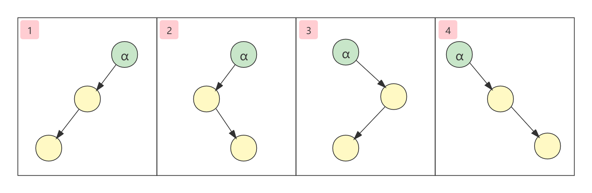
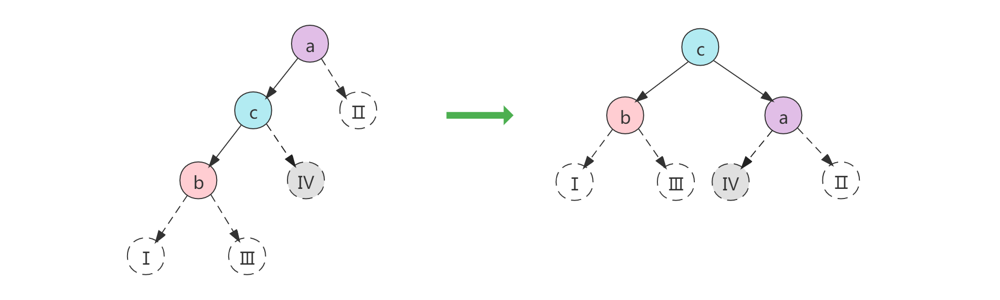
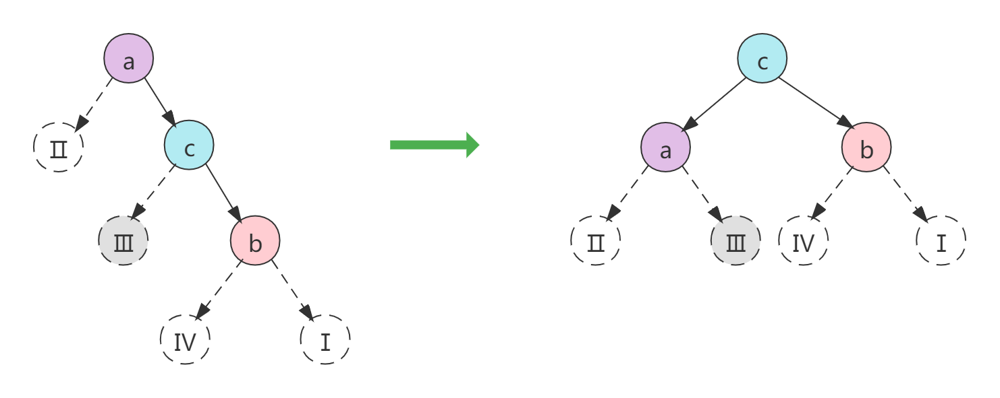
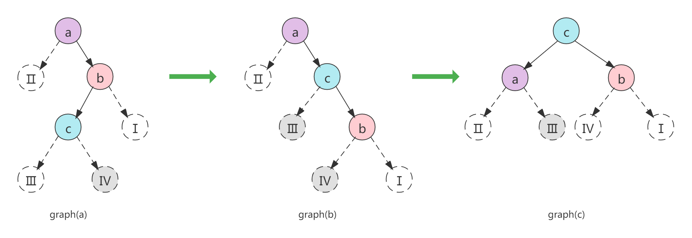
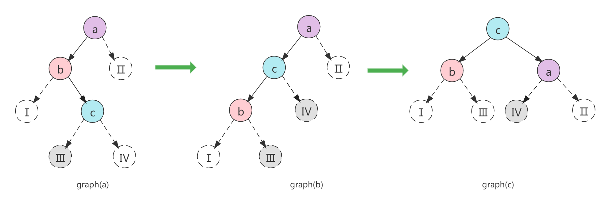

# AVL树

[TOC]

## 简介

AVL（Adelson Velsky和Landis）树是带有平衡条件（balance condition）的二叉查找数。其得名于它的发明者G. M. Adelson-Velsky和E. M. Landis，他们在1962年的论文《An algorithm for the organization of information》中发表了它。在计算机科学中，AVL树是最先发明的自平衡二叉查找树。在AVL树中任何节点的两棵子树的高度最大差别为1，所以它也被称为高度平衡树。增加和删除可能需要通过一次或多次树旋转来重新平衡这棵树。

对于一般的二叉查找数而言，每个结点的C(i)为该结点的层次数。最坏的情况下，当先后插入的关键字有序时，构成的二叉排序树蜕变为单支数，树的深度为其平均查找长度(n+1)/2（和顺序查找相同），最好的情况是二叉排序树的形态和折半查找的判定树相同，其平均查找长度和`log2ⁿ`成正比。也就是说，最好的情况下算法的时间复杂度为O(1)，最坏的情况下算法的时间复杂度为O(n)。

对一般的二叉查找数施加平衡条件，可以使其查找的时间复杂度为O(log n)。典型的代表有[AVL树](https://baike.baidu.com/item/AVL树)，[红黑树](https://baike.baidu.com/item/红黑树)，[Treap](https://baike.baidu.com/item/Treap)(Tree+Heap)

## AVL树特性

- 一颗AVL树本身是一颗二叉查找树。
- AVL树其每个节点的左子树和右子树的高度最多差1（空树的高度定义为-1）。
- 每一个节点（在其节点结构中）保留高度信息。

对AVL树进行插入和删除操作时，将可能破坏（某棵子树的高度差大于1或小于-1）树的平衡。因此将需要进一步考虑恢复树的平衡性质，而这可以通过简单的修正来做到，该操作称为**旋转**。

把必须重新平衡的节点叫作α，由于任意节点最多有两个儿子，因此出现高度不平衡就需要α点的两棵子树的高度差为2，这种不平衡可能出现在下面四种情况中：

1. 对α的左儿子的左子树进行一次插入（LL）；
2. 对α的左儿子的右子树进行一次插入（LR）；
3. 对α的右儿子的左子树进行一次插入（RL）；
4. 对α的右儿子的右子树进行一次插入（RR）；

如下图所示：



第1和第4种情况发生在“外边”（LL和RR），该情形通过对树进行一次**单旋转**而完成调整。

第2个第3种情况是插入发生在“内部”（LR和RL），该情形通过对树进行一次**双旋转**（两次单旋转）来完成调整。

## AVL代码结构

```java
public class AvlTree<K extends Comparable<?>, V> {

    private Node<K, V> root;

    private int size;

    public int getSize() {
        return size;
    }

    public boolean isEmpty() {
        return size == 0;
    }

    /**
     * Return the height of node t, or -1, if null.
     */
    private int height(Node<K, V> node) {
        return node == null ? -1 : node.height;
    }

    static class Node<K, V> {

        private final K key;

        private V val;

        private int height;

        private Node<K, V> left;

        private Node<K, V> right;

        public Node(K key, V val) {
            this.key = key;
            this.val = val;
        }
    }
}
```

## 单旋转-右旋（LL）

如下图所示，节点的a的左子树高度为2，右子树高度为0（没有右子树），其左右子树高度差的绝对值大于1，平衡性质已被破坏，因此需要以节点a为根进行一次右旋（向右旋转）。



抽象的形容就是：**把树形象的看成是柔软灵活的，抓住子节点c，闭上你的双眼，使劲的摇晃它，在重力的作用下，c就变成了新的根**。

**注意节点Ⅳ的变化。**在“重力”的作用下，节点b保持不变。而节点a向下滑落，成为c的右子树，而原来的右子树Ⅳ变成了a左子树了。

> Note：LL代表的是向α节点的左子树的左孩子中插入新的节点导致失去平衡，这种情况下需要右旋。而不是说LL的意思就是右旋。以此类推，RR、RL和LR也是一样的。

**高度**

旋转完整之后注意a,b,c三个节点其高度的变化。

- 首先是节点b，其左右子树在变化前后都是Ⅰ和Ⅲ，因此其高度没有变化。
- 其次是节点a，节点a的右子树在变化前后都是Ⅱ，而左子树却变成了节点c的右子树Ⅳ。因此节点a的高度需要重新计算，节点Ⅱ和节点Ⅳ之间选取最大的高度并+1即为节点a的高度。
- 最后是节点c，节点c的左子树在变化前后都是b，而右子树却变成了节点a，因此节点c的高度需要重新计算。节点a的高度已经在第二步修正，因此，直接在节点b和节点a之间选取最大的高度并+1。

因此，在完成右旋转之后，就可以直接更新节点a和c的高度。

**右旋代码实现**

```java
/**
 * 用左子结点旋转二叉树节点。
 * 对于这种情况，只需要进行一次向右单旋转。
 * 更新高度并返回新的根节点。
 *
 * @param a 当前用于旋转的根节点。
 * @return 旋转之后的新根节点。
 */
private Node<K, V> rotateWithLeftChild(Node<K, V> a) {
    Node<K, V> c = a.left;
    a.left = c.right;
    c.right = a;
    a.height = Math.max(height(a.left), height(a.right)) + 1;
    c.height = Math.max(height(c.left), a.height) + 1;
    return c;
}
```

## 单旋转-左旋（RR）

如下图所示，节点的a的右子树高度为2，左子树高度为0（没有左子树），其左右子树高度差的绝对值大于1，平衡性质已被破坏，因此需要以节点a为根进行一次左旋（向左旋转）。



**注意节点Ⅲ的变化。**在“重力”的作用下，节点b保持不变。而节点a向下滑落，成为c的左子树，而原来的左子树Ⅲ变成了a右子树了。

**高度**

旋转完整之后注意a,b,c三个节点其高度的变化。

- 首先是节点b，其左右子树在变化前后都是Ⅰ和Ⅳ，因此其高度没有变化。
- 其次是节点a，节点a的左子树在变化前后都是Ⅱ，而右子树却变成了节点c的左子树Ⅲ。因此节点a的高度需要重新计算，节点Ⅱ和节点Ⅲ之间选取最大的高度并+1即为节点a的高度。
- 最后是节点c，节点c的右子树在变化前后都是b，而左子树却变成了节点a，因此节点c的高度需要重新计算。节点a的高度已经在第二步修正，因此，直接在节点b和节点a之间选取最大的高度并+1。

因此，在完成左旋转之后，就可以直接更新节点a和c的高度。

**左旋代码实现**

```java
/**
 * 用右子结点旋转二叉树节点。
 * 对于这种情况，只需要进行一次向左单旋转。
 * 更新高度并返回新的根节点。
 *
 * @param a 当前用于旋转的根节点。
 * @return 旋转之后的新根节点。
 */
private Node<K, V> rotateWithRightChild(Node<K, V> a) {
    Node<K, V> c = a.right;
    a.right = c.left;
    c.left = a;
    a.height = Math.max(height(a.right), height(a.left)) + 1;
    c.height = Math.max(height(c.right), a.height) + 1;
    return c;
}
```

## 双旋转-右旋-左旋（RL）

如下图所示，节点的a的右子树高度为2，左子树高度为0（没有左子树），其左右子树高度差的绝对值大于1，平衡性质已被破坏。按照单旋转的原理，应该以节点a为根进行一次左旋。但是在这种情况下，节点c无处陈放，因为a和c都小于b，只能为b的左儿子。因此，在该情况下，需要进行一次双旋转来使树重新保持平衡：首先以节点b为根节点进行右旋，旋转之后如图graph(b)所示。然后再以节点a为根进行一次左旋，旋转之后如图graph(c)所示。



双旋转-右子树代码实现

```java
/**
 * 双旋转二叉树节点：先左旋，再右旋。
 * 更新高度并返回新的根节点。
 *
 * @param a 当前用于双旋转的根节点。
 * @return 旋转之后的新根节点。
 */
private Node<K, V> doubleWithRightChild(Node<K, V> a) {
    //先取得节点b
    Node<K, V> b = a.right;
    //以b为根向右旋转
    Node<K, V> c = rotateWithLeftChild(b);
    //旋转之后将a和新的根节点c连接起来
    a.right = c;
    //最后以a为根向左旋转
    rotateWithRightChild(a);
    return c;
}
```

上面的代码为了方便理解，拆分成了多步。简化：

```java
private Node<K, V> doubleWithRightChild(Node<K, V> a) {
    a.right = rotateWithLeftChild(a.right);
    return rotateWithRightChild(a);
}
```

## 双旋转-左旋-右旋（LR）

如下图所示，节点的a的左子树高度为2，右子树高度为0（没有右子树），其左右子树高度差的绝对值大于1，平衡性质已被破坏。在该情况下，需要进行一次双旋转来使树重新保持平衡：首先以节点b为根节点进行左旋，旋转之后如图graph(b)所示。然后再以节点a为根进行一次右旋，旋转之后如图graph(c)所示。



双旋转-左子树代码实现

```java
/**
 * 双旋转二叉树节点：先左旋，再右旋。
 * 更新高度并返回新的根节点。
 *
 * @param a 当前用于双旋转的根节点。
 * @return 旋转之后的新根节点。
 */
private Node<K, V> doubleWithLeftChild(Node<K, V> a) {
    //先取得节点b
    Node<K, V> b = a.left;
    //以b为根向左旋转
    Node<K, V> c = rotateWithRightChild(b);
    //旋转之后将a和新的根节点c连接起来
    a.left = c;
    //最后以a为根向右旋转
    rotateWithLeftChild(a);
    return c;
}
```

上面的代码为了方便理解，拆分成了多步。简化：

```java
private Node<K, V> doubleWithLeftChild1(Node<K, V> a) {
    a.left = rotateWithRightChild(a.left);
    return rotateWithLeftChild(a);
}
```

## 平衡修正

单旋转和双旋转是保持平衡的操作。但什么时候要触发旋转操作呢？

给定一个node节点α，其是否平衡是由其左子树和右子树的高度差决定。跟node节点本身的高度信息没有直接关系（即使node节点的高度信息是错误的，也不影响对其平衡性的判断）。因此，先对node节点进行是否平衡性的判断，如果已经失去平衡，则进行相应的旋转修正。最后修正node节点的正确高度。

代码实现如下：

```java
private Node<K, V> balance(Node<K, V> node) {
    if (node == null)
        return node;
    int balanceFactor = height(node.left) - height(node.right);
    if (balanceFactor > 1) {
        if (height(node.left.left) >= height(node.left.right))
            node = rotateWithLeftChild(node);
        else
            node = doubleWithLeftChild(node);
    } else if (balanceFactor < -1) {
        if (height(node.right.right) >= height(node.right.left))
            node = rotateWithRightChild(node);
        else
            node = doubleWithRightChild(node);
    }
    //修正node节点高度
    node.height = Math.max(height(node.left), height(node.right)) + 1;
    return node;
}
```

失去平衡之后，就需要进行相应的旋转操作，但是也有单旋转和双旋转之分，如果是由于α的左子树β失去平衡，并且β的左子树高度大于等于右子树，则是“外部失衡”，因此，直接进行右旋即可。如果是β的左子树高度小于右子树，则是“内部失衡”，则需要进行左子树双旋转。以此类推，如果是由于α的右子树γ失去平衡，也是一样的原理。

注意：上面说的“*β的左子树高度大于等于右子树*”。在插入元素的情况下，β的左子树高度绝对不会等于右子树，只会存在大于或小于。至于“等于”的情况，是在删除元素的时候会产生该情形。

## 算法实现

上图介绍中的示例代码为了便于理解，其命名都是跟图例的节点名称对应。下面是完整的实现。

### java

```java
public class AvlTree<K extends Comparable<K>, V> {

    private Node<K, V> root;

    private int size;

    public int getSize() {
        return size;
    }

    public boolean isEmpty() {
        return size == 0;
    }

    public boolean put(K key, V val) {
        root = putVal(root, key, val);
        return true;
    }

    private Node<K, V> putVal(Node<K, V> node, K key, V val) {
        if (node == null) {
            size++;
            return new Node<>(key, val);
        }
        int compareResult = node.key.compareTo(key);
        if (compareResult > 0)
            node.left = putVal(node.left, key, val);
        else if (compareResult < 0)
            node.right = putVal(node.right, key, val);
        else
            return node;
        return balance(node);
    }

    public boolean remove(K key) {
        root = remove(root, key);
        return true;
    }

    private Node<K, V> remove(Node<K, V> node, K key) {
        if (node == null)
            return node;
        int compareResult = node.key.compareTo(key);
        if (compareResult > 0)
            node.left = remove(node.left, key);
        else if (compareResult < 0)
            node.right = remove(node.right, key);
        else {
            if (node.left != null && node.right != null) {
                Node<K, V> minNode = findMin(node.right);
                node.key = minNode.key;
                node.val = minNode.val;
                node.right = remove(node.right, minNode.key);
            } else {
                node = node.left == null ? node.right : node.left;
                size--;
            }
        }
        return balance(node);
    }

    private Node<K, V> findMin(Node<K, V> node) {
        return node.left != null ? findMin(node.left) : node;
    }

    /**
     * node节点是否平衡是由其左子树和右子树的高度差决定，跟node节点当前的高度是否正确没有关系。
     * 因此，先对node节点进行平衡性旋转操作，最后才修正node节点的高度。
     */
    private Node<K, V> balance(Node<K, V> node) {
        if (node == null)
            return node;
        int balanceFactor = height(node.left) - height(node.right);
        if (balanceFactor > 1) {
            if (height(node.left.left) >= height(node.left.right))
                node = rotateWithLeftChild(node);
            else
                node = doubleWithLeftChild(node);
        } else if (balanceFactor < -1) {
            if (height(node.right.right) >= height(node.right.left))
                node = rotateWithRightChild(node);
            else
                node = doubleWithRightChild(node);
        }
        node.height = Math.max(height(node.left), height(node.right)) + 1;
        return node;
    }

    /**
     * 双旋转二叉树节点：先左旋，再右旋。
     * 更新高度并返回新的根节点。
     *
     * @param node 当前用于双旋转的根节点。
     * @return 旋转之后的新根节点。
     */
    private Node<K, V> doubleWithLeftChild(Node<K, V> node) {
        node.left = rotateWithRightChild(node.left);
        return rotateWithLeftChild(node);
    }

    /**
     * 双旋转二叉树节点：先左旋，再右旋。
     * 更新高度并返回新的根节点。
     *
     * @param node 当前用于双旋转的根节点。
     * @return 旋转之后的新根节点。
     */
    private Node<K, V> doubleWithRightChild(Node<K, V> node) {
        node.right = rotateWithLeftChild(node.right);
        return rotateWithRightChild(node);
    }

    /**
     * 用右子结点旋转二叉树节点。
     * 对于这种情况，只需要进行一次向左单旋转。
     * 更新高度并返回新的根节点。
     *
     * @param node 当前用于旋转的根节点。
     * @return 旋转之后的新根节点。
     */
    private Node<K, V> rotateWithRightChild(Node<K, V> node) {
        Node<K, V> r = node.right;
        node.right = r.left;
        r.left = node;
        node.height = Math.max(height(node.right), height(node.left)) + 1;
        r.height = Math.max(height(r.right), node.height) + 1;
        return r;
    }

    /**
     * 用左子结点旋转二叉树节点。
     * 对于这种情况，只需要进行一次向右单旋转。
     * 更新高度并返回新的根节点。
     *
     * @param node 当前用于旋转的根节点。
     * @return 旋转之后的新根节点。
     */
    private Node<K, V> rotateWithLeftChild(Node<K, V> node) {
        Node<K, V> l = node.left;
        node.left = l.right;
        l.right = node;
        node.height = Math.max(height(node.left), height(node.right)) + 1;
        l.height = Math.max(height(l.left), node.height) + 1;
        return l;
    }

    /**
     * Return the height of node t, or -1, if null.
     */
    private int height(Node<K, V> node) {
        return node == null ? -1 : node.height;
    }

    public static class Node<K, V> {

        private final K key;

        private V val;

        private int height;

        private Node<K, V> left;

        private Node<K, V> right;

        public Node(K key, V val) {
            this.key = key;
            this.val = val;
        }
    }
}
```