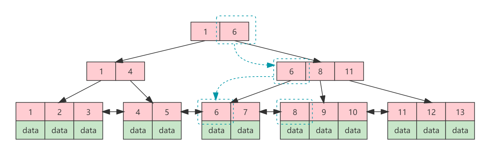

# B+tree

[TOC]

IMPORTANT : 本文章假定阅读者已经完全理解B树，若未完全理解B树，请参考[B-tree](B-tree.md)。

## Introduction

B+tree是B tree的一种变种。

## Why nedd B+tree

相比B tree，B+tree更适合用于数据库和文件系统。因为B+tree的非叶子结点并不存储数据，数据只存储在叶子结点上，或者叶子存储指向数据的指针，而非叶子结点仅仅作为索引，因此在磁盘上一页可以存储更多的索引信息。另外由于树的特性，叶子结点之间有序。叶子结点通过指针构成双向链表，可以方便的进行范围查找。 

## Feature

一棵阶M的B+树具有如下特性：

1. **每个节点的结构为`([n],(P₁,K₁),(P₂,K₂),...,(Kₙ,Pₙ))`。**其中P为指向子节点的指针，K为元素索引。
2. **有K个孩子的结点必有K个关键字（B树必有K-1个关键字）。**
3. 树的根要么是一片树叶，要么其儿子数在2~M之间，**其至少有2个关键字（B树至少一个）**。
4. 除根节点外，所有非树叶节点的儿子数都在⌈M/2⌉到M之间，**因此关键字数也在⌈M/2⌉到M之间（B树关键字数在⌈M/2⌉-1到M-1之间）**。
5. **所有的叶子结点中包含了关键字的信息及指向相应数据的指针，且叶子结点本身依照关键字的大小自小到大顺序链接（B树没有链接）。**
6. **所有非叶子结点可看成是索引部分，且节点中仅含有其子树中的最大或最小关键字。**

上述黑色加粗斜体的部分就是B+tree与B tree的不同点。

下图是一个3阶的B+树：

## 查找

对于B+树而言，非叶子结点仅仅作为索引，索引中的每一个元素为子结点的首个元素。由于索引不存储数据，因此，即使在非叶子结点查找成功，也需要继续向下查找，一直到叶子节点。

流程如下：

首先获取根节点，在根节点所包含的索引关键字（`K₁,K₂,K₃...,Kᵢ`）中查找给定的关键字（可用顺序查找或二分查找法），如果找到等于给定值的关键字，则表明数据在该关键字的子节点，一致延伸继续向下查找，直到叶子节点为止。如果没有找到等于给定值的关键字，则可以确定要查找的关键字可能在`Kᵢ`与`Kᵢ₊₁`之间，延着指针`Pᵢ`向下查找。重复此过程，一直找到叶子节点，直到查找成功或查找失败为止。

## 插入

B+数的插入跟B树的插入方式是一样的，也需要考虑如下三种情况：

1. 终端节点关键字个数小于M（节点没满）
2. 终端节点关键字个数等于M（节点已满）
3. 双亲节点关键字个数等于M（节点已满）

不同的是，当B树插入节点已满时分裂节点，是需要将中间节点向上提升，而B+树则是在父节点建立索引。

示例：

1. 向3阶B+树插入数据14。

   .png)

2. 插入数据14之后，由于所在叶子结点大于3(M)，因此需要进行分裂，将其分裂成两个`⌈M/2⌉`大小的叶子结点，并在父节点建立索引13。

   .png)

3. 此时父节点的关键字数也大于3(M)，将其分裂成两个`⌈M/2⌉`大小的索引结点，在更上一层级建立索引11。至此，数据插入完成。

   .png)

## 删除

B+树的删除跟B树的删除方式是一样的，也需要考虑树的平衡性。不同的是，对于B+树而言，不需要考虑被删除的结点位于非终端节点上的情况。因此只需要考虑以下两种情况：

1. 被删除的关键字所处叶子节点关键字个数大于`⌈M/2⌉`。
2. 被删除的关键字所处叶子节点关键字个数等于`⌈M/2⌉`。

对于第一种情况，跟B树一样，直接删除即可（不存在失去平衡的问题）。而对于第二种情况，则也要考虑失去平衡性的问题，其解决方式也是向兄弟节点借，因此一样分三种情况：

1. 兄弟够借。
2. 兄弟不够借。
3. 双亲节点不够借。

**示例：兄弟够借**

1. 从3阶B+树中删除数据6。

   .png)

2. 删除数据6之后，其所在节点关键字数小于`⌈M/2⌉`，失去平衡。

   .png)

3. 其右节点的关键字数量等于M，可以借出一个关键字8。

   .png)

4. 向其右节点借来关键字8重新构成一个新的结点。最后重新构建索引。

   .png)

**示例：双亲节点不够借**

1. 从3阶B+树中删除关键字4。

   .png)

2. 删除关键字4之后，剩余关键字数小于`⌈M/2⌉`，失去平衡。

   .png)

3. 其左右兄弟节点都不够借，因此合并左节点。然后重新构建父节点索引，由于合并之后少了一个子节点，因此将父节点链接到合并前节点的索引移除。移除之后父节点的索引关键字数量小于`⌈M/2⌉`，失去平衡。

   .png)

4. 右兄弟节点够借，从右兄弟节点借一个索引关键字6，然后重新构建索引。

   .png)

