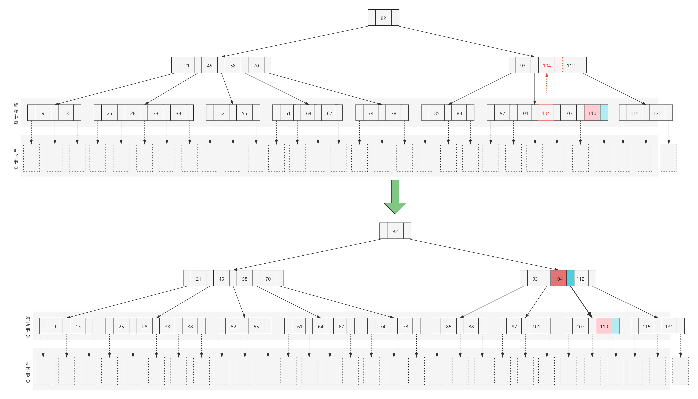
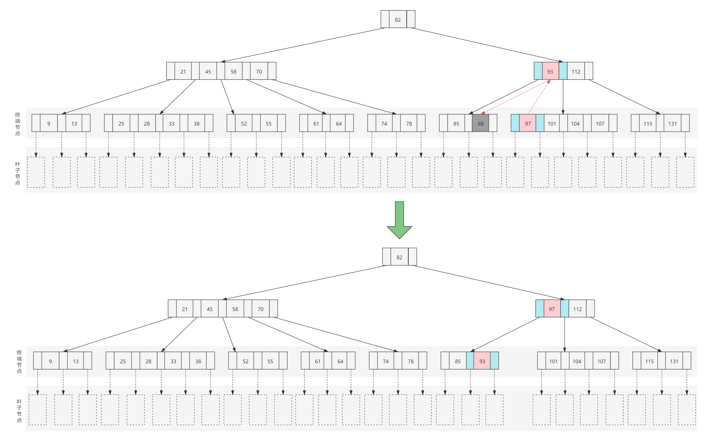

# B-tree

## 目录

[TOC]

## 1、Introduction

1970年，R.Bayer和E.mccreight发表论文[《Organization and Maintenance of Large Ordered Indices》](https://infolab.usc.edu/csci585/Spring2010/den_ar/indexing.pdf)提出了一种新的数据结构来维护大型索引，这种数据结构被称为B-Tree（B树或B-树、B_树），是一种适用于外查找的树，并且是一种**平衡的多路查找树**。

其论文摘要如下：
> ABSTRACT
>
> Organization and maintenance of an index for a dynamic random access file is considered. It is assumed that the index must be kept on some pseudo random access backup store like a disc or a drum. The index organization described allows retrieval, insertion, and deletion of keys in time proportional to $$(log_k)^I$$ where I is the size of the index and k is a device dependent natural number such that the performance of the scheme becomes near optimal. Storage utilization is at least 50% but generally much higher. The pages of the index are organized in a special data-structure, so-called B-trees. The scheme is analyzed, performance bounds are obtained, and a near optimal k is computed. Experiments have been performed with indices up to 100,000 keys. An index of size 15,000 (100,000) can be maintained with an average of 9 (at least 4) transactions per second on an IBM 360/44 with a 2311 disc.
>
> Key Words and Phrases: Data structures, random access files, dynamic index maintenance, key insertion, key deletion, key retrieval, paging, information retrieval.
>
> CR Categories: 3.70, 3.73, 3.74. 
>
> **译文**
>
> 考虑动态随机访问文件索引的组织和维护。假设索引必须保存在某个伪随机访问备份存储中，比如磁盘或磁鼓。所描述的索引组织允许检索、插入和删除键的时间与$$(log_k)^I$$成正比，其中I是索引的大小，k是一个与设备相关的自然数，因此该方案的性能接近最优。存储利用率至少为50%，但通常要高得多。索引的页面被组织成一种特殊的数据结构，即所谓的B树。对该方案进行了分析，得到了性能边界，并计算了近似最优k。已经进行了索引高达100,000密钥的实验。在带有2311磁盘的IBM 360/44上，平均每秒9个(至少4个)事务就可以维护大小为15,000(100,000)的索引。
>
> 关键词和短语：数据结构，随机访问文件，动态索引维护，键插入，键删除，键检索，分页，信息检索。
>
> CR类别：3.70、3.73、3.74。

论文中对B树有如下定义：

> B-Trees
>
> Def. 2.1: Let h >= 0 be an integer, k a natural number. A directed tree T is in the class T(k,h) of *B-trees* if T is either empty (h=0) or has the following properties:
>
> 1. Each path from the root to any leaf has the same length h, also called the *height* of T, i.e., h = number of nodes in path.
> 2. Each node except the root and the leaves has at least k + 1 sons. The root is a leaf or has at least two sons.
> 3. Each node has at most 2k + 1 sons. 

这个定义与教科书以及大多数文章的描述有差异，但仔细分析，它们实质上是一样的。

## 2、Why use B trees

对于大部分算法而言，都是默认运算的数据存储在主存当中，可是如果数据更多但主存却装不下，那么就意味着必须将数据结构放到磁盘上。此时，大O模型不在适用，导致游戏规则发生了变化。

问题在于，大O分析假定所有操作的耗时都是相等。然而，当涉及磁盘I/O时，这种假设就不合适了。例如，一台500-MIPS的机器可能每秒执行5亿条指令。这个速度听起来相当快，这是因为速度主要依赖于电的特性。但相对于i7,i9等CPU而言，这个速度又相当的慢。不管怎样，这个速度听起来还不错。另一方面，磁盘（机械硬盘）操作是机械运行，它的速度主要依赖于转动磁盘和移动磁头的时间，许多磁盘以7200 RPM旋转，即1分钟7200转。因此1转占用1/120秒，或8.3毫秒。即使是固态硬盘，速度也就能达到机械硬盘`3~5`倍的样子，与处理器的速度比起来，仍然是天差地别。平均可以认为磁盘转到一半的时候发现我们要寻找的信息。但这又被移动磁盘磁头的时间所抵消，因此我们得到的访问时间是8.3.毫秒（这是非常宽松的估计，`9~11`毫秒的访问时间更为普遍。因此，每秒大约可以进行120次磁盘访问。若不和处理器的速度比较，那么这听起来还是相当不错的。可是考虑处理器的速度，5亿条指令的花费相当于120次磁盘访问，换句话说，一次磁盘访问的价值大约是40万条指令。当然，这里的每一个数据都是粗略计算，不过相对速度还是相当清楚的：磁盘的访问代价太高了。不仅如此，处理器的速度还在以比磁盘速度快得多的速度增长（增长相当快的是磁盘容量的大小）。因此，为了节省一次磁盘访问，我们愿意进行大量的计算。几乎在所有的情况下，控制运行时间的都是磁盘访问的次数。于是，如果能够把磁盘访问的次数减少一半，那么运行时间也将减半。为了解决这个问题，就需要一种算法，虽然会进行大量的计算，但是却能减少磁盘的访问次数。而B树就是为此而生。

## 3、B树的特性

一棵阶为M的B树具有如下特性：

- 树叶不携带信息：

  1. 每个节点的结构为`([n],P₀,K₁,P₁,K₂,...,Kₙ,Pₙ)`。

  2. 树的根要么是一片树叶，要么其儿子数在2~M之间。

  3. 除根节点外，所有非树叶节点的儿子数都在⌈M/2⌉到M之间，关键字数都在⌈M/2⌉-1到M-1之间。

  4. 
所有叶子结点都在相同的深度上并且不带信息。

- 树叶携带信息：
  1. 每个节点的结构为`([n],P₀,K₁,P₁,K₂,...,Kₙ,Pₙ)`。
  2. 树的根要么是一片树叶，要么其儿子数在2~M之间。
  3. 除根节点外，所有非树叶节点的儿子数都在⌈M/2⌉到M之间，关键字数都在⌈M/2⌉-1到M-1之间。
  4. 
数据项存储在树叶上。

  5. 
所有树叶都在相同的深度上并且有⌈L/2⌉到L之间个数据项。

  6. 
非叶子节点存储至多M-1个关键字以指示搜索方向；关键字i代表子树i+1中的最小关键字。

特性详情说明：

1. "阶"可以理解为B树每一个节点的子树的最大数量，"阶为M"即可以理解为每一个节点的子树的最大数量为M。
2. n为关键字个数；`K(1≤i≤n)`为关键字，并且`Kᵢ≤Kᵢ₊₁(1≤i≤n-1)`；`P(0≤i≤n)`为指向子树的指针，并且`Pᵢ`所指向子树中的所有节点关键字都小于`Kᵢ₊₁`，`Pₙ`所指向子树中的所有节点关键字都大于`Kₙ`。
3. "树的根要么是一片树叶"是指整棵B树只有根一个节点，意味着它既是根，也是树叶；"要么其儿子数在`2~M`之间"是指如果树的根不是树叶，有儿子节点，那么其儿子数必然在`2~M`之间，即最少有2个儿子，最多有M个儿子。进而可以推断其最少有1个关键，最多有M-1个关键字（两棵子树指针夹着一个关键字）。
4. 除了根节点外，所有非叶子结点的儿子数都在⌈M/2⌉到M之间。进而可以推断出其关键字数都在⌈M/2⌉-1到M-1之间。之所以有这样的定义，是为了**保证B数的平衡性，而不至于退化成一个二叉树**。

上面对于一棵阶为M的B树的特性，有两种情况——携带信息和不携带信息。其中第1,2,3条特性都是一样的，唯一的差异就在于叶子结点是否携带信息。下面具体说明这一点差异。

NOTE：无论叶子结点是否携带信息，它们都是B树，其本质是一样的。只是一点实现上的差异。

**叶子结点不携带信息**

如上图所示，是一个5阶B树，其中蓝色方块为P（指针），红色方块为K（元素）。对应灰色部分为终端节点，浅灰色部分为叶子结点。可以看到，所有的叶子结点都在相同的深度，并且其不带任何信息（不存在），用虚线表示。

> 对于"叶子结点不携带信息"的B树的特性说明中，第三点说明不完全准确，更正确的应该是：
>
> - 除根节点外，所有**非终端节点**的儿子数都在⌈M/2⌉到M之间（终端节点没有儿子了）。
> - 除根节点外，所有**非树叶节点**的关键字数都在⌈M/2⌉-1到M-1之间。

**叶子结点携带信息**

如上图所示，是一个叶子结点携带信息的5阶B树。其中数据项都存储在树叶（黄色部分）上。所有的树叶都在相同的深度并且有⌈L/2⌉到L之间个数据项，这里L定义为5，因此有每片树叶有3~5项数据。另外关键字i代表树叶中的最小关键字——注意上图中紫色虚线连接起来的部分。

对于L的定义，是要根据实际使用场景中存储数据项的大小来决定L是多少，这里恰好L与M一致，但这不是必须的。

> 叶子结点携带信息这一点与B+树是类似，但它并不是B+树。
>
> 非树叶节点都只作为索引。这一点也与B+数一样。

## 4、B树的查找

在B树中查找给定关键字的方法是，首先获取根节点，在根节点所包含的关键字（`K₁,K₂,K₃...,Kᵢ`）中查找给定的关键字（可用顺序查找或二分查找法），若找到等于给定值的关键字，则查找成功；否则，一定可以确定要查找的关键字在`Kᵢ`与`Kᵢ₊₁`之间，`Kᵢ`与`Kᵢ₊₁`之间的指针`Pᵢ`为指向子树根节点的指针，此时取指针`Pᵢ`所指的节点重复此过程继续查找，直到查找成功，或者指针`Pᵢ`为空时查找失败。

## 5、B树的插入

在B树中插入给定关键字的方法是，沿树向下查找，一直到终端节点（揭示出它不在树中），然后将给定的关键字插入到该终端节点上。但是这里要考虑的树的平衡性，如果该终端节点已经有4个关键字了（5阶B树），那么直接插入将会破坏B树的定义。因此，这里需要对该终端节点进行分裂，以维护B树的平衡。

因此对于B树的插入有两种情况：

1. 终端节点关键字个数小于M-1（节点没满）
2. 终端节点关键字个数等于M-1（节点已满）

### 5.1、终端节点关键字个数小于M-1（节点没满）

**如果终端节点的关键字个数小于M-1，那就意味着该终端节点未满，即没有达到最大关键字数，因此直接将给定的关键字插入即可。**

如下图所示：插入元素56，可以直接插入。

### 5.2、终端节点关键字个数等于M-1（节点已满）

**如果终端节点的关键字个数等于M-1，那就意味着该终端节点已满，即已达到最大关键字数。此时如果直接插入新的关键字将会破坏B树的平衡，因此需要进行分裂。分裂的方式就是将该节点的中间关键字K（`⌈M/2⌉`）提升到当前节点的双亲节点上，然后将以K为中心左右两边的关键字分别作为K的左右子树。**

如下图所示：插入关键字110，但对应的终端节点已满（4个关键字），因此引起分裂，将中间关键字104提升到双亲节点，然后将以104为中心左右两边的关键字分别作为104的左右子树。

### 5.3、双亲节点关键字个数等于M-1（节点已满）

**如果终端节点的关键字个数已满，而此时要插入新的关键字，那么就需要进行分裂，并将其中间关键字提升到双亲节点。问题在于，如果其双亲节点的关键字个数也已满，那么双亲节点也需要进行分裂并提升，这一过程会一直持续到某一双亲节点未满或直到根节点并引起根节点的分裂（如果根节点也满），进而使B树增加一层。**

如下图所示：插入关键字27，其终端节点已满，因此引起分裂，将中间关键字28提升到双亲节点。但其双亲节点也已满，因此，进一步引起双亲节点分裂，将中间关键45提升到双亲节点（根节点）。最终根节点由2棵子树变成了3棵子树。

## 6、B树的删除

在B树中删除给定关键字的方法是：沿树向下查找，直接找到给定的关键字或者找到终端节点为空。如果找到给定的关键字，则将该关键字删除。在B树中删除一个关键肯定不是简单的删除就完事了，跟插入操作一样，也需要考虑B树的平衡性。

对于B数的删除，需要考虑以下4中情况：

1. 被删除的关键字位于终端节点。
2. 被删除的关键字位于非终端节点。
3. 被删除的关键字所处节点关键字个数大于⌈M/2⌉-1。
4. 被删除的关键字所处节点关键字个数等于⌈M/2⌉-1。

它们之间两两组合，又可以分为：

1. 被删除的关键字位于终端节点，并且关键字个数大于⌈M/2⌉-1。
2. 被删除的关键字位于终端节点，并且关键字个数等于⌈M/2⌉-1。
3. 被删除的关键字位于非终端节点，并且关键字个数大于⌈M/2⌉-1。
4. 被删除的关键字位于非终端节点，并且关键字个数等于⌈M/2⌉-1。

### 6.1、被删除的关键字位于终端节点

#### 6.1.1、终端节点关键字个数大于⌈M/2⌉-1

**被删除的关键字位于终端节点，并且该终端节点的关键字个数大于⌈M/2⌉-1，那么直接删除此关键字即可，此时树仍然是平衡的。**

如下图所示：删除关键字67，其所处的终端节点关键字个数为3，大于⌈M/2⌉-1（M等于5），因此可以直接删除，而不会破坏树的平衡。

#### 6.1.2、终端节点关键字个数等于⌈M/2⌉-1

被删除的关键字位于终端节点，并且该终端节点的关键字个数等于⌈M/2⌉-1，那么就意味着如果直接将该关键字删除，就会破坏树的平衡，因此就需要一种策略来保证删除该关键字之后树仍然是平衡。至于具体采用什么样的策略则需要根据该终端节点的的兄弟节点和双亲节点来决定。分三种情形：

1. 兄弟够借。
2. 兄弟不够借。
3. 双亲节点不够借。

##### 6.1.2.1、兄弟够借

**被删除关键字所处的终端节点关键字个数等于⌈M/2⌉-1时，删除该关键字，然后从其左/右兄弟节点中借一个关键字过来，使树仍然保持平衡。**

如下图所示：删除关键字88，但关键字88所处的终端节点只有两个关键字，对于5阶B树而言，其节点的关键字个数最少为⌈M/2⌉-1个，即2个关键字。因此如果直接删除关键字88，即意味着树将会失去平衡。解决的方案就是从其兄弟节点借一个过来。关键字88的右兄弟节点有4个关键字，因此借一个过来，而树仍然是平衡的。具体操作方式：将关键字88所在终端节点的双亲节点中的关键字93下移填充被删除的88的位置，同时将其兄弟节点最左边的关键字97上移填充到双亲节点原关键字93的位置，最终完成了关键字88的删除。

##### 6.1.2.2、兄弟不够借

从兄弟节点中借一个关键字来保持平衡的前提是兄弟够借，但是如果左/右兄弟节点都只有⌈M/2⌉-1个关键字不够借呢。此时在采用从兄弟节点中借一个关键字来保持平衡的方式就不可行了。此情形的解决方案是：**被删除关键字所处的终端节点关键字个数等于⌈M/2⌉-1时，并且其兄弟节点不够借，则删除该关键字，然后将其所处终端节与终端节点左或右兄弟节点进行合并，使树仍然保持平衡**。

如下图所示：删除关键字61，可以看到关键字61所处的终端节点只有⌈M/2⌉-1个关键字，而其左右的兄弟节点也是只有⌈M/2⌉-1个关键字，因此不能采用从兄弟节点借关键字的方式来处理，而采用节点合并的方式进行处理：删除关键字61，并且将关键字61所处的终端节点与其左兄弟节点进行合并，将它们位于双亲节点两个子树指针之前的关键字58下移并合并称为一个新的节点，使双亲节点的关键字数量减少一个。

##### 6.1.2.3、父节点也不够借

需要注意的时候，如果在进行节点合并时，如果其根节点的关键字个数也只有⌈M/2⌉-1个，那么该操作将会继续向上延伸，直到有一个根节点满足平衡或者到根节点为止，如果到根节点，最终会使树减少一层。

### 6.2、被删除的关键字位于非终端节点

若要删除位于非终端节点的关键字，其操作策略的关键点在于将非终端节点的删除操作转换为终端节点的删除操作。

**如果被删除关键`Kᵢ`位于非终端节点，则先查找到子树`Pᵢ₋₁`中`Kᵢ`的中序前继节点`K'`或子树`Pᵢ`中`Kᵢ`的中序后继节点`K'`，然后将`K'`与`Kᵢ`交换，最后在执行终端节点删除策略。**

如下图所示：是一个简单案例，删除关键字58，首先将其与其中序后继节点61交换，然后在删除58，即完成非终端节点58的删除。

上述示例的删除操作相对比较简单， 因为58和61交换之后可以直接删除，并不会破坏树的平衡。下面是一个会破坏树平衡的案例。

## 7、参考资料

- [百度百科 - B树](https://baike.baidu.com/item/B%E6%A0%91/5411672?fr=aladdin)
- [百度百科-B-树](https://baike.baidu.com/item/B-%E6%A0%91/1975968?fr=aladdin)
- [一个可以在线调试B+树的工具](https://www.cs.usfca.edu/~galles/visualization/BPlusTree.html)
- [看图轻松理解数据结构与算法系列(B树的删除)](https://mp.weixin.qq.com/s?__biz=MjM5MzA1Mzc3Nw==&mid=2247484674&idx=1&sn=8f908ee565531ff7a5c1a481466f3e86&chksm=a69da83c91ea212a44146e21ce147d0815651a4ccffd4ac3834b0420f4cd64e35b74328ed313&token=648694665&lang=zh_CN&utm_medium=hao.caibaojian.com&utm_source=hao.caibaojian.com)
