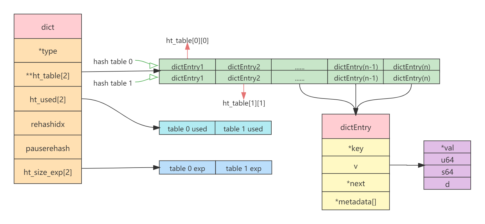
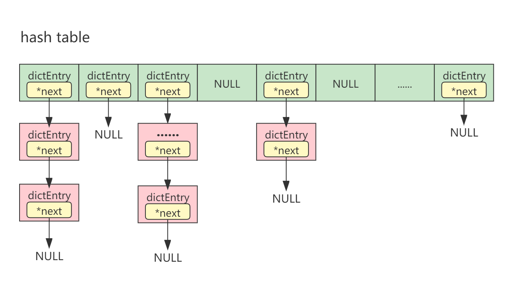
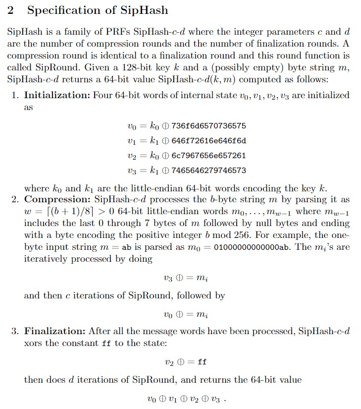

# dict

[TOC]

<div style="color:red">IMPORTANT : 当前分析基于Redis-2021年11月11日在GitHub上的最新代码进行分析。与官方最新稳定版Redis-6.2.6存在一定的差异，但其本质是一样的。</div>
## 1、简介

Dict（字典）是Redis数据结构中的一种。本质上Dict就是哈希表。哈希表经常作为一种数据结构内置在很多高级编程语言中。例如Java的`HashMap`。但Redis所使用的C语言并没有内置这种数据结构，因此Redis构建了自己的哈希表实现，称为Dict。

Dict在Redis中应用相当广泛，比如Redis的数据库就是使用Dict来作为底层实现。对数据库的增、删、改、查都是构建在对Dict的基础之上的。

## 2、总体布局

Dict的总体布局如下图所示：



**Dict**

- `*type`：对字典所存储不同类型数据进行处理的结构体dictType的指针。例如当key为`robj`或`SDS`时，它们的哈希计算方式就有差异，以及key的比较方式不同等。`*type`指针所指向的dictType定义了对这些不同类型key/value的特殊操作。
- `**ht_table[2]`：哈希表，是指向一个二维数组的指针。第一维数组是主要的哈希表，第二维数组是用于在扩展和rehash时，装载新的哈希表。当rehash完成时，会将第二维赋给第一维的指针，而原来指向第二维指针会指向`NULL`。
- `ht_used[2]` : 一个包含2个元素的数组，类型为`long`。它分别表示第一维和第二维数组中元素的数量。
- `rehashidx` ：如果`rehashidx`等于-1，则表示rehash未进行。如果`rehashidx`大于等于`0`，则表示正在进行rehash。
- `pauserehash` ：`pauserehash`初始化为0，如果>0，表示rehash暂停（<0表示编码错误）。迭代字典的时候肯定不能进rehash，因此rehash需要暂停。但迭代完成之后，`pauserehash`又会被标记为`0`。
- `ht_size_exp[2]` ：哈希表容量指数。一个包含2个元素的数组。它们分别表示第一维和第二维数组容量大小的指数。dict并没有直接存储两个哈希表数组的大小，而是使用指数进行实时计算。数组的大小固定为2的N次幂，而这里的指数就是N。例如`ht_size_exp=[3,4]`，那么则表示第一个哈希表数组的大小为`2³=8`，第二个哈希表数组的大小为`2⁴=16`。

**dictEntry**

哈希表中每一个元素都是一个dictEntry。

- `*key`：指向键的指针。
- `v`：值。不同的值类型用不同的对象承载。
  - `*val`：如果值是一个对象，例如SDS，则用`*val`指针承载。
  - `u64`：如果值是一个无符号64位整数。
  - `s64`：如果值是一个有符号64位整数。
  - `d`：如果值是一个浮点数。
- `*next`：哈希表采用拉链法，`*next`是指向下一个元素（`dictEntry`）的指针。
- `*metadata[]`：柔性数组。允许`dictEntry`携带额外的调用方所定义的元数据，这些元数据由调用方自定义使用。至于是否需要携带，则由dict的`dictType`的`dictEntryMetadataBytes()`函数所决定。如果需要携带，在分配`dictEntry`时会同时分配相应的元数据空间，并且都会被初始化为`0`。而dict仅仅在需要携带元数据时，完成元数据空间的分配和初始化工作。

下面是完整的Dict的哈希表结构：




## 3、Hash查找


## 4、源码分析

字典相关源码位于：[dict.h](https://github.com/redis/redis/blob/unstable/src/dict.h)，[dict.c](https://github.com/redis/redis/blob/unstable/src/dict.c)，[server.h](https://github.com/redis/redis/blob/unstable/src/server.h)，[server.c](https://github.com/redis/redis/blob/unstable/src/server.c)。

### 4.1、字典结构

**dict**

```c
struct dict {
    dictType *type;
    dictEntry **ht_table[2];
    unsigned long ht_used[2];
    long rehashidx; /* rehashing not in progress if rehashidx == -1 */
    /* Keep small vars at end for optimal (minimal) struct padding */
    int16_t pauserehash; /* If >0 rehashing is paused (<0 indicates coding error) */
    signed char ht_size_exp[2]; /* exponent of size. (size = 1<<exp) */
};
```

**dictEntry**

```c
typedef struct dictEntry {
    void *key;
    union {
        void *val;
        uint64_t u64;
        int64_t s64;
        double d;
    } v;
    struct dictEntry *next;     /* Next entry in the same hash bucket. */
    void *metadata[];           /* An arbitrary number of bytes (starting at a
                                 * pointer-aligned address) of size as returned
                                 * by dictType's dictEntryMetadataBytes(). */
} dictEntry;
```

### 4.2、字典类型

dict的`*type`指针所指向的类型为dictType：

```c
typedef struct dictType {
    uint64_t (*hashFunction)(const void *key);
    void *(*keyDup)(dict *d, const void *key);
    void *(*valDup)(dict *d, const void *obj);
    int (*keyCompare)(dict *d, const void *key1, const void *key2);
    void (*keyDestructor)(dict *d, void *key);
    void (*valDestructor)(dict *d, void *obj);
    int (*expandAllowed)(size_t moreMem, double usedRatio);
    /* Allow a dictEntry to carry extra caller-defined metadata.  The
     * extra memory is initialized to 0 when a dictEntry is allocated. */
    size_t (*dictEntryMetadataBytes)(dict *d);
} dictType;
```

dictType提供了对不同类型数据处理的成员函数。例如当key为`robj`和`sds`时，它们的哈希计算方式就有所不同。那么当进行查找时，key的比较方式也会有所不同。有些数据类型可能会需要额外条件判断是否需要扩展，而另外一些却不需要。

dictType结构体定义8种不同的成员函数，它们分别提了不同外置行为的实现：

- `*hashFunction` : 对`key`进行哈希计算的哈希函数。
- `*keyDup` : `key`的拷贝函数，用于在需要时对`key`进行深拷贝，而不是仅仅传递对象指针。
- `*valDup` : `value`的拷贝函数，用于在需要时对`value`进行深拷贝，而不是仅仅传递对象指针。
- `*keyCompare` : 两个`key`的比较操作，在查找是会用到。
- `*keyDestructor` : 对`key`的构析函数。
- `*valDestructor` : 对`value`的构析函数。
- `*expandAllowed` : 控制字典是否允许扩展。
- `*dictEntryMetadataBytes` : 是否允许dictEntry携带额外的调用方定义的元数据。如果允许，该函数会返回元数据空间的大小。如果返回`0`，则表示不允许。在分配dictEntry，元数据空间会被初始化为`0`。

一部分dictType的创建位于[server.h](https://github.com/redis/redis/blob/unstable/src/server.h)，[server.c](https://github.com/redis/redis/blob/unstable/src/server.c)。

[server.h](https://github.com/redis/redis/blob/unstable/src/server.h)定义了部分dictType的外部变量：

```c
extern dictType objectKeyPointerValueDictType;
extern dictType objectKeyHeapPointerValueDictType;
extern dictType setDictType;
extern dictType zsetDictType;
extern dictType dbDictType;
extern dictType shaScriptObjectDictType;
extern dictType hashDictType;
extern dictType replScriptCacheDictType;
extern dictType dbExpiresDictType;
extern dictType modulesDictType;
extern dictType sdsReplyDictType;
```

[server.c](https://github.com/redis/redis/blob/unstable/src/server.c)定义了部分dictType的实现（受篇幅所限，只列举了部分）：

```c
/* Generic hash table type where keys are Redis Objects, Values
 * dummy pointers. */
dictType objectKeyPointerValueDictType = {
    dictEncObjHash,            /* hash function */
    NULL,                      /* key dup */
    NULL,                      /* val dup */
    dictEncObjKeyCompare,      /* key compare */
    dictObjectDestructor,      /* key destructor */
    NULL,                      /* val destructor */
    NULL                       /* allow to expand */
};

/* Like objectKeyPointerValueDictType(), but values can be destroyed, if
 * not NULL, calling zfree(). */
dictType objectKeyHeapPointerValueDictType = {
    dictEncObjHash,            /* hash function */
    NULL,                      /* key dup */
    NULL,                      /* val dup */
    dictEncObjKeyCompare,      /* key compare */
    dictObjectDestructor,      /* key destructor */
    dictVanillaFree,           /* val destructor */
    NULL                       /* allow to expand */
};

/* ==================================================================== */
/* =========================其他dictType省略============================ */
/* ==================================================================== */
```

### 4.3、字典指数

字典指数存储在结构体dict的`ht_size_exp`（结尾三个字符exp即exponent的缩写）属性中。默认情况下指数为`2`，即初始哈希表的数组大小为`4`。

相关的代码位于[dict.h](https://github.com/redis/redis/commits/unstable/src/dict.h)，如下所示：

```c
/* This is the initial size of every hash table */
#define DICT_HT_INITIAL_EXP      2
#define DICT_HT_INITIAL_SIZE     (1<<(DICT_HT_INITIAL_EXP))
```

私有函数`_dictNextExp(long)`表明了哈希表的数组大小为2的N次幂，代码如下所示：

```c
/* TODO: clz optimization */
/* Our hash table capability is a power of two */
static signed char _dictNextExp(unsigned long size)
{
    unsigned char e = DICT_HT_INITIAL_EXP;
    if (size >= LONG_MAX) return (8*sizeof(long)-1);
    while(1) {
        if (((unsigned long)1<<e) >= size)
            return e;
        e++;
    }
}
```

参数`size`为哈希表的数组大小，但实际上哈希表的数组大小并不会以size进行分配内存，而是要经过指数计算。

逻辑如下：

如果`size`大于等于`LONG_MAX`，则直接返回`63`作为容量指数。反之，则会一直从2的2次幂，2的3次幂依次递增，直到大于等于`size`为止，此时`e`就是哈希表的容量指数。也即意味着此处计算的是距离`size`最近2的N次幂指数。

### 4.4、Key比较

不同类型的Key它们的比较策略就不同。因此它们的比较策略由`dict`→`dictType`→`keyCompare`成员函数所控制。在[server.c](https://github.com/redis/redis/blob/unstable/src/server.c)中，定义了四个对不同类型Key进行比较的函数：

- dictObjKeyCompare

  ```c
  int dictObjKeyCompare(dict *d, const void *key1,
          const void *key2)
  {
      const robj *o1 = key1, *o2 = key2;
      return dictSdsKeyCompare(d, o1->ptr,o2->ptr);
  }
  ```

- dictEncObjKeyCompare

  ```c
  int dictEncObjKeyCompare(dict *d, const void *key1, const void *key2)
  {
      robj *o1 = (robj*) key1, *o2 = (robj*) key2;
      int cmp;
      if (o1->encoding == OBJ_ENCODING_INT &&
          o2->encoding == OBJ_ENCODING_INT)
              return o1->ptr == o2->ptr;
      if (o1->refcount != OBJ_STATIC_REFCOUNT) o1 = getDecodedObject(o1);
      if (o2->refcount != OBJ_STATIC_REFCOUNT) o2 = getDecodedObject(o2);
      cmp = dictSdsKeyCompare(d,o1->ptr,o2->ptr);
      if (o1->refcount != OBJ_STATIC_REFCOUNT) decrRefCount(o1);
      if (o2->refcount != OBJ_STATIC_REFCOUNT) decrRefCount(o2);
      return cmp;
  }
  ```
  
- dictSdsKeyCompare

  ```c
  int dictSdsKeyCompare(dict *d, const void *key1,
          const void *key2)
  {
      int l1,l2;
      UNUSED(d);
  
      l1 = sdslen((sds)key1);
      l2 = sdslen((sds)key2);
      if (l1 != l2) return 0;
      return memcmp(key1, key2, l1) == 0;
  }
  ```

- dictSdsKeyCaseCompare

  ```c
  int dictSdsKeyCaseCompare(dict *d, const void *key1,
          const void *key2)
  {
      UNUSED(d);
      return strcasecmp(key1, key2) == 0;
  }
  ```

### 4.5、元数据空间

元数据空间就是dictEntry末尾紧挨着的一段内存空间。这段内存空间的存在是因为有些调用方需要携带额外的数据而用于存储。例如，在集群模式下，元数据用于构造属于同一集群插槽的dict条目的双端链表（参见在cluster.c中的Slot to Key API）。

元数据空间的存在是由dict的`dictType`的`dictEntryMetadataBytes()`函数所决定。如果该函数返回`0`表示不需要元数据空间，反之，表示需要。其返回的数字就是元数据空间的大小。在分配`dictEntry`时会同时分配相应的元数据空间，并且都会被初始化为`0`。

在[server.c](https://github.com/redis/redis/blob/unstable/src/server.c)文件中，仅仅只定义了一个`dictEntryMetadataBytes()`函数的实现，源码如下：

```c
size_t dictEntryMetadataSize(dict *d) {
    UNUSED(d);
    return server.cluster_enabled ? sizeof(clusterDictEntryMetadata) : 0;
}
```

### 4.6、Hash计算

Redis对dict的key采用SipHash算法进行哈希计算。

Hash的计算是通过`dictHashKey`宏定义进行的。该宏定义位于[dict.h](https://github.com/redis/redis/blob/unstable/src/dict.h)，源码（宏定义）如下：

```c
#define dictHashKey(d, key) (d)->type->hashFunction(key)
```

可以看到，它只是转调了dataType的`hashFunction`成员函数。

对[server.c](https://github.com/redis/redis/blob/unstable/src/server.c)源码文件中定义的dictType进行统计，哈希函数只包含如下4个：

- dictEncObjHash

  ```c
  uint64_t dictEncObjHash(const void *key) {
      robj *o = (robj*) key;
  
      if (sdsEncodedObject(o)) {
          return dictGenHashFunction(o->ptr, sdslen((sds)o->ptr));
      } else if (o->encoding == OBJ_ENCODING_INT) {
          char buf[32];
          int len;
  
          len = ll2string(buf,32,(long)o->ptr);
          return dictGenHashFunction((unsigned char*)buf, len);
      } else {
          serverPanic("Unknown string encoding");
      }
  }
  ```

- dictSdsHash

  ```c
  uint64_t dictSdsHash(const void *key) {
      return dictGenHashFunction((unsigned char*)key, sdslen((char*)key));
  }
  ```

- dictSdsCaseHash

  ```c
  uint64_t dictSdsCaseHash(const void *key) {
      return dictGenCaseHashFunction((unsigned char*)key, sdslen((char*)key));
  }
  ```

- dictObjHash

  ```c
  uint64_t dictObjHash(const void *key) {
      const robj *o = key;
      return dictGenHashFunction(o->ptr, sdslen((sds)o->ptr));
  }
  ```

这个四个函数最终都转调了`dictGenHashFunction()`和`dictGenCaseHashFunction()`，这两个函数实现在[dict.c](https://github.com/redis/redis/blob/unstable/src/dict.c)文件中。源码如下：

```c
/* The default hashing function uses SipHash implementation
 * in siphash.c. */

uint64_t siphash(const uint8_t *in, const size_t inlen, const uint8_t *k);
uint64_t siphash_nocase(const uint8_t *in, const size_t inlen, const uint8_t *k);

uint64_t dictGenHashFunction(const void *key, int len) {
    return siphash(key,len,dict_hash_function_seed);
}

uint64_t dictGenCaseHashFunction(const unsigned char *buf, int len) {
    return siphash_nocase(buf,len,dict_hash_function_seed);
}
```

它们本身也没有任何实现，只是调了[siphash.c](https://github.com/redis/redis/blob/unstable/src/siphash.c)的`siphash()`和`siphash_nocase()`函数。这个两个函数采用SipHash算法进行哈希计算。

**SipHash**

>  

SipHash参考资料：https://my.oschina.net/tigerBin/blog/3038044

### 4.7、索引计算

无论是插入一个元素，还是删除一个元素都需要对Key进行hash计算，然后再进行索引计算。在常规的哈希表中，常常是通过哈希值与数组大小取模（%）的方式进行计算。而dict是通过位移或（&）的方式进计算。

计算索引的时候要考虑正在进行rehash的情况。如果正在进行rehash，那么其索引应该是以新的哈希表进行计算，反之，则以旧的哈希表进行计算。如果没有进行rehash，直接用当前哈希表计算就可以了。

在`_dictKeyIndex()`函数中，还完成了key存在的判断，如果key存在，则会返回`-1`，如果不存在，则会返回应插入桶应的索引值。需要注意的是，在进行key存在性判断时需要考虑到正在进行rehash情况，如果正在进行rehash，那么对应的key即可能存在旧哈希表，也可能存在新的哈希表。

`_dictKeyIndex()`包含4个参数：

- `*d` : 指向字典的指针。
- `*key` : 当前计算索引元素的key。
- `hash` : key的哈希值。
- `**existing` : 如果key存在，则该key所对应索引桶的dictEntry将会赋给`**existing`指针。

```c
static long _dictKeyIndex(dict *d, const void *key, uint64_t hash, dictEntry **existing)
{
    unsigned long idx, table;
    dictEntry *he;
    if (existing) *existing = NULL;

    /* 如果有必要的话，展开哈希表（检查是否未初始化或者超过安全阈值，
    * 如果没有初始化或超过安全阈值，则进行初始化或者扩容哈希表，即展开）*/
    if (_dictExpandIfNeeded(d) == DICT_ERR)
        return -1;
    /* for循环迭代两个哈希表，首先是计算对应key在第一个哈希表上的索引，然后判断key是否存在。
     * 最后判断是否真在进行rehash，如果是，则会进行第二次迭代，即对应第二个哈希表，
     * 重复上述过程。如果没有进行rehash，则只需要操作第一个哈希表就可以了。*/
    for (table = 0; table <= 1; table++) {
        //计算key在当前哈希表上对应的索引。
        idx = hash & DICTHT_SIZE_MASK(d->ht_size_exp[table]);
        /* 搜索该槽是否已包含该值，如果包含，返回-1 */
        he = d->ht_table[table][idx];
        while(he) { /* 迭代，搜索拉链 */
            if (key==he->key || dictCompareKeys(d, key, he->key)) {
                /* key存在，将对应已存在的dictEntry赋给existing指针，用于后续函数外的使用 */
                if (existing) *existing = he;
                return -1;
            }
            he = he->next;
        }
        //如果没有正在进行rehash，则直接结束循环
        if (!dictIsRehashing(d)) break;
    }
    //返回索引
    return idx;
}
```

**引用的宏定义**

```c
/* 哈希表容量。 */
#define DICTHT_SIZE(exp) ((exp) == -1 ? 0 : (unsigned long)1<<(exp))
/* 哈希表容量减法1，用于对key进行索引计算的掩码。 */
#define DICTHT_SIZE_MASK(exp) ((exp) == -1 ? 0 : (DICTHT_SIZE(exp))-1
/* 判断使用正在进行rehash，如果是，返回FALSE，否则，返回TRUE。 */
#define dictIsRehashing(d) ((d)->rehashidx != -1)
```

### 4.8、创建字典

创建字典的操作非常简单。只是需要注意的是dictType是通过参数的形式从外部传入。

源码如下：

```c
/* Create a new hash table */
dict *dictCreate(dictType *type)
{
    dict *d = zmalloc(sizeof(*d));
    _dictInit(d,type);
    return d;
}

/* Initialize the hash table */
int _dictInit(dict *d, dictType *type)
{
    _dictReset(d, 0);
    _dictReset(d, 1);
    d->type = type;
    d->rehashidx = -1;
    d->pauserehash = 0;
    return DICT_OK;
}

/* Reset a hash table already initialized with ht_init().
 * NOTE: This function should only be called by ht_destroy(). */
static void _dictReset(dict *d, int htidx)
{
    d->ht_table[htidx] = NULL;
    d->ht_size_exp[htidx] = -1;
    d->ht_used[htidx] = 0;
}
```

### 4.9、添加元素

添加一个新的元素到目标哈希表。要添加一个新的元素，首先需要计算key的hash值，然后再计算索引。同时还需要检查一下表空间是否足够，如果不够，则需要进行扩容。最后才把新增的元素添加到哈希表对应索引桶的链表顶部（头插入法）。而之所以要添加到顶部，是因为在数据库系统中，最近添加的元素更可能被频繁访问。

**dictAdd**

源码如下：

```c
int dictAdd(dict *d, void *key, void *val)
{
    /* 将元素添加到哈希表，并返回对应元素的dictEntry */
    dictEntry *entry = dictAddRaw(d,key,NULL);
	
    if (!entry) return DICT_ERR;
    /* 将*val指针所指向的元素赋给dictEntry的val指针。 */
    dictSetVal(d, entry, val);
    return DICT_OK;
}
```

**dictAddRaw**

`dictAddRaw()`函数负责创建元素对应的`dictEntry`，并将`dictEntry`添加到哈希表中。但需要注意的是，这个函数仅仅只是创建了`dictEntry`，将`dictEntry`添加到哈希表中，并向`dictEntry`设置了`key`，但没有设置对应的值（`value`），而是向用户返回`dictEntry`的指针引用。这么做的目的是希望使用户能够按自己希望的方式填充值。

这个函数也直接暴露给要调用的用户API，主要是为了在散列值中存储非指针值，例如无符号数据，有符号数据，浮点数等。

```c
entry = dictAddRaw(dict,mykey,NULL);
if (entry != NULL) dictSetSignedIntegerVal(entry,1000);
```

返回值：

如果Key已经存在，将返回`NULL`，并且会将已存在的dictEntry赋值参数指针`**existing`。

如果成功添加了key，则返回对应的dictEntry的指针引用，由调用者去使用。

源码如下：

```c
dictEntry *dictAddRaw(dict *d, void *key, dictEntry **existing)
{
    long index;
    dictEntry *entry;
    int htidx;
	/* 检查一下是否正在进行rehash，如果是的话就帮忙搬一下桶 */
    if (dictIsRehashing(d)) _dictRehashStep(d);
    /* 获取新元素的索引。dictHashKey()函数计算key的哈希值。_dictKeyIndex()函数计算hash的索引。
     * 如果计算返回的索引返回-1，则表示key在字典中已经存在。因此直接返回NULL。*/
    if ((index = _dictKeyIndex(d, key, dictHashKey(d,key), existing)) == -1)
        return NULL;
    /* 如果正在进行rehash，那么新元素要插入到第二个哈希表。如果没有，则要插入到第一个哈希表。 */
    htidx = dictIsRehashing(d) ? 1 : 0;
    /* 如果dictEntry需要元数据空间的话，则在分配dictEntry内存的空间的时候加上元素的空间进行一起分配。
     * 而元数据空间是否需要由dict的dictType的dictEntryMetadataBytes函数决定。*/
    size_t metasize = dictMetadataSize(d);
    entry = zmalloc(sizeof(*entry) + metasize);
    if (metasize > 0) {
        /* 将元数据空间全部置为0 */
        memset(dictMetadata(entry), 0, metasize);
    }
    /* 将元素插入链表的顶部 */
    entry->next = d->ht_table[htidx][index];
    d->ht_table[htidx][index] = entry;
    /* 哈希表used加1 */
    d->ht_used[htidx]++;
    /* 将key设置为dictEntry的*key指针上 */
    dictSetKey(d, entry, key);
    return entry;
}
```

引用的宏定义

```c
/* 计算key的哈希值 */
#define dictHashKey(d, key) (d)->type->hashFunction(key)
/* 将key设置到dictEntry的*key指针上 */
#define dictSetKey(d, entry, _key_) do { \
    if ((d)->type->keyDup) \
        (entry)->key = (d)->type->keyDup((d), _key_); \
    else \
        (entry)->key = (_key_); \
} while(0)
/* 将value设置到dictEntry的*val指针上 */
#define dictSetVal(d, entry, _val_) do { \
    if ((d)->type->valDup) \
        (entry)->v.val = (d)->type->valDup((d), _val_); \
    else \
        (entry)->v.val = (_val_); \
} while(0)
/* 获取元数据空间的大小 */
#define dictMetadataSize(d) ((d)->type->dictEntryMetadataBytes \
                             ? (d)->type->dictEntryMetadataBytes(d) : 0)
```

设置其他类型的值是通过下面的三个宏定义：

```c
/* 设置有符号的64位整数值 */
#define dictSetSignedIntegerVal(entry, _val_) \
    do { (entry)->v.s64 = _val_; } while(0)
/* 设置无符号的64位整数值 */
#define dictSetUnsignedIntegerVal(entry, _val_) \
    do { (entry)->v.u64 = _val_; } while(0)
/* 设置浮点数值 */
#define dictSetDoubleVal(entry, _val_) \
    do { (entry)->v.d = _val_; } while(0)
```

### 4.10、字典扩展

哈希表的容量是有限的。随着时间的推移，数组的可用空间会越来越少，进而导致哈希碰撞越来越频繁。为此，需要在满足某一个阈值条件时，对哈希表进行扩展。

在对dict进行扩展——阈值判断之前，首先还需要满足两个条件：

- 第一是如果正在进行rehash，自然不能再进行扩展，因为只有两个哈希表，都在使用当中。

- 第二是如果哈希表还未初始化，则首先需要初始化，当然，也可以认为初始化就是扩展。Dict的初始化默认指数为`2`，即初始化大小为`4`。

当上述两个条件都满足之后，就需要进行阈值判断了。

阈值条件是：

- 哈希表的元素数量大于或等于桶的大小。

  桶的大小即数组的长度，因为采用拉链法，因此元素数量是可以大于桶的大小的。

- `dict_can_resize`全局变量允许扩展哈希表，或者元素数量和桶之间的比率大于`5`。

  `dict_can_resize`全局变量默认为`1`，即默认允许扩展哈希表。可以通过`dictEnableResize()`和`dictDisableResize()`函数启用/禁用扩展哈希表。但是即使禁用扩展哈希表，也不是所有的扩展都被阻止了。如果元素的数量和桶之间的比率大于`dict_force_resize_ratio`（`5`），哈希表仍然允许扩展。

  `dict_can_resize`和`dict_force_resize_ratio`全局变量定义位于[dict.c](https://github.com/redis/redis/blob/unstable/src/dict.c)，如下所示：

  ```c
  static int dict_can_resize = 1;
  static unsigned int dict_force_resize_ratio = 5;
  ```

  `dictEnableResize()`和`dictDisableResize()`函数：

  ```c
  void dictEnableResize(void) {
      dict_can_resize = 1;
  }
  void dictDisableResize(void) {
      dict_can_resize = 0;
  }
  ```

- 对应数据类型允许允许扩展哈希表。

  所谓"对应的数据类型"是指dict结构的`*type`指针所指向的dictType。dictType的最后一个成员函数`expandAllowed`就是在外部用以控制dict是否允许扩展的函数。

  主要的dictType都定义在[server.c](https://github.com/redis/redis/blob/unstable/src/server.c)源文件中，其中只有一个`expandAllowed`函数。源码如下：

  ```c
  #define HASHTABLE_MAX_LOAD_FACTOR 1.618   /* 最大哈希表负载因子 */
  
  int dictExpandAllowed(size_t moreMem, double usedRatio) {
      if (usedRatio <= HASHTABLE_MAX_LOAD_FACTOR) {
          return !overMaxmemoryAfterAlloc(moreMem);
      } else {
          return 1;
      }
  }
  ```

  `dictExpandAllowed()`函数主要完成两个判断：第一个是如果元素数量与桶之间的比率小于等于哈希表的最大负载因子`HASHTABLE_MAX_LOAD_FACTOR`（`1.618`），将会进行内存判断。因为在对dict进行扩展时，可能需要分配巨大的内存空间，如果在字典扩展后使用的内存超过了`maxmemory`，将暂时停止字典的扩展，即返回`0`。但如果比率大于哈希表的最大负载因子，为了保证Redis的性能，仍然允许扩展，直接返回`1`。

如果上述三个条件都满足，那么将会执行扩展操作，并且会将桶（数组）的大小调整为原来的2倍。

`_dictExpandIfNeeded()`函数源码如下：

```c
static int _dictExpandIfNeeded(dict *d)
{
    /* 如果正在进行rehash，是不能重复进行扩展的，直接返回0 */
    if (dictIsRehashing(d)) return DICT_OK;
    /* 如果第一个哈希表容量为0，即表示还未进行初始化，则需要将其扩展到初始大小（指数2，容量4）。 */
    if (DICTHT_SIZE(d->ht_size_exp[0]) == 0) return dictExpand(d, DICT_HT_INITIAL_SIZE);
    /* 扩展的阈值条件判断，如果满足条件，则将桶的数量调整为原来的两倍。*/
    if (d->ht_used[0] >= DICTHT_SIZE(d->ht_size_exp[0]) &&
        (dict_can_resize ||
         d->ht_used[0] / DICTHT_SIZE(d->ht_size_exp[0]) > dict_force_resize_ratio) &&
        dictTypeExpandAllowed(d))
    {
        /* 扩展为原来的2倍 */
        return dictExpand(d, d->ht_used[0] + 1);
    }
    return DICT_OK;
}
```

**dictTypeExpandAllowed**

在扩展哈希表时，因为可能需要一次分配巨大的内存块，如果dict的`*type`指针所指向dictType存在`expandAllowed`成员函数，则会调用该函数判断是否允许扩展。

```c
static int dictTypeExpandAllowed(dict *d) {
    if (d->type->expandAllowed == NULL) return 1;
    return d->type->expandAllowed(
                    DICTHT_SIZE(_dictNextExp(d->ht_used[0] + 1)) * sizeof(dictEntry*),
                    (double)d->ht_used[0] / DICTHT_SIZE(d->ht_size_exp[0]));
}
```

**dictExpand**

前面的`_dictExpandIfNeeded()`函数主要工作就是判断是否有必要进行扩展，而真正的扩展操作则是由`dictExpand()`函数完成，`dictExpand()`转调了`_dictExpand()`函数。

`dictExpand()`函数源码如下：

```c
int dictExpand(dict *d, unsigned long size) {
    return _dictExpand(d, size, NULL);
}
```

扩展哈希表的具体操作首先计算距离`size`最近的2的N次幂指数，然后以该指数计算所得的大小就是扩展之后的哈希表的大小（原来的2倍），在内存中分配一块儿该大小的内存为新的哈希表。然后将其赋给dict的哈希表指针。因为dict的哈希表指针是一个二维数组，指向了两个哈希表，第一个哈希表是主要（只是主要，不是只有它做）做增删改查操作的表，而第二个哈希表的主要工作是扩容和rehash。因此，如果当第一个哈希表未初始化时，则直接赋给第一个哈希表指针。如果第一个哈希表已经初始化了，则要赋给第二个哈希表指针，并标记`rehashidx`等于0，即表示开始rehash了。

要扩展之前肯定也需要满足一定的条件才允许：

1. 不能正在进行rehash。
2. 哈希表的元素不能大于当前要扩展的大小。
3. 不能溢出。
4. 扩展前与扩展后的指数不能一样。一样即意味着桶的大小没有变，扩展就没有意义了。
5. 内存分配成功。

当上述任意一个条件失败或不满足，将返回`DICT_ERR`（`1`），如果进行了扩展，将返回`DICT_OK`（`0`）。

`_dictExpand()`源码如下：

```c
int _dictExpand(dict *d, unsigned long size, int* malloc_failed)
{
    if (malloc_failed) *malloc_failed = 0;
    /* 如果正在进行rehash，或者哈希表的元素数量大于当前要扩容的size大小，肯定不能再继续了，直接返回1 */ 
    if (dictIsRehashing(d) || d->ht_used[0] > size)
        return DICT_ERR;
    /* the new hash table */
    dictEntry **new_ht_table;
    unsigned long new_ht_used;
    //计算新hash表的容量指数（在前面字典指数一节已经说过）
    signed char new_ht_size_exp = _dictNextExp(size);
    /* 2的new_ht_size_exp次幂 → 通过指数计算新hash表的数组容量。
     * (0ul 表示无符号长整型 0; 1ul 表示无符号长整型 1; 
     * 如果不写UL后缀，系统默认为：int, 即，有符号整数。)*/
    size_t newsize = 1ul<<new_ht_size_exp;
    /* 检测溢出 */
    if (newsize < size || newsize * sizeof(dictEntry*) < newsize)
        return DICT_ERR;
    /* 如果扩展之后的表指数与扩展之前的表指数相等，那扩展就没有意义了，直接返回1 */
    if (new_ht_size_exp == d->ht_size_exp[0]) return DICT_ERR;
	/* 分配新的哈希表，并初始化所有指针为NULL */
    if (malloc_failed) {
        new_ht_table = ztrycalloc(newsize*sizeof(dictEntry*));
        *malloc_failed = new_ht_table == NULL;
        if (*malloc_failed)
            return DICT_ERR;
    } else
        new_ht_table = zcalloc(newsize*sizeof(dictEntry*));
    new_ht_used = 0;
    /* 如果第一个哈希表是空的，则直接初始化第一个哈希表，完成之后直接返回0 */
    if (d->ht_table[0] == NULL) {
        d->ht_size_exp[0] = new_ht_size_exp;
        d->ht_used[0] = new_ht_used;
        d->ht_table[0] = new_ht_table;
        return DICT_OK;
    }
	/* 第一个哈希表不是空，初始化第二个哈希表，用于后续的rehash。最后返回0 */
    d->ht_size_exp[1] = new_ht_size_exp;
    d->ht_used[1] = new_ht_used;
    d->ht_table[1] = new_ht_table;
    d->rehashidx = 0; /* 注意：rehashidx设置为0，标志rehash开始。 */
    return DICT_OK;
}
```

引用的宏定义

```c
/* 成功状态 */
#define DICT_OK 0
/* 失败状态 */
#define DICT_ERR 1
/* 哈希表容量。 */
#define DICTHT_SIZE(exp) ((exp) == -1 ? 0 : (unsigned long)1<<(exp))
/* 哈希表容量减法1，用于对key进行索引计算的掩码。 */
#define DICTHT_SIZE_MASK(exp) ((exp) == -1 ? 0 : (DICTHT_SIZE(exp))-1
/* 默认字典初始化指数 */
#define DICT_HT_INITIAL_EXP      2
/* 默认字典初始化容量 */
#define DICT_HT_INITIAL_SIZE     (1<<(DICT_HT_INITIAL_EXP))
```

### 4.11、渐进式Rehash

**Rehash**

Rehash是指在扩展完成之后，将元素从旧的哈希表移动到新的哈希表。因为新旧哈希表的大小不一样，那么同一个key基于哈希表进行哈希之后所得到的索引也是不同的，因此将元素从旧的哈希表迁移到新的哈希表，需要进行重新哈希计算操作，也称为rehash。

**渐进式Rehash**

Rehash并不是扩展完成之后马上就开始将所有的元素从旧的哈希表迁移到新的哈希表。因为这里要考虑到一个问题，Redis的底层是基于dict实现的，它将存储大量的K/V数据，假设dict存储了1000万条元素，一次性全部哈希将会产生阻塞，这不符合Redis的高性能。因此dict的设计思路是：在扩展完成之后并不会马上进行哈希，而是先将`rehashidx`标记为0，即表示正在进行Rehash的状态，然后每次`add`,`delete`,`find`的时候会帮忙迁移一些桶，这些桶的索引就是`rehashidx`。具体操作就是调用`_dictRehashStep()`函数帮助搬运一部分桶，然后再执行自己的逻辑。如此，就保证了Rehash不会阻塞，对`add`,`delete`,`find`操作也不会有太大影响。至于每次帮忙搬运多少，是通过`dictRehash()`函数的第二个参数n决定，帮助搬运的桶数为n的10倍。

`_dictRehashStep()`函数源码如下：

```c
static void _dictRehashStep(dict *d) {
    if (d->pauserehash == 0) dictRehash(d,1);
}
```

首先判断是否暂停Rehash，如果没有，则进行rehash操作。

真正的rehash操作由`dictRehash()`函数完成，其源码如下：

```c
int dictRehash(dict *d, int n) {
    int empty_visits = n*10; /* 当前可最大rehash的桶数（帮忙搬运的数量） */
    /* rehash已经结束，直接返回0 */
    if (!dictIsRehashing(d)) return 0;
	/* 只要第一个hash表中还有元素，就继续循环 */
    while(n-- && d->ht_used[0] != 0) {
        dictEntry *de, *nextde;
        assert(DICTHT_SIZE(d->ht_size_exp[0]) > (unsigned long)d->rehashidx);
        /*迭代桶，判断是否为空，如果为空的话，rehashidx索引递增，可搬运桶数（empty_visits）递减。*/
        while(d->ht_table[0][d->rehashidx] == NULL) {
            d->rehashidx++;
            /* 当前需要搬运的桶数已经搬完了，返回1 */
            if (--empty_visits == 0) return 1;
        }
        /* 此时发现一个需要搬运的桶有元素。 */
        /* 取出该桶对应的dictEntry。 */
        de = d->ht_table[0][d->rehashidx];
        /* 将桶中的所有键从旧的哈希表移到新的哈希表。因为是拉链法，所以这里while循环。 */
        while(de) {
            uint64_t h;
            nextde = de->next;
            /* 获取在新哈希表上的索引。 */
            h = dictHashKey(d, de->key) & DICTHT_SIZE_MASK(d->ht_size_exp[1]);
            de->next = d->ht_table[1][h];
            d->ht_table[1][h] = de;
            d->ht_used[0]--;
            d->ht_used[1]++;
            de = nextde;
        }
        /* 搬运完成，将旧哈希表对应索引的桶位置空。 */
        d->ht_table[0][d->rehashidx] = NULL;
        /* 此时当前桶搬运完成，rehashidx递增，开始搬运下一个桶 */
        d->rehashidx++;
    }

    /* 检查一下是不是把整个桶都搬完了。 */
    if (d->ht_used[0] == 0) {
        /* 搬运完了，清理旧哈希表占用的内存 */
        zfree(d->ht_table[0]);
        /* 把新的哈希表复制到旧的上面 */
        d->ht_table[0] = d->ht_table[1];
        d->ht_used[0] = d->ht_used[1];
        d->ht_size_exp[0] = d->ht_size_exp[1];
        _dictReset(d, 1);
        /* rehashidx设置为初始状态（未进行rehash） */
        d->rehashidx = -1;
        return 0;
    }
    /* More to rehash... */
    return 1;
}
```

### 4.12、定时Rehash

Dict提供了`dictRehashMilliseconds()`函数用于在指定的时间（ms）范围内进行rehash，超过该时间范围，退出rehash。

```c
int dictRehashMilliseconds(dict *d, int ms) {
    if (d->pauserehash > 0) return 0;
	/* 开始时间。 */
    long long start = timeInMilliseconds();
    int rehashes = 0;
    /* 迭代rehash，每次rehash一百个桶。 */
    while(dictRehash(d,100)) {
        /* 已经rehash的桶数据量加100。 */
        rehashes += 100;
        /* 当前时间 - 起始时间 大于限定时间，退出rehash。 */
        if (timeInMilliseconds()-start > ms) break;
    }
    return rehashes;
}
```

`dictRehashMilliseconds()`函数被在[server.c](https://github.com/redis/redis/blob/unstable/src/server.c)中的`incrementallyRehash()`函数所调用。

`incrementallyRehash()`函数的注释描述如下：

当我们从哈希表中进行读/写时，我们的哈希表增量的进行rehash。如果服务器是空闲的，哈希表将在很长一段时间内使用两个表（因为空闲，没有增删查操作，即意味着没有增量rehash）。因此，我们尝试在每次调用这个函数时使用1毫秒的CPU时间来执行rehash。如果执行了一些rehash，函数返回`1`，否则返回`0`。

```c
int incrementallyRehash(int dbid) {
    /* Keys dictionary */
    if (dictIsRehashing(server.db[dbid].dict)) {
        dictRehashMilliseconds(server.db[dbid].dict,1);
        return 1; /* already used our millisecond for this loop... */
    }
    /* Expires */
    if (dictIsRehashing(server.db[dbid].expires)) {
        dictRehashMilliseconds(server.db[dbid].expires,1);
        return 1; /* already used our millisecond for this loop... */
    }
    return 0;
}
```

而`incrementallyRehash()`函数又被`databasesCron()`函数所调用。这个函数是作用是处理我们在Redis数据库中需要增量进行的“background”操作，如活动键过期（active key expiring），调整大小（resizing），重新哈希（rehash）。

```c
void databasesCron(void) {
    ......
        
    if (!hasActiveChildProcess()) {
        ......
            
        /* Resize */
        ......

        /* Rehash */
        if (server.activerehashing) {
            for (j = 0; j < dbs_per_call; j++) {
                int work_done = incrementallyRehash(rehash_db);
                ......
            }
        }
    }
}
```

### 4.13、字典删除

**dictDelete**

从哈希表中删除一个元素，成功时返回`DICT_OK`，如果没有找到元素则返回`DICT_ERR`。如果成功删除，将在成功的同时释放被删除的dictEntry的内存空间。

```c
int dictDelete(dict *ht, const void *key) {
    return dictGenericDelete(ht,key,0) ? DICT_OK : DICT_ERR;
}
```

**dictUnlink**

从哈希表中删除一个元素，成功时返回被删除的dictEntry，如果没有找到元素则返回`NULL`。注意，通过`dictUnlink()`函数删除时，不会释放被删除的dictEntry的内存空间，用户应该稍后调用`dictFreeUnlinkedEntry()`函数来释放它。之所以要这么做是因为当我们想要从哈希表中删除一些元素，但又想在实际删除该元素之前使用它，那个这个函数就发挥作用了。如果没有这个函数，那么将需要两次查找：一次查找使用（`dictFind(...);`），一次查找删除（`dictDelete(dictionary,entry);`）。

```c
dictEntry *dictUnlink(dict *d, const void *key) {
    return dictGenericDelete(d,key,1);
}
```

**dictGenericDelete**

真正删除元素的工作由`dictGenericDelete()`函数完成。其源码如下：

```c
static dictEntry *dictGenericDelete(dict *d, const void *key, int nofree) {
    uint64_t h, idx;
    dictEntry *he, *prevHe;
    int table;
    /* 整个字典是空的，直接返回NULL */
    if (dictSize(d) == 0) return NULL;
	/* 如果需要的话，帮忙搬运一下桶 */
    if (dictIsRehashing(d)) _dictRehashStep(d);
    /* 计算当前要删除的key的哈希值 */
    h = dictHashKey(d, key);
	/* 被删除的元素可能在哈希表1，也可能在哈希表2，因此for循环迭代哈希表。 */
    for (table = 0; table <= 1; table++) {
        /* 计算在当前表上的索引 */
        idx = h & DICTHT_SIZE_MASK(d->ht_size_exp[table]);
        /* 获取dictEntry */
        he = d->ht_table[table][idx];
        prevHe = NULL;
        /* 循环迭代链表，依次匹配每一个元素的key */
        while(he) {
            /* 匹配key */
            if (key==he->key || dictCompareKeys(d, key, he->key)) {
                /* 从列表中取消元素的链接 */
                if (prevHe)
                    prevHe->next = he->next;
                else
                    d->ht_table[table][idx] = he->next;
                /* nofree等于1，表示此时不释放被删除dictEntry的内存空间，
                 * 稍后由dictFreeUnlinkedEntry函数释放。nofree=0，此时释放。 */
                if (!nofree) {
                    dictFreeUnlinkedEntry(d, he);
                }
                d->ht_used[table]--;
                return he;
            }
            prevHe = he;
            he = he->next;
        }
        /* 如果没有进行rehash，表2就不用找了 */
        if (!dictIsRehashing(d)) break;
    }
    return NULL; /* not found */
}
```

**dictFreeUnlinkedEntry**

释放断开连接的dictEntry的内存。

```c
void dictFreeUnlinkedEntry(dict *d, dictEntry *he) {
    if (he == NULL) return;
    dictFreeKey(d, he);
    dictFreeVal(d, he);
    zfree(he);
}
```

引用的宏定义：

```c
/* 字典元素数量（表1+表2） */
#define dictSize(d) ((d)->ht_used[0]+(d)->ht_used[1])
```

### 4.14、字典查找

```c
dictEntry *dictFind(dict *d, const void *key)
{
    dictEntry *he;
    uint64_t h, idx, table;
    /* 字典是空的，直接返回NULL */
    if (dictSize(d) == 0) return NULL; 
    /* 如果正在进行rehash，帮忙搬运一下桶 */
    if (dictIsRehashing(d)) _dictRehashStep(d);
    /* 计算key的hash值 */
    h = dictHashKey(d, key);
    /* 先第一个哈希表查找。如果第一个哈希表没有找到，正在进行rehash，则到第二个哈希表去找。 */
    for (table = 0; table <= 1; table++) {
        idx = h & DICTHT_SIZE_MASK(d->ht_size_exp[table]);
        he = d->ht_table[table][idx];
        while(he) {
            if (key==he->key || dictCompareKeys(d, key, he->key))
                return he;
            he = he->next;
        }
        if (!dictIsRehashing(d)) return NULL;
    }
    return NULL;
}
```