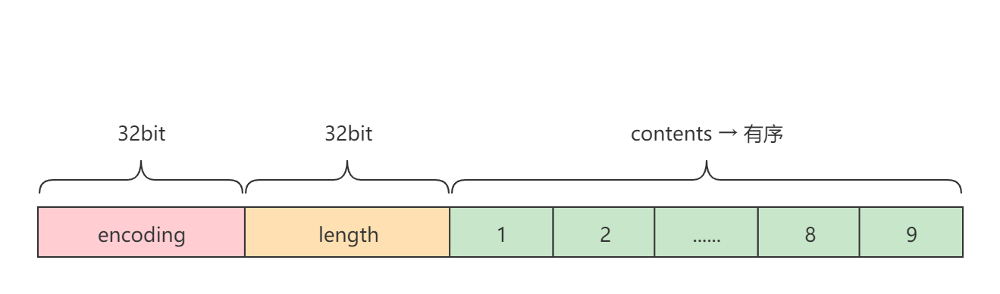

# intset

[TOC]

## Introduction

intset是Redis的set数据类型的一种数据结构。其应用场景是当集合当中只包含整数值并且数据不多时才会应用的一种数据结构。其底层使用数组来保存数据，因此在对集合进行新增或删除操作时是需要对集合进行扩容/缩容和迁移操作的。因为这个原因，intset只适合存储少量的数据。

Redis中对intset的定义是最多512个元素。

*`redis.conf`→`set-max-intset-entries`配置：*

```
############################### ADVANCED CONFIG ###############################
......

# Sets have a special encoding in just one case: when a set is composed
# of just strings that happen to be integers in radix 10 in the range
# of 64 bit signed integers.
# The following configuration setting sets the limit in the size of the
# set in order to use this special memory saving encoding.
set-max-intset-entries 512
```

## 总体布局



intset由三部分构成：

- encoding : 集合元素的类型编码。
- length : 集合的长度（元素个数）。
- contents : 集合整数数据。

intset是通过字节数组来存储整数数据，而每一个整数将可能占用不同大小的内存空间。为了能够快速迭代查找，规定每一个整数将占用相同空间的大小，这样只需要前后位移即可迭代。但对于不同整数而言，有占2字节的整数，4字节，8字节的整数。如果设置为8个字节甚至更高，则空间复杂度是低效的，如果设置为4个字节，那么又不能存储8个字节的整数。因此定义了`encoding`编码，用于表示集合最大的整数所需要的编码，因此当集合中只包含4字节而不包含8字节的数据时，用4字节的大小即可，而且也能节省内存。如果新插入了更大字节的数据，只需要升级集合（编码变大）。

例如，刚开始集合中包含10个整数元素，并且每个整数元素都是2字节以内的整数，那么集合的编码（`encoding`）就是对应2字节的编码，如果此时有一个4字节的整数插入，那么将会把整个集合中的元素都扩展为占用4字节空间（即使原来的数据只需要2个字节就够了），并将编码更新为对应4字节的编码。

另外需要注意的是，长度（`ength` ）指的是集合的元素数量，而不是整个集合占用的内存空间大小，length属性的提供使获取集合的大小的时间复杂度由O(n)变为O(1)。

**一个简单的示例**

```
[16]  [10]  [100,101,102,103,104,105,106,107,108,109]  
```

如上所示，一个intset集合，其中16代表集合的编码（`encoding`），表示16位，2个字节。10代表集合元素数量（`length`），表示集合中有10个元素。最后100~109是集合中的10个元素。

现在向集合中添加元素20000000（占4字节）。

```
[32]  [11]  [100,101,102,103,104,105,106,107,108,109,20000000]  
```

集合编码由16变为了32，代表4字节。长度变为11。元素20000000插入到了集合的最后。

## 源码分析

intset结构体（[intset.h](https://github.com/redis/redis/blob/unstable/src/intset.h)）

```c
typedef struct intset {
    uint32_t encoding;
    uint32_t length;
    int8_t contents[];
} intset;

intset *intsetNew(void);
intset *intsetAdd(intset *is, int64_t value, uint8_t *success);
intset *intsetRemove(intset *is, int64_t value, int *success);
uint8_t intsetFind(intset *is, int64_t value);
//随机返回一个元素
int64_t intsetRandom(intset *is);
uint8_t intsetGet(intset *is, uint32_t pos, int64_t *value);
//返回集合的大小（元素个数）
uint32_t intsetLen(const intset *is);
//返回集合的大小（位）
size_t intsetBlobLen(intset *is);
int intsetValidateIntegrity(const unsigned char *is, size_t size, int deep);
```

在Redis中，为intset定义了三种编码，分别是`INTSET_ENC_INT16`，`INTSET_ENC_INT32`和`INTSET_ENC_INT64`。

源码如下（[intset.c](https://github.com/redis/redis/blob/unstable/src/intset.c)）：

```c
/* Note that these encodings are ordered, so:
 * INTSET_ENC_INT16 < INTSET_ENC_INT32 < INTSET_ENC_INT64. */
#define INTSET_ENC_INT16 (sizeof(int16_t))
#define INTSET_ENC_INT32 (sizeof(int32_t))
#define INTSET_ENC_INT64 (sizeof(int64_t))

---------------------------------------------------------------------------------------

/* 为提供的value返回所需的编码。 */
static uint8_t _intsetValueEncoding(int64_t v) {
    if (v < INT32_MIN || v > INT32_MAX)
        return INTSET_ENC_INT64;
    else if (v < INT16_MIN || v > INT16_MAX)
        return INTSET_ENC_INT32;
    else
        return INTSET_ENC_INT16;
}
```

### Create

创建intset，`encoding`默认为`INTSET_ENC_INT16`。

```c
/* Create an empty intset. */
intset *intsetNew(void) {
    intset *is = zmalloc(sizeof(intset));
    is->encoding = intrev32ifbe(INTSET_ENC_INT16);
    is->length = 0;
    return is;
}
```

### Add

向集合中插入一个元素。如果该元素的编码大于集合的编码，则集合将会升级，然后再插入给定的元素。如果等于或小于集合的编码，则首先需要在集合查找该元素，因为集合中的元素不允许重复。因此，如果元素存在，则自然不允许插入，返回`0`。如果不存在，则需要先调整集合的内存空间大小，然后再插入给定的元素。

`intsetAdd()`函数其包含三个参数：

- `*is` : 指向intset的指针。
- `value` : 要插入的整数值。
- `*success` : 该函数返回的是intset的指针，而标记插入成功还是失败就是该`*success`指针。成功为`1`，失败为`0`。

```c
/* Insert an integer in the intset */
intset *intsetAdd(intset *is, int64_t value, uint8_t *success) {
    /*获取要插入整数值的对应编码*/
    uint8_t valenc = _intsetValueEncoding(value);
    uint32_t pos;
    if (success) *success = 1;
    /*valenc是要插入的新元素的编码，而is->encoding是当前intset的编码。如果valenc>is->encoding，
     *编表明当前集合无法存储新元素，因此需要升级。反之，则需要检查该元素是否存在，不存在才允许插入。*/
    if (valenc > intrev32ifbe(is->encoding)) {
        /* This always succeeds, so we don't need to curry *success. */
        return intsetUpgradeAndAdd(is,value);
    } else {
        /* 如果插入的值已经存在集合中，则终止。
         * 还有一个作用：就是填充"pos"，"pos"所指向的元素大于value，"pos-1"所指向的元素小于value，
         * 因此，"pos"就是value将要插入的索引，而"pos"之后的元素将会后移。*/
        if (intsetSearch(is,value,&pos)) {
            if (success) *success = 0;
            return is;
        }
		/* 调整大小：增加一个元素的内存空间 */
        is = intsetResize(is,intrev32ifbe(is->length)+1);
        /* 将pos位置及之后的所有元素向后移动一个索引位 */
        if (pos < intrev32ifbe(is->length)) intsetMoveTail(is,pos,pos+1);
    }
	/* 在pos位置插入value  */
    _intsetSet(is,pos,value);
    /* 更新length */
    is->length = intrev32ifbe(intrev32ifbe(is->length)+1);
    return is;
}
```

### Upgrade

当新插入的元素的编码大于集合的编码时，集合就需要升级，即升级为更大的编码以用于插入给定的整数。`intsetUpgradeAndAdd()`不仅负责升级操作，还会负责在升级之后将新元素插入到集合。需要注意的是，当前新插入的元素是触发升级操作的元素，因此该元素必定将是整个集合中最大或最小的元素。因为位数增加（编码增大），自然是最大（正数）或最小（负数）的整数。因此该元素将会插入到集合的头部或尾部。

```c
/* Upgrades the intset to a larger encoding and inserts the given integer. */
static intset *intsetUpgradeAndAdd(intset *is, int64_t value) {
    //当前编码
    uint8_t curenc = intrev32ifbe(is->encoding);
    //新插入元素的编码
    uint8_t newenc = _intsetValueEncoding(value);
    //当前集合元素的大小
    int length = intrev32ifbe(is->length);
    /* prepend用于决定value是在集合的头部插入还是尾部插入。value必定是插入在头部或尾部。
     * 因为该函数是升级操作，而升级的触发条件是插入元素的编码比集合的编码大。因此，如果value为
     * 正整数，那么必然是最大的；如果value是负数，那么必然是最小的。*/
    int prepend = value < 0 ? 1 : 0;

    /* 首先设置新编码 */
    is->encoding = intrev32ifbe(newenc);
    /* 调整大小：增加一个元素的内存空间 */
    is = intsetResize(is,intrev32ifbe(is->length)+1);
    /* 迭代移动所有元素。因为升级，所以集合中的每个元素都将占用新的位置
     * （升级之后每个元素占用的空间变大了）。*/
    while(length--)
        _intsetSet(is,length+prepend,_intsetGetEncoded(is,length,curenc));

    /* prepend = 1 → 表明value是最小的整数，在头部插入。
     * prepend = 0 → 表明value是最大的整数，在尾部插入。*/
    if (prepend)
        _intsetSet(is,0,value);
    else
        _intsetSet(is,intrev32ifbe(is->length),value);
    /* 更新length */
    is->length = intrev32ifbe(intrev32ifbe(is->length)+1);
    return is;
}
```

### Resize

新增元素，将会调用该函数增加集合大小，反之删除元素，将会缩减集合的大小。该函数没有指定要增加或缩减多少，而是直接传递了一个`len`参数用于指定了新集合的大小，因此集合要增加或缩减多少，需要在调用该函数之前确定。

```c
/* Resize the intset */
static intset *intsetResize(intset *is, uint32_t len) {
    // 总字节大小 = 长度 * 编码
    uint64_t size = (uint64_t)len*intrev32ifbe(is->encoding);
    assert(size <= SIZE_MAX - sizeof(intset));
    // 重新分配内存空间
    is = zrealloc(is,sizeof(intset)+size);
    return is;
}
```

### Remove

从集合中删除给定的`value`。如果删除成功，指针`*success`将被赋为`1`，反之，赋为`0`。

```c
/* Delete integer from intset */
intset *intsetRemove(intset *is, int64_t value, int *success) {
    /* 删除元素的编码 */
    uint8_t valenc = _intsetValueEncoding(value);
    uint32_t pos;
    if (success) *success = 0;
    /* 编码小于集合的编码，并且能找到元素。同时将会为pos赋值被删除元素的索引。 */
    if (valenc <= intrev32ifbe(is->encoding) && intsetSearch(is,value,&pos)) {
        uint32_t len = intrev32ifbe(is->length);

        /* We know we can delete */
        if (success) *success = 1;

        /* 已知被删除元素的索引，则将被删除元素之后的所有元素向前移动一格元素位。 */
        if (pos < (len-1)) intsetMoveTail(is,pos+1,pos);
        /* 缩减集合的大小 */
        is = intsetResize(is,len-1);
        /* 更新length属性 */
        is->length = intrev32ifbe(len-1);
    }
    return is;
}
```

### Find

确定一个`value`是否属于集合中的元素。要满足两个条件：一是查找的`value`的编码要小于等于集合的编码，二是`value`在集合中被找到。

```c
/* Determine whether a value belongs to this set */
uint8_t intsetFind(intset *is, int64_t value) {
    /* 查找元素的编码 */
    uint8_t valenc = _intsetValueEncoding(value);
    /* 编码小于集合的编码，并且找到元素 */
    return valenc <= intrev32ifbe(is->encoding) && intsetSearch(is,value,NULL);
}
```

### Search

搜索`value`在集合中的位置。当在集合中找到时返回`1`，并且会将`value`在集合中的位置索引赋给参数指针`*pos`。如果没有在集合中找到，则会将参数指针`*pos`赋值为可以插入`value`的位置索引。

```c
/* Search for the position of "value". Return 1 when the value was found and
 * sets "pos" to the position of the value within the intset. Return 0 when
 * the value is not present in the intset and sets "pos" to the position
 * where "value" can be inserted. */
static uint8_t intsetSearch(intset *is, int64_t value, uint32_t *pos) {
    int min = 0, max = intrev32ifbe(is->length)-1, mid = -1;
    int64_t cur = -1;

    /* 集合是空的，还找啥 */
    if (intrev32ifbe(is->length) == 0) {
        if (pos) *pos = 0;
        return 0;
    } else {
        /* 查找的value比集合中最大的值还大，还找啥 */
        if (value > _intsetGet(is,max)) {
            if (pos) *pos = intrev32ifbe(is->length);
            return 0;
        /* 同样，查找的value比集合中最小的值还小，还找啥 */
        } else if (value < _intsetGet(is,0)) {
            if (pos) *pos = 0;
            return 0;
        }
    }
	/* 二分查找算法进行搜索 */
    while(max >= min) {
        mid = ((unsigned int)min + (unsigned int)max) >> 1;
        cur = _intsetGet(is,mid);
        if (value > cur) {
            min = mid+1;
        } else if (value < cur) {
            max = mid-1;
        } else {
            break;
        }
    }
    /* value与cur相等，即意味着找到了value，返回1 */
    if (value == cur) {
        if (pos) *pos = mid;
        return 1;
    } else {
        /* 没有找到，返回0。*pos被设置为min，即min索引所指向的元素大于value */
        if (pos) *pos = min;
        return 0;
    }
}
```

### Get

获取给定位置的值。当这个位置超出范围时，函数返回`0`，在范围之内则返回`1`。

注意：`intsetGet()`函数返回`0`,`1`表示获取成功与否，而获取的值由第三个参数指针`*value`指针承载。

```c
/* Get the value at the given position. When this position is
 * out of range the function returns 0, when in range it returns 1. */
uint8_t intsetGet(intset *is, uint32_t pos, int64_t *value) {
    /*如果给定的位置小于集合的大小，才进行获取操作。如果大于，自然是超出范围，直接返回0。*/
    if (pos < intrev32ifbe(is->length)) {
        *value = _intsetGet(is,pos);
        return 1;
    }
    return 0;
}
```

使用配置的编码给定位置的值。

```c
/* Return the value at pos, using the configured encoding. */
static int64_t _intsetGet(intset *is, int pos) {
    return _intsetGetEncoded(is,pos,intrev32ifbe(is->encoding));
}
```

根据给定的编码获取对应位置的值。

```c
/* Return the value at pos, given an encoding. */
static int64_t _intsetGetEncoded(intset *is, int pos, uint8_t enc) {
    int64_t v64;
    int32_t v32;
    int16_t v16;
	/*根据不同的编码类型获取对应位置的值*/
    if (enc == INTSET_ENC_INT64) {
        memcpy(&v64,((int64_t*)is->contents)+pos,sizeof(v64));
        memrev64ifbe(&v64);
        return v64;
    } else if (enc == INTSET_ENC_INT32) {
        memcpy(&v32,((int32_t*)is->contents)+pos,sizeof(v32));
        memrev32ifbe(&v32);
        return v32;
    } else {
        memcpy(&v16,((int16_t*)is->contents)+pos,sizeof(v16));
        memrev16ifbe(&v16);
        return v16;
    }
}
```

### Set

将给定的值（`value`）插入到集合中给定的位置（`pos`）。

```c
/* Set the value at pos, using the configured encoding. */
static void _intsetSet(intset *is, int pos, int64_t value) {
    /* 当前集合编码 */
    uint32_t encoding = intrev32ifbe(is->encoding);
	/* 将value设置到集合的指定位置上 */
    if (encoding == INTSET_ENC_INT64) {
        ((int64_t*)is->contents)[pos] = value;
        memrev64ifbe(((int64_t*)is->contents)+pos);
    } else if (encoding == INTSET_ENC_INT32) {
        ((int32_t*)is->contents)[pos] = value;
        memrev32ifbe(((int32_t*)is->contents)+pos);
    } else {
        ((int16_t*)is->contents)[pos] = value;
        memrev16ifbe(((int16_t*)is->contents)+pos);
    }
}
```

### Move tail

将索引`from`之后的所有元素移动到索引`to`的位置。如果`from`大于`to`，表示向后移动，反之，则表示向前移动。

```c
static void intsetMoveTail(intset *is, uint32_t from, uint32_t to) {
    void *src, *dst;
    //要移动的字节数（当前还仅仅是要一定的元素数）
    uint32_t bytes = intrev32ifbe(is->length)-from;
    //编码
    uint32_t encoding = intrev32ifbe(is->encoding);
    if (encoding == INTSET_ENC_INT64) {
        /*src → from位置的指针 */
        /*dst → to位置的指针 */
        src = (int64_t*)is->contents+from;
        dst = (int64_t*)is->contents+to;
        /* *=计算，此时才是真正要移动的字节数 */
        bytes *= sizeof(int64_t);
    } else if (encoding == INTSET_ENC_INT32) {
        src = (int32_t*)is->contents+from;
        dst = (int32_t*)is->contents+to;
        bytes *= sizeof(int32_t);
    } else {
        src = (int16_t*)is->contents+from;
        dst = (int16_t*)is->contents+to;
        bytes *= sizeof(int16_t);
    }
    /* 移动元素 */
    memmove(dst,src,bytes);
}
```