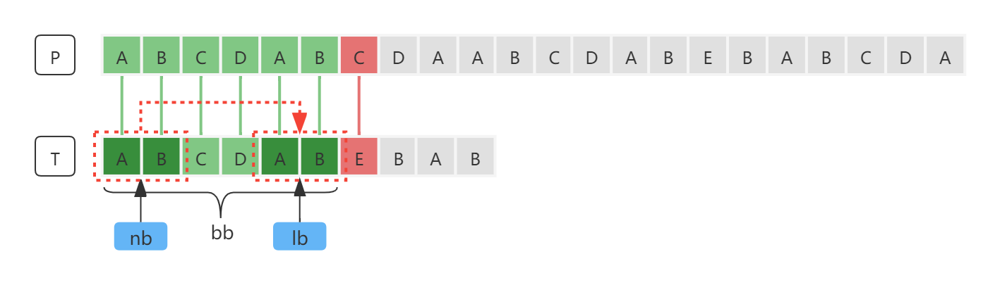

# KMP

[TOC]

## 简介

KMP算法是一种改进的字符串匹配算法，由D.E.Knuth，J.H.Morris和V.R.Pratt提出，因此人们称它为克努特—莫里斯—普拉特操作（简称KMP算法）。KMP算法的核心思想是利用匹配失败后的信息，尽量减少模式串与主串的匹配次数以达到快速匹配的目的。具体实现就是通过一个`next[]`数组实现，函数本身包含了模式串的局部匹配信息。KMP算法的时间复杂度为O(m+n)。

## 串模式匹配算法

串模式匹配是指给定一个主串P，和模式串T，找到模式串T在主串P中的起始索引位置。这种查找的算法即称为*串模式匹配算法*。

## 普通模式匹配算法

一种最直观的思路就是将主串P与模式串T的字符依次进行匹配。首先将主串P的第一个字符与模式串T的第一个字符进行匹配，若相等，则继续将主串P的第二个字符与模式串T的第二个字符进行匹配。以此类推，直到匹配到模式串T的最后一个字符为止，即为匹配成功。若匹配过程中某一个字符不相等，则将主串P的第二个字符与模式串T的第一个字符进行比较，然后主串P的第三个字符与模式串T的第二个字符进行比较。以此类推，依次比较下去，直接最终匹配成功或匹配失败。

这种算法被称为BF算法，即暴力（Brute Force）算法，又称普通的模式匹配算法。BF算法是一种蛮力算法。在极端情况下BF算法要进行`m*n`次比较，即时间复杂度是`O(m*n)`。

## 快速模式匹配算法

BF算法，其时间复杂度低效的。原因在于每一次匹配失败时，模式串T都要从头开始重新匹配，主串P也要回溯到上一次起始匹配位置的下一个字符。在极端情况下，始终是在模式串T的最后一个字符串匹配失败。如下图所示，直接可以观察到模式串T与主串P的尾部匹配，但是计算机不得不依次一个一个的进行匹配。


那么有没有一种办法可以利用匹配失败后的信息，尽量减少模式串与主串的匹配次数以达到快速匹配的目的呢？

### 匹配失败信息

**主串P和模式串T**


**匹配流程**

1. 首先将主串P和模式串T从首字符依次开始匹配，到`P[6]`时匹配失败。如下图所示：

   

2. 模式串T向后移动。可以发现，模式串T可以直接向后位移4位，即`P[4]`对应`T[0]`，指针`i`保持不变，仍然指向`P[6]`，指针`j`从`T[6]`回溯到`T[2]`。然后继续开始比较，到`P[9] - T[5]`时匹配失败。如下图所示：

   

3. 模式串T直接向后位移4位，即`P[8]`对应`T[0]`。指针i仍然指针`P[9]`，指针j从`T[5]`回溯到`T[1]`。然后继续开始比较，第一次比较`P[9]`与`T[1]`就匹配失败。如下图所示：

   

4. 第一次比较`P[9]`与`T[1]`就匹配失败，因此模式串T向后位移1位，进行比较。此次匹配成功。如下图所示：


**规律分析**

模式串T每次向后位移的时候都有规律可循。如下图所示，位移之后，模式串T的子串`nb`与串P的子串`lb`是对应的，因此可以直接省略中间字符串的匹配，因为中间字符绝对不可能与模式串T能匹配成功（后面会证明）。


又由于模式串T匹配失败字符的前半部分子串`bb`与串P是对应，因此，这个前后匹配的子串`nb`和`lb`只需要关注模式串T就够了。而这个可以前后匹配的子串被称为**公共前后缀**。如下图所示：




只关注模式串T。


### 公共前后缀

串T：ABCDAB，其有如下前缀和后缀：

| 前缀    | 后缀    |
| ------- | ------- |
| `A`     | `B`     |
| **AB**  | **AB**  |
| `ABC`   | `DAB`   |
| `ABCD`  | `CDAB`  |
| `ABCDA` | `BCDAB` |

> 注意：**串b的前缀和后缀不包含串T本身。**

如上表所示，前缀和后缀只有AB可以匹配。**前缀和后缀可以匹配的前后缀称为公共前后缀**。

### 最长公共前后缀

给定一个串，长度为`i`。其可以匹配的前后缀可以有0~n个，如果有0个，即表示没有公共前后缀。如果有大于1个，则长度最长的那个称为最长公共前后缀。 我们所需要的是最长的那个公共前后缀。假设最长公共前后缀长度为`k`（k<i），就称`T[0~k]`为`T[i]`的最长公共前后缀


---


理解了最长公共前后缀的概念之后，下一步继续分析。在每一次模式T串向后移动的时候（这里为了方便理解说的是移动模式串T，实际上是变换模式串T的`j`指针），其主串P的指针`i`没有任何发生变化，仍然是指向原来的位置。变化的仅仅是模式串T的指针`j`，而每次变化之后指针`j`指向的是`T[0 ~ j-1]`的最长公共前缀的下一个字符。也就说，假设`T[0 ~ j-1]`的最长公共前缀的长度是`k`，那么变换之后，指针j指向`k+1`，如下图所示：


根据上面分析的规律，如果我们能求得模式串T中每个字符的最长公共前后缀，那么在每次匹配失败的时候，就可以依据当前匹配失败的字符`T[j]`的前一个字符`T[j-1]`的最长公共前后缀信息直接跳过不必要的匹配位，进而减少匹配次数，提升算法的效率。

如上图示，模式串匹配到字符A时匹配失败，那么主串P的`i`指针保持不变，`j`指针跳转到`k+1`，然后`i`和`j`重新开始依次匹配。当然，这里的前提是知道`T[j-1]`的最长公共前后缀是多少。

### Next数组

假设我们以一个数组来存储模式串T中每个字符的最长公共前后缀的信息，数组的索引与模式串T的每个字符索引对应，数组对应索引位所存储的值就是模式串T对应索引位字符的最长公共前后缀的长度。那么我们称这个数组为next数组。如下图所示：


> 索引0没有最长公共前后缀。索引1虽然前面有一个字符，但是最长公共前后缀不能为串本身。

由于指针`j`回溯的是`T[j-1]`的最长公共前后缀的下一个字符`k+1`，因此我们也可以直接使next数组的每一个元素`T[j]`指向`T[j-1]`的最长公共前后缀的下一个字符`k+1`。即`T[j] = T[j-1]{k}+1`。在需要回溯的时候，直接取出就可以使用。

如果使`T[j]=T[j]{k}`，在每次回溯的时候，首先需要获取`T[j-1]`的最长公共前后缀`T[j-1]{k}`，然后再将`k+1`。


---


现在，问题变成了如何计算得出next数组。

我们按照模式串T的下标从小到大依次计算next数组的值。当我们要计算next[i]的时候，前面的next[0]，next[1]，......，next[i-1]已经计算出来了。

假设现在要计算next[i]的最长公共前后缀，并且已知next[i-1]的最长公共前后缀，其长度为`k-1`。如下图所示，`T[i-1]`的最长公共前后缀为5：


### T[K]等于T[i]

结论：**如果字符T[k-1]的下一个字符T[K]与T[i-1]的下一个字符T[i]相等，那么子串T[0-k]就是字符T[i]的最长公共前后缀**。

证明：

由于`T[i]`作为当前需要计算最长公共前后缀的字符，如果其存在最长公共前后缀，那么`T[i]`必然会是最长公共前后缀尾部字符。如果最长公共前后缀长度为1，那么`T[i]`必然与串T的头部第一个字符匹配。如果最长公共前后缀大于1，那么字符`T[i]`的前面部分必然有一部分与头部匹配，如下图所示：


基于这样的规则，反向论证：假设字符`T[k-1]`的下一个字符`T[K]`与`T[i-1]`的下一个字符`T[i]`相等，但子串`T[0 ~ k]`不是字符`T[i]`的最长公共前后缀。那么也就意味着字符`T[i-1]`的最长公共前后缀的长度大于`k-1`。但子串`T[0 ~ i-1]`的最长公共前后缀已经明确，就是`T[0 ~ k-1]`和`T[i-k ~ i-1]`。没有比其更长的可匹配前后缀了。此时`T[K]`等于`T[i]`，那么也就意味着，对于`T[i]`而言，其最长公共前后缀的长度等于`k`，不可能有超出`k`的可匹配前后缀了。


因此，**如果字符`T[k-1]`的下一个字符`T[K]`与`T[i-1]`的下一个字符T[i]相等，那么子串`T[0-k]`就是字符T[i]的最长公共前后缀，条件不成立。同时也证明了`T[i]`的最长公共前后缀不大于`T[0~K]`。**

### T[K]不等于T[i]

如果字符`T[k-1]`的下一个字符`T[K]`与`T[i-1]`的下一个字符`T[i]`不相等呢？

前面已经证明了如果`T[K]`等于`T[i]`，那么子串`T[0-k]`就是字符`T[i]`的最长公共前后缀。反之，子串`T[0-k]`一定不是字符`T[i]`的最长公共前后缀。同时前面也证明了`T[i]`的最长公共前后缀不大于`T[0 ~ K]`。那么当`T[K]`不等于`T[i]`时，`T[i]`的最长公共前后缀必定小于`T[0 ~ k-1]`。


不管怎样，`T[i]`一定是最长公共前后缀的最后一个字符。由于`T[K]`不等于`T[i]`，那么`T[i]`与`T[0 ~ K-1]`的某一个字符对应，假设这个字符为`s`，那么`T[0 ~ s]`必定与`T[(i-s) ~ i]`匹配。`T[0 ~ s]`和`T[(i-s)~(i-1)]`分别归属于`T[0 ~ k-1]`和`T[(i-k) ~ (i-1)]`的一部分，而这一部分又是属于`T[i-1]`的最长公共前后缀，如下图所示：


忽略指针`s`所指向字符，那么`T[0 ~ s-1]`与`T[(i-s) ~ i-1]`匹配。看起来就像是在获取`T[0 ~ k-1]`的前半部分和`T[(i-k)~(i-1)]`的后半部分。即获取的是`T[i-1]`的公共前缀和公共后缀，而又由于前后缀相等，进而可以换算成获取`T[k-1]`的**某一个**公共前后缀。如下图所示：


依据"`T[K]`等于`T[i]`"的规则。在`T[k]`不等于`T[i]`的情况下，我们可以直接先获取`T[k-1]`的最长公共前后缀的前缀`T[0 ~ s-1]`，如果其下一个字符`T[s]`等于`T[i]`，那么其`T[0 ~ s]`和`T[i-s ~ i]`就是`T[i]`的最长公共前后缀。如果其下一个字符`T[s]`不等于`T[i]`，根据上面的推理分析，`T[i]`的最长公共前缀包含在`T[s-1]`的最长公共前后缀之内，继续向前查找`T[s]`是否等于`T[i]`，一直到`T[s]`等于`T[i]`或者找到`T[1]`为止（`T[1]`没有最长公共前后缀，因为最长公共前后缀不能包含串本身）。

因此，可以得出结论：

**如果字符`T[k-1]`的下一个字符`T[K]`与`T[i-1]`的下一个字符`T[i]`不相等，那么`T[i]`的最长公共前后缀包含在`T[i-1]`的最长公共前后缀范围之内。匹配`T[k-1]`的最长公共前后缀的下一个字符`T[s]`是否与`T[i]`相等，如果相等，则`T[k-1]`的最长公共前后缀加下一个字符`T[0~s]`就是`T[i]`的最长公共前后缀。如果不相等，则继续匹配`T[k-1]`的最长公共前后缀串的最长公共前后缀的下一个字符是否与`T[i]`相等，如果相等......。一直到`T[s]`等于`T[i]`或`T[1]`为止。**

### 算法实现

#### Java Next

**Next数组模式 -  `T[j]=T[j]{k}` :** 

 * 局部变量k为`T[i-1]`的最长公共前后缀长度，从0开始。
 * 当最长公共前后缀长度为0时，k等于-1；长度为1时，k等于0；以此类推。

*实现1*

```java
public static int[] getNext(char[] ss) {
    int[] next = new int[ss.length];
    next[0] = -1;
    int k = -1;
    for (int i = 1; i < ss.length; i++) {
        while (k != -1 && ss[k + 1] != ss[i]) {
            k = next[k];
        }
        if (ss[k + 1] == ss[i]) {
            ++k;
        }
        next[i] = k;
    }
    return next;
}
```

*实现2*

```java
public static int[] getNext(char[] t) {
    int[] next = new int[t.length];
    next[0] = -1;
    int i = 1, k = -1;
    while (i < t.length) {
        if (t[i] == t[k + 1])
            next[i++] = ++k;
        else {
            if (k == -1)
                next[i++] = k;
            else
                k = next[k];
        }
    }
    return next;
}
```

**Next数组模式 - `T[j] = T[j-1]{k}+1` :** 

 * 局部变量k为`T[i-1]`的最长公共前后缀的下一个元素的指针。从1开始。
 * 当长度为0是，k等于0，当长度为1时，k等于1。k等于-1表示已经找到第一个字符都还没有匹配成功。

```java
public static int[] getNext(char[] t) {
    int[] next = new int[t.length];
    next[0] = -1;
    int i = 1, k = -1;
    while (i < t.length) {
        if (k == -1 || t[i] == t[k])
            next[i++] = ++k;
        else
            k = next[k];
    }
    return next;
}
```

#### Java KMP

**Next数组模式 - `T[j]=T[j]{k}` :** 

*实现1*

```java
public int kmp(char[] ps, char[] ss) {
    int[] next = getNext(ss);
    int j = 0;
    for (int i = 0; i < ps.length; i++) {
        if (ps[i] != ss[j]) {
            if (j == 0) continue;
            j = next[j - 1] + 1;
        }
        if (++j == ss.length)
            return i - j + 1;
    }
    return -1;
}
```

*实现2*

```java
public int kmp(char[] ps, char[] ss) {
    int[] next = getNext(ss);
    int i = 0, j = 0;
    while (i < ps.length && j < ss.length) {
        if (ps[i] == ss[j]) {
            i++;
            j++;
        } else {
            if (j == 0)
                i++;
            else
                j = next[j - 1] + 1;
        }
    }
    return j == ss.length ? i - j : -1;
}
```

**Next数组模式 - `T[j] = T[j-1]{k}+1` :** 

*实现1*

```java
public int kmp(char[] ps, char[] ss) {
    int[] next = getNext1(ss);
    int j = 0;
    for (int i = 0; i < ps.length; i++) {
        if (ps[i] != ss[j])
            j = next[j];
        if (++j == ss.length)
            return i - j + 1;
    }
    return -1;
}
```

*实现2*

```java
public int kmp(char[] ps, char[] ss) {
    int[] next = getNext1(ss);
    int i = 0, j = 0;
    while (i < ps.length && j < ss.length) {
        if (j == -1 || ps[i] == ss[j]) {
            i++;
            j++;
        } else
            j = next[j];
    }
    return j == ss.length ? i - j : -1;
}
```


#### C Next


#### C KMP