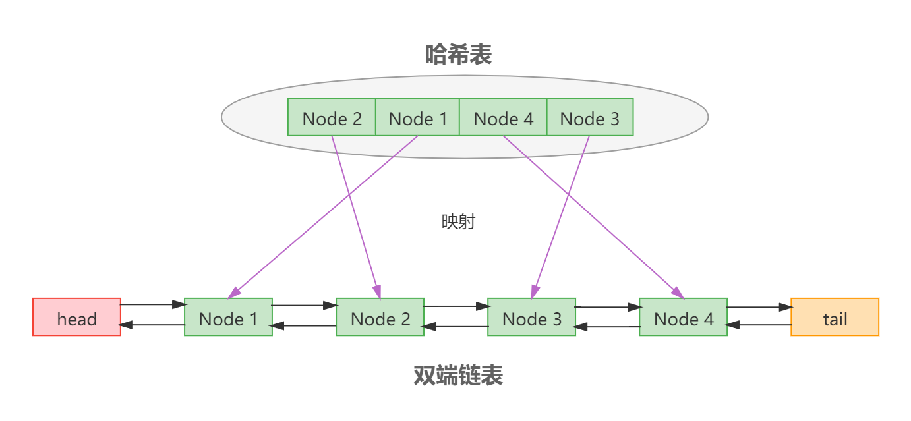

# LRU cache

## 简介

LRU是Least Recently Used的缩写，即最近最少使用。

LRU cache就是一种缓存淘汰策略。缓存是存储在内存当中，但内存的空间是有限的，当内存满时，并且同时有新的缓存加入，那么该如何处理？LRU cache就是一种针对这种情形的缓存淘汰策略，这种策略决定了哪些缓存需要被淘汰。

## 原理

**LRU cache的原理**

在内存已满，并且同时有新的缓存加入时，就将最少使用的缓存数据移除，添加当前新的缓存。

**具体的实现原理**

将最少使用的缓存数据移除的关键点在于如何得知哪些缓存是最少使用的。具体的原理是维护了一个容量有限的双端队列，每次添加新的缓存数据时，从队列的头部添加，每次访问缓存数据时，将该被访问的缓存数据移至队列头部，随着时间的推移，队列尾部的缓存数据就是最少使用的，因此当队列已满，并且添加新的缓存时，移除队列尾部的元素，添加当前缓存数据。

**LRU操作流程**

首先声明一个容量为4的空队列（左边为队头，右边为队尾），如下图所示：
.png)
向队列中依次添加元素A、B、C、D
.png)
获取元素B，元素B将被移至队列的头部，如下图所示：
.png)
元素B移至队头之后，最终队列的结构如下图所示：
.png)
向队列中添加元素E，因为此时队列已经满了，移除队列最尾部的元素A。如下图所示：
.png)
元素E被添加到队列中，位于队列头部；元素A已被移除，最终队列的结构如下图所示：
.png)

## 分析

要实现LRU算法需要保证以下三个关键点：

1. 队列容量是有限制的。
2. 要对元素实现增删改查操作要保证效率。
3. 将最近访问和新增已存在Key的元素移至队列的头部。

队列容量是有限制的无需多言。而要保证对元素增删改查操作的效率需要仔细考量，假设我们用一个队列去实现，其增删改查操作的时间复杂度如下：

- 增：直接将元素插入到队列头部即可。时间复杂度O(1)。
- 删：要删除指定的元素，首先需要找到该元素，因此需要迭代队列依次对比。时间复杂度O(n)。
- 改：跟删除操作也是一样的。时间复杂度O(n)。
- 查：不用说了。时间复杂度O(n)。

可以看到，除了增加操作之外，删改查都是线性操作，时间复杂O(n)，这是绝对不可以容忍的。其实无论是删还是改，其时间复杂度在队列中操作都是O(1)，而这里之所以时间复杂度是O(n)，是因为在删改操作之前，必须先找到该元素，而查操作的时间复杂度却是O(n)。因此，如果能够降低查操作的时间复杂度，那么就可以极大的提升LRU算法的效率。

我们知道Hash表可以将查操作的时间复杂度降至O(1)，因此，如果将Hash表和队列两个数据结构结合来实现LRU算法，就可以将其删改查操作的时间复杂度都降至O(1)。

因此Hash表 + 队列（双端链表）两个数据结构结合，就可以实现比较完美的LRU缓存淘汰算法：

- 基于Hash表可以保证元素的查找时间复杂度是O(1)。
- 基于双端链表可以保证删除、新增和修改的时间复杂度是O(1)。

双端链表用于记录元素的顺序。Hash表用于查询链表中的元素，支持时间复杂度O(1)随机访问。结构如下图所示：




对于最近访问和新增已存在Key的元素移至队列的头部的操作而言是很简单的：将对应的元素移除，然后插入到队列头部即可。并且基于Hash表 + 队列的方式已经保证了移除和插入时间复杂度是O(1)，因此也不存在效率问题。


## 实现

### 基于HashMap+自定义双端链表实现

```java
import java.util.HashMap;

public class LRUCache<K, V> {

    private final HashMap<K, Node<K, V>> map = new HashMap<>();

    private final DoubleLinkedList<K, V> queue = new DoubleLinkedList<>();

    private static final long DEFAULT_CAPACITY = 100;

    private long capacity = DEFAULT_CAPACITY;

    public LRUCache() {

    }

    public LRUCache(long capacity) {
        this.capacity = capacity;
    }

    public V get(K key) {
        Node<K, V> node = map.get(key);
        if (node != null) {
            queue.moveToHead(node);
            return node.value;
        }
        return null;
    }


    public V put(K key, V value) {
        Node<K, V> node = map.get(key);
        if (node != null) {
            V oldValue = node.value;
            node.value = value;
            queue.moveToHead(node);
            return oldValue;
        } else {
            node = new Node<>(key, value);
            if (map.size() == capacity) {
                Node<K, V> lastNode = queue.removeTail();
                map.remove(lastNode.key);
            }
            queue.add(node);
            map.put(key, node);
            return null;
        }
    }

    public V remove(K key) {
        Node<K, V> node = map.get(key);
        if (node != null) {
            map.remove(key);
            queue.remove(node);
            return node.value;
        }
        return null;
    }

    @Override
    public String toString() {
        StringBuilder sb = new StringBuilder();
        Node<K, V> cur = queue.head.next;
        int i = 0;
        while (cur != queue.tail && i <= 100) {
            sb.append("→").append(cur.value);
            cur = cur.next;
            i++;
        }
        return sb.delete(0, 1).toString();
    }

    private static class DoubleLinkedList<K, V> {

        private final Node<K, V> head = new Node<>();

        private final Node<K, V> tail = new Node<>();

        public DoubleLinkedList() {
            head.next = tail;
            tail.prev = head;
        }

        public void add(Node<K, V> node) {
            node.next = head.next;
            node.prev = head;
            head.next.prev = node;
            head.next = node;
        }

        public void remove(Node<K, V> node) {
            node.prev.next = node.next;
            node.next.prev = node.prev;
            node.prev = null;
            node.next = null;
        }

        public Node<K, V> removeTail() {
            if (head != tail.prev) {
                Node<K, V> node;
                remove(node = tail.prev);
                return node;
            }
            return null;
        }

        public void moveToHead(Node<K, V> node) {
            if (head.next != node) {
                remove(node);
                add(node);
            }
        }
    }


    private static class Node<K, V> {

        private K key;

        private V value;

        private Node<K, V> prev;

        private Node<K, V> next;

        public Node() {

        }

        public Node(K key, V value) {
            this.key = key;
            this.value = value;
        }
    }
}
```

注意：上述实现不具有线程安全性。

### 基于LinkedHashMap实现

```java
import java.util.LinkedHashMap;
import java.util.Map;

public class LRUCache1<K, V> extends LinkedHashMap<K, V> {

    private static final int DEFAULT_CAPACITY = 100;

    private final int capacity;

    public LRUCache1() {
        this(DEFAULT_CAPACITY);
    }
    
    public LRUCache1(int capacity) {
        super(capacity, 0.75f, true);
        this.capacity = capacity;
    }

    @Override
    protected boolean removeEldestEntry(Map.Entry<K, V> eldest) {
        return size() > capacity;
    }
}
```

如上代码所示，基于LinkedHashMap实现的LRU非常简单，只需要继承LinkedHashMap，并重写removeEldestEntry方法即可。removeEldestEntry方法的作用是用于判断是否要删除最旧的元素，参数eldest为当前列表中最旧的元素（链表中的第一个元素）。在这里我们直接判断当前LRU中的元素数量大于最大限制容量时返回TRUE，即删除最旧的元素。

还有一点需要注意的是，要将accessOrder设置为TRUE，才有效，如下所示：

```java
super(capacity, 0.75f, true);
```

**实现原理**

LinkedHashMap已经将Hash和双端链表的维护工作完成，其内部的实现方式与“基于HashMap+自定义双端链表实现”是一样的，都是基于HashMap+双端链表实现。唯一的一点差异是LinkedHashMap每次调用put方法插入元素都是将元素插入到链表的尾部，而上面的实现是插入到链表的头部，因此基于LinkedHashMap的实现其链表头部的元素就是最旧的元素。

LinkedHashMap继承了HashMap，并重写了HashMap三个after方法，如下所示：

```java
// Callbacks to allow LinkedHashMap post-actions
void afterNodeAccess(Node<K,V> p) { }
void afterNodeInsertion(boolean evict) { }
void afterNodeRemoval(Node<K,V> p) { }
```

- afterNodeAccess：调用put方法插入元素成功，并且插入的K是已经存在的，将会回调该方法。在LinkedHashMap对此方法的实现中，会将当前的K所对应的节点移动到链表的尾部，即变成最新的元素。调用get方法也会调用此方法（get方法已被LinkedHashMap重写）。
- afterNodeInsertion：调用put方法插入元素成功，并且插入的K是新的，将会回调该方法。在LinkedHashMap对此方法的实现中，会完成最旧元素的移除工作。
- afterNodeRemoval：调用remove方法时会回调此方法。在LinkedHashMap对此方法的实现中，会将当前被删除的元素节点从链表中移除。


