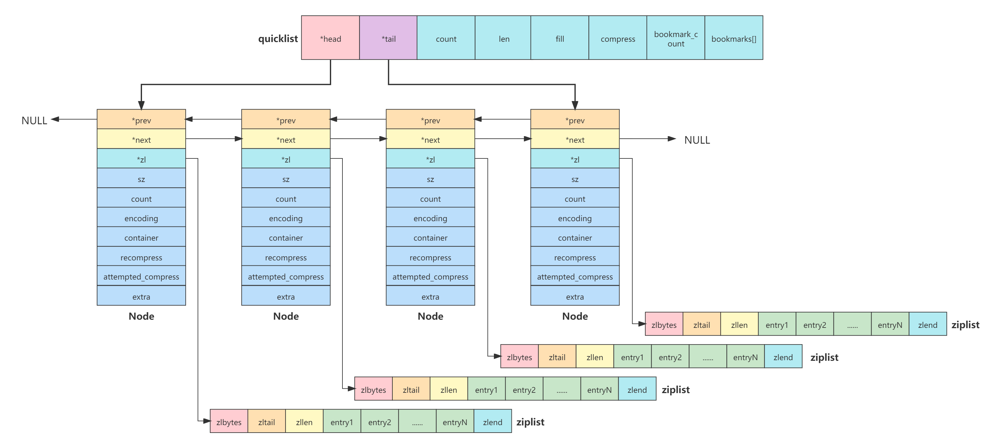

# quicklist

[TOC]

## Introduction

quicklist是一个基于ziplist的双端链表（A doubly linked list of ziplists）。简单来说，就是将ziplist和普通的双端链表结合起来，双端链表的每个节点都是一个ziplist，而ziplist中又保存多个列表元素。这样即可以避免大量指针带来的内存消耗，又可以避免ziplist更新导致的性能损耗。

## Why need quicklist

ziplist是一种特殊编码的双链表，它的内存利用率高，并且从列表的任意一端推入和弹出元素的时间复杂度都是O(1)。但因此也带来了一个副作用，每一次新的操作都需要重新分配内存。因此其更新的复杂性与所使用的内存数量有关，这也就导致了它不能存储太多太大的数据。而对于普通的双端链表而言，每个节点都需要一个前继和后继指针，甚至还有一个指向具体元素的指针。当链表中的元素较多时，这些指针将占用大量的内存。甚至节点存储的数据还没有指针占用的内存大。

那么有什么办法既可以得到ziplist的空间高效性，又能得到普通的双端链表低更新复杂度呢？这个办法就是quicklist。

## 总体布局



quicklist的结构就是一个标准的双端链表，真正存储数据的是ziplist。主要包含三部分：quicklist，Node和ziplist。

关键成员：

- `*head` : quicklist中指向链表头节点的指针。

- `*tail` : quicklist中指向链表尾节点的指针。

- `*prev` : Node中指向前继节点的指针。

- `*next` : Node中指向后继节点的指针。

- `*zl` : Node中指向ziplist的指针。

其他属性将在后面详细介绍。

## 填充因子

quicklist对于每一个节点的ziplist大小都是有限制的，不可能允许无限增长。在Redis中，对其有5种限制范围，分别是4KB、8KB、16KB、32KB和64KB，即代表着ziplist的大小不能超过这5个限制范围。这个代码位于quicklist.c文件中的常量`optimization_level`。代码如下：

```c
/* Optimization levels for size-based filling.
 * Note that the largest possible limit is 16k, so even if each record takes
 * just one byte, it still won't overflow the 16 bit count field. */
static const size_t optimization_level[] = {4096, 8192, 16384, 32768, 65536};
```

至于具体采用哪一种限制，在Redis中通过配置文件中的`list-max-ziplist-size`属性进行设置，对应的配置策略如下：


- `-5` : max size: 64 Kb   ← 不推荐用于正常的工作负载
- `-4` : max size: 32 Kb   ← 不推荐
- `-3` : max size: 16 Kb   ← 可能不推荐
- `-2` : max size:   8 Kb   ← 推荐
- `-1` : max size:   4 Kb   ← 推荐

`list-max-ziplist-size`的正常取值范围为`-1`~`-5`。默认情况下，`list-max-ziplist-size`被设置为`-2`，即quicklist中每一个节点的ziplist的最大大小为8KB。

`list-max-ziplist-size`设置之后，其值将会映射到quicklist的`fill`属性。

如果`list-max-ziplist-size`被设置为非正常取值，将会有如下四次情况：

- `list-max-ziplist-size`不被设置：quicklist创建时，fill将会被设置为-2，即应用了默认策略。

- `list-max-ziplist-size`被设置为小于`-5`：意味着每一个新元素的push都将创建一个对应的新节点以及ziplist。

- `list-max-ziplist-size`被设置为大于`0`：即fill被设置为大于0，此时fill将不再作为ziplist大小限制的阈值，而是作为ziplist的entry数量限制的阈值。例如fill等于5，即每个节点的ziplist的entry数量不能超过4（<fill）个。

  注意，fill大于0时是在限制entry数量，但这并不表示ziplist的大小就不在限制了。quicklist有一个安全限制的控制。即当fill大于0时，将采用entry数量限制，但ziplist的大小也不能超过安全限制。安全限制的大小是8KB（跟fill的默认策略一样）。安全限制的优先级高于entry数量的限制，即如果ziplist的大小大于8KB，即使entry数量小于entry，也不允许再添加了。

- `list-max-ziplist-size`的值被设置为等于0：在逻辑上跟fill被设置为大于0一样，作为ziplist的entry数量限制的阈值。但因为fill等于0，所以在进行数量限制是没有意义的，此时无论ziplist大小是否超过安全限制，都需要创建一个新节点以及ziplist。即是说最终效果跟被设置为小于`-5`是一样的。

安全限制代码如下：

```c
/* bytes of any multi-element ziplist.
 * Larger values will live in their own isolated ziplists.
 * This is used only if we're limited by record count. when we're limited by
 * size, the maximum limit is bigger, but still safe.
 * 8k is a recommended / default size limit */
#define SIZE_SAFETY_LIMIT 8192

#define sizeMeetsSafetyLimit(sz) ((sz) <= SIZE_SAFETY_LIMIT)
```

*`redis.conf`→`list-max-ziplist-size`配置：*

```
############################### ADVANCED CONFIG ###############################

# Lists are also encoded in a special way to save a lot of space.
# The number of entries allowed per internal list node can be specified
# as a fixed maximum size or a maximum number of elements.
# For a fixed maximum size, use -5 through -1, meaning:
# -5: max size: 64 Kb  <-- not recommended for normal workloads
# -4: max size: 32 Kb  <-- not recommended
# -3: max size: 16 Kb  <-- probably not recommended
# -2: max size: 8 Kb   <-- good
# -1: max size: 4 Kb   <-- good
# Positive numbers mean store up to _exactly_ that number of elements
# per list node.
# The highest performing option is usually -2 (8 Kb size) or -1 (4 Kb size),
# but if your use case is unique, adjust the settings as necessary.
list-max-ziplist-size -2
```

## 节点压缩

为了更进一步节省内存，Redis的quicklist提供了对节点进行LZF算法的压缩功能，压缩之后，节点占用内存变小。大部分情况下对list进行`push`和`pop`操作是最常见的，因此对于头部和尾部的一些节点不会进行压缩，但是中间的节点会全部进行压缩。

在Redis中，对压缩功能的控制是通过在Redis中配置文件中的`list-compress-depth`属性进行配置的，对应策略如下：

- `0` : 禁用所有列表压缩。

- `1` : quicklist两端各有一个节点不压缩，所有中间节点全部压缩。

  ```
  So: [head]→node→node→...→node→[tail]
  [head]和[tail]未压缩，其他中间节点全部压缩。
  ```

- `2` : quicklist两端各有两个节点不压缩，所有中间节点全部压缩。

  ```
  So: [head]→[next]→node→node→...→node→[prev]→[tail]
  [head],[head]→[next]和[prev],[prev]→[tail]未压缩，其他中间节点全部压缩。
  ```

- `3` : quicklist两端各有三个节点不压缩，所有中间节点全部压缩。

  ```
  So: [head]→[next]→[next]→node→node→...→node→[prev]→[prev]→[tail]
  [head]→[next]→[next]和[prev]→[prev]→[tail]未压缩，其他中间节点全部压缩。
  ```

- `4` : etc.

- etc.

`list-compress-depth`的默认配置为0，即禁用所有列表压缩。

*`redis.conf`→`list-compress-depth`配置：*

```
Compress depth is the number of quicklist ziplist nodes from *each* side of the list to *exclude* from compression.  The head and tail of the list are always uncompressed for fast push/pop operations.  Settings are:
# Lists may also be compressed.
# Compress depth is the number of quicklist ziplist nodes from *each* side of
# the list to *exclude* from compression.  The head and tail of the list
# are always uncompressed for fast push/pop operations.  Settings are:
# 0: disable all list compression
# 1: depth 1 means "don't start compressing until after 1 node into the list,
#    going from either the head or tail"
#    So: [head]->node->node->...->node->[tail]
#    [head], [tail] will always be uncompressed; inner nodes will compress.
# 2: [head]->[next]->node->node->...->node->[prev]->[tail]
#    2 here means: don't compress head or head->next or tail->prev or tail,
#    but compress all nodes between them.
# 3: [head]->[next]->[next]->node->node->...->node->[prev]->[prev]->[tail]
# etc.
list-compress-depth 0
```

## 源码分析

### 结构体

#### quicklist

```c
/* quicklist是一个描述快速列表的40字节的结构体（在64位系统上） */
typedef struct quicklist {
    quicklistNode *head;
    quicklistNode *tail;
    unsigned long count;        /* total count of all entries in all ziplists */
    unsigned long len;          /* number of quicklistNodes */
    int fill : QL_FILL_BITS;              /* fill factor for individual nodes */
    unsigned int compress : QL_COMP_BITS; /* depth of end nodes not to compress;0=off */
    unsigned int bookmark_count: QL_BM_BITS;
    quicklistBookmark bookmarks[];
} quicklist;
```

成员描述：

- `*head` : 指向链表头节点指针。
- `*tail` : 指向链表尾节点指针。
- `count` : 所有ziplist中的全部entry总数。
- `len` : 链表节点的数量。
- `fill` : 填充因子——每个节点ziplist的大小或数量限制，取值范围`-1`~`-5`，默认`-2`。
- `compress` : 压缩深度，即链表的头部和尾部各有几个节点不压缩。默认0—禁用压缩。
- ` bookmark_count` : 书签数量
- `bookmarks[]` : 柔性数组，书签。

> ":"是位运算符，表示占几位。例如`int fill : QL_FILL_BITS`表示占int类型32位中的14位。`compress`也占14位，`bookmark_count`占4位。
>
> `QL_FILL_BITS`，`QL_COMP_BITS`和`QL_BM_BITS`常量定义（quicklist.h）：
>
> ```c
> #if UINTPTR_MAX == 0xffffffff
> /* 32-bit */
> #   define QL_FILL_BITS 14
> #   define QL_COMP_BITS 14
> #   define QL_BM_BITS 4
> #elif UINTPTR_MAX == 0xffffffffffffffff
> /* 64-bit */
> #   define QL_FILL_BITS 16
> #   define QL_COMP_BITS 16
> #   define QL_BM_BITS 4 /* we can encode more, but we rather limit the user
>                      since they cause performance degradation. */
> #else
> #   error unknown arch bits count
> #endif
> ```

#### quicklistNode

```c
typedef struct quicklistNode {
    struct quicklistNode *prev;
    struct quicklistNode *next;
    unsigned char *zl;
    unsigned int sz;             /* ziplist size in bytes */
    unsigned int count : 16;     /* count of items in ziplist */
    unsigned int encoding : 2;   /* RAW==1 or LZF==2 */
    unsigned int container : 2;  /* NONE==1 or ZIPLIST==2 */
    unsigned int recompress : 1; /* was this node previous compressed? */
    unsigned int attempted_compress : 1; /* node can't compress; too small */
    unsigned int extra : 10; /* more bits to steal for future usage */
} quicklistNode;
```

成员说明：

- `*prev` : 指向前继节点的指针。
- `*next` : 指向后继节点的指针。
- `*zl` : 指向ziplist的指针。
- `sz` : ziplist的大小（以字节为单位）。
- `count` : ziplist中的entry数量。
- `encoding` : 节点的编码类型，RAW和LZF，RAW表示ziplist节点，LZF表示lzf压缩节点。
- `container` : 数据装载的容器类型，NONE==1 or ZIPLIST==2。
- `recompress` : 这个节点以前是否被压缩过。
- `attempted_compress` : 测试用户
- `extra` : 扩展。

#### quicklistLZF

ziplist节点被压缩之后的结构体→LZF。

```c
/* quicklistLZF是一个4+N字节的结构体，包含sz和compressed两个字段。 
 * sz是compressed字段的字节长度。
 * compressed是总长度（压缩）为sz的LZF数据。
 * NOTE: 未压缩的长度存储在quicklistNode->sz中。
 * 当quicklistNode->zl被压缩时，node->zl指向一个quicklistLZF。 */
typedef struct quicklistLZF {
    unsigned int sz; /* LZF size in bytes*/
    char compressed[];
} quicklistLZF;
```

成员说明：

- `sz` : 压缩之后的字节大小（LZF）。
- `compressed[]` : 压缩之后字节。

#### Bookmark

Bookmarks在快速列表结构的末尾用realloc填充。它们只应该用于非常大的列表，例如如果有数千个节点，那么增加一些书签，其所产生的额外内存的使用量可以忽略不计，并且确实需要对它们进行局部迭代。

当不使用书签功能时，它们不会增加任何内存开销。但当使用然后删除时，仍然会保留一些开销（避免共振）。使用书签，其数量应该保持在最小，因为在删除节点时也需要删除书签，搜索时要更新书签，这会增加额外的开销。

```c
typedef struct quicklistBookmark {
    quicklistNode *node;
    char *name;
} quicklistBookmark;
```

成员说明：

- `*node` : 节点指针
- `*name` : 名称指针。

### create

#### quicklist创建

```c
/* Create a new quicklist.
 * Free with quicklistRelease(). */
quicklist *quicklistCreate(void) {
    struct quicklist *quicklist;

    quicklist = zmalloc(sizeof(*quicklist));
    quicklist->head = quicklist->tail = NULL;
    quicklist->len = 0;
    quicklist->count = 0;
    quicklist->compress = 0;
    quicklist->fill = -2;
    quicklist->bookmark_count = 0;
    return quicklist;
}
```

注意，fill默认设置为`-2`（8 KB）。

#### quicklistNode创建

```c
REDIS_STATIC quicklistNode *quicklistCreateNode(void) {
    quicklistNode *node;
    node = zmalloc(sizeof(*node));
    node->zl = NULL;
    node->count = 0;
    node->sz = 0;
    node->next = node->prev = NULL;
    node->encoding = QUICKLIST_NODE_ENCODING_RAW;
    node->container = QUICKLIST_NODE_CONTAINER_ZIPLIST;
    node->recompress = 0;
    return node;
}
```

注意，encoding默认被设置为`1`（RAW）；container默认被设置为`2`（ZIPLIST）。

下面是对应的常量（quicklist.h）：

```
/* quicklist node encodings */
#define QUICKLIST_NODE_ENCODING_RAW 1
#define QUICKLIST_NODE_ENCODING_LZF 2

/* quicklist container formats */
#define QUICKLIST_NODE_CONTAINER_NONE 1
#define QUICKLIST_NODE_CONTAINER_ZIPLIST 2
```

### push

#### quicklistPush

`quicklistPush()`包含四个参数，分别是：

- `*quicklist` : 指向快速列表的指针。
- `*value` : 指向要添加元素的指针。
- `sz` : 要添加元素的大小（单位字节）。
- `where` : 从链表的那个方向添加，0→头部添加；-1→尾部加添。

```c
/* It's on file quicklist.h */
#define QUICKLIST_HEAD 0
#define QUICKLIST_TAIL -1
-----------------------------------------------------------------------------------------
/* Wrapper to allow argument-based switching between HEAD/TAIL pop */
void quicklistPush(quicklist *quicklist, void *value, const size_t sz,
                   int where) {
    if (where == QUICKLIST_HEAD) {
        quicklistPushHead(quicklist, value, sz);
    } else if (where == QUICKLIST_TAIL) {
        quicklistPushTail(quicklist, value, sz);
    }
}
```

当`where`等于0时，将调用函数`quicklistPushHead()`从链表的头部添加元素；`where`等于-1时，将调用函数`quicklistPushTail()`从链表的尾部添加元素。下面将以`quicklistPushTail()`函数进行分析。

Note：`quicklistPushHead()`和`quicklistPushTail()`的实现是大同小异的。

#### quicklistPushTail

`quicklistPushTail()`从尾部向链表中添加。首先调用`_quicklistNodeAllowInsert()`函数判断当前尾节点的ziplist是否还允许插入新的元素，如果允许，则插入。如果不允许，则创建新的节点，并使该新节点称为新的尾节点。

```c
/* 添加新的entry到quicklist的尾节点。
 * 
 * 如果返回0，则使用现有的尾节点。
 * 如果返回1，则创建新的尾节点。 */ 
int quicklistPushTail(quicklist *quicklist, void *value, size_t sz) {
    //快速列表尾节点指针
    quicklistNode *orig_tail = quicklist->tail;
    assert(sz < UINT32_MAX); /* TODO: add support for quicklist nodes that are sds encoded (not zipped) */
    //调用_quicklistNodeAllowInsert函数判断是否允许在现有的尾节点ziplist中插入新的元素
    if (likely(_quicklistNodeAllowInsert(quicklist->tail, quicklist->fill, sz))) {
        //将元素插入到现有的尾节点的ziplist中。
        quicklist->tail->zl =
            ziplistPush(quicklist->tail->zl, value, sz, ZIPLIST_TAIL);
        //计算zl大小并更新节点sz成员值
        quicklistNodeUpdateSz(quicklist->tail);
    } else {
        //创建一个空的快速列表节点
        quicklistNode *node = quicklistCreateNode();
        //创建一个新的ziplist，并将元素插入其中
        node->zl = ziplistPush(ziplistNew(), value, sz, ZIPLIST_TAIL);
		//计算zl大小并更新节点sz成员值
        quicklistNodeUpdateSz(node);
        //调用_quicklistInsertNodeAfter函数将当前新建节点添加到当前尾节点之后，使其成为新的尾节点
        _quicklistInsertNodeAfter(quicklist, quicklist->tail, node);
    }
    // quicklist的entry总数记录加1
    quicklist->count++;
    // 尾节点的entry数加1
    quicklist->tail->count++;
    //返回0，现有节点添加的；返回1，新建节点添加的。
    return (orig_tail != quicklist->tail);
}
```

#### _quicklistNodeAllowInsert

该函数的目的是判断指定节点的ziplist是否还允许添加元素，如果允许，返回1，反之，则返回0。需要结合ziplist的特性去分析。

包含三个参数：

- `*node` : 指向待添加元素的节点的指针。
- `fill` : 填充因子，决定了ziplist的最大大小。
- `sz` : 插入元素的大小（单位字节）。

```c
REDIS_STATIC int _quicklistNodeAllowInsert(const quicklistNode *node,
                                           const int fill, const size_t sz) {
    //节点没有，插无可插，直接返回0
    if (unlikely(!node))
        return 0;
    // entry的prevlen和encoding部分的总长度
    int ziplist_overhead; 
    /* 计算prevlen部分的长度 → 具体规则参见ziplist */
    if (sz < 254)
        ziplist_overhead = 1;
    else
        ziplist_overhead = 5;

    /* 计算encoding部分的长度 → 具体规则参见ziplist  */
    if (sz < 64)
        ziplist_overhead += 1;
    else if (likely(sz < 16384))
        ziplist_overhead += 2;
    else
        ziplist_overhead += 5;

    //新ziplist的长度 = 当前ziplist的长度+新增元素的长度+新增元素的prevlen和encoding长度
    unsigned int new_sz = node->sz + sz + ziplist_overhead;
    //判断quicklist节点大小是否满足设定的优化要求，即每个节点的ziplist不能超过指定大小或指定数量
    if (likely(_quicklistNodeSizeMeetsOptimizationRequirement(new_sz, fill)))
        return 1;
    /* 判断是否符合安全限制（ziplist大小小于等于SIZE_SAFETY_LIMIT - 4KB），如果符合安全限制，
     * sizeMeetsSafetyLimit(new_sz)将会返回true，因此条件不成立，将会进行下一步ziplist
     * 最大entry数量的判断。也即是说，只有在符合安全限制的条件下才进行数量判断。*/
    else if (!sizeMeetsSafetyLimit(new_sz))
        return 0;
    // 判断ziplist的entry数量不会超过fill（此时fill大于-1）
    else if ((int)node->count < fill)
        return 1;
    else
        //走到这里，表明符合安全限制。但是并不一定是entry数量大于fill，也可能是fill小于-5或者等于0
        return 0;
}
```

#### _quicklistNodeSizeMeetsOptimizationRequirement

该函数就是真正利用`fill`（填充因子）进行ziplist大小判断的地方，如果ziplist的大小小于填充因子所限制的大小，则返回1。如果`fill`大于等于`0`或者`fill`小于`-5`，返回0。

```c
REDIS_STATIC int _quicklistNodeSizeMeetsOptimizationRequirement(const size_t sz,
                                               const int fill) {
    //填充因子大于等于0，表明采用了安全限制，并以节点的ziplist的entry数量进行限制，因此直接返回0
    if (fill >= 0)
        return 0;
	//将fill转换为成整数，并减1，得出结果为optimization_level数组的索引。
    size_t offset = (-fill) - 1;
    /* 判断索引数是否小于optimization_level数组的元素数量。
     * 因为optimization_level的元素数量是5个，int型，在64位机器上，每个占8字节，即共40字节，
     * 而指针占8个字节，因此(sizeof(optimization_level) / sizeof(*optimization_level))
     * 的结果固定为optimization_level的元素数量，即5。32位机器同理。*/
    if (offset < (sizeof(optimization_level) / sizeof(*optimization_level))) {
        //当前ziplist的大小小于限制，即满足要求，返回1，否则返回0
        if (sz <= optimization_level[offset]) {
            return 1;
        } else {
            return 0;
        }
    } else {
        //此处返回0，表明fill小于-5
        return 0;
    }
}
```

#### quicklistNodeUpdateSz

该函数的功能很简单，就是调用了`ziplistBlobLen()`函数计算ziplist的大小（字节），然后赋给节点的`sz`成员。

```c
#define quicklistNodeUpdateSz(node)                                            \
    do {                                                                       \
        (node)->sz = ziplistBlobLen((node)->zl);                               \
    } while (0)
```

#### _quicklistInsertNodeBefore

```c
/* Wrappers for node inserting around existing node. */
REDIS_STATIC void _quicklistInsertNodeBefore(quicklist *quicklist,
                                             quicklistNode *old_node,
                                             quicklistNode *new_node) {
    __quicklistInsertNode(quicklist, old_node, new_node, 0);
}

REDIS_STATIC void _quicklistInsertNodeAfter(quicklist *quicklist,
                                            quicklistNode *old_node,
                                            quicklistNode *new_node) {
    __quicklistInsertNode(quicklist, old_node, new_node, 1);
}
```

#### __quicklistInsertNode

插入节点。最后会进行压缩操作。

```c
/* 如果‘after’是1，则在‘old_node’节点之后插入‘new_node’。
 * 如果‘after’是0，则在‘old_node’节点之前插入‘new_node’。
 * Note: 'new_node'总是未压缩的, 因此当我们将它赋给head或tail，不需要解压缩它。 */
REDIS_STATIC void __quicklistInsertNode(quicklist *quicklist,
                                        quicklistNode *old_node,
                                        quicklistNode *new_node, int after) {
    //标准的链表节点添加操作，不在详细描述
    if (after) {
        new_node->prev = old_node;
        if (old_node) {
            new_node->next = old_node->next;
            if (old_node->next)
                old_node->next->prev = new_node;
            old_node->next = new_node;
        }
        if (quicklist->tail == old_node)
            quicklist->tail = new_node;
    } else {
        new_node->next = old_node;
        if (old_node) {
            new_node->prev = old_node->prev;
            if (old_node->prev)
                old_node->prev->next = new_node;
            old_node->prev = new_node;
        }
        if (quicklist->head == old_node)
            quicklist->head = new_node;
    }
    /* If this insert creates the only element so far, initialize head/tail. */
    if (quicklist->len == 0) {
        quicklist->head = quicklist->tail = new_node;
    }

    /* Update len first, so in __quicklistCompress we know exactly len */
    quicklist->len++; //节点数量+1

    //new_node不需要压缩，但是old_node却不一定，因此调用quicklistCompress确定是否压缩一下
    if (old_node)
        quicklistCompress(quicklist, old_node);
}
```

#### quicklistCompress

该函数进行节点压缩，首先是判断了当前节点（_node）以前是否被压缩过。当然紧邻新节点的上一个节点肯定是没有被压缩过的，因此会调用`__quicklistCompress()`函数。如果不是紧邻新节点的上一个节（这里假设深度为1，如果深度大于1，也是一样的原理）一般都是压缩过的（如果开启了压缩的话）。

```c
#define quicklistCompress(_ql, _node)                                          \
    do {                                                                       \
        //该节点是否压缩过                                                        \
        if ((_node)->recompress)                                               \
            quicklistCompressNode((_node));                                    \
        else                                                                   \
            __quicklistCompress((_ql), (_node));                               \
    } while (0)
```

##### quicklistCompressNode

节点被标记为依据压缩过了（`recompress` = 1），会调用该函数。但是如果其`encoding`编码仍然是`RAW`，那么也要进行压缩。

```c
/* Compress only uncompressed nodes. */
#define quicklistCompressNode(_node)                                           \
    do {                                                                       \
        if ((_node) && (_node)->encoding == QUICKLIST_NODE_ENCODING_RAW) {     \
            __quicklistCompressNode((_node));                                  \
        }                                                                      \
    } while (0)
```

**__quicklistCompressNode**

`__quicklistCompressNode()`函数就是真正进行压缩操作的地方。需要注意的是，如果ziplist小于48字节，则不会进行压缩，因为它太小了。如果压缩失败，也不会再次尝试压缩，会直接返回。如果压缩不够小，即压缩前与压缩后的大小不超过8字节，也会取消压缩，直接返回。

```c
/* Compress the ziplist in 'node' and update encoding details.
 * Returns 1 if ziplist compressed successfully.
 * Returns 0 if compression failed or if ziplist too small to compress. */
REDIS_STATIC int __quicklistCompressNode(quicklistNode *node) {
#ifdef REDIS_TEST
    node->attempted_compress = 1;
#endif
    //节点的ziplist大小小于MIN_COMPRESS_BYTES（48）字节，不压缩，直接返回
    if (node->sz < MIN_COMPRESS_BYTES)
        return 0;
	//分配一块用于存储压缩之后字节的内存
    quicklistLZF *lzf = zmalloc(sizeof(*lzf) + node->sz);

    /* 如果压缩失败或者压缩不够小，则取消压缩。
     * MIN_COMPRESS_IMPROVE = 8，压缩之后8字节差额判断。*/
    if (((lzf->sz = lzf_compress(node->zl, node->sz, lzf->compressed,
                                 node->sz)) == 0) ||
        lzf->sz + MIN_COMPRESS_IMPROVE >= node->sz) {
        /* 如果值不可压缩，LZF压缩拒绝/终止压缩 */
        zfree(lzf);
        return 0;
    }
    /*到此处就依据压缩成功了*/
    //重新分配一下lzf占用的内存空间（削减空闲空间）
    lzf = zrealloc(lzf, sizeof(*lzf) + lzf->sz);
    //清空原node节点ziplist所占用的空间
    zfree(node->zl);
    //将原node节点指向ziplist的指针*zl指向lzf。
    node->zl = (unsigned char *)lzf;
    //设置编码为LZF
    node->encoding = QUICKLIST_NODE_ENCODING_LZF;
    //设置为未压缩
    node->recompress = 0;
    return 1;
}
```

下面是起始压缩大小和压缩大小的常量定义（quicklist.c）：

```c
/* 试图压缩的最小ziplist大小(以字节为单位)。 */
#define MIN_COMPRESS_BYTES 48

/* 最小的压缩字节数，即压缩所减少的字节数至少大于8字节。这是为了防止压缩之后的大小大于原始数据
 * 或者压缩太小。*/
#define MIN_COMPRESS_IMPROVE 8
```

##### quicklistDecompressNode

解压缩，逻辑跟压缩逻辑是一样的。

```c
/* Decompress only compressed nodes. */
#define quicklistDecompressNode(_node)                                         \
    do {                                                                       \
        if ((_node) && (_node)->encoding == QUICKLIST_NODE_ENCODING_LZF) {     \
            __quicklistDecompressNode((_node));                                \
        }                                                                      \
    } while (0)
```

**__quicklistDecompressNode**

解压缩节点中的ziplist并更新编码的细节。解码成功时返回1，解码失败时返回0。

```c
/* Uncompress the ziplist in 'node' and update encoding details.
 * Returns 1 on successful decode, 0 on failure to decode. */
REDIS_STATIC int __quicklistDecompressNode(quicklistNode *node) {
#ifdef REDIS_TEST
    node->attempted_compress = 0;
#endif
	//分配解压缩之后存储ziplist的内存空间
    void *decompressed = zmalloc(node->sz);
    quicklistLZF *lzf = (quicklistLZF *)node->zl;
    //解压缩。如果解压缩失败，则取消。
    if (lzf_decompress(lzf->compressed, lzf->sz, decompressed, node->sz) == 0) {
        /* Someone requested decompress, but we can't decompress.  Not good. */
        zfree(decompressed);
        return 0;
    }
    /*此时解压缩已经成功了*/
    //清理原来的压缩空间
    zfree(lzf);
    //将zl指针重新指向ziplist
    node->zl = decompressed;
    //设置编码为RAW
    node->encoding = QUICKLIST_NODE_ENCODING_RAW;
    return 1;
}
```

##### __quicklistCompress

使压缩深度以内链表两端的节点解压缩，超出深度的一个节点进行压缩。如果当前`*node`指针所指向的节点不在压缩深度以内，则不管是不是超出深度的一个节点，都始终进行压缩。

例如: `[head]→[next]→[next]→node'→node^→...→node'→[prev]→[prev]→[tail]`，假设深度为3。
`[head]→[next]→[next]`和`[prev]→[prev]→[tail]`在压缩深度以内都会进行解压缩，`node'`属于超出深度的一个节点则会进行压缩。`node^`如果是`*node`指针指向的节点，因为其不在压缩深度以内，则始终进行压缩，反之不压缩。

```c
#define quicklistAllowsCompression(_ql) ((_ql)->compress != 0)

-----------------------------------------------------------------------------------------
/* Force 'quicklist' to meet compression guidelines set by compress depth.
 * The only way to guarantee interior nodes get compressed is to iterate
 * to our "interior" compress depth then compress the next node we find.
 * If compress depth is larger than the entire list, we return immediately. */
REDIS_STATIC void __quicklistCompress(const quicklist *quicklist,
                                      quicklistNode *node) {
    /* quicklistAllowsCompression(quicklist)是用于判断是否禁用压缩,
     * 如果禁用压缩 或者 节点数量小于压缩深度 * 2（左右两边，所以乘以2））,
     * 则直接结束，不进行压缩。*/
    if (!quicklistAllowsCompression(quicklist) ||
        quicklist->len < (unsigned int)(quicklist->compress * 2))
        return;

#if 0
    /* 这里省略了#if 0的代码 */
#endif

    /* 从head和tail节点开始迭代，直到迭代深度等于压缩深度终止。在压缩深度范围之内的节点都会进行
     * 解压缩，反之，压缩深度之后的第一个节点则会进行压缩。
     * 例如：[head]→[next]→[next]→node'→node→...→node'→[prev]→[prev]→[tail]
     * [head]→[next]→[next]和[prev]→[prev]→[tail]都会进行解压缩，node'则会进行压缩。*/
    quicklistNode *forward = quicklist->head;
    quicklistNode *reverse = quicklist->tail;
    int depth = 0; //深度
    int in_depth = 0;
    while (depth++ < quicklist->compress) {
        quicklistDecompressNode(forward);
        quicklistDecompressNode(reverse);

        if (forward == node || reverse == node)
            in_depth = 1;

        /* We passed into compress depth of opposite side of the quicklist
         * so there's no need to compress anything and we can exit. */
        if (forward == reverse || forward->next == reverse)
            return;

        forward = forward->next;
        reverse = reverse->prev;
    }
    /* 在目前分析的流程中，node不是旧head就是旧tail，但还有一种可能性，就是插入的新元素的节点位于
     * 链表的中间，因此该node就不是旧head或者旧tail了，而是链表中间的某个节点。
     * 因而后续的forward和reverse是超出深度的一个节点，而该node却不一定是，因此当’!in_depth‘
     * 条件成立时，即node节点在压缩深度范围内，因此不进行压缩，反之，则始终进行压缩。*/
    if (!in_depth)
        quicklistCompressNode(node);

    /* 此时, forward和reverse是超出深度的一个节点*/
    quicklistCompressNode(forward);
    quicklistCompressNode(reverse);
}
```

### pop

#### quicklistPop

`quicklistPop()`包含5个参数，分别是：

- `*quicklist` :  指向快速列表的指针。

- `where` : 控制从头还是尾弹出元素，取值`0`或`-1`。`0`表示从头部弹出元素，`-1`表示尾部弹出。

- `**data` : 承载数据→指向字符串的指针。

- `*sz` : 承载数据→指向字符串大小的指针。

- `*slong` : 承载数据→指向数字的指针。

```c
/* Default pop function
 *
 * Returns malloc'd value from quicklist */
int quicklistPop(quicklist *quicklist, int where, unsigned char **data,
                 unsigned int *sz, long long *slong) {
    /*这三个局部变量的作用跟**data，*sz，*slong是一样的，用于承载数据*/
    unsigned char *vstr; //字符串指针
    unsigned int vlen; //字符串长度
    long long vlong; //数字值
    
    //entry数量为0，直接返回
    if (quicklist->count == 0)
        return 0;
    /* 从快速列表中弹出元素，注意调用该函数传递了&vstr，&vlen和&vlong三个局部变量。在该函数内部
     * 会将弹出的元素的相关信息赋给它们。_quicklistSaver参数是一个函数，这个函数的作用是生成字符
     * 串的副本，即如果弹出的元素是一个字符串，将不会直接返回指向该字符串的指针，而是先生成一个该字
     * 符串的副本，然后返回指向该字符串副本的指针。*/
    int ret = quicklistPopCustom(quicklist, where, &vstr, &vlen, &vlong,
                                 _quicklistSaver);
    if (data)
        *data = vstr; //将指向字符串的指针赋给*data指针
    if (slong)
        *slong = vlong; //将数字赋给*slong指针
    if (sz)
        *sz = vlen; //将字符串的长度赋给*sz指针
    return ret;
}

-----------------------------------------------------------------------------------------
    
/* 返回传入的数据的副本 */
REDIS_STATIC void *_quicklistSaver(unsigned char *data, unsigned int sz) {
    unsigned char *vstr;
    if (data) {
        vstr = zmalloc(sz);
        memcpy(vstr, data, sz);
        return vstr;
    }
    return NULL;
}
```

#### quicklistPopCustom

从快速列表中弹出并返回在'data'里的结果，如果data的值不是数字，则data的值是指向saver函数返回值的指针。如果快速列表元素是一个长整型（long long），那么返回值将在sval中返回。

如果返回0，表示没有可用的元素。如果返回1，表示返回值在data或sval中。如果data有值，则表示元素是一个字符串，使用data和sz。反之，表示是一个数字，使用sval。

`quicklistPopCustom()`包含5个参数，如下：

- `*quicklist` : 指向快速列表的指针。
- `where` : 控制从头还是尾弹出元素
- `**data` : 承载数据→指向字符串的指针。
- `*sz` : 承载数据→指向字符串大小的指针。
- `*sval` : 承载数据→指向数字的指针。
- `*saver` : 指向`*_quicklistSaver`函数的指针，用作生成字符串的副本。

```c
int quicklistPopCustom(quicklist *quicklist, int where, unsigned char **data,
                       unsigned int *sz, long long *sval,
                       void *(*saver)(unsigned char *data, unsigned int sz)) {
    unsigned char *p; //指向位于ziplist中被弹出entry的指针
    unsigned char *vstr; //被弹出entry如果是字符串，则是指向该entry数据（字符串）的指针
    unsigned int vlen; //被弹出entry如果是字符串，则是字符串的长度（字节）
    long long vlong; //被弹出entry如果是数字值，则是数字值。
    //根据where计算偏移量，用以决定是从ziplist的头部还是尾开始查找
    int pos = (where == QUICKLIST_HEAD) ? 0 : -1;
	// 链表中一个元素（entry）都没有，直接返回
    if (quicklist->count == 0)
        return 0;
	//初始化承载数据的指针
    if (data)
        *data = NULL;
    if (sz)
        *sz = 0;
    if (sval)
        *sval = -123456789;

    //获取要弹出的节点：如果where是0，则取head节点，如果where是-1，则取tail节点，否则直接返回。
    quicklistNode *node;
    if (where == QUICKLIST_HEAD && quicklist->head) {
        node = quicklist->head;
    } else if (where == QUICKLIST_TAIL && quicklist->tail) {
        node = quicklist->tail;
    } else {
        return 0;
    }
	
    //偏移量pos决定从ziplist头还是尾开始查找，获取其pos偏移量所对应的entry的指针。
    p = ziplistIndex(node->zl, pos);
    /* 获取entry的信息。
     * 如果元素是字符串，则&vstr将被指向在entry中的字符串，&vlen将被指向字符串的长度。
     * 如果元素是数字，则&vlong将被指向数字值。 */
    if (ziplistGet(p, &vstr, &vlen, &vlong)) {
        if (vstr) { //vstr有值，代表是字符串
            if (data)
                *data = saver(vstr, vlen); //重新分配一块空间装载字符串，并赋给*data指针
            if (sz)
                *sz = vlen; //将字符串的长度赋给*sz指针
        } else { // 是数字
            if (data)
                *data = NULL; //*data指针设置为NULL
            if (sval) 
                *sval = vlong; //将数字赋给指针sval
        }
        //弹出的元素已取出，从链表中删除该元素
        quicklistDelIndex(quicklist, node, &p);
        return 1;
    }
    return 0;
}
```

#### quicklistDelIndex

在给定节点的ziplist中删除一个entry，并在节点中删除一个指向该entry的指针。如果给定节点的ziplist中只有一个entry，并且被删除了，那么将会触发节点删除。如果该节点被删除，则返回1。如果该节点没有被删除，即entry大于1，则返回0。

```c
REDIS_STATIC int quicklistDelIndex(quicklist *quicklist, quicklistNode *node,
                                   unsigned char **p) {
    int gone = 0;
	//从ziplist中删除指针p所指向的entry
    node->zl = ziplistDelete(node->zl, p);
    //节点的entry数量减1
    node->count--;
    //判断entry数量是否一个都没有了
    if (node->count == 0) {
        //entry一个都没有了，将当前节点也删除
        gone = 1;
        __quicklistDelNode(quicklist, node);
    } else {
        //entry还有，计算zl大小并更新节点sz成员值（ziplist的大小）
        quicklistNodeUpdateSz(node);
    }
    //快速链表的entry数量减1
    quicklist->count--;
    /* If we deleted the node, the original node is no longer valid */
    return gone ? 1 : 0;
}
```

#### __quicklistDelNode

删除节点。

```c
REDIS_STATIC void __quicklistDelNode(quicklist *quicklist,
                                     quicklistNode *node) {
    /* 如果有书签，则需要更新一下 */
    quicklistBookmark *bm = _quicklistBookmarkFindByNode(quicklist, node);
    if (bm) {
        bm->node = node->next;
        /* 如果书签指向最后一个节点，则删除它。 */
        if (!bm->node)
            _quicklistBookmarkDelete(quicklist, bm);
    }
	//标准的链表节点删除操作，不多言
    if (node->next)
        node->next->prev = node->prev;
    if (node->prev)
        node->prev->next = node->next;

    if (node == quicklist->tail) {
        quicklist->tail = node->prev;
    }

    if (node == quicklist->head) {
        quicklist->head = node->next;
    }

    /* 删除节点，更新len（节点数量）和count（entry数量） */
    quicklist->len--;
    quicklist->count -= node->count;
    /* 如果被删除的节点位于压缩深度以内，则有需要进行解压缩的节点 */
    __quicklistCompress(quicklist, NULL);
	/* 清理被删除节点其所占用的内存空间 */
    zfree(node->zl);
    zfree(node);
}
```

### rem

```c
/* Delete one element represented by 'entry'
 *
 * 'entry' stores enough metadata to delete the proper position in
 * the correct ziplist in the correct quicklist node. */
void quicklistDelEntry(quicklistIter *iter, quicklistEntry *entry) {
    quicklistNode *prev = entry->node->prev;
    quicklistNode *next = entry->node->next;
    //删除元素
    int deleted_node = quicklistDelIndex((quicklist *)entry->quicklist,
                                         entry->node, &entry->zi);

    /* zi是指向entry的指针，entry被删除之后，zl无效了 */
    iter->zi = NULL;
	
    /* deleted_node等于1，表示当前节点被删除。如果节点被删除，则必须更新迭代器的节点和偏移量。 */
    if (deleted_node) {
        if (iter->direction == AL_START_HEAD) {
            iter->current = next;
            iter->offset = 0;
        } else if (iter->direction == AL_START_TAIL) {
            iter->current = prev;
            iter->offset = -1;
        }
    }
    /* else if (!deleted_node), no changes needed.
     * we already reset iter->zi above, and the existing iter->offset
     * doesn't move again because:
     *   - [1, 2, 3] => delete offset 1 => [1, 3]: next element still offset 1
     *   - [1, 2, 3] => delete offset 0 => [2, 3]: next element still offset 0
     *  if we deleted the last element at offset N and now
     *  length of this ziplist is N-1, the next call into
     *  quicklistNext() will jump to the next node. */
}
```

## Summary

填充

- 填充因子默认为-2，即每个ziplist的大小最大不能拆过8KB。

压缩

- 默认情况下，压缩功能未被启用。
- 如果压缩功能被启用，则之后处于压缩深度以内的节点才不会被压缩，其他都会被压缩。
- 如果ziplist小于48字节，则不会进行压缩。
- 压缩缩小程度至少超过8字节，否则会被取消压缩。