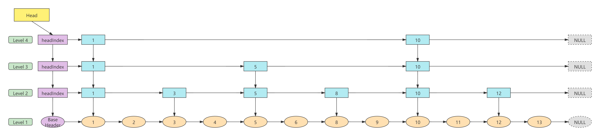
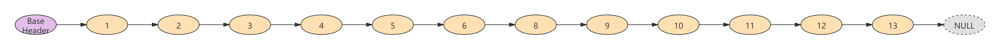
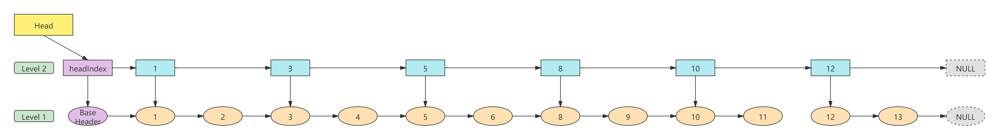

# Skiplist

增加了向前指针的链表叫做跳表。跳表全称叫做跳跃表，简称跳表。跳表是一个随机化的数据结构，**实质就是一种可以进行二分查找的有序链表**。跳表在原有的有序链表上面增加了多级索引，通过索引来实现快速查找。跳表不仅能提高搜索性能，同时也可以提高插入和删除的性能。

## 简介

跳表是一个随机化的数据结构，可以被看做二叉树的一个变种，她在性能上和红黑树，AVL数相上下，但是跳表的原理非常简单，目前在Redis和LevelDB中都有用到。

它采用随机技术决定链表中那些节点应增加前向指针以及在该节点中应增加多少个指针。跳表结构的头节点需要有足够的指针域，以满足可能构造最大级数的需要，而尾节点不需要指针域。

采用这种随机技术，跳表中的搜索、插入、删除操作的时间复杂度均为O(log n)，然而，最坏的情况下时间复杂度却变成O(n)。相比之下，在一个有序数组或链表中进行插入/删除操作的时间复杂度为O(n)，最坏的情况下也为O(n)。

## 原理

跳表的原理非常简单，跳表其实就是一种可以进行二分查找的有序链表。跳表的数据结构模型如下图所示：



跳表在原有的有序链表上面增加了多级索引。通过索引来实现快速查找。首先在最高级索引上查找最后一个小于当前查找元素的位置，然后再跳到次高级索引继续查找，以此类推，直到跳到最底层为止，这时候已经十分接近要查找的元素的位置了（如果查找的元素存在的话）。由于根据索引可以一次跳过多个元素，所以查找的速度也就变快了。

## 性质

1. 由多层索引链表组成，level是随机化产生。
2. 每一层都是一个有序链表，默认是升序。
3. 最底层（Level 1）的链表包含所有元素。
4. `i`级链中所包含的元素是`i-1`级链的子集。
5. 跳表是一个以空间换时间的算法。

## 实例

如下图所示，是一个有序的单链表，如果要查找元素9，需要从头开始迭代对比8次。很显然，这种方式效率低下，时间复杂度为O(n)，最坏的情况下也为O(n)。



那么如何提高查找效率呢？我们可以为链表建立一级索引，如下图所示：



还是查找元素9：

1. 首先将它与元素1比较，发现大于1，可以确认元素9在元素1的右区间；
2. 再次与3比较，大于3，可以确认元素9在元素3的右区间。
3. 再次与5比较，大于5，可以确认元素9在元素5的右区间。
4. 再次与8比较，大于8，可以确认元素9在元素8的右区间。
5. 再次与10比较，小于10，可以确认元素9在元素10的左区间。
6. 最后从元素8开始，在一级链（Level 1）上查找，找到元素9。

现在我们只需要对比6次，分别是1→3→5→8→10→9，由单链表的8次减少到6次。

受此启发，我们可以继续在一级索引上建立二级索引，三级索引，四级索引，如下图所示：


现在要查找元素9只需要对比7次，分别是1→10→5→10→8→10→9

流程：

1. 元素11首先与顶层链（Level 4）的1比较，大于1，继续与10比较，大于10，说明9位于1的右区间，10的左区间。
2. 元素9与第三层索引（Level 3）的5比较，大于5，继续与10比较，小于10，说明9位于5的右区间，10的左区间。
3. 元素9与第二层索引（Level 2）的8比较，大于8，继续与10比较，小于10，说明9位于8的右区间，10的左区间。
4. 元素9与第一层索引（Level 1）的9比较，等于9，元素查找成功。

> 上面的例子中：
>  - 数据量并不大，即使加了三层索引，查找效率提升也并不明显。当数据量增大时，效率将明显提升。
>  - 查找元素9是相对元素5,8来说最耗时的操作，但它的查找次数仍然小于线性查找。

## 性能分析

### 时间复杂性

当跳表中有n个元素时，搜索、插入、删除操作的复杂性均为O(n+MaxLevel)。在最坏情况下，可能只有一个MaxLevel级元素，且余下的所有元素均在0级链上。i>0时，在i级链上花费的时间为(MaxLevel)，而在0级链上花费的时间为O(n)。尽管最坏情况下的性能较差，但跳表仍不失为一种有价值的数据描述方法。其每种操作(搜索、插入、删除)的平均复杂性均为O(logn)，

### 空间复杂性

至于空间复杂性，注意到最坏情况下所有元素都可能是MaxLevel级，每个元素都需要
MaxLevel+1个指针。因此，除了存储n个元素(也就是n*sizeof(element))，还需要存储链指针（所需空间为O(n*MaxLevel)）。不过，一般情况下，只有n*p个元素在1级链上，n*p2个元素在2级链上，n*pi在i级链上。因此指针域的平均值(不包括头尾节点的指针)是n/(1-p)。因此虽然最坏情况下空间需求比较大，但平均的空间需求并不大。当p=0.5时，平均空间需求(加上n个节点中的指针)大约是2n个指针的空间。

## Java实现

**跳跃表的随机算法**

**理想的跳跃表结构是Li层的元素是个Li-1层的1/2**。因此，只需要在插入元素时，尽量保证上一层的元素个数是下一层的1/2，跳跃表就能成为理想的跳跃表。

如何做到这一点呢？抛硬币

假设要插入元素M，在L1层肯定是要插入M的，那么在L2层是否要建立索引呢，抛硬币吧，如果硬币为正面，则建立，反之则不建立，自然元素M查询也就插入完成了。如果抛出的硬币为正面，L2层建立了索引，那么L3要不要建立呢？同样的，抛硬币决定，以此类推。硬币只有正反两面，出现正面的概率为1/2。硬币抛出正面是一个随机性的事件，当样本较少时，很可能出现的不是一个理想的跳跃表，但当样本较多时，根据概率论可以得知，最终的表结构将是一个无线接近理想的跳跃表。


**完整的Java代码**

```java
import java.util.*;
import java.util.concurrent.ThreadLocalRandom;

public class SkipList<E extends Comparable<? super E>> {

    private static final int MAX_LEVEL = 32;

    private final Node<E> head = new Node<>(null, MAX_LEVEL);

    private int level = 1;

    private int size;

    public int size() {
        return size;
    }

    public boolean isEmpty() {
        return size() == 0;
    }

    public boolean contains(E e) {
        int l = level;
        Node<E> cur = head;
        for (int i = l - 1; i >= 0; i--) {
            E item = null;
            while (cur.next[i] != null && (item = cur.next[i].item).compareTo(e) < 0)
                cur = cur.next[i];
            if (item != null && item.compareTo(e) == 0)
                return true;
        }
        return false;
    }


    public Object[] toArray() {
        Object[] result = new Object[size];
        int i = 0;
        for (Node<E> x = head.next[0]; x != null; x = x.next[0])
            result[i++] = x.item;
        return result;
    }

    @SuppressWarnings("unchecked")
    public <T> T[] toArray(T[] a) {
        if (a.length < size)
            a = (T[]) java.lang.reflect.Array.newInstance(
                    a.getClass().getComponentType(), size);
        int i = 0;
        Object[] result = a;
        for (Node<E> x = head.next[0]; x != null; x = x.next[0])
            result[i++] = x.item;

        if (a.length > size)
            a[size] = null;

        return a;
    }

    public boolean add(E e) {
        int l = level;
        Node<E> cur = head;
        @SuppressWarnings("unchecked")
        Node<E>[] before = (Node<E>[]) new Node<?>[l + 1];
        for (int i = l - 1; i >= 0; i--) {
            E item = null;
            while (cur.next[i] != null && (item = cur.next[i].item).compareTo(e) < 0)
                cur = cur.next[i];
            if (item != null && item.compareTo(e) == 0)
                return false;
            before[i] = cur;
        }
        int lr = randomLevel();
        if (lr > level && lr <= MAX_LEVEL) {
            before[lr - 1] = head;
            level = lr;
        }
        Node<E> n = new Node<>(e, lr);
        for (int j = 0; j < lr; j++) {
            n.next[j] = before[j].next[j];
            before[j].next[j] = n;
        }
        size++;
        return true;
    }

    private int randomLevel() {
        int l = 1;
        for (int i = 0; i < level; i++)
            if ((ThreadLocalRandom.current().nextInt() & 1) == 0)
                l++;
            else
                break;
        return l;
    }

    public boolean remove(E e) {
        int l = level;
        Node<E> cur = head;
        boolean find = false;
        @SuppressWarnings("unchecked")
        Node<E>[] before = (Node<E>[]) new Node<?>[l];
        for (int i = l - 1; i >= 0; i--) {
            E item = null;
            while (cur.next[i] != null && (item = cur.next[i].item).compareTo(e) < 0)
                cur = cur.next[i];
            if (item != null && item.compareTo(e) == 0) {
                before[i] = cur;
                find = true;
            }
        }
        if (find) {
            for (int i = 0; i < before.length; i++) {
                if (before[i] == null)
                    break;
                before[i].next[i] = before[i].next[i].next[i];
            }
            size--;
        }
        return find;
    }

    public void clear() {
        for (Node<E> x = head; x != null; ) {
            Node<E> next = x.next[0];
            Arrays.fill(x.next, null);
            x = next;
        }
        level = 1;
        size = 0;
    }

    static final class Node<E> {

        private final E item;

        private final Node<E>[] next;

        @SuppressWarnings("unchecked")
        public Node(E item, int level) {
            this.item = item;
            this.next = (Node<E>[]) new Node<?>[level];
        }
    }

    @Override
    public String toString() {
        StringBuilder draw = new StringBuilder();
        for (int i = level - 1; i >= 0; i--) {
            StringBuilder down = new StringBuilder();
            boolean l = i > 0;
            draw.append("Head");
            if (l) down.append("  ↓ ");
            Node<E> x = head;
            while ((x = x.next[0]) != null) {
                if (x.next.length > i) {
                    draw.append("——→").append(x.item);
                    if (l) down.append("   ↓");
                } else {
                    draw.append("————");
                    if (l) down.append("    ");
                }
            }
            draw.append("\n");
            if (down.length() > 0)
                draw.append(down).append("\n");
        }
        return draw.toString();
    }

}
```

_测试Main方法：_

```java
public static void main(String[] args) {
    SkipList<Integer> list = new SkipList<>();
    list.add(8);
    list.add(5);
    list.add(4);
    list.add(6);
    list.add(2);
    list.add(3);
    list.add(10);
    list.add(1);
    list.add(9);
    list.add(7);
    System.out.println(list);
}
```
_跳表结构：_
```
Head——————————————————————→6————————————————
  ↓                        ↓                
Head——————————————→4——————→6——→7——————————→10
  ↓                ↓       ↓   ↓           ↓
Head——→1——————————→4——————→6——→7——→8——————→10
  ↓    ↓           ↓       ↓   ↓   ↓       ↓
Head——→1——→2——→3——→4——→5——→6——→7——→8——→9——→10
```

## JDK Skiplist

### ConcurrentSkipListMap

### ConcurrentSkipListSet