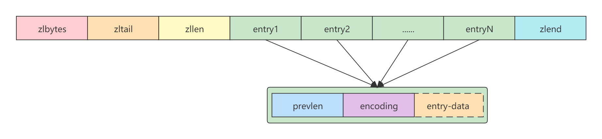
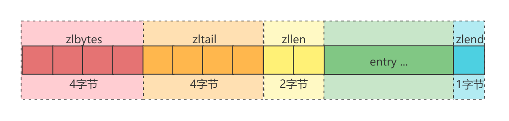
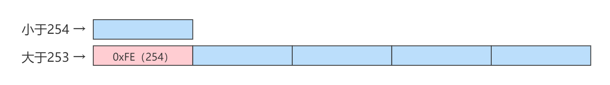
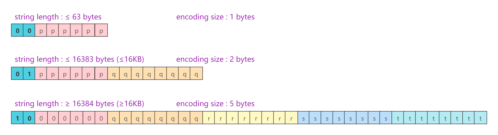
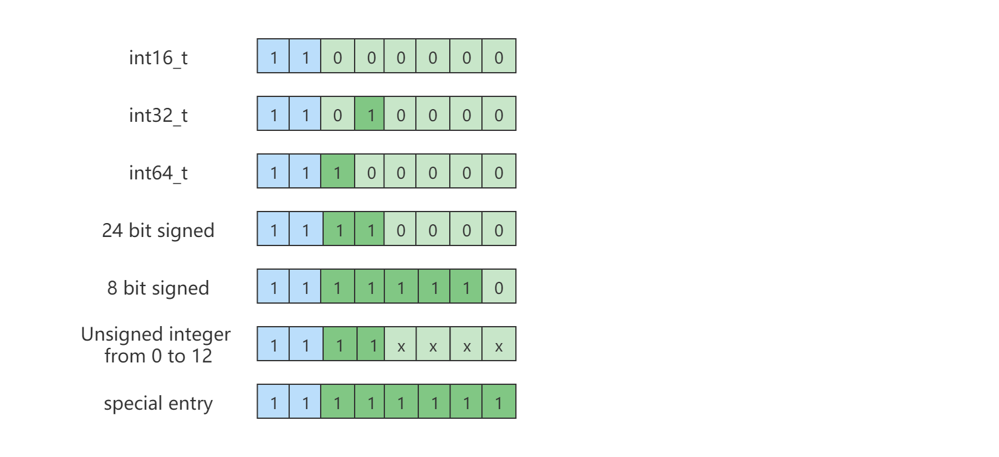

# ziplist

[TOC]

## 简介

ziplist是一种特殊编码的双链表，它的内存利用率非常高。它同时存储字符串和整数值，其中整数被编码为实际整数，而不是一系列字符。它允许在O(1)时间内在列表的任意一侧进行推入和弹出操作。但是，因为每个操作都需要重新分配ziplist所使用的内存，所以实际的复杂性与ziplist所使用的内存数量有关。

ziplist是一个以时间换空间的算法，随着空间越大，所消耗的时间也就越多，因此，为了找到时间与空间的之间的平衡，注定了ziplist不能存储大数据。


## ziplist总体布局

ziplist的总体布局如下图所示：



NOTE: 如果没有另外指定，所有字段都存储在小端序中。

- `<zlbytes>`：zlbytes是一个无符号整数，类型为`uint32_t`，占4个字节。zlbytes用于保存ziplist所占用的字节数，即当前ziplist的所占用的内存大小。包括zlbytes字段本身所占用的4个字节。通过该字段可以方便的调整ziplist的大小，而不需要首先遍历列表以得到ziplist的大小。
- `<zltail>`：zltail是一个无符号整数，类型为`uint32_t`，占4个字节。zltail用于记录列表当中最后一项的偏移量。通过该字段记录的偏移量可以快速的在ziplist末尾执行弹出操作，而不需要通过遍历列表的方式知道ziplist末尾的偏移量。
- `<zllen>`：zllen是一个无符号整数，类型为`uint16_t`，占2个字节。zllen用于记录entry的数量。当entry的数量超过$2^{16-2}$个时，zllen被设置为（$2^{16-1}$，2个字节最大只能记录2^16-1个），需要通过遍历整个列表才能知道它包含多少个entry。
- `<entry>`：ziplist的具体数据的存储结构。下一节说明。
- `<zlend>`：zlend是一个无符号整数，类型为`uint8_t`，占1个字节。zlend标识ziplist结束的特殊Entry（zlend也属于entry），被编码为等于255的单个字节，即二进制的8个位全是1（`1111 1111`）。

> uint32_t → 4bytes —— 可以认为等价于Java的`int`类型。注意，zlbytes是无符号整数，而Java的`int`类型是有符号的。
>
> uint16_t → 2bytes —— 可以认为等价于Java的`short`类型，注意，zllen是无符号整数，而Java的`short`类型是有符号的
>
> uint8_t → 1byte  —— 可以认为等价于Java的`byte`类型，注意，zlend是无符号整数，而Java的`byte`类型是有符号的

**ziplist主体字段大小**




## ziplist entries

ziplist中的每个Entry都以包含两段信息的元数据作为前缀。首先，存储的是前一个entry的长度（prevlen），用以能够从后向前遍历列表。其次，是entry的编码（encoding），它表示entry的类型——整数或字符串。如果是字符串，它还表示字符串有效负载的长度。一个完整的entry是这样存储的，如下图所示：


- prevlen：前一个Entry的长度，便于能够从后向前遍历列表。
- encoding：表示Entry的类型——整数或字符串。如果是字符串，它还标识字符串有效负载长度。

有时encoding表示Entry本身，就像我们后面会看到的小整数。在这种情况下，`<entry-data>`部分丢失了，如下所示：

```
<prevlen> <encoding>
```

### prevlen 

`<prevlen>`（前一个Entry的长度）以以下方式编码：

- 如果前一个Entry的长度小于254个字节，`<prevlen>`将消耗1个字节（无符号8位整数）记录。

- 如果前一个Entry的长度大于254个字节，`<prevlen>`将消耗5个字节记录，其中第1个字节固定设置为254(FE)，表示前一个Entry的长度大于254个字节。剩下的4个字节（无符号小端）记录前一个Entry的实际长度。

所以实际上一个Entry是以以下方式编码：

```
<prevlen from 0 to 253> <encoding> <entry>
```

或者，如果前一个Entry的长度大于254个字节，则使用以下方式编码：

```
0xFE <4 bytes unsigned little endian prevlen> <encoding> <entry>
```

如下图所示：



> 254十，十六，二进制表示：254 = FE = ‭11111110‬

### encoding

Entry的encoding字段取决于entry的内容：

- 当entry存储的是一个字符串时，encoding的第一个字节的前2位将保存用于表示存储的字符串的不同长度的编码类型，紧跟在后面的是字符串的实际长度。
- 当entry存储的是一个整数时，encoding使用1个字节表示，而前2位固定设为1，表示类型为整数。后面6位则用于表示存储的整数的不同长度的编码类型。

下面是对不同类型和编码的概述：

**entry存储的是一个字符串**

当entry存储的是一个字符串时，encoding的结构如下图所示：



1. `|00pppppp|` - 1 byte

   表示长度小于或等于63字节的字符串值。

   > "pppppp"（6位无符号）就是用于存储字符串的长度，6位二进制最大能表示十进制63。

2. `|01pppppp|qqqqqqqq|` - 2 bytes

   表示长度小于或等于16383字节的字符串值。

   > "pppppp|qqqqqqqq"（14位无符号）就是用于存储字符串的长度的位数，14位二进制最大能表示十进制16383。
   >
   > IMPORTANT：这个14位数字存储在大端。

3. `|10000000|qqqqqqqq|rrrrrrrr|ssssssss|tttttttt|` - 5 bytes

   表示大于或等于16384字节的字符串值。

   > NOTE：只有第一个字节后面的4个字节才表示字符串的长度（最大2^32-1），而第一个字节的6个低位没有被使用，被设置为零。
   >
   > IMPORTANT：这个32位数字存储在大端。

**entry存储的是一个整数**

当entry存储的是一个整数时，encoding的结构如下图所示：



1. |11000000| - 3 bytes
   编码为int16_t的整数（2bytes）。

2. |11010000| - 5 bytes
   编码为int32_t的整数（4bytes）。

3. |11100000| - 9 bytes
   编码为int64_t的整数（8bytes）。

4. |11110000| - 4 bytes

   编码为24位有符号的整数（3bytes）。

5. |11111110| - 2 bytes

   编码为18位有符号的整数（1byte）。

6. |1111xxxx| - （xxxx在0001和1101之间）紧接4位整数。

   `0001~1101`即`0~12`之间的无符号整数。因为0000和1111不能使用，所以编码的值实际上是1~13，所以需要在编码的4位值中减去1才能得到正确的值。

   > - 0000已经被“编码为24位有符号的整数”使用。
   >
   > - 1111已经被“ziplist结束的特殊条目”使用。
   >
   > - 这个encoding模式就是前面在介绍ziplist entries时所说到的encoding有时编码表示Entry本身，“xxxx”这4位就是存储的值。其小整数就是0~12之间的无符号整数。

7. |11111111| - ziplist结束的特殊条目。

<div style="color:red">NOTE：与ziplist头文件类似，所有整数都以小端字节顺序表示，即使在大端字节系统中编译此代码也是如此。</div>
## 实际的ziplist例子

下面的ziplist包含两个entry，分别表示小整数2和5。它由15个字节组成，如下所示：

```
[0f 00 00 00] [0c 00 00 00] [02 00] [00 f3] [02 f6] [ff]
      |             |          |       |       |     |
   zlbytes        zltail      zllen   "2"     "5"  zlend
```

分析：

- 前4个字节是zlbytes，数字15，即当前整个ziplist的大小占15个字节。

- 第二个4字节是zltail，数字12，即当前ziplist最后一个entry的偏移量。事实上，最有一个entry是5，在ziplist内存的偏移量为12。

- 接下来的2个字节（16位整数）是zllen，数字2，即当前ziplist中的entry数量。

- [00 f3]是ziplist内的第一个entry，其中第一个字节00是prevlen，表示前一个entry的长度，它是零。第二个字节f3是encoding，对应二进制编码1111 0011，xxxx在0001和1101之间，是一个小整数，我们需要删除"F"高阶位1111，并从"3"中减去1，因此实际值为"2"。

- [02 f6]是ziplist内的第二个entry，其中第一个字节02是prevlen，表示前一个entry的长度，它是2，因为前一个entry正好由2个字节组成。第二个字节f6是encoding，对应二进制编码1111 0110，xxxx在0001和1101之间，是一个小整数，我们需要删除“F”高阶位1111，并从“6”中减去1，因此实际值为“5”。

- 最后字节[ff]是zlend，即标识ziplist结束的特殊Entry。

**另一个例子**

在上面的ziplist中添加元素"Hello World"，用以展示ziplist是如何编码小字符串。

只展示字符串"Hello World"编码的十六进制entry（想象添加到了entry之后），编码如下：

```
[02] [0b] [48 65 6c 6c 6f 20 57 6f 72 6c 64]
```

分析：

- 第一个字节[02]是prevlen —— 前一个entry的长度。
- 第二个字节[0b]是encoding，对应的二进制编码是0000 1011，该编码的前2位是00，即[0b]是对应模式为`|00pppppp|`的编码，可知当前entry存储的元素是一个长度小于或等于63字节的字符串，后6位（00 1011）为字符串的长度11，即从第三字节(48)到最后一个字节(64)的ASCII字符。
- [48 65 6c 6c 6f 20 57 6f 72 6c 64]→11个ASCII字符："Hello World"。

## Appendix

### ziplist源码

https://github.com/redis/redis/blob/unstable/src/ziplist.c

### 大端与小端模式


### 无符号有符号


### 数据类型与Java映射

- `uint8_t`|`int8_t` → `byte`：取值范围为`-128~127`，占用1个字节（-2的7次方到2的7次方-1）

- `uint16_t`|`int16_t` → `short`：取值范围为`-32768~32767`，占用2个字节（-2的15次方到2的15次方-1）

- `uint32_t`|`int32_t` →`int`：取值范围为（`-2147483648~2147483647`），占用4个字节（-2的31次方到2的31次方-1）

- `uint64_t`|`int64_t` → `long`：取值范围为（`-9223372036854774808~9223372036854774807`），占用8个字节（-2的63次方到2的63次方-1）。

### ziplist与linkedlist对比

ziplist被称为是一种特殊编码的双链表，但它与linkedlist（双端链表）有什么差异呢？

ziplist与linkedlist组织方式上大体类似，都是一个元素接一个元素。但ziplist在存储数据时没有使用指针，而是以连续内存空间来表示双向链表。而linkedlist中的每个节点都有3个指针——前向指针，后向指针，数据指针。在64位操作系统中，每个指针要占用8个字节的内存，对于小对象的列表来说，非常占用空间，并且效率相对低下。因此与linkedlist相比，ziplist使用内存紧凑的结构（可以类比数组），因此可以极大的节省内存。

ziplist是CPU和内存妥协的产物，ziplist有效的节省了内存，但会比linkedlist消耗更多的CPU资源，因为ziplist插入和删除元素需要重新分配内存。所以ziplist适用于小对象。

ziplist对于值的存储采用了变长的编码方法。对于比较大的值就用较多的字节存储，对于小的值就用较少的字节的存储。