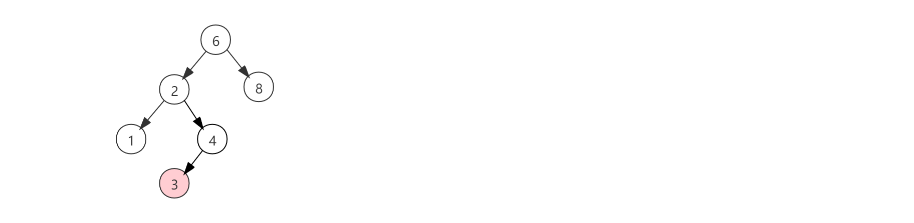
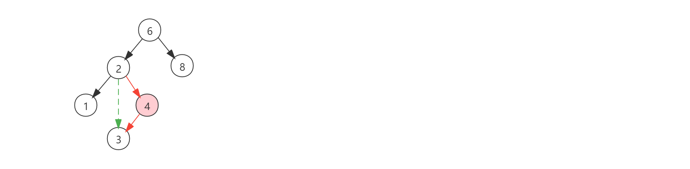
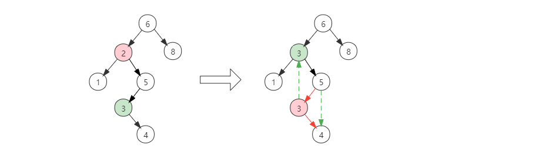

# 二叉查找树

[TOC]

二叉查找树（Binary Search Tree），又称二叉排序树（Binary Sort Tree），亦称二叉搜索树。是数据结构中的一类。在一般情况下，查询效率比链表结构要高。

## 定义

对于树中的每个节点X，它的左子树中所有的节点的值都小于（或小于等于）X中的值，它的右子树中所有的节点的值都大于（或大于等于）X中的值。

## 查找

查找操作是递归操作，首先查找关键字与根节点关键字进行比较：

- 如果小于根节点关键字，则递归左子树进行查找。
- 如果大于根节点关键字，则递归右子树进行查找。
- 如果相等，则查找成功。
- 如果递归到叶子节点，都没有找到，则查找失败。

代码实现

```java
private V get(Node<K, V> node, K key) {
    if (node == null)
        return null;
    int compareResult = node.key.compareTo(key);
    if (compareResult > 0)
        return get(node.left, key);
    if (compareResult < 0)
        return get(node.right, key);
    return node.val;
}
```

## 插入

首先指向查找操作，如果存在相等的元素，则插入失败。反之则插入到最底部的叶子节点上。

代码实现

```java
private Node<K, V> insert(Node<K, V> node, K key, V val) {
    if (node == null) {
        size++;
        return new Node<>(key, val);
    }
    int compareResult = node.key.compareTo(key);
    if (compareResult > 0)
        node.left = insert(node.left, key, val);
    else if (compareResult < 0)
        node.right = insert(node.right, key, val);
    return node;
}
```

## 删除

要删除一个节点相对查找和插入要复杂一些。具体需要分为三种情况：

1. 被删除的节点位于叶子节点。
2. 被删除的节点位于非叶子节点，且只有一个孩子。
3. 被删除的节点位于非叶子节点，且有两个孩子。

对于第一情况，被删除的节点位于叶子节点，那么直接将节点删除即可。



而第二种情况，被删除的节点位于非叶子节点，且只有一个孩子，也不是很复杂，只需要删除被删除的节点本身，并将父节点链接到子节点即可。如下图所示：



一般的删除策略是用其右子树的最小数据代替该节点的数据并递归的删除那个节点（现在它是空的）。因为右子树的最小节点不可能有左儿子，所以第二次remove要容易。




代码实现

```java
private Node<K, V> remove(Node<K, V> node, K key) {
    if (node == null)
        return null;
    int compareResult = node.key.compareTo(key);
    if (compareResult > 0)
        node.left = remove(node.left, key);
    else if (compareResult < 0)
        node.right = remove(node.right, key);
    else {
        if (node.left != null && node.right != null) {
                Node<K, V> minNode = findMin(node.right);
                node.key = minNode.key;
                node.val = minNode.val;
                node.right = remove(node.right, minNode.key);
        } else {
            node = node.left == null ? node.right : node.left;
            size--;
        }
    }
    return node;
}
```

当被删除节点存在两个儿子时，上述代码的删除操作是低效的。因为它需要进行两次查找和删除右子树最小的节点。通过一个特殊的`removeMin`方法就可以优化，代码如下：

```java
/**
 * 删除最小的节点，并将最小节点的数据赋给container。
 *
 * @param node      起始节点。
 * @param container 装载最小节点数据的容器。
 */
private Node<K, V> removeMin(Node<K, V> node, Node<K, V> container) {
    if (node.left == null) {
        container.key = node.key;
        container.val = node.val;
        size--;
        return node.right;
    } else {
        node.left = removeMin(node.left, container);
    }
    return node;
}
```

## 状态分析

由于总是用右子树的一个节点来代替被删除的节点，这将有助于使左子树比右子树深度深。一种解决办法就是在删除操作中，通过随机选取右子树的最小元素或左子树的最大元素来代替被删除的元素来消除这种不平衡。但是这样的方式也不是完全绝对的，只是在一定程度上相比于总是以左子树或右子树的某一个节点来代替被删除的节点而言，不平衡的概率更低一些。

在极端情况下，如果我们向一棵树插入已经预先排好序的数据，树将会退化成线性表。如下图所示：


在这种情况下，其时间复杂度就是O(N)。因此，一棵普通的二叉树的时间复杂度是O(log N)~O(N)。一种解决办法就是为其施加一个“平衡”条件，使其树的高度尽可能最低。

**存在以下平衡树：**

- [AVL树](https://baike.baidu.com/item/AVL树)
- [红黑树](https://baike.baidu.com/item/红黑树)
- [Treap](https://baike.baidu.com/item/Treap)(Tree+Heap)

这些均可以使查找树的高度为O(log(n))。

**放弃了平衡条件的策略：**

- [伸展树](https://baike.baidu.com/item/%E4%BC%B8%E5%B1%95%E6%A0%91)

伸展树放弃了平衡条件，允许树有任意的深度，但是在每次操作之后要使用一个调整规则进行调整，使得后面的操作效率要高。

## 代码实现

### Java

```java
public class BinarySearchTree<K extends Comparable<K>, V> {

    private Node<K, V> root;

    private int size;

    public int getSize() {
        return size;
    }

    public void makeEmpty() {
        size = 0;
        root = null;
    }

    public boolean isEmpty() {
        return root == null;
    }

    public boolean contains(K key) {
        return contains(root, key);
    }

    public V findMin() {
        if (isEmpty())
            throw new RuntimeException("");
        Node<K, V> minNode = findMin(root);
        return minNode == null ? null : minNode.val;
    }

    public V findMax() {
        if (isEmpty())
            throw new RuntimeException("");
        Node<K, V> maxNode = findMax(root);
        return maxNode == null ? null : maxNode.val;
    }

    public V get(K key) {
        return get(root, key);
    }

    public void insert(K key, V val) {
        root = insert(root, key, val);
    }

    public void remove(K key) {
        root = remove(root, key);
    }

    private boolean contains(Node<K, V> node, K key) {
        if (node == null)
            return false;
        int compareResult = node.key.compareTo(key);
        if (compareResult > 0)
            return contains(node.left, key);
        if (compareResult < 0)
            return contains(node.right, key);
        return true;
    }

    private Node<K, V> findMin(Node<K, V> node) {
        return node == null || node.left == null ? node : findMin(node.left);
    }

    private Node<K, V> findMax(Node<K, V> node) {
        return node == null || node.right == null ? node : findMin(node.right);
    }

    private V get(Node<K, V> node, K key) {
        if (node == null)
            return null;
        int compareResult = node.key.compareTo(key);
        if (compareResult > 0)
            return get(node.left, key);
        if (compareResult < 0)
            return get(node.right, key);
        return node.val;
    }

    private Node<K, V> insert(Node<K, V> node, K key, V val) {
        if (node == null) {
            size++;
            return new Node<>(key, val);
        }
        int compareResult = node.key.compareTo(key);
        if (compareResult > 0)
            node.left = insert(node.left, key, val);
        else if (compareResult < 0)
            node.right = insert(node.right, key, val);
        return node;
    }

    private Node<K, V> remove(Node<K, V> node, K key) {
        if (node == null)
            return null;
        int compareResult = node.key.compareTo(key);
        if (compareResult > 0)
            node.left = remove(node.left, key);
        else if (compareResult < 0)
            node.right = remove(node.right, key);
        else {
            if (node.left != null && node.right != null) {
                node.right = removeMin(node.right, node);
            } else {
                node = node.left == null ? node.right : node.left;
                size--;
            }
        }
        return node;
    }

    /**
     * 删除最小的节点，并将最小节点的数据赋给container。
     *
     * @param node      起始节点。
     * @param container 装载最小节点数据的容器。
     */
    private Node<K, V> removeMin(Node<K, V> node, Node<K, V> container) {
        if (node.left == null) {
            container.key = node.key;
            container.val = node.val;
            size--;
            return node.right;
        } else {
            node.left = removeMin(node.left, container);
        }
        return node;
    }

    static class Node<K, V> {

        private K key;

        private V val;

        private Node<K, V> left;

        private Node<K, V> right;

        public Node(K key, V val) {
            this.key = key;
            this.val = val;
        }
    }
}
```

