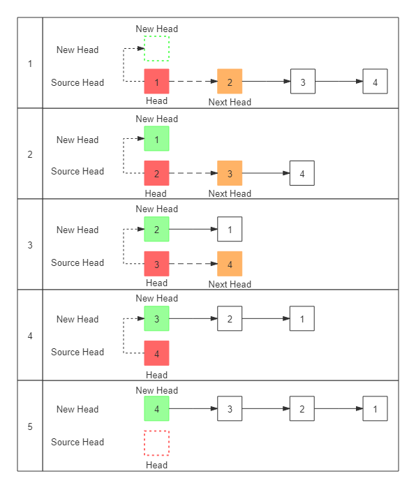
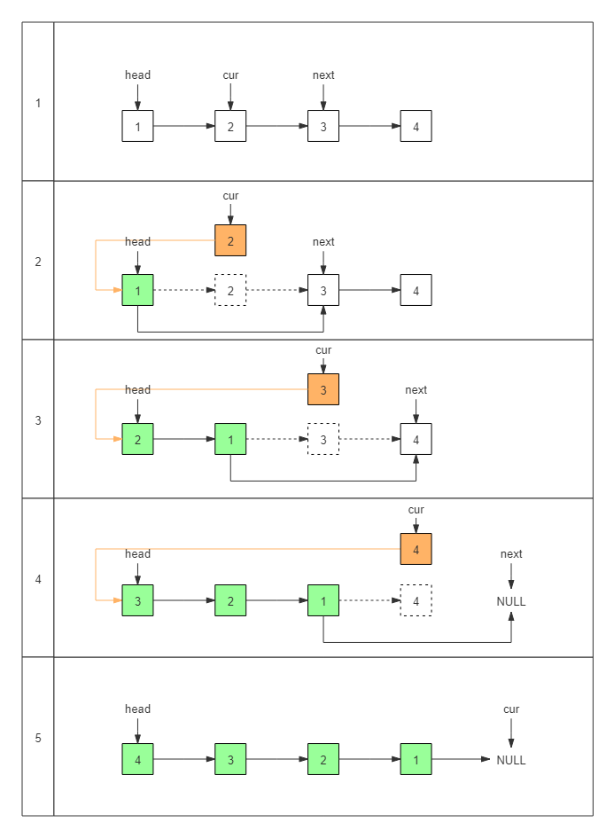
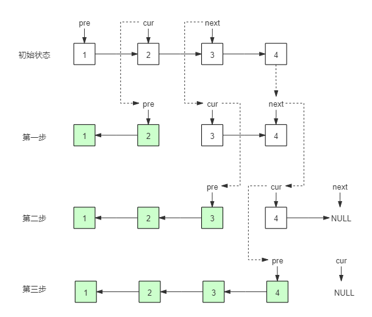
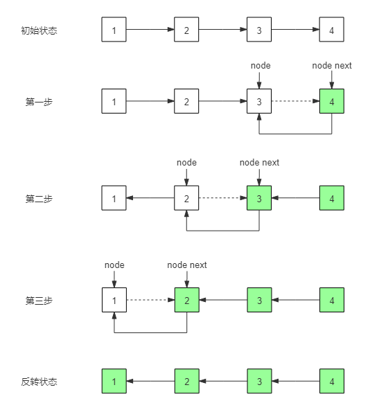

# 链表反转

创建一个Node对象

```java
private static class Node<E> {
    E item;
    Node<E> next;

    Node(E item, Node<E> next) {
        this.item = item;
        this.next = next;
    }
}
```

## 1、头插反转法

头插反转法是将头部节点摘下，然后采用从头部插入的方式生成一个新的链表。

如下图所示：



对于头插反转法的实现，首先需要声明两个指向：`new head`和`head，new head`代表新链表的头节点，`head`代表原链表摘取之后的头结点。依次摘取原链表头结点，插入到新链表的头结点之前，如上图所示。此时原链表头结点变为了新链表的头结点，而原链表头结点的下一个节点变为了新的原链表头结点。直到原链表头结点为`NULL`，结束反转。

代码如下：

```java
/**
  * 头插反转法
  * <pre>
  * SRC : 1 -> 2 -> 3 -> 4
  * NEW : NULL
  *
  * SRC : 2 -> 3 -> 4
  * NEW : 1 -> NULL
  *
  * SRC : 3 -> 4
  * NEW : 2 -> 1 -> NULL
  *
  * SRC : 4
  * NEW : 3 -> 2 -> 1 -> NULL
  *
  * SRC : NULL
  * NEW : 4 -> 3 -> 2 -> 1 -> NULL
  * </pre>
  */
public static <E> Node<E> headReverse(Node<E> node){
    Node<E> newHead = null;
    Node<E> head = node;
    while (head != null) {
        Node<E> next = head.next;
        head.next = newHead;
        newHead = head;
        head = next;
    }
    return newHead;
}
```

## 2、就地反转法

就地反转法与头插反转法的思想类似，唯一的区别在于，头插法是通过建立一个新链表实现的，而就地反转法则是直接对原链表做修改，从而实现将原链表反转。

如下图所示：



就地反转法的实现：首先需要声明三个指向，head，cur和next，head是整个链表头结点，cur指向的是要摘取的节点，使cur节点的下一个节点指向head即完成了反转，但是cur节点就断开了与原下一个节点的连接，因此在每次反转时需要先将cur的下一个节点保存起来，而next就是用于指向它。

首先开始时需要head将指向头节点，cur将指向头节点的下一个节点，但第一次完成反转之后，cur节点变为了新的head节点，cur的next节点变为了新的cur节点，依次类推，完成反转。

当cur等于NULL时，反转结束。

代码实现：

```java
/**
  * 就地反转法
  * <pre>
  * 1 -> 2 -> 3 -> 4
  * 2 -> 1 -> 3 -> 4
  * 3 -> 2 -> 1 -> 4
  * 4 -> 3 -> 2 -> 1
  * </pre>
  */
public static <E> Node<E> localReverse(Node<E> node){
    Node<E> head = node;
    Node<E> cur = node.next;
    while (cur != null) {
        node.next = cur.next;
        cur.next = head;
        head = cur;
        cur = node.next;
    }
    return head;
}
```

## 3、迭代反转法

迭代反转法是从头开始一个接一个的反转。

如下图所示：




迭代反转法的思路是从头开始一个接一个的反转。首先需要声明两个指向：`pre`和`cur`，反转的操作就是本身是`pre`指向`cur`的，现在就使`cur`指向`pre`，但因为是从头开始，当将`cur`指向`pre`时，`cur`会断开对下一个节点`next`的指向，如上图<第一步>所示，当2指向1的时候，2断开了对3的指向。因此，在每次反转之前都需要先获取`cur`的下一个节点`next`。

反转操作完成之后，下一步就是`pre`和`cur`后移，如上图所示，就是将原`cur`变为`pre`，`next`变为`cur`。以此类推，当`cur`等于`NULL`时，反转结束。

代码实现：

```java
/**
  * 迭代反转法
  * <pre>
  * 1 -> 2 -> 3 -> 4
  * 1 <- 2 -> 3 -> 4
  * 1 <- 2 <- 3 -> 4
  * 1 <- 2 <- 3 <- 4
  * </pre>
  */
public static <E> Node<E> iterationReverse(Node<E> node){
    Node<E> pre = node;
    Node<E> cur = node.next;
    while (cur != null) {
        Node<E> next = cur.next;
        cur.next = pre;
        pre = cur;
        cur = next;
    }
    node.next = null;
    return pre;
}
```

## 4、递归反转法

递归反转法与迭代反转法的实现不同，但是它们的思路是大同小异的。如果说迭代反转法是从头开始一个接一个的反转，那么递归反转法就是从尾开始一个接一个的反转。

如下图所示：



递归反转法的思路就是在每一次递归中将当前节点和下一个节点进行反转，一直到最后两个节点为止。当然，需要注意的是，反转需要从后向前开始（如果从前开始，就会断开对后续节点的引用，例如如果先反转1和2，那么就不能通过2找到3了）。递归的结束条件自然是当下一个节点不存在时就可以返回了，此时这个节点就是反转之后链表的头节点。

代码实现：

```java
/**
  * 递归反转法
  * <pre>
  * 1 -> 2 -> 3 -> 4
  * 1 -> 2 -> 3 <- 4
  * 1 -> 2 <- 3 <- 4
  * 1 <- 2 <- 3 <- 4
  * </pre>
  */
public static <E> Node<E> recursiveReverse(Node<E> node){
    if (node == null || node.next == null) {
        return node;
    }
    Node<E> result = recursiveReverse(node.next);
    node.next.next = node;
    node.next = null;
    return result;
}
```


```java
import java.util.*;

/**
 * <p>单链表</p>
 *
 * @author xlp
 */
public class SingleLinkedList<E> extends AbstractSequentialList<E> implements List<E> {

    transient int size;

    transient Node<E> first;

    transient Node<E> last;

    private void linkLast(E e) {
        Node<E> l = this.last;
        Node<E> newNode = new Node<>(e, null);
        this.last = newNode;
        if (l == null)
            this.first = newNode;
        else
            l.next = newNode;
        ++this.size;
    }

    @Override
    public boolean add(E e) {
        this.linkLast(e);
        return true;
    }

    public void reverse() {
        Node<E> head = this.first;
        Node<E> cur = head.next;
        while (cur != null) {
            Node<E> next = cur.next;
            cur.next = head;
            head = cur;
            cur = next;
        }
        (this.last = this.first).next = null;
        this.first = head;
    }


    private static class Node<E> {

        E item;

        Node<E> next;

        public Node(E item, Node<E> next) {
            this.item = item;
            this.next = next;
        }
    }

    @Override
    public int size() {
        return this.size;
    }


    Node<E> node(int index) {

        return null;
    }

    @Override
    public ListIterator<E> listIterator(int index) {
        return new ListItr(index);
    }

    private class ListItr implements ListIterator<E> {

        private Node<E> lastReturned;

        private Node<E> next;

        private int nextIndex;

        ListItr(int index){
            this.next = SingleLinkedList.this.first;
            this.nextIndex = index;
        }

        @Override
        public boolean hasNext() {
            return nextIndex < size();
        }

        @Override
        public E next() {
            if (!hasNext())
                throw new NoSuchElementException();
            else {
                this.lastReturned = this.next;
                this.next = this.next.next;
                ++this.nextIndex;
                return this.lastReturned.item;
            }
        }

        @Override
        public boolean hasPrevious() {
            return false;
        }

        @Override
        public E previous() {
            return null;
        }

        @Override
        public int nextIndex() {
            return 0;
        }

        @Override
        public int previousIndex() {
            return 0;
        }

        @Override
        public void remove() {

        }

        @Override
        public void set(E e) {

        }

        @Override
        public void add(E e) {

        }
    }
}

```

