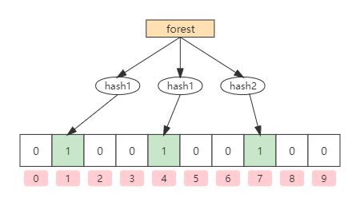
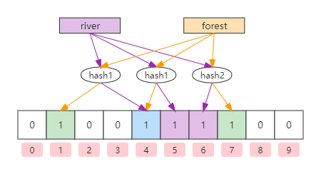

# 布隆过滤器

[TOC]

## 算法简介

布隆过滤器（Bloom Filter）是1970年由伯顿·布隆（Burton Bloom）提出的。它实际上是一个很长的二进制位向量和一系列随机映射函数。布隆过滤器可以用于检索一个元素是否在一个集合当中。它的优点是空间效率和查询时间都比一般的算法要好的多，而缺点是有一定的误识别率和删除困难。

> 在日常生活中，包括设计计算机软件时，经常要判断一个元素是否在一个集合中。比如，在字处理软件中，需要检查一个英语单词是否拼写正确（也就是要判断它是否在已知的字典中）；在FBI，一个嫌疑人的名字是否已经在嫌疑名单上；在网络爬虫里，一个网址是否已经访问过，等等。最直接的方法就是将集合中的全部的元素存储在计算机中，遇到一个新元素时，将它和集合中的元素直接比较即可。一般来讲，计算机中的集合是用哈希表（Hash Table）来存储的。它的好处是快速准确，缺点是耗费存储空间。当集合比较小时，这个问题不明显，当集合规模巨大时，哈希表存储效率低的问题就显现出来了。比如，一个像Yahoo、Hotmail和Gmail那样的公众电子邮件（Email）提供商，总是需要过滤来自发送垃圾邮件的（Spamer）的垃圾邮箱。采用的一个办法就是记录下那些发垃圾邮件的Email地址。由于那些发送者不停的在注册新的地址，全世界少说也有几十亿个发垃圾邮件的地址，将这些地址都存起来，需要大量的网络服务器。如果用哈希表，每存储一亿个Email地址，就需要1.6GB的内存（用哈希表实现的具体办法是将每一个Email地址对应成一个8字节的信息指纹，然后将这些信息指纹存入哈希表，由于哈希表的存储效率一般只有50%，因此一个Email地址需要占用16个字节。一亿个地址大约要1.6GB，即16亿字节的内存）。因此，存储几十亿个邮件地址可能需要上百GB的内存。除非是超级计算机，不然一般的服务是无法存储的。
>
> —— 引用自《数学之美》布隆过滤器

## 算法原理

如果想要判断一个元素是不是在一个集合里，一般想到的方式就是将所有元素存储起来，然后通过比较确定。链表，树，散列表等数据结构都是这种思路，但是随着集合中元素数量的增加，所需要的存储空间也越来越大。

布隆过滤器通过长度为m的二进制位向量和k个哈希函数实现。当添加一个元素时，将该元素通过k个哈希函数各自进行运算，并将结果映射到二进制位向量中，即将其对应的索引位置为1。如下图所示：



同理，查询的时候也要将该元素通过k个哈希函数各自进行运算，存在与否就是判断对应的位置是否都为1。如果对应的位置有一个为0，说明没有任何一个元素映射到该位置上，那就意味着该元素一定不存在。因此，**查询某个元素，如果对应的位置只要有一个为0，则该元素一定不存在**。但是，如果对应的位置都为1，也并不代表该元素一定存在。如上图所示，查询元素“forest”时，其三个哈希函数必然返回[1,4,7]，在位向量数组中，其对应的bit位都为1，但这并不代表元素“forest”就一定存在，因为可能有其他的元素经三个哈希函数计算之后也返回[1,4,7]，或者[1,4,7]三个索引位被其他多个元素各将一部分置为1（哈希冲突）。因此，**查询某个元素，如果对应的位置都为1，则该元素可能存在**。

**元素删除**

标准的Bloom Filter不能删除元素。如下图所示，如果要删除元素river，则需要将[4,5,6]置为0。由于元素forest是存在的，其[1,4,7]为1，但是在查询时，却发现[4]为0，认为元素forest不存在，显然，产生了误判。



> 布隆过滤器的变种*计数布隆过滤器*（Counting Bloom Filter）支持元素的删除，具体将在后面介绍。

**选择合适的哈希函数个数和布隆过滤器长度**

哈希函数个数和布隆过滤器长度对其至关重要。显然，如果布隆过滤器过小，那么很快所有的bit位都会被置为1，此时查询任何值都会返回“可能存在”。而哈希函数的个数也需要仔细权衡，如果哈希函数个数过多，那么bit位被置为1的速度也就越快，且操作的效率也越低。如果过少，那么哈希冲突的概率也就越高，即误差率也就越高。


设k为哈希函数的个数，m为布隆过滤器的长度。那么如何选择合适的k和m的值呢。下面直接给出一个结论公式，具体的数学推导过程请参考[Bloom Filters - the math](https://pages.cs.wisc.edu/~cao/papers/summary-cache/node8.html)。

$$
m = \frac{nlnp}{(ln2)^2} \\
k=\frac{m}{n} ln 2
$$

## 算法实现

```java
public class BloomFilter {

    /* 位向量长度：256 << 22 = 1,073,741,824 = 128MB */
    private static final int DEFAULT_BIT_SIZE = 256 << 22;

    /* 为了降低错误率，使用加法hash算法，所以定义一个8个元素的质数数组 */
    private static final int[] seeds = {3, 5, 7, 11, 13, 31, 37, 61};

    /* 哈希函数 */
    private final HashFunction[] hashFunctions;

    /* 初始化布隆过滤器的BitSet */
    private final BitSet bitSet = new BitSet(DEFAULT_BIT_SIZE);

    /**
     * 初始化所有哈希函数
     */
    public BloomFilter() {
        this.hashFunctions = new HashFunction[seeds.length];
        for (int i = 0; i < this.hashFunctions.length; i++) {
            this.hashFunctions[i] = new HashFunction(DEFAULT_BIT_SIZE, seeds[i]);
        }
    }

    public void add(Object e) {
        if (e == null) return;
        if (contain(e)) return;
        for (HashFunction hashFunction : hashFunctions)
            bitSet.set(hashFunction.hash(e), true);
    }

    public boolean contain(Object e) {
        if (e == null) return false;
        for (HashFunction hashFunction : hashFunctions) {
            if (!bitSet.get(hashFunction.hash(e)))
                return false;
        }
        return true;
    }

    static class HashFunction {

        private final int size;
        private final int seed;

        public HashFunction(int size, int seed) {
            this.size = size;
            this.seed = seed;
        }

        public int hash(Object value) {
            int result = 0;
            int len = (value + "").length();
            for (int i = 0; i < len; i++) {
                result = seed * result + (value + "").charAt(i);
            }
            return (size - 1) & result;
        }
    }
}
```

## 算法分析

### 优点

相比于其他的数据结构，布隆过滤器在空间和时间方面都有巨大的优势。

- 布隆过滤器存储空间和插入/查询的时间复杂度都是O(1)。
- Hash函数相互之间没有关系，方便由硬件并行实现。
- 布隆过滤器不需要存储元素本身，在某些对保密要求非常严格的场合有优势。

### 缺点

布隆过滤器的缺点和优点一样明显：

- 存在误差率：随着存入元素数量的增加，误差率也会随之增加。常见的补救办法是建立一个小的白名单，存储那些可能被误判的元素。但是如果元素数量太少，则使用散列表足矣。
- 不能删除元素：布隆过滤器的变种*计数布隆过滤器*（Counting Bloom Filter）支持元素的删除。

### 应用

网页URL的去重，垃圾邮件的判别，集合重复元素的判别，查询加速（比如基于key-value的存储系统）、数据库防止查询击穿， 使用Bloom Filter来减少不存在的行或列的磁盘查找。

解决缓存穿透：将所有的数据放到Bloom Filter中，查询时过滤一定不存在的key。对于可能存在的key，则先查缓存，没有查到再查数据库。

## 扩展

### Counting Bloom Filter

Counting Bloom Filter是对标准Bloom Filter的变种，解决了标准Bloom Filter不能删除的问题。 它将标准Bloom Filter位向量的每一位扩展为一个小的计数器（Counter），在插入元素时给对应的k（k为哈希函数的个数）个Counter的值分别加1，删除元素时给对应的k个Counter的值分别减1。做到这一点是以通过使用标准Bloom Filter数倍的内存空间为代价，给Bloom Filter增加了删除操作。

Counting Bloom Filter与标准Bloom Filter的主要区别就在于标准Bloom Filter位向量的每一位是一个比特位，其只能表示0或1两个状态，即存在或不存在。而Counting Bloom Filter位向量的每一位是使用二个及以上的比特位，根据位数的不同，其所能计数的数量也不同。

如下图所示(2个bit构建的Counting Bloom Filter)：


理论上，Counting Bloom Filter数组的每一位所使用的比特位越多越好，因为Counter越大所能表示的信息也就越多。但越大的Counter意味着需要更多的空间资源，而且很多时候会造成空间浪费。因此，在设定Counter的时候，以Counter的取值范围有多小可以满足需求为准。

Counting Bloom Filter看起来很完美，唯一的问题就是需要额外付出一定的内存空间消耗。如果要删除一个不存在的元素（至少有一个Counter等于0），那么自然不允许删除（不为0的Counter减1）。但是，如果删除一个可能存在，但实际不存在的元素呢。这就产生了与标准Bloom Filter不允许删除的原因一样的问题，这看起来Counting Bloom Filter就没有意义了，当然，如果删除的元素一定存在哪就没有问题。因此在使用Counting Bloom Filter进行元素的删除时，需要保证被删除的元素一定存在，即**程序逻辑的实现需要保证从Counting Bloom Filter中删除的元素一定存在**。

**其他Bloom Filter的升级版：**

- `Spectral Bloom Filter`：在Counting Bloom Filter的基础上提出了元素出现频率查询的概念，将Counting Bloom Filter的应用扩展到了multi-set领域。
- `Dynamic Count Filter`：解决Spectral Bloom Filter由于引入复杂索引结构导致Counter访问变得复杂耗时的问题。
- `d-Left Counting Bloom Filter`：利用d-Left hashing的方法存储指纹，解决哈希表负载均衡的问题。
- `Accurate Counting Bloom Filter`：通过offse indexing的方式将Counter数组划分成多个层级，来降低误判率。

参考资料：https://blog.csdn.net/zhaoyunxiang721/article/details/41123007

## 开源实现

### Guava BloomFilter

#### BloomFilter

`com.google.common.hash.BloomFilter`是Google Guava提供的对布隆过滤器的实现。`BloomFilter`提供了对外访问的操作接口，其主要的核心逻辑都交由`com.google.common.hash.BloomFilter.Strategy`的实现类`com.google.common.hash.BloomFilterStrategies`去完成。

源码如下：

```java
@Beta
public final class BloomFilter<T> implements Predicate<T>, Serializable {
    
   ......
    
    /** 底层的bit数组。 */
    private final LockFreeBitArray bits;

    /** 哈希函数的个数。 */
    private final int numHashFunctions;

    /** 将添加的元素T转换成字节的漏斗(funnel)。 */
    private final Funnel<? super T> funnel;

    /** 将元素映射到bit数组上的策略。 */
    private final Strategy strategy;
 
    ......
}
```

`BloomFilter`包含四个不可变的成员变量，分别是：

- `LockFreeBitArray bits`: 底层的bit数组。
- `int numHashFunctions`: 哈希函数的个数。
- `Funnel<? super T> funnel`: 将添加的元素T转换成字节的漏斗(`funnel`)。
- `Strategy strategy`: 将元素映射到bit数组上的策略。

`BloomFilter`提供了`put()`和`mightContain()`函数用于添加和判断可能包含指定的元素的方法，这两个函数的具体实现都是交由`strategy`完成。

`BloomFilter`的构造函数是私有的，它提供了四个静态的`create()`方法来完成`BloomFilter`实例的创建。

**BloomFilter API：**

- `BloomFilter<T> copy()`: 创建一个新的`BloomFilter`，它是这个实例的副本。新实例与当前实例相等，但没有共享可变状态。

- `boolean mightContain(T object)`: 如果该元素可以被放入这个Bloom过滤器中，则返回true，如果绝不能（已经误判），则返回false。

- `boolean put(T object)`: 将一个元素添加到`BloomFilter`中。确保后续调用相同元素的`mightContain(Object)`方法时总是返回true。

- `double expectedFpp()`: 返回可能包含(Object)将错误地为一个对象返回true的概率，该对象实际上没有被放入`BloomFilter`。

  理想情况下，这个数字应该接近在create(漏斗，int, double)中传递的fpp参数，或更小。如果它显著地高，通常是有太多的元素(比预期的要多)被放入了BloomFilter中，从而使它退化。

- `long approximateElementCount()`: 返回已添加到此Bloom筛选器的不同元素总数的估计值。如果不超过在构造过滤器时使用的expectedInsertions的值，这种近似是相当准确的。

- `boolean isCompatible(BloomFilter<T> that)`: 确定给定的Bloom过滤器是否与此Bloom过滤器兼容。两个Bloom过滤器要兼容，它们必须:

  - 不是同一实例

  - 有相同数量的哈希函数

  - 有相同的位大小

  - 采用相同的策略

  - 有平等的漏斗

- `void putAll(BloomFilter<T> that)`: 通过对底层数据执行按位或，将此Bloom过滤器与另一个Bloom过滤器组合在一起。突变发生在这个例子中。调用方必须确保Bloom过滤器的大小是适当的，以避免使其饱和。

- `static <T> Collector<T, ?, BloomFilter<T>> toBloomFilter(Funnel<? super T> funnel, long expectedInsertions)`: 返回一个期望插入指定数量的收集器，并产生一个假阳性概率为3%的BloomFilter。

  请注意，如果收集器接收到的元素明显多于指定的元素，那么产生的BloomFilter的假阳性概率将急剧下降。

  如果提供的漏斗是，构造的BloomFilter将是可序列化的。

  建议将漏斗实现为Java enum。这样做的好处是确保正确的序列化和反序列化，这很重要，因为equals也依赖于漏斗的对象标识。

- `static <T> Collector<T, ?, BloomFilter<T>> toBloomFilter(Funnel<? super T> funnel, long expectedInsertions, double fpp)`: 返回一个期待指定插入数的收集器，并产生一个具有指定期望的假阳性概率的BloomFilter。

  请注意，如果收集器接收到的元素明显多于指定的元素，那么产生的BloomFilter的假阳性概率将急剧下降。

  如果提供的漏斗是，构造的BloomFilter将是可序列化的。

  建议将漏斗实现为Java enum。这样做的好处是确保正确的序列化和反序列化，这很重要，因为equals也依赖于漏斗的对象标识。

- `static <T> BloomFilter<T> create(Funnel<? super T> funnel, int expectedInsertions, double fpp)`: 使用预期的插入数和预期的误报概率创建一个BloomFilter。

  请注意，使用比指定的元素多得多的元素溢出BloomFilter，将导致其饱和，并急剧恶化其假阳性概率。

  如果提供的漏斗是，构造的BloomFilter将是可序列化的。

  建议将漏斗实现为Java enum。这样做的好处是确保正确的序列化和反序列化，这很重要，因为equals也依赖于漏斗的对象标识。

- `static <T> BloomFilter<T> create(Funnel<? super T> funnel, long expectedInsertions, double fpp)`: 

- `static <T> BloomFilter<T> create(Funnel<? super T> funnel, int expectedInsertions)`: 

- `static <T> BloomFilter<T> create(Funnel<? super T> funnel, long expectedInsertions)`：

- `void writeTo(OutputStream out)`: 将这个BloomFilter写入输出流，使用自定义格式(不是Java序列化)。与常规序列化相比，这可以节省至少400个字节。

- `static <T> BloomFilter<T> readFrom(InputStream in, Funnel<? super T> funnel)`：读取由writeTo(OutputStream)写入的字节流到BloomFilter中。

  要使用的漏斗不在流中编码，所以必须在这里提供。警告:所提供的漏斗必须与用于填充原始Bloom过滤器的漏斗行为相同!

#### Strategy

内部接口`com.google.common.hash.BloomFilter.Strategy`定义了将元素映射到bit数组上操作策略的行为。

源码如下：

```java
@Beta
public final class BloomFilter<T> implements Predicate<T>, Serializable {

    interface Strategy extends java.io.Serializable {

        <T> boolean put(T object, Funnel<? super T> funnel, int numHashFunctions, LockFreeBitArray bits);

        <T> boolean mightContain(T object, Funnel<? super T> funnel, int numHashFunctions, LockFreeBitArray bits);

        int ordinal();
    }

    ......
}
```

Strategy包含三个抽象函数：

- `put`: 向布隆过滤器添加元素。
- `mightContain`: 判断执行元素是否可能存在。
- `ordinal`: 

在Google Guava中，内部接口`Strategy`只有一个实现，即`com.google.common.hash.BloomFilterStrategies`。`BloomFilterStrategies`是一个枚举，包含两个枚举常量。这两个枚举常量分别实现了`Strategy`接口。

这两个枚举常量分别是`MURMUR128_MITZ_32`和`MURMUR128_MITZ_64`，代表着两种策略。两者使用的都是`MurmurHash3`算法，且添加和获取元素的计算方式都是完全一致，主要的区别在于两者使用的hash值位数不同，`MURMUR128_MITZ_32`使用了64位，`MURMUR128_MITZ_64`使用了全部的128位。

##### MURMUR128_MITZ_32

```java
MURMUR128_MITZ_32() {
    @Override
    public <T> boolean put(
        T object, Funnel<? super T> funnel, int numHashFunctions, LockFreeBitArray bits) {
        // bit数组的大小
        long bitSize = bits.bitSize();
        // 将元素T经过哈希算法murmur3_128计算转换为字节数组
        long hash64 = Hashing.murmur3_128().hashObject(object, funnel).asLong();
        // hash64只有64位
        int hash1 = (int) hash64; // 整个hash64 - 64位
        int hash2 = (int) (hash64 >>> 32); //向右移动32位，即剩下hash64的高32位。

        boolean bitsChanged = false;
        for (int i = 1; i <= numHashFunctions; i++) {
            int combinedHash = hash1 + (i * hash2);
            // 如果combinedHash是负数，则需要保证是正数（反转所有位）
            if (combinedHash < 0) {
                combinedHash = ~combinedHash;
            }
            bitsChanged |= bits.set(combinedHash % bitSize);
        }
        return bitsChanged;
    }

    @Override
    public <T> boolean mightContain(
        T object, Funnel<? super T> funnel, int numHashFunctions, LockFreeBitArray bits) {
        long bitSize = bits.bitSize();
        long hash64 = Hashing.murmur3_128().hashObject(object, funnel).asLong();
        int hash1 = (int) hash64;
        int hash2 = (int) (hash64 >>> 32);

        for (int i = 1; i <= numHashFunctions; i++) {
            int combinedHash = hash1 + (i * hash2);
            // Flip all the bits if it's negative (guaranteed positive number)
            if (combinedHash < 0) {
                combinedHash = ~combinedHash;
            }
            if (!bits.get(combinedHash % bitSize)) {
                return false;
            }
        }
        return true;
    }
},
```

##### MURMUR128_MITZ_64

```java
MURMUR128_MITZ_64() {
    @Override
    public <T> boolean put(T object, Funnel<? super T> funnel, int numHashFunctions, LockFreeBitArray bits) {
        //bit数组的大小
        long bitSize = bits.bitSize();
        //将元素T经过哈希算法murmur3_128计算转换为字节数组
        byte[] bytes = Hashing.murmur3_128().hashObject(object, funnel).getBytesInternal();
        //取低8位
        long hash1 = lowerEight(bytes);
        //取高8位
        long hash2 = upperEight(bytes);
		// 使用gi(x)=h1(x)+h2(x)的方式使用两个哈希函数来模拟多个hash函数。
        boolean bitsChanged = false;
        long combinedHash = hash1;
        for (int i = 0; i < numHashFunctions; i++) {
            // (combinedHash & Long.MAX_VALUE) - 使合并的哈希值为正且可索引
            bitsChanged |= bits.set((combinedHash & Long.MAX_VALUE) % bitSize);
            combinedHash += hash2;
        }
        //至少有一个bit位被改变，则bitsChanged将为true，如果为false，表示已经有误差了。
        return bitsChanged;
    }

    @Override
    public <T> boolean mightContain(T object, Funnel<? super T> funnel, int numHashFunctions, LockFreeBitArray bits) {
        long bitSize = bits.bitSize();
        byte[] bytes = Hashing.murmur3_128().hashObject(object, funnel).getBytesInternal();
        long hash1 = lowerEight(bytes);
        long hash2 = upperEight(bytes);

        long combinedHash = hash1;
        for (int i = 0; i < numHashFunctions; i++) {
            // Make the combined hash positive and indexable
            if (!bits.get((combinedHash & Long.MAX_VALUE) % bitSize)) {
                return false;
            }
            combinedHash += hash2;
        }
        return true;
    }

    private /* static */ long lowerEight(byte[] bytes) {
        return Longs.fromBytes(
            bytes[7], bytes[6], bytes[5], bytes[4], bytes[3], bytes[2], bytes[1], bytes[0]);
    }

    private /* static */ long upperEight(byte[] bytes) {
        return Longs.fromBytes(
            bytes[15], bytes[14], bytes[13], bytes[12], bytes[11], bytes[10], bytes[9], bytes[8]);
    }
};
```

#### LockFreeBitArray 

`com.google.common.hash.BloomFilterStrategies.LockFreeBitArray`是`BloomFilterStrategies`的内部类。其定义了对bit数组的相关操作。没有使用`java.util.BitSet`，因为`BitSet`是非线程安全的。在`LockFreeBitArray`中，bit数组使用了`java.util.concurrent.atomic.AtomicLongArray`，通过比较和交换，保证的线程的安全性。

源码如下：

```java
enum BloomFilterStrategies implements BloomFilter.Strategy {
    
    ......
    
  static final class LockFreeBitArray {
    private static final int LONG_ADDRESSABLE_BITS = 6;
    final AtomicLongArray data;
    private final LongAddable bitCount;

    LockFreeBitArray(long bits) {
      this(new long[Ints.checkedCast(LongMath.divide(bits, 64, RoundingMode.CEILING))]);
    }

    // Used by serialization
    LockFreeBitArray(long[] data) {
      checkArgument(data.length > 0, "data length is zero!");
      this.data = new AtomicLongArray(data);
      this.bitCount = LongAddables.create();
      long bitCount = 0;
      for (long value : data) {
        bitCount += Long.bitCount(value);
      }
      this.bitCount.add(bitCount);
    }

    /** Returns true if the bit changed value. */
    boolean set(long bitIndex) {
      if (get(bitIndex)) {
        return false;
      }

      int longIndex = (int) (bitIndex >>> LONG_ADDRESSABLE_BITS);
      long mask = 1L << bitIndex; // only cares about low 6 bits of bitIndex

      long oldValue;
      long newValue;
      do {
        oldValue = data.get(longIndex);
        newValue = oldValue | mask;
        if (oldValue == newValue) {
          return false;
        }
      } while (!data.compareAndSet(longIndex, oldValue, newValue));

      // We turned the bit on, so increment bitCount.
      bitCount.increment();
      return true;
    }

    boolean get(long bitIndex) {
      return (data.get((int) (bitIndex >>> 6)) & (1L << bitIndex)) != 0;
    }

    /**
     * 返回bit数组的long型原始数组
     */
    public static long[] toPlainArray(AtomicLongArray atomicLongArray) {
      long[] array = new long[atomicLongArray.length()];
      for (int i = 0; i < array.length; ++i) {
        array[i] = atomicLongArray.get(i);
      }
      return array;
    }

    /** 字节的数量 */
    long bitSize() {
      return (long) data.length() * Long.SIZE;
    }

    /**
     * bit数组中bit位为1的数量。
     */
    long bitCount() {
      return bitCount.sum();
    }

    LockFreeBitArray copy() {
      return new LockFreeBitArray(toPlainArray(data));
    }

    /**
     * 使用按位或(|)组合两个BitArrays。
     */
    void putAll(LockFreeBitArray other) {
      checkArgument(
          data.length() == other.data.length(),
          "BitArrays must be of equal length (%s != %s)",
          data.length(),
          other.data.length());
      for (int i = 0; i < data.length(); i++) {
        long otherLong = other.data.get(i);

        long ourLongOld;
        long ourLongNew;
        boolean changedAnyBits = true;
        do {
          ourLongOld = data.get(i);
          ourLongNew = ourLongOld | otherLong;
          if (ourLongOld == ourLongNew) {
            changedAnyBits = false;
            break;
          }
        } while (!data.compareAndSet(i, ourLongOld, ourLongNew));

        if (changedAnyBits) {
          int bitsAdded = Long.bitCount(ourLongNew) - Long.bitCount(ourLongOld);
          bitCount.add(bitsAdded);
        }
      }
    }

    @Override
    public boolean equals(@Nullable Object o) {
      if (o instanceof LockFreeBitArray) {
        LockFreeBitArray lockFreeBitArray = (LockFreeBitArray) o;
        // TODO(lowasser): avoid allocation here
        return Arrays.equals(toPlainArray(data), toPlainArray(lockFreeBitArray.data));
      }
      return false;
    }

    @Override
    public int hashCode() {
      // TODO(lowasser): avoid allocation here
      return Arrays.hashCode(toPlainArray(data));
    }
  }
}
```

`LockFreeBitArray`包含一个常量和两个成员变量，如下：

- `int LONG_ADDRESSABLE_BITS `: 用于位运算，值为6。`bitIndex >>> 6`等价于`bitIndex/64`。
- `AtomicLongArray data`: 线程安全的bit数组。
- `LongAddable bitCount`: `com.google.common.hash.LongAddable`是属于Guava的类，作用是用于统计bit数组bit为1的bit位数量。

主要关注两个方法`set(long bitIndex)`和`get(long bitIndex)`，他们的操作原理与`BitSet`是一致的，唯一不同的是`LockFreeBitArray`的`get`个`set`是线程安全的。

#### Funnel

`Funnel`意味“漏斗”，它本身不实现任何功能，其作用是将类型为T的数据传输给`com.google.common.hash.PrimitiveSink`接口进行处理。

```java
@Beta
public interface Funnel<T> extends Serializable {
    void funnel(T from, PrimitiveSink into);
}
```

`PrimitiveSink`的作用是接收原始类型的数据，以用于参加hash计算。`PrimitiveSink`接口的实现基本都是以`Hasher`结尾。如下图所示：


`Funnel`提供的公共类型的实现可以在`com.google.common.hash.Funnels`中找到。

`Funnels`提供的`static`函数如下：

- `public static Funnel<byte[]> byteArrayFunnel()`

- `public static Funnel<Integer> integerFunnel()`

- `public static Funnel<Long> longFunnel()`

- `public static Funnel<CharSequence> unencodedCharsFunnel()`

  返回一个`Funnel`，它从`CharSequence`中提取字符，一次提取一个字符，而不执行任何编码。如果需要使用特定的编码，请使用`stringFunnel(Charset)`实例。

- `public static Funnel<CharSequence> stringFunnel(Charset charset)`

  返回一个`Funnel`，该`Funnel`使用指定的`Charset`对`CharSequence`字符进行编码。

- `public static <E> Funnel<Iterable<? extends E>> sequentialFunnel(Funnel<E> elementFunnel)`

  返回一个`Funnel`，该`Funnel`中将会迭代`Iterable`中的元素给`elementFunnel`处理。

- `public static OutputStream asOutputStream(PrimitiveSink sink)`

  将一个`PrimitiveSink`包装为一个`OutputStream`对象，如果已经有方法将对象的内存写入`OutputStream`，则很容易将对象导入到一个`PrimitiveSink`。

  返回的`OutputStream`的`close`和`flush`方法不做任何事情，也没有方法抛出`IOException`。

> Note：布隆过滤器序列化必须需要funnels的正确序列化。如果可能，建议将funnels 实现为单个元素的枚举，以维护序列化的正确性。参考Effective Java (第二版), 第三节: "使用私有构造函数或枚举类型强制单例属性 "。例如:
>
> ```java
> public enum PersonFunnel implements Funnel<Person> {
> INSTANCE;
> public void funnel(Person person, PrimitiveSink into) {
>   into.putUnencodedChars(person.getFirstName())
>       .putUnencodedChars(person.getLastName())
>       .putInt(person.getAge());
> }
> }
> ```

### hutool BloomFilter

hutool工具包中提供了对Bloom Filter的实现，接口`cn.hutool.bloomfilter.BloomFilter`定义如下：

```java
public interface BloomFilter extends Serializable{
	boolean contains(String str);
	boolean add(String str);
}
```

主要提供有两个实现：

- `cn.hutool.bloomfilter.BitSetBloomFilter`
- `cn.hutool.bloomfilter.BitMapBloomFilter`

`BitSetBloomFilter`是基于`java.util.BitSet`实现的标准布隆过滤器，而`BitMapBloomFilter`是基于`BitMap (cn.hutool.bloomfilter.bitMap.BitMap)`实现的变种布隆过滤器。它们的主要区别在于`BitSetBloomFilter`是基于一个位向量实现，而`BitMapBloomFilter`是基于多个位向量实现，而每个位向量即为一个`BitMap`。它们的本质都是一样的。

在`BitMapBloomFilter`中表现为基于多个`BloomFilter`，实际上内部定义的每个`Filter`都包装了各自的`BitMap`，构造函数如下所示：

```java
/**
 * 构造，使用默认的5个过滤器
 *
 * @param m M值决定BitMap的大小
 */
public BitMapBloomFilter(int m) {
    long mNum = NumberUtil.div(String.valueOf(m), String.valueOf(5)).longValue();
    long size = mNum * 1024 * 1024 * 8;

    filters = new BloomFilter[]{
        new DefaultFilter(size),
        new ELFFilter(size),
        new JSFilter(size),
        new PJWFilter(size),
        new SDBMFilter(size)
    };
}
```

**`AbstractFilter`**

对于`BloomFilter`接口，还有另外一个实现：

```
BloomFilter
├── AbstractFilter
│ 	└── DefaultFilter
│ 	├── ELFFilter
│ 	├── FNVFilter
│	├── HfFilter
│	├── HfIpFilter
│	├── JSFilter
│	├── PJWFilter
│	├── RSFilter
│	├── SDBMFilter
│	└── TianlFilter
```

`AbstractFilter`中包含了对`BitMap`的操作，而所有继承`AbstractFilter`的`Filter`都提供了不同的hash算法。

对于`BitMapBloomFilter`中的多个`BloomFilter`，就是集成`AbstractFilter`的Filter。

> 其他的实现都很简单，并且有完整的中文注释，因此不再过多描述。

## 附录

- [维基百科 - Bloom Filters](https://en.wikipedia.org/wiki/Bloom_filter)
- [百度百科 - Bloom Filters](https://baike.baidu.com/item/布隆过滤器/5384697)
- [Bloom Filters](https://www.jasondavies.com/bloomfilter)
- [Building a Better Bloom Filter - PDF](https://www.eecs.harvard.edu/~michaelm/postscripts/tr-02-05.pdf)