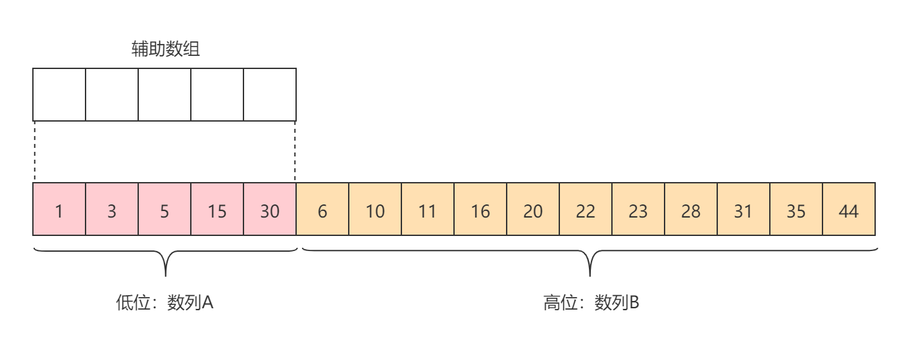
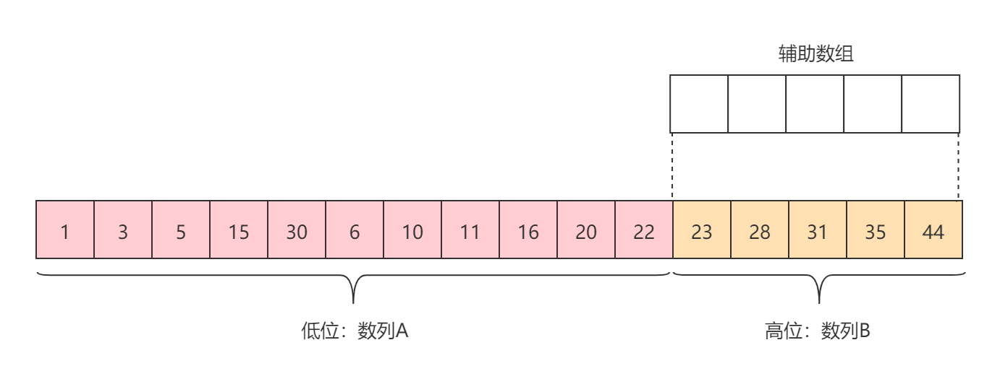
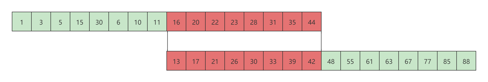

# TimSort

[TOC]

## 算法简介

Timsort是一种混合稳定的排序算法，源自归并排序和插入排序，旨在较好地处理真实世界中各种各样的数据。它使用了Peter Mcllroy的“乐观排序和信息理论上复杂性”中的技术（参见第四届年度ACM-SIAM离散算法研讨会论文集第467-474页，993年）。它由Tim Peters在2002年实现，并应用于Python编程语言。该算法通过不断地将特定子序列（称为一个run）与现有的run合并，直到满足某些条件为止来达成更有效的排序。从2.3版本起，Timsort一直是Python的标准排序算法。它还被Java SE7，Android，platform，GNU Octave，谷歌浏览器，和Swift用于对**非原始类型**的数组排序。

[TimSort](https://baike.baidu.com/item/TimSort/10279720)可以说是归并排序的终极优化版本，主要思想就是检测序列中的天然有序子段（若检测到严格降序子段则翻转序列为升序子段）。在最好情况下无论升序还是降序都可以使时间复杂度降至为O(*n*)，具有很强的自适应性。

## 算法原理

一般来说，排序算法的测试都是基于随机排列的数据进行测试的，但实际上在现实场景中，我们几乎看不到随机数据。往往在一组需要排序的数据中，数据是局部有序的。例如序列{1, 10, 9, 8, 2, 3, 5, 6, 4, 7}，我们可以拆分成{1, 10}, {9, 8}, {2, 3, 5, 6}, {4, 7}这几组局部有序的分组。Timsort就是利用现实世界中这样数据的分布特点，利用归并排序和插入排序进行运算。因此，Timsort其本质上是一种经过优化的归并排序。

Timsort的逻辑，设整个序列的长度为n：

1. 定义整数值`minRun`，使得`⌈n/minRun⌉`刚好是2的整数次幂或某个比2的整数次幂稍小一点的数。`minRun`是最小有序分组run的长度。

2. 从左到右对被排序序列进行遍历，找到一个严格升序或严格降序的子序列，记长度为runLen。

   若runLen<minRun，则用插入排序算法将runLen之后minRun-runLen个数的元素进行扩充，使得runLen=minRun。

   若最终排序是升序，但有序分组run为严格降序，则反转此序列，使其为严格升序，反之，同理。

3. 每生成一次run，就考虑合并当前run和之前的run（之前的run可能是合并过的）。规则如下：

   记最右侧的三个run的长度分别为A,B,C。此时合并A,B或B,C，使得合并后新的最右侧的三个run满足A>B+C，B>C。若满足条件则不需要合并。

示例：序列{1, 10, 9, 8, 2, 3, 5, 6, 4, 7}

1. 首先定义minRun=3。
2. 找到第一个run={1, 10}，runLen<minRun，向后找到1（3-2）个元素插入到run中，此时run={1, 9, 10}。
3. 找到第二个run={8, 2}，runLen<minRun，向后找到1（3-2）个元素插入到run中，此时run={8, 3, 2}，反转为{2, 3, 8}，不需要合并。
4. 找到第三个run={5, 6}，runLen<minRun，向后找到1（3-2）个元素插入到run中，此时run={4, 5, 6}，此时A=B=C，合并A,B可以满足条件，因此合并run1和run2，合并后run1={1, 2, 3, 8, 9, 10}，run3={4, 5, 6}。
5. 找到最后一个run={7}，此时A=6，B=3，C=1，满足条件，不需要合并。
6. 最后从右向左合并最终结果，即先合并run4和run3，然后再合并run1，最终得到有序序列{1, 2, 3, 4, 5, 6, 7, 8, 9, 10}。

### run

run是指在排序序列中一串严格升序或严格降序的子序列，例如：

```
a₁ ≤ a₂ ≤ a₃ ≤ ... 或a₁ ≥ a₂ ≥ a₃ ≥ ...
```

很明显，run的最小长度为2。如果排序是以升序排列，那么久要求run为严格升序（<=），如果run为严格降序(>)，就需要run进行反转为严格升序。

反转的方式就是取严格降序的run子序列的首尾指针交换即可。如下图所示：


### minRun

minRun是指run的最小长度，如果run的长度runLen小于minRun，那么就需要将run之后minRun-runLen范围之内的元素以插入排序的方式插入到run中，使runLen等于minRun。为了提高性能，使用二分插入排序。

对minRun的取值是有特殊要求的：

- 如果整个排序序列的长度n小于等于32时，此时使用Timsort是有点得不偿失的，因此直接使用二分插入排序即可。对于32这个阈值，Java设置的为32，Python设置值的为64。

- 当n是2的整数次幂时，一般选择32。之所以选择32，是因为当runLen小于minRun时，将使用二分插入排序补足run。考虑到二分插入排序的性能，选256会增加数据移动的耗时，选8会增加方法调用过程的耗时，因此选择32比较合适。

- 当n不是2的整数次幂时，32就无法满足要求了。而选择的方式是使`⌈n/minRun⌉`刚好是2的整数次幂或某个比2的整数次幂稍小一点的数。原因在于避免最后一个run的长度过小的情况，导致合并时出现长短问题。例如当n=2112，minRun=32时，最后会出现2048和64合并的情况。

  > 当n=2112，minRun=32时，假设整个序列中每个run的长度都小于或等于32，最终补足之后run的长度就是32。为了满足A>B+C的条件，合并64次之后（64*32=2048），就会有2048个元素为一个run，最后还剩下64位长度的元素。

为什么要这样设定minRun呢？在算法最后合并最终结果时，是按照**从右向左**的方向合并的。这就意味着每次合并的时候最好考虑使序列长度的差距尽可能小。例如，理想情况是这样的，每个序列长度为16,8,5,2,2，从右向左依次合并后，每次合并的两个序列的长度都是差不多的——依次合并2和2，合并4和5，合并9和8，最后合并17和16。

因此，这样设定minRun，在理想情况下就可以将长度为n的序列拆分成2的整数次幂个大小长度的序列。当然，在拆分过程中会触发run之间的合并，例如拆分出三个相似大小长度的序列3,4,2，由于需要满足约束A>B+C且B>C，因此会触发3和4的合并，最终在合并的时候就会出现上文这样的序列。

### Merge

#### 合并约束

前面在介绍minRun的选取时，要求使`⌈n/minRun⌉`刚好是2的整数次幂或某个比2的整数次幂稍小一点的数。而之所以这么做是为了使在最终从右向左依次合并时，每次合并的两个序列的长度都是差不多的，即序列长度的差距尽可能小。

合并约束要求子序列run之间的合并之后满足A>B+C且B>C也是这个目的。但A,B,C三个run之间到底是B与A合并还是B与C合并，不太可能先合并之后再来检测是否满足A>B+C且B>C条件，因此，需要先对A,B,C三个run的长度进行计算以决定B与谁合并。

结果A>B+C且B>C，逆推公式，在合并之前A <= B + C或者A > B + C：

- **当A <= B + C时，选择A和C中较小的数与B合并。**
- **当A > B + C 且 B <= C时，显然合并B,C。**
- **当只有A，B时，且A<= B，合并A，B。**

---

当A > B + C 且 B <= C时，合并B，C一定可以满足约束A>B+C且B>C，因为B+C本身就小于A，合并之后C=0。

---

当只有A，B时，且A<= B，合并A，B。此时没有一个C可用于计算，但是A>B+C且B>C，那么一定A>B>C是一定成立的，因此即使当只有A，B时，但A<= B，约束A>B+C且B>C也是不满足的，因此需要合并A，B。

---

但当A <= B + C时，无论B与A合并还是与C合并，都有可能不满足约束A>B+C且B>C，例如A=4，B=3，C=2，C<A，因此B与C合并，合并之后B=5，但A<B了。

还有一种情况就是A <= B + C，但C始终小于A，例如：

假设minRun=6，并且每一个run都小于等于6，因此最终run长度为6。排序过程如下：

- 第一个run，只有runA=6
- 第二个run，runB=6，由于runA=runB，因此合并runA和runB，runA=12。
- 第三个run，runB=6，此时满足A>B+C且B>C，不合并，此时runA=12，runB=6。
- 第四个run，runC=6，由于A <= B + C，C小于A，因此runB和runC合并，runA=12，runB=12。
- 第五个run，runC=6，由于A <= B + C，C小于A，因此runB和runC合并，runA=12，runB=18。
- 第六个run，runC=6，由于A <= B + C，C小于A，因此runB和runC合并，runA=12，runB=24。
- 第七个run，......

最终这就变成了12与一个比12大很多的run进行合并。与`⌈n/minRun⌉`不是2的整数次幂或某个比2的整数次幂稍小一点的数所造成的情形一样。

---

解决方案就是**当合并之后不满足A>B+C且B>C，则继续向前合并，直到满足A>B+C且B>C为止**。例如A=4，B=3，C=2，C<A，因此B与C合并，合并之后B=5，但A<B，因此继续合并，此时只有A=4和B=5,因此合并A,B，此时A=9。

#### 低位合并/高位合并

合并操作是归并排序，需要开辟一定额外的辅助空间，最直观且最容易理解的方式是开辟一个runA+renB大小的辅助空间。但这样空间复杂度较高，而且很耗时（需要更多的数据拷贝和移动）。但辅助空间是必不可少的，具体的操作方式是：

runA和runB，runA在runB之前，合并时开辟一串数组空间tmp，空间大小=min(runLenA,renLenB)：

- 若A较小，就将A拷贝到tmp中，此时A所在低位空间已经空出来了，因此将tmp和B从左到右低位合并即可。 从低位到高位，a<b，则将a放到低位空间。

- 若B较小，就将B拷贝到tmp中，此时B所在高位空间已经空出来了，因此将tmp和A从右到左高位合并即可。 从高位到低位，a<b，则将b放到高位空间。

### Galloping mode

有如下A、B数列：

```java
A: 1  2  3  4  5  6  7  9  10 13 15 20
   i
B: 11 14 18 21 22 26 30 25 45 46 50 52
   j
```

**One pair at a time**

对于归并排序而言，其合并的过程是拿出A[i]和B[j]，然后将较小的元素放到合并后的位置上。例如，如果A[i]<=B[j]，就将A[i]放到合并后的位置上，反之，则将B[j]放到合并后的位置上。我们将这种一次只比较一对的过程叫做"one pair at a time"，即"一次比较一对"的意思。

**Galloping**

仔细观察数列A、B，如下所示：

```
A: 1  2  3  4  5  6  7  9  10    13 15 20
B:                            11 14 18 21 22 26 30 25 45 46 50 52
```

数列A的前10个元素都比B小，意味着A[i]与B[j]，每次都A[i]胜出。同样的，数列B的后7个元素都比A大，即意味着每次都是

基于现实中这样的数据特性，提出了galloping模式。设定一个阈值`MIN_GALLOP`，当数列的连续胜出次数达到`MIN_GALLOP`，预期后续的元素将继续胜出，因此将其转为galloping模式。Galloping就是每次不拿一个数，而是找到一串，然后放到合并后的位置。接下来再到另一个序列中找到另一串，放入合并后的位置。

例如上述数列A、B，首先以数列B的首个元素11在数列A中查找合适的插入位置。为保证稳定性，将小于**等于**11的元素放到合并后的位置。此时序列A只剩下{13，15，20}。接下来以数列A的首个元素13在数列B中查找合适的插入位置。为保证稳定性，将小于（不包含等于）13的元素放到合并后的位置。最终如下所示：

```
1  2  3  4  5  6  7  9  10 11 13
```

接下来继续交替以A、B的首个元素在对方数列中搜索。但需要注意的是，galloping找到的串必须大于`MIN_GALLOP`，否则退回到one pair at a time模式。

一般情况下`MIN_GALLOP`初始值为7，在实际中考虑到数可能是随机排序，和由于巧合而恰好进入galloping mode模式的情况，因此在方法调用中会声明局部变量minGallop变量来控制实际的阈值。

- 如果每次在gallop loop中循环没退出，那么就缩小minGallop的值（Java中是减1）。目的是让退出gallop loop后的下一次更容易回到galloping mode中来。
- 如果gallop loop退出了，那么将minGallop的值扩大（Java中是加2）。目的是让它更难回到gallop模式。（这不难理解，如果是一个随机分布的数组，我们更希望使用one-pair-at-a-time的方式，而避免让gallop模式占用过多的比较时间）。
- **minGallop**不影响loop中判断当前chunk的长度是否满足阈值，而让然使用固定的**MIN_GALLOP**。

## 算法实现

### Run

首先需要考虑的一个问题是每一个找到的run存哪儿。最简单的方式就是为每一个找到的run开辟一个对应大小的数组空间，但这种方式不想可知，其空间复杂度太高。假设整个序列都是有序的，将要开辟O(n)大小的空间。另一种方式就是将找到的run仍然使其存储带排序数组中，然后声明两个全局数组runBase和runLen，runBase存储每一个run的起始索引，runLen存储每一个run的长度，而runBase和runLen本身的索引则代表第几个run。如此，就可以以最少的空间存储每一个run的信息。最后在以一个全局变量stackSize来存储run的个数（不太可能每次检测runBase和runLen那个有值，那些没值的方式来获取run的个数）。

```java
/**
 * 等待合并run的堆栈。run i的地址从base[i]开始，长度为len[i]。
 * runBase[i] + runLen[i] == runBase[i + 1]
 * 已该方式记录可以减少存储空间。
 */
private int stackSize = 0;
private final int[] runBase = new int[100];
private final int[] runLen = new int[100];
```

### MinRun

需要根据带排序的数组计算出合适的minRun，对于minRun的要求，前文已经详细阐述。一种最简单的方式就是将n不停的除以2，如果能能够一直被2整除，并且小于MIN_MERGE，那么它就是我们所需要的minRun。如果不能被2整除，那么就将最后一个小于MIN_MERGE的值加上1，就是我们所需要的minRun。如何判断能否被整除呢？有一种简单的方式就是每次除以2时，判断是否是否偶数，如果是，那么就是能够被2整除的。反之，则是不能。

```java
private static final int MIN_MERGE = 32;
/**
 * 计算指定长度数组的最小可接受的run长度。
 * <ul>
 *  <li>如果n小于MIN_MERGE，则返回n。</li>
 *  <li>如果n是2的整数次幂，则返回MIN_MERGE/2。</li>
 *  <li>如果n不是2的整数次幂，则返回k（MIN_MERGE/2 <= k <= MIN_MERGE，n/k接近但严格小于2的精确幂）。</li>
 * </ul>
 *
 * @param n 要排序的数组长度。
 * @return 要合并的最小run的长度。
 */
private static int minRunLength(int n) {
    assert n >= 0;
    int r = 0;
    while (n >= MIN_MERGE) {
        r |= (n & 1); // 奇偶
        n >>= 1;      // 除2
    }
    return n + r;
}
```

### Find run

run的查找就是从指定的索引开始。但需要注意的是如果查找到为降序，则必须严格，即前一个元素大于后一个元素，而不能等于。

```java
/**
 * 统计从指定数组的指定位置开始的run的长度，如果run为降序则反转它（确保方法返回的run始终为升序）。
 * 升序序列:
 * a[lo] <= a[lo + 1] <= a[lo + 2] <= ...
 * 降序序列:
 * a[lo] >  a[lo + 1] >  a[lo + 2] >  ...
 * 为了保证排序的稳定性，降序必须为严格“降序”，否则反转将会破坏稳定性。
 *
 * @param a  要计算一次运行的数组，并可能将其反转。
 * @param lo 在run中第一个元素的索引。
 * @param hi 在run中可能包含的最后一个元素之后的索引。要求lo < hi。
 * @return 从指定数组中的指定位置开始的run的长度。
 */
private int countRunAndMakeAscending(int[] a, int lo, int hi) {
    int runHi = lo + 1;
    if (runHi == hi) //临界值处理
        return 1;
    if (a[runHi] < a[lo]) { //Descending
        /*此处是降序，需要注意的是降序的要求是a[lo] < a[lo + 1]，
          而不是a[lo] <= a[lo + 1]。因此，此为严格“降序”。*/
        while (runHi < hi && a[runHi] < a[runHi - 1])
            runHi++;
        //反转
        reverseRange(a, lo, runHi);
    } else {                //Ascending
        while (runHi < hi && a[runHi] >= a[runHi - 1])
            runHi++;
    }
    return runHi - lo;
}
```

### Reverse

```java
/**
 * 反转指定数组的指定范围。
 *
 * @param data 目标数组
 * @param lo   要反转的范围内第一个元素的索引。
 * @param hi   要反转的范围内最后一个元素之后的索引。
 */
void reverseRange(int[] data, int lo, int hi) {
    hi--;
    while (lo < hi) {
        int t = data[lo];
        data[lo++] = data[hi];
        data[hi--] = t;
    }
}
```

### 二分插入

```java
/**
 * 使用二进制插入排序对指定数组的指定部分进行排序。这是对少量元素进行排序的最佳方法。
 * 它需要O(n log n)的比较，但是O(n^2)的数据移动(最坏的情况)。
 * <p>
 * 如果指定范围的初始部分已经排序，该方法可以利用它:该方法假设从索引lo(包含的)到
 * start(排除的)的元素已经排序。
 *
 * @param a     要对其范围进行排序的数组
 * @param lo    要排序的范围内第一个元素的索引
 * @param hi    要排序的范围中最后一个元素之后的索引
 * @param start 范围内第一个尚未被排序的元素的索引(lo <= start <= hi)
 */
private static void binarySort(int[] a, int lo, int hi, int start) {
    assert lo <= start && start <= hi;
    if (start == lo)
        start++;
    for (; start < hi; start++) {
        int pivot = a[start];

        // 将left(和right)设置为[start] (pivot)所属的索引
        int left = lo;
        int right = start;
        assert left <= right;
        /*
             * Invariants:
             *   pivot >= all in [lo, left).
             *   pivot <  all in [right, start).
             */
        while (left < right) {
            int mid = (left + right) >>> 1;
            if (pivot < a[mid])
                right = mid;
            else
                left = mid + 1;
        }
        assert left == right;

        /*
         * 不变式仍然保持不变:pivot >= all in [lo, left)和pivot < all in [left, start)，
         * 所以pivot属于左边。注意，如果有等于主元素的元素，左指向它们后面的第一个槽——这就是为什么这
         * 个排序是稳定的。将元素滑过去，为枢轴腾出空间。
         */
        int n = start - left;  // 要移动的元素的数量
        // Switch在默认情况下只是对arraycopy的优化
        switch (n) {
            case 2:
                a[left + 2] = a[left + 1];
            case 1:
                a[left + 1] = a[left];
                break;
            default:
                System.arraycopy(a, left, a, left + 1, n);
        }
        a[left] = pivot;
    }
}
```

### 合并约束

合并约束的要求是满足runA > runB + runC。但需要注意的是，存在3个即以上的run时，合并之后可能并不满足runA > runB + runC的约束，因此需要继续向前合并，直到满足约束为止。

```java
/**
 * 检查等待合并run的堆栈，并合并相邻的run，直到堆栈中的run符合合并约束:
 * <p>
 * 1. runLen[i - 3] > runLen[i - 2] + runLen[i - 1]
 * 2. runLen[i - 2] > runLen[i - 1]
 * <p>
 * 每次将新的run推入堆栈时都会调用次方法，因此保证在进入此方法时i<stackSize。
 */
private void mergeCollapse() {
    //stackSize > 1即要求一直合并到第一个run为止，或者满足runA > runB + runC约束。
    //合并到第一个run，一定满足runA > runB + runC约束。
    while (stackSize > 1) {
        // runA = n - 1; runB = n; runC = n+1
        int n = stackSize - 2;
        // runA <= runB + runC
        if (n > 0 && runLen[n - 1] <= runLen[n] + runLen[n + 1]) {
            if (runLen[n] < runLen[n + 1]) {
                n--;
            }
            mergeAt(n);
        } else if (runLen[n] <= runLen[n + 1]) { // runB <= runC
            mergeAt(n);
        } else { // 满足runA > runB + runC
            break;
        }
    }
}
```

### 低位合并/高位合并

高低位合并是为了节省内存空间。一般情况下，每次排序待排序的序列是一个，而不是多个。对于归并排序而言，它将两个有序数列进行合并，这两个不是真正的两个，而是在排序过程中逻辑子序列，它们本身就是待排序序列的一部分。因此在创建辅助空间时可以只创建一个子序列大小的辅助空间，以辅助空间和另一个子序列进行归并操作，将归并后的结果直接放入到源数组当中，避免了元素的二次移动（从辅助空间拷贝到源数组空间）。


为了节省空间，将两个子序列中小的子序列的大小作为辅助空间的大小。由于两个子序列在原数组中一个在前，一个在后，因此，称在前的为**低位**，在后的为**高位**。而基于低位创建辅助空间归并为**低位合并**，基于高位创建辅助空间归并为**高位合并**。

低位合并：



高位合并：




不用担心合并的过程中源数组没有空间存储。以低位合并为例，如果低位比高位都小，那么它在每次比较都将胜出，那么空间肯定是足够的。因为辅助空间的大小与低位子序列的大小是相等的。如果低位并不是每次都胜出，那么高位的元素将会填充到低位上去，此时该元素原所在高位空间就已经腾出来了，因此最终空间是一定足够。同理，高位合并也是一样的。

主要注意的是，对于低位合并，只需要将合并之后的元素从低到高依次放入原数组即可。但是高位合并却需要反方向来，即从高到低，从两个子序列的右边开始比较，每次比较大的元素胜出。因为高位的空间大小小于低位。

> 高低位合并的代码实现与Galloping mode是一起的，因此将在介绍完Galloping mode之后列出。

### Galloping

标准的归并排序算法是针对两个有序序列A和B，以及两个指针A、B首个元素的指针i和j，比较A[i]和B[j]，然后将小的元素放入到合并后的序列中，并推进小元素所在序列的指针，然后再次比较A[i]和B[j]。以此类推，重复此过程。

在许多情况下，两个有序列在进行归并时，其序列的前后有一部分子序列是不用比较合并的，可以直接将其放到排序后的序列中。如下图所示：



有序列A{1}和B{}，可以发现，子序列A{1~11}比序列B的首个元素都小。子序列B{48~88}比序列A的尾部元素都大。子序列A{1~11}和B{48~88}完全不需要参与比较归并，直接放到排序后的序列中即可。只有红色部分才需要参与。因此，针对这样的数据特性，提出了一个对归并排序的优化策略：galloping。

galloping：在两个有序序列归并之前，首先以序列B的首个元素在序列A中查找合适的插入位置，返回最后一个小于B首个元素的元素之后的索引，为了保证排序的稳定性，如果存在有元素相等，则返回最后一个等于B首个元素的元素之后的索引。同理，再次以序列A的最后一个元素在序列B中查找合适的插入位置，返回最后一个小于A最后一个元素的索引，为了保证排序的稳定性，如果存在有元素相等，则返回最后一个元素相等之前的索引。

**进一步优化**

在进行查找的时候，其操作是线性查找，时间复杂度O(n)。对此，可进行进一步优化，使其时间复杂度达到O(log(n))。因为被查找的子序列本身是有序的，对于有序序列，其具有二分性，因此，使用二分查找就可以达到O(log(n))的时间复杂度。

另外一点需要注意的是，无论是查找A，还是查找B，既可以从右向左查找，也可以从左向右查找。

进一步优化之后的代码实现如下：

*gallopRight*

```java
/**
 *  定位要将指定键插入指定排序范围的位置; 如果范围包含一个等于key的元素，则返回位于最右边相等元素之后的索引。
 *  之所以返回位于最右边相等元素之后的索引，是因为需要保持排序的稳定性，位于最右边相等元素仍然要位于指定键的前面。
 *  因此，后续操作从相等元素之后的索引开始。
 *
 * @param key  要搜索其插入点的键。
 * @param a    要搜索的数组。
 * @param base 范围内第一个元素的索引。
 * @param len  范围的长度; 必须 > 0。
 * @param hint 开始搜索的索引，0 <= hint < n。提示：离结果越近，这个方法运行得越快。
 * @return 整数k, 0 <= k <= n 而 a[b + k - 1] <= key < a[b + k]（b为排序范围的起始索引）。
 */
private int gallopRight(int key, int[] a, int base, int len, int hint) {
    assert len > 0 && hint >= 0 && hint < len;

    int ofs = 1;     // 起始偏移量
    int lastOfs = 0; // 最后比较成功的偏移量
    /*首先将key与指定搜索的起始索引hint所对应的元素进行比较，分两种情况：
       1. 如果小于，表明合适的插入位置在hint的左边，因此以hint为基点，从右向左查找。
       2. 如果大于，则表示合适的插入位置在hint的右边，因此，以hint为基点，从左向右查找。
      可以把它理解为二分查找的二分。*/
    if (key < a[base + hint]) {
        /* 在进行正式搜索的时候并没有使用二分查找，而是采用跳跃的方式搜索，即当前跳跃
           的偏移量为上次跳跃的偏移量乘以2 + 1，时间复杂度仍然是O(log(n))，等价于二分搜索 */
        // Gallop left until a[b+hint - ofs] <= key < a[b+hint - lastOfs]
        int maxOfs = hint + 1;
        while (ofs < maxOfs && key < a[base + hint - ofs]) {
            lastOfs = ofs;
            ofs = (ofs << 1) + 1; //乘以2 + 1
            if (ofs <= 0)   // int overflow
                ofs = maxOfs;
        }
        //处理一下越界的问题，因为是跳跃的方式比较，所以偏移量可能跳出最大偏移量，因此使偏移量等于最大偏移量
        if (ofs > maxOfs)
            ofs = maxOfs;
        /* 当前是从右向左查找，因此逆转一下lastOfs和ofs的指针，使lastOfs指向前，
               ofs指向后，用于方便后续lastOfs ~ ofs之间元素的二分查找*/
        int tmp = lastOfs;
        lastOfs = hint - ofs;
        ofs = hint - tmp;
    } else { // a[b + hint] <= key，这里就是从左向右查找
        // Gallop right until a[b+hint + lastOfs] <= key < a[b+hint + ofs]
        int maxOfs = len - hint;
        // 原理是一样的，只不过方向是相反的
        while (ofs < maxOfs && key >= a[base + hint + ofs]) {
            lastOfs = ofs;
            ofs = (ofs << 1) + 1;
            if (ofs <= 0)   // int overflow
                ofs = maxOfs;
        }
        //处理一下越界的问题
        if (ofs > maxOfs)
            ofs = maxOfs;
        /*此处与上面从右向左查找不同，其本身就是从小到大的顺序，因此不需要逆转lastOfs和ofs，
             但是指针还是需要使其指向被排序数组的对应索引位。*/
        lastOfs += hint;
        ofs += hint;
    }
    assert -1 <= lastOfs && lastOfs < ofs && ofs <= len;

    /*
     * 现在a[b + lastOfs] <= key < a[b + ofs]，所以需要找到key在[lastOfs ~ ofs]范围内的具体位置，
     * 最简单的方式就是采用线性查找，时间复杂度O(n)，因此，为了更进一步提升效率，采用二分法，时间复杂度O(log n)。
     */
    lastOfs++;
    while (lastOfs < ofs) {
        int m = lastOfs + ((ofs - lastOfs) >>> 1); //取中位数

        if (key < a[base + m])
            ofs = m;          // key < a[b + m]
        else
            lastOfs = m + 1;  // a[b + m] <= key
    }
    assert lastOfs == ofs;    // so a[b + ofs - 1] <= key < a[b + ofs]
    return base + ofs;
}
```

gallopLeft

```java
/**
 *  定位要将指定键插入指定排序范围的位置;如果范围包含一个等于key的元素，则返回最左边相等元素的索引。
 *  之所以返回最左边相等元素的索引，是因为需要保持排序的稳定性，即最左边相等的元素仍然要在指定键的后面。
 *
 * @param key  要搜索其插入点的键。
 * @param a    要搜索的数组。
 * @param base 范围内第一个元素的索引。
 * @param len  范围的长度; 必须 > 0。
 * @param hint 开始搜索的索引，0 <= hint < n。提示：离结果越近，这个方法运行得越快。
 * @return 整数k, 0 <= k <= n 而 a[b + k - 1] <= key < a[b + k]（b为排序范围的起始索引）。
 */
private static int gallopLeft(int key, int[] a, int base, int len, int hint) {
    assert len > 0 && hint >= 0 && hint < len;
    int lastOfs = 0;
    int ofs = 1;
    if (key > a[base + hint]) {
        // Gallop right until a[base+hint+lastOfs] < key <= a[base+hint+ofs]
        int maxOfs = len - hint;
        while (ofs < maxOfs && key > a[base + hint + ofs]) {
            lastOfs = ofs;
            ofs = (ofs << 1) + 1;
            if (ofs <= 0)   // int overflow
                ofs = maxOfs;
        }
        if (ofs > maxOfs)
            ofs = maxOfs;

        // Make offsets relative to base
        lastOfs += hint;
        ofs += hint;
    } else { // key <= a[base + hint]
        // Gallop left until a[base+hint-ofs] < key <= a[base+hint-lastOfs]
        final int maxOfs = hint + 1;
        while (ofs < maxOfs && key <= a[base + hint - ofs]) {
            lastOfs = ofs;
            ofs = (ofs << 1) + 1;
            if (ofs <= 0)   // int overflow
                ofs = maxOfs;
        }
        if (ofs > maxOfs)
            ofs = maxOfs;

        // Make offsets relative to base
        int tmp = lastOfs;
        lastOfs = hint - ofs;
        ofs = hint - tmp;
    }
    assert -1 <= lastOfs && lastOfs < ofs && ofs <= len;

    /*
         * Now a[base+lastOfs] < key <= a[base+ofs], so key belongs somewhere
         * to the right of lastOfs but no farther right than ofs.  Do a binary
         * search, with invariant a[base + lastOfs - 1] < key <= a[base + ofs].
         */
    lastOfs++;
    while (lastOfs < ofs) {
        int m = lastOfs + ((ofs - lastOfs) >>> 1);

        if (key > a[base + m])
            lastOfs = m + 1;  // a[base + m] < key
        else
            ofs = m;          // key <= a[base + m]
    }
    assert lastOfs == ofs;    // so a[base + ofs - 1] < key <= a[base + ofs]
    return base + ofs;
}
```

### 高低位合并分流

在进行高低位合并之前，只需要判断一下run1和run2的长度，如果len1 <= len2，就进行低位合并；如果len1 >= len2，就进行高位合并。不过这一步可以应用一下galloping优化策略。基于上小节所介绍的galloping优化策略，通过gallopRight和gallopLeft方法分别查找run1和run2真正有必要进行归并操作的长度，再以该长度决定是进行高位还是低位合并的操作。

```java
/**
 * 合并在栈上索引i和i+1两处的run。run i必须是栈上倒数第二个或倒数第三个run。
 * 换句话说，i必须等于stackSize-2或stackSize-3。
 *
 * @param i 要合并的两个run中第一个run在栈上的索引。
 */
private void mergeAt(int i) {
    int base1 = runBase[i];
    int len1 = runLen[i];
    int base2 = runBase[i + 1];
    int len2 = runLen[i + 1];

    /*
     * 当前合并的是在stack上i和i+1的run，如果当前i指向A，那么合并的就是AB，
     * 那么就需要将C在栈上的索引向前移动一位。
     */
    runLen[i] = len1 + len2;
    if (i == stackSize - 3) {
        runBase[i + 1] = runBase[i + 2];
        runLen[i + 1] = runLen[i + 2];
    }
    // 当前i和i+1合并了，栈大小减1。
    stackSize--;

    /*
     * 找出run2的第一个元素在run1中的位置。
     * 注意：经过gallopRight之后，run1的第一个元素一定大于run2的第一个元素。
     */
    int k = gallopRight(a[base2], a, base1, len1, 0);
    assert k >= 0;
    //推进指针
    base1 += k;
    len1 -= k;
    //如果推进指针之后run1的长度为0，那表明run1和run2已结就是有序的，直接return。
    if (len1 == 0)
        return;
    /*
     * 找出run1的最后一个个元素在run2中的位置。
     * 注意：经过gallopLeft，run1的最后一个元素一定大于run2的所有元素。
     */
    len2 = gallopLeft(a[base1 + len1 - 1], a, base2, len2, len2 - 1);
    assert len2 >= 0;
    if (len2 == 0)
        return;
    // 合并剩余的run，低位或高位
    if (len1 <= len2)
        mergeLo(base1, len1, base2, len2);
    else
        mergeHi(base1, len1, base2, len2);
}
```

### Galloping mode

Galloping模式在算法原理一节已经介绍的很清楚了。下面直接看代码，其是如何结合高低位合并一起实现。

*minGallop全局变量，默认为7：*

```java
private static final int  MIN_GALLOP = 7;
private int minGallop = MIN_GALLOP;
```

#### 低位合并（gallop mode）

```java
/**
 * 以一种稳定（稳定性）的方式合并两个相邻的run。第一个run的第一个元素必须大于第二个run的
 * 第一个元素(a[base1] > a[base2])，第一个run的最后一个元素(a[base1 + len1-1])
 * 必须大于第二个run的所有元素。
 * <p>
 * 当前方法是低位合并。因此，为了提高性能，该方式只有在len1 <= len2的时候被调用；如果
 * len1 >= len2，则应该调用mergeHi（高位合并）。如果len1 = len2，那么都可以调用。
 *
 * @param base1 第一个run要合并的第一个元素的索引。
 * @param len1  第一个run要合并的长度 (必须 > 0)
 * @param base2 第二个run要合并的第一个元素的索引，(必须 aBase + aLen)
 * @param len2  第二个run要合并的长度(必须 > 0)
 */
@SuppressWarnings({"unchecked", "rawtypes"})
private void mergeLo(int base1, int len1, int base2, int len2) {
    assert len1 > 0 && len2 > 0 && base1 + len1 == base2;

    // Copy first run into temp array
    int[] a = this.a; // For performance
    int[] tmp = ensureCapacity(len1);

    int cursor1 = tmpBase; // Indexes into tmp array
    int cursor2 = base2;   // Indexes int a
    int dest = base1;      // Indexes int a
    //将低位run1拷贝到临时数组
    System.arraycopy(a, base1, tmp, cursor1, len1);

    /*
     * 由于第一个run的第一个元素大于第二个run的第一个元素(a[base1] > a[base2])，
     * 因此，直接将第二个run的第一个元素放到合并后的位置。
     */
    a[dest++] = a[cursor2++];
    //第二个run的长度减去一个。如果等于0，则表示run2没有元素了，因此将run1的元素放到合并后的位置，然后结束合并。
    if (--len2 == 0) {
        System.arraycopy(tmp, cursor1, a, dest, len1);
        return;
    }
    /*
     * run1只有一个元素。由于第一个run的最后一个元素大于第二个run的所有元素，因此不需要在
     * 进行归并的比较操作，直接将run2的所有元素放到合并后的位置。而run1的唯一元素放到合并
     * 后的最后一个位置即可。
     */
    if (len1 == 1) {
        System.arraycopy(a, cursor2, a, dest, len2);
        a[dest + len2] = tmp[cursor1]; // Last elt of run 1 to end of merge
        return;
    }

    int minGallop = this.minGallop;  // Use local variable for performance
    outer:
    while (true) {
        int count1 = 0; // 统计run1连续获胜次数的局部变量
        int count2 = 0; //

        /*------------ one-pair-at-a-time模式 --------------*/

        /*
         * 标准的归并操作，一次比较一对。有所区别的是有count变量在参与run胜出
         * 次数的统计。另一点是结束条件不仅仅是某一个run归并完成（break outer;），
         * 还包括当某一个run的连续胜出次数超过minGallop时，将退出one-pair-at-a-time模式，
         * 进入galloping模式。
         */
        do {
            assert len1 > 1 && len2 > 0;
            //比较元素大小，run2 < run1
            if (a[cursor2] < tmp[cursor1]) {
                a[dest++] = a[cursor2++];
                // run2胜出次数+1
                count2++;
                // run1胜出次数归零（胜出必须连续）
                count1 = 0;
                // 长度减1，如果等于0，表示没有新的元素可用于归并了
                if (--len2 == 0)
                    break outer;
            } else { // 类同
                a[dest++] = tmp[cursor1++];
                count1++;
                count2 = 0;
                if (--len1 == 1)
                    break outer;
            }
            // run1或者run2连续胜出次数小于minGallop，则继续one-pair-at-a-time模式
        } while ((count1 | count2) < minGallop);

        /*------------ galloping模式 --------------*/

        /*
         * One run is winning so consistently that galloping may be a
         * huge win. So try that, and continue galloping until (if ever)
         * neither run appears to be winning consistently anymore.
         */
        do {
            assert len1 > 1 && len2 > 0;
            /*
             * 用run2的首个元素（剩余未归并的）在run1中（剩余未归并的）查询连续胜出的元素数量，
             * 赋值给count1。即run1中小于run2首个元素的元素数量
             */
            count1 = gallopRight(a[cursor2], tmp, cursor1, len1, 0);
            //count1 != 0表示找到了
            if (count1 != 0) {
                //run1的元素在tmp中，因此，将胜出的元素直接拷贝到a数组中
                System.arraycopy(tmp, cursor1, a, dest, count1);
                //推进指针
                dest += count1;
                cursor1 += count1;
                len1 -= count1;
                if (len1 <= 1)  // len1 == 1 || len1 == 0
                    break outer;
            }
            /*
             * 将run2的首个元素（剩余未归并的）赋到data数组的dest位置，比首个元素小
             * 的都已经放到data数组中了，因此下一个元素一定是run2的首个元素。
             */
            a[dest++] = a[cursor2++];
            /*
             * run2删了一个元素（首个元素 - 剩余未归并的），因此len2需要-1。但首个元素
             * 也可能是其最后一个元素，因此，如果len2减1之后等于0，则就表示已经归并完毕了，
             * 因此，退出归并。
             */
            if (--len2 == 0)
                break outer;
            /*
             * 用run1的首个元素在run2中查询，原理与用run2的首个元素在run1中查询相同。
             */
            count2 = gallopLeft(tmp[cursor1], a, cursor2, len2, 0);
            if (count2 != 0) {
                System.arraycopy(a, cursor2, a, dest, count2);
                dest += count2;
                cursor2 += count2;
                len2 -= count2;
                if (len2 == 0)
                    break outer;
            }
            a[dest++] = tmp[cursor1++];
            if (--len1 == 1)
                break outer;
            //gallop减1，目的是为了使下一次更容易进入galloping模式
            minGallop--;
            //galloping找到的串长度必须不小于minGallop，否则退出galloping模式
        } while (count1 >= MIN_GALLOP | count2 >= MIN_GALLOP);

        /*------------ 已退出galloping模式 --------------*/

        if (minGallop < 0)
            minGallop = 0;
        //galloping模式已退出了，将minGallop的值扩大，这里是加2。目的是为了使其更难以回到galloping模式
        minGallop += 2;  // Penalize for leaving gallop mode
    }  // End of "outer" loop
    this.minGallop = minGallop < 1 ? 1 : minGallop;  // Write back to field

    if (len1 == 1) {
        assert len2 > 0;
        System.arraycopy(a, cursor2, a, dest, len2);
        a[dest + len2] = tmp[cursor1]; //  Last elt of run 1 to end of merge
    } else if (len1 == 0) {
        throw new IllegalArgumentException(
            "Comparison method violates its general contract!");
    } else {
        assert len2 == 0;
        assert len1 > 1;
        System.arraycopy(tmp, cursor1, a, dest, len1);
    }
}
```

#### 高位合并（gallop mode）

```java
/**
 * 与mergeLo方法类似，除了只应该在len1 >= len2是调用之外。如果len1 <= len2，
 * 则应该调用mergeLo。(如果len1 == len2，这两个方法都可以被调用。)
 * <p>
 * 另外需要注意的是，局部变量dest是--，而mergeLo是++。
 *
 * @param base1 第一个run要合并的第一个元素的索引。
 * @param len1  第一个run要合并的长度 (必须 > 0)
 * @param base2 第二个run要合并的第一个元素的索引，(必须 aBase + aLen)
 * @param len2  第二个run要合并的长度(必须 > 0)
 */
@SuppressWarnings({"unchecked", "rawtypes"})
private void mergeHi(int base1, int len1, int base2, int len2) {
    assert len1 > 0 && len2 > 0 && base1 + len1 == base2;

    // Copy second run into temp array
    int[] a = this.a; // For performance
    int[] tmp = ensureCapacity(len2);
    int tmpBase = this.tmpBase;
    System.arraycopy(a, base2, tmp, tmpBase, len2);

    int cursor1 = base1 + len1 - 1;  // Indexes into a
    int cursor2 = tmpBase + len2 - 1; // Indexes into tmp array
    int dest = base2 + len2 - 1;     // Indexes into a

    // Move last element of first run and deal with degenerate cases
    a[dest--] = a[cursor1--];
    if (--len1 == 0) {
        System.arraycopy(tmp, tmpBase, a, dest - (len2 - 1), len2);
        return;
    }
    if (len2 == 1) {
        dest -= len1;
        cursor1 -= len1;
        System.arraycopy(a, cursor1 + 1, a, dest + 1, len1);
        a[dest] = tmp[cursor2];
        return;
    }

    int minGallop = this.minGallop;  // Use local variable for performance
    outer:
    while (true) {
        int count1 = 0; // Number of times in a row that first run won
        int count2 = 0; // Number of times in a row that second run won

        /*
         * Do the straightforward thing until (if ever) one run
         * appears to win consistently.
         */
        do {
            assert len1 > 0 && len2 > 1;
            if (tmp[cursor2] < a[cursor1]) {
                a[dest--] = a[cursor1--];
                count1++;
                count2 = 0;
                if (--len1 == 0)
                    break outer;
            } else {
                a[dest--] = tmp[cursor2--];
                count2++;
                count1 = 0;
                if (--len2 == 1)
                    break outer;
            }
        } while ((count1 | count2) < minGallop);

        /*
         * One run is winning so consistently that galloping may be a
         * huge win. So try that, and continue galloping until (if ever)
         * neither run appears to be winning consistently anymore.
         */
        do {
            assert len1 > 0 && len2 > 1;
            count1 = len1 - gallopRight(tmp[cursor2], a, base1, len1, len1 - 1);
            if (count1 != 0) {
                dest -= count1;
                cursor1 -= count1;
                len1 -= count1;
                System.arraycopy(a, cursor1 + 1, a, dest + 1, count1);
                if (len1 == 0)
                    break outer;
            }
            a[dest--] = tmp[cursor2--];
            if (--len2 == 1)
                break outer;

            count2 = len2 - gallopLeft(a[cursor1], tmp, tmpBase, len2, len2 - 1);
            if (count2 != 0) {
                dest -= count2;
                cursor2 -= count2;
                len2 -= count2;
                System.arraycopy(tmp, cursor2 + 1, a, dest + 1, count2);
                if (len2 <= 1)
                    break outer; // len2 == 1 || len2 == 0
            }
            a[dest--] = a[cursor1--];
            if (--len1 == 0)
                break outer;
            minGallop--;
        } while (count1 >= MIN_GALLOP | count2 >= MIN_GALLOP);
        if (minGallop < 0)
            minGallop = 0;
        minGallop += 2;  // Penalize for leaving gallop mode
    }  // End of "outer" loop
    this.minGallop = minGallop < 1 ? 1 : minGallop;  // Write back to field

    if (len2 == 1) {
        assert len1 > 0;
        dest -= len1;
        cursor1 -= len1;
        System.arraycopy(a, cursor1 + 1, a, dest + 1, len1);
        a[dest] = tmp[cursor2];  // Move first elt of run2 to front of merge
    } else if (len2 == 0) {
        throw new IllegalArgumentException(
            "Comparison method violates its general contract!");
    } else {
        assert len1 == 0;
        assert len2 > 0;
        System.arraycopy(tmp, tmpBase, a, dest - (len2 - 1), len2);
    }
}
```

*ensureCapacity*

```java
private Object[] tmp;
private int tmpBase; // base of tmp array slice
private int tmpLen;  // length of tmp array slice

/**
 * 确保外部数组tmp至少具有指定数量的元素，必要时增加其大小。大小以指数方式增加，
 * 以确保平摊线性时间复杂度。
 *
 * @param minCapacity tmp数组所需的最小容量
 * @return tmp, 不管它是否增长
 */
private Object[]  ensureCapacity(int minCapacity) {
    if (tmpLen < minCapacity) {
        // Compute smallest power of 2 > minCapacity
        int newSize = minCapacity;
        newSize |= newSize >> 1;
        newSize |= newSize >> 2;
        newSize |= newSize >> 4;
        newSize |= newSize >> 8;
        newSize |= newSize >> 16;
        newSize++;

        if (newSize < 0) // Not bloody likely!
            newSize = minCapacity;
        else
            newSize = Math.min(newSize, a.length >>> 1);

        @SuppressWarnings({"unchecked", "UnnecessaryLocalVariable"})
        Object[] newArray = new Object[newSize];
        tmp = newArray;
        tmpLen = newSize;
        tmpBase = 0;
    }
    return tmp;
}
```

### Sort

```java
public void sort(int[] a) {
    this.a = a;
    int nRemaining = this.a.length;
    //如果数组的大小为0或者1，那么数组总是有序的
    if (nRemaining < 2)
        return;
    //如果数组的长度小于MIN_MERGE，直接二分插入排序。
    if (nRemaining < MIN_MERGE) {
        int initRunLen = countRunAndMakeAscending(a, 0, nRemaining);
        binarySort(a, 0, nRemaining, initRunLen);
        return;
    }
    //计算一下适合的minRun长度
    int minRun = minRunLength(nRemaining);
    int lo = 0;
    do {
        //找到一个run的长度
        int runLen = countRunAndMakeAscending(this.a, lo, this.a.length);
        //如果当前run长度小于minRun，则使用二分插入排序扩展到minRun
        if (runLen < minRun) {
            int force = Math.min(nRemaining, minRun);
            binarySort(this.a, lo, lo + force, lo + runLen);
            runLen = force;
        }
        //将当前run的起始索引lo和长度runLen推送到run stack中
        pushRun(lo, runLen);
        //合并
        mergeCollapse();
        //推进lo指针，并且剩下的数组长度减去当前run的长度
        lo += runLen;
        nRemaining -= runLen;
    } while (nRemaining > 0);
    // 最后合并剩下所有的run，完成排序
    mergeForceCollapse();
}

private void pushRun(int runBase, int runLen) {
    this.runBase[stackSize] = runBase;
    this.runLen[stackSize] = runLen;
    stackSize++;
}

/**
 * 合并栈上所有的run，直到只剩下一个为止。此方法调用一次，以完成排序。
 */
private void mergeForceCollapse() {
    while (stackSize > 1) {
        int n = stackSize - 2;
        if (n > 0 && runLen[n - 1] < runLen[n + 1])
            n--;
        mergeAt(n);
    }
}
```

## 算法分析

**时间复杂度**

- 最好的时间复杂度O(n)
- 最坏的时间复杂度O(n log(n))
- 平均时间复杂度O(n log(n))

**空间复杂度**

T(n)

**稳定性**

归并排序是**稳定**的排序算法。