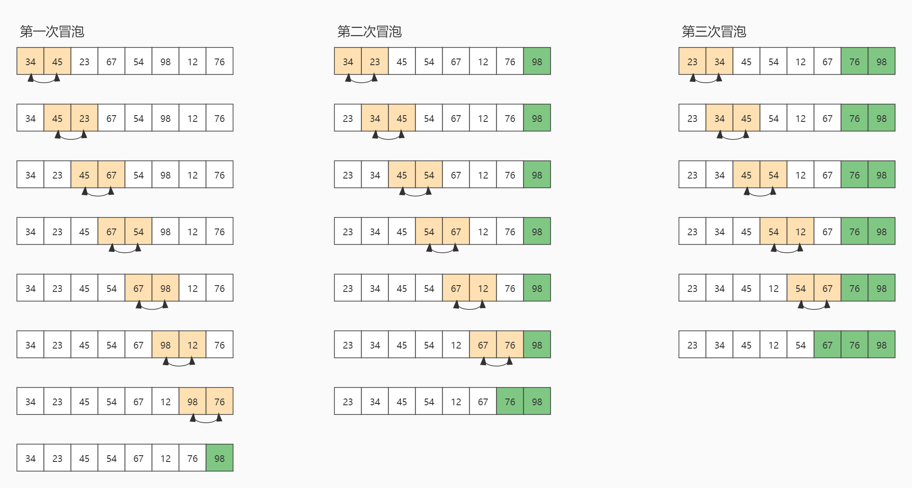

# 冒泡排序

[TOC]

## 算法简介

冒泡排序（Bubble Sort），是一种计算机科学领域的较简单的排序算法。

重复地走访要排序的元素列，依次比较两个相邻的元素，如果顺序错误，就把它们交换过来。重复此过程，直到没有相邻元素需要交换。

这个算法的名字由来是因为越小或越大的元素会经由交换慢慢“浮”到数列的顶端（升序或降序排列），就如同碳酸饮料中二氧化碳的气泡最终会上浮到顶端一样，故名“冒泡排序”。

## 算法原理

冒泡排序算法原理如下：

比较相邻的两个元素，如果前一个大于后一个元素，则交换它们的位置（升序），反之，则保持不动。首先将第一个与第二个元素比较并交换，然后将第二个与第三个元素比较并交换，以此类推，一直到将第N-1个与第N个元素比较并交换。最终会将整个顺序表中最大的元素交换到最末尾，这个过程称为“冒泡”。继续进行第二次冒泡，将1~N-1的元素进行两两比较并交换，直到N等于2，即最后一次冒泡是将第一个与第二个元素比较并交换，然后结束。最终整个顺序表变得有序。

## 算法示例

顺序表：{34,45,23,67,54,98,12,76}

冒泡排序过程如下：



由于篇幅有限，上图只显示了三次冒泡排序的过程，其他的过程原理都是一样的。

最终会得到有序的顺序表`{12,23,34,45,54,67,76,98}`。

## 算法实现

Java

```java
public void bubbleSort(int[] arrays) {
    for (int i = arrays.length - 1; i > -1; i--) {
        for (int j = 0; j < i; j++) {
            if (arrays[j] > arrays[j + 1]) {
                // swap
                int temp = arrays[j];
                arrays[j] = arrays[j + 1];
                arrays[j + 1] = temp;
            }
        }
    }
}
```

## 算法优化

问题：

对于顺序表`{34,45,23,12,54,67,76,98}`，至元素54时，后面所有的元素都是有序的，但冒泡排序算法却不会管这些，仍然会进行下一轮的冒泡（比较并交换），直到`Arrays.length-1`次。实际上，元素54之后的所有元素都没有在继续排序的必要。

方案：

每一轮扫描之后，我们都知道对于整个顺序表后面那些元素是已经有序的。例如，当首次扫描时，如果发生了交换，就是无序的，如果没有发生交换，自然是有序的。通过增加一个指针K，指向最后发生交换元素的位置，在K之前的所有元素都不确定是否有序，需要进行再一轮的冒泡排序。在K之后的元素都确认是最终排序的有序结果集。

Java

```java
public void bubbleSort(int[] arrays) {
    int k = arrays.length - 1;
    for (int i = arrays.length - 1; i > -1; i--) {
        if (i > k) {
            i = k;
            continue;
        }
        k = -1;
        for (int j = 0; j < i; j++) {
            if (arrays[j] > arrays[j + 1]) {
                int temp = arrays[j];
                arrays[j] = arrays[j + 1];
                arrays[j + 1] = temp;
                k = j;
            }
        }
    }
}
```

每一轮的冒泡排序时，初始化指针K为-1，当发生交换时，将指针j赋给K。下一轮时，只需要冒泡到位置K即可。

## 算法分析

**时间复杂度**

若顺序表初始状态就是有序的，那么只需要扫描一次就可以完成排序，所需的关键字比较次数C和记录移动次数M均达到最小值：
$$
C_{min} = n-1
\\
M_{min} = 0
$$
因此，冒泡排序最好的时间复杂度是O(n)。

若顺序表初始状态就是反序的，那么需要进行n-1趟冒泡排序，每一趟排序需要进行n-i次冒泡（比较关键字并交换，1≤i≤n-1），每一次冒泡需要进行3次移动。在这种情况下，所需的关键字比较次数C和记录移动次数M均达到最大值：
$$
C_{max} = \frac{n(n-1)}{2} = O(n^2)
\\
M_{max} = \frac{3n(n-1)}{2} = O(n^2)
$$
综上，冒泡排序的平均时间复杂度是O(n²)。

**算法稳定性**

冒泡排序就是把小的元素往前调或者把大的元素往后调。比较的是相邻的两个元素，交换也发生在这两个元素之间。当两个元素相等时，是不会发生交换的，只有当前一个元素大于或者小于后一个元素时，交换才会发生。即使对于不相邻，但相等的元素，将它们两两交换相邻起来，它们之间也不会发生交换。因此，对于相等的元素，不论是否相邻，它们的前后顺序都不会发生改变，所以冒泡排序是一种**稳定排序**的算法。