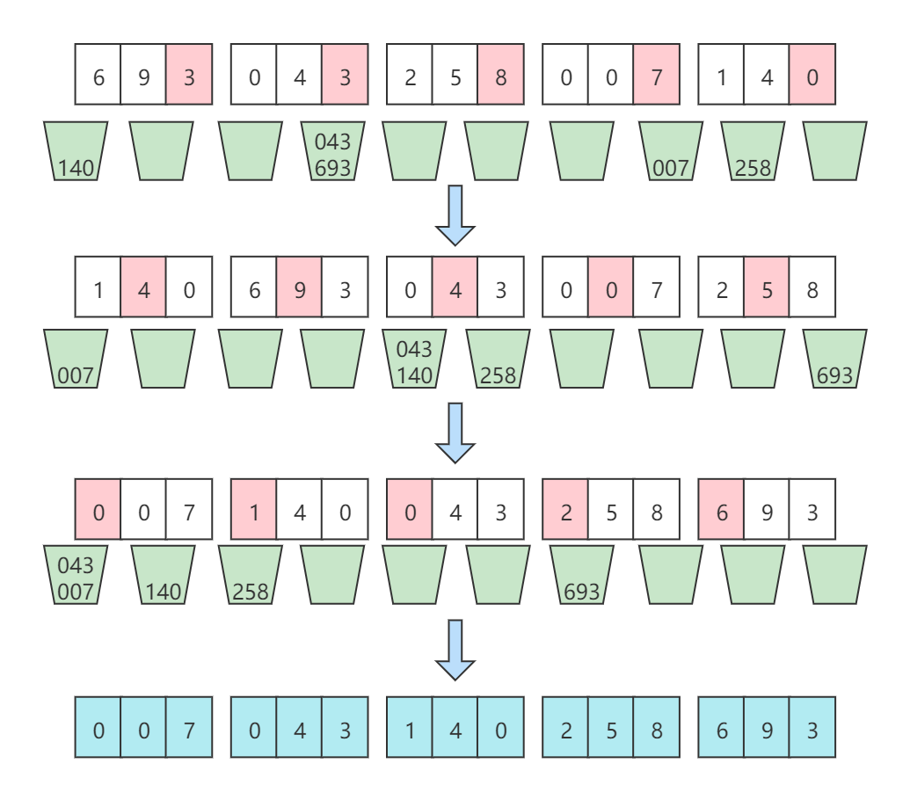
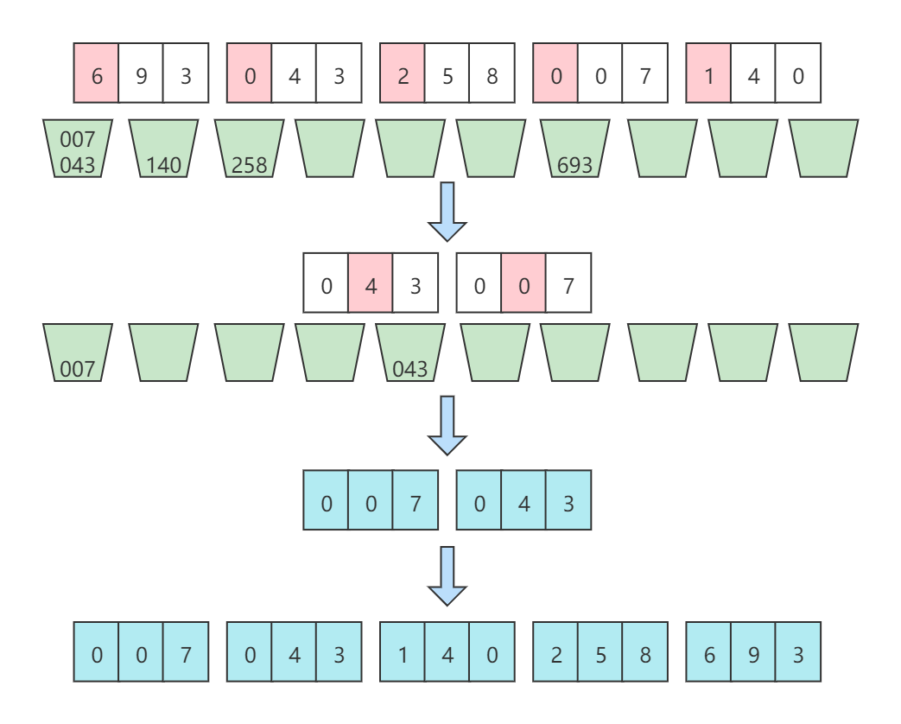

# 基数排序

[TOC]

## 算法简介

基数排序（radix sort），又称“桶子法”（bucket sort）或bin sort。基数排序的发明可以追溯到1887年赫尔曼·何乐礼在打孔卡片制表机(Tabulation Machine)上的贡献，因此有时候也叫卡片排序，因为它曾用于对老式穿孔卡片进行排序，直到现代计算机问世。

基数排序透过排序数列元素的部分信息，将要排序的元素分配至某些“桶”中，以达到排序的作用。基数排序是属于稳定性的排序。在某些时候，基数排序算法的效率高于其他的稳定性排序算法。

## 算法原理

将所有待排序数值（正整数）统一为相同数位的长度（如果数位较短，则高位补0），然后从最低位开始，依次以桶排序的方式进行排序（由于个位整数范围为0~9，因此只需要10个桶即可）。这样从最低位一直到最高位排序完成以后，数列就变成一个有序数列了。

基于这样的思想，还可以针对以ASCII码构建的字符串进行排序，同样的是从最低位字符一直排序到最高位字符。ASCII码的范围为0~256，因此，只需要256个桶即可。

因此，凡是符合这样特性的数据都可以以基数排序的方式进行排序。

基数排序的方式可以采用LSD（Least significant digital）或MSD（Most significant digital），LSD的排序方式是由键值的最右边开始，而MSD则相反，由键值的最左边开始。

> **稳定性**
>
> 为了保证基数排序的稳定性，往桶中放入元素时，需要遵循FIFO原则，即先放入桶的元素，在回填时需要先取出来回填。

## 算法示例

### LSD

序列{693, 43, 258, 7, 140}

第一趟基于个位排序： [140,  693,  43,  7,  258]
第二趟基于十位排序： [7,  140,  43,  258,  693]
第三趟基于百位排序： [7,  43,  140,  258,  693]

排序过程如下图所示：



### MSD

序列{693, 43, 258, 7, 140}

排序过程如下图所示：

1. 首先将所有元素以最高位（百位）排序。桶0中有两个元素。桶1,2,6中分别各有一个元素。
2. 依次迭代所有桶，桶0中有两个元素，递归再次以次高位（十位）进行基数排序。桶0和桶4中个分别一个元素。
3. 所有桶中不在有更多元素了，将元素回写到原始数组。最后排序完成。




## 算法实现

下面算法的实现是基于纯数字。对于不同的数据，其实现有一定的差异，但其应用的思想是一样的。

```java
/**
     * 创建并初始化桶。
     */
@SuppressWarnings("unchecked")
private List<Integer>[] createBuckets(int size) {
    ArrayList<Integer>[] buckets = new ArrayList[size];
    for (int i = 0; i < buckets.length; i++)
        buckets[i] = new ArrayList<>();
    return buckets;
}

/**
     * 查找最大值
     */
private int findMaxValue(int[] a) {
    int max = a[0];
    for (int i = 1; i < a.length; i++)
        if (a[i] > max) max = a[i];
    return max;
}

/**
     * 计算最大位数
     */
private int maximumPoint(int max) {
    int pos = 1;
    while ((max = max / 10) != 0) pos *= 10;
    return pos;
}
```

**LSD**

```java
public void sort(int[] a) {
    //创建并初始化桶
    List<Integer>[] buckets = createBuckets(10);
    //查找最大值
    int max = findMaxValue(a);
    //计算最大位数
    int pos = maximumPoint(max);
    //循环数字的每一位
    for (int i = 1; i <= pos; i *= 10) {
        //按当前位大小入桶
        for (int e : a) buckets[e / i % 10].add(e);
        //输出桶
        int idx = 0;
        for (List<Integer> bucket : buckets) {
            for (Integer e : bucket) a[idx++] = e;
            bucket.clear();
        }
    }
}
```

**MSD**

```java
public void sort(int[] a) {
    //查找最大值
    int max = findMaxValue(a);
    //计算最大位数
    int pos = maximumPoint(max);
    sort(a, pos);
}

private void sort(int[] a, int pos) {
    //创建并初始化桶
    List<Integer>[] buckets = createBuckets(10);
    //所有元素以pos位入桶
    for (int e : a)
        buckets[e / pos % 10].add(e);
    int o = 0;
    //迭代所有桶
    for (List<Integer> bucket : buckets) {
        //如果pos等于1，或者桶中元素只有一个
        if (pos == 1 || bucket.size() == 1) {
            for (Integer e : bucket)
                a[o++] = e;
        } else if (bucket.size() > 1) { //桶中元素数量大于1，再次次高位递归排序
            int[] a1 = new int[bucket.size()];
            for (int i = 0; i < bucket.size(); i++)
                a1[i] = bucket.get(i);
            sort(a1, pos /= 10); //递归
            //排序完成之后回调到源数组
            System.arraycopy(a1, 0, a, o, a1.length);
            //推进指针
            o += a1.length;
        }
    }
}
```

## 算法分析

**时间复杂度**

设待排序序列有n个记录，基数为r，d个关键字码。由于基数排序就是构建在桶排序之上，d个关键字码就需要进行d趟桶排序，而趟桶排序需要入桶n次和出桶n次操作，另外基数为r，即有r个桶，需要遍历r次，因此，每趟桶排序的时间复杂度为O(n+r)，d趟就是O(d(n+r))。因此基数排序的时间复杂度就是O(d(n+r))。

> - 关键字码：关键字就是待排序序列中的元素，而关键字码就是每个元素可以拆分的独立单元。例如546，就有三个关键字码，分别是5，4，6。
>- 基数：基数就是每个关键字码的取值范围，即在基数排序中对应多少个桶。

**空间复杂度**

基数排序所需要的辅助空间就是基于基数r个数的桶，假定每个桶的空间都充分利用，即所有桶的大小在每次排序时都刚好装下所有元素(桶为链表结构，每次排完序之后都清理桶了)，没有空间浪费，因此，空间复杂度为O(n)。

**稳定性**

基数排序是稳定的排序算法。

## 算法应用

基数排序从低位到高位进行排序，使得最后一次排序完成，数组有序。其原理在于对待排序的数据，整体权重未知的情况下，先按权重小的因子排序，然后在按权重大的因子排序。例如比较时间，先按日排序，再按月排序，最后在按年排序，仅需排序三次。

基数排序源于老式穿孔机，排序器每次只能看到一个列，很多教科书上的基数排序都是对数值进行排序，与老式穿孔机不同，数值的大小是已知的，将数值按位拆分再排序，无疑是很无聊且自找麻烦的事。算法的目的是找到最佳解决问题的方案，而不是把简单的事情搞的更复杂。因此基数排序更适合对时间、字符串等这些整体权值未知的数据进行排序。


