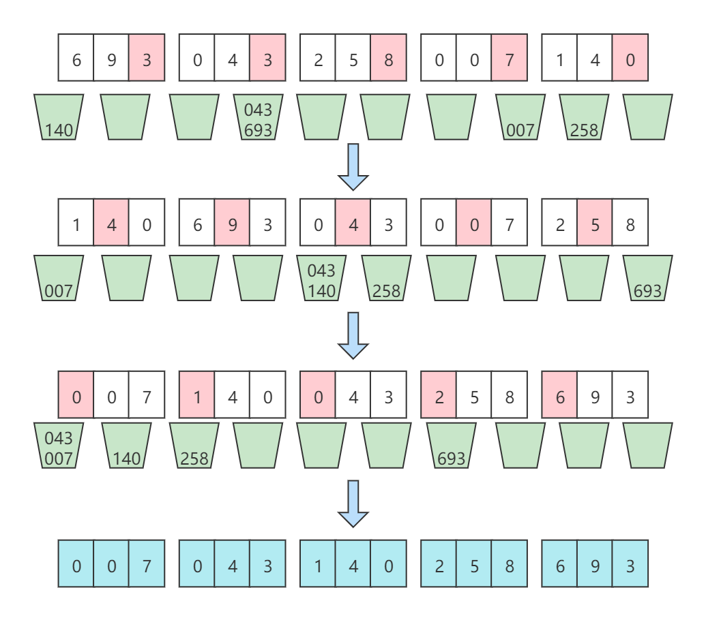

# 基数排序

[TOC]

## 算法简介

基数排序（radix sort），又称“桶子法”（bucket sort）或bin sort。基数排序的发明可以追溯到1887年赫尔曼·何乐礼在打孔卡片制表机(Tabulation Machine)上的贡献，因此有时候也叫卡片排序，因为它曾用于对老式穿孔卡片进行排序，直到现代计算机问世。

基数排序透过排序数列元素的部分信息，将要排序的元素分配至某些“桶”中，以达到排序的作用。基数排序是属于稳定性的排序。在某些时候，基数排序算法的效率高于其他的稳定性排序算法。

## 算法原理

将所有待排序数值（正整数）统一为相同数位的长度（如果数位较短，则高位补0），然后从最低位开始，依次以桶排序的方式进行排序（由于个位整数范围为0~9，因此只需要10个桶即可）。这样从最低位一直到最高位排序完成以后，数列就变成一个有序数列了。

基于这样的思想，还可以针对以ASCII码构建的字符串进行排序，同样的是从最低位字符一直排序到最高位字符。ASCII码的范围为0~256，因此，只需要256个桶即可。

因此，凡是符合这样特性的数据都可以以基数排序的方式进行排序。

基数排序的方式可以采用LSD（Least significant digital）或MSD（Most significant digital），LSD的排序方式是由键值的最右边开始，而MSD则相反，由键值的最左边开始。

> **稳定性**
>
> 为了保证基数排序的稳定性，往桶中放入元素时，需要遵循FIFO原则，即先放入桶的元素，在回填时需要先取出来回填。

## 算法示例

序列{693, 43, 258, 7, 140}

第一趟基于个位排序： [140,  693,  43,  7,  258]
第二趟基于十位排序： [7,  140,  43,  258,  693]
第三趟基于百位排序： [7,  43,  140,  258,  693]

排序过程如下图所示：



## 算法实现

下面算法的实现是基于纯数字。对于不同的数据，其实现有一定的差异，但其应用的思想是一样的。

算法实现如下：

```java
public void radixSort(int[] a) {
    //创建并初始化桶
    ArrayList<Integer>[] buckets = new ArrayList[10];
    for (int i = 0; i < buckets.length; i++) buckets[i] = new ArrayList<>();
    //查找最大值
    int max = a[0];
    for (int i = 1; i < a.length; i++)
        if (a[i] > max) max = a[i];
    //计算最大位数
    int pos = 1;
    while ((max = max /10) !=0) pos *= 10;
    //循环数字的每一位
    for (int i = 1; i <= pos; i *= 10) {
        //按当前位大小入桶
        for (int e : a) {
            buckets[e / i % 10].add(e);
        }
        //输出桶
        int idx = 0;
        for (ArrayList<Integer> bucket : buckets) {
            for (Integer e : bucket) {
                a[idx++] = e;
            }
            bucket.clear();
        }
    }
}
```

## 算法分析

**时间复杂度**

设待排序序列有n个记录，基数为r，d个关键字码。由于基数排序就是构建在桶排序之上，d个关键字码就需要进行d趟桶排序，而趟桶排序需要入桶n次和出桶n次操作，另外基数为r，即有r个桶，需要遍历r次，因此，每趟桶排序的时间复杂度为O(n+r)，d趟就是O(d(n+r))。因此基数排序的时间复杂度就是O(d(n+r))。

> - 关键字码：关键字就是待排序序列中的元素，而关键字码就是每个元素可以拆分的独立单元。例如546，就有三个关键字码，分别是5，4，6。
>- 基数：基数就是每个关键字码的取值范围，即在基数排序中对应多少个桶。

**空间复杂度**

基数排序所需要的辅助空间就是基于基数r个数的桶，假定每个桶的空间都充分利用，即所有桶的大小在每次排序时都刚好装下所有元素(桶为链表结构，每次排完序之后都清理桶了)，没有空间浪费，因此，空间复杂度为O(n)。

**稳定性**

基数排序是稳定的排序算法。

## 算法应用

基数排序从低位到高位进行排序，使得最后一次排序完成，数组有序。其原理在于对待排序的数据，整体权重未知的情况下，先按权重小的因子排序，然后在按权重大的因子排序。例如比较时间，先按日排序，再按月排序，最后在按年排序，仅需排序三次。

基数排序源于老是穿孔机，排序器每次只能看到一个列，很多教科书上的基数排序都是对数值进行排序，与老式穿孔机不同，数值的大小是已知的，将数值按位拆分再排序，无疑是很无聊且自找麻烦的事。算法的目的是找到最佳解决问题的方案，而不是把简单的事情搞的更复杂。因此基数排序更适合对时间、字符串等这些整体权值未知的数据进行排序。


### 典型

在一个文件中有10G个整数，乱序排列，要求找出中位数。内存限制为2G。只写出思路即可（内存限制为2G意思是可以使用2G空间来运行程序，而不考虑本机上其他软件内存占用情况。） 关于中位数：数据排序后，位置在最中间的数值。即将数据分成两部分，一部分大于该数值，一部分小于该数值。中位数的位置：当样本数为奇数时，中位数=(N+1)/2 ; 当样本数为偶数时，中位数为N/2与1+N/2的均值（那么10G个数的中位数，就第5G大的数与第5G+1大的数的均值了）。

分析：既然要找中位数，很简单就是排序的想法。那么基于[字节](https://baike.baidu.com/item/字节)的桶排序是一个可行的方法。

思想：将整型的每1byte作为一个关键字，也就是说一个整形可以拆成4个keys，而且最高位的keys越大，整数越大。如果高位keys相同，则比较次高位的keys。整个比较过程类似于字符串的[字典序](https://baike.baidu.com/item/字典序)。

第一步:把10G整数每2G读入一次内存，然后一次遍历这536,870,912即（1024*1024*1024）*2 /4个数据。每个数据用位运算">>"取出最高8位(31-24)。这8bits(0-255)最多表示256个桶，那么可以根据8bit的值来确定丢入第几个桶。最后把每个桶写入一个磁盘文件中，同时在内存中统计每个桶内数据的数量NUM[256]。

代价：(1) 10G数据依次读入内存的IO代价(这个是无法避免的，CPU不能直接在[磁盘](https://baike.baidu.com/item/磁盘)上运算)。(2)在内存中遍历536,870,912个数据，这是一个O(n)的线性[时间复杂度](https://baike.baidu.com/item/时间复杂度)。(3)把256个桶写回到256个磁盘文件空间中，这个代价是额外的，也就是多付出一倍的10G数据转移的时间。

第二步：根据内存中256个桶内的数量NUM[256]，计算中位数在第几个桶中。很显然，2,684,354,560个数中位数是第1,342,177,280个。假设前127个桶的数据量相加，发现少于1,342,177,280，把第128个桶数据量加上，大于1,342,177,280。说明，中位数必在[磁盘](https://baike.baidu.com/item/磁盘)的第128个桶中。而且在这个桶的第1,342,177,280-N(0-127)个数位上。N(0-127)表示前127个桶的数据量之和。然后把第128个文件中的整数读入内存。(若数据大致是均匀分布的，每个文件的大小估计在10G/256=40M左右，当然也不一定，但是超过2G的可能性很小)。注意，变态的情况下，这个需要读入的第128号文件仍然大于2G，那么整个读入仍然可以按照第一步分批来进行读取。

代价：(1)循环计算255个桶中的数据量累加，需要O(M)的代价，其中m<255。(2)读入一个大概80M左右文件大小的IO代价。

第三步：继续以内存中的某个桶内整数的次高8bit（他们的最高8bit是一样的）进行桶排序(23-16)。过程和第一步相同，也是256个桶。

第四步：一直下去，直到最低字节(7-0bit)的桶排序结束。我相信这个时候完全可以在内存中使用一次快排就可以了。

整个过程的[时间复杂度](https://baike.baidu.com/item/时间复杂度)在O(n)的线性级别上(没有任何[循环嵌套](https://baike.baidu.com/item/循环嵌套))。但主要时间消耗在第一步的第二次内存-磁盘数据交换上，即10G数据分255个文件写回磁盘上。一般而言，如果第二步过后，内存可以容纳下存在中位数的某一个文件的话，直接快排就可以了（修改者注：我想，继续桶排序但不写回磁盘，效率会更高？）。


