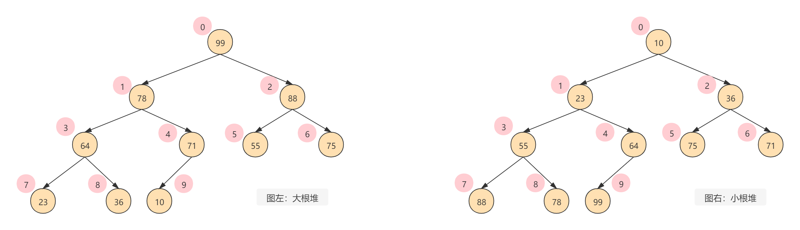
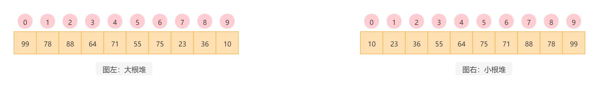
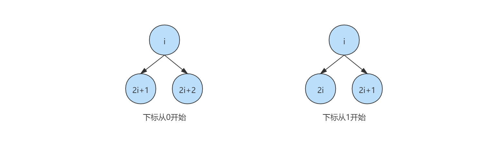
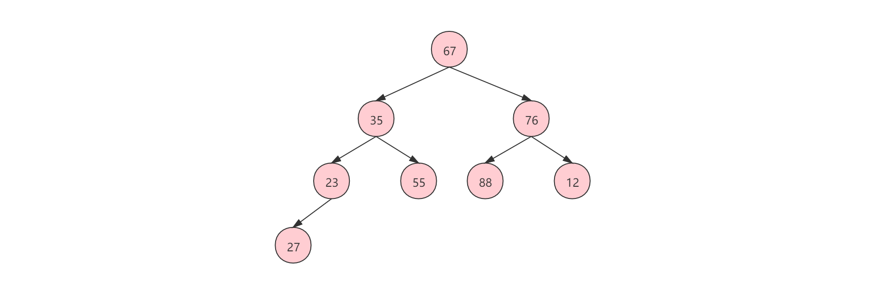
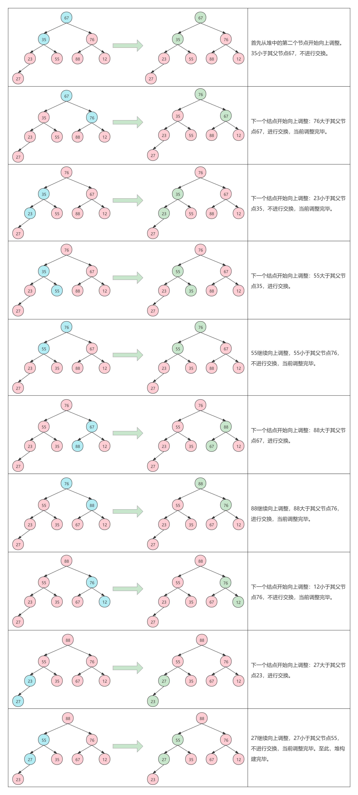
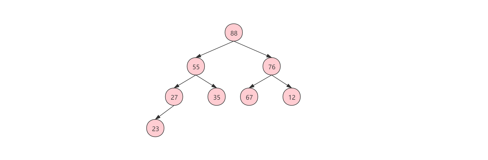

# 堆排序

## 目录

[TOC]


## Introduction

堆排序（英语：HeapSort）是指利用堆这种数据结构所设计的一种排序算法。堆是一个近似完全二叉树的结构。

## Summary

堆的**存储结构是一个一维数组**，但其**逻辑结构是一个完全二叉树**。堆有**大根堆**和**小根堆**之分。

- 大根堆：**大根堆是指每个节点的值都大于或等于其左右孩子结点的值**，如下图（左）所示，99为堆顶最大元素。

- 小根堆：**小根堆是指每个节点的值都小于或等于其左右孩子结点的值**，如下图（右）所示，10为堆顶最小元素。



将所有节点映射为数组，如下图所示：



> 注意：
>
> 无论是大根堆还是小根堆，其特性只需要满足每个节点的值都大于等于或小于等于其左右孩子结点的值即可，至于其左右孩子结点的值相互之间谁大谁小是不做区分的。

---

堆是由N（N≥1）个元素组成的序列{R₀,R₁,...,Rₙ₋₁}，并且满足以下关系：

- i从0开始（i = 0,1,2,...⌊n/2⌋-1），表达式如下：

  ```c
  Rᵢ.K ≥ R₂ᵢ₊₁.K                   Rᵢ.K ≤ R₂ᵢ₊₁.K
                      或
  Rᵢ.K ≥ R₂ᵢ₊₂.K                   Rᵢ.K ≤ R₂ᵢ₊₂.K
  ```

- i从1开始（i = 0,1,2,...⌊n/2⌋-1），表达式如下：

  ```c
  Rᵢ.K ≥ R₂ᵢ.K                     Rᵢ.K ≤ R₂ᵢ.K
                      或
  Rᵢ.K ≥ R₂ᵢ₊₁.K                   Rᵢ.K ≤ R₂ᵢ₊₁.K
  ```

满足左边表达式的称之为大根堆，满足右边表达式的称之为小根堆。

其对应节点关系如下图所示：


> Rᵢ代表节点（数组）的索引，K代表节点的元素。

**表达式证明**

i从0开始：

现假设i等于0，那么左孩子节点索引：2×i+1=1，右孩子节点索引：2×i+2=2

现假设i等于3，那么左孩子节点索引：2×i+1=7，右孩子节点索引：2×i+2=8

i从1开始：

现假设i等于1，那么左孩子节点索引：2×i=2，右孩子节点索引：2×i+1=3

现假设i等于3，那么左孩子节点索引：2×i=6，右孩子节点索引：2×i+1=7

证明结果刚好与图左图右的索引匹配。


根据上面的表达式，就可以请求出任意已知节点的*父节点*、*左孩子节点*和*右孩子节点*的索引。
设当前节点索引为`i`（i从0开始），其

- 父节点索引：|(i-1)÷2|
- 左孩子节点索引：2×i+1
- 右孩子节点所示：2×i+2

> 父节点索引，取(i-1)÷2结果的绝对值，在计算机程序中，直接是其整型。
>
> 例如：
> - i=7，(i-1)÷2=3
> - i=8，(i-1)÷2=3.5，取绝对值3。

---

**下标最大的非叶子节点**

公式：n÷2-1

---

## Building Heap

构建堆有两种方案：一种是从根节点出发，向下调整；一种是从儿子点出发，向上调整。

- 从根节点出发，向下调整：将指定节点（根）与其左右儿子节点中的最大或最小节点比较，如果大于或小于则交换。

- 从儿子点出发，向上调整：将指定节点（子）与其父节点进行比较，如果大于或小于则交换。

已知有堆（数组）：[67,35,76,23,55,88,12,27]

初始堆结构（完全二叉树）如下：



### 向下调整

- 大根堆调整：取根节点元素和其左右儿子节点中的最**大**元素进行比较，如果根节点元素**小**于左右儿子节点中的最**大**元素，则进行交换。然后继续向下调整，直到根节点元素**大**于或等于其左右儿子节点中的最**大**元素，或者其左右儿子都不存在为止。

- 小根堆调整：取根节点元素和其左右儿子节点中的最**小**元素进行比较，如果根节点元素**大**于左右儿子节点中的最**小**元素，则进行交换。然后继续向下调整，直到根节点元素**小**于或等于其左右儿子节点中的最**小**元素，或者其左右儿子不存在为止。

NOTE：大根堆和小根堆调整的差异只是比较对象大于小于的不同，其方式都是一样的。

具体构建流程 - 以大根堆调整为例：

因为从根节点出发，向下调整，所以，首先需要从索引最大的根节点开始，即下标最大的非叶子节点（n÷2-1），如下图所示，最大的非叶子节点是23。


### 向上调整

- 大根堆调整：取儿子节点与其父节点比较，如果尾节点**大**于其父节点，则进行交换，然后继续向上调整，直到调整到根节点结束，或者尾节点**小**于或等于其父节点为止。
- 小根堆调整：取儿子点与其父节点比较，如果尾节点**小**于其父节点，则进行交换，然后继续向上调整，直到调整到根节点结束，或者尾节点**大**于或等于其父节点为止。

具体构建流程 - 以大根堆调整为例：

从堆的第二个节点开始，依次与其父节点比较，如果大于其父节点，则进行交换，然后继续向上调整。重复此过程，直到调整到根节点结束，或者儿子点**小**于或等于其父节点为止。



## Adjust Heap

上述无论是向下调整还是向上调整，其核心都是比较并交换，而每一次比较并交换都是一次调整，只需要重复这个过程就可以完成堆的调整。

## Heap Sort

上述已经通过向上或向下调整完成了堆构建，虽然其已经满足了大根堆和小根堆的要求，但是其并不是有序的。要将其变得有序，可以通过“**固定最大值再构造堆**”的方法。

### 固定最大值再构造堆

首先将堆顶元素（即当前堆中的最大元素）与末尾元素交换，然后将剩余的元素再重新构建成大根堆，此时末尾元素不再参与堆的构建（固定在最尾部），然后一直重复此过程，最终完成堆排序。

同样以大根堆从小到大排序为例，已知有大根堆如下：

已知有大根堆如下：



基于“固定最大值再构造堆”排序：


完整流程：

```
             交换前                               交换后
[88, 55, 76, 27, 35, 67, 12, 23]	[23, 55, 76, 27, 35, 67, 12, 88]
[76, 55, 67, 27, 35, 23, 12, 88]	[12, 55, 67, 27, 35, 23, 76, 88]
[67, 55, 23, 27, 35, 12, 76, 88]	[12, 55, 23, 27, 35, 67, 76, 88]
[55, 35, 23, 27, 12, 67, 76, 88]	[12, 35, 23, 27, 55, 67, 76, 88]
[35, 27, 23, 12, 55, 67, 76, 88]	[12, 27, 23, 35, 55, 67, 76, 88]
[27, 12, 23, 35, 55, 67, 76, 88]	[23, 12, 27, 35, 55, 67, 76, 88]
[23, 12, 27, 35, 55, 67, 76, 88]	[12, 23, 27, 35, 55, 67, 76, 88]
```

NOTE：基于“**固定最大值再构造堆**”排序之后，原大根堆变成了小根堆，小根堆变成了大根堆你，并且使有序的。

## 实现

### Java - 向下调整

源码如下：

```java
import java.util.Arrays;
import java.util.function.Function;

/**
 * 基于向下调整实现的堆排序算法。
 *
 * @param <T>
 */
public class HeapSort<T extends Comparable<T>> {

    private final T[] heap;

    private final int size;

    /**
     * big or small => 大根堆 or 小根堆；默认大根堆。
     */
    private final boolean bos;

    /**
     * Maximum non-leaf node index.
     */
    private static final Function<Integer, Integer> f = i -> (i >> 1) - 1;

    public HeapSort(T[] heap) {
        this.heap = heap;
        this.size = heap.length;
        this.bos = true;
    }

    public HeapSort(T[] heap, boolean bos) {
        this.heap = heap;
        this.size = heap.length;
        this.bos = bos;
    }

    /**
     * 固定最大值再构造堆排序：首先将堆顶与堆尾交换，然后从堆顶出发，将剩下的重新调整为堆。
     * 如果是大根堆，则排序结果是从小到大。如果小根堆，则排序结构是从大到小。
     */
    public void sort() {
        for (int tail = size - 1; tail > 0; tail--) {
            //堆顶与堆尾交换
            swap(0, tail);
            //从堆顶出发，将剩下的重新调整为堆
            heapAdjust(0, f.apply(tail), tail);
        }
    }

    public void build() {
        for (int i = f.apply(size), n = i; i >= 0; i--)
            heapAdjust(i, n, size);
    }

    @Override
    public String toString() {
        return Arrays.toString(heap);
    }

    /**
     * 堆调整：向下调整。
     *
     * @param i    出发节点索引
     * @param n    最大非叶子结点索引
     * @param size 堆大小
     */
    private void heapAdjust(int i, int n, int size) {
        while (i <= n) {
            int l = (i << 1) + 1, r = l + 1;
            //计算i要交换的叶子结点索引（计算完成之后局部变量l和r的使命已经完成，复用）
            l = r < size && !compare(l, r) ? r : l;
            if (compare(i, l)) break;
            swap(i, l);
            i = l;
        }
    }

    private boolean compare(int i, int j) {
        int k = heap[i].compareTo(heap[j]);
        return k == 0 || bos ? k > 0 : k < 0;
    }

    private void swap(int i, int j) {
        T t = heap[i];
        heap[i] = heap[j];
        heap[j] = t;
    }
}
```

### Java - 向上调整

源码如下：

```java
import java.util.Arrays;

/**
 * 基于向上调整实现的堆排序算法。
 * @param <T>
 */
public class HeapSort<T extends Comparable<T>> {

    private final T[] heap;

    private final int size;

    /**
     * big or small => 大根堆 or 小根堆；默认大根堆。
     */
    private final boolean bos;

    public HeapSort(T[] heap) {
        this.heap = heap;
        this.size = heap.length;
        this.bos = true;
    }

    public HeapSort(T[] heap, boolean bos) {
        this.heap = heap;
        this.size = heap.length;
        this.bos = bos;
    }

    /**
     * 固定最大值再构造堆排序：首先将堆顶与堆尾交换，然后将剩下的重新调整为堆。
     * 如果是大根堆，则排序结果是从小到大。如果小根堆，则排序结构是从大到小。
     */
    public void sort() {
        for (int tail = size - 1; tail > 0; tail--) {
            //堆顶与堆尾交换
            swap(0, tail);
            //将剩下的重新调整为堆
            build(tail);
        }
    }

    public void build() {
        build(size);
    }

    private void build(int size) {
        for (int i = 1; i < size; i++) {
            heapAdjust(i);
        }
    }

    @Override
    public String toString() {
        return Arrays.toString(heap);
    }

    private void heapAdjust(int i) {
        while (i > 0) {
            //父节点索引
            int p = (i - 1) >> 1;
            //子节点小于等于父节点则退出
            if (compare(p, i)) break;
            //交换
            swap(i, p);
            //递减索引
            i = p;
        }
    }

    private boolean compare(int i, int j) {
        int k = heap[i].compareTo(heap[j]);
        return k == 0 || bos ? k > 0 : k < 0;
    }

    private void swap(int i, int j) {
        T t = heap[i];
        heap[i] = heap[j];
        heap[j] = t;
    }
}
```

## 附录

参考资料：

[【面朝大厂】堆排序算法（图解详细流程）](https://mp.weixin.qq.com/s/7yfV6xukjvKWZfkyGQiSTA)

[百度百科 堆排序](https://baike.baidu.com/item/%E5%A0%86%E6%8E%92%E5%BA%8F/2840151?fr=aladdin)

